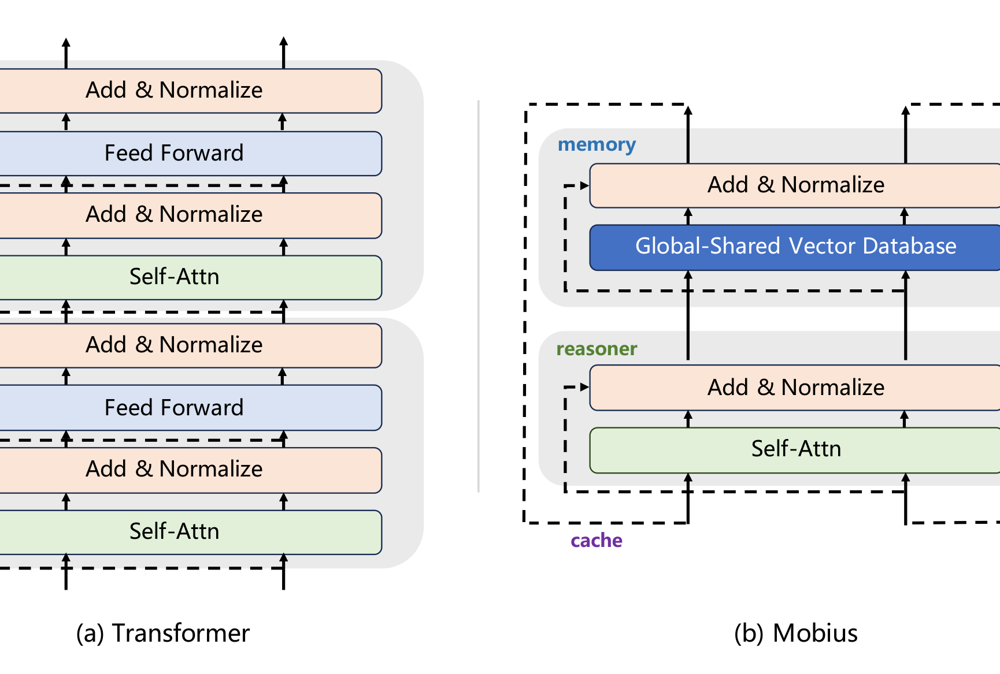
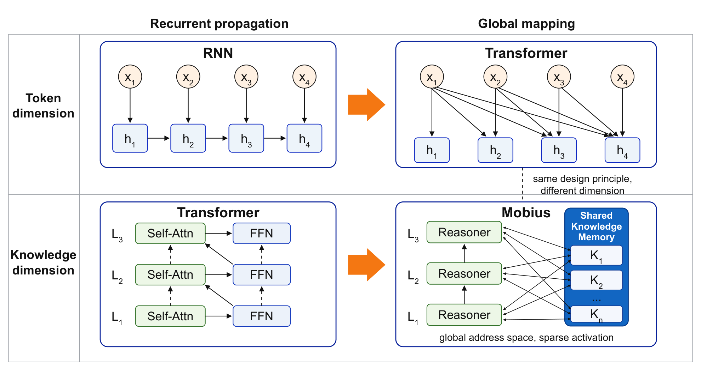

# Intern-S2-Mobius 技术报告

## 来源

- **PDF**：`raw/2608.14290.pdf`（arXiv:2608.14290v1，21 页，2026-08-14）
- **标题**：Intern-S2-Mobius: Foundation Model with Decoupled Knowledge and Reasoning
- **团队**：Intern-S2-Mobius Team，Shanghai AI Laboratory
- **模型**：[Intern-S2-Mobius](../models/intern-s2-mobius.md)
- **权重**：[internlm/Intern-S2-Mobius](https://huggingface.co/internlm/Intern-S2-Mobius)（报告首页链接）

## 核心结论

Mobius 的主张不是把 Self-Attention 换成线性层或稀疏 attention，而是把各层绑定的 FFN 横向拼成全局共享的 knowledge-vector Memory；多个 Self-Attn **Reasoner** 反复从同一 Memory 取知识、以 hidden state 作 cache 做 latent 迭代。作者将这种“每个推理层都可读全体知识”的间接实现称为 **Backward Residual Connection（BRC）**，并将少量层内反复更新、最后同步解码多个 token 称为 **Dynamic Latent Reasoning**（原文 §2）。

> Figure 1（原文截图，§1）：“The Comparison between Transformer and Mobius.” 图中的关键结构是 Shared Vector Database 与 Reasoner/Memory/Cache 三分，而非单纯增加一条 residual 边。

两组原文实证应分开看：

| 设置 | 原文观察 | 能支持的结论 |
| --- | --- | --- |
| 从头训练 | 两个 7B-A1B MoE 分别用 Mobius / Transformer 在 1T tokens 训练；Mobius 达到 Transformer 1T MMLU 分数只需 0.626T tokens。 | 在该单一配对设置中，MMLU 指向约 **1.6× 数据效率**，不是一般 scaling law。 |
| 架构转换 + 持续预训练 | 从 Qwen3.5-35B-A3B checkpoint 切到 Mobius，继续预训练 1T tokens，再 SFT + RL。Table 1 的综合平均为 67.88，对照 65.05；科学任务平均 52.14，对照 18.20。 | 该 conversion 在报告列出的评测上没有损失基本能力，且作者报告更短 CoT / 更高 request throughput；它不是从零同架构消融。 |

作者将端到端速度主要归因于可见 CoT 更短：Figure 4 中平均输出长度约为对照的 1/1.5；线性代数示例中两者均答对，但 Mobius 516 token、Qwen3.5 2,364 token（Table 2）。**“latent reasoning 导致更短 CoT”是作者尚未充分证实的机制解释**；原文明确说 precise mechanism remains to be established，不能把个例或长度差直接升级为因果证明。

## 架构与训练

### 知识–推理解耦（原文确证，§2.1–§2.3）

传统层内，FFN 被视为 knowledge-vector pool、hidden state 传递信息、Self-Attn 做组合推理；因每层 FFN 彼此绑定，作者认为跨层知识访问受层级和前向 residual 限制。Mobius 将所有 FFN 以水平拼接构成 Memory，让每层 Reasoner 对同一知识池检索；在大模型上再按类似 MoE 的 block 划分做稀疏激活，避免全量 activation。

这和 [Attention Residuals](../concepts/attention-residuals.md) 的边界要分清：AttnRes 是**从先前层的激活表示**作 depth attention；Mobius 的 BRC 是**所有层访问共享的 FFN 参数/知识向量库**。两者都试图缓和层级信息瓶颈，但接口、状态和计算代价不同。

> Figure 5（原文截图，§4）：“The comparison between RNN, Transformer, and Mobius.” 作者的核心类比是把 token 维的全局映射原则移到“knowledge dimension”，并非证明 Mobius 已实现双向 layer activation。

### Dynamic Latent Reasoning（原文确证，§2.2；效用解释仍属推断）

作者把连续 hidden state 当作比离散 token 密度更高的中间载体：Reasoner 可在极少数层内反复查询 Memory、迭代 latent，再在较深处联合作出多 token 解码。报告将它与 continuous thought、looped language model、额外 latent computation 和 diffusion language model 并列（§4.1），但没有给出可复现的 loop 次数、每次检索形式或单独 ablation。

因此，下面两层结论不可混淆：

- **原文确证**：报告确实提出 cache-mediated latent iteration、多 token parallel prediction 和更短可见 reasoning trace。
- **推断 / 未证实机制**：短 CoT 是否来自更有效的内部反复推理、是否保留同样的 robustness，及其对分布外任务是否成立，尚缺 intervention 或消融。

### 继续训练留下的路由先验（原文确证，Appendix B）

Figure 6 显示，从头训练的 Mobius-7B 专家激活较均匀；由 Qwen3.5 架构转换并持续预训练的 35B 版本则仍有明显 block-diagonal expert-routing pattern。作者的谨慎解释是 conversion 能扩宽 expert 使用范围，但没有完全抹除原 checkpoint 的 layer-specific routing prior；是否变成更强能力，仍需同规模受控实验。

## 后训练

报告只说明 conversion 后依次进行了 SFT 和 RL，**未披露**具体优化算法、数据规模、reward、rollout / harness 或 serving kernel。因此它不是 agentic 后训练方案的可比证据；本页把它沉淀为架构和 latent-reasoning 证据，避免与 [Agentic 模型的后训练](../concepts/post-training-for-agentic-models.md) 中有训练细节的报告混读。

## 评测要点

| 范围 | Intern-S2-Mobius-35B | Qwen3.5-35B | 证据定位 |
| --- | ---: | ---: | --- |
| General AVG | 67.88 | 65.05 | Table 1；报告列出的 9 项 general benchmarks 的未加权平均 |
| MMLU Pro | 89.05 | 85.31 | Table 1 |
| AIME 2026 | 95.31 | 92.08 | Table 1 |
| Scientific AVG | 52.14 | 18.20 | Table 1；三个生物/分子任务，样本与 contamination 控制未在表中展开 |

这些都是作者在同页表中给出的模型对比，不能当作与不同 harness、推理预算或版本的外部模型直接横比。特别是科学任务大差距缺少数据分布和训练目标的完整披露，现阶段适合视为值得复核的信号，而非通用科学发现能力结论。

## 待追问

- **BRC 的可操作定义**：共享 FFN 参数本身不等于同一次 forward 的深层 activation 回流；Reasoner 对 Memory 的具体 query/key/value、跨层同步方式和梯度路径尚未公开。
- **效率分解**：报告同时称 shared Memory 会提高 retrieval 压力，又报近 4× 端到端速度。需要按 prefill / decode、同输出长度、batch、硬件和 kernel 拆分，才能判断收益主要来自结构还是更短输出。
- **公平的 conversion 基线**：Qwen3.5 checkpoint 转 Mobius 后继续训 1T tokens，而 Table 1 的 Qwen3.5 对照是否也经过等量继续训练、相同 SFT/RL，报告未明确。
- **latent reasoning 的因果证据**：没有 loop次数 / latent-step / MTP acceptance 的 ablation；Table 2 只是一个正确样本，不能证明内部 latent 过程取代了必要的外显 deliberation。
- **自演化、world model、科学发现和 SSD–GPU 分层部署**：§5 都是作者定位或潜力展望，报告也承认需要系统、数据、训练和硬件协同验证，尚无实证。

## 相关页面

- 模型：[Intern-S2-Mobius](../models/intern-s2-mobius.md)
- [Attention Residuals](../concepts/attention-residuals.md)（与 BRC 的跨层信息接口边界）
- [Looped Transformers](../concepts/looped-transformers.md)（Mobius 采用 latent recurrence，但不等同参数共享 loop）
- [多 token 预测](../concepts/multi-token-prediction.md)（原生支持多 token 解码的主张）
- [2026 前沿模型技术报告对比](../comparisons/2026-open-model-technical-reports.md)
