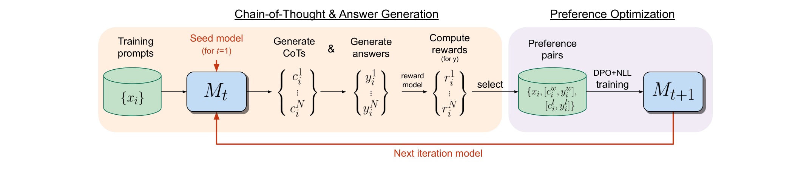
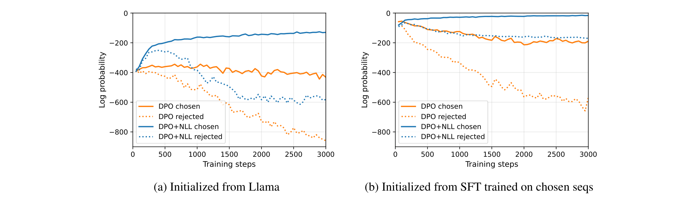
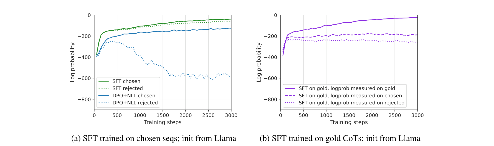

# Iterative RPO：Iterative Reasoning Preference Optimization

## 来源

- 文件：`raw/Pang 等 - 2024 - Iterative Reasoning Preference Optimization.pdf`
- 标题：Iterative Reasoning Preference Optimization
- 团队 / 日期：Richard Yuanzhe Pang、Weizhe Yuan、Kyunghyun Cho、He He、Sainbayar Sukhbaatar、Jason Weston；FAIR at Meta + NYU；arXiv:2404.19733v3，2024-06-26
- arXiv：<https://arxiv.org/abs/2404.19733>
- 工程入口：Hugging Face TRL `DPOConfig.rpo_alpha`（论文建议 $\alpha=1.0$）
- 定位：这是 **DPO 损失上给 winner 再加一条 SFT** 的算法论文，不发布独立模型。主实验是 Llama-2-70B-Chat，任务是 GSM8K / MATH / ARC-Challenge。
- 易混：本页是 TRL 叫 `rpo_alpha` 的那篇。不要写成 [Regularized Preference Optimization](https://arxiv.org/abs/2405.16436)（同样 DPO+SFT，但 $\eta$ 约 0.005，动机是防 proxy 过优化），也不要写成 ORPO（SFT + odds-ratio，无 reference model）。

## 核心结论

1. **纯 DPO 在 reasoning 上不够**：Iterative DPO / Self-Rewarding 一类方法在指令跟随上有效，对标准 reasoning 只中等增益甚至掉点。本方法在当前模型上采多条 CoT，按最终答案对错造 pair，再用 **DPO + winner 上的 NLL** 训练，然后迭代（§1、Eq. 1）。
2. **NLL 项是承重墙，不只是初始化**：GSM8K 第一轮 DPO+NLL 73.1%，同数据标准 DPO 61.8%，从 SFT-on-chosen 再跑 DPO 也只有 60.3%。Figure 3 显示无 NLL 时 chosen 的 sequence logprob 随训练下降，有 NLL 则上升（§3.1）。
3. **SFT 单独做会把 rejected 一起抬上去**：只在 chosen 上 SFT 时，rejected 的 logprob 几乎同步升高（Figure 2a）；DPO+NLL 则抬 chosen、压 rejected。这解释了为何 STaR 式 SFT（65.2%）落后第一轮 Iterative RPO（73.1%）。
4. **迭代有用，不只是多数据**：GSM8K 四轮 73.1 → 78.0 → 81.1 → 81.6；第一轮把 pair 数加倍只到 74.8，仍低于两轮 78.0。增益递减（17.5 / 4.9 / 3.1 / 0.5 个百分点），作者归因于 prompt 集固定（Table 1、§3.1）。
5. **边界**：reward 只看最终答案精确匹配，不监督中间 CoT；训练 prompt 固定、不扩题；ARC 是四选一，对的 CoT 可能碰巧；与 MetaMath / WizardMath 的数据扩增正交且未组合。TRL 的 `rpo_alpha` 实现的是 Eq. 1 的损失，**不自动做论文里的多轮重新采样**。

## 架构与训练

每轮两步（Figure 1）：(i) 用 $M_t$ 对每个训练题采 $N$ 条 CoT+答案，用 gold 标签给二元 reward；(ii) 从对/错集合里配 $K$ 对，用 DPO+NLL 训出 $M_{t+1}$，参考模型是上一轮 $M_t$。

> 论文 Figure 1 原文标题："Iterative Reasoning Preference Optimization. Our iterative preference optimization method consists of two steps: (i) Chain-of-Thought & Answer Generation … (ii) Preference Optimization … This whole procedure is then iterated … until performance saturates."（第 2 页）

Eq. 1（每个 pair）：

$$
\mathcal{L}_{\mathrm{DPO+NLL}}=\mathcal{L}_{\mathrm{DPO}}(c^w,y^w,c^l,y^l\mid x)+\alpha\,\mathcal{L}_{\mathrm{NLL}}(c^w,y^w\mid x)
$$

NLL 按响应总长度归一化。$\alpha$ 在 $\{0.25,0.5,1,2\}$ 里扫过，全文用 **$\alpha=1$**；DPO 的 $\beta$ 用 $0.1$。没有正确生成时，GSM8K / MATH 会把 gold 人工解塞进 winner 集；ARC 没有 gold CoT，没有正确生成的题直接丢掉。

这就是 TRL `rpo_alpha`：`loss = DPO + rpo_alpha * NLL(chosen)`，论文建议 `rpo_alpha=1.0`。

## 后训练

论文的完整 recipe 还有 **迭代**：固定同一批训练题，用新模型重新采样 pair。作者把它写成比 Self-Rewarding LLM 更简单的实例：不造新 prompt、不用 LLM-as-judge（用 gold 答案），但把标准 DPO 换成 DPO+NLL（§2 Iterative training）。

和 [VAPO](vapo.md) 的 positive-example LM loss 是同一类补丁——给正样本额外 NLL——只是 VAPO 加在 PPO 上（$\mu=0.1$），本页加在 DPO 上（$\alpha=1$）。

## 评测要点

基座一律 Llama-2-70B-Chat，只用各任务训练集，不用 MATH pretraining corpus / ARC Corpus。测试 greedy 单条，另报 32 样本 majority vote（temp 0.8）。

| 设置 | GSM8K | ARC-Challenge | MATH |
| --- | ---: | ---: | ---: |
| Zero-shot / few-shot CoT | 55.6 | 77.8 | 12.5 |
| 同上 + maj@32 | 70.7 | 82.9 | 18.8 |
| SFT on gold CoT / chosen | 63.5 / — | — / 79.8 | — / 16.8 |
| 标准 DPO（同第一轮 pair） | 61.8 | 82.8 | 12.4 |
| DPO 从 SFT-on-chosen 初始化 | 60.3 | 83.5 | 10.5 |
| Iterative RPO 第 1 轮 | 73.1 | 84.8 | 17.7 |
| 最后一轮（GSM8K 第 4 / 其余第 3） | **81.6** | **86.7** | **20.8** |
| 最后一轮 + maj@32 | 88.7 | 87.9 | 29.1 |

MATH 上标准 DPO 相对基座是掉点的（12.4 / 10.5 vs 12.5）。作者把 NLL 必要性推广到 Figure 4 的 ARC / MATH 曲线。

> 论文 Figure 3 原文标题："Effect of NLL loss term on DPO training for GSM8K. … the log probability of chosen sequences in standard DPO without NLL loss (solid orange) decreases over training steps, especially if the model is initialized from SFT training on chosen sequences (right). However, they increase over training steps when using DPO with NLL loss (solid blue)."（§3.1 / 第 6 页）

> 论文 Figure 2 原文标题："Effect of SFT training. (a) Although SFT training (solid green) is on chosen sequences … only, the rejected sequence log probabilities (dotted green) also increase … In contrast, our DPO+NLL training (blue) manages to decrease the rejected probabilities while increasing the chosen probabilities."（§3.1 / 第 5 页）

## 与其他页面的关系

- [DPO](dpo.md)：本页的 $\mathcal{L}_{\mathrm{DPO}}$ 就是 DPO Eq. 7；NLL 是后加的、原文没有的项。DPO 页待追问里「后续偏好方法」现在有这一条可核的一手来源。
- [VAPO](vapo.md)：positive-example LM loss 是 PPO 版「正样本再 SFT 一遍」；权重 $\mu=0.1$，本页 $\alpha=1$。
- [LLM RL policy optimization 对比](../comparisons/llm-rl-policy-optimization.md)：仍不进 GRPO 主表。迭代采样让 pair 来自当前策略，但更新还是 DPO+NLL，不是 clipped policy gradient。
- Regularized Preference Optimization（[2405.16436](https://arxiv.org/abs/2405.16436)）公式外形相近，TRL 现在也能用 `loss_type=["sigmoid","sft"]` 复现，但推荐 SFT 权重是 0.005 不是 1.0。

## 待追问

- $\alpha=1$ 的 NLL 会不会在非 reasoning、开放式偏好上把模型拉回 SFT 分布、削弱 DPO 的 KL 约束？论文只在三个有 gold 答案的任务上扫过 $\alpha$。
- 中间错误但最终答案对的 CoT 会进 winner 集；ARC 四选一噪声更大。没有 CoT 级 verifier 消融。
- TRL `rpo_alpha` 默认不迭代。单轮 DPO+NLL 相对完整四轮的增益，除 GSM8K Table 1 外没有跨任务拆开。
- 与 [DAPO](dapo.md) / GRPO 的 RLVR 栈如何衔接，原文没有讨论。

## 相关页面

- 比较：[LLM RL policy optimization 对比](../comparisons/llm-rl-policy-optimization.md)
- 相邻算法：[DPO](dpo.md)、[VAPO](vapo.md)、[DAPO](dapo.md)
- 概念：[Agentic 模型的后训练](../concepts/post-training-for-agentic-models.md)
