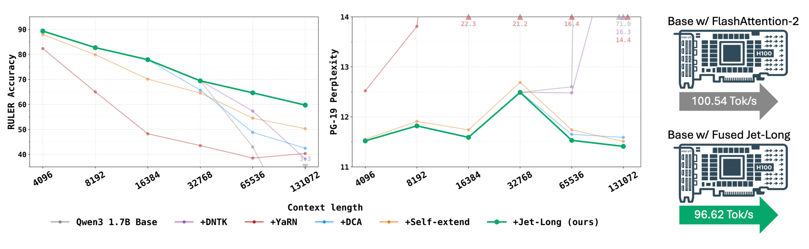
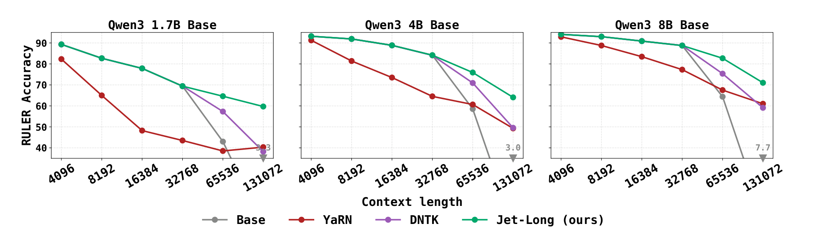

# Jet-Long：Dynamic Bifocal RoPE 零样本长上下文扩展

## 来源

- 文件：`raw/2607.07740v2.pdf`
- 标题：Jet-Long: Efficient Long-Context Extension with Dynamic Bifocal RoPE
- 团队 / 日期：Haozhan Tang, Zerui Wang, Yuxian Gu, Song Han, Han Cai（NVIDIA）；通讯作者 Han Cai；arXiv:2607.07740v2，2026-07-10（v1 2026-07-08）
- 代码：[jet-ai-projects/jet-long](https://github.com/jet-ai-projects/jet-long)
- 定位：**方法论文，非模型报告**。不发布新权重；在已有 [Qwen3](../models/qwen3.md) 1.7B/4B/8B-Base（原生训练窗 32K）上做 tuning-free 推理扩展到 128K，并迁移到 hybrid Jet-Nemotron-2B/4B。机制归属 [零样本 RoPE 上下文扩展](../concepts/zero-shot-rope-context-extension.md)，与稀疏 / 线性注意力是互补轴而不是替代。

## 核心结论

1. **零样本扩展是开源权重的主部署路径**。长文档 QA、仓库级代码、RAG 和 agentic 轨迹经常把输入推到预训练窗的一个数量级之外；直接训长上下文既贵又容易伤短窗表现。主流零样本方法（YaRN / Self-Extend / DCA）**预先固定一个缩放因子**：激进则伤短窗，保守则长窗崩。长度自适应变体（AdaGroPE / LaMPE / SELF）用拟合或距离相关日程，需要 per-model 调参（§1、§2.2）。
2. **Jet-Long：双焦点 + 解析式动态 G**。局部窗 $w_0$ 保留原版 RoPE（预训练行为原样）；远程窗把位置别名到训练网格，$G=\max(1,\lceil L/w_{\text{pretrained}}\rceil)$，$f(x)=\lfloor x/G\rfloor$。$L\le w_{\text{pretrained}}$ 时 $G=1$、$f$ 是恒等，**数学上退回基座**（§3.1、Eq. 2–3）。
3. **推理几乎免费**。KV cache 只存未压缩的基座位置；远程视图用 RoPE 可加性 $R_a R_b=R_{a+b}$ 在寄存器里做 correction rotation，**G 中途变了也不重写 cache**。Prefill 用 inclusion–exclusion 三次 FlashAttention 合并，融进单一 CuTe kernel 后，Qwen3-8B 在 H100 上 64K–128K prefill 达 FA2 的 1.28–1.39×（逼近 Hopper-only FA4 的 1.53×），decode 各长度 ≥0.96× FA2（§3.2–3.3、§4.6、Table 7）。
4. **Qwen3 三尺寸上领先最强零样本基线**。RULER 13 任务 × 7 长度平均：相对最强基线 +4.79 / +2.18 / +2.03 pp（1.7B/4B/8B）。HELMET-RAG 在 4B/8B 最优，1.7B 落后 Self-Extend 0.73 pp。PG-19 三尺寸都最低。官方 Qwen3 推理配方（YaRN factor=4，32K→128K）在这篇的对照里是最弱的一组之一，1.7B 上甚至低于不扩展的 Base（RULER 52.99 vs 60.93）（Table 1、Appendix C）。
5. **可迁到 hybrid 注意力、超参不敏感**。Jet-Nemotron-2B/4B 上 32K 内与基座一致，128K RULER 从崩掉的 8.54 / 5.65 拉到 33.78 / 33.14。唯一超参 $w_0$ 在 {512, 1024, 2048, 4096} 内任意单长度差 ≤2 pp（Table 4、Table 5）。

> Figure 1（原文截图，摘要旁）："Comparison between Jet-Long and baseline methods, applied on Qwen3-1.7B-Base, on per-length accuracy aggregated over all 13 RULER tasks and per-length perplexity in PG-19, alongside single-batch generation throughput on H100 at 128K context (the worst length we test). Jet-Long achieves the highest accuracy and lowest perplexity at extended context lengths, preserves the base model’s pretrained performance within the training context, and incurs ≤4% latency overhead relative to FlashAttention-2."

## 机制（已据原文核实）

RoPE 模型越出训练窗有两个失败模式（§2.1）：**(i) 位置 OOD**——低频分量的旋转角超出训练分布；**(ii) softmax 扩散 + 中间位置偏差**。Jet-Long 只打第一条：把远程相对角别名回预训练见过的离散网格。第二条留给稀疏 / 线性 / SSM 等架构（§5）。

它继承 Self-Extend 的双窗分解（DCA 是「三路」近亲）：查询 $q$、键 $k$ 的预 softmax 分数（Eq. 1）

$$
S(q,k)=\begin{cases}
\mathrm{RoPE}(x_q,q)^\top\mathrm{RoPE}(x_k,k) & q-k\le w_0\\
\mathrm{RoPE}(x_q,f(q))^\top\mathrm{RoPE}(x_k,f(k)) & q-k>w_0
\end{cases}
$$

> Figure 2（原文截图，§3 开篇）："Overview of Jet-Long. (a) The local window of width $w_0$ keeps classic RoPE; remote keys are routed through a dynamic position map $f(x)=\lfloor x/G\rfloor$ with $G=\max(1,\lceil L/w_{\text{pretrained}}\rceil)$, so the remote group size adapts to the current context length $L$. (b) At generation time, the KV cache stores positions in the original coordinate. An on-the-fly rotation pair ($\Delta q$ on the active query, $\Delta k$ on each cached key) is fused into FlashAttention to realize the remote view, leaving the cache unchanged. (c) Prefill is computed by an inclusion–exclusion combination of three FlashAttention calls (full remote, local-only-with-RoPE, local-only-with-remap), stabilized via LogSumExp and fused into a single CuTe kernel."

### 动态 G：最小整数压缩

连续型缩放（DNTK、dynamic-YaRN）调 RoPE base $\beta$；分组方法用整数 $G$。Jet-Long 选离散分组，理由是预训练只见过**有限离散相对角**，别名到那张网格能让每个远程角都落在「模型真的训过的整数相对位置」上（§3.1）。$G$ 取能把压缩后序列塞进 $w_{\text{pretrained}}$ 的最小整数：

$$G=\max\bigl(1,\lceil L/w_{\text{pretrained}}\rceil\bigr),\qquad f(x)=\lfloor x/G\rfloor$$

32K 窗下：$L\le 32\text{K}$ 时 $G=1$；$L=64\text{K}$ 时 $G=2$；$L=128\text{K}$ 时 $G=4$。LaMPE 中段也用 floor 重映射，但压缩比来自 Llama2/Llama3 上拟合的 sigmoid；这里 $G$ 只由 $L$ 和 $w_{\text{pretrained}}$ 解析决定，无拟合参数。

Table 6 在 Qwen3-1.7B 上消融「位置别名 vs YaRN 式频率插值」：别名在 64K 平均 +6.99 pp、128K +4.30 pp。差距在极端长度缩小（FWE 从 +20.3 收到 +2.5 pp），128K 上频率插值在 MK-NIAH-2 和 QA-2 反超——作者把别名定为 ≤128K 的默认，更长上下文的 hybrid 映射列为后续。

### Cache 不变量与 correction rotation

$G$ 随生成变长会变。若按新 $G$ 重写 cache 的 RoPE 相位，就要丢弃并重算整段 KV。Jet-Long 的不变量（Eq. 4）：

$$\mathrm{k}_{\text{cache}}[k]=\mathrm{RoPE}(x_k,k)$$

远程视图需要 $f(q)$、$f(k)$ 时，只在寄存器里加偏移（Eq. 5–6）

$$\Delta q=\lfloor q/G\rfloor-q,\qquad \Delta k=\lfloor k/G\rfloor-k$$

$$\mathrm{q}_{\text{remote}}=\mathrm{RoPE}(\mathrm{q}_{\text{local}},\Delta q),\qquad \mathrm{k}_{\text{remote}}=\mathrm{RoPE}(\mathrm{k}_{\text{cache}}[k],\Delta k)$$

这依赖标准 RoPE 角度可加。若位置编码在纯旋转之外还有缩放，这条路就断了，必须从 $x_k$ 重算。

### Inclusion–exclusion prefill

不物化 $O(L^2)$ mask。三次标准注意力（各返回输出 $O_X$ 和 LSE 向量 $\ell_X$）：

| 调用 | 内容 |
| --- | --- |
| A | 滑动窗 $w_0$ + **基座** Q/K |
| B | 全因果 + **远程** Q/K |
| C | 滑动窗 $w_0$ + **远程** Q/K |

B 和 C 对局部键施加同一远程旋转，局部贡献相减后只剩远程项；A 补回基座局部项。令 $M=\max(\ell_A,\ell_B,\ell_C)$，$W_X=\exp(\ell_X-M)$，在 **FP32 线性空间** 合并（Eq. 7）：

$$O_{\text{final}}=\frac{W_A O_A+W_B O_B-W_C O_C}{W_A+W_B-W_C}$$

作者强调：先前工作把减式合并用于学习稀疏注意力时测到 0.79 cosine、称为 “numerically catastrophic”（ref [54]），因为在对数域减法会让真数变负。这里减法发生在线性空间，$M$ 把每个权重钉在 $(0,1]$。

未融合的三次 launch + 核外汇合：prefill 掉到 FA2 的 0.89–0.93×，decode 掉到 0.14–0.34×。融合后才「几乎免费」——**kernel 是这条方法能部署的承重墙，不是锦上添花**（Table 7、Table 8）。

## 评测要点

设置（§4.1、Appendix C）：Qwen3-1.7B/4B/8B-**Base**，原生训练窗 32,768，RoPE $\theta=10^6$，无微调扩到 131,072。主结果 $w_0=2048$。RULER / HELMET-RAG 贪心解码；PG-19 是 100 本书、stride 1024 的 teacher-forced ppl。对照超参跨尺寸、跨长度固定：DNTK `rope_type=dynamic, factor=4.0`；YaRN `rope_type=yarn, factor=4.0, max_position_embeddings=131072`（即 32K×4=128K，与 [Qwen3 报告](qwen3.md) 的官方推理配方同结构）；DCA `chunk_size=20480, local_window=4096`；Self-Extend `group_size=8, window_size=1024`。

读数时要分清两件事：**Qwen3-4B/8B 模型卡上的 128K 已经是 YaRN+DCA 推理扩展**；本页 Table 1 的 Base 列是**不套任何扩展、32K 训练窗原样外推**，128K 上会崩。YaRN 列才接近官方开源推理路径。

Table 1（原文，RULER / HELMET-RAG 为 13 或 4 任务在 4K–128K 七个长度上的平均准确率；PG-19 为七长度几何平均 ppl，越低越好）：

| Method | RULER 1.7B / 4B / 8B / Avg | HELMET-RAG 1.7B / 4B / 8B / Avg | PG-19 1.7B / 4B / 8B / Avg ↓ |
| --- | --- | --- | --- |
| Base | 60.93 / 69.94 / 73.13 / 68.00 | 36.20 / 44.33 / 47.24 / 42.59 | 16.13 / 14.84 / 12.80 / 14.59 |
| DNTK | 69.14 / 79.75 / 83.54 / 77.48 | 41.27 / 50.81 / 55.55 / 49.21 | 12.60 / 10.78 / 9.13 / 10.84 |
| YaRN | 52.99 / 70.11 / 78.49 / 67.20 | 32.24 / 43.63 / 53.41 / 43.09 | 16.39 / 12.08 / 9.91 / 12.79 |
| DCA | 67.80 / 80.19 / 81.08 / 76.36 | 41.77 / 51.91 / 56.12 / 49.93 | 11.77 / 9.89 / 8.77 / 10.14 |
| Self-Extend | 67.86 / 80.84 / 84.71 / 77.80 | **43.01** / 52.98 / 56.86 / 50.95 | 11.85 / 9.95 / 8.81 / 10.20 |
| Jet-Long | **73.93 / 83.02 / 86.74 / 81.23** | 42.28 / **53.61 / 57.34 / 51.08** | **11.72 / 9.85 / 8.73 / 10.10** |

最强基线：1.7B 上 RULER 是 DNTK，4B/8B 是 Self-Extend。HELMET-RAG 1.7B 的唯一落败（42.28 vs 43.01）被原文写明。

> Figure 3（原文截图，§4.2）："RULER accuracy as a function of context length, averaged over the 13 RULER tasks, on Qwen3-1.7B/4B/8B-Base. Jet-Long preserves the pretrained model’s performance within the training window (32K) and outperforms YaRN and DNTK at all extended context lengths (the full comparison vs. DCA and Self-Extend is in Table 1)."

PG-19 按长度（Table 2，100 本书 anchored growing-window）。32K 内 Jet-Long 与 Base 逐格相同（11.52 / 9.74 / 8.64 起）；128K 上 Base 崩到 71.00 / 104.66 / 79.37，Jet-Long 为 **11.41 / 9.62 / 8.51**，仍低于 DCA 和 Self-Extend。YaRN 在 1.7B 的 8K–32K 就已经把 ppl 抬到 13.81–22.28——固定 factor=4 伤短窗，是 §1 那个权衡的实证。

64K 分任务（Table 3）最大领先在 Multi-Key NIAH 和 Variable Tracking：1.7B 的 MK-NIAH-2 61.80 vs 最强基线 20.00，VT 73.56 vs 54.24；8B 的 MK-NIAH-3 70.80 vs 39.80。CWE 在 1.7B 上所有方法（含 Base）都 <1%。13 任务合计 64K：1.7B +7.31 pp、8B +6.07 pp。

Hybrid 迁移（Table 4）：Jet-Nemotron-2B/4B 平均 RULER 42.93→52.94（+10.01 pp）、42.16→53.47（+11.31 pp）。绝对值在 128K 仍只有 ~33，说明 hybrid 基座本身的长窗能力有限，Jet-Long 只是阻止崩盘。

$w_0$ 消融（Table 5，Qwen3-4B/8B，64K/96K/128K）：$w_0=0$ 把局部窗缩到只看自己，RULER 掉到 2–5 分，证明局部窗必要；512–4096 都在每行最优的 2 pp 内，主结果取 2048 不需 per-deployment 搜索。8192 差 1.4–2.1 pp，作者解释为局部窗吃掉更大比例上下文。

吞吐（Table 7，Qwen3-8B，单卡 H100，CUDA graphs；Table 8 给 1.7B/4B 全表，模式相同）：

| 长度 | Prefill FA2 | Prefill FA4 | Prefill Jet-Long 未融合 | Prefill CuTe | Decode FA2 | Decode 未融合 | Decode CuTe |
| --- | --- | --- | --- | --- | --- | --- | --- |
| 32K | 17796 (1.00×) | 22358 (1.26×) | 17810 (1.00×) | 17837 (1.00×) | 84.83 | 28.89 (0.34×) | 84.84 (1.00×) |
| 64K | 12238 | 16690 (1.36×) | 10909 (0.89×) | 15605 (**1.28×**) | 74.80 | 14.20 (0.19×) | 73.90 (0.99×) |
| 128K | 7433 | 11400 (1.53×) | 6932 (0.93×) | 10339 (**1.39×**) | 60.16 | 8.32 (0.14×) | 58.03 (0.97×) |

32K 内四者与 FA2 相差 ±1%。4B 在 128K prefill 达 1.45×（Table 8）。FA4 无 H100 generation kernel，decode 表不含 FA4。

## 待追问

- 实验只覆盖 Qwen3 dense 1.7B/4B/8B-Base 和 Jet-Nemotron-2B/4B，没有 32B / MoE、没有 Llama / GLM。§5 把 MLA 和稀疏注意力列为「自然扩展」，但正文没有实验。
- HELMET-RAG 在 1.7B 落后 Self-Extend 0.73 pp；CWE 全员失败、1.7B 的 MK-NIAH-3 只有 1.60。位置别名改善了不少检索，但没有解决所有 hard NIAH。
- 对照的 Self-Extend 固定 `group_size=8`，而 Jet-Long 在 128K 只需 $G=4$。动态 G 本身是贡献，但「固定分组超参 vs 解析式 G」有多少来自超参不公、有多少来自双焦点合并，正文没有把 Self-Extend 也改成动态 G 再比。SELF（logistic 增长的 Self-Extend）和 LaMPE / AdaGroPE 只在 related work 出现，v2 加了讨论却没进 Table 1。
- Table 1 与 Table 2 的 PG-19 Base / DNTK / YaRN 几何平均对不上（例如 1.7B Base 16.13 vs 16.39）。DCA / Self-Extend / Jet-Long 三列一致。按长度故事以 Table 2 为准，跨方法排序以 Table 1 为准，来源未解释差额。
- 没有 256K / 1M 数字；Table 6 已提示 128K 上频率插值开始在个别任务反超。与 [Laguna](laguna-m1-xs2.md) 的「128K 训完再 RoPE scale 翻倍到 256K」、[Qwen3-Next](qwen3-next-blog.md) 的 YaRN 到 1M、[Kimi K3](kimi-k3.md) 的 NoPE 1M 外推，目前无法同协议对比。
- 只处理位置 OOD，不处理 softmax 扩散。与 DSA / MSA / SWA / 线性层是否可叠加，仍是推测。
- fused CuTe kernel 的可移植性（非 Hopper、非 Qwen3 GQA、MLA 的 decoupled RoPE）未报。GitHub 仓库是否包含可复现 kernel，本页未核。

## 相关页面

- 概念：[零样本 RoPE 上下文扩展](../concepts/zero-shot-rope-context-extension.md)、[高效长上下文注意力](../concepts/efficient-long-context-attention.md)、[线性注意力与 delta rule](../concepts/linear-attention-and-delta-rule.md)
- 评测底座：[Qwen3 技术报告](qwen3.md)、[Qwen3](../models/qwen3.md)
- 生产中的 YaRN / NoPE：[Qwen3-Next 官方博客](qwen3-next-blog.md)、[Laguna M.1/XS.2 技术报告](laguna-m1-xs2.md)、[Kimi Linear 技术报告](kimi-linear.md)、[Kimi K3 技术报告](kimi-k3.md)
