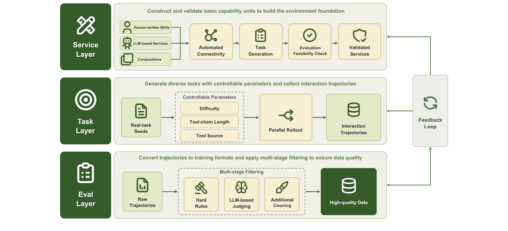

# KAT-Coder-V2.5

## 来源

- PDF：`raw/2607.05471v1.pdf`（24 页）
- arXiv：[2607.05471](https://arxiv.org/abs/2607.05471)
- 团队：KwaiKAT Team, Kuaishou
- 模型：[KAT-Coder](../models/kat-coder.md)
- 日期：2026-07-06
- 前作：[KAT-Coder-V2](kat-coder-v2.md)

## 核心结论

KAT-Coder-V2.5 的核心论点是：**coding agent 的瓶颈不在模型规模，而在训练基础设施**。报告围绕三个具体挑战构建端到端 agentic post-training 框架：(1) 可扩展可执行环境 -> AutoBuilder；(2) 超越最终奖励的轨迹质量 -> process-aware 过滤 + near-miss 恢复；(3) 稳定长周期 RL -> harness randomization + reliability-hardened sandbox + asymmetric PPO with hindsight-augmented critic。

最终通过 Multi-Teacher On-Policy Distillation 融合 SWE / Agent-Claw / Terminal / WebCoding / General 五个专家。评测在六个 benchmark 上，PinchBench 拿到最佳 agentic tool-use 结果（94.9），SWE-Bench Pro 和 KAT Code Bench 仅次于 Opus 4.8。

## 架构与训练

### 与 V2 的关系

V2.5 不是架构升级，而是**训练基础设施和方法论的系统性重构**。报告明确说 RL 训练基础设施与 V2 相似（三模块：Rollout Engine / Train Engine / KwaiEnv），但新增了 Gateway Server、harness scaling、reliability-hardened sandbox、asymmetric PPO、harness-oriented reward framework 等组件。V2 的 MCLA 和 Tree Training 在 V2.5 中未被作为独立贡献再述，但训练基础设施描述与 V2 一致。

### Environment Scaling Engine

> Figure 2: The agentic software-engineering data pipelines.（§ 2 Agentic Software-Engineering Capabilities）

**Verifiable Task Mining**：从真实 PR/commit 挖矿，merged code change 提供 golden patch，test change 提供 test patch。但原始 Issue/PR 文本常模糊、不完整、与最终变更不一致，因此从可验证制品重新生成结构化任务描述：problem statement（来自 golden patch）+ requirements（来自 test patch）+ interface constraints（API/变量/数据结构/兼容性假设，来自两者）。再用 clarity check 移除模糊/不完整/内部不一致的样本。

**Verifiable Environment Construction（AutoBuilder）**：V2 已有 AutoBuilder，V2.5 将其系统化为 agent-driven build-verification loop。关键改进：验证**不依赖命令退出码或表面日志**，而是解析结构化测试框架输出，只有 >90% 预期测试被收集且 pass/fail 可跨运行复现才接受。结合预配置基础环境、语言/构建系统模板、可检索的成功配置库，环境构建成功率从 16.5% 提升到 57.2%，产出 100K+ 环境（12 语言）。还预应用依赖更新和环境配置编辑（非编程挑战部分），移除 git 历史和 commit metadata 等可利用痕迹。

### Data Scaling Flywheel

把 rollout 轨迹转为更高价值训练信号的三步：

1. **Hint-Boosted Rollout**：很多失败轨迹是 near-miss（定位了代码区但差一步）。注入 targeted process-level hints（指示检查什么但不给解）使原本 0% pass 的任务约 20% 通过。再固定已验证 patch，从原始任务上下文重新生成无 hint 轨迹，只保留通过验证且无 hint 泄漏的样本。
2. **Process-Score-Driven Filtering**：通过测试不等于高质量。大规模 replay 发现重复低质模式（探索不足、定位差、spec 匹配差、绕过仓库机制、验证不完整）。用 rule-based gate + heuristic process scoring（exploration / localization / pre-edit reasoning / specification fidelity / repository conventions / patch minimality / verification quality / recovery behavior / honesty 九维），shortcut-based success 被降权或移除，recoverable near-miss 回收。
3. **Harness Rewriting for Robustness**：重写工具名、参数约定、输出格式、prompt 模板（保持功能不变），同一任务以多种等价 harness 配置重放。注入现实扰动（缺失/不匹配依赖、瞬时命令失败、截断输出、噪声日志），迫使模型在异常执行条件下继续诊断和验证。

### KwaiClawEnv：通用 agentic 能力环境合成

> Figure 3: Pipeline of KwaiClawEnv.（§ 3.2 Pipeline of KwaiClawEnv）

KwaiClawEnv 面向 Claw-style Agent 任务的工具使用环境合成框架，三层架构：

- **Service Layer**：原子能力单元。双源：开源社区 Skill 定义（OpenClaw，成功率 >90%）+ 类别引导 LLM 生成（补充欠表达领域）。Service 先做 executability / interface consistency / logical correctness 验证才进入任务生成。
- **Task Layer**：从 Service 池实例化具体任务，以真实任务为种子派生变体（不同执行路径/工具组合/任务约束）。可控参数：难度、工具链长度、工具来源。并行 rollout 记录完整交互。
- **Eval Layer**：轨迹转训练格式 -> 两层过滤（hard-rule + LLM-as-Judge 三维：semantic correctness / execution efficiency / interaction naturalness）-> 质量信号反馈回 Service/Task 层迭代。

两级 scaling：Service 级（Skills->可执行环境 + 组合扩展）+ Task 级（种子派生 + 复杂度控制），从少量种子放大到数万轨迹，平均 15 个工具调用，最长超 100 步。

### Harness Scaling

报告识别三种 harness overfitting：format overfitting（锚定特定 action format）、context-structure overfitting（依赖训练 harness 的 history 拼接顺序）、control-flow overfitting（依赖训练 harness 的 reflection timing 和 stopping conditions）。

解法是 harness randomization（domain randomization at environment level），沿三轴构造多样性：tool-invocation protocol（function-calling / code-block / tag-based）、context-management strategy（full history / sliding window / summary compression）、control-flow complexity（minimal ReAct -> 复杂 planning+self-reflection）。

两类 harness 各有角色：**White-box**（mini-swe-agent）-- 控制流简单、不做轨迹压缩、工具调用规模小，提供干净低噪训练信号；**Black-box**（Claude Code / Codex / OpenClaw / OpenHands）-- 覆盖真实部署的多样工具形式和控制流复杂度，常做轨迹压缩和上下文重组。

### RL 基础设施

> Figure 4: Overall architecture of our Agentic RL training infrastructure.（§ 4.2 RL and Sandbox Infrastructure）

三模块（与 V2 一致）：Rollout Engine（策略推理）+ Train Engine（策略更新）+ KwaiEnv（环境管理 + harness 集成）。新增 **Gateway Server** 中介推理-交互循环与训练循环：(1) 任意 harness 以不透明黑盒挂载，内部状态机不暴露给 trainer；(2) 强制 token consistency -- 绕过 chat endpoint 的 `apply_chat_template` 重 tokenize，直接走 `/generate` endpoint，消除 retokenization drift（~200 turn 规模下约 40% 样本受影响）。

### Reliability-Hardened Sandbox

V2.5 的关键工程发现：**训练失败的主因不在 RL 算法，而在沙箱环境**。采样审计发现约 16% 轨迹含至少一个沙箱自身导致的失败（非模型 policy 问题），这会腐蚀奖励信号。最严重时单个沙箱边界 misalignment 可使后续 ~40 步 rollout 的 observation 变空。

两类问题：(1) **Sandbox stability** -- 容器镜像并发拉取耗尽磁盘（峰值 95%），触发持续 GC 和超时（6-7% 无效 rollout）。重设计镜像管理 + 早期释放策略 -> 磁盘稳态 60%、超时 <1%。(2) **Sandbox execution correctness** -- 框架 bug 如远程沙箱初始化时系统环境变量覆盖配置，使验证器读错变量（6-7% 样本奖励翻转）。修复后 <1%。

整体沙箱反馈错误率从 ~16% 降到 <2%，训练崩溃频率降约一个数量级。

## 后训练

### Asymmetric PPO with Hindsight-Augmented Critic

V2.5 从 V2 的 GRPO 变体（turn-level GSPO adaptation）切换到 **PPO** 作为 RL backbone，理由三点：(1) 生产级 harness 常从同一 session 产生结构分裂样本（compaction / sub-agent splitting / query rewriting），共享最终结果但 prefix 不同，trajectory-level group baseline 难一致定义，PPO 的 per-token gradient contribution 更自然；(2) 保留 Critic 可注入训练时特权信息（final rewards / test outcomes / patch-level signals）降低方差；(3) PPO + GAE + reward shaping 支持 turn-level credit assignment。

**Hindsight-Augmented Critic**：Actor rollout 时只看交互历史；训练时 Critic 额外接收 hindsight context $c_t$（final pass/fail reward / unit-test outcome distribution / coverage signals / patch-level differences / task metadata / trajectory statistics / subsequent turns）。Asymmetric value function $V_\psi(s_t, c_t)$ 用同一 MSE 目标训练。推理时 Critic 和 hindsight context 丢弃，只部署 Actor。

### Harness-Oriented Reward Framework

三层结构化 rule-based reward（10 项，见报告 Table 1）：

- **Core Task Score**（最高权重）：所有 F2P 和 P2P 测试通过才满分，防止 reward hacking。
- **Standard Behavior Constraints**：内容重复率 / 乱码内容率 / 工具调用准确性 / 异常工具调用位置 / 重复单轮工具调用 / 工具调用并行度 / debug artifact 清理 -- 全程辅助惩罚。
- **Failed Trajectory Incentives**：文件搜索准确率（F2 score）/ 单元测试通过率 -- 给部分进展的失败轨迹正向奖励，densify 稀疏奖励。

Model-based reward 补充：rule-based 对上下文依赖行为（测试充分性 / 策略适配 / 失败覆盖）不够，引入 trajectory-level rubric 的 model-based judge。Rubric 从真实轨迹人工失败分析提取，覆盖 bug reproduction / post-fix validation / execution strategy 三维度。GRM（Generative Reward Model）用 RL 训练专用 judge model 做一致 rubric violation 检测，reward 为 recall-based（最大化 GT 覆盖 + 惩罚 false prediction）。

### Multi-Teacher On-Policy Distillation

V2.5 的 MOPD 与 V2 的 OPD 在算法骨架上一致（reverse-KL + on-policy），但系统化处理了**长上下文 OPD 的不稳定性**：

纯 on-policy distillation 在长上下文（多轮 agent 轨迹、repository-level SWE）上不稳定：student 生成的前缀可能偏离 teacher 训练分布，使 teacher 条件分布不可靠，产生有偏 KL 信号 -> loss 振荡 / entropy collapse / gradient norm spike，reverse-KL 还会放大 over-confident collapse 到错误 local mode。

两个稳定化机制：

1. **Off-policy cold start**：MOPD 前用专家生成轨迹初始化 student（标准 NLL），预对齐 student 与 teacher 分布，减少早期前缀偏离。
2. **Drift-aware dynamic truncation**：基于 Prune-OPD 的 top-k overlap 思路，定义 teacher-student 在 token $t$ 的兼容性 $\rho_t = |T_t^k \cap S_t^k| / k$。$\rho_t$ 高时 teacher 监督可靠；低时降权或截断。连续 $m$ 个 token 低于阈值则截断轨迹停止后续 backprop。截断只做 gradient masking 而非显式优化目标，保留截断前所有有效 prefix token，用 length-stratified batching 避免长度偏差。

## 评测要点

| Benchmark | 类别 | KAT-Coder-V2.5 | GLM-5.1 | GLM-5.2 | Kimi K2.6 | Opus 4.8 |
| --- | --- | --- | --- | --- | --- | --- |
| SWE-Bench Pro | Coding | 65.2 | 58.4 | 62.1 | 58.6 | **69.2** |
| KAT Code Bench | Coding | 53.1 | 49.6 | 50.3 | 48.9 | **57.3** |
| PinchBench (Avg) | Claw | **94.9** | - | 87.0 | 80.7 | 93.5 |
| KAT Claw Bench | Claw | 85.5 | 84.4 | 86.8 | 85.2 | **90.7** |
| Terminal-Bench 2.1 | AA Coding | 60.7 | 61.8 | 77.9 | 73.0 | **84.6** |
| SciCode | AA Coding | 50.3 | 43.8 | 50.5 | 53.5 | **53.5** |

统一用 Claude Code harness 评测，固定工具集 / context budget / 执行环境 / 解码配置。

报告新建两个内部 benchmark：**KAT Code Bench**（repository-level SWE，12 语言，覆盖 defect fix / feature completion / interface compatibility / cross-module edit / regression repair，pin base commit + runtime + verification entry point）和 **KAT Claw Bench**（业务导向 tool-use，7 大类：个人办公 / 内容创作 / 软件开发 / 数据分析 / 信息检索 / 自动监控 / 投资分析，覆盖短视频/直播/电商/广告/职场自动化）。

## 待追问

- V2.5 的 backbone 架构和参数量未公开（与 V2 一样）。是否沿用 V1 的同一 base model？
- Asymmetric PPO 的 Critic 网络规模与 Actor 的比例？hindsight context $c_t$ 的具体维度和编码方式？
- V2 的 MCLA + IcePop 在 V2.5 中是否仍使用？报告只说训练基础设施与 V2 相似，但 RL 算法从 GRPO 变体换成了 PPO。
- GRM（model-based judge）的训练数据量和 RL 配置？与策略模型的训练是否同步迭代？
- Cold start 阶段用的专家轨迹是哪些专家的？Cold start 持续多少步后才切到 on-policy MOPD？

## 相关页面

- [KAT-Coder](../models/kat-coder.md) - 模型页（V2 / V2.5 变体表）
- [KAT-Coder-V2](kat-coder-v2.md) - 前作报告
- [Agentic Engineering](../concepts/agentic-engineering.md)
- [Agentic 模型的后训练](../concepts/post-training-for-agentic-models.md)
- [Multi-Teacher On-Policy Distillation](../concepts/multi-teacher-on-policy-distillation.md)
- [On-Policy Distillation 跨报告对比](../comparisons/on-policy-distillation.md)
- [Agentic 评测体系](../concepts/agentic-evaluation-benchmarks.md)
- [Agent harness](../concepts/agent-harness.md) - harness randomization 是训练侧防止 scaffold 过拟合；与 Prime Agent 的表达性评测膜互补
