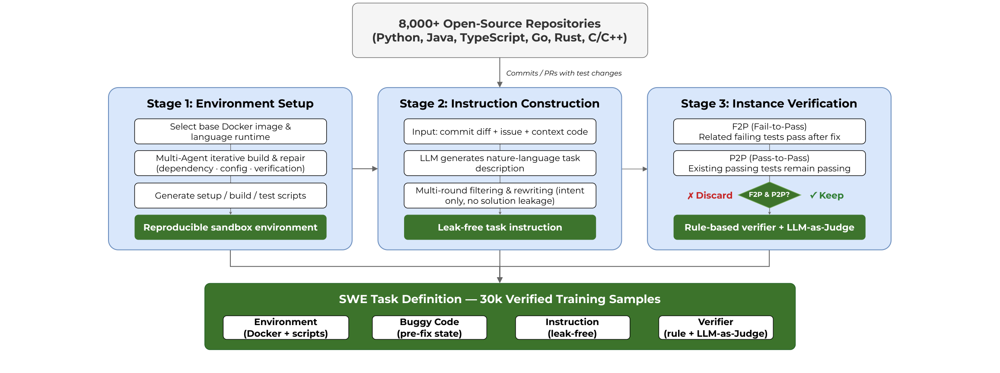
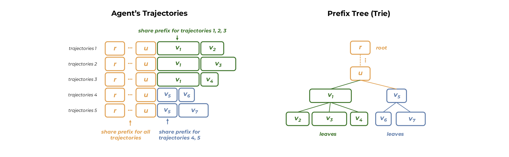

# KAT-Coder-V2

## 来源

- PDF：`raw/2603.27703v1.pdf`（22 页）
- arXiv：[2603.27703](https://arxiv.org/abs/2603.27703)
- 团队：KwaiKAT Team, Kuaishou
- 模型：[KAT-Coder](../models/kat-coder.md)
- 日期：2026-03-29
- 前作：KAT-Coder-V1（arXiv:2510.18779）

## 核心结论

KAT-Coder-V2 是快手 KwaiKAT 团队的 agentic coding 模型，基于 KAT-Coder-V1 继续后训练。核心方法论是 **Specialize-then-Unify**：把 agentic coding 能力分解为五个正交专家域（SWE / WebCoding / Terminal / WebSearch / General），各自独立 SFT + RL，再通过 On-Policy Distillation 融合为单一模型。

报告识别了三个根本挑战并分别对应解决方案：(1) 能力碎片化 -> 五域分治 + OPD 统一；(2) 基础设施耦合 -> KwaiEnv 模块化解耦 datasets / sandboxes / scaffolds / verifiers；(3) agentic RL 扩展 -> 沿任务复杂度 / 意图对齐 / scaffold 泛化三轴系统性扩展，并用 MCLA 稳定 MoE RL、Tree Training 消除树状轨迹冗余计算。

评测：SWE-bench Verified 79.6%（vs Claude Opus 4.6 的 80.8%），PinchBench 88.7（超 GLM-5 86.4 和 MiniMax M2.7 87.1），前端美学三场景均第一，Terminal-Bench Hard 46.8，τ²-Bench 93.9。

## 架构与训练

### Specialize-then-Unify 流水线

三阶段流水线：

1. **SFT**：每个专家域独立数据构造 + 监督微调，产出 5 个领域专家模型。
2. **RL**：用 KwaiEnv 的沙箱环境和验证器做环境反馈强化学习，提升多轮交互和长周期任务的决策质量。
3. **On-Policy Distillation**：Student 从自己分布采样混合域 prompt，同时受 RL loss（环境稀疏奖励）和 OPD loss（对应域专家的 token-level log-prob 监督）联合优化。动态选择每个任务的最佳专家做 Teacher。

五域专家的数据构造方法论：

| 专家 | 场景 | 关键方法 |
| --- | --- | --- |
| SWE | Issue 修复 | Issue-PR 配对（merge status 做监督）；AutoBuilder 自动造可验证任务（F2P+P2P）；Code Comprehension 轨迹合成 |
| WebCoding | UI 生成 | Tri-Perspective 标签系统（用户感知->设计理由->技术实现 7 级）；Prompt rewriting（设计者->普通用户）；设计师面板评测 |
| Terminal | CLI 推理 | SWE->Terminal 跨格式转换；多 agent 合成；Docker 验证 |
| WebSearch | Agentic search | 搜索轨迹知识图谱构造；Pass@8 过滤；rejection sampling SFT |
| General | 指令/QA/代码数学 | 组合约束训练；长对话样本；online-judge 验证 |

### AutoBuilder：自动 SWE 任务合成

> Figure 4: Overview of the AutoBuilder pipeline for automated SWE task synthesis from open-source repositories.（§ 3.2.1 SWE Expert）

AutoBuilder 三阶段：(1) **Environment Setup** -- 从有 CI 的 GitHub 仓库提取含单元测试变更的 commit/PR，用 Dependency Resolution Agent / Environment Configuration Agent / Build Verification Agent 多 agent 协作，基于仓库自身 Dockerfile 和 CI 脚本迭代搭建可编译可运行测试的隔离沙箱。(2) **Instruction Construction** -- 以 commit diff + 关联 Issue + 上下文代码为输入，LLM 生成只描述需求意图、不泄露实现的自然语言指令。(3) **Instance Verification** -- 修复后代码必须同时满足 F2P（所有原失败测试通过）和 P2P（所有原通过测试不回归）才保留。

最终从 8000+ 仓库产出 30k 验证样本，覆盖 Python / Java / TypeScript / Go / Rust / C/C++，每个样本含：可复现环境（Docker + 构建脚本）、buggy 状态代码、无泄露指令、规则+LLM 双验证器。

### Agentic Scaling：RL 数据合成

沿三轴系统性扩展 RL 训练数据，产出 100K+ 样本：

- **Task Complexity**：用 Autobuilder 基础任务池，闭源模型做 Teacher+Judge 在安全沙箱中生成并验证轨迹，过滤掉简单任务，只留需要大量反思或迭代修复的高难度实例。
- **Intent Alignment**（Sim-to-Real Gap）：真实用户指令常不完整或模糊，用 LLM 把标准化任务规格改写成从专家指令到口语化欠规格查询的谱系（one-commit-to-multiple-prompts）。
- **Scaffold Generalization**：把 scaffold 本身当独立变量，用黑盒 scaffold（Claude Code / OpenCode / Kilo Code）和白盒变体（SWE-agent）对同一任务生成轨迹，培养 scaffold 无关的解题行为。

RL 统一为 5-tuple 表示：`D_RL = ⟨E, T_tools, S_agent, I_task, V_verifier⟩`（执行环境 / 工具集 / scaffold+system prompt / 任务指令 / 验证+奖励信号）。

### MCLA：稳定 MoE RL 训练

MoE 模型 RL 训练不稳定的已知原因是 rollout/training 阶段的 policy mismatch。报告另识别一个关键因素：**轨迹 log-probability 期望估计的高方差**导致梯度方向不稳定。

MoE 的随机性（stochastic expert routing / capacity dropping / 数值方差）使估计的 policy log-prob 带噪 `log π(a) = log π*(a) + ε`，进而 importance weight `w(a) = exp(log π_rollout(a) - log π_train(a))` 方差过大。

**MCLA（Monte-Carlo Log-probability Averaging）**：训练时对每条轨迹做 K=8 次 forward prefill，取 log-prob 平均，显著降低估计方差。配合 IcePop（裁剪 train-inference 偏差过大的 token，对齐 rollout/train 的 routing 决策），两者互补--MCLA 降方差，IcePop 减分布不一致。

### Turn-level Policy Optimization

报告提出 GRPO 和 GSPO 的折中：GRPO 的 token-level importance sampling 在长周期 agent 场景方差高；GSPO 的 sequence-level ratio 在多轮环境中 credit assignment 粗。方案是把完整生成序列按交互 turn 分割，每个 turn 独立计算 importance ratio，再做 clipped surrogate。这样保留了 sequence-level 的方差降低同时支持 turn 级 credit assignment，且 turn 边界按 scaffold 特定标记动态定义，自然适配多 scaffold 数据。

### Tree Training：消除树状轨迹冗余

> Figure 5: Overview of Tree Training in agentic RL.（§ 3.3.2 Tree Training）

现代 agent scaffold 产生树状而非线性的训练轨迹：sub-agent 分叉、并发工具调用、上下文选择性保留或丢弃中间推理 token，使同一任务的 token 序列无法扁平表示。朴素线性化为独立序列会导致共享前缀在每个 forward/backward pass 中冗余重算。

Tree Training 把整个轨迹树序列化为单条 DFS 展平序列，对 per-token loss 施加权重。由微分线性性，这样得到的梯度与独立训练所有 root-to-leaf 路径**精确等价**，仅多一个 per-token loss tensor 的标量乘法开销。还需三个轻量组件：基于 FlashAttention V3 的树状 attention mask（限制每个 token 只 attend 自己 root-to-leaf 路径）、恢复原始序列位置的 per-token position ID、梯度缩放权重。实现与 TP/EP/DP/PP 正交。实测端到端训练加速 6.2×。

## 后训练

### KwaiEnv：模块化基础设施

KwaiEnv 解耦 datasets / sandboxes / scaffolds / verifiers 五个核心模块，支撑万级并发沙箱实例：

- **Dataset**：统一抽象接口屏蔽不同 benchmark 的格式/镜像/评分逻辑差异。
- **Verifier**：确定性评分（golden patch / 测试用例）/ LLM-as-Judge（开放式任务）/ SWE 评测（沙箱内执行测试套件）三类策略。
- **Scaffold**：网络层代理模型请求，任何通过 API 调用 LLM 的 Coding Agent 无需改代码即可集成，支持 Claude Code / Kilo Code / Cline / OpenClaw / OpenCode。
- **Sandbox**：秒级创建隔离容器，挂载数据集镜像，管理完整生命周期，支持万级并发。
- **Trajectory Manager**：通过代理拦截所有 LLM 请求，记录 I/O / 工具调用序列 / token 用量 / 时间戳，可按算法规格组装、重排、截断轨迹。

### KRL 训练框架

KRL（Kwai RL）围绕两个核心创新：(1) Tree Training 消除 group sampling 的共享前缀冗余（~6× 加速）；(2) Cache-Aware 智能调度最大化 KV Cache 命中率 + Dynamic Streaming 细粒度流水线编排，交替 Rollout 和 Training 阶段，单位样本成本降 2.8×。

训练循环 9 步：实例采样 -> Agent 分配 -> 沙箱初始化（万擎容器云）-> 请求路由（KRL router 负载均衡）-> Rollout 生成（SGLang 推理）-> 奖励计算 -> 引擎切换（SGLang 推理 -> Megatron 训练）-> 参数优化 -> 权重同步回 SGLang -> 迭代。

## 评测要点

| Benchmark | Scaffold | KAT-Coder-V2 | Claude Opus 4.6 |
| --- | --- | --- | --- |
| SWE-bench Verified | Claude Code | 79.6 | 80.8 |
| SWE-bench Verified | OpenCode | 74.8 | 75.0 |
| SWE-bench Verified | OpenClaw | 72.8 | 75.7 |
| SWE-bench Multilingual | Claude Code | 75.4 | 77.8 |
| PinchBench Best | OpenClaw | 88.7 | 87.4 |
| Claw-Eval Pass@3 | OpenClaw | 55.6 | 66.3 |
| Terminal-Bench Hard | - | 46.8 | 46.2 |
| τ²-Bench Telecom | - | 93.9 | 92.1 |
| Landing Page 美学 | - | 59.8 | - |
| Slides 美学 | - | 57.6 | - |
| Data Viz 美学 | - | 67.6 | - |

前端美学评测是报告自建的 reference-free 基准：所有 prompt 取自普通用户口语输入，专业 UI/UX 设计师盲评，Chrome 1920×1080 标准化环境含交互审查。Landing Page 分 10 维度（结构/视觉/组件/动态四层），Slides 和 Data Viz 各 5 维度。

## 待追问

- KAT-Coder-V1 的基座是什么？报告只说 continued post-training，未公开 backbone 架构和参数量。
- MCLA 的 K=8 次 forward prefill 的计算开销与收益的 trade-off 曲线如何？是否做过更小 K 的消融？
- Turn-level policy optimization 的 turn 边界在不同 scaffold 间如何标准化？跨 scaffold 训练时 turn 粒度不一致是否影响 advantage 估计？
- 五域专家各自的参数量是否与统一 student 相同？OPD 时 teacher 和 student 容量差如何影响蒸馏效果？

## 相关页面

- [KAT-Coder](../models/kat-coder.md) - 模型页（V2 / V2.5 变体表）
- [KAT-Coder-V2.5](kat-coder-v2.5.md) - 后续报告
- [Agentic Engineering](../concepts/agentic-engineering.md)
- [Agentic 模型的后训练](../concepts/post-training-for-agentic-models.md)
- [Multi-Teacher On-Policy Distillation](../concepts/multi-teacher-on-policy-distillation.md)
- [On-Policy Distillation 跨报告对比](../comparisons/on-policy-distillation.md)
- [Agentic 评测体系](../concepts/agentic-evaluation-benchmarks.md)
