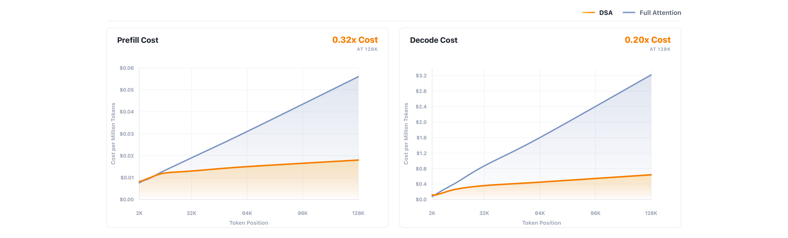
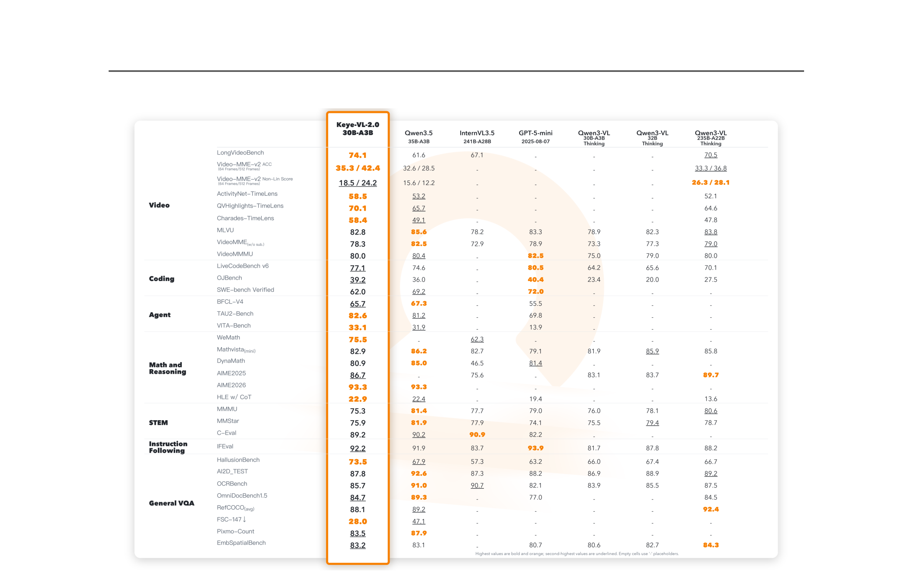

# Keye-VL-2.0 技术报告

## 来源

- **PDF 路径**：`raw/2606.10651v1.pdf`
- **标题**：Kwai Keye-VL-2.0 Technical Report
- **日期**：2026-06-10
- **团队**：Keye Team, Kuaishou Group
- **arXiv**：2606.10651v1
- **项目页**：https://kwai-keye.github.io/
- **模型页**：[Keye-VL-2.0](../models/keye-vl-2.md)

## 核心结论

Keye-VL-2.0-30B-A3B 是快手开源的多模态 MoE 模型（30B 总参 / 3B 激活），定位长视频理解与多模态 agentic intelligence。两大技术贡献：

1. **首个将 DSA 适配到 GQA-based 多模态架构**：此前 DSA（DeepSeek Sparse Attention）只在 MLA-based 模型（DeepSeek-V3.2、GLM-5）上实现。Keye-VL-2.0 把 DSA 的 Lightning Indexer（MQA-style 共享 key 打分）与 GQA backbone 的 group-level 稀疏聚合结合，使 256K 多模态上下文成为可能，同时不牺牲 dense 模型质量。

2. **Cross-Modal Multi-Teacher On-Policy Distillation（MOPD）**：维护 13 个 RL-trained domain teacher（覆盖安全、纯文本数学、指令跟随、代码、视觉 STEM、OCR、grounding、counting、video、tool use 等），每个 sample 按模态和任务类型路由到最佳 teacher，在 student on-policy rollout 上做 token-level KL supervision，解决多任务对齐中的 catastrophic forgetting。

评测在长视频理解和时序定位上 SOTA：LongVideoBench 74.1、Video-MME-v2 Non-Lin Score 24.2（512 frames）、TimeLens 三子集 mIoU 全部最优（ActivityNet 58.5 / QVHighlights 70.1 / Charades 58.4）。

> Figure 1（原文截图，§ Abstract）：6 项视频基准横向对比，*标注 TimeLens 子集分数为 mIoU。

## 架构与训练

### 整体架构

三组件构成：

- **Vision Encoder**：基于 SigLIP-400M-384-14 的 native-resolution ViT（27 层，hidden 1152），继承自 Keye-VL-1.5。支持任意分辨率/宽高比的图像和视频帧，不做 tiling 或 cropping。adaptive position encoding 支持变长输入。
- **MLP Projector**：随机初始化，Stage 0 训练以对齐视觉特征到 LLM 表示空间。
- **LLM Decoder**：基于 Qwen3-30B-A3B-Thinking-2507，GQA backbone（32 attention heads / 4 KV heads，hidden 2048，48 层，128 experts / 8 per-token）。已据 HF config 核实，详见 [模型页](../models/keye-vl-2.md)。

三个关键架构设计：

1. **Native-Resolution Vision Encoder**：保留原始分辨率和宽高比，避免 tiling 破坏全局结构。对 OCR、文档、视频等细节敏感场景尤其重要。
2. **Unified Visual Encoding**：图像和视频统一走同一个 ViT，每帧独立编码，用自然语言时间戳前缀注入时间信息（`<timestamp>`），不需单独的视频编码器。Adaptive Video Pixel Budget 按视频时长分配像素预算（256s→0.125×、512s→0.25×、1024s→0.5×、2048s→1.0×）。
3. **DSA for Long-Context Multimodal Modeling**：下文详述。

### DSA 适配到 GQA

这是本文的核心架构创新。DSA 原始设计基于 MLA 的 MQA mode（所有 query head 共享一份 latent KV）。Keye-VL-2.0 的 backbone 是 GQA（4 个 KV head group），需要适配。

**§2.3.1 MQA-Style Lightning Indexer**：indexer 部分沿用 DSA 的 MQA 设计——所有 query head 共享一个 key head，计算全局 index score：

$$I_{t,s} = \sum_{j=1}^{H_I} w^I_{t,j} \cdot \text{ReLU}(q^I_{t,j} \cdot k^I_s)$$

Top-k token 组成稀疏索引集 $\Omega_t$（top-k = 2048，§ Inference Optimization, p17，与 DeepSeek-V3.2 和 GLM-5 一致）。MQA 共享 key 大幅减少 indexer 的计算和访存，配合 FP8 实现和 ReLU 打分函数，即使数十万 token 也能高效运行。

**§2.3.2 GQA Sparse Aggregation**：在 GQA backbone 侧，每个 GQA group 在 indexer 选出的 top-k token 集上独立做 dense attention，但各 group 的 attention 分布归一化独立。这样 indexer 是 MQA（全局共享），sparse aggregation 是 GQA（per-group 独立），两者配合。

**§2.3.3 Dense Warm-up and Sparse Adaptation**：沿用 DeepSeek-V3.2 引入的两阶段训练范式：

1. **Dense warm-up**：冻结 indexer 以外参数（主模型 dense attention），用 KL loss 让 indexer 对齐 GQA 各 group 的 dense attention 分布。使用约 2B multimodal tokens。
2. **Sparse adaptation**：全部参数解冻，切换到 sparse 模式。KL loss 只在 top-k 选中 token 集上计算。indexer 输入从计算图 detach 以减少梯度干扰。最终 loss = $\mathcal{L}_{NTP} + \lambda \mathcal{L}^{sparse}_{I}$。

> 这条「dense warm-up + sparse adaptation」范式由 [DeepSeek-V3.2](deepseek-sparse-attention.md) 引入，GLM-5 也沿用。Keye-VL-2.0 是第三个公开使用此范式的模型，但它是首个在 GQA（而非 MLA）上实现的，见 [DSA 概念页](../concepts/deepseek-sparse-attention.md)。

### 预训练四阶段

> Figure 2（原文截图，§3 Pre-Training）：四阶段 curriculum，每阶段逐步扩展上下文长度和任务复杂度。

| 阶段 | 上下文 | 数据量 | 参数状态 | 重点 |
| --- | --- | --- | --- | --- |
| Stage 0 | 8K | 4B | ViT/LLM 冻结，只训 Projector | 视觉-语言接口初始化 |
| Stage 1 | 32K | 1T | 全参数 | 图文视频对齐 + OCR + 通用语言能力 |
| Stage 2 | 64K | 2T | 全参数 | 多任务注入（STEM/GUI/Grounding/Counting/OCR/Coding/Tool-use） |
| Stage 3 | 256K | 500B | 全参数 | 长上下文扩展（长视频/长文档/多文档/长 agent 轨迹），长:短 = 1:1 |

**视频预训练 curriculum**（Table 1）：Stage 1 用 15s 短片做视频-语言对齐 -> Stage 2 增加时长和分辨率 + 引入 temporal video grounding（TVG）数据 -> Stage 3 扩展到 2 小时，要求模型识别稀疏关键时刻。Scene-Wise Dense Caption 把密集视频描述重新表述为带起止时间戳的结构化场景描述。

## 后训练

### SFT + Synthetic CoT

SFT 约 500B tokens，40% 纯文本以锚定指令跟随和语言推理。视频数据构造成 multiple-choice QA + clue intervals，模型在 `<think>` 阶段验证候选时间段，输出答案和支撑区间 `[[mm, mm], ...]`。

Synthetic CoT 从高质量 QA pair 构造推理链，经 query-level / response-level / process-level 三级过滤。数学任务用 Doubt2Clean 二次审查跨 27 个数据集清洗可疑 CoT。

### RL 五阶段

后训练 RL 分为 General RL -> Specialized RL -> Video RL -> Agentic RL -> Cross-Modal MOPD，逐步注入不同能力：

**General RL（§4.2.2）**：用 GSPO objective 在可验证答案任务（VQA/STEM/chart/math/logic）上训练，over-sample + 零 advantage 方差 group 过滤提高数据效率。sequence likelihood ratio $s_i(\theta)$ + group-normalized advantage $\hat{A}_i$。

**Specialized RL（§4.2.3）**：从 General RL checkpoint 出发，分别训练 Grounding Expert（IoU + Hungarian matching）/ Spatial Expert（model judge {-1,0,1}）/ Math Expert（symbolic equivalence）/ Counting Expert / OCR Expert。目的不是出最终模型，而是获取强领域 expert 供后续 MOPD 蒸馏。

**Video RL（§4.2.4）**：约 31K video samples，GSPO，冻结 ViT 和 projector。TVG 用 temporal IoU reward；dense captioning 用 LLM-as-Judge 评 subject/action/scene/OCR/order/hallucination/coverage；FrameForge 合成视频提供 timestamp/counting/before-after/co-occurrence 的 rule-verifiable supervision。

**Agentic RL（§4.2.5）**：多步环境交互，覆盖 code（Online Judge + SWE）、tool-use、search。shared colocated partial-rollout 机制缓存未完成轨迹在后续 rollout step 续跑，completed group 立即进 GSPO 更新。environment-grounded reward + trajectory-level validation。

### Cross-Modal MOPD（§4.2.6）

> Keye-VL-2.0 的 MOPD 与 [MiMo-V2-Flash MOPD](../concepts/multi-teacher-on-policy-distillation.md) 在核心思路上一致（多 domain teacher + on-policy student rollout + token-level KL），但在 teacher 数量（13 vs MiMo 未明确）、teacher 路由机制和稳定性设计上有独立贡献。详见 [OPD 跨报告对比](../comparisons/on-policy-distillation.md)。

维护 13 个 RL-trained domain teacher（safety / 纯文本数学 / 指令跟随 / code / 视觉 STEM / OCR / grounding / counting / video / tool use 等）。每个 sample 按 modality + task type 路由到最佳 teacher。

Student 先 on-policy 采样 $y_i \sim \pi_\theta(\cdot|x_i)$，teacher 在 student 状态 $s_{i,t} = (x_i, y_{i,<t})$ 上给 token-level feedback。关键技术：

- **Segmented Prompt-Response Re-tokenization（SPRR）**：分别处理 prompt 和 response，确保 teacher log-prob 与 student response token 严格对齐。
- **Top-k overlap estimator**：定义 $\Omega_{i,t} = \text{TopK}(\pi^{r(i)}_T) \cap \text{TopK}(\pi_\theta)$，只在 teacher 和 student 都认为合理的 token 上计算 advantage，避免在极低概率 token 上的不稳定比较。advantage $A_{i,t} = \sum_{v \in \Omega_{i,t}} \bar{\pi}_\theta(v) \cdot [\log \pi^{r(i)}_T(v) - \log \pi_\theta(v)]$。
- **Token-category-aware advantage scaling**：down-weight formatting token，up-weight perception/reasoning token。
- **Localized repetition penalty**：在重复坍缩位置 $\tau_i$ 之后才惩罚，不影响正常生成长度。

Student loss = advantage-weighted policy gradient $\mathcal{L}_{MOPD} = -\mathbb{E}[\frac{1}{|M_i|} \sum_{t \in M_i} \tilde{A}_{i,t} \log \pi_\theta(y_{i,t}|x_i, y_{i,<t})]$。

## 训练与推理基础设施

### 预训练系统

- **ExtraIO**：水平可扩展的异步 I/O 服务，与训练解耦，解决视频解码和帧采样瓶颈。
- **ViT-LM 异构并行**：ViT 和 LM co-locate 在同一 GPU group，但各自用不同并行分片策略。recompute-or-offload 把 ViT activation memory 压到接近零。两级 load balancing（multimodal-token level + LM-sample level）提升端到端吞吐约 20%。
- **DSA kernel 优化**：FlashInfer + TileLang 实现，2× speedup。Top-k memory optimization（$T \times \text{max\_seq}$ 替代 $T \times T$），short-sequence optimization（positional index $i < \text{topk}$ 时只遍历 causally attendable KV），indexer loss 在 sparse-attention backward kernel 内复用 post-softmax attention matrix。

### 推理优化

> Figure 4（原文截图，§5.3 Efficient Inference）：DSA 在 128K context 下 prefill 成本降至 full attention 的 32%、decode 降至 20%。

三项推理优化：

1. **Chunk ViT**：视频帧分块顺序处理再合并，降低峰值显存。
2. **Sparse Attention Optimization**：相邻 query 的 top-k KV 集合高度重叠，去重后 128K context + topk=2048 下 16 个相邻 query 只需约 8K effective KV tokens。
3. **Decode Optimization**：DSA-specific decode 优化使 prefill 成本降 3× 以上、decode 降 5× 以上（128K context vs full attention）。

### DSA 在 RL 中的适配（§5.2.1）

与 [GLM-5](../concepts/deepseek-sparse-attention.md) 遇到的问题一致：DSA 的 top-k 算子非确定性会导致训练和推理间 token selection 不一致，RL 几步后性能塌陷。Keye-VL-2.0 的处理：用 `flashinfer.topk` 替代 `torch.topk`（2-3× speedup + 确定性），chunked DSA indexer 分块处理 score matrix 降低峰值内存。

> Keye-VL-2.0 和 GLM-5 都用 deterministic top-k 解 DSA RL 稳定性问题，但 Keye-VL-2.0 用 `flashinfer.topk`（GLM-5 用 `torch.topk`），且没有提到冻结 indexer 参数（GLM-5 冻结了）。这可能是 GQA+DSA 与 MLA+DSA 在 indexer 参数稳定性上的差异，待追问。

## 评测要点

> Figure 5（原文截图，§6 Comprehensive Evaluation）：跨 6 类 benchmark 的整体评测汇总。

### 视频理解（Table 2）

| Benchmark | Keye-VL-2.0 30B-A3B | Qwen3.5 35B-A3B | Qwen3-VL 235B-A22B | GPT-5-mini |
| --- | --- | --- | --- | --- |
| LongVideoBench | **74.1** | 61.6 | 70.5 | – |
| Video-MME-v2 ACC (512f) | **42.4** | 28.5 | 36.8 | – |
| Video-MME-v2 Non-Lin (512f) | **24.2** | 12.2 | 28.1 | – |
| MLVU | 82.8 | 85.6 | 83.8 | 83.3 |
| Video-MME (w/o sub) | 78.3 | 82.5 | 79.0 | 78.9 |
| ActivityNet-TimeLens | **58.5** | 53.2 | 52.1 | – |
| QVHighlights-TimeLens | **70.1** | 65.7 | 64.6 | – |
| Charades-TimeLens | **58.4** | 49.1 | 47.8 | – |
| Video-MMMU | 80.0 | 80.4 | 80.0 | 82.5 |

TimeLens 三子集 mIoU 全部最优，验证 scene-wise dense caption + diverse TVG data + tIoU-centered Video RL 的效果。LongVideoBench 和 Video-MME-v2 accuracy/non-lin score 均最优。MLVU 和 Video-MME 被 Qwen3.5 超过（但在成熟 benchmark 上仍竞争力强）。TimeLens 评测统一用 4 FPS 以保证公平。

### Code Agent（Table 3）

| Benchmark | Keye-VL-2.0 | Qwen3.5 35B-A3B | GPT-5-mini |
| --- | --- | --- | --- |
| LiveCodeBench v6 | **64.2** | 62.8 | 51.5 |
| OJBench | **71.5** | 70.2 | 58.7 |
| SWE-bench Verified | 62.0 | **63.5** | 55.5 |

### Tool-Use（Table 4）

| Benchmark | Keye-VL-2.0 | Qwen3.5 35B-A3B | GPT-5-mini |
| --- | --- | --- | --- |
| BFCL-V4 | 65.7 | **67.3** | 55.5 |
| τ2-Bench | **82.6** | 81.2 | 69.8 |
| VitaBench | **33.1** | 31.9 | 13.9 |

τ2-Bench 和 VitaBench 最优，BFCL-V4 第二。30B-A3B 在 tool-use 上全面超过 GPT-5-mini。

## 待追问

- Keye-VL-2.0 的 DSA indexer 在 RL 阶段是否冻结？报告说用 deterministic `flashinfer.topk` 但没提冻结 indexer 参数，与 GLM-5 的策略是否真有差异？
- GQA Sparse Aggregation 中各 group 的 attention 分布归一化是独立做的，这是否意味着不同 group 可能关注不同的 top-k 子集？还是共享同一个 indexer 选出的 top-k？
- 13 个 domain teacher 的具体配置（参数量、训练数据量）未披露。teacher 路由是静态规则还是 learned router？
- Top-k overlap estimator 中 $\Omega_{i,t}$ 为空时 $A_{i,t} = 0$，这种零 advantage token 的比例有多高？是否影响训练效率？
- Pre-training Stage 3 的 500B tokens 中长视频占比多少？256K 上下文的 sample 占比多少？

## 相关页面

- [Keye-VL-2.0 模型页](../models/keye-vl-2.md)
- [DeepSeek Sparse Attention](../concepts/deepseek-sparse-attention.md)：DSA 机制详解，Keye-VL-2.0 是首个在 GQA 上实现 DSA 的模型
- [Multi-Teacher On-Policy Distillation](../concepts/multi-teacher-on-policy-distillation.md)：MOPD 范式与数学依据
- [On-Policy Distillation 跨报告对比](../comparisons/on-policy-distillation.md)：Keye-VL-2.0 是第 6 家用 OPD 的报告
- [高效长上下文注意力](../concepts/efficient-long-context-attention.md)：DSA 路线的跨模型对比
- [Agentic 模型的后训练](../concepts/post-training-for-agentic-models.md)
- [Qwen3](../models/qwen3.md)：Keye-VL-2.0 的 LLM backbone 基于 Qwen3-30B-A3B-Thinking-2507
