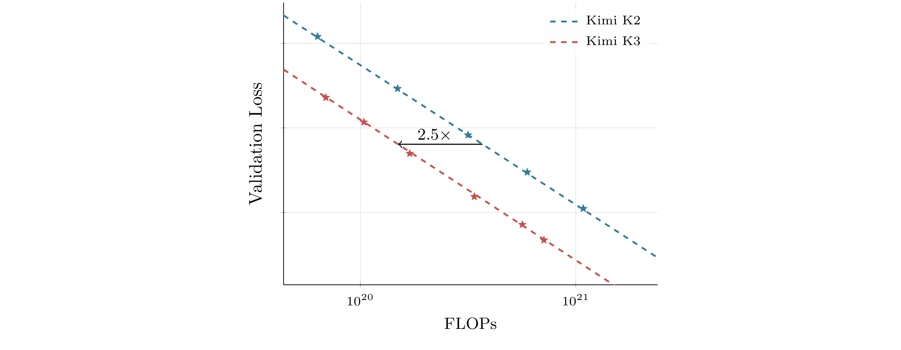

# Kimi K3 技术报告

## 来源

- **PDF**：`raw/2607.24653v1.pdf`（arXiv:2607.24653v1，47 页，2026-07-27）
- **标题**：Kimi K3: Open Frontier Intelligence
- **团队**：Kimi Team（Moonshot AI）
- **模型**：[Kimi K3](../models/kimi-k3.md)
- **权重**：已开源（https://huggingface.co/moonshotai/Kimi-K3）

## 核心结论

Kimi K3 是**首个开源 3T 级模型**（2.8T 总参 / 104B 激活），原生多模态（文本+图像+视频），1M token 上下文。架构沿三条信息流轴重新设计：序列长度（[KDA](../concepts/linear-attention-and-delta-rule.md) 混合 [Gated MLA](../concepts/multi-head-latent-attention.md)）、网络深度（[Attention Residuals](../concepts/attention-residuals.md)）、模型宽度（[Stable LatentMoE](../concepts/stable-latentmoe.md)）。综合架构+数据+训练改进，相对 Kimi K2 拿到约 **2.5× scaling efficiency**（Figure 7）。

评测上达到 frontier 级但**仍落后最强闭源**（Claude Fable 5、GPT-5.6 Sol）：在 ProgramBench、SWE-Marathon、BrowseComp、MCPMark-Verified、AutomationBench、τ3-Banking、Harvey Lab-AA 等 8 项取得第一；WebDev Arena 以 1,678 Elo 成为**首个登顶该榜的开源模型**；Intelligence Index v4.1 #4/580（57.1）；Vals Index #2/39（74.7）。成本效率前沿：BrowseComp 91.2%@$2.03/task（GPT-5.6 Sol 一半成本、Claude 系十分之一）。

> **定位原文**："As the world's first open 3T-class model, Kimi K3 delivers frontier-level performance across long-horizon coding, agentic, knowledge, reasoning, and vision tasks. Although gaps to the strongest proprietary models remain, Kimi K3 establishes a new open frontier within everyone's reach."（§ 8 Conclusion）

> Figure 7（原文截图，§ 3.2 Scaling Law）："Fitted scaling-law curves for Kimi K2 and Kimi K3. Kimi K3 achieves 2.5× gain in scaling efficiency over Kimi K2."

## 架构与训练

### 总体架构（已据原文 Table 1 + § 2 核实）

Kimi K3 相对 Kimi K2 是一次结构性大改，不是单纯放大：

| 维度 | Kimi K2 | Kimi K3 | 变化 |
| --- | --- | --- | --- |
| 层数 | 61 | 93 | +52% |
| 总参数 | 1.04T | 2.78T | +167% |
| 激活参数 | 32.6B | 104.2B | +220% |
| Hidden dim | 7,168 | 7,168 | = |
| Latent MoE dim | – | 3,584（0.5×） | 新增 |
| MoE expert hidden | 2,048 | 3,072 | +50% |
| Routed experts | 384 | 896 | +133% |
| Active experts/token | 8 | 16 | +100% |
| Shared experts | 1 | 2 | +100% |
| Attention heads | 64 | 96 | +50% |
| 训练上下文 | 128K | 1M | 8× |
| 注意力机制 | MLA | Hybrid KDA–MLA | – |
| 激活函数 | SwiGLU | SiTU-GLU | – |
| 注意力层组成 | 61 MLA | 69 KDA + 24 MLA | – |
| ViT 参数 | – | 401M（27 层） | 新增视觉 |

> Table 1（原文 § 3.2）：Kimi K2 vs Kimi K3 架构对比。93 层中 69 KDA + 24 MLA，即 **3:1 混合**（每 3 个 KDA 层配 1 个 MLA 层），与 Kimi Linear 的混合比例一致。

> Figure 2（原文截图，§ 2 Model Architecture）："The Kimi K3 architecture, organized around token, channel, and layer mixing, with a native vision pathway at the input."

### Hybrid Attention：KDA + Gated MLA

**3:1 layerwise 混合**——69 层 KDA + 24 层 Gated MLA，与 [Kimi Linear](../sources/kimi-linear.md) 同比例。KDA 负责序列内信息混合（带位置/近因感知），MLA 负责无约束全局内容交互。

**KDA 的两点升级（相对 Kimi Linear，已据 § 2.1.1 核实）**：

1. **Lower-bounded decay**：Kimi Linear 用 `g = -e^A · Softplus(z) ∈ (-∞, 0)`（无下界），导致 chunkwise 计算里 reciprocal cumulative decay `1/Γ` 可溢出 BF16 动态范围，对角 tile 被迫走 position-pair diagonal 路径（无法用 dense Tensor Core MMA）。Kimi K3 改成 **scaled sigmoid**：`g = g_min · Sigmoid(e^A · z) ∈ (g_min, 0)`，`g_min = -5` 固定。于是每个 retention factor `α > e^-5 ≈ 6.7e-3`，16-token tile 的累积 log-decay 落在 `(-80, 0)`，reciprocal rescaling factor < e^80 仍在 BF16 范围内——**所有因果 tile（对角 + 非对角）都能用 dense Tensor Core matrix multiplication**，消掉 position-pair diagonal 路径。
2. **Full-rank output gate**：Kimi Linear 的 KDA 输出门是低秩参数化，K3 换成 input-dependent **full-rank** 投影（`y = W_o[Sigmoid(W_g x) ⊙ RMSNorm(~o)]`）。

> Figure 3（原文截图，§ 2.1.1 Lower-bounded decay）："Lower-bounded decay and its effect on chunkwise KDA computation. (a) Kimi Linear uses an unbounded negative-Softplus mapping, whereas Kimi K3 bounds the log-decay with a scaled sigmoid … (b) Kimi Linear evaluates each diagonal tile with an explicit position-pair computation, while the bounded range in Kimi K3 allows all causal tiles to use dense Tensor Core matrix multiplications."

**Gated MLA（已据 § 2.1.2 核实）**：

- **NoPE**：所有 MLA 层不用显式位置编码（沿用 Kimi Linear 的混合设计）。位置信息全靠 KDA 的 recurrent gating + decay 隐式编码。好处：扩展上下文长度时**不需要改位置编码参数**（不用 retune RoPE base、不用 YaRN），1M 外推零修改。
- **Full-rank output gate**：与 KDA 同款 input-dependent channel-wise 全秩门（`y = W_o[Sigmoid(W_g x) ⊙ ~o]`），让每个 token 能调制从全局注意力读出的通道。
- **FP32 attention output**：纠正 flash attention 的 biased rounding error，attention 输出在训练时保持 FP32。代价是 on-chip footprint 翻倍，故重新设计 kernel 把它与 KV staging buffer 重叠（而非 query tile），腾出 shared memory 给更深的 KV pipeline。

### Attention Residuals（AttnRes，新机制）

标准残差连接把所有先前信息压进单一状态 `h_l`——一个**沿深度的 RNN 瓶颈**。[Attention Residuals](../concepts/attention-residuals.md) 把「序列位置用 attention 替代 RNN」的方法论搬到深度维：**每层选择性从所有前层检索表示**，而非均匀累加。

- **Full AttnRes**：层 `l` 有可学习 pseudo-query `q_l = w_l`，keys/values 是所有前层输出 `f_i(h_i)`（含 token embedding `h_1`）。用 softmax kernel `ϕ(q,k) = exp(q^⊤ RMSNorm(k))`（RMSNorm 防止大输出层主导权重）。深度 `L < 100`，`O(L²d)` 算力可承受，实际开销是 `O(Ld)` 内存（及 pipeline parallelism 下的跨阶段通信）保留所有层输出。
- **Block AttnRes**（K3 实际用）：把 L 层分成 N 个 block（每 block S 层）。block 内层输出累加成单一表示 `b_n`；跨 block 做完整 attention。内存/通信从 `O(Ld)` 降到 `O(Nd)`，且推理时状态有界，可用 online softmax 把 inter-block 并行结果与 intra-block 顺序 partial sum 合并。K3 取 **N=8 blocks × 12-layer size**（93 层 → 8 个完整 block + 1 个 partial final block，含 embedding 共 9 个 block）。

> 详见 [Attention Residuals 概念页](../concepts/attention-residuals.md)。

### Stable LatentMoE（新机制，已据 § 2.3 核实）

[LatentMoE](../concepts/stable-latentmoe.md) 把 routed expert 操作从全模型宽度 `d` 解耦到一个**紧凑 latent 空间** `ℓ`（K3 取 `ℓ = d/2 = 3584`），shared expert 仍走全宽。这让 K3 能把 expert pool 扩到 **896 routed experts / 16 active / 2 shared**（sparsity 56）而不让通信和 expert-weight 流量爆炸。

但极端稀疏放大了两个失效模式：(1) routed 路径是 `W↓ → Gated FFN → W↑` 近四个连续矩阵乘的 ill-conditioned 链，2.8T 规模下内部激活爆炸；(2) 平衡 ~10³ 个 expert 的负载超出了 aux-loss-free bias 更新的适用域。**Stable LatentMoE 三组件**：

1. **Normalized LatentMoE**：在 expert 聚合后、上投影 `W↑` 前插入 RMSNorm。降低 routed branch 对 scale variation 的敏感度，稳定训练且持续改善 validation loss 和下游 benchmark。
2. **SiTU-GLU（Sigmoid Tanh Unit GLU）**：SwiGLU 的两个乘性因子都无界，大坐标重合会产生 activation outlier。SiTU-GLU 对 Swish 的线性因子和 up branch 各加 smooth cap `β·tanh(x/β)`：`SiTU-GLU(x) = [β1·tanh(W_g x/β1) ⊙ Sigmoid(W_g x)] ⊙ [β2·tanh(W_u x/β2)]`。原点附近一阶匹配 SwiGLU，大输入有界 `‖SiTU-GLU(x)‖_∞ ≤ β1·β2 = 100`（K3 取 `β1=4, β2=25`）。比 hard clamping 保留饱和区非零梯度，训练表现更好。
3. **Quantile Balancing（QB）**：aux-loss-free routing 的 bias 更新从固定步长 `b ← b + γ·sign(target - load)` 换成**从 router score 分位数推 bias**。对每个 expert `j`，先做 Top-(k+1) 路由拿 cutoff `α_i`，再把 `b_j` 设为 margins `s_{i,j} - α_i` 的 `(1 - k/n)`-分位数——恰好让 expert `j` 收到 target load `q = mk/n`。这是 balanced assignment 对偶 LP 的 exact coordinate minimizer（附录 C 推导），所以**无学习率超参**、几个 step 内即平衡 ~10³ 个 expert。规模下用 histogram 估分位数（一次 all-reduce 汇 bin count，几百 bin/expert 的通信成本）。

> Figure 5（原文截图，§ 2.3.3 Quantile Balancing）："Illustration of Quantile Balancing with m = 8 tokens, n = 4 routed experts, and k = 1 selected expert per token. (a) Token-wise Top-k routing … produces loads (4, 3, 1, 0) … (c) The retained choices yield the balanced load (2, 2, 2, 2); red edges denote assignments changed by QB."

> 详见 [Stable LatentMoE 概念页](../concepts/stable-latentmoe.md)。

### 原生视觉：MoonViT-V2（已据 § 2.4 核实）

K3 是**原生多模态**——文本、图像、视频由单一共享 backbone 在同一 context 内处理，无 post-hoc modality-alignment 阶段。视觉输入经 MoonViT-V2 编码、MLP projector 映入 LLM。

**关键 departure**：MoonViT-V2 **从零训练**（next-token prediction），不用 SigLIP 对比预训练初始化。动机是训练稳定性——SigLIP 初始化的 MoonViT-3D 在联合优化下梯度范数持续偏高且频繁 spike，from-scratch 的 MoonViT-V2 全程稳定（Figure 6）。且 next-token prediction 让 encoder 表示直接由 language-modeling objective 塑形，而非偏向全局语义的对比损失。结论：MoonViT-V2 在视觉评测上**追平** SigLIP-initialized baseline，说明对比预训练对大规模多模态 LM 的初始化**不是必需的**。

MoonViT-V2 配置：27 层 ViT，~0.4B 参数，RMSNorm，移除所有线性/注意力投影的 bias。图像与视频**完全共享参数**：注意力分解为 intra-frame spatial + inter-frame temporal，temporal pooling 沿时间维压缩 token。投影前 pixel-shuffle 2×2 下采样把视觉 token 数砍 4×，使 3584×3584 像素输入在 1M context 内可承受。

### Per-Head Muon（已据 § 2.5 核实）

沿用 Kimi K2 的 Muon optimizer 处理矩阵参数。对注意力投影的改进：**per-head Newton-Schulz 正交化**——不对完整 Q/K/V 投影矩阵做正交化，而是沿 head 维切分 momentum 矩阵、每个 head 的 block 单独正交化。直觉：full-matrix 正交化把所有 head 当一个耦合块，大梯度/动量 head 主导共享更新方向，小 head 更新不足；per-head 等化各 head 更新尺度。实测改善大规模训练稳定性，且 Newton-Schulz 迭代在更瘦的 per-head block 上更便宜，略降 optimizer overhead。

### 预训练（已据 § 3 核实）

- **原生多模态联合训练**：语言与视觉从一开始就联合优化，视觉与文本 token 在单一 next-token prediction 目标下交错。
- **数据**：四类文本域（Web Text / Code / Math / Knowledge）+ 大规模视觉语料（captions / interleaved image-text / OCR / perception / video / visual coding——SVG / 3D assets / Webpage / Game / CAD schematics）。沿用 Kimi K2/K2.5 数据管线并精炼。坐标监督同时给绝对和归一化 `[0,1]` 格式。Knowledge 和 Math 语料用 style/perspective-diverse prompting + chunk-wise autoregressive generation + fidelity verification 做 rephrasing。
- **Scaling law**：在 held-out OOD validation data 上拟合，架构+数据+训练改进合计 2.5× scaling efficiency（Figure 7）。**cosine decay 优于 WSD**（Warmup Stable Decay）——但前提是各自独立搜超参；二者最优 peak LR 和 batch size 差异显著，共享超参的比较不公平。
- **Training recipe**：Per-Head Muon + Kimi K2 的 weight-clipping + QB 做 MoE 负载均衡；cosine LR schedule + 1% linear warmup；weight decay 0.1。8K → 64K 两阶段。
- **长上下文扩展（§ 3.4）**：NoPE → 无需任何位置编码修改即可外推到 1M。四阶段 progressive curriculum：8K → 64K（预训练）→ 256K → 1M（cooldown）。长文档/视频经专门清洗（exact+fuzzy dedup、video perceptual hashing、quality filtering、structural validation）。**合成**长上下文数据：精心排列拼接多模态文档与子任务，让任务只能通过 attend 到散布在 1M 全长的信息才能解，防止注意力退化成局部模式。

## 后训练

### 三阶段范式（已据 § 4.1 核实）

**SFT → RL（9 专家）→ MOPD 融合**：

1. **SFT**：用前代 Kimi 系列领域专用模型合成数据轨迹 + 多阶段验证 + human-in-the-loop 标注。复杂 agentic 轨迹统一用 **XTML**（eXtensible Token Markup Language）chat template 序列化（附录 F）。从 SFT 阶段起即启用 **QAT**（MXFP4 权重 + MXFP8 激活，§ 4.1.4）。
2. **RL**：不按单任务训专用模型，而是跨三大域 × 三 reasoning effort = **9 个专家**：
   - 三大域：(i) general tasks（experience/vision/reasoning/faithfulness/search/knowledge work）；(ii) general agents（长周期 assistant / deep research / paragraph-level writing）；(iii) coding agents（SWE / coding experience / kernel / web dev）。
   - 三 reasoning effort：`{low, high, max}`。
   - 算法：扩展 Kimi K2.5 的 synchronous RL partial rollout——每 iteration 采样 K completions × N prompts，**当 λ∈(0,1) 比例轨迹完成即暂停生成**进入 policy optimization，未完成轨迹入队下一 iteration 优先恢复（靠 [sandbox infra](#agentenv-沙箱) 支持）。policy optimization 沿用 Kimi K2.5 算法，靠 per-token regularization 容忍极端 off-policy 数据。
   - **Reasoning Effort RL**：per-problem budget control——每问题 `x` 给初始 token budget `b0(x)`（cold-start 模型估），轨迹总 token `T(y) > τ·b0(x)` 则 reward override 为 -1。先训 max-budget 变体（大 τ 但封顶防 overthinking），再退火 τ 到更小值得 high/low 专家。
   - **Agentic Generative Reward Model（GRM）**：非可验证 general task 用 tournament-style binary comparison（沿用 K2.5）。judge 强制四步协议：(1) 读输出；(2) 生成 rubric；(3) 按 rubric 打分；(4) 记 scorepad。防 reward hacking 向冗长输出漂移：verbosity control（超 `σ·ℓ0` 自动输掉 binary comparison）。
3. **MOPD（§ 4.1.3）**：九个 teacher 专家把跨 reasoning effort 的领域能力融合进单一 student。per-token OPD reward：`r_opd = clip(sg(log π_teacher / π_θ), -R_max, R_max)`（`sg` stop-gradient，`R_max` clip 极端 advantage）。dense reward 无缝接入 RL 框架，天然支持 partial rollout。试过更细的 top-k distillation 目标，但在收敛速度和最终性能上都没明显优势。

> MOPD 与 MiMo/DeepSeek-V4/Qwen3 等 OPD 范式的关系见 [Multi-Teacher On-Policy Distillation 概念页](../concepts/multi-teacher-on-policy-distillation.md) 和 [OPD 跨报告对比](../comparisons/on-policy-distillation.md)。

### Deployment-Aware Post-Training（已据 § 4.1.4 核实）

- **MXFP4 QAT 贯穿后训练**：MoE expert 权重（占参数显存大头）量化到 MXFP4，激活 MXFP8；非 expert 组件（attention 投影、latent MoE 投影、shared experts、router）保持高精度。QAT 覆盖 SFT + RL 全程，RL 时 rollout 与 training 共用同一量化方案，消除 train-inference mismatch。
- **Draft Model Fine-Tuning**：预训练的 MTP 层（结构镜像一个 backbone block）被 fine-tune 成 **EAGLE-3 风格 draft model**（target 冻结，只训 draft 层 + feature-fusion 投影）。训练时按 EAGLE-3 test protocol unroll 7 步。draft 输入融合 target model 的低/中/高层特征（取自第 1、4、最后一个 AttnRes block 的输出），concat 后经 `W_E3` 投影到 hidden size，`W_E3` 初始化为 `[0 0 I]`（初始等价于高层特征 `h_h`，即 MTP 预训练时的输入），逐渐学入低/中频特征。
  - **直接优化 LK loss**（acceptance rate 的负对数）：`L_LK = -log Σ_x min(p(x), q(x))`，而非传统 KL surrogate。理由：capacity-limited draft model 上最小化 KL 不保证最大化 acceptance rate。temperature 1，无辅助 ground-truth cross-entropy 项。
  - draft fine-tuning 也走 QAT 配置。

### RL 任务合成与 Agentic 环境（已据 § 4.2 核实）

- **Unified White-Box RL Environment**（§ 4.2.1）：把 agent harness 表示成可配置可组合模块集合（tool interfaces / system prompts / context management / skills / memories / subagents / …）。配置化实例化主流 harness（Kimi Code / Claude Code / Codex / OpenClaw / Hermes）及全新 harness。RL 训练时为不同任务组动态构造不同 harness 配置，避免过拟合单一 harness 的 tool schema / system prompt / context 管理机制。
- **Knowledge-Graph-Guided Task Synthesis**（§ 4.2.2）：自演化、层级组织的 DAG 知识图谱，agent 持续跨知识密集与 coding 域 web-scale 探索扩展。从粗粒度 seed 节点递归 agent 驱动扩展——每个节点派一个 agent 做多次 web search 调研，添加新节点前先探图找等价/相关概念复用。边始终从粗到细。按目标分布采样节点（单独或组合），导出关键词 + 祖先 context 组 web query，检索真实材料，synthesis agent 产出训练任务。
- **Verifiable Problems in Agentic Environments**（§ 4.2.3）：多步复杂信息搜索（规划研究、逐步收集证据、产出可验证答案）；专业日常（投行/数据分析/法律，分解请求、操作 sandbox 域工具、几十到几百步完成 deliverable）；多步可验证视觉推理（STEM/visual puzzle/chart understanding，sandbox 配 Python interpreter，模型迭代写代码裁剪/缩放/变换图像、精确计算、验证中间结果）。
- **Kernel Optimization Tasks**（§ 4.2.4）：大规模 kernel 任务套件，单算子到 fused mega-kernel，源自 Flash Linear Attention 等高质量 GitHub repo。覆盖 CUDA / Triton / CuTe DSL / Gluon / ThunderKittens / TileLang，BF16/FP8/FP4。reward 评 correctness（超数值误差阈值零分）+ performance（match expert = 0.5，approach roofline → 1）。hacking-detection 系统（CUDA graph replay / input caching / precision reduction 等）持续扩展。
- **Personal Assistant Tasks**（§ 4.2.5）：Gmail / Notion / Slack / Canvas 的真实 mock 实现，保留核心语义支持可复现大规模交互。多日 persistent evolving 环境，单 rollout 可达数千工具调用、百万 context token。
- **Autonomous Execution Tasks（AET，§ 4.2.6）**：verify-in-the-loop 优化。任务给初始状态、约束目标、工具动作空间、执行预算、独立 verifier。agent 只见目标/约束/验证接口，无参考轨迹，自主分解/选工具/规划/纠错/终止。reward 基于 verifier 对最终环境状态的评估而非 agent 自报。多类 verifier：black-box system replication（Figure 10）、quantitative factor discovery、tax auditing。防 hacking：隔离 agent 与 verifier、public verifier 给诊断反馈配 hidden verifier 评 held-out、有限提交预算下 penalty reward。
- **Web Development Tasks**（§ 4.2.7）：专家策划的 web dev 任务，输入从一行场景描述到多段规格；产物含 website / interactive game / 3D-WebGL / data viz / SVG / full-stack。containerized sandbox，多 scaffold rollout 促跨 scaffold 泛化。reward = deterministic checks（功能测试 + 结构/像素相似度）+ model judging（源码审查或交互产物检查）。build 失败/运行报错/伪造产物 → 零分。

### AgentENV 沙箱（已据 § 5.3.2 核实）

AgentENV（开源 github.com/kvcache-ai/AgentENV）是基于 **Firecracker microVM** 的 agentic 沙箱系统，三设计目标：

1. **高保真隔离**：agent 越强任务越难，倾向激进探索甚至 reward hacking，传统 container 沙箱会出现 kernel panic / deadlock。microVM 隔离允许 agent 自由 mount disk / run container / launch VM。
2. **灵活生命周期**：incremental checkpointing（只存脏内存页），checkpoint 49ms / resume 133ms。三个高层操作：(a) Pause/Resume（paused sandbox 不耗 CPU/内存，agent 等推理结果时可 pause，占 lifetime 98%）；(b) Fork（从原 sandbox 状态 fork 新沙箱做 reward judging 无副作用）；(c) Snapshot（定期快照错误恢复）。
3. **高密度高效**：OverlayBD 镜像格式 + 自定义 ublk driver + 存储层共享 + P2P transport，sub-second launch。copy-on-write memory + page-cache 优化，内存 overcommit 6.5×。

K3 训练+评测共创建 **51,219,741 个 sandbox**，跨 1,505,678 个镜像。

### 1M Agentic RL 基础设施（已据 § 5.3.1 核实）

- **Co-located RL**：每个 1M-context RL 实验控制在几百 GPU 内。partial rollout 降长尾延迟。
- **External KV cache pool**：1M multi-step rollout 下 prefix KV-cache miss 极贵。partial rollout + speculative decoding 加剧 prefix-block churn。解法：write-back 设计——active decoding block 留 GPU KV cache，可复用 idle prefix 仅在被驱逐时 write-back 到 CPU DRAM 外部池，下次复用前 prefetch 回。**KDA states 与 MLA KV cache blocks 一起 offload/prefetch，生命周期对齐**。write-through 会冗余复制仍 resident 的 block，write-back 只对离开 active decode 路径的 prefix 产生 DRAM 开销。训练 iteration 结束后把训练状态（权重+optimizer）offload 到 NVMe 腾 DRAM；rollout iteration 后释放池。
- **Rollout auto-throttling scheduler**：多步 rollout context 渐进增长，固定 concurrency 难估且早期过保守。用 runtime signals（active/queued request count、KV cache utilization）动态控制发往 inference engine 的请求数。
- **Gradient-buffer reuse for non-policy model forwarding**：RL loss 需 forward-only non-policy 模型（如 reference model），权重太大无法常驻 GPU。把权重放 CPU，需要时 materialize，**用 policy model 的 FP32 gradient-buffer storage 作后盾**。ZeRO-2 下每 GPU 只持两个 VPP chunk 的 gradient buffer，streaming reference weights chunk by chunk（一个 slot 算当前 chunk，另一个 prefetch 下一个）。

### KDA 算子与 KCP（已据 § 5.1 核实）

- **FlashKDA**（CUTLASS-based chunkwise kernel）：训练/prefill 用。intra-chunk 计算与 cross-chunk state propagation 重叠，token-parallel stages + head-parallel recurrence 独立调度调优，显著优于 Triton reference。作为 flash-linear-attention backend 自动 dispatch。
- **Intra-device context parallelism**：纯 TP 下超长序列 prefill 大量 SM 空闲（每 rank 只持几个 head）。SM-level CP planner 把序列切到单 rank 的多个 SM 上并行算 segment transitions，合并恢复每段初始状态。完全 intra-device，无跨设备通信。
- **KDA Context Parallelism（KCP）**：跨设备 CP。线性注意力的固定大小 recurrent state `S ∈ R^{dk×dv}` 让通信开销与序列长度无关（softmax CP 要交换随长度增长的 KV block）。但 KDA 的 delta rule 有 token-dependent 转移矩阵 `M_t`，不能像朴素线性注意力那样简单 summing local states（局部段效果依赖进入该段的状态）。KCP 把每段效果分解成两个本地可算量：cumulative transition `M_{t←1}[i]`（作用于进入状态）+ zero-state 生成的状态 `~S_t[i]`。每 rank 本地算完后一次 all-gather 交换，再用 prefix scan 重组各 rank 进入状态。**只需固定大小 all-gather，线性 compute scaling**（Eq. 17，§ 5.1.2）。实现见 FLA PR #691。

### 3T-class 预训练基础设施（已据 § 5.2 核实）

并行策略：PP + virtual stages + EP + ZeRO-1 + Pipeline ZeRO-2 + CP。

- **MoonEP（Perfectly Balanced EP，§ 5.2.1，开源 github.com/MoonshotAI/MoonEP）**：动态冗余 expert 在线规划迁移，保证每 rank 恰收 `S×K` token。证明：**E/R 个冗余 expert per rank 足够保证可行解**（E=expert 数，R=EP size），且该 bound essentially tight（附录 E 证明）。ILP 离线算精确解作参考，GPU planning kernel 近优、开销可忽略、恒尊重 E/R 上界。zero-copy communication（planning kernel 预算每 token 目的地，直接 send 到 expert-grouped position）。**sync-free static shapes**（完美平衡 → 每层计算 shape 静态已知 → 消除 per-layer MoE host 同步）。对比 DeepEP（worst-case 需 `S×K×R` buffer）MoonEP 只需固定 `S×K`。expert-GEMM workload-aware scheduling。vs ECHO/UltraEP（预设冗余数或 per-rank token cap，可能无解需手动调参）。
- **Memory-efficient training（§ 5.2.2）**：block-wise FP8 quantization + offload/remote-offload，element-wise operator recomputation。MoE：SonicMoE 启发的 gradient rewrite（prob 梯度不再依赖 forward output，改依赖 act_output + d_output，消除 backward 对 output 的依赖，代价是额外轻量 element-wise）。AttnRes：block 表示一次生成在 boundary layer、后续共享，checkpointing 包裹，pipeline 用 cache-based pipeline communication（只增量传新 block，micro-batch 完即释放，理论下界）。Pipeline ZeRO-2 gradient sharding + CPU offload。P2P-based Muon orthogonalization（不全量 all-gather，P2P 取本地 owned shard）。
- **Multimodal encoder optimization（§ 5.2.3）**：dynamic CP for large images（沿 patch 维切到多设备，gather-KV；CP group 再分 sub-CP group 负载均衡分布多张大图）。ViT computation in PP bubbles（extends K2.5 的 DEP——ViT forward of first PP micro-batches 同步前置，剩余进 pipeline bubble，backward 类似，大部分 ViT 计算藏在 bubble 里）。

### 推理与在线 serving（已据 § 5.4 核实）

- **KDA-Aware Prefix Cache Management（§ 5.4.1）**：混合 KDA-MLA 架构的 prefix caching 复杂——KDA recurrent state（固定大小、每请求一份）与 MLA KV cache（随长度增长、per-token paged）大小和生命周期根本不同，但缓存 prefix 可复用**仅当两者能在同一 boundary 一起恢复**。解法：
  - **Unified paged layout**：KDA states 打包进 MLA KV 同一 paged block pool，统一 byte size，共享 allocation/reference counting/eviction 实现。page 内各 head state 连续存储，作跨节点传输最小单元。prefill/decode disaggregation 下不同 TP degree 在 transfer path re-layout，GPU 端零 reshuffling。
  - **Decoupled granularity**：block-hash prefix caching 把 hash block 与 physical cache block 解耦。MLA 用细 hash block（512 token），physical block 仍粗（6144 token = 12 hash blocks）。KDA checkpoint 只在（稀疏子集的）MLA hash endpoint 存——lookup 能引用的位置才有 checkpoint。部分填充的 MLA page 以其最后一个完整 hash block 的 chained hash 注册进 prefix-cache index。lookup 两阶段：MLA 阶段先按 chained hash 匹配整 physical block，第一个缺失 block 处 fallback 到内部 hash endpoint；KDA 阶段要求候选 boundary 在每个 KDA cache group 都有 checkpoint。hit 是满足两阶段的最长 boundary（恒为 hash block 倍数，不要求是 physical block 倍数）。
  - **Consistency under concurrent scheduling**：共享部分填充 block 的失败模式——所有 cache group 共享一个 free list，hit block 跨所有 group pin 后才分配；copy 进 private block 在 forward pass 前 GPU 上执行，当前 scheduling step 内新分配/注册的 block 排除出 matching；某 group 驱逐 checkpoint 原子失效其 siblings（checkpoint 要么所有 group 可 hit 要么都不行）。

> Figure 12（原文截图，§ 5.4.1 KDA prefix cache optimization）："Fine-grained prefix caching within a physical cache block. A 6144-token physical block contains twelve 512-token hash blocks … An open circle (◦) denotes a boundary without a stored checkpoint, a gray dot (•) denotes a persisted KDA checkpoint, and an orange dot (•) marks the checkpoint hit at B = 2560. Persisted checkpoints are sparse and typically coincide with conversation-turn boundaries."

- **High-Performance Kernels（§ 5.4.2）**：
  - **KDA decode + MTP rollback**：decode 时 in-place 更新 recurrent state 在 MTP speculative decoding 下有问题——reject 部分 draft token 后 state 已越过最后 accepted token 无法回滚。解法：只 cache draft token 的 projected inputs（远小于 state），accepted token 的 state 在 on-chip 重建，verified + bonus token 的 state write back（concurrent work ReplaySSM 独立提出）。replayed tokens + bonus + next draft window 共享单一 fused kernel（short conv + input norm + gating + KDA recurrence + output norm）。verification 延迟亚线性增长。
  - **Block AttnRes**：prefill 用 sequence parallelism（TP all-reduce 分解为 reduce-scatter + all-gather，intra-block kernel 插中间，block 表示每 token 只在一 rank materialize）；decode 把 inter-block kernel 放 side stream 与主 stream 独立计算重叠，intra-block kernel 融合进 TP all-reduce + RMSNorm。
  - **Stable LatentMoE**：latent down-projection 与 router 融合成单一 GEMM；latent weight 跨 rank shard，output all-gather 融进 GEMM epilogue（multimem store）；通信与其他算子（如 shared-expert）重叠。routed expert 小 batch 用 token-centric WarpDecode（每 warp 负责一输出 neuron 直接 stream 权重），warp 细分 lane team 处理 disjoint expert subset，warp-wide reduction。权重 layout 离线 permute 降 runtime dequant 开销。
- **Fleet-Level Scheduling（§ 5.4.3）**：
  - **Cache-aware affinity scheduling**：1M context 下典型 coding 输入 prefix 400K、prefill increment 仅 4K，cache hit 比 miss 便宜几个数量级。请求路由到持其 prefix cache 的 cluster（跨 cluster 传 cache 比 intra-cluster 慢）。consistent hashing pin 每 session 到两 cluster（primary 服务 + 预分配 secondary 故障接管，secondary 不持 prefix cache 需 re-prefill，但 secondary 均匀分布使 re-prefill 分散）。
  - **Budget-based admission control**：生产流量 mix 短请求（<2K）与超长（≤1M），per-request cost 跨三数量级。长请求 burst 会饿死短请求降 TTFT。给不同 request class 分配独立 resource budget，bursty 长上下文流量最多耗自己那份。

## 评测要点

### 主表（Table 2，已据 § 6.1 核实）

对比 Claude Fable 5、GPT-5.6 Sol、Claude Opus 4.8、GPT-5.5、GLM-5.2。Kimi K3 取得 **#1** 的 benchmark（max effort）：

| 类别 | Benchmark | Kimi K3 | 说明 |
| --- | --- | --- | --- |
| Coding | ProgramBench | 77.8 | #1，超 Fable 5 (76.8)、GPT-5.6 Sol (77.6) |
| Coding | SWE-Marathon | 42.0 | #1，GPU-kernel 导向，超 Fable 5 (35.0) 7 分 |
| Agentic | BrowseComp | 91.2 | #1，超 Fable 5 (88.0)、GPT-5.6 Sol (90.4) |
| Agentic | DeepSearchQA (F1) | 95.0 | #1 |
| Agentic | ResearchRubrics | 76.2 | #1 |
| Agentic | MCPMark-Verified | 94.5 | #1，超 Fable 5 (87.4)、GPT-5.6 Sol (92.9) |
| Agentic | AutomationBench | 30.8 | #1 |
| Agentic | SpreadsheetBench 2 | 34.8 | #1 |
| Agentic | τ3-Banking | 33.4 | #1，超 Fable 5 (26.8)、GPT-5.6 Sol (33.0) |
| Agentic | Harvey Lab-AA | 94.6 | #1 |

强项但非第一：FrontierSWE 81.2（#2，仅次 Fable 5 86.6）、Terminal-Bench 2.1 88.3（#2，近 GPT-5.6 Sol 88.8）、Toolathlon-Verified 76.5（#2）、OfficeQA Pro 63.3（#2）。弱项：GPQA Diamond 93.5（#3）、HLE-Full 43.5/56.0（中游）、GDPval-AA v2 Elo 1686（#3，Fable 5 1747）、AA-Briefcase Elo 1548（#2）、Agents' Last Exam 28.3（#3）、OSWorld 2.0 58.3（落后 Fable 5 66.1）。

### 内部评测（Table 3，§ 6.2.1）

K3 自建 benchmark 更尖锐地区分强弱。**强项**：Swarm Bench 76.3（#1，agent swarm 编排）、Deep Research Bench 90.0（#1）、Coding Experience（#1，behavioural 维度领先）、Kimi Webdev Bench vs Opus 4.8 净赢 +31.0（3D/WebGL/Shader +59.1）。**弱项**：Agent Behavior Bench 65.0（落后 Fable 5 75.5、GPT-5.6 Sol 76.4）、MIRA Bench 64.1（落后 Fable 5 72.9）、24/7 ClawBench 2.0 48.3、Agentic Vision Bench 78.3、KWV Bench 64.7。

### 第三方评测（Table 5，§ 6.3，截至 2026-07-23）

- **Artificial Analysis Intelligence Index v4.1**：57.1，#4/580（GPT-5.6 Sol effort 变体算单条则 #3），落后 Fable 5 (59.9)、GPT-5.6 Sol (58.9)。
- **Vals AI Vals Index**：74.7，#2/39，落后 Fable 5 (75.1)、超 GPT-5.6 Sol (73.1)。
- **Arena**：WebDev Arena 1,678 Elo **#1/99**（首个登顶该榜的开源模型，超 Fable 5 1,634）；Text Arena 1,486 Elo #8/200；Agent Arena 9.1 #4/37。

### 成本效率（§ 6.4）

- Kimi Code Bench 2.0：落后 Fable 5 4.0 分，成本仅其 38%；high effort 已追平 Opus 4.8 max effort，成本约 1/3。
- BrowseComp：91.2% @ $2.03/task，GPT-5.6 Sol (90.4%) 一半成本，Claude 系 max effort 十分之一。
- GDPval-AA v2：落后 GPT-5.6 Sol 50 Elo 内，成本低 13%，比 Fable 5 便宜 2.6×。
- AA-Briefcase：#2 仅次于 Fable 5，成本约其一半。

### Cyber Security Evaluation（§ 6.2.2，两 tier）

Anthropic/OpenAI 拒绝 cyber 任务，故仅对比 GLM-5.2。

- **Tier 1（vulnerability discovery + PoC）**：跨 OS kernel / 数据库 / AI 服务 / web 框架 / 区块链 / VPN 等数十系统，识别数百候选漏洞，人工复核约 70% 属实，含 6 项目 16 个 previously unknown。Linux kernel 两例：(1) remotely triggerable heap OOB write（incomplete upstream fix 引入，影响所有后续 release，专家确认 remote DoS primitive）；(2) RDMA 子系统 Dirty-COW-class 漏洞（earlier fix 误删 permission check，kernel-side 写只读内存页，专家确认 deterministic local privilege escalation）。
- **Tier 2（end-to-end exploit development）**：36 任务（16 user-space + 20 Linux kernel）。K3 解 14/36 (38.9%) vs GLM-5.2 8/36 (22.2%)。14 中 10 来自 user-space track；kernel track 两模型都解不掉 3/4。失败归因四模式：(i) 难完成 exploit chain 最后阶段；(ii) mitigations 下策略选择差（坚持 control-flow hijacking 而 data-only attack 更简）；(iii) 陷入冗长无效调试；(iv) 提交前最终交付验证不足。
- UK AI Security Institute + NIST CAISI 独立评估结论一致：K3 超 GLM-5.2（ExploitBench 32% vs 24%；32 步模拟企业网络 K3 17 步 vs 11 步，人类专家约 20 小时），但落后 frontier cyber-capable 模型（41 任务 0 个 arbitrary code execution）。

### Case Studies（§ 7）

- **GPU kernel optimization**：4 个代表 kernel（AttnRes / DSA / KDA / MLA head_dim 512）在 Hopper + 替代厂商 GPGPU。AttnRes 283.6ms→114.4ms，DSA -55.1%，KDA -73.6%，MLA 达 peak TFLOPS 一半以上。vs FLA Triton baseline +59.7%（Figure 14）。
- **GPU compiler development（MiniTriton，开源 github.com/MoonshotAI/minitriton）**：Triton-like 编译器，含 tile-level Python frontend + warp-level MLIR + PTX codegen + dual-mode tensor library（PyTorch-like 接口）+ autograd + NN modules + NCCL 分布式 + sparse/viz primitives。L20 上几何均值超 PyTorch eager 和 torch.compile；tensor-core matmul 接近 cuBLAS（~90% measured roof）；DSL-level KDA prefill kernel 超 Triton reference；端到端训 GPT loss curve 追平 torch，全模型梯度差 ≤ fp32 rounding error (1e-4)。
- **Chip design**：48 小时自主设计 K3 同架构 nano inference chip（hybrid KDA+NoPE-MLA、Block AttnRes block size 2、sigmoid MoE routing + 1 shared expert、INT4 group-wise 量化）。Nangate45 cell library，4mm² 内 100MHz 闭合时序，RTL 模拟 decode 吞吐 >8,700 tokens/s，1.46M standard cells + 0.277 MiB SRAM + INT4 MAC array with fused dequant。（开源 github.com/MoonshotAI/nano-kpu）
- **Coding for research**：2 小时复现计算天体物理 I-Love-Q universal relations，读 20+ 论文交叉验证、实现完整数值 pipeline、评估 300+ EoS、发现已发表公式不一致、3000+ 行 Python、交互式 HTML dashboard（人类专家 1-2 周）。
- **Knowledge work**：Kimi Work 产出 42 年 AI ASIC 行业交互式研究网站，120+ 轮迭代，87 季报 + 99 原 PDF（11,000+ 页），2,800+ web search + 1,100+ terminal query。
- **Video editing**：native multimodal 架构做 3Blue1Brown 风格自身架构 motion-graphics explainer + 56 源片段 teaser 视频剪辑。

## 待追问

1. **KDA scaled sigmoid 的 `g_min = -5` 怎么选的？** 报告只说"fixed"，未给消融。e^-5 ≈ 6.7e-3 是否是最优 retention 下界？更小（如 -7）会给更长 retention 但可能溢出 BF16；更大（如 -3）更安全但 retention 短。需 ablation。
2. **Block AttnRes 的 N=8 / S=12 是否跨模型尺度最优？** 报告引 [57] 说"N≈8 recovers most of the benefit across model scales"，但 K3 是 93 层、2.8T，远超 [57] 原始实验尺度。N 是否该随层数 scale？
3. **MoonViT-V2 from-scratch 追平 SigLIP-init 的结论是否 robust？** Figure 6 只给 gradient norm 对比，未给下游视觉 benchmark 的 head-to-head 数字。"matches the SigLIP-initialized baseline across vision evaluations"是定性陈述，缺量化表。是否所有视觉能力都追平，还是部分子任务（如 fine-grained OCR、长视频）仍有差距？
4. **MOPD 的 9 teacher 如何混合采样？** 报告给 OPD reward 形式但未给采样策略——每步按 domain × effort 均匀采？还是按某 curriculum？9 teacher 的 mixing ratio 对 student 收敛的影响未展开。
5. **MoonEP 的 E/R bound "essentially tight" 的下界例子？** 附录 E 给上界证明，但 tightness 的具体构造（哪些 routing pattern 让 E/R 冗余不够）未在正文展开，需查附录 E。
6. **KDA-aware prefix cache 的 hit rate 实测？** 报告描述机制详尽但未给生产 hit rate / miss cost 分布。1M coding 流量下 512-token hash block 的实际命中率、KDA checkpoint sparse 存储的存储开销，需生产数据。
7. **Cosine vs WSD 的"独立超参搜索"细节？** 报告说 cosine 在各自最优超参下赢 WSD，但未给 WSD 的最优超参是什么、搜索空间多大。这是对 MiniMax 等报告 WSD 更优结论的直接反驳，需更多细节坐实。
8. **Per-Head Muon 的改善幅度量化？** 报告说"improves training stability at larger scales"但未给 loss curve 或 spike frequency 对比。相对 full-matrix Muon 的稳定性增益需 ablation 数字。
9. **SiTU-GLU 的 β1=4 / β2=25 怎么选的？** 报告给值但未给选择依据。β1·β2=100 的 bound 是否对应某 activation outlier 阈值？与 FP8 dynamic range 的关系？
10. **Cyber Tier 2 的 14 个解是否可复现？** 报告说"every task verified solvable by human experts"但未公开任务集。GLM-5.2 8/36 的对比是否在同一 harness、同一 prompt？

## 相关页面

- 模型：[Kimi K3](../models/kimi-k3.md)
- 概念：[Attention Residuals](../concepts/attention-residuals.md)（新机制）、[Stable LatentMoE](../concepts/stable-latentmoe.md)（新机制）、[线性注意力与 delta rule](../concepts/linear-attention-and-delta-rule.md)（KDA 升级）、[Multi-Head Latent Attention](../concepts/multi-head-latent-attention.md)（Gated MLA）、[注意力门控](../concepts/attention-gating.md)（full-rank 门）、[MoE 前沿模型扩展](../concepts/moe-frontier-model-scaling.md)（2.8T 最大开源）、[Multi-Teacher On-Policy Distillation](../concepts/multi-teacher-on-policy-distillation.md)（9 teacher MOPD）、[Agentic 模型的后训练](../concepts/post-training-for-agentic-models.md)（3-stage + white-box env）、[多 token 预测](../concepts/multi-token-prediction.md)（MTP→EAGLE-3 LK loss）、[异步 Agent RL](../concepts/asynchronous-agent-rl.md)（partial rollout + AgentENV）
- 比较：[2026 前沿模型技术报告对比](../comparisons/2026-open-model-technical-reports.md)、[On-Policy Distillation 跨报告对比](../comparisons/on-policy-distillation.md)
- 同族前作：[Kimi K2.5 技术报告](../sources/kimi-k2.5.md)、[Kimi Linear 技术报告](../sources/kimi-linear.md)（KDA 首次提出）
