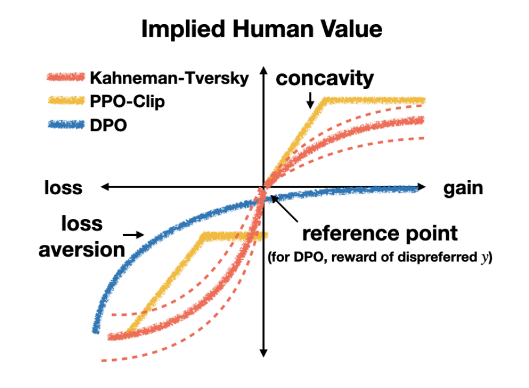
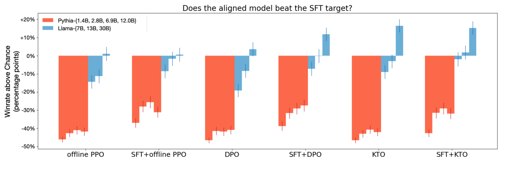
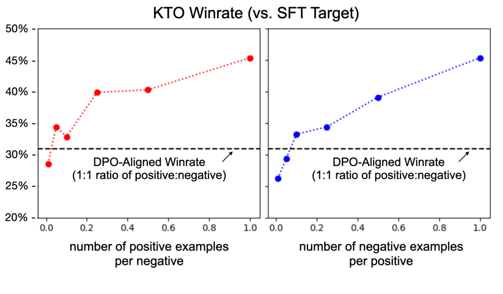

# KTO：Model Alignment as Prospect Theoretic Optimization

## 来源

- 文件：`raw/2402.01306v5.pdf`
- 标题：KTO: Model Alignment as Prospect Theoretic Optimization
- 团队 / 日期：Kawin Ethayarajh、Winnie Xu、Niklas Muennighoff、Dan Jurafsky、Douwe Kiela；Stanford University + Contextual AI；ICML 2024；arXiv:2402.01306v5，2026-09-08
- arXiv：<https://arxiv.org/abs/2402.01306>
- 定位：这是 **离线偏好 / 对齐损失族** 的方法论文，不发布独立模型。主实验是 Pythia 1.4B–12B、Llama 7B–30B、Mistral-7B / Zephyr-β-SFT，以及 Llama-3 8B 与 Qwen2.5 3B Instruct 的超参表。
- 易混：本页是 **KTO**。不要和 [DAPO](dapo.md) 混名（那是 2025 年 ByteDance Seed 的 GRPO recipe）。KTO **不是** GRPO 变体，也不解释「[DPO](dpo.md) 为何退出 2026 栈」。

## 核心结论

1. **DPO / PPO-Clip 的成功有一部分来自「像人」的损失形状，而不只来自偏好对**：作者把这类目标叫 human-aware losses（HALOs）。隐含奖励是 $r_\theta=l(y)\log(\pi_\theta/\pi_{\mathrm{ref}})$，价值看它相对某个参考点的增益 / 损失。Theorem 3.5 把 [DPO](dpo.md) 和 PPO-Clip 收进这个族；CSFT、SLiC 不满足不变性，不算 HALO（§3.2–3.3、Definition 3.4）。
2. **KTO 换的是人类价值函数，不是 DPO Eq. 7 的配对 logistic**：前景理论的 $v(z)=(z-z_0)^\alpha$ / $-\lambda(z_0-z)^\alpha$ 数值不稳，改成 logistic $\sigma$，用 $\{\lambda_D,\lambda_U\}$ 代替单一 $\lambda$，参考点从「那条 dispreferred $y$」换成 $\mathrm{KL}(\pi_\theta\|\pi_{\mathrm{ref}})$。目标是最大化 generation 的效用，不是最大化 $y_w\succ y_l$ 的似然（§4.1、Eq. 8）。
3. **不需要 pair**：监督是二元 desirable / undesirable。把 $n$ 条偏好拆成 $2n$ 条二元样本就能训；one-$y$-per-$x$ 去掉配对痕迹后仍然能超过 DPO（§4.1 Data、Table 3、Figure 5）。
4. **1B–30B 上匹配或超过 DPO，但任务并不均匀**：GPT-4 对 SFT target 的 winrate 上 SFT+KTO 与 SFT+DPO 同阶；Llama 上 KTO 单独显著好于 DPO 单独（7B / 30B，$p<0.01$）。Zephyr-β-SFT + UltraFeedback 的 GSM8K 从 DPO 的 40.0 到 KTO 的 53.5（+13.5）；TydiQA 上 KTO 反而低于 DPO（Table 2 / Table 5、Figure 3）。
5. **边界不能省略**：训练仍是离线闭式损失，不从当前策略采样 rollout，不是 RLVR / GRPO。最大公开对照 30B，任务是对话 winrate / MMLU / GSM8K / HumanEval / BBH，不是多轮 agent。作者自己写没有一种 HALO 普适最优；KTO 的价值函数来自货币赌博，几乎肯定不是人类读文本的价值函数（§4.5、§5、§6）。

## 机制（已据原文核实）

### 前景理论进损失的那一层

Tversky & Kahneman (1992) 的价值函数（Eq. 4）是：相对参考点 $z_0$，增益侧 $(z-z_0)^\alpha$、损失侧 $-\lambda(z_0-z)^\alpha$；中位超参 $\alpha=0.88$、$\lambda=2.25$。三个可迁移性质是：有参考点、增益侧凹（远离 $z_0$ 的敏感度递减）、损失厌恶。权重函数 $\omega$ 因人类看不到 LLM 的完整分布而被作者搁置（§3.1）。

HALO（Definition 3.4）把「金额」换成 nats：隐含奖励 $r_\theta(x,y)=l(y)\log[\pi_\theta(y|x)/\pi_{\mathrm{ref}}(y|x)]$，人类价值是 $v_{x,y}(r_\theta(x,y)-\mathbb{E}_Q[r_\theta(x,Y')])$。损失必须能写成 $a_{x,y}v_{x,y}(\cdot)$ 的期望加数据常数；除参考点分布 $Q$ 外，$l$、$a$、$v$、$C_D$ 不得依赖 $\pi_\theta$ 或 $\pi_{\mathrm{ref}}$。$l=\beta$ 时，$r_{\theta^*}=r^*-\beta\log Z(x)$，与 [DPO](dpo.md) Lemma 1 的奖励等价类一致（§3.2、Eq. 7）。

> 论文 Figure 1 原文标题："The utility that a human gets from the outcome of a random variable, as implied by different human-aware losses (HALOs). Notice that the implied value functions share properties such as loss aversion with the canonical human value function in prospect theory (Tversky & Kahneman, 1992)."（第 1 页）

这张图画的是 **DPO / PPO-Clip 相对典范 KT 曲线**，不是 KTO 自己的 $v$。KTO 的 $v$ 在 §4.1 才导出。

### 与 DPO Eq. 7 的关系

[DPO](dpo.md) Eq. 7 是对静态 pair $(x,y_w,y_l)$ 的 logistic 分类：

$$
L_{\mathrm{DPO}}(\pi_\theta;\pi_{\mathrm{ref}})=-\mathbb{E}_{(x,y_w,y_l)\sim\mathcal{D}}\Biggl[\log\sigma\Biggl(\beta\log\frac{\pi_\theta(y_w\mid x)}{\pi_{\mathrm{ref}}(y_w\mid x)}-\beta\log\frac{\pi_\theta(y_l\mid x)}{\pi_{\mathrm{ref}}(y_l\mid x)}\Biggr)\Biggr].
$$

KTO 不吃 pair。默认损失（Eq. 8）是：

$$
L_{\mathrm{KTO}}(\pi_\theta,\pi_{\mathrm{ref}})=\mathbb{E}_{x,y\sim D}[\lambda_y-v(x,y)]
$$

$$
r_\theta(x,y)=\log\frac{\pi_\theta(y\mid x)}{\pi_{\mathrm{ref}}(y\mid x)},\qquad
z_0=\mathrm{KL}\bigl(\pi_\theta(y'\mid x)\,\|\,\pi_{\mathrm{ref}}(y'\mid x)\bigr)
$$

$$
v(x,y)=\begin{cases}
\lambda_D\,\sigma\bigl(\beta(r_\theta(x,y)-z_0)\bigr) & y\sim y_{\mathrm{desirable}}\mid x \\
\lambda_U\,\sigma\bigl(\beta(z_0-r_\theta(x,y))\bigr) & y\sim y_{\mathrm{undesirable}}\mid x
\end{cases}
$$

相对 DPO 改了三层（§4.1）：

| 层 | DPO Eq. 7 | KTO Eq. 8 |
| --- | --- | --- |
| pair 需求 | 必须 $(y_w,y_l)$ | 单条 $y$ + 二元标签 |
| 损失形状 | $-\log\sigma(\beta(r_w-r_l))$，价值函数处处凹 | $\lambda_y-\lambda_y\sigma(\cdot)$，增益凹、损失凸；消融改成 $-\log\sigma$ 即「concave, as in DPO」 |
| 参考点 / 人类价值 | 那条 dispreferred $y$ 的隐含奖励 | 对全体输出的 KL；$\{\lambda_D,\lambda_U\}$ 代替单一损失厌恶 $\lambda$ |
| $\beta$ 的位置 | 从 RLHF 的 KL 约束带进奖励 | 显式放进价值函数，控制饱和速度（风险厌恶） |

$z_0$ **不反传**，只控制饱和。直觉：若把 desirable 的奖励「钝」地抬高，KL 一起涨，净效用不动；模型必须学会**是什么**让输出 desirable，才能在 KL 持平（甚至下降）时抬 $r_\theta$。损失侧因 KL 非负而饱和更快（§4.1）。

实践上无法对 $\pi_\theta$ 采样来估 KL。同一 microbatch 把输出循环错配成 $\{(x_1,y_2),\ldots,(x_m,y_1)\}$，共享参考点（$j=(i\bmod m)+1$）：

$$
\hat z_0=\max\Biggl(0,\frac{1}{m}\sum_{1\le i\le m}\log\frac{\pi_\theta(y_j\mid x_i)}{\pi_{\mathrm{ref}}(y_j\mid x_i)}\Biggr).
$$

这是有偏替代：错配是为了避开被故意挑成「典型好 / 坏」的 $(x_i,y_i)$；$\max(0,\cdot)$ 再加向上偏、降方差。作者把偏倚类比人类的 availability heuristic（§4.1 KL Estimate）。若 KTO 之前已在同一批 desirable 数据上 SFT，且 $\pi_{\mathrm{ref}}$ 就是该 SFT 模型，$\hat z_0$ 会很快趋近 0，可直接置 0；否则必须估。microbatch 至少 2。

数据：天然二元反馈直接当 desirable / undesirable。公开偏好集（HH、SHP、OASST）则把 $y_w\succ y_l$ **朴素拆开**——$y_w$ 当 desirable、$y_l$ 当 undesirable；作者标明这是简化，更合理的 pair→二元 分解留作未来工作。one-$y$-per-$x$ 每个 $x$ 只留一条 $y$，用来证明不必依赖配对结构（§4.1 Data）。

默认超参：$\beta=0.1$，$\lambda_D=\lambda_U=1$，有效 batch 32。实践学习率建议 $5\times10^{-6}$ AdamW（通常是 DPO 最优 LR 的 2–10 倍，因 KTO 的 reference-adjusted reward 量级更小）；正文对照实验为了和 Rafailov et al. 对齐，仍用 DPO 默认 LR + RMSProp（§4.2）。类别不平衡时取 $\lambda_D n_D/(\lambda_U n_U)\in[1,3/2]$（Eq. 9）。

### 理论：偏好似然不等于前景效用

- **Proposition 4.1**：参考调整后的隐含奖励 $\to\pm\infty$ 时，只要 $\|\nabla_\theta\log\pi_\theta\|$ 有界，该样本对梯度的贡献 $\to 0$。过难或过易的点被忽略——能躲开噪声标签，也可能欠拟合必须学的难例；作者建议降 $\beta$、加 epoch（§4.4、Eq. 10）。
- **Theorem 4.2**：同一奖励等价类（只差 $h(x)$）诱导相同最优策略、相同 Bradley-Terry 偏好分布，但在固定 $z_0$ 时价值分布 $V_r=\sigma(\beta(r-z_0))$ 不同。因此最大化偏好似然并不等于最大化前景效用（§4.4）。
- **Theorem 4.3**：对互相矛盾的 pair，若多数偏好比例 $p$ 不够高且 $\pi_{\mathrm{ref}}$ 足够未对齐，最优 DPO 策略可能更常生成**少数派** $y_b$；默认 $\lambda_D=\lambda_U$ 的 KTO 更新提高多数派 $y_a$ 的相对似然（§4.4）。

§4.5 的选用规则：反馈本就是二元、尤其类别不平衡时用 KTO；偏好数据若噪声 / 不传递性很低，DPO 可能更好（KTO 有欠拟合风险）；公开偏好集和 UltraFeedback 这类合成反馈都够吵，所以实验里 KTO 能打平或超过 DPO。

## 评测要点

两组主实验。第一组（§3.3 / §4.3，Figure 2–3）：Pythia-{1.4B, 2.8B, 6.9B, 12B} 与 Llama-{7B, 13B, 30B}，数据是 Anthropic-HH + OpenAssistant + SHP；GPT-4-0613 判 aligned 输出对 SFT target 的 winrate（helpful / harmless / concise）。第二组：Zephyr-β-SFT 在 UltraFeedback 上恰好 1 epoch（Table 2 / 附录 Table 5）；Mistral-7B 在 OpenAssistant 上（Table 3、附录 D）。

> 论文 Figure 3 原文标题："KTO is as good or better than DPO at all scales, as measured by the GPT-4-0613-judged winrate of the aligned model's generations against the outputs that would have been used for SFT. In fact, for the Llama models, KTO alone matches the performance of SFT+DPO and is significantly better than DPO alone. Error bars denote a 90% binomial confidence interval."（§4.3 / 第 7 页）

| 主张 | 数字 | 定位 |
| --- | --- | --- |
| SFT+KTO 与 SFT+DPO 在 1B–30B 同阶 | Llama 上 KTO 单独 vs DPO 单独在 7B、30B 显著（$p<0.01$，Holm）；Pythia 上两者无显著差 | Figure 3、§4.3 |
| 足够规模可跳过 SFT | Llama-{13B, 30B} 的 KTO 单独接近 SFT+KTO；测试过的方法里只有 KTO 如此。作者归因于无 SFT 的 DPO 会把回复拉得很长并幻觉多轮对话（Figure 4） | §4.3、Figure 4 |
| 不依赖 pair 结构 | Llama-7B 丢掉最多 90% desirable（$\lambda_U=1,\lambda_D=13.33$）仍超过 1:1 的 DPO。Mistral-7B + OASST：KTO 全量 0.652、one-$y$-per-$x$（数据少 72%）0.631、DPO 0.600、官方 Instruct 0.621（90% 二项区间） | Figure 5、Table 3 |
| Zephyr-β-SFT + UltraFeedback，1 epoch | GSM8K：SFT 39.0 / DPO 40.0 / KTO 53.5（+13.5 vs DPO）。BBH：46.3 / 44.1 / 52.6。AlpacaEval 2：6.4 / 7.8 / 12.5。TydiQA：36.3 / 36.5 / **31.2**（KTO 掉点）。平均 35.9 / 36.1 / 39.9 | Table 2、Table 5 |
| 损失形状消融 | 去掉 $z_0$：BBH −3.6、GSM8K −4.0。改成处处凹（$1-\sigma\to-\log\sigma$，DPO 形）：BBH −9.4、GSM8K −11.0。风险中性（$v$ 取恒等）：BBH 崩到 6.1 | Table 2 middle |
| 无 $\pi_{\mathrm{ref}}$ 变体 | 假设参考分布均匀，$r_\theta-z_0=\log\pi_\theta-H(\pi_\theta)$；$\lambda_D=1.75$ 时部分任务优于 DPO、仍落后标准 KTO。作者写它严格优于 ORPO（Hong et al., [arXiv:2403.07691](https://arxiv.org/abs/2403.07691)，**尚未 ingest**） | Table 2、§4.3 |
| 人类评估 | OASST 测试集 256 条，有效 214 对。KTO vs SFT target 72.9% ± 5.3，DPO 62.1% ± 5.7（90% 区间，$p<0.05$）。同设置 GPT-4：65.2% vs 60.0%，差距不显著 | 附录 D |

> 论文 Figure 5 原文标题："A KTO-aligned Llama-7B model can match or exceed the performance of its DPO-aligned counterpart while aligned on a smaller and highly imbalanced version of the same dataset, even with as few as 0.1 positive/desirable examples for every negative/undesirable one."（§4.3 / 第 9 页）

离线 PPO（dummy +1/−1、不更新 $\pi_{\mathrm{old}}$、非对称 clip $[0.25,4.0]$）在多数规模打平 DPO，Llama-30B 才明显落后，且对超参敏感（§3.3、附录 C）。这被用来支持「二元信号 + 对的归纳偏置就够」，不是把 KTO 写成 PPO / GRPO。

Table 1 是 UltraFeedback 上的推荐超参（AdamW、batch 32、梯度裁剪 10、$\lambda_D=\lambda_U=1$），不是 Figure 3 那组主实验：

| 模型 | 方法 | LR | $\beta$ | AlpacaEval (LC) | BBH | GSM8K (8-shot) |
| --- | --- | ---: | ---: | ---: | ---: | ---: |
| Llama-3 8B | SFT+KTO | 5e-6 | 0.05 | 10.59 | 65.15 | 60.20 |
| Llama-3 8B | KTO | 5e-6 | 0.10 | 11.25 | 65.26 | 57.92 |
| Llama-3 8B (LoRA) | SFT+KTO | 5e-6 | 0.05 | 11.14 | 64.46 | 59.97 |
| Llama-3 8B Instruct | KTO | 5e-6 | 0.25 | 18.86 | 64.28 | 76.42 |
| Qwen2.5 3B Instruct | SFT+KTO | 5e-6 | 0.10 | 13.01 | 32.39 | 61.11 |
| Qwen2.5 3B Instruct | KTO | 5e-6 | 0.50 | 16.63 | 20.41 | 60.35 |

已指令微调的参考模型要用更大 $\beta$（§4.2）。Qwen2.5 3B Instruct 上无 SFT 的 KTO 把 BBH 从 32.39 打到 20.41，说明「跳过 SFT」不是小模型上的自由午餐。

## 与已有沉淀的关系

- [DPO](dpo.md)：共享隐含奖励 $r_\theta=\log(\pi_\theta/\pi_{\mathrm{ref}})$ 和离线、训练时不采样这条轴。DPO Eq. 7 仍要 pair，价值函数处处凹；KTO Eq. 8 把监督改成二元、把 $v$ 改成增益凹 / 损失凸的 logistic，参考点改成 KL。KTO 把 DPO 分类为 HALO（Theorem 3.5），不是 DPO 的推论，也不是「DPO 为何退出 2026」的答案。
- [Iterative RPO](iterative-rpo.md)：仍在 DPO Eq. 7 上给 winner 加 NLL，pair 按最终答案对错构造。KTO 连 pair 都不需要。两条都是离线偏好损失，都不是 GRPO。
- [LLM RL policy optimization 对比](../comparisons/llm-rl-policy-optimization.md)：KTO **不进** GRPO 主表。那一页改的是 on-policy ratio / clip / critic / 采样；KTO 改的是离线人类价值函数。
- [Agentic 模型的后训练](../concepts/post-training-for-agentic-models.md)：2026 已收录报告的主轴是 RLVR / GRPO 家族和 MOPD。KTO 与 DPO 同属这条轴之前的离线对齐，只作历史对照。不要把「不需要 pair」写成生产 agentic RL 替代。
- [DAPO](dapo.md)：不要混名。DAPO 是 on-policy GRPO recipe；检索「DPO / KTO」若落到 DAPO，先回到本页或 [DPO](dpo.md)。
- IPO（Azar et al., [arXiv:2310.12036](https://arxiv.org/abs/2310.12036)）、ORPO（Hong et al., [arXiv:2403.07691](https://arxiv.org/abs/2403.07691)）、SimPO（Meng et al., [arXiv:2405.14734](https://arxiv.org/abs/2405.14734)）**尚未 ingest**。正文只把 ORPO 当无参考模型基线；不要把 KTO 的 no-$\pi_{\mathrm{ref}}$ 变体写成 ORPO。

## 待追问

- 货币赌博的 Kahneman-Tversky $v$ 几乎肯定不是人类读文本的价值函数。什么样的 $v$ 和 $Q$ 才描述语言？作者列为未来工作（§5）。
- 2026 agentic / RLVR 栈几乎不用 DPO，KTO 原文也不回答「生产上为何弃用离线偏好」；不能把本页写成那条因果。
- 在线 HALO、按分数的 HALO、其他模态，原文只点了方向（§5）。
- 朴素 $y_w$ / $y_l$ 拆分是否低估了真正二元反馈；one-$y$-per-$x$ 只在 OASST / 不平衡子采样上做过。
- Proposition 4.1 的饱和会不会在复杂可验证任务上变成系统性欠拟合？没有 RLVR 对照。

## 相关页面

- 比较：[LLM RL policy optimization 对比](../comparisons/llm-rl-policy-optimization.md)
- 相邻算法：[DPO](dpo.md)、[Iterative RPO](iterative-rpo.md)、[DAPO](dapo.md)（名字易混）
- 概念：[Agentic 模型的后训练](../concepts/post-training-for-agentic-models.md)
