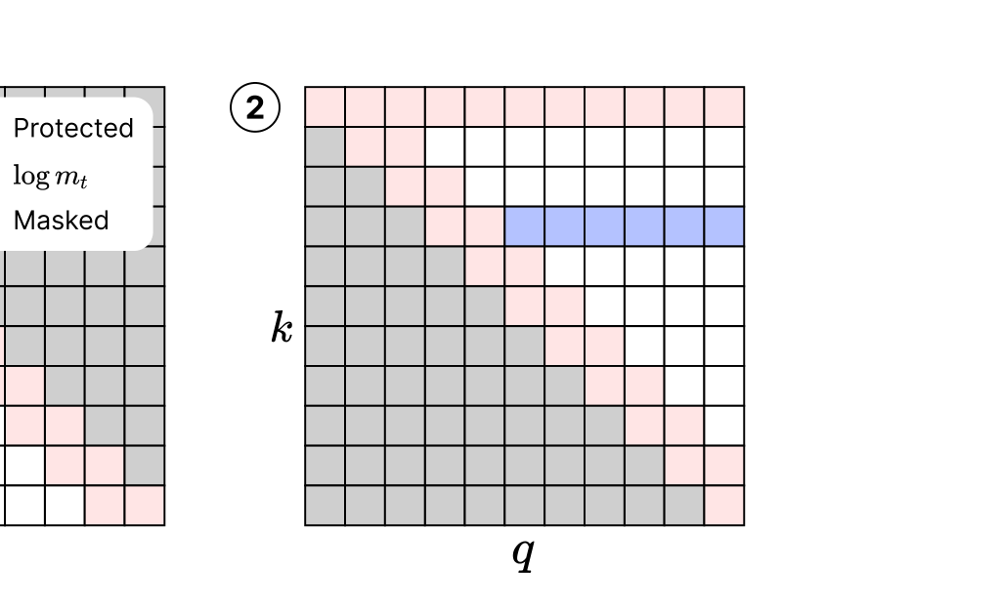
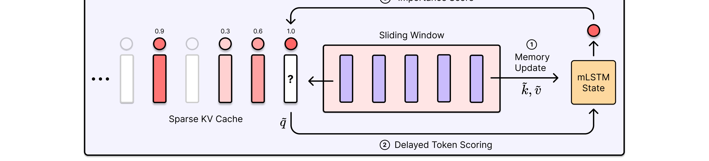
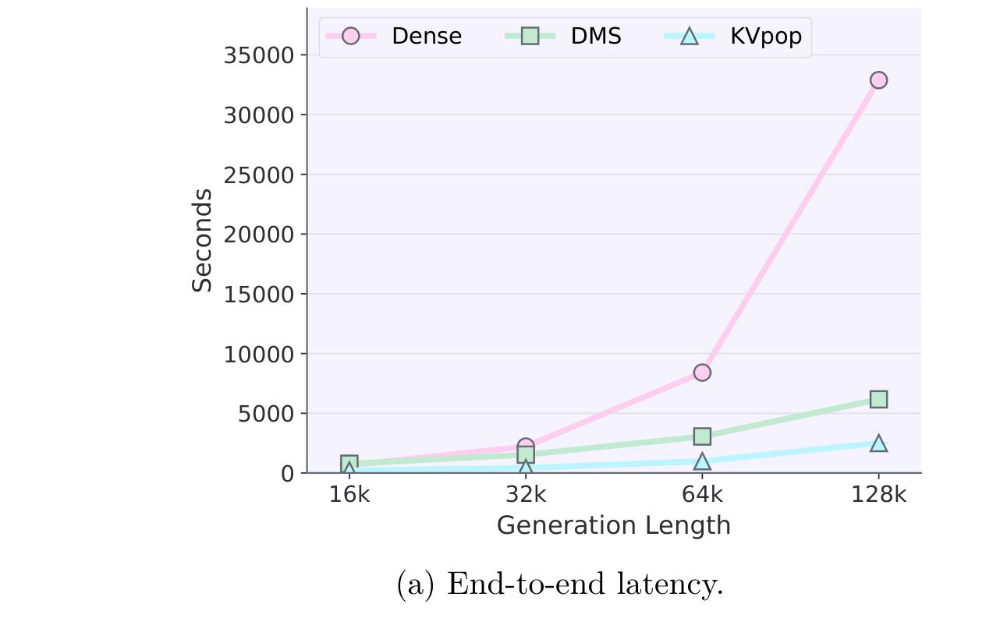
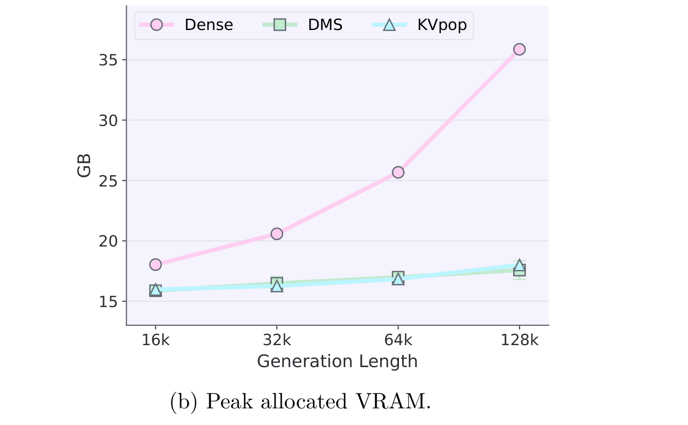
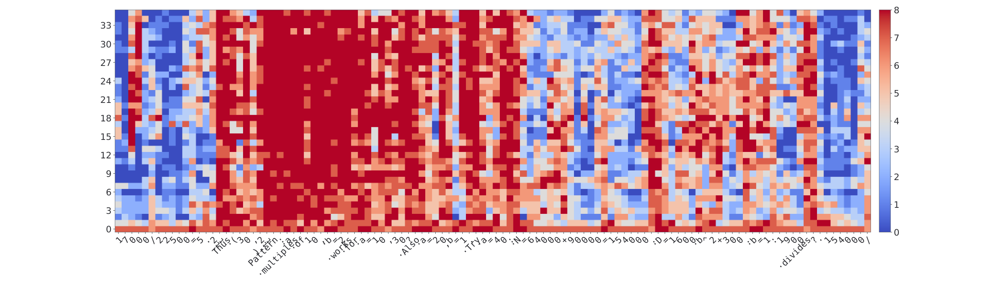

# KVpop: Key-Value Cache Compression with Predictive Online Pruning

## 来源

- PDF：`raw/2607.05061v2.pdf`（28 页）
- 标题：KVpop - Key-Value Cache Compression with Predictive Online Pruning
- 团队：NXAI + Johannes Kepler University Linz（Sepp Hochreiter 团队）
- 日期：2026-07-06（arXiv v2: 2026-07-08）
- arXiv：2607.05061v2
- 模型权重：`sirluk/Qwen3-8B-KVpop-4x`

## 核心结论

KVpop 是一种 **learned eviction**（学习式驱逐）方法，通过对 keep-or-drop 决策做直接监督来压缩 KV cache。与 DSA/MSA 等 sparse retrieval 方法不同，KVpop 永久丢弃 token 以强制 **固定 per-head KV budget** $B = s + w + k$（sink + protected window + long-range top-k），而不是在全量 cache 上做 per-query 选择。

两个关键设计区别于此前所有 learned eviction 方法：

1. **Future-attention target**：监督信号是一个 token 离开 protected window 后收到的 future attention mass，通过 transposed-attention pass 高效计算，不需要 materialize $S \times S$ dense attention matrix。
2. **Delayed stateful scoring**：scorer 不必在 token 入 cache 时就打分--可以用 mLSTM 维护记忆，延迟到 token 到达 eviction boundary 时再打分，从而利用近未来上下文。此前 DMS 等方法只延迟 eviction 操作本身，不延迟打分决策。

在 AIME 和 HMMT 数学推理上，Qwen3-4B 在 75% / 88% 压缩比下分别保留 98% / 97% 的 teacher 性能；Qwen3-8B 在两个压缩比下均达到 100%。学到的驱逐策略还能迁移到 OOD 的代码生成（LCB）和 STEM 推理（GPQA-D）。

## 方法

### 固定 per-head KV 预算

每个 KV head 的缓存预算为：

$$B = s + w + k$$

其中 $s$ 是 sink token 数（默认 4），$w$ 是 protected window 大小（默认 256），$k$ 是 long-range top-k 预算（2016 或 4032）。一旦序列长度超过 $s + w + k$，每个 head 的 cache 大小恒定，不随 context 增长。

### Future-attention target

打分目标不是过去的 attention 或局部 token 统计，而是 token 离开 protected window 后 **未来收到的 attention mass**。对 KV head $h$ 下的 token $t$，定义其 per-group mean future-attention mass：

$$m^{(h,g)}_t = \frac{1}{N_t} \sum_{d=t+w}^{S-1} p^{(h,g)}_{d \to t}$$

其中 $N_t = \max(1, S - (t+w))$，$p^{(h,g)}_{d \to t}$ 是 query head $(h,g)$ 在位置 $d$ 对 key $t$ 的 dense causal attention probability。跨共享同一 KV head 的 $G$ 个 query head 聚合（默认 max aggregation，实现"任一 head 强依赖就保留"的 existential criterion）后取 log 得到 target $r^{tgt}_{h,t}$。

### Transposed-attention：不需要 $S \times S$ 矩阵

target 定义用到 dense causal attention probability，但实现上 **从不 materialize** $S \times S$ 矩阵。方法是将 query 和 key 的角色互换，做一次额外的 attention-like pass（transposed-attention pass）：

- 原 key 位置 $t$ 变成 transposed query，原 query 位置 $d$ 变成 transposed key
- 点积恢复原始 logit $\ell^{(h,g)}(d,t)$
- 减去 per-query LSE normalizer 作为 score modifier
- 加 block mask $d \geq t + w$
- attention kernel 返回的 auxiliary LSE 直接给出所有 key 的 log future-attention mass

进一步用 student sparse pass 已返回的 **sparse LSE** 近似 dense causal LSE，避免单独的 dense attention pass。实验验证此近似在下游性能上与 dense target 一致。

> Figure 2（§ Efficient Target Implementation）：transposed-attention 把"每个 key 收到的未来 attention 总和"从 column-wise reduction 转成 query-wise reduction，复用 kernel 已有的 LSE 输出。

### Boundary-aware retention loss

在 query 位置 $q$，新可驱逐 token $t_{new} = q - w$ 刚离开 protected window。teacher 按有效分数（target + temporal decay）排序 eligible token，取 top-k，$t_{bnd}$ 是 teacher cutoff（top-k 中最后一个保留的 token）。boundary loss 是一个 pairwise logistic loss：

$$\mathcal{L}_{score} = \mathbb{E}_{q,h} \left[ \omega_{q,h} \cdot \text{softplus}\left(\frac{-y_{q,h}(\hat{r}_{h,t_{new}}(q) - \hat{r}_{h,t_{bnd}}(q))}{\tau}\right) \right]$$

其中 $y_{q,h} = +1$ 如果 teacher 保留 $t_{new}$，$-1$ 如果丢弃。loss 只关注改变 cache membership 的那一次比较，每个 sampled query position 成本 $O(1)$。

### 两种 scorer

**Stateless scorer（KVpop_mlp）**：每个 token 独立打分，输入 $x_{h,t} = [k_{h,t}; v_{h,t}]$，过一个 per-head 两层 MLP + SiLU。便宜但只能用 token 自身表示。

**Stateful scorer（KVpop）**：用 mLSTM（xLSTM 的 sublayer）维护 per-head 记忆状态。关键创新是 **延迟打分**：token 入 cache 时不打分，等到它到达 eviction boundary（离开 protected window）时，mLSTM 状态已处理到位置 $q$，用 $t_{new}$ 的 projected feature 作为 read query 去读 mLSTM 状态 $C_{h,q}$，输出 importance score。这让 scorer 能利用 token $t_{new}$ 入 cache 后到被驱逐前积累的近未来上下文。

> Figure 3（§ Online Importance Scorers）：mLSTM scorer 的三步流程--memory 更新、延迟读取、打分排名。与 DMS 的区别在于：DMS 延迟的是 eviction 操作（标记后暂不删），KVpop 延迟的是打分决策本身（标记前先积累证据）。

### 训练

- 模型：Qwen3-4B-Instruct-2507 和 Qwen3-8B
- 训练数据：Nemotron-Math v2（高 reasoning effort 子集，长度 $\leq$ 16384 的 Qwen token）
- 总 loss = KL 蒸馏（top-256 teacher logits）+ boundary loss
- scorer 输入 detached from computation graph：retention loss 只更新 scorer 参数，base model 只被 KL loss 训练
- 8×H100，FSDP，2000 步
- FlexAttention 实现 running top-k sparse mask；Fenwick tree（Triton kernel）计算 per-query cutoff rank

### Running top-k sparse attention

训练时需要一个并行 sparse mask。对每个 query 位置 $q$，保留的 key = sink ∪ recent window ∪ top-k eligible。关键观察：temporal decay 让 ranking 退化为 static priority（query-dependent 部分在固定 $q$ 下是常数），因此可以一次性排序所有 token，用 Fenwick tree 维护 eligible set 的 rank，$O(S \log S)$ 时间 $O(S)$ 空间算出 per-query cutoff。mask predicate 在 FlexAttention kernel 内 on-the-fly 生成，不存 $S \times S$ 矩阵。

## 实验结果

### 数学推理（Table 1）

| 模型 | 变体 | AIME 2024 | AIME 2025 | HMMT 2502 | HMMT 2511 | Abs. Avg | Rel. |
| --- | --- | --- | --- | --- | --- | --- | --- |
| **Qwen3-4B** | Teacher | .61 | .46 | .30 | .43 | .45 | 1.00 |
| | StreamingLLM | .47 | .33 | .24 | .33 | .34 | .76 |
| | TOVA | .56 | .38 | .28 | .10 | .33 | .73 |
| | StreamingLLM+ | .55 | .44 | .30 | .36 | .41 | .92 |
| | DMS | .62 | .44 | .28 | .38 | .43 | .96 |
| | KVpop_mlp | .62 | .43 | .29 | .40 | .44 | .98 |
| | **KVpop** | **.62** | **.44** | **.31** | **.39** | **.44** | **.98** |
| **Qwen3-8B** | Teacher | .58 | .49 | .28 | .37 | .43 | 1.00 |
| | StreamingLLM | .13 | .11 | .03 | .05 | .08 | .19 |
| | TOVA | .37 | .23 | .15 | .28 | .26 | .60 |
| | StreamingLLM+ | .53 | .41 | .25 | .35 | .39 | .91 |
| | DMS | .56 | .45 | .27 | .35 | .41 | .95 |
| | KVpop_mlp | .59 | .46 | .30 | .38 | .43 | 1.00 |
| | **KVpop** | **.57** | **.48** | **.31** | **.38** | **.44** | **1.00** |

CR=75%（$B = 4096$）。Pass@1，16 rollouts/prompt。

| 模型 | 变体 | AIME 2024 | AIME 2025 | HMMT 2502 | HMMT 2511 | Abs. Avg | Rel. |
| --- | --- | --- | --- | --- | --- | --- | --- |
| **Qwen3-4B** | Teacher | .61 | .46 | .30 | .43 | .45 | 1.00 |
| | StreamingLLM | .30 | .23 | .15 | .17 | .21 | .47 |
| | TOVA | .36 | .23 | .19 | .28 | .26 | .58 |
| | StreamingLLM+ | .45 | .33 | .26 | .29 | .33 | .74 |
| | DMS | .58 | .41 | .27 | .35 | .40 | .89 |
| | KVpop_mlp | .59 | .44 | .27 | .38 | .42 | .93 |
| | **KVpop** | **.61** | **.44** | **.30** | **.39** | **.44** | **.97** |
| **Qwen3-8B** | Teacher | .58 | .49 | .28 | .37 | .43 | 1.00 |
| | StreamingLLM | .13 | .11 | .03 | .05 | .08 | .19 |
| | TOVA | .08 | .07 | .09 | .08 | .08 | .19 |
| | StreamingLLM+ | .42 | .30 | .18 | .24 | .29 | .67 |
| | DMS | .52 | .38 | .22 | .31 | .36 | .84 |
| | KVpop_mlp | .57 | .39 | .31 | .40 | .42 | .98 |
| | **KVpop** | **.58** | **.44** | **.31** | **.39** | **.43** | **1.00** |

CR=88%（$B = 2048$）。

关键观察：

- **训练隔离**：StreamingLLM → StreamingLLM+（同 budget 但训练 model）→ KVpop 的递进隔离了"训练 model 适应固定 sparse pattern"和"学习 eviction policy"各自的贡献。训练恢复一部分 gap，learned eviction policy 才真正关上。
- **监督信号的重要性**：DMS 用 Gumbel-sigmoid 训练 gate，不从 teacher attention 蒸馏；KVpop 用 future-attention target 直接监督。在 CR=88% 下 DMS 落后 KVpop 8-16 个相对百分点。
- **CR=88% 下 training-free 方法崩溃**：StreamingLLM 和 TOVA 在 88% 压缩下几乎完全失效（Qwen3-8B 上 Rel 仅 19%）。

### OOD 泛化（Table 2）

Qwen3-4B 上，尽管只在数学推理数据上训练，KVpop 在 GPQA-D 和 LCB 上也接近 teacher：

| 变体 | GPQA-D (CR=75%) | LCB (CR=75%) | GPQA-D (CR=88%) | LCB (CR=88%) |
| --- | --- | --- | --- | --- |
| Teacher | .59 | .35 | .59 | .35 |
| KVpop_mlp | .59 | .35 | .57 | .35 |
| KVpop | .57 | .33 | .56 | .34 |

### 推理效率（Figure 4）

Qwen3-8B，batch size 1，75% 压缩，generation length 16k-131k：

> Figure 4（§ Inference efficiency，§ Why KVpop decodes faster than DMS）：KVpop 比 DMS 更快的原因是 KVpop 对每个 KV head 强制相同的固定 budget，而 DMS 的 dynamic gate 让少数 head 占满 long-range budget、其余 head 塌缩到 sliding-window-only，产生参差不齐的 per-head cache 更难编译和执行。

### Eviction pattern 分析（Figure 6）

> Figure 6（§ Eviction Policy Analysis）：KVpop 学到的是 content-dependent policy，不是简单 recency。纯数字 token 在完成局部计算后被驱逐，而组织推理结构的 token 跨层跨 head 被保留。DMS 的 pattern 则呈现 winner-takes-all：少数 head 接近 dense attention，多数 head 塌缩到 sliding-window-only（Appendix Figure 8）。

## 与已有方法的关系

### sparse retrieval vs. eviction

KVpop 明确区分两类方法：**sparse retrieval**（DSA、MSA、NSA、Quest、TokenButler 等）在每个 query 步选择 token 子集做 attention，但 full KV cache 仍在内存中，不强制 memory bound；**eviction**（StreamingLLM、TOVA、DMS、KVpop）永久丢弃 token，强制固定 cache 大小。KVpop 是 learned eviction 方法。

### 与 DMS 的核心区别

DMS（Dynamic Memory Sparsification，Łańcucki et al. 2025）是最接近的 baseline：

| 维度 | DMS | KVpop |
| --- | --- | --- |
| 打分时机 | token 入 cache 时 | token 离开 protected window 时（eviction boundary） |
| 监督信号 | Gumbel-sigmoid differentiable relaxation | future-attention target（transposed-attention pass 计算） |
| 延迟对象 | eviction 操作（标记后延迟删除） | 打分决策（积累近未来上下文后再打分） |
| per-head budget | dynamic（gate 控制各 head 实际分配） | fixed（所有 head 相同 budget） |

### 与 DSA/MSA 的区别

DSA/MSA 是 sparse retrieval 方法，不丢弃 token，全量 KV cache 仍在内存中。KVpop 是 eviction 方法，强制固定 cache。两者解决不同问题：sparse retrieval 减少 attention compute 但不 bound memory；eviction 直接 bound memory。论文明确将 sparse retrieval 方法排除在对比之外。

## 待追问

- **Abstract / contributions / conclusion 之间的数字不一致**：Abstract 说 Qwen3-4B 在 75%/88% 下保留 98%/97%（与 Table 1 的 Rel 一致）；但 contributions 和 conclusion 说 95%/94%（4B）和 95%/99%（8B），与 Table 1 的 1.00/1.00 不符。疑为 v1→v2 修订时 Table 1 更新但正文未同步。需查 v1 确认。
- KVpop 目前是 post-training retrofit，论文未探索 from-scratch native sparse training。是否能与 DSA 式预训练阶段 sparse 训练结合？
- 论文仅在 Qwen3 上验证，未覆盖 MLA 架构（DeepSeek 系）或 GDN 混合架构（Qwen3-Next 系）。scorer 对不同 attention 架构的迁移性如何？
- paged KV-cache manager（vLLM / SGLang）下的优势是否能保持？论文承认这是 future work。

## 相关页面

- [高效长上下文注意力](../concepts/efficient-long-context-attention.md)
- [稀疏注意力机制对比](../comparisons/sparse-attention-mechanisms.md)
- [百万 token 上下文服务](../concepts/million-token-context-serving.md)
