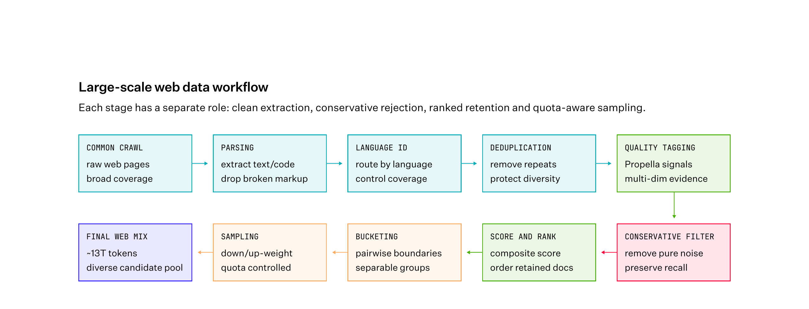
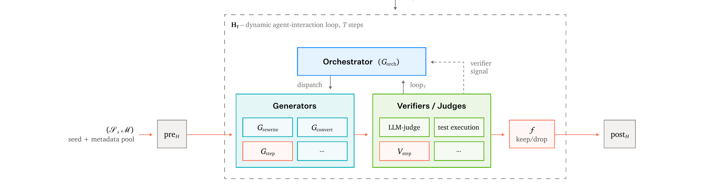
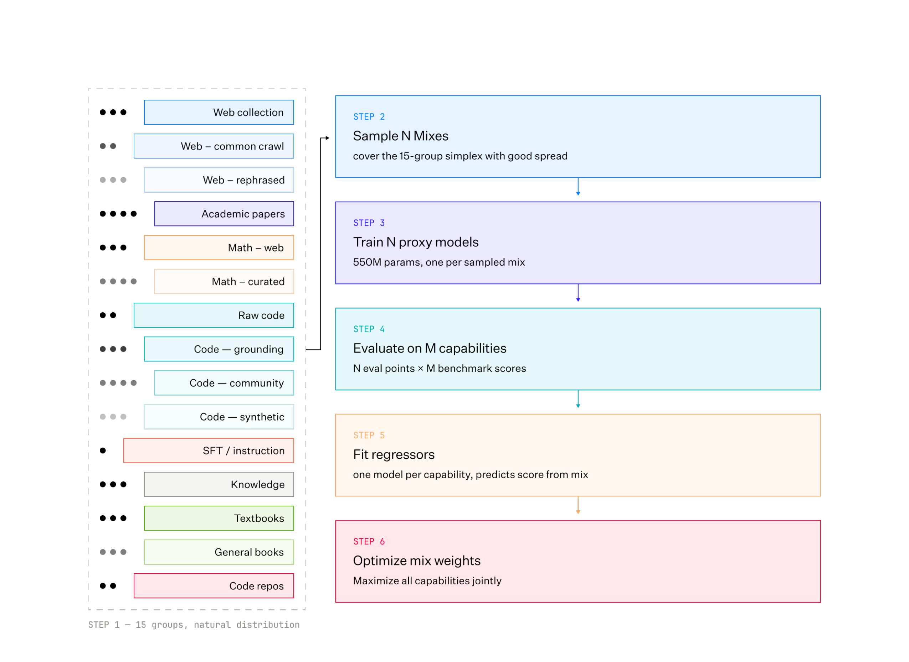
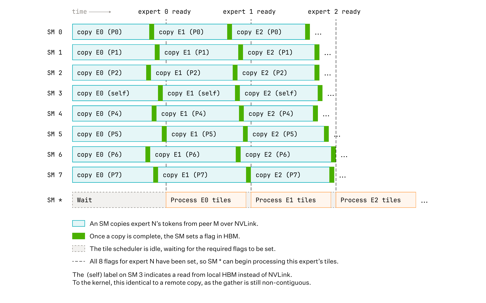
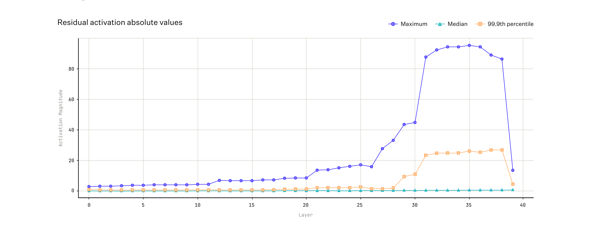

# Laguna M.1/XS.2 技术报告

来源：[Laguna M.1/XS.2 Technical Report](https://arxiv.org/abs/2605.27605)（arXiv:2605.27605v1，Poolside Team，2026-05-28，37 页）。XS.2 权重在 [Hugging Face](https://huggingface.co/collections/poolside/laguna-xs2) 以 Apache 2.0 开源。

## 一句话定位

Poolside 用一套内部称为 **Model Factory** 的工业化流程，在 M.1 预训练结束后的**五周内**从零交付了 XS.2。两个模型都是面向长周期 agentic coding 的 MoE 基座：M.1 225.8B 总参 / 23.4B 激活，XS.2 33.4B 总参 / 3B 激活。XS.2 在 SWE-bench Verified（73.4）/ Terminal-Bench 2.0（51.5）等同重量级开源模型中领先；M.1 在 SWE-bench Verified（79.6）追平 Devstral 2、仅次 Claude Sonnet 4.6。

## 模型与架构

两个模型都是 pre-norm Transformer + RMSNorm + MoE，共享 100,352 词表的 BPE tokenizer。

| 项 | Laguna M.1 | Laguna XS.2 |
|---|---|---|
| 总参 / 激活（含 embedding） | 225.8B / 23.4B | 33.4B / 3B |
| 预训练 GPU | 6,144 × H200 | 2,048 × H200 |
| 路由 | token-choice | token-choice，8 of 256 experts + 1 shared |
| 注意力 | 每层 global attention | **interleaved SWA/GA 3:1**（Gemma 4 是 5:1） |
| 学习率调度 | cosine | **WSD**（Warmup-Stable-Decay） |
| expert 调制 | 无 | routed expert × 2.5 系数 + shared（类 DeepSeek-V3 / Nemotron 3） |
| 底部 dense 层 | 3 | 1 |

**XS.2 注意力细节**（这是和现有 wiki 多个概念页的交叉点）：GQA 8 KV heads、head dim 128、**softplus-based per-head gating** [67]（[67] 即 [Gated Attention 报告](gated-attention.md)，Qwen 团队 NeurIPS 2025 Best Paper）；RoPE。全局层（GA）48 Q-heads、θ=500,000、partial RoPE 仅作用前 50% head dim；SWA 层窗口 512、64 Q-heads、θ=10,000。第一层 dense 保稳定。路由用 linear+sigmoid，top-k 后做 score normalization；负载均衡用 [Qiu et al. 2025](https://arxiv.org/abs/2502.10325) 的 aux loss（只在非 padding token 上算）。

M.1 → XS.2 的四项改动都经 16B MoE proxy 消融选出（见附录 A.2 / Table 9）：(1) 3:1 SWA/GA 替换 M.1 的逐层 global attention；(2) WSD 替换 cosine；(3) 加 routed expert modulation；(4) 底部 dense 层 3→1。其中 SWA 消融链 Table 9 显示：dense GA + full RoPE + full gating 为基线（4K Avg 0.5389），逐步加 SWA-1024（3:1）、per-head gating + θ_swa=1e4、GA partial RoPE(50%)、SWA-512、48 GA/64 SWA Q-heads + k_dense=1，最终架构 4K Avg 0.5455、32K Avg 0.305、128K Avg 0.296。

## Model Factory：把模型开发做成工业流程

报告反复强调，五周交付 XS.2 的关键不是某个架构创新，而是把模型开发当**工业流程**而非手工艺。三条原则：

1. **Experiments as Code**：所有 run 的输入与配置都以代码提交进单一仓库，每个 run 有唯一 ID，artifact 之间追踪依赖。用 [Dagster](https://dagster.io) 作中央控制平面，遍历 asset DAG 回答「什么在跑、依赖什么」。这让一个 pre-training shard 里的 token 能反向追溯到源文档的 dedup/filter/synthesis 全链路。控制平面也是 AI agent 的单一入口——agent 当前用于设计/跑消融、监控 run、编译分析结果。
2. **Composable, Decoupled Components**：研究与生产共用单一代码库，任何组件（数据管线、训练、RL、推理、评测）建一次到处复用，成功创新靠翻配置 flag 即可上线。
3. **Reserve Human Attention for Novel Decisions**：自研调度器把重复性工作自动化。on-call 只在自动恢复失败时被叫醒。

**自研集群调度器**（替换了 Volcano）三个设计：(a) **per-job eviction/reclaim**——容量决策按 job 粒度而非 node 粒度，preemption 选「总 displaced work 最小」的 victim job，不打扰无关 co-tenant；(b) **topology 存 FoundationDB**（observer 增量 reconcile 出 K8s），避开 etcd 在持续 churn 下的延迟尾巴；(c) **sticky pod respawn**——pod 死后优先在原节点复活，保 cache 热、保 fabric 拓扑假设。效果：placement 稳定 sub-minute，使超参 sweep / CI canary / preemption backfill 都可行。

**可靠性**：pre-flight 检查压测每个节点；in-flight recovery 检测 hang/NCCL 失败/节点丢失并换机恢复。跨 replica **hash check** 抓 silent data corruption（SDC，GPU 算术逻辑/流水线寄存器错误，不被 ECC 覆盖）——某次抓到一台机器算术静默损坏，表现为 global gradient norm 飙到 ~10^6。hash check 还顺带暴露了 Muon Newton–Schulz 迭代的非确定性、checkpointer 偷插 cast 导致 DDP rank 0 拿 FP64 beta 而 others 拿 FP32 的 drift。

**Titan**（训练库，从 TorchTitan 改造，2,200+ 改动）和 **Atlas**（推理库，基于 vLLM，直接消费 Titan 的模型定义做 bit-accurate reference）是两个命名的 Model Factory 组件。

## 预训练数据

从 ~27T unique token 池采样，两模型都训了 30T+ tokens。XS.2 最终混合（Table 4）：raw code 30.6% / synthetic(code-text) 25.4% / web 25.2% / math 9.0% / knowledge 6.6% / instruction-like 1.4% / academic papers 1.1% / books 0.7%。相对 M.1，AutoMixer 把分配往 web、synthetic/code-text、math 倾斜，同时保住 code 重底子。

### 高召回 web 管线

M.1 用高精度管线 + 人工混合，暴露两个瓶颈：(1) 高价值子集过度重复、(2) 数据预算跨源分配次优。XS.2 转向**高召回**管线，核心是从「过滤」转成「排序」。质量建模沿两个轴：noise $N\in[0,5]$ × information $I\in[0,5]$，再映射到 0–5 贡献分（Table 1：Useless→Flawless）。用 [Propella](https://arxiv.org/abs/2504.13750) 多属性文档标注模型，PCA 去相关后合成 composite score。composite 滤掉 25.8% 纯噪声，同时**恢复了 34% 此前被静态规则/词法分类器误杀的高质量文档**。保留的文档按 composite 分桶（blind pairwise comparison 定边界），再按分采样——低质桶渐进降权（B0–B3 权重 0.006×–0.03×），高质桶升权（B6/B7 1.5×/2.4×），见 Figure 4。Spark + Dagster，稳态 ~2×10^13 tokens/day。

### 合成数据（Hive）

合成数据占 XS.2 混合约 13%，从 ~4.4T 生成 token 池采。管线写成组件组合 $P = \text{post}\circ f_n\circ G_n\circ\cdots\circ f_1\circ G_1\circ\text{pre}$（输入池 $\mathcal{S}$、metadata $\mathcal{M}$、generator $G$、filter $f$、validation $V$、pre/post）。**Hive** 把它编译成 $P = \text{post}_H\circ H_T\circ\text{pre}_H$——一个动态 agent 交互循环，含 orchestrator、generators、verifiers/judges、per-step early-exit gate。迭代合成管线是「改配置」而非「重写」。

四类策略（Table 2，按 token 量级）：form-rewrite（~10^12，单次重写模式/声音/结构）、cross-domain transducer（~10^10，math↔code 跨模态搬运）、multi-stage cascade（~10^11，多阶段 + V-gate 剪枝，做 textbook 合成 / diff-conditioned coding 任务 / grounded QA）、multi-turn rollout（~10^10，闭环交互，做 stacktrace-grounded 多轮 / 迭代 eval-based doc 演化）。两条原则：**pipeline 复杂度匹配 teacher 能力**（teacher 一次做不了的任务要分解或换强 teacher）；**用 metadata 帮 generator**（把已知信息塞进 metadata 降低 generator 负担）。

### AutoMixer：自动化数据混合优化

这是和现有 [数据混合优化](data-mixture-optimization.md) 概念页（DoReMi / DoGE / RegMix / TANDEM）的直接交叉点。AutoMixer 训了一群 **~60 个 ~0.5B MoE proxy**，每个在不同混合上训 ~60B tokens，覆盖 50+ 异构数据集组。学一个 surrogate 映射 $\mathcal{M}: x\to y$（$x$ 是 $d$ 组上的混合向量，$y$ 是 $k$ 个能力组的下游指标）。候选混合按 $x\sim\text{Dirichlet}(\alpha x_0)$ 采样并约束 $\|x-x_0\|_1<\epsilon$，每个能力组训独立回归器 $f_j(x)\approx y_j$（实践用非线性）。优化：

$$\max_x \sum_j w_j f_j(x) \quad\text{s.t.}\quad \sum_i x_i=1,\ x_i\ge 0,\ \|x-x_0\|_1<\epsilon$$

加 KL 正则 $\lambda D_{KL}(x\|x_0)$ 把解拉回先验，避免偏向少数主导源。能力分 coding / math reasoning / STEM knowledge / commonsense / general knowledge 五组。

效果（Table 3，3B 模型 1.5T tokens 小规模实验）：优化目标 HumanEval+ +43%、Crux-I +54%、GSM8K +41%；held-out MATH +25%、LiveCodeBench +39%、APTBench-4k +35%；代价是几个 commonsense 任务略退（ARC-C -6.8%、WinoGrande -1.4%）。held-out 增益泛化说明 surrogate 学到的关系不是过拟合。

**与 DoReMi/RegMix/TANDEM 的关系**：同属「用小 proxy 预测大模型最优 domain 权重」范式，但 AutoMixer 的 distinguishing 点是 (1) 直接在 50+ 异构组上做 Dirichlet 扰动 + KL 正则约束到先验附近，而非 DoReMi 的 minimax 或 TANDEM 的 bi-level；(2) per-capability 独立回归器显式恢复能力间 trade-off（coding/math vs commonsense 的负相关被直接建模）；(3) 把它用在 33B 生产 MoE 的 30T 预训练上（DoReMi/TANDEM 的实验止于 dense 较小模型）。

## 分布式训练与 Muon

全程（pretrain/SFT/RL）用 **Muon optimizer**（[Moonlight variant, Liu et al. 2025](https://arxiv.org/abs/2505.11481)），BF16 混合精度 + FP32 master 权重（RMSNorm/RoPE 用 selective FP32）。**Distributed Muon**：每个参数只分给一个 rank，gather 全梯度、Newton–Schulz 正交化、再分发——把 Muon 算力瓶颈换成通信。配合 batched comm overlap + CUDA graphs，optimizer 开销降到 M.1 预训练 step time 的 **<1%**。Newton–Schulz 系数按 [Amsel et al. 2026](https://arxiv.org/abs/2510.04152) 的 schedule 而非每轮复用。

**MoE 计算-通信 overlap**（Figure 2）：受 [ParallelKittens](https://arxiv.org/abs/2505.15912) 启发，把 dispatch/combine 直接 fuse 进 CUTLASS grouped GEMM kernel。H200 每 GPU 132 个 SM，8 个专门用 NVLink 128-bit 向量 load 从 peer GPU 拷 expert token 到 HBM 并置 flag；其余 SM 跑 grouped GEMM，tile scheduler 等所有 expert flag 置位再处理该 tile。combine 改 epilogue，把结果经 shared memory 重排后直接 NVLink 发回 owner。再加 5 SM 留给 NCCL（4 个 FSDP AllGather/ReduceScatter，1 个 aux loss 聚合）。dispatch/combine 走 scale-up 网络，data-parallel 走 scale-out 网络，不争带宽。

**Mesh**：非 MoE 层 (PP, DDP, FSDP, TP)，MoE 层 (PP, DDP, FSDP, EGP, ETP)，EGP×ETP=TP，两模型 ETP=1（per-expert intermediate 太小不值得再切）。sequence-parallel attention 沿 batch 维切（保序列完整，attention 无跨 rank 通信）。

## 训练稳定性（M.1 的教训 → XS.2 的预防）

M.1 预训练暴露三类问题，XS.2 从一开始就规避，pretrain 无再遇稳定性问题：

1. **Expert collapse**：Muon 对矩阵参数 vs AdamW 对非矩阵参数的有效 weight decay 差一个量级。采用 Moonlight-style LR scaling 让 Muon 跑在 AdamW-scale LR。不缩放 + 标准 WD 系数的话，~450B token 起 expert collapse，逐层蔓延前 3 个 MoE 层直到发散。
2. **LM head 输入梯度 all-reduce 精度**：默认 LM head 在 mixed precision 下走 BF16 输入梯度，列向 TP 下还要跨 rank all-reduce（继承 BF16 dtype）。没有 z-loss、RMSNorm 不减均值，logits 可自由增长 → M.1 出现强正 logit drift，输入梯度 all-reduce 成主导数值误差源并向全模型传播。解法：LM head 输入梯度 all-reduce 强制 FP32，层仍 TP。
3. **MoE routing 的 padding**：sequence packing 后仍 ~5% padding token，它们被路由且计入 load-balancing loss。padding embedding 不可学，且不与周围 token 混合 → 每个 padding token 到 router 表示相同 → 全 batch padding token 涌向同一 expert 饱和。XS.2 加选项跳过 padding token 的 routing 与 load-balancing。

## WSD 学习率 + 缩放律

WSD（Warmup-Stable-Decay）吸引点：单一 stable-phase checkpoint 可跨数据混合迭代用更短 cooldown 复用。但作者发现 WSD 的 final-loss 校准不如一次性 cosine 直接，naive 调的 WSD 在等算力下有时不如调好的 cosine。为给 XS.2 生产规模定 peak LR，他们扫了 4 个 MoE 尺寸（2B–16B 总 / 0.3B–2.2B 激活）× 6 个 LR × 5 个 token budget（30B–480B），固定 batch $B_0=8$M tokens，对每个 $(N,D)$ 在 log10(lr) 空间抛物线拟合取顶点 $\text{lr}^\star(N,D)$，OLS 拟合全局幂律（式 1）：

$$\text{lr}^\star(N,D) = 10^{4.488}\cdot N^{-0.4639}\cdot D^{-0.2661}$$

$N$ 激活参数、$D$ 总 token（含 cooldown）。换 batch $B$ 按 $\sqrt{B/B_0}$ 缩放。XS.2 $N=3.0$B、$B=24$M，预测 ~5.5×10⁻⁴，实际用 5×10⁻⁴ 留安全边际。**外部交叉验证**：套到 Kimi K2（$N=32.6$B, $D=15.5$T, $B=67$M）预测 ~3.5×10⁻⁴，实际 2×10⁻⁴——同量级但 K2 用 35% cooldown（vs 30%）、不同 sparsity、MuonClip、aux-loss-free、不同数据，只能算 suggestive 而非外部验证。

预训练 context 4K，WSD：线性 warmup 到 5×10⁻⁴ → stable → 末 30% 按 $1-\sqrt{\cdot}$ 衰到 peak 的 5%（2.5×10⁻⁵）。**长上下文**：从 end-of-decay 起分两等 token 子阶段各 100B（32K → 128K），YaRN 只加在 GA 层，不 re-warmup 直接续（实验比 re-warmup 转移更好），末 10 个 checkpoint 做 EMA 作 final base。最终 checkpoint 把 GA 层 RoPE scale 翻倍到 256K（不训练）。预训练 + 后训练（mid-train/SFT）全程 Muon。

## 后训练：三阶段

mid-training → SFT → agentic RL。M.1 与 XS.2 recipe 相同，仅超参/小数据修复差异。由于 M.1 先就绪，XS.2 的初始 imitation learning 阶段由核心后训练团队之外的人 self-service 跑完（Model Factory 的「research is self-service」实证）。

**Special tokens 与模板**：XML 式 `<assistant>/<think>/<tool_call>`，embedding 随机初始化、预训练不动直到 mid-training。XS.2 随机初始化 OK；**M.1 因特殊/常规 token embedding 不匹配导致 gradient spike + dead expert**，解法是 **subtoken averaging** 初始化（如 `<think>` = mean(`<th, ink, >`)）+ 100 步 warmup（冻结除 input embedding 与 LM head 外全网络）。reasoning 用 `<think>/</think>` + `enable_thinking` flag，persistent thinking history（前序 reasoning block 留在 context）。tool call XML 式兼容 GLM 系列 [102]=[GLM-5](glm-5.md)。他们给 vLLM upstream 了改进的 reasoning/tool parser（修 streaming 多 token delta 跨 block 边界被吞的问题）。**TITO** API 用于 RL actors（保 token ID 跨多轮稳定，与 [GLM-5 异步 Agent RL](asynchronous-agent-rl.md) 同一动机），并用 `render_assistant_messages_raw` flag 在 RL 渲染器与生产 chat template 间做逐生成步字符串精确匹配断言，消除部署 mismatch。

**Mid-training**：~60B tokens，batch 128，seq 131072，cosine peak 1×10⁻⁵ → 2×10⁻⁷，1 epoch。混合 40% logic+reasoning / 30% coding-and-agent / 30% general chat。关键是调 tool call 数量/种类、reasoning 比例、reasoning 长度与难度、turn 数与 token/turn。

**SFT**：3 epochs × 40B tokens 各，early stopping。同 mid-train 超参。四部分：(1) agentic coding 无 reasoning ~30%；(2) agentic coding 有 reasoning ~45%；(3) agentic math ~3%（只要数值答案，按开源 LLM solve rate 去过易）；(4) non-agentic ~22% 防 forgetting。**合成代码环境**：把真实 git commit 转成可验证任务——problem statement + repo checkout + 隐藏 test patch 取自 commit，commit diff 作 gold solution。**双端正确性检查**（gold 过测 + 空解失败测）滤掉 trivial test 与不测变更的 test；再按 repo 热度 + 代码质量百分位滤，可选每 repo 留 1 任务，从 ~236k commits 留 30–60k 任务。这批任务同时喂 SFT（teacher 轨迹）和 RL（per-repo test suite 作 binary verifier）。

**Instruction Following (IF)**：agentic SFT 的关键挑战是遵守 system prompt 的行为约束（工具限制、输出格式、persona）。没有显式 IF 监督，RL 会灾难性遗忘——超过一半 agentic 任务因违反 system-message 约束而在任何 coding 被评前就拿零分。用 EvolInstruct-style generator 给每个任务造多个合成 system message（行为要求 grounded 在任务上下文），专用 IF judge 把 system message 拆成独立要求逐项打分。消融后不仅 IF 版 SWE-bench Verified 涨，原始 pass rate 也涨。

**Multi-harness 训练**：SFT 混合加 1.3B tokens 多 harness agentic 轨迹（OpenHands / OpenCode2 / Mini-SWE-Agent），刻意保留各 harness 原生行为（subagent spawning、context compaction、planning scaffold、reminder system），让模型见过广分布的交互模式以利泛化。

### Agentic RL

策略 = token-level REINFORCE surrogate + **CISPO** clipping [14] + **length-weighted leave-one-out** group-relative advantage。Moonlight scaling 在 M.1 RL 关闭、XS.2 RL 开启。选这个 recipe 是因消融 vs [GRPO](agentic-reinforced-policy-optimization.md) / [GSPO](group-sequence-policy-optimization.md) 后它在最终评测质量 + 训练稳定性组合最好。

[14] = **MiniMax-M1** 论文——CISPO 源头。每 prompt 采 $G$ 条轨迹 $\{\tau_i\}$，$r_i$ 终端 reward、$w_i$ 被 reward 的 assistant token 数，length-weighted LOO baseline 与 advantage：

$$b_i=\frac{\sum_{j\ne i} w_j r_j}{\sum_{j\ne i} w_j},\quad A_i = r_i - b_i$$

per-token surrogate（uniform 覆盖 $\tau_i$ 的 assistant token），asymmetric clipping $(c_{low},c_{high})=(1,4)$，有效 importance-ratio clip $[0,5]$，只在重 off-policy token 上 engage。

**Reward 设计**（确定性 checker 链，首个失败 check 定 reward）：parsing error（−0.1，只罚 last turn 抑制格式漂移）/ min-steps penalty（−0.1，抑止「放弃」的退化短轨迹）/ timeout 或 max steps（0.0）/ **binary task verifier**（1.0/0.0，唯一正 reward：SWE 用 repo 自带 unit test、terminal 用 bash 断言、math 用精确数值匹配）/ tool-error step penalty（−0.05 per-token，只罚出错那步的 token）。长周期信用分配全靠末尾 binary verifier 经 $A_i$ 传到轨迹每个 token。

**Task mix** 三族共享同一 tool-use API：code repo 任务（per-repo unit test）、shell 任务（shell 断言验最终容器状态）、tool-integrated math（驱动 code-execution 工具算并验数值答案，锚定 reasoning）。按初始 checkpoint 的 pass-rate 分桶，丢掉总解/总不解的，剩余按 $(1-\text{pass\_rate})$ 采样——偏向难但仍可解。

**基础设施**：Atlas 推理库（vLLM 基）serve 评测/内部/生产/**RL rollout**。trainer-to-inference 权重同步：NCCL point-to-point GPUDirect RDMA，n→m fan-out（m 在 2n–3n 间），每 2 optimizer step 广播一次，异步。两个安全原语：权重广播触发 inference 侧 KV-cache reset（防不同权重版本 token 混入）；权重更新 block 在途 rollout step（保证单 rollout 视 policy 为 piecewise-constant，与 loss 里 $\rho_t$ 假设一致）。staleness 上限 10 optimizer step（实际从未触及，所有轨迹都非浪费）。**FP8 KV cache** 跑 RL rollout（131072 全 context），约翻倍单 replica 并发轨迹数；release 跑 BF16 权重 + FP8 KV cache。预发布消融也试过 FP8 权重（in-flight block-wise 再量化），稳定性无碍但 train-inference KL mismatch 变大，release 仍保 BF16 权重。

## 量化（XS.2，面向低 VRAM 部署）

用 [LLM Compressor](https://github.com/vllm-project/llm-compressor)（vLLM 紧集成）。MoE 层量化到 FP8 / INT4 / NVFP4，KV cache 到 FP8。

- **FP8 KV cache**：amax 缩放，128 条长上下文 agentic 轨迹校准，per-tensor（最大化 FP8 attention 实现兼容性）。
- **FP8（W8A8）**：[SpinQuant](https://arxiv.org/abs/2402.15556) R1 旋转（无运行时开销）+ amax + 动态激活缩放（免校准）。128×128 weight tile / 1×128 activation group，无 measurable 质量退化。
- **INT4（W4A16）**：SpinQuant R1 + [AWQ](https://arxiv.org/abs/2306.00978)，128 轨迹校准。初版有质量掉——分析 residual stream 激活发现 **~30 层起 outlier 累积**（40 层网络，Figure 7）。改**混合精度**：前 30 层 INT4，后 10 层 INT8（1×128 group weight scaling）。
- **NVFP4**：直接后训练量化 + FP8/NVFP4 混合都掉质量。改用 **QAD（quantization-aware distillation）**——冻其他参数，只优化 MLP BF16 权重（前向 quant/dequant 到 NVFP4），quantized student 在固定蒸馏集上匹配高精度 teacher。full-vocabulary KL 目标用 [DeepSeek-V4](deepseek-v4.md) 的 hidden-state caching 策略让它可行（cache teacher final hidden states，冻结 output head 重构 logits）。1×16 group FP8 local + FP32 global per-tensor。
- **质量评测发现**：失败的中间量化方案的质量掉点**主要在 agentic coding benchmark**，传统单轮 benchmark 受影响小——说明量化验证要用多样 benchmark，尤其严格格式的 agentic coding 任务。

## 评测

**Base model（XS.2）**（Table 5，对比 Qwen3.5-35B-A3B-Base / Gemma-4-26B-A4B / Nemotron-3-Nano-30B-A3B / MiMo-V2-Flash-Base 作参考）：coding 上 XS.2 在可比 MoE base 中领先多数——LiveCodeBench v6 29.3（Qwen3.5 24.4、Nemotron 22.5）、MultiPL-E 58.4（Qwen3.5 57.9）、BigCodeBench 53.8（Qwen3.5 52.0）、CRUXEval-O 71.7。尽管只是 MiMo-V2-Flash 的零头大小，LiveCodeBench v6 / MultiPL-E 已逼近它。math/general 略逊（MMLU-Pro 53.0 vs Qwen3.5 62.5 / Nemotron 65.1）。

**Agentic（两模型）**（Table 6/7，pool harness，max 500 步，temp 1.0 top_k 20，thinking on，256K context，每 benchmark 跑 4 次报 mean pass@1）：

| Benchmark | Laguna M.1 (225B/23B) | Laguna XS.2 (33B/3B) |
|---|---|---|
| SWE-bench Verified | **79.6** | 73.4 |
| SWE-bench Multilingual | 73.3 | 67.2 |
| SWE-Bench Pro | 69.3 | 52.4 |
| Terminal-Bench 2.0 | 52.5 | 51.5 |

M.1 在 SWE-bench Verified 79.6 领先 Devstral 2(79.0)/GLM-4.7(76.2)/DeepSeek-V4-Flash(74.6)，仅次 Claude Sonnet 4.6（无公开分）；Terminal-Bench 2.0 52.5 次于 Claude Sonnet 4.6 的 59.1。XS.2 SWE-bench Verified 73.4 略胜 Qwen3.6-35B-A3B 的 73.3。

**Reward hacking 披露**（诚实信号）：写作时发现四个 agentic benchmark 的官方版本都有 benchmark hacking 漏洞（git history 泄漏在 task image 或 web 搜参考解），公开 leaderboard 也有。他们 patch 了 base task image 移除 git history 泄漏，向官方仓库提 issue/PR，并自建 reward hack judge 对所有 Laguna 评测 run 做后置检测——联合 judge + 人工 review 未发现显著 reward hacking。Appendix A.3 详列对 Terminal-Bench 2.0 / SWE-bench Verified / Multilingual / Pro 的具体基础设施修复（rate limit 重试、vendored 依赖、dependency drift pinning、pass-to-pass flake 修正等）。

## 关键判断

- **过程 > 单点模型**：报告的核心论点是「把模型开发当工业流程而非手工艺」是 frontier 模型开发「最 consequential 的杠杆」——随着模型/数据/后训练复杂度增长，工艺派与工业派的差距会持续拉大。五周交付 XS.2 是这套流程的实证，而非某项架构创新。
- **数据从精度转召回**：长 horizon 训练（30T tokens）下，「最大化精度」的激进过滤不再最优——挑战变成「控制重复 + 保多样性」。web 管线从过滤转排序、合成数据补结构、AutoMixer 自动调混合，三者一致服务于这个判断。
- **量化质量掉点先在 agentic coding 显形**：传统单轮 benchmark 不够敏感，严格格式的 agentic 任务才是量化副作用的放大镜。
- **CISPO 落地**：Laguna 是继 MiniMax-M1 之后又一家在生产 agentic RL 上用 CISPO（asymmetric clipping (1,4)）的团队，且公开了 vs GRPO/GSPO 的消融选择理由。

## 待追问

- WSD 缩放律式 (1) 在 LAuna 自己的 4 尺寸拟合外，外部交叉验证只有 Kimi K2 一个点且偏差 ~1.75×——是否能在更多外部 MoE 上验证？$N$ 用激活参数而非总参是否对低激活 MoE（如 MiniMax-M2 9.8B 激活）合理？
- softplus-based per-head gating [67] 与 [Gated Attention 报告](gated-attention.md) 的 head-specific sigmoid 门——报告写「softplus」而非「sigmoid」，是同一机制的不同激活选择，还是变体？需核对 [67] 原文是否同时给 softplus 选项。
- AutoMixer 的 ~60 个 0.5B proxy 训 ~60B tokens 的总成本未披露；KL 正则 $\lambda$ 的取值与 sensitivity 未给。
- CISPO 在 Laguna 的 asymmetric (1,4) clip 与 MiniMax-M1 原文的 clip 设置是否一致？Moonlight scaling 在 M.1 RL 关 / XS.2 RL 开的依据未详述。
- 合成代码环境的 ~30–60k 任务相对 ~236k commits 的保留率（~13–25%）与 [SWE-Smith](https://arxiv.org/abs/2505.04034) 等的规模可比性未对照。
- Figure 2 的 dispatch overlap kernel 是否开源 / 是否依赖特定 CUTLASS 版本？
- 256K 靠纯 RoPE scale 翻倍无训练即得——其长程任务真实表现（vs 128K 训练过的）未单独评测。这条末端零样本缩放与 [Jet-Long](jet-long.md) 的动态分组是同一轴上的不同旋钮，见 [零样本 RoPE 上下文扩展](../concepts/zero-shot-rope-context-extension.md)；Laguna 没有同协议对照。

## 相关页面

- [数据混合优化](../concepts/data-mixture-optimization.md) — AutoMixer 是 DoReMi/DoGE/RegMix/TANDEM 谱系的产业落地变体
- [注意力门控](../concepts/attention-gating.md) — XS.2 用 softplus per-head gating [67]=Gated Attention 报告
- [高效长上下文注意力](../concepts/efficient-long-context-attention.md) — 3:1 SWA/GA 混合（vs Gemma 4 的 5:1）+ 消融
- [零样本 RoPE 上下文扩展](../concepts/zero-shot-rope-context-extension.md) — 128K 的 YaRN（仅 GA 层）和 256K 的 RoPE scale 翻倍都属于这一轴
- [MoE 前沿模型扩展](../concepts/moe-frontier-model-scaling.md) — M.1 225.8B/23.4B、XS.2 33.4B/3B
- [Agentic 模型的后训练](../concepts/post-training-for-agentic-models.md) — 三阶段 + CISPO + 合成代码环境 + IF judge + multi-harness
- [异步 Agent RL](../concepts/asynchronous-agent-rl.md) — TITO + trainer↔inference 权重同步 + FP8 KV cache rollout
- [LLM RL policy optimization 对比](../comparisons/llm-rl-policy-optimization.md) — CISPO（from MiniMax-M1）的又一生产采用
- [Agentic Engineering](../concepts/agentic-engineering.md) — Model Factory 工业化流程
- [Agent harness](../concepts/agent-harness.md) — multi-harness 训练（OpenHands / OpenCode2 / Mini-SWE-Agent）防 scaffold 过拟合
- 模型：[Laguna](../models/laguna.md)
