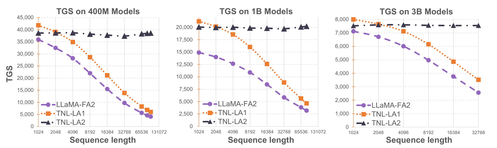
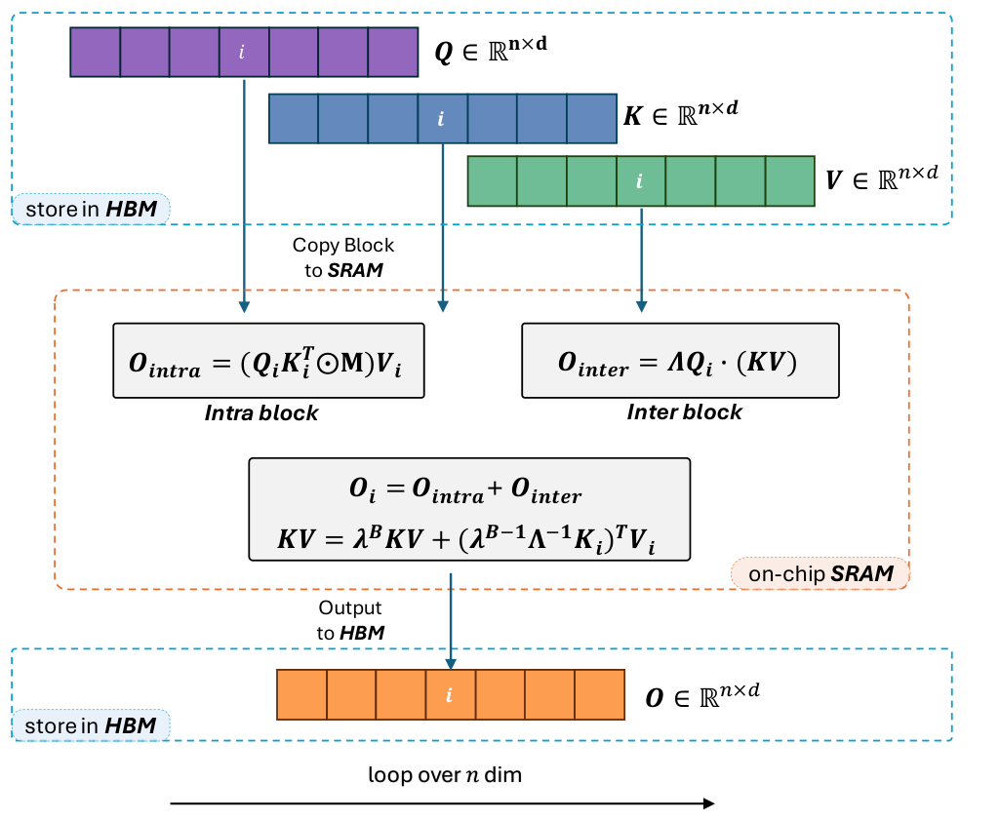

# Lightning Attention-2

## 来源

- 文件：`raw/2401.04658v2.pdf`
- 标题：Lightning Attention-2: A Free Lunch for Handling Unlimited Sequence Lengths in Large Language Models
- 团队 / 日期：Zhen Qin、Weigao Sun、Dong Li、Xuyang Shen、Weixuan Sun、Yiran Zhong（OpenNLPLab）；通讯 Yiran Zhong；arXiv:2401.04658v2，2024-01-15（PDF 元数据标 ICML 2024）
- 代码：[OpenNLPLab/lightning-attention](https://github.com/OpenNLPLab/lightning-attention)（摘要超链）
- 定位：**因果线性注意力的 tiling / IO-aware kernel**，不是新的状态更新规则，更不是 GDN/KDA 的 delta rule。实验载体是 TransNormerLLM 的 NormAttention，不发布新基座。机制归属 [线性注意力与 delta rule](../concepts/linear-attention-and-delta-rule.md) 演进表的「朴素 / 标量衰减」一档。

**FlashLinearAttention 先是 [GLA](gated-linear-attention.md) 的算法名**（I/O-aware chunkwise），后来 `flash-linear-attention` 仓库才收 Lightning / GLA / RetNet / GDN。本页不把它写成第三种注意力。原文代码在上面的 OpenNLPLab 仓库。

## 核心结论

1. **线性注意力理论上 $O(nd^2)$，因果设定被 cumsum 卡住。** 去掉 softmax、用结合律写成 $O=\mathrm{Norm}(Q(K^\top V))$ 之后，推理可以递推固定 $d\times d$ 的 $KV$；但因果训练要按位置做累积和，墙钟速度回不到理论值（§1、§2.1、Hua et al. 2022）。
2. **Lightning-1 只解决了 I/O，复杂度仍是 $O(n^2d)$。** 它把 FlashAttention 的分块搬到线性注意力上，全程左乘 $(QK^\top)V$，没有用上右乘（§2.2）。
3. **Lightning-2 = 分而治之的 tiling**（§3.2）。块内用带衰减因果 mask 的左乘；块间用右乘 kernel trick，并在 SRAM 里递推 $KV$。前向 / 后向都这么切。Triton 实现后，固定显存下训练速度几乎不随序列长度变（Figure 1、Table 1）。长度仍受 GPU 显存限制（脚注 1）。

> Figure 1（原文截图，§1）："Speed Showdown: FlashAttention vs. Lightning Attention in Expanding Sequence Lengths and Model Sizes. ... Lightning Attention-2 manifests a consistent training speed irrespective of the increasing sequence length."

## 机制（已据原文核实）

本页的注意力是 TransNormer 的 **NormAttention**（Qin et al., 2022a）：$O=\mathrm{Norm}((QK^\top)V)$，再写成线性形式 $O=\mathrm{Norm}(Q(K^\top V))$（Eq. 1–2）。没有 softmax。因果递推（Eq. 4）是

$$
kv_0=0,\qquad kv_t=\lambda\,kv_{t-1}+k_t^\top v_t,\qquad o_t=q_t(kv_t).
$$

$\lambda\in\mathbb{R}_+$ 是**标量衰减**。写入是外积累加，没有 $(I-\beta k k^\top)$，没有按 key 定向擦旧。这就是带衰减的朴素线性注意力，不是 delta rule。

Lightning-2 不改这条方程，只改怎么在 GPU 上算。把 $Q,K,V,O$ 切成 $T=n/B$ 个 $B\times d$ 块。第 $i$ 块（Algorithm 1）：

| 部分 | 公式 | 含义 |
| --- | --- | --- |
| Intra | $O_{\mathrm{intra}}=[(Q_i K_i^\top)\odot M]V_i$ | 块内仍走 $n_{\mathrm{block}}\times n_{\mathrm{block}}$ 左乘；mask $M$ 带 $\lambda^{i-j}$ 因果衰减 |
| Inter | $O_{\mathrm{inter}}=\Lambda Q_i(KV)$ | 块间用已累积的 $d\times d$ 状态，右乘 |
| 状态 | $KV\leftarrow\lambda^B KV+(\lambda^B\Lambda^{-1}K_i)^\top V_i$ | 把本块折进固定大小 $KV$ |

$O_i=O_{\mathrm{intra}}+O_{\mathrm{inter}}$ 在 SRAM 相加再写回 HBM。后向同样切 intra/inter，并对 $dKV$ 反向递推（Algorithm 2）。Eq. 9 写 $\Lambda=\mathrm{diag}\{1,\ldots,\lambda^{B-1}\}$，Algorithm 1 写成 $\mathrm{diag}\{\lambda,\ldots,\lambda^B\}$，下标差一档，实现以算法框为准。

> Figure 2（原文截图，§3.2）："Structural framework of Lightning Attention-2 ... tiling blocks of matrices Qi, Ki, Vi are transferred from High Bandwidth Memory (HBM) to Static Random-Access Memory (SRAM). Within the SRAM, the outputs Ointra and Ointer are computed independently, followed by an update to the KV matrix."

和同代工作的边界（§3.2.2 Discussion）：GLA（Yang et al., 2023；[来源页](gated-linear-attention.md) 已入库）是**数据相关衰减**的线性注意力，也做 chunk tiling，但按块并行、显存更高；RetNet 的 chunk-wise retention 接近本页前向，但不谈 IO-aware，也没有后向。作者致谢 Songlin Yang。这些都仍在「线性递推 + 分块」里，不是 delta rule。

## 评测要点

模块级（Figure 3，单卡 A100）：Lightning-2 的 forward/backward 墙钟近似随长度线性，FlashAttention-2 与 Lightning-1 二次增长；显存也更省。

端到端 TGS（Table 1，2×A100 80G；选代表列）：

| 模型 | 1K | 8K | 32K | 65K | 92K |
| --- | --- | --- | --- | --- | --- |
| LLaMA-FA2 0.4B | 35931 | 21996 | 9715 | 5643 | 4078 |
| TNL-LA1 0.4B | 41789 | 28627 | 13852 | 8247 | 6012 |
| **TNL-LA2 0.4B** | 38615 | 38172 | 37364 | 38278 | **38596** |
| LLaMA-FA2 1B | 14897 | 10887 | 5836 | 3820 | OOM |
| **TNL-LA2 1B** | 20052 | 19841 | 19691 | 20077 | OOM |
| LLaMA-FA2 3B | 7117 | 4968 | 2558 | OOM | OOM |
| **TNL-LA2 3B** | 7524 | 7559 | 7545 | OOM | OOM |

短序列上 LA2 的 TGS 有时略低于 LA1（0.4B@1K：38615 vs 41789），长序列才拉开。3B 在 65K 仍 OOM——「unlimited」受显存限制。

质量：TNL 0.4B、2K、100k step，LA1 loss 2.229 vs LA2 2.228（Table 2）。1B/3B、30B token 上 TNL-LA2 的训练 loss 略低于 LLaMA-FA2 / HGRN / TNN（Figure 4）。15B TransNormerLLM（42 层 / 40 head / dim 5120，计划 1.3T@6144，当时 1620 TGS）中段 checkpoint 对 Pythia-12B 的 CSR 大约高 2 个点（Table 3）；这是载体模型数字，不是 kernel 消融。

## 待追问

- $\lambda$ 在 TransNormerLLM 里是固定超参还是可学，正文没给生产配置。
- 与 GDN 的 chunkwise parallel form 同属「块内密集、块间传状态」，但状态方程不同。本页没有和 GDN/KDA 的同协议对照。
- 15B 只报了训练中段；完整 1.3T 结果不在本 PDF。
- FLA 仓库后来加了哪些算子、和本页 Triton kernel 是否逐行等价，本页未核源码。

## 相关页面

- 概念：[线性注意力与 delta rule](../concepts/linear-attention-and-delta-rule.md)、[高效长上下文注意力](../concepts/efficient-long-context-attention.md)
- 同属「固定状态、非 delta rule」：[Mamba-2](mamba-2.md)（标量恒等选择性 SSM / SSD，不是线性注意力 tiling）、[Gated Linear Attention](gated-linear-attention.md)（channel-wise 门 + FlashLinearAttention 算法名）、[RWKV](rwkv.md)（channel-wise 1D WKV）
- 后作对照（delta-rule 族，不是本页机制）：[Gated DeltaNet](gated-delta-net.md)、[Kimi Linear](kimi-linear.md)
- 生产采用属本族：[MiniMax-M1](minimax-m1.md)（7 Lightning : 1 softmax；CISPO 不在本页写）、[Ling-2.6](ling-2.6.md)（7 Lightning : 1 MLA；IcePop 回链不在本路写）。同比例、全局层不同，不要把 M1 写成 MLA hybrid
