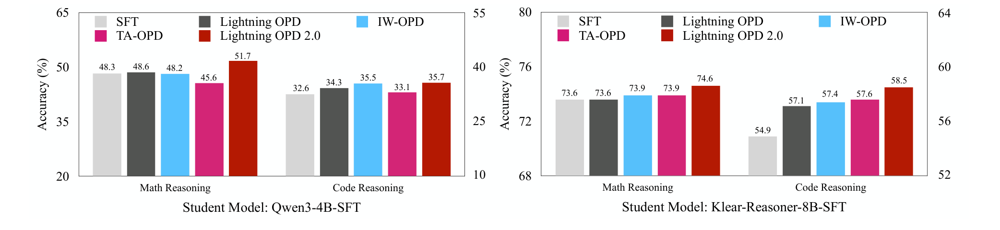
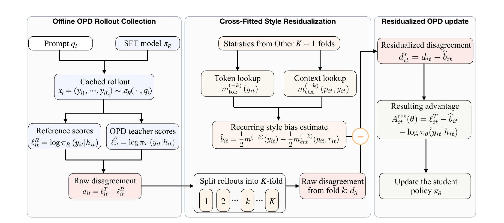
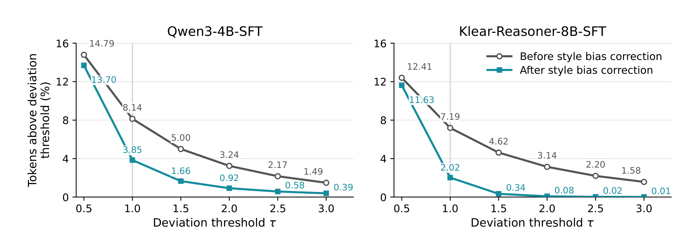

# Lightning OPD 2.0：跨 teacher 的风格残差

## 来源

- 原始 PDF：[`raw/2607.28449v1.pdf`](../../raw/2607.28449v1.pdf)
- 标题：Lightning OPD 2.0: Mitigating Style Bias in Cross-Teacher On-Policy Distillation for Large Reasoning Models
- 版本 / 日期：arXiv:2607.28449v1，2026-07-30
- 作者：Yecheng Wu、Song Han、Han Cai（NVIDIA）。通讯作者 Han Cai
- 代码：正文写 “Code will be released soon”。仓库链接与 [Lightning OPD](lightning-opd.md) 相同：<https://github.com/jet-ai-projects/Lightning-OPD>
- 模型链接：**未建模型页**。学生起点是已有的 Qwen3-4B-SFT 和 Klear-Reasoner-8B-SFT

## 为什么这篇在 wiki 里独占一席

[Lightning OPD](lightning-opd.md) 把「SFT 轨迹的生成者 = OPD teacher」写成离线近似成立的前提。这篇专门做 **cross-teacher**：两边可以不是同一个模型。他们的观察是，原始的 teacher–reference 对数差里，有一块会在不同 rollout 上重复出现，对应措辞、格式和推理节奏；另一块才更像这道题上的纠正。2.0 用交叉拟合把可重复的那一块减掉。作者写明这是操作代理，不是把每个 token 分成「风格 / 推理」的金标准。

## 核心结论

1. **跨 teacher 时，1.0 的原始 advantage 几乎搬不动 SFT。** OPD teacher 一律换成 Qwen3-30B-A3B-Thinking-2507。Qwen3-4B-SFT 的数学均分从 48.3 到 48.6；Klear-Reasoner-8B-SFT 的数学均分停在 73.6。代码侧 1.0 仍有一点涨幅（32.6→34.3，54.9→57.1）。
2. **减掉跨 rollout 可预测的分歧之后，两套设定的数学和代码均分都高于 1.0。** 相对 1.0，4B 数学 +3.1、代码 +1.4；Klear 数学 +1.0、代码 +1.4（`§4.2`）。Klear 的 AIME 2024 是 82.4，但它的 SFT 已经是 81.3。更大的一跳在 LCB v5：58.5→63.0。
3. **残差更靠近「一致 teacher」的信号，但 Klear 那边的参照本身是代理。** 4B 用真正的 SFT 生成者 Qwen3-8B 做诊断：绝对偏差超过 1 nat 的 token 从 8.14% 降到 3.85%（相对 −52.8%）。Klear 没有原始生成者 DeepSeek-R1-0528 的分数，诊断模型是 Klear-Reasoner-8B，7.19%→2.02%（相对 −71.9%）。

> Figure 1. Average Pass@1 (%) on mathematical reasoning and code generation in two cross-teacher settings with Qwen3-30B-A3B-Thinking-2507 as the OPD teacher.（`§1`）

## 方法

仍是 Lightning OPD 的冻结 replay：每题从 SFT 参考 \(\pi_R\) 采一条回复，teacher \(\pi_T\) 和参考各打一次已实现 token 的 log-prob，\(\ell^T_{it}\) 与 \(\ell^R_{it}\)。原始分歧 \(d_{it}=\ell^T_{it}-\ell^R_{it}\)。初始化时 \(\pi_\theta=\pi_R\)，1.0 的 advantage 就等于 \(d_{it}\)。

他们把 \(d_{it}=b(z_{it})+v_{it}\)。\(b\) 是在简单坐标上跨 rollout 重复出现的部分，当作风格偏差的代理；\(v\) 留下。坐标有两套，**不做笛卡尔积**：token 身份，以及归一化位置桶 \(p_{it}\) 配上参考策略 surprisal \(-\ell^R_{it}\) 的桶 \(r_{it}\)。桶数 \(B_{\mathrm{pos}}\)、\(B_{\mathrm{ref}}\) 和 surprisal 上限 \(\xi_{\max}\) 在正文里只作为符号出现，没有给出实验取值。

估计用 \(K=5\) 折，同一 prompt 的 rollout 进同一折。某一折的查表只用其余折，避免用自己的回复拟合自己。长回复按「每条回复总权重为 1」分到 token 上。稀有组向非留出折的全局均值收缩，没见过的组直接用全局均值。两个查表等权平均：

\[\hat b_{it}=\tfrac12 m^{(-k)}_{\mathrm{tok}}(y_{it})+\tfrac12 m^{(-k)}_{\mathrm{ctx}}(p_{it},r_{it}).\]

只从 \(d_{it}\) 里减掉 \(\hat b_{it}\)，参考锚定项 \(\ell^R_{it}-\log\pi_\theta\) 不动。训练用的 advantage 是

\[A^{\mathrm{res}}_{it}(\theta)=\ell^T_{it}-\hat b_{it}-\log\pi_\theta(y_{it}|h_{it}).\]

\(\hat b\) 在训练前算完并冻住。Advantage 仍当固定标量，策略更新沿用 1.0 的 surrogate。本文写 PPO clipping range 为 0.2，这是策略比的裁剪，不是 1.0 那张表里 advantage 的 \([-10,10]\)。

> Figure 2. Overview of Lightning OPD 2.0. … Subtracting this estimate yields a residualized signal for the reference-anchored Lightning OPD update.（`§3`）

实验里两边 tokenization 都是 Qwen 家族，分数按同一套 response token 对齐。150 step，框架是 slime。数学数据 DAPO-Math-17k，代码是 KlearReasoner-CodeSub-15K。评测 temperature 0.6、top-p 0.95，数学和代码最长都是 40960；数学每题 **64** 条，代码每题 **8** 条。1.0 是数学 32 条、代码 4 条，数学最长 32768。两篇的 pass@1 不能直接相减。

## 评测要点

两套设定的 OPD teacher 都是 Qwen3-30B-A3B-Thinking-2507。

- Qwen3-4B-SFT：就是 1.0 里那份参考，SFT 演示来自 Qwen3-8B。生成者已知，所以风格错配从哪来是清楚的。
- Klear-Reasoner-8B-SFT：从 Qwen3-8B-Base 出发，长 CoT 演示蒸自 DeepSeek-R1-0528。用来看换一个更强、且生成者不同的 SFT 时，同一套校正还是否有效。

IW-OPD 和 TA-OPD 原论文是在线 rollout。这里把它们改到同一份冻结 replay 上，表里标了 ♢。所有 OPD 方法共用同一份 SFT、同一批 rollout、同一份缓存 log-prob 和同样的 150 step。

Table 1，平均 pass@1。

| 方法 | AIME24 | AIME25 | HMMT Feb | 数学均分 | LCB v5 | LCB v6 | 代码均分 |
| --- | ---: | ---: | ---: | ---: | ---: | ---: | ---: |
| 4B SFT | 57.5 | 52.4 | 34.9 | 48.3 | 33.8 | 31.5 | 32.6 |
| 4B Lightning OPD | 59.6 | 51.6 | 34.6 | 48.6 | 35.5 | 33.2 | 34.3 |
| 4B IW-OPD | 60.8 | 49.9 | 33.8 | 48.2 | 37.2 | 33.8 | 35.5 |
| 4B TA-OPD | 56.0 | 50.0 | 30.6 | 45.6 | 35.7 | 30.4 | 33.1 |
| 4B Lightning OPD 2.0 | **63.5** | **55.0** | **36.7** | **51.7** | **36.9** | **34.4** | **35.7** |
| Qwen3-8B（对照，未训） | 76.0 | 67.3 | 44.7 | 62.7 | 57.5 | 48.4 | 53.1 |
| Klear SFT | 81.3 | 77.5 | 62.2 | 73.6 | 58.5 | 51.3 | 54.9 |
| Klear Lightning OPD | 80.6 | 77.2 | 62.9 | 73.6 | 61.6 | 52.6 | 57.1 |
| Klear IW-OPD | 81.9 | 77.6 | 62.3 | 73.9 | 61.0 | 53.8 | 57.4 |
| Klear TA-OPD | **82.7** | 76.9 | 62.0 | 73.9 | 62.1 | 53.1 | 57.6 |
| Klear Lightning OPD 2.0 | 82.4 | **77.7** | **63.8** | **74.6** | **63.0** | **53.9** | **58.5** |

4B 上 2.0 五项都高于自己的 SFT，也高于同表的 1.0。TA-OPD 的数学均分 45.6，低于 SFT 的 48.3。Klear 上 TA-OPD 的 AIME 2024 是 82.7，高于 2.0 的 82.4；均分和代码仍是 2.0 更高。1.0 在 Klear 的 AIME 2024 是 80.6，低于 SFT 的 81.3。

这张表不能拿去和 1.0 里「一致 teacher、Qwen3-8B 教 4B、AIME 2024 = 68.1」比。Teacher、评测条数和长度都不同。2.0 也没有声称把跨 teacher 的分数补回那个一致 teacher 的最优点。

> Figure 3. Absolute-deviation threshold analysis. … Qwen3-8B provides the exact teacher-consistent reference for Qwen3-4B-SFT, while Klear-Reasoner-8B provides a diagnostic proxy for Klear-Reasoner-8B-SFT. Both models are used only for this post-hoc analysis.（`§4.3`）

诊断模型不参与校正，也不参与训练。Figure 4 用 1 nat 给 token 上色，只是可视化，不是方法的一部分。例子里不少大偏差落在话语标记和推理转接上，校正后多数落到阈值下，仍有一些大偏差留下。

消融（Table 2）只报 AIME 2024 和 HMMT Feb。完整方法的点估计在四列里最高或并列。4B 的 HMMT 上，不做交叉拟合的 in-sample 也是 36.7，与完整方法持平，AIME 2024 是 62.7 对 63.5。Klear 上只留 context 查表的 AIME 2024 是 82.3，对完整方法的 82.4。作者的说法是：单用一种坐标的效果随设定变，in-sample 总体更弱或持平；交叉拟合主要是防止用当前回复拟合自己。

## 与现有 wiki 页的关系

- **[Lightning OPD](lightning-opd.md)**：1.0 证明不一致会留下与 \(\chi^2\) 无关的梯度偏差，并在一致 teacher 下把离线做成和在线同一最优点。2.0 不取消那个偏差定理。它是在偏差已经发生之后，从冻结的 \(d_{it}\) 里减掉可预测部分，让跨 teacher 的离线更新还能动。1.0 页里「2.0 未收」的待追问由此关闭。
- **[Many Faces](many-faces-opd.md)**：那篇把 style token 的高 KL 写成 OPSD 的经验现象，并用 clipping 处理。这里的 \(\hat b\) 是跨 rollout 的查表均值，不是词表项上的 pointwise clip，也不是把 token 标成风格。
- **生产多 teacher**：MiMo / V4 的 OPD teacher 通常不是 SFT 演示的生成者。2.0 给出一条不必重做 SFT 的校正，但实验只有单 teacher、两份 SFT、Qwen 家族 tokenization。没有测按 prompt 路由的多 teacher。

## 待追问

- **现有材料待核**：\(B_{\mathrm{pos}}\)、\(B_{\mathrm{ref}}\)、\(\xi_{\max}\) 和稀有组的平滑强度没有写进正文。复现查表需要这些数，或等代码。
- **需实验或作者披露**：减掉 \(\hat b\) 之后，定理 3.8 的 \(G\sigma_\Delta\) 还剩多少。本文没有重证离线梯度偏差，只给了和诊断信号的绝对偏差。
- **需实验或作者披露**：Klear 的诊断不是 DeepSeek-R1-0528。71.9% 的相对下降不能当成「回到原始生成者」。
- **需实验或作者披露**：多 teacher 路由、非 Qwen tokenizer、以及一致 teacher 下再减 \(\hat b\) 会不会伤信号。结论自己把范围限定在这两项任务和 Qwen 家族。

## 相关页面

- [Lightning OPD](lightning-opd.md)
- [On-Policy Distillation 跨报告对比](../comparisons/on-policy-distillation.md)
- [Multi-Teacher On-Policy Distillation](../concepts/multi-teacher-on-policy-distillation.md)
- [The Many Faces of OPD](many-faces-opd.md)
- [OPSD](opsd.md)
