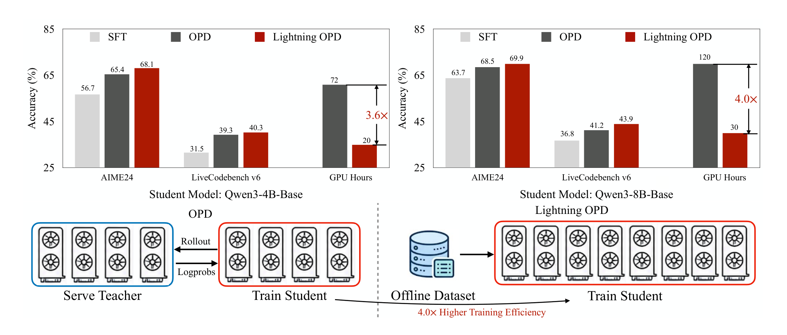
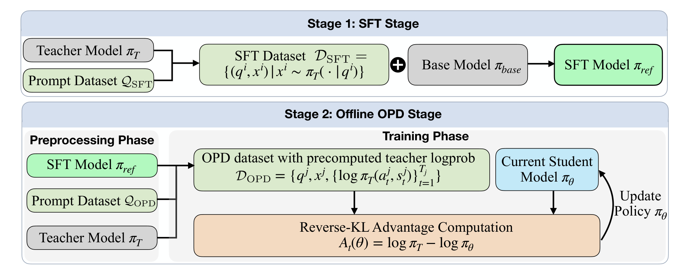
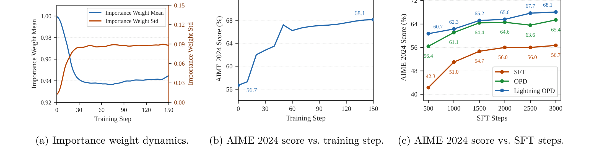

# Lightning OPD：离线 on-policy distillation

## 来源

- 原始 PDF：[`raw/2604.13010v3.pdf`](../../raw/2604.13010v3.pdf)
- 标题：Lightning OPD: Efficient Post-Training for Large Reasoning Models with Offline On-Policy Distillation
- 版本 / 日期：arXiv:2604.13010v3，2026-09-26
- 作者：Yecheng Wu、Song Han、Han Cai（NVIDIA）。通讯作者 Han Cai
- 代码：<https://github.com/jet-ai-projects/Lightning-OPD>
- 模型链接：**未建模型页**——不发布新模型。学生是 Qwen3-4B-Base、Qwen3-8B-Base、Qwen3-30B-A3B-Base

## 为什么这篇在 wiki 里独占一席

已收录的 OPD 都默认训练时有一个在线 teacher：Miles 把它做成 served teacher 或 in-process teacher，生产报告在每个 rollout 上现算 log-prob。这篇把 teacher 的 log-prob **事先算好、冻在一份固定 rollout 上**，训练循环里不再开 teacher server。能这么做的条件被他们命名为 **teacher consistency**：生成 SFT 轨迹的模型和 OPD 打分的模型必须是同一个。违反时，偏差不会靠学生少漂移而消失。

同作者的 [Lightning OPD 2.0](lightning-opd-2.md) 在跨 teacher 的冻结 replay 上减掉可预测分歧。那是另一套评测，不取消本页的偏差上界。

## 核心结论

1. **离线和在线用同一个 advantage，差在轨迹从哪来**（`§3.1`）。\(A_t(\theta)=\log\pi_T(a_t|s_t)-\log\pi_\theta(a_t|s_t)\)，当固定标量（stop-gradient）。在线目标对当前 \(\pi_\theta\) 采样；Lightning 把采样分布冻在 SFT 参考策略 \(\pi_{\mathrm{ref}}\) 上（公式 3–4）。Teacher 项从磁盘读，学生项在线算。
2. **Teacher 一致时，两者共享「teacher 可表示」时的最优点，梯度差由漂移控制**（定理 3.5–3.7）。在线目标写成 \(J_{\mathrm{on}}=-\mathrm{KL}(\pi_\theta\|\pi_T)\)。若 \(\pi_T\) 落在学生能表示的策略类里，\(A_t=0\) 几乎处处成立，这个点也是离线更新的零点。梯度差的上界是 \(G\sigma_A\sqrt{\chi^2(\pi_\theta\|\pi_{\mathrm{ref}})}\)。初始化时 \(\chi^2=0\)，两个梯度重合。离线梯度等于在线梯度减去一个协方差项；作者把它读成不必另加 KL 惩罚的 trust region。支撑覆盖假设（学生轨迹必须落在 \(\pi_{\mathrm{ref}}\) 的支撑里）是证明前提，只在初始化时自然成立。
3. **SFT teacher 和 OPD teacher 不是同一个时，偏差与漂移无关**（定理 3.8–3.9）。令 \(\Delta_t=\log\pi_T^{\mathrm{SFT}}-\log\pi_T^{\mathrm{OPD}}\)。离线梯度相对「一致 teacher」的偏差上界是 \(G\sigma_\Delta\)，不随 \(\chi^2\) 变小。在线 OPD 在初始化处也有同样量级的偏差。结论据此说两种配方都会走到更差的固定点。定理正文给的是梯度上界，固定点的说法在结论和附录 remark。
4. **一致 teacher 下，离线可以打平在线，并把 8B 的全流程从 120 GPU 时降到 30。** 30B-A3B 上，同一台 8×H100 同时放学生和 teacher 会 OOM，离线能训。

> Figure 1. (Top) Performance (Pass@1, %) and training cost … At the 8B scale, Lightning OPD achieves … 69.9% on AIME 2024 in just 30 GPU hours, delivering 4.0× higher training efficiency than standard OPD.（`§1`）

## 方法

两阶段（Figure 2，Algorithm 1）。

Stage 1：teacher \(\pi_T\) 在 \(\mathcal{Q}_{\mathrm{SFT}}\) 上采样，base 用最大似然训成 \(\pi_{\mathrm{ref}}\)。Lightning 要求这份轨迹就是后来打分的那个 teacher 生成的。普通 OPD 可以拿任何高质量 SFT 集。

Stage 2：在 \(\mathcal{Q}_{\mathrm{OPD}}\) 上从 \(\pi_{\mathrm{ref}}\) 采一条回复，teacher 只前向一次，把逐 token 的 \(\log\pi_T\) 存进 \(\mathcal{D}_{\mathrm{OPD}}\)。学生从 \(\pi_{\mathrm{ref}}\) 初始化，advantage 裁到 \([-\tau,\tau]\)。实验里的裁剪区间是 \([-10,10]\)（Table 6）。

> Figure 2. Overview of Lightning OPD. … \(A_t=\log\pi_T(a_t|s_t)-\log\pi_\theta(a_t|s_t)\) is computed by reading \(\log\pi_T\) from \(\mathcal{D}_{\mathrm{OPD}}\) while computing \(\log\pi_\theta\) online.（`§3.2`）

SFT 用 LlamaFactory，OPD 用 slime。SFT：3000 step，最长 16384，学习率 \(8\times 10^{-5}\)，cosine，warmup 0.1；4B 的 batch 是 256，8B 是 128。OPD：150 step，batch 256，学习率 \(2\times 10^{-6}\)，常数学习率，weight decay 0.1，Adam \(\beta=(0.9, 0.98)\)，rollout temperature 0.8、top-p 1.0，训练回复最长 **4096**。评测 temperature 0.6、top-p 0.95，数学最长 32768、代码最长 40960；数学每题 32 条、代码每题 4 条，报平均 pass@1。他们写训练回复加长没有再涨点。代码域的 OPD 不是从 SFT 直接起，而是从**数学 OPD 的 checkpoint** 接着训。

## 评测要点

SFT prompt 来自 OpenThoughts-3，回复由**该次实验的 teacher** 现生成，不是数据集自带的轨迹。数学 OPD 用 DAPO-Math-17k，代码用 EpiCoder-func-380k 的 3 万条子集。每题只采 1 条 \(\pi_{\mathrm{ref}}\) 回复。

Table 1，pass@1。4B 的 teacher 是 Qwen3-8B，8B 的 teacher 是 Qwen3-32B。

| 方法 | AIME24 | AIME25 | HMMT25 | 数学均分 | LCB v5 | LCB v6 | 代码均分 |
| --- | ---: | ---: | ---: | ---: | ---: | ---: | ---: |
| 4B SFT | 56.7 | 52.1 | 34.0 | 47.6 | 33.8 | 31.5 | 32.6 |
| 4B OPD | 65.4 | 57.9 | 39.9 | 54.4 | **44.2** | 39.3 | **41.8** |
| 4B Lightning | **68.1** | **58.4** | 39.8 | **55.4** | 42.8 | **40.3** | 41.5 |
| 8B SFT | 63.7 | 51.7 | 36.9 | 50.8 | 44.7 | 36.8 | 40.8 |
| 8B OPD | 68.5 | 59.0 | 39.4 | 55.6 | 47.3 | 41.2 | 44.2 |
| 8B Lightning | **69.9** | **59.2** | **41.9** | **57.0** | **49.5** | **43.9** | **46.7** |

4B 的代码均分离线比在线低 0.3（41.5 对 41.8），LCB v5 低 1.4。8B 上离线在表内每一列都略高于在线。Table 1 还放了 ExOPD 的 61.0（AIME 2024）和 29.0（LCB v6）。这两个数与 [ExOPD](exopd.md) 多 teacher 主表一致，但那边的学生是 Qwen3-4B-Non-Thinking、teacher 是同基座的域 GRPO。不是 Lightning 协议下的重跑。

GPU 时（Table 2），全流程：4B 从 72 到 20（3.6×），8B 从 120 到 30（4.0×）。8B 的 30 小时里，rollout 收集 10、teacher log-prob 预计算 4、OPD 训练 16。4.0× 比的是含 teacher server 的在线全流程，不是单步梯度更快。

30B-A3B（Table 3）。学生 Qwen3-30B-A3B-Base，teacher 是 Qwen3-30B-A3B-Thinking-2507，设定对齐 8B 实验。在线 OPD 在单机 8×H100 上 OOM。离线：AIME 2024 / 2025 / HMMT 2025 为 71.0 / 66.3 / 48.3（SFT 66.8 / 63.2 / 44.6），LCB v5 / v6 为 60.8 / 54.4（SFT 39.4 / 33.0）。论文称这是该规模开放 MoE 的领先结果；本库没有按同一评测协议重核其他 MoE。

Teacher 不一致的消融只报 AIME 2024（Table 4）。8B、Lightning：SFT 与 OPD 都用 Qwen3-32B 是 69.9；SFT 仍是 32B、OPD 换成 QwQ-32B 掉到 63.1（−6.8）。同一格上的在线 OPD 从 68.5 掉到 64.8（−3.7）。4B 上一致的 Lightning 是 68.1（两边都是 Qwen3-8B），换成不一致的 QwQ 后是 62.5 或 59.3。每一行里，对角线（两个阶段同一个 teacher）最高。作者的解释是：离线把 \(\pi_{\mathrm{ref}}\) 同时当成参考分布和固定 rollout 的来源，SFT teacher 错了会伤两处；在线每步从当前学生重新采样，能补回一部分。

> Figure 3. Training dynamics of Lightning OPD (Qwen3-4B-Base student). (a) The mean importance weight \(w_t=\pi_\theta/\pi_{\mathrm{ref}}\) drops rapidly to \(\approx 0.94\) … (b) AIME 2024 pass@1 rises steeply in the first 50 OPD steps … (c) … both OPD variants provide a large, stable gain on top of the SFT baseline at every checkpoint.（附录 C.1）

图里的权重是**逐 token** 的 \(\pi_\theta/\pi_{\mathrm{ref}}\)。定理 3.5 的 \(\chi^2\) 用的是**序列级** 重要性比。不要把 0.94 直接代进那个上界。Table 6 没有 KL 系数；「不必加显式 KL」是他们对本图和定理 3.7 的读法。

本文把 Thinking Machines 的公开配方读成：OpenThoughts-3 的轨迹来自 QwQ-32B，OPD teacher 却是 Qwen3-32B，因此违反 consistency。本库的 [博客页](thinking-machines-on-policy-distillation.md) 记录的是 Qwen3-32B teacher、以及 400k off-policy 起点，没有在本页重核轨迹是谁生成的。

## 与现有 wiki 页的关系

- **[Miles](miles-v0-1.md)**：served teacher 在 rollout 期间打分。Lightning 把这次打分挪到训练前，而且 rollout 不再跟着学生更新。Tokenizer 仍须对齐，否则存下来的 log-prob 对不上学生的 token id。
- **[ExOPD](exopd.md)**：Table 1 引用的 61.0 / 29.0 是那篇多 teacher 表的数字，协议不同。ExOPD 改的是 reward scale \(\lambda\)，仍然在线算 teacher。
- **[Many Faces](many-faces-opd.md)**、**[Revisiting OPD](revisiting-opd.md)**：改的是 Top-K 估计器。本文的 advantage 仍是采样 token 的 log-ratio，改的是轨迹分布和 teacher 是否同一人。
- **生产报告**（MiMo、V4、GLM-5）：多 teacher 按 prompt 路由，SFT 数据的生成者通常不是后来的 OPD teacher。按本文的定义，那些流水线违反 teacher consistency。本文没有在那些规模上测过这个偏差有多大。

## 待追问

- **已另页核实**：[Lightning OPD 2.0](lightning-opd-2.md) 在跨 teacher 的冻结 replay 上减掉可预测分歧。它不取消本页的 \(G\sigma_\Delta\) 上界，也不把分数补回一致 teacher 的最优点。评测条数与本页不同。
- **需实验或作者披露**：支撑覆盖在 150 step 之后是否仍成立。学生可以走出 \(\pi_{\mathrm{ref}}\) 几乎不走的 token，定理 3.5 的换元就不再严格。
- **需实验或作者披露**：生产多 teacher 流水线里，SFT 生成者和 OPD teacher 不是同一人时，偏差是 Table 4 这种几个点，还是会被路由冲掉。本文只做了单 teacher 的 4B/8B 交叉。
- **现有材料待核**：Table 1 的 ExOPD 行不是同一协议。4B 代码均分离线略低于在线，不能写成每一列都打平。

## 相关页面

- [On-Policy Distillation 跨报告对比](../comparisons/on-policy-distillation.md)
- [Multi-Teacher On-Policy Distillation](../concepts/multi-teacher-on-policy-distillation.md)
- [Miles v0.1](miles-v0-1.md)
- [ExOPD](exopd.md)
- [Thinking Machines Lab On-Policy Distillation 博客](thinking-machines-on-policy-distillation.md)
- [The Many Faces of OPD](many-faces-opd.md)
- [Revisiting On-Policy Distillation](revisiting-opd.md)
- [Lightning OPD 2.0](lightning-opd-2.md)
- [OPD 综述](opd-survey.md)：v4 记录了本页的 4.0× 和 teacher consistency，早于 2.0。
