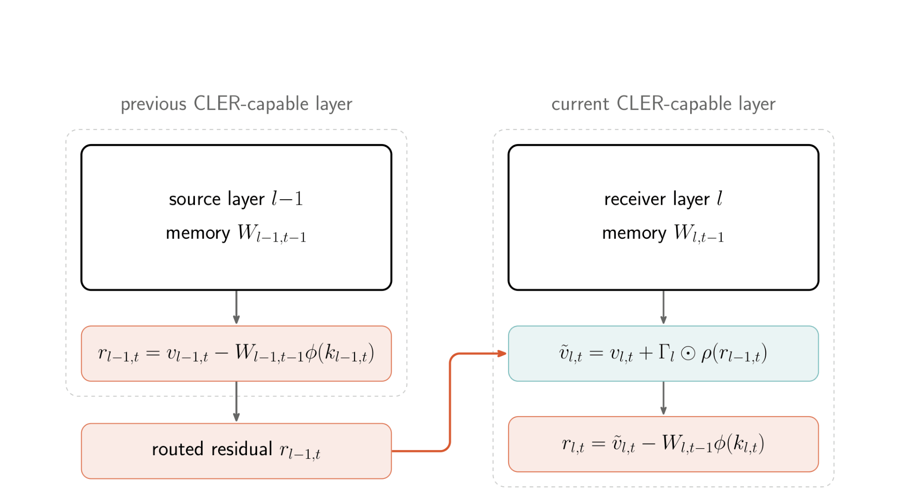
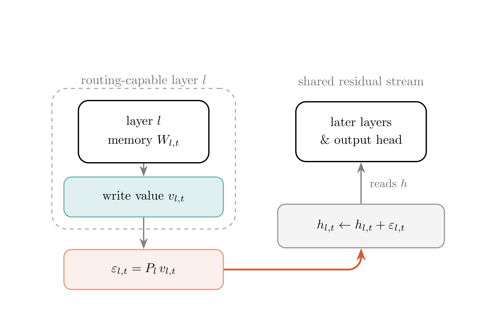

# Linear Attention Architectures 技术报告

## 来源

- 原始 PDF：[raw/2607.07953v1.pdf](../../raw/2607.07953v1.pdf)
- 标题：Linear Attention Architectures: Mechanisms, Trade-offs, and Cross-Layer Routing
- 版本/日期：arXiv:2607.07953v1，2026-07-08
- 团队：Tommaso Cerruti、Tim Rieder、George Rowlands、Lingfeng Jin、Imanol Schlag（ETH Zurich / ETH AI Center）
- 代码：[tommasocerruti/linear-attention-architectures](https://github.com/tommasocerruti/linear-attention-architectures)
- 相关概念：[线性注意力与 delta rule](../concepts/linear-attention-and-delta-rule.md)、[Attention Residuals](../concepts/attention-residuals.md)

## 核心结论

这是一篇**机制比较 + 受控小规模训练研究**，不是新模型发布。论文把 DeltaNet、Gated DeltaNet（GDN）、Kimi Delta Attention（KDA）与 Gated DeltaNet-2（GDN-2）写进同一套递归关联记忆记号：差异分别落在全局 / channel-wise decay，以及 erase / write 是否分开控制。其新方法是 **Cross-Layer Value Routing（CLVR）**：不改线性记忆的递推与读出，而将每个线性记忆层的内部 write value 投影到共享 residual stream。

作者在 350M 参数、15B token 的 single-run sweep 中观察到：Muon + hybrid KDA 的 final validation loss 最低（2.273）；pure GDN + AdamW 的归一化训练吞吐最高（100%，但 final loss 为 2.433）。因此论文把结论限定为质量、训练吞吐、混合比例与实现复杂度构成的多目标 frontier，不能化约为某一个变体“全面最佳”（原文 § 6.1 / Table 2）。

**证据边界**：架构比较与 CLVR 行均为 single run、没有 seed 方差；速度指标是训练吞吐 / iteration time，**不是 inference throughput benchmark**。下列 CLVR 数字应读作方向一致的初步机制信号，而非可直接外推到生产尺度的结论。

## 架构与训练

### 统一的递归记忆视角

令 $W_{l,t}$ 是层 $l$ 在 token $t$ 的关联记忆，write value 为 $v_{l,t}$，则它对当前 key 的预测与 delta-rule write error 为：

$$\bar v_{l,t}=W_{l,t-1}\phi(k_{l,t}),\qquad r_{l,t}=v_{l,t}-\bar v_{l,t}.$$

DeltaNet 写入 $r$ 来纠正当前记忆预测；GDN 在写入前加标量 decay；KDA 将 decay 细化到 channel；GDN-2 再将主动 edit 拆为 key-side erase 与 value-side write gate。这个统一框架把“是否遗忘、遗忘粒度、如何擦写”与跨层连接拆为可分别比较的设计轴（原文 § 3）。

### CLER：自然但无稳定收益的失败路径

最直接的 Cross-Layer Error Residuals（CLER）把下层 write error 加到下一层的 value target：

$$\tilde v_{l,t}=v_{l,t}+\Gamma_l\rho(r_{p(l),t}),\qquad r_{l,t}=\tilde v_{l,t}-W_{l,t-1}\phi(k_{l,t}).$$

> Figure 1（原文 § 4.2）："Cross-Layer Error Residuals (CLER)." 若中间夹有 softmax 层，residual 仅被当作 side-channel 往上传递；它们不产生或消费该信号。

在匹配的 350M / 1B token 比较中，CLER 对 GDN 是 $+0.0013$ loss、对 DeltaNet 是 $-0.0004$；后者低于作者认为可稳健解释的量级。AdamW 下两者均不改善（原文 § 6.5 / Table 6）。论文的解释是：来自下层独立 value geometry 的 error 注入接收层 value target，存在 basis mismatch，并与本层 write target 竞争。

### CLVR：改路由空间，也改路由内容

CLVR 将内部信号 $s_{l,t}$ 以零初始化投影 $P_l$ 加到所有后续层共享的 residual stream：

$$\epsilon_{l,t}=P_l s_{l,t},\qquad h_{l,t}\leftarrow h_{l,t}+\epsilon_{l,t},\qquad s_{l,t}=v_{l,t}.$$

零初始化使训练开始时模型严格等同 host baseline；与 CLER-H（同样投到 hidden stream、但取 $s=r$）参数量匹配，所以比较隔离的是“路由 write value 还是 write error”。

> Figure 2（原文 § 4.3）："Cross-Layer Value Routing (CLVR)." 投影后的贡献一开始为零，并在跨深度对齐的 shared residual stream 中相加。

匹配的 Muon 运行中，CLVR 的 final loss 对 GDN / DeltaNet 在 350M / 1B 分别为 $-0.0103/-0.0119$；350M / 15B 收缩到 $-0.0059/-0.0016$；1.3B / 40B 的 GDN 行为 $-0.0019$（原文 § 6.6 / Table 7）。所有已报行方向相同、CLVR 都优于 CLER-H，但增益随训练和规模变强而变小，且缺少重复 seed。

## 评测要点

- **训练效率不等于推理效率**：pure recurrent stack 在 4K→32K sequence-length iteration-time 测量中扩张最慢，但论文明确未报告 decode 吞吐或 inference memory benchmark（原文 § 6.3）。
- **Muon 的观察是配方内的**：在这组匹配架构 / 学习率设置中，Muon 全部优于 AdamW 的 final loss；论文也显示学习率最优点依赖具体 mixer 与 optimizer，不能把它读成独立、普适的 optimizer 排名（§ 6.2）。
- **下游只用作无明显退化检查**：HellaSwag、PIQA、WinoGrande 的 single-checkpoint 结果混合，作者仅据此称未见清晰退化，不将其视为 CLVR 普遍提升的独立证据（§ 6.4–6.6）。

## 与已有沉淀的关系

- 对 [线性注意力与 delta rule](../concepts/linear-attention-and-delta-rule.md)，它补的是 DeltaNet/GDN/KDA/GDN-2 的同式比较与新问题：“固定长度的 sequence memory 之外，是否能轻量地传递跨层信息”。
- 对 [Attention Residuals](../concepts/attention-residuals.md)，CLVR 是相邻但不同的深度通路：AttnRes 以 learned depth attention 聚合 layer outputs 并替换 residual sum；CLVR 从**线性记忆内部**取 write value，以加法注入 residual stream，保留 host 的线性时间递推。
- 不新建模型页：论文训练的 350M、1.3B、3B 模型都是受控实验载体，并非对外发布的模型实体。

## 待追问

- CLVR 是否在 KDA 与 GDN-2 上有效？论文未报告这两个 host 的 routing 实验，尤其 GDN-2 的 erase / write 已解耦，什么内部量值得路由仍是开放问题。
- 增益为何随 token budget / 规模缩小？它可能反映小模型尚未自行吸收的信息，也可能只是 single-run 噪声；需要多 seed、更大模型和长上下文 retrieval 任务验证。
- CLVR 是否保有真正的 decode 吞吐、显存优势？当前只有训练 iteration-time 数据，不能据它判定 serving 价值。
