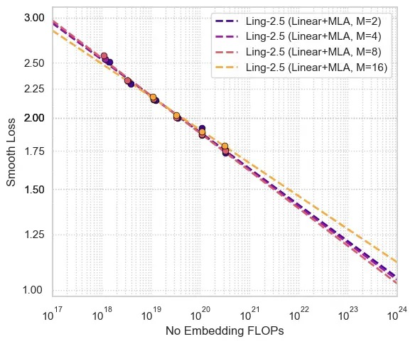
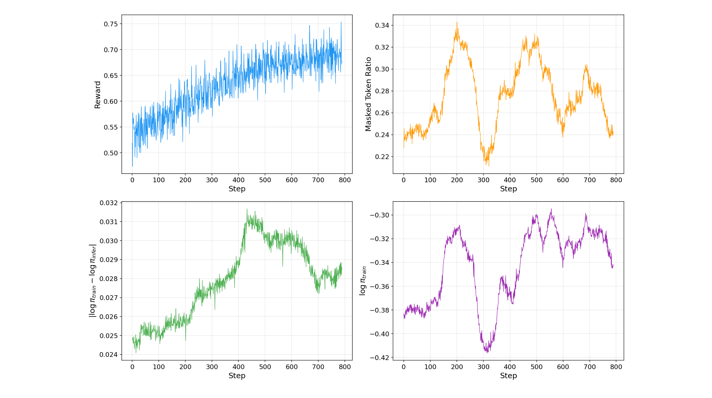
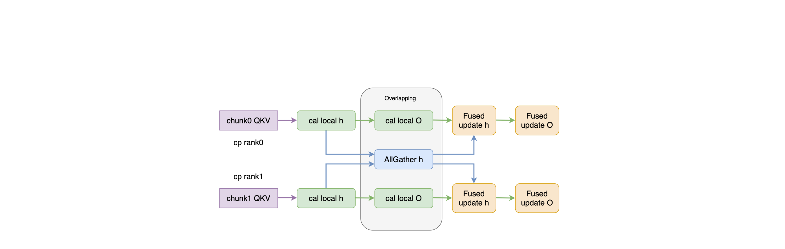

# Ling and Ring 2.6 技术报告

## 来源

- **PDF**：`raw/2606.15079v1.pdf`（43 页）
- **arXiv**：2606.15079v1，2026-06
- **团队**：Inclusion AI（Ling Team，蚂蚁集团）
- **开源**：[GitHub](https://github.com/inclusionAI/Ling-V2.5)、[Ling-2.6 HF](https://huggingface.co/collections/inclusionAI/ling-26)、[Ring-2.6 HF](https://huggingface.co/collections/inclusionAI/ring-26)
- **模型页**：[Ling-2.6 / Ring-2.6](../models/ling-2.6.md)

## 核心结论

Ling-2.6 和 Ring-2.6 是 Inclusion AI 在万亿参数规模上的 agentic intelligence 模型族。核心叙事是**不改从头训练万亿模型的前提下，通过架构 retrofit + 后训练 + 系统协同设计，同时提升效率、token 质量和 agentic 能力**。

三条设计轴线：

1. **高效长上下文**：把 Ling-2.0 的 GQA 架构 retrofit 成 **7:1 Lightning Attention + MLA** 混合线性注意力（每 8 层中 7 层线性、1 层 MLA），线性注意力把 per-token 成本从 $O(n^2)$ 降到 $O(n)$，MLA 压缩 KV cache。迁移通过四阶段 smooth pipeline（Lightning Attention 转换 -> Linear Warmup -> MLA 转换 -> MLA Warmup）在 ~400B tokens 内完成，性能无损。继续预训练 ~9.6T tokens。

2. **高 token 效率**：Ling-2.6 不把短回复当风格偏好，而是优化 **capability per output token**。后训练用 Evo-CoT（去冗余推理步骤）、LPO（语言单元级策略优化）、双向偏好对齐和 shortest-correct-response distillation，在 reasoning workload 上约 4× token 效率提升。Ling-2.6-1T 在 Artificial Analysis Intelligence Index 上以 ~16M output tokens 达到 34 分，可比 GPT-5.4 non-reasoning。

3. **原生 agentic 优化**：Ring-2.6 提出 **KPop** RL 算法，用 binary KL divergence 替代 IcePop 的 uniform fixed-ratio constraint，更好捕获不同概率 token 的异质 mismatch，稳定万亿参数 agentic RL。配合异步 RL（partial-rollout pipeline + staleness manager），使长尾环境交互轨迹在万亿规模可训练。Ring-2.6-1T 在 PinchBench 87.60、SWE-bench Verified 76.28%。

## 架构与训练

### 整体架构

> Figure 2（原文截图，§ 2.1）："Overall architecture of Ling-2.6-1T-base. We employ a hybrid attention mechanism combining Lightning Attention and MLA in a 7:1 ratio, with fine-grained MoE for feed-forward layers."

关键配置（已据原文 Table 1 核实）：

| 配置项 | Ling-2.6-flash | Ling-2.6-1T |
| --- | ---: | ---: |
| # Layers | 32 | 80 |
| # Experts (total) | 256 | 256 |
| # Experts Active per Token | 8 | 8 |
| # Shared Experts | 1 | 1 |
| # Attention Heads | 32 | 64 |
| # Dense Layers | 1 | 4 |
| Hidden Size | 4,096 | 8,192 |
| Intermediate Size | 9,216 | 18,432 |
| Expert Intermediate Size | 1,024 | 2,048 |
| KV LoRA Rank | 512 | 512 |
| Q LoRA Rank | 1,536 | 1,536 |
| Layer Group Size | 8 | 8 |

其他关键参数：head dim=128，vocab=157,184，max context=262,144（RoPE $\theta$=6,000,000），rotary dim=64（Partial RoPE），SiLU 激活，RMSNorm $\epsilon=10^{-6}$。MoE 用 auxiliary-loss-free load balancing（bias-update rate $\gamma$=0.001 -> 0.0001），grouped routing（ngroup=8，top-4 group），routed output scale=2.5。

### 混合比例选择

> Figure 3（原文截图，§ 2.1.2）："Scaling law curves for different hybrid ratios."

| Layer Group Size (M) | 线性:全注意力比例 | Scaling 性能 | 推理成本 |
| ---: | ---: | --- | --- |
| 2 | 1:1 | 与 M=4 相当 | 高 |
| 4 | 3:1 | 与 M=2 相当 | 中 |
| **8** | **7:1** | **最优** | **低** |
| 16 | 15:1 | 明显退化 | 最低 |

原文观察到：随总 FLOPs budget 增大，线性注意力比例可适度提高而不退化。选 7:1 是质量与效率的最优折中。

### 注意力转换（已据原文 § 2.1.3 核实）

从 GQA checkpoint retrofit 到 hybrid Lightning Attention + MLA 需要解决两个结构不兼容：

**QK Norm 不兼容**：QK Norm 是非线性操作，阻碍 MLA 推理需要的 KV 权重吸收。解法是基于 RMSNorm 数学性质，用校准数据集统计 per-dimension 统计量，把 QK Norm 参数 $\gamma_Q, \gamma_K$ 近似融合进 $W_q, W_k$ 投影权重。mini 规模实验中这步使 test perplexity 从 6.65 升到 11.13，但可控可恢复。

**Partial RoPE 不兼容**：TransMLA 原生支持 Full RoPE，而 Ling-2.0 用 Partial RoPE（仅部分 head dim 接 RoPE）。解法是解耦 RoPE 模块：把受 RoPE 影响的维度与不受影响的维度分离，仅对 RoPE 影响维度做 PCA-based weight rotation，再拼接重构。

### 多阶段预训练

> Figure 4（原文截图，§ 2.3.2）："Multi-stage pre-training pipeline of Ling-2.6. The training spans approximately 9.6T tokens across three stages."

Migration Pre-Training 四步（每步 4K context）：
1. **Lightning Attention Conversion**：扩展 GQA 的 $W_{qkv}$ 到 MHA，新参数随机初始化，引入 gating 参数 $W_{gate}$ 和 $\gamma_{gate}$，保留 QK Norm 和 Partial RoPE 稳定训练。
2. **Linear Warmup**：冻结除 $W_{qkv}$ 和 QK Norm 外所有参数，小数据 budget warmup 让随机初始化的线性注意力参数对齐预训练表示。
3. **MLA Conversion**：三步序列操作——(a) QK Norm 移除（calibration-based fusion）；(b) brief partial-parameter training 缓解 QK Norm 移除影响；(c) Partial RoPE adaptation + TransMLA 结构转换。
4. **MLA Warmup**：冻结非结构修改参数，learning rate warmup 恢复 loss。

Continue Pre-Training：全参数解冻，8T tokens，4K context。数据混合 ~46% reasoning + ~50% general + 4% multilingual。采用**激进数据切换策略**（新数据从一开始就引入），优于保守策略。

Mid-Training：~1.2T tokens，三阶段扩展 context window 4K -> 32K -> 256K，逐步增加高质量数据比例。

## 后训练

### Ling-2.6 后训练

> Figure 5（原文截图，§ 3.1）："Post-Training Pipeline of Ling-2.6."

Ling-2.6 采用 **specialization-then-distillation** 范式：

1. **Cold-Start SFT**：平衡 reasoning、long-context、agentic tool use 三类场景。
2. **并行 specialist training**：
   - *Reasoning specialist*：expert SFT（保留最短正确答案、prune 过度反思）+ RL（Evo-CoT + Dynamic Length Penalty + Semantic Redundancy Penalty）
   - *Agentic specialist*：expert SFT + [GSPO](../sources/group-sequence-policy-optimization.md)（process reward 对齐工具调用序列 + zlib 压缩比惩罚重复输出）+ Dynamic Pass Rating (DPR) 自适应课程
3. **Specialist Distillation**：把 domain-specific 能力蒸馏回统一模型。
4. **Bidirectional Preference Alignment**：正向激励 + 负向惩罚集成在单一 reward model 中；focus reward 机制监控 on-policy saturation，动态把训练权重从饱和维度转移到待改善维度。

### Ring-2.6 后训练

Ring-2.6 在 Ling-2.6 后训练基础上增强 reasoning 和 long-horizon agentic 能力：

- **Tool Use Data**：coding agent（GitHub PR-Issue pairs，~300K raw pairs，>100 stars repo，排除 SWE benchmark contamination）；mobile-app search（合成个人数字宇宙，跨 app 实体一致性）；web search（Wikipedia graph 长尾实体多跳推理）；general-purpose（197 MCP servers / 12 domains / 2,400+ tools）
- **Agentic RL**：lightweight agent framework（execute_bash / search_replace / task_done 三工具），训练 200 turns / 评估 500 turns，~2,500 instances from 1,550 repos / 30+ 语言。Restricted Git History Access + Real-time Monitoring 防 reward hacking（~0.2% cheating trajectories）
- **Adaptive Thinking**：high mode（moderate length penalty）和 xhigh mode（minimal length penalty）两种推理预算

### KPop：Binary KL 替代固定比率约束

Ring-2.6 的核心 RL 算法创新。前代 IcePop 用 uniform constant-ratio constraint（固定 $[\alpha, \beta]$ 范围 + double-sided masking），隐含假设所有 token 的 mismatch 相同。但实际 ratio divergence 依赖 token probability——IcePop 倾向于过度 mask 低概率 token。

KPop 用 symmetric binary KL divergence 替代固定比率：把全词表看成「当前 token vs 其余」二事件划分，计算 $\pi_{train}(y_t)$ 与 $\pi_{infer}(y_t)$ 之间的 binary KL，两个方向都要求小于阈值 $\phi$。整个机制只由单一超参 $\phi$ 控制。

> Figure 7（原文截图，§ 3.2.3）："The training dynamics of agentic RL on coding task."

### 异步 RL：ASystem + ARouter

Ring-2.6 的异步 RL 建立在 ASystem 框架上，核心组件：

- **ARouter**：全局 rollout 调度器，不优化单请求延迟而是优化 step completion time。跟踪 inference-instance 负载和生成进度，把尾阶段请求从拥塞实例迁移到空闲实例。支持 spillover-based training-inference overlap：尾请求 offload 到专用推理组，主推理组释放计算开始训练侧梯度累积。端到端性能提升 >80%。
- **Partial-Rollout Pipeline**：每步受 global token budget $\Phi$ 约束而非等最慢轨迹。未完成轨迹 pause + persist（含 KV-cache fingerprint）到 cross-version rollout buffer，下一 policy version 恢复。Staleness manager 用 max_staleness × consumer_batch_size 约束版本偏移。
- **Integrated FP8**：LM Head 在训练和推理引擎中都走 FP32（~2 点 reward 改善）；Attention Linear 和 Shared Experts Linear 保持 BF16，Routed Experts Linear 用 Blockwise FP8。1T 128K RL 设定下端到端吞吐 +30%。
- **Agentic RL Support**：agent 通过标准 OpenAI Chat Completions API 调用，proxy 路由到 SGLang。支持 individual mode（每轮仅当前 response 计算 loss）和 concat mode（全轨迹 terminal reward）。检测 retry 和 exploration branches，提取 main chain 训练。

### Lightning Attention Context Parallel

> Figure 10（原文截图，§ 4.1.1）："Lightning Attention CP Optimization."

线性注意力的 RNN-style 递推使传统 softmax CP 方案（Ring Attention 的 online-softmax correction、DeepSpeed Ulysses 的 head-divisibility 约束）不适用。Ling-2.6 的 AllGather-based CP 设计：local-recurrence-then-global-correction，FLA kernel 无需算法修改，AllGather 与 local O 计算重叠隐藏通信开销。配合 varlen kernel fusion（~68% 256K context 端到端加速）和 int64 修复（MoE expert token 计数溢出）。

### MTP continued training

附录 B：post-training 阶段引入两个额外 MTP 层继续训练。MTP-3-share（参数共享 + 仅第一层梯度回传 base model）accept length 从 MTP-1 的 2.71 提升到 3.31。

## 评测要点

### Ling-2.6-1T（instant model）

| 类别 | Benchmark | Ling-2.6-1T | 对比（最高竞品） |
| --- | --- | ---: | --- |
| Knowledge | C-SimpleQA | 76.53 | Kimi-K2.5 76.80 |
| Knowledge | SimpleQA-Verified | **31.50** | GPT-5.4 30.20 |
| Reasoning | AIME26 | **87.40** | Kimi-K2.5 66.98 |
| Reasoning | bbeh | **52.37** | DS-V3.2 48.04 |
| Agentic | SWE-bench-Verified | 72.20 | GLM-5 73.80 |
| Agentic | PinchBench | 85.24 | Kimi-K2.5 85.48 |
| Agentic | ClawEval | **51.00** | Kimi-K2.5 48.08 |
| Agentic | BFCL-v4 | **70.64** | GLM-5 67.57 |
| Long-context | MRCR (16K-256K) | **80.37** | GPT-5.4 68.43 |

Token efficiency：Artificial Analysis Intelligence Index 上以 ~16M output tokens 达 34 分，约 4× 优于 Ling-2.0-1T，可比 GPT-5.4 non-reasoning。

### Ring-2.6-1T（thinking model）

| 类别 | Benchmark | Ring-2.6-1T (high) | Ring-2.6-1T (xhigh) | 对比 |
| --- | --- | ---: | ---: | --- |
| Reasoning | AIME26 | 87.86 | **95.78** | Kimi-K2.6 96.40 |
| Reasoning | ARC-AGI-2 | - | **66.18** | 开源最优 |
| OpenClaw | PinchBench | **87.60** | - | Gemini-3.1-Pro 80.00 |
| OpenClaw | ClawEval | **63.82** | - | 开源最优 |
| Agentic Coding | SWE-bench-Verified | 74.00 | - | Claude-Opus-4.7 87.60 |
| Agentic Search | GAIA-2 Search | 75.40 | 77.90 | GPT-5.4 82.71 |
| Function Calling | τ2-Average | 84.26 | 83.44 | Gemini-3.1-Pro 84.42 |

### Ling-2.6-flash 推理效率

4×H20 部署，batch size 32，4 TP ranks，64K output：decode throughput 为 Nemotron-3-Super 的 1.3×、Qwen3.5-122B-A10B 的 2.4×、GLM-4.5-Air 的 4.3×。BF16 BS=1 下 MTP+linghe fused kernel 比 baseline +60%，FP8 BS=1 下 +119%。

## 待追问

- Lightning Attention 与 [KDA](../concepts/linear-attention-and-delta-rule.md) / [GDN](../sources/gated-delta-net.md) 的关系：Lightning Attention 基于 Qin et al. 2024（FlashLinearAttention），具体是哪条线性注意力变体？是否也用 delta rule？报告仅说"following Ring-flash-linear-2.0"，未展开 Lightning Attention 内部机制——与 Kimi Linear 的 KDA 是同族还是不同路线？
- 7:1 比例 vs Kimi Linear / Qwen3-Next 的 3:1：scaling law 实验在更大模型上是否仍支持 7:1？Ling-2.6 的线性注意力质量是否足以支撑如此高比例？M=16 已退化，说明线性注意力仍有容量上限。
- KPop 的 binary KL 与 [GSPO](../sources/group-sequence-policy-optimization.md) / [SAPO](../sources/soft-adaptive-policy-optimization.md) 的关系：KPop 替代的是 IcePop（训练-推理 mismatch 控制），与 GSPO（sequence-level ratio）和 SAPO（soft gate）是否正交可组合？
- 异步 RL 的 partial-rollout pipeline 与 [GLM-5 异步 Agent RL](../concepts/asynchronous-agent-rl.md) 的异同：两者都解耦 rollout 与 training、都用 staleness 控制，但 Ling-2.6 用 token budget $\Phi$ 约束而 GLM-5 用轨迹数量阈值——哪个更优？
- MLA 转换中的 QK Norm absorption 公式基于 RMSNorm 性质——这是否意味着 Ling-2.0 原本的 QK Norm 是 RMSNorm 类型？与 Qwen3 的 QK-Norm（LayerNorm 类型）有何差异？

## 相关页面

- 模型：[Ling-2.6 / Ring-2.6](../models/ling-2.6.md)
- 概念：[线性注意力与 delta rule](../concepts/linear-attention-and-delta-rule.md)（Lightning Attention 的同族/对照路线）、[高效长上下文注意力](../concepts/efficient-long-context-attention.md)、[Multi-Head Latent Attention](../concepts/multi-head-latent-attention.md)、[Agentic 模型的后训练](../concepts/post-training-for-agentic-models.md)、[异步 Agent RL](../concepts/asynchronous-agent-rl.md)、[多 Token 预测](../concepts/multi-token-prediction.md)
- 比较：[2026 前沿模型技术报告对比](../comparisons/2026-open-model-technical-reports.md)、[LLM RL policy optimization 对比](../comparisons/llm-rl-policy-optimization.md)
- 来源：[GSPO](../sources/group-sequence-policy-optimization.md)（Ling-2.6 agentic specialist 使用）、[Gated DeltaNet](../sources/gated-delta-net.md)（线性注意力演进链对照）
