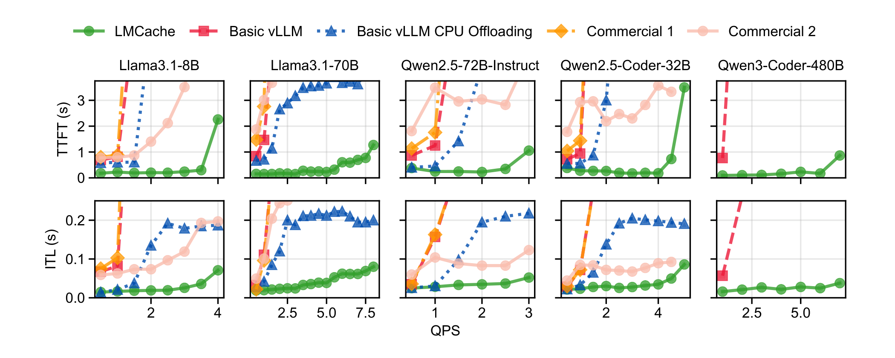

# LMCache 技术报告

## 来源

- 原始 PDF：[raw/2510.09665v2.pdf](../../raw/2510.09665v2.pdf)
- 标题：LMCache: An Efficient KV Cache Layer for Enterprise-Scale LLM Inference
- 版本/日期：arXiv:2510.09665v2，2025-12-05（v1 2025-10-08）
- 团队：Tensormesh Inc. + University of Chicago（Yuhan Liu / Jiayi Yao / Yihua Cheng 共同一作）
- 代码：<https://github.com/LMCache/LMCache>
- 评测软件口径：LMCache v0.3.6；对照 vLLM v0.10.2（GPU prefix cache）与 v0.11.0（原生 CPU offloading）；商业对照于 2025-09-10 访问
- 概念页：[KV cache 层](../concepts/kv-cache-layer.md)

这是系统 / serving 论文，不发布模型实体，不建模型页。

## 核心结论

KV cache 原先只活在单次 query 的 GPU 内存里，用来跳过 decode 时对 prompt 的重算。论文的判断是：这条假设已经被两条工业趋势打破——**跨查询 prefix reuse**（同一文档 / system prompt / 对话历史被多次问）和 **prefill–decode (PD) disaggregation**（prefill GPU 要把 KV 交给 decode GPU）。作者用自愿开启的 usage tracker 报：超出 GPU 容量的 KV 周增量持续上升，且 GPU 外 token 的 reuse per token 也在涨（§ 2.2，Figure 3–4）。

LMCACHE 的回答是把 KV cache 做成 **inference engine 和异构存储 / 网络之间的一层**，而不是 engine 内部的实现细节。它从 vLLM / SGLang 抽出 KV，存进 CPU / 本地盘 / 远程盘 / Redis 等层次，并经 Ethernet / RDMA / NVLink 传输。

> Figure 5（原文截图，§ 4 Overview）："LMCACHE sits between LLM inference engines and heterogeneous storage/network devices."

三项贡献（§ 1）：

1. **数据搬运**：把 vLLM 16-token 的小 page（Llama-3.1-8B 约 62.5 KB）聚成默认 256-token 的 chunk，用中间 GPU streaming buffer + 定制 CUDA kernel 拼/拆，再交给 DMA；layer-wise CUDA stream 让第 \(l\) 层计算与第 \(l+1\) 层加载重叠；引用计数做零拷贝多目标写。
2. **标准化 KV connector**：把 LMCache 与 engine 内部 KV layout 解耦；API 由 LMCache 团队发起，与 vLLM 团队共同实现和维护。
3. **一等控制 API**：lookup / move / pin / clear / compress，让 router 做 cache-aware 调度，也让应用显式钉住热文档。

Headline 评测（§ 8.2，Figure 8）：多轮文档问答、每 query 约 10K token 上下文，CPU offload 上限 500 GB。相对最强基线，同 TTFT 下吞吐 **2.3–14×**（摘要写 up to 15×）；QPS=1 时 TTFT **1.9–8.1×** 更小。生产采用方包括 vLLM Production Stack、NVIDIA Dynamo、llm-d、KServe、AIBrix（§ 3.2, § 6）。

> Figure 2（原文截图，§ 2.3）："LMCACHE supports both context caching (KV cache offloading and sharing across queries) and PD disaggregation (cross-engine transfer of KV caches."

## 架构与执行

![LMCache Figure 6：端到端工作流。左栏放大 Storage Manager：Local / PD / P2P / Remote 四个 backend，下接 Memory Allocator（GPU / CPU / SSD）与 Transfer Channel（NVLink / RDMA / TCP）。中栏一个 LMCache instance：Inference Engine 的 Scheduler 与 Model Runner 经 KV Connector 进入 GPU Connector / Token Processor / Cache Engine，Cache Engine 下挂 Storage Manager、Event Manager、Memory Allocator、Transfer Channel，旁有 LMCache Worker 连 Cache Controller。右栏另一个 instance 经 Network 与 Transfer Channel 互连；顶部 Router 连 Cache Controller，Developers 也可直接调 Controller。底栏 Memory/Storage 与 Network。](../assets/lmcache/fig6-architecture.png)

> Figure 6（原文截图，§ 4 Overview）："End-to-end system workflow for LMCACHE."

### 三条路径：Store / Retrieve / Lookup

- **Store**：query 经 KV connector 准备 tokenized prompt 与 GPU page 地址 → token processor 算出尚未在 backend 的新 token → storage manager 经 transfer channel 写入。
- **Retrieve**：connector 准备 metadata → token processor 找 prefix 命中长度 → event manager 若见过同一 query ID 则直接把已跟踪地址交给 GPU connector；否则查 storage manager。event manager 同时发起 § 5.2 的异步 layer-wise 加载。
- **Lookup**：router 问 cache controller。controller 维护 token pool；每个 instance 的 worker 在 store / evict 时更新，保证全局视图。

### 性能三件套（§ 5）

**Batched operations。** 不按 page 传：先用定制 CUDA kernel 把散落的 paged GPU 内存收进 contiguous streaming buffer，再按 chunk DMA 到 CPU / 盘。加载反向。默认 chunk = 256 tokens / chunk（可按 I/O 速度改）。Store / load API 接受多源多目标，PCIe 全双工时可并行。Decode 新产生的 KV 不逐 token 写，攒满一个 chunk 再 batched store。

**Compute–I/O overlapping。** 每层独立 CUDA stream：先把第 1 层 KV 装进 GPU buffer 并拆成 page，第 1 层计算时异步取第 2 层。第 \(l+1\) 层加载发生在第 \(l\) 层已经放进正确 paged 地址之后，因此 GPU buffer 只需一层 KV 大小。另有 **asynchronous prefetch**：scheduler 已准入、但还在排队的命中请求，可把 KV 从慢层预取到 CPU / GPU；目标层可由用户按 SLO 配。

**Minimum data copy。** 多目标写用引用计数，写完再释放，避免每条链路一份拷贝。**Dynamic offloading**（Figure 7）用 start / current / end 三个指针，只把 GPU free-page 池的一个窗口复制到 CPU：窗口太小会让后续 allocation stall，太大则复制比升高。论文写明尚未把同一策略扩到 CPU 以外的存储层。

### KV connector（§ 6，Table 2）

设计目标：最大灵活性、vLLM-native（scheduler–worker 分离、prefix caching 一等、piece-wise CUDA graph）、out-of-tree connector 不改 vLLM、API 级不引入 IPC。

| 位置 | 函数 | 作用 |
| --- | --- | --- |
| Scheduler | `get_num_new_matched_tokens` | 返回 backend 命中 token 数；可返回 `None` 让 vLLM 把该请求放回 waiting queue，用别的请求的计算盖住这次 I/O |
| Scheduler | `update_state_after_alloc` | 按命中信息标记哪些 page 要从外部加载 |
| Scheduler | `build_connector_meta` | 准备 GPU page 地址等传输 metadata |
| Model runner | `start_load_kv` / `wait_load_kv` | 层间 pipelining：开始加载、在该层计算前同步，并启动下一层 |
| Model runner | `start_store_kv` / `wait_store_kv` | 该层计算后存储；layerwise 时等上一层 store 完成再开始本层 |

非 layerwise 模式则在第一层前阻塞加载整份 KV，本 scheduling iteration 结束后同步 store。论文称该 API 已在 vLLM 上线超过六个月，NVIDIA Dynamo、RedHat llm-d、ByteDance AIBrix、vLLM production stack 以及多家 proprietary connector 采用。

### Controller（§ 7，Table 3）

中心化 controller manager + 每实例 worker。

| 类别 | API | 用途 |
| --- | --- | --- |
| Internal | `batched_admit` / `batched_evict` | instance 向 manager 汇报准入 / 驱逐 |
| Internal | `batched_p2p_lookup` | miss 时查 peer 上的 hit chunks |
| External | `lookup(tokens)` | 全局返回 `(inst_id, device, hit_tokens)`，供 cache-aware routing |
| External | `move` | 缩容或负载均衡时迁 KV |
| External | `clear` / `pin` / `unpin` | 清缓存、钉住热文档 |
| External | `compress` / `decompress` | 指定 method 压缩；正文无压缩算法评测 |

金融客户要 pin 常用财报；agent 公司要 identify → compress → 跨节点传输（§ 3.1.3）。

## 评测要点

硬件：单机 8×H100（GMI Cloud），每模型用能启动的最少 GPU 数；远程存储实验走 15 Gbps Ethernet；PD 实验 prefiller / decoder 用 NVLink。CPU offload 默认 500 GB。数据集：模拟多轮文档问答、LongBench TriviaQA、vLLM 官方 random、以及公司 F / G 的真实 input/output 分布（原 trace 数天被压缩到一小时）。

### 单机 CPU offload（Figure 8）

默认每 query 10K token（约 12 页 PDF + 短问题），Llama-3.1-8B 用 20K；输出最多 100 token。会话从 40 用户起，再按 QPS 加入。

> Figure 8（原文截图，§ 8.2）："Compared to basic vLLM, basic vLLM CPU offloading, and two commercial alternatives, LMCACHE has 1.9–8.1× smaller TTFT, and supports 2.3–14× higher inference throughput. Basic vLLM CPU offloading fails to run on Qwen3-Coder-480B, and commercial alternatives do not have the option to deploy Qwen3-Coder-480B."

论文对增益的机制解释（§ 8.2）：相对只把 KV 留在 GPU 的 basic vLLM，CPU 能装下更多 → hit ratio 更高；相对 vLLM 原生 CPU offloading 的 per-layer / per-16-token 传输，LMCache 按 chunk + 高性能 CUDA kernel 吃满带宽。对两家商业 API 是黑盒：作者推测 #1 没有二级存储 offload，#2 有但仍慢于 LMCache。

组件拆解（Table 5）：从 CPU 加载带宽 **LMCache 400 Gbps vs vLLM native 88 Gbps**。原因是 page-by-page 每次 CUDA memcpy 都有 metadata + completion 开销，chunk 降低这次数。

### 真实 trace（Figure 9–10）

公司 F / G 的 input/output 分布，五模型。高 QPS 下 TTFT 至少 **3.7–6.8×** 更小，ITL **19–58%** 更小。

### 集中式远程存储（Figure 11）

LongBench TriviaQA，Poisson 到达，15 Gbps。相对 basic vLLM，同 TTFT 下吞吐 **1.3–3×**，因为远程 backend 比 CPU 更能装。作者同时警告：远程带宽低时，短上下文 / 小模型上 loading 可能比 prefill 还慢，需要 **load vs prefill 自适应**（§ 8.4, § 8.7）。

### PD disaggregation（Figure 12, 14）

8K 输入 / 200 输出，对照 vLLM native PD（NIXL page-by-page）。LMCache 把 chunked prefill 产生的 KV 先拷到 prefiller GPU buffer，再传到 decoder buffer，最后写入 decoder paged memory。mean TTFT **1.53–1.84×** 更小，mean ITL **1.12–1.66×** 更小，尾延迟也更好。Figure 14：prefill / decode 计算时间两边相同，差在传输。

异步 compute（Figure 13）：排队间隙 prefetch，端到端延迟降 **1.46×**。

### 敏感性与 SGLang（Figure 15–16）

B200 上测 prefill vs 加载。**32 Gbps** 时，只有输入超过 **256K tokens** loading 才赢 naive prefill；**64 / 128 Gbps** 则所有长度 loading 都更快。SGLang + Qwen3-32B TP=2：LMCache CPU offload 相对「无 offload 的 SGLang」吞吐更高、mean TTFT / E2E 更低；与 SGLang **原生** CPU offload **相当**，但后者没有跨层次（本地盘 / 远程 CPU/盘）的分布式 backend。

### 生产课（§ 9）

- **远程加载可以比 prefill 快**：S3 Express 吞吐从 ~100 MBps 提到近 1 GBps；Company C 用自有对象存储，TTFT 比 full prefill 低 **22–32%**。
- **截断毁掉 prefix**：Company F 真实 trace 上，滑动窗口只留最近 token，prefix hit ratio 从约 **85% 降到 45%**。论文引用 Ji (2025) 主张不要动态增删 context token。
- Company G 生产 prefix hit 约 **50%**——超出「只有 system prompt 能复用」的直觉；coding assistant / chat / RAG 的动态可复用上下文抬高了命中。
- 用户主要吃官方 Docker 镜像，不改源码。
- 工业优先性能 / 稳定 / 兼容，学术关心的 token dropping 等 attention 定制 API 被降优先级。
- 坚持 Python + 针对性优化，而不是整库迁 Rust，理由是演化和社区贡献速度。
- 社区把 backend 从「本地 CPU / 盘 / Redis + NVIDIA + vLLM」扩到 NFS / WEKA / GPU-Direct Storage / Mooncake Store / NIXL / S3 / InfiniStore / Valkey，处理器 NVIDIA / AMD / Ascend / TPU，引擎 vLLM + SGLang。

## 与已有沉淀的关系

- 对 [百万 token 上下文服务](../concepts/million-token-context-serving.md)：DeepSeek-V4 解决的是 **模型侧** 异构 KV（CSA / HCA / SWA / indexer）怎么存、怎么盘上复用；LMCache 解决的是 **engine 侧** paged KV 怎么高效离开 GPU、跨查询 / 跨节点再进来。两者叠：V4 压缩块仍要一层 I/O。
- 对 [Any-to-any 多模态 serving](../concepts/any-to-any-multimodal-serving.md)：vLLM-Omni 的 unified connector 明确受 PD KV transfer 启发，但传的是 hidden / embedding / codec / 图像音频 tensor。LMCache 是这条线在 **纯 KV** 上的生产层，已被 vLLM production stack 等采用。
- 对 [端侧 MoE serving](../concepts/edge-native-moe-serving.md) / [FreeToken](freetoken.md)：FreeToken offload 的是 **expert 权重**，LMCache offload 的是 **KV**。端侧 semantic-anchor checkpoint 与本文「不要截断 prefix」是同一条 prefix-reuse 约束的两端：一边怕 harness 改历史，一边怕滑动窗口。
- 对 [JoyAI-VL-Interaction](joyai-vl-interaction.md)：记忆系统故意把非短期层存成文本，好让每 chunk 形成稳定 prefix 给 vLLM 复用——这是应用侧在为 LMCache 这类层创造可命中的 key。

## 待追问

- 摘要 15× 与 § 8.2 的 2.3–14×（同 TTFT 吞吐）差 1 个百分点量级；15× 的具体模型 / QPS 点未单独标出。
- `compress` API 在 Table 3 存在，正文没有压缩算法、压缩比或质量评测。
- Load vs prefill 的 crossover（32 Gbps / 256K）只给了敏感性曲线，没有写成在线自适应策略。
- Dynamic offloading 的 stall vs 复制比没有定量消融。
- Connector 是否覆盖 MLA / DSA / CSA-HCA / GDN 这类非标准 KV layout，论文只举例 Sliding Window Attention 与 Multi-Head Latent Attention「会改 engine 内部管理」，没有实测这些 layout。
- 真实 trace 被时间压缩到一小时，burst 结构是否被抹平未知。
- 两家商业 API 匿名且黑盒，机制归因是作者推测。

## 相关页面

- 概念：[KV cache 层](../concepts/kv-cache-layer.md)、[百万 token 上下文服务](../concepts/million-token-context-serving.md)、[Any-to-any 多模态 serving](../concepts/any-to-any-multimodal-serving.md)、[端侧 MoE serving](../concepts/edge-native-moe-serving.md)
- 相邻系统：[vLLM-Omni 技术报告](vllm-omni.md)、[FreeToken](freetoken.md)、[JoyAI-VL-Interaction 技术报告](joyai-vl-interaction.md)、[DeepSeek-V4 技术报告](deepseek-v4.md)
