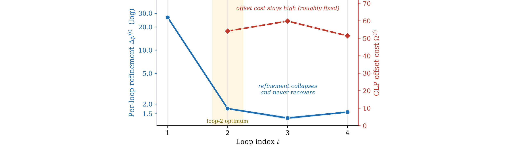

## 来源

- **PDF**：`raw/2606.18023v1.pdf`
- **标题**：LoopCoder-v2: Only Loop Once for Efficient Test-Time Computation Scaling
- **arXiv**：2606.18023v1（2026-06-16）
- **团队**：Beihang University、IQuest Research、Langboat、Renmin University of China
- **模型**：[LoopCoder-v2](../models/loopcoder-v2.md)

## 核心结论

LoopCoder-v2 研究的核心问题是：**Parallel Loop Transformer（PLT）的 loop count R 应该选几？** 论文从 gain–cost 视角分析，得出三个关键发现：

1. **R=2 是最优操作点**：两 loop 模型在代码生成、代码推理、agentic 软件工程和工具使用 benchmark 上全面优于非 loop baseline，SWE-bench Verified 从 43.0 提升到 64.4（+21.4），Multi-SWE 从 14.0 提升到 31.0（+17.0）。
2. **R≥3 退化**：三 loop 模型在多数任务上回退，SWE-bench Verified 掉到 27.6，甚至低于 baseline 的 43.0。loop count 与性能呈**强非单调**关系。
3. **机制解释——gain–cost 剪刀**：第二个 loop 是 productive refinement 的主要发生地（hidden-state 更新最连贯、attention routing 变化最大、effective rank 达峰）；之后的 loop 收益递减且振荡（cos θ(r) < 0，方向反转）。与此同时，CLP offset 引入的 positional mismatch 成本 Ω(r) 在各 loop 间大致恒定。收益急缩 + 成本固定 = 超过两个 loop 后成本主导。

## 架构与训练

### PLT 机制（已据原文核实）

PLT 通过两个独立机制解决标准 looped Transformer 的延迟和内存随 loop count 线性增长问题：

**Shared-KV Gated Sliding-Window Attention（G-SWA）**：第一个 loop 的 KV cache（K_share, V_share）被所有后续 loop 共享，使总 KV-cache 内存保持 O(L·S·d) 不随 R 增长。非首 loop 的每层 attention 做 gated fusion：

$$\tilde{y}^{(r)} = g \odot y^{(r)}_{\text{global}} + (1-g) \odot y^{(r)}_{\text{local}}$$

其中 $y^{(r)}_{\text{global}}$ 是对 frozen loop-1 KV 的 full attention，$y^{(r)}_{\text{local}}$ 是对当前 loop KV 的 width-w=64 sliding-window attention。gate $g = \sigma(f_{\text{gate}}(\text{RMSNorm}(h)))$ 是 head-wise 线性层，零初始化到 local/global 均衡。

**Cross-Loop Position Offset（CLP）**：在 loop r≥2 前，将上一 loop 的 hidden state 右移一个 token 位置并与 embedding 相加：

$$B^{(r)} = \text{Embed}(x) + \text{shift}(h^{(r-1)})$$

这使得 token $x_i$ 在 loop r 收到的是 $x_{i-1}$ 的 loop-(r-1) hidden state（而非自身的），从而**打破 loop 间的序列依赖**，使不同 loop 的不同 token 可以在单次前向传播中并行计算，延迟近似为 $\approx C_{\text{block}}$（不随 R 增长）。

> **CLP 的信息流后果（论文核心洞察）**：offset 意味着 token $x_i$ 在 loop r 的输入反映的是 $x_{i-1}$ 的上下文而非自身的。这种 per-token positional mismatch 是 PLT 引入的结构性信息约束——标准 looped Transformer 不存在此成本，但也不并行。

> Figure 1. Overview of PLT loop-count selection. Left: standard sequential looping increases latency and KV-cache memory with the loop count, whereas PLT uses a cross-loop position offset and shared-KV G-SWA to keep both costs nearly constant. Middle: each added loop trades marginal refinement gain against the CLP-induced offset mismatch. Right: per-loop diagnostics explain this choice.（§ 2. Preliminaries and Problem Formulation）

### 训练配置

| 超参数 | 值 |
|---|---|
| 总参数 | ≈7B |
| 共享 block 层数 L | 14 |
| Hidden size d | 5120 |
| Attention heads H | 40 |
| KV groups (GQA) | 8 |
| Head dimension | 128 |
| FFN intermediate size | 27,648 |
| Activation | SwiGLU |
| Normalization | RMSNorm (ε=10⁻⁵) |
| Position embedding | RoPE (base 5×10⁵) |
| Vocabulary size | 76,800 |
| Training tokens | 18T（1:1 text:code） |
| Window size w | 64 |
| Loop counts R | 1, 2, 3, 4 |
| 优化器 | Adam (β₁=0.9, β₂=0.95, ε=10⁻¹⁵) |
| Learning rate | 4×10⁻⁴ (cosine decay, 5% warmup) |
| Precision | bf16 + gradient checkpointing |
| 总 GPU hours | 1M |

训练数据代码部分覆盖 100+ 编程语言，前 10 大语言占比：Java 10.3%、Python 10.1%、JavaScript 9.4%、Markdown 8.7%、TypeScript 8.3%、C 5.2%、C++ 5.0%、PHP 4.7%、C# 4.0%、HTML 3.7%。

训练与推理 loop count 全程匹配：R=r 训练的模型在 R=r 评估。Megatron-LM 栈原生支持 weight-tied loop unrolling，R 个 loop 展开为 R·L 个 scheduled layer 但只有第一个 loop 实例化参数。

### Per-loop 可解释性诊断

论文用三组互补镜头（triangulation）打开 PLT 内部计算：

**Hidden-state dynamics**：
- Step size δ(r) = ‖h(r) - h(r-1)‖₂：hidden-state 更新幅度
- Angular change cos θ(r)：连续更新方向对齐度，cos θ≈1 同向，≈0 正交，<0 振荡反转
- Effective rank erank(h(r))：表征多样性，在 loop 2 达峰后递减
- Fixed-point gap Δ_FP(r)：离 shared block 不动点的距离

**Attention evolution**：
- Attention entropy H(r)：head 是否 diffuse 或 focused
- Inter-loop KL divergence D_KL(r)：attention 分布跨 loop 变化量，D_KL 趋零表示信息路由冻结
- Head diversity：head 间余弦相似度上升 = 路由冗余化
- G-SWA gate ḡ(r)：>0.5 表示依赖 frozen loop-1 全局 cache

**Output-distribution shift**：
- Logit Lens rank：ground-truth token 在 p(r) 中的排名
- Inter-loop output KL Δp(r)：预测分布跨 loop 变化
- Output entropy H(p(r))：预测置信度

**Intrinsic offset cost**：Ω(r) = (1/S) Σ_i ‖h(r-1)_i - h(r-1)_{i-1}‖₂，直接从模型相邻 token 的 hidden state 距离衡量 CLP shift 引入的 positional mismatch。

### Gain–cost 剪刀效应

> Figure 3. The gain–cost scissors (PLT4). The per-loop refinement gain Δp(r) (output-distribution KL; left axis, log) collapses after loop 2 and never recovers, whereas the intrinsic CLP offset cost Ω(r) (Equation 6; right axis) stays high and roughly fixed. At every extra loop the offset cost exceeds the per-loop gain by 30–45×.（§ 4.2. Synthesis: Loop Contribution vs. Offset Cost）

Per-loop 行为特征（PLT4，500 held-out samples 平均）：

| Loop | δ(r) | Δp(r) | Eff. rank | cos θ(r) |
|---|---|---|---|---|
| r=2 | 846 | 1.75 | 174.6 | -0.72 |
| r=3 | 464 | 1.32 | 172.5 | -0.46 |
| r=4 | 1014 | 1.58 | 158.2 | 0.04 |

Loop 2 有最大的 output shift 和 effective rank；loop 3 step size 最小（近 dead pass-through）；loop 4 step size 反弹但 effective rank 最低（final readout 而非 refinement）。

## 后训练

所有模型用同一套 6M instruction-tuning 样本做 SFT。论文还训练了 thinking 变体（explicit CoT + latent loop），发现两者**互补而非冗余**：

| 模型 (R=2) | LCB | CRUX | MultiPL-E | FullStackBench | BCB-Hard |
|---|---|---|---|---|---|
| Instruct (latent loop only) | 35.4 | 86.9 | 73.9 | 47.2 | 23.7 |
| Thinking (explicit CoT + loop) | 62.3 | 93.5 | 77.8 | 49.9 | 26.4 |
| Δ | +26.9 | +6.6 | +3.9 | +2.7 | +2.7 |

Thinking 变体在 LiveCodeBench 上 +26.9，远超 explicit CoT 或 latent loop 各自单独的增益——**超加性（super-additive）**。论文将此归因于两机制在不同粒度操作：explicit CoT 将问题分解为中间文本步骤，latent loop 精炼每步底层的表征。

## 评测要点

### 主结果（Table 2，已据原文核实）

| 模型 (7B) | HE+ | MultiPL-E | BCB | LCB | SWE | SWE-M | TB-v1 | TB-v2 | M2W | BFCL | Avg. |
|---|---|---|---|---|---|---|---|---|---|---|---|
| Baseline (R=1) | 81.1 | 69.5 | 40.1 | 27.4 | 43.0 | 14.0 | 26.3 | 11.2 | 35.3 | 32.2 | 38.0 |
| LoopCoder-v2 (R=2) | 84.1 | 73.9 | 46.1 | 35.4 | **64.4** | **31.0** | **34.2** | **21.0** | 34.5 | **40.1** | **46.5** |
| LoopCoder-v2 (R=3) | 75.0 | 69.8 | 43.3 | 28.6 | 27.6 | 11.0 | 30.0 | 12.2 | 35.1 | 36.3 | 36.9 |
| LoopCoder-v2 (R=4) | 76.8 | 67.3 | 40.8 | 24.5 | 22.4 | 9.3 | 26.3 | 9.0 | 41.4 | 39.5 | 34.3 |

R=2 的 7B 模型在 SWE-bench Verified 上达到 64.4%，超过 Kimi-Dev-72B（60.4%），接近 Qwen3-235B-A22B（45.2%）和 Qwen3-Coder-480B-A35B（67.0%）。同一配置在 SWE-bench-CC 上也达 33.4%，确认 loop-2 增益可泛化到 held-out agentic 场景。

### Loop-count 选择的实践指南

论文建议用 effective-rank trajectory 作为轻量诊断：如果候选 loop 处 effective rank 仍在上升（表征多样性未饱和），追加 loop 可能有真实收益；如果 rank 开始下降，说明 narrowing 开始，之后追加 loop 主要增加固定 CLP offset 成本而无补偿收益。

## 待追问

- **CLP offset 能否自适应**：论文在 Conclusion 提及 adaptive offset mechanisms 和 dynamic loop allocation 作为未来方向，但未展开。如果 Ω(r) 能随 loop 递减（而非恒定），gain–cost 交叉点可能推迟到更高 R。
- **与 MTP 的关系**：Looped Transformer 的 latent depth recurrence 和 MTP（multi-token prediction）都是 test-time compute scaling 的路径，但论文未讨论两者关系。PLT 的 loop 是在表征空间迭代精炼，MTP 是在 token 空间并行预测——两者是否也互补（如同 explicit CoT + latent loop）？
- **18T tokens 1:1 text:code 的代表性**：代码占比 50% 远高于一般 LLM 预训练，loop-count 最优值是否依赖数据组成？纯文本训练的 PLT 是否也饱和在 R=2？
- **scaling law 跨参数量**：论文只在 7B 上实验。Schwethelm et al. 估算一次 loop 等效 r^0.46 个独立参数层——更大模型上 gain–cost 交叉点是否会移动？

## 相关页面

- [LoopCoder-v2 模型页](../models/loopcoder-v2.md)
- [Looped Transformers 概念页](../concepts/looped-transformers.md)
- [Agentic 评测体系](../concepts/agentic-evaluation-benchmarks.md) — LoopCoder-v2 的 SWE-bench Verified / Terminal-Bench 数据点
- [多 token 预测](../concepts/multi-token-prediction.md) — MTP 与 latent loop recurrence 作为 test-time compute 两条路径的关系
