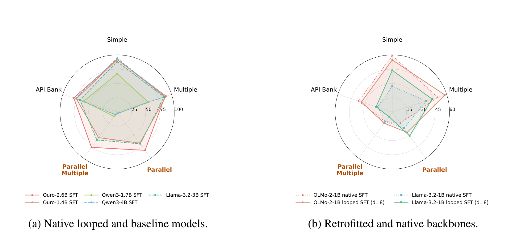

## 来源

- **PDF**：`raw/2608.18171v1.pdf`
- **标题**：Looped Language Models Improve Compositional Tool Calling
- **arXiv**：2608.18171v1（2026-08-17）
- **团队**：University of Cambridge
- **作者**：Andrei Cristian Popescu、Haitz Sáez de Ocáriz Borde、Pietro Liò

## 核心结论

这是一篇研究**循环深度（recurrent depth）能否改善工具调用**的实证论文，而不是新模型发布。其最强信号不是「loop 对所有 function calling 都有效」，而是：当任务需要生成多个调用、维持调用间结构，或把前一步输出绑定到后一步参数时，额外的 latent recurrence 更有价值；以单 API 调用为主的 API-Bank 上，收益小且随 backbone 而变化（原文确证，§5、Tables 1–3）。

论文把一个解表示成调用节点与依赖边组成的 DAG $G_x=(C_x,E_x)$：BFCL 的 Parallel / Parallel-Multiple 测试多条**独立**调用（$|C_x|>1,E_x=\varnothing$），NESTful 则测试后续参数消费先前输出的**依赖**调用（通常 $|E_x|>0）。这一区分使它能把「选对一个函数」与「组合出可执行工作流」分开（原文确证，§3、§4.2）。

> Figure 1. Looped computation primarily improves compositional tool use.（§ Abstract / Figure 1）

## 架构与训练

### 循环计算与自适应退出

循环语言模型将同一共享 Transformer block 反复施加于 hidden state：

$$h^{(t)}=F_\theta(h^{(t-1)}),\qquad \pi_\theta^{(t)}(y\mid x)=g_\theta(h^{(t)}).$$

因此，增加 $t$ 提供的是 token 生成前的 latent refinement，而非增加参数或显式 CoT token。原生 Ouro 模型还在每个循环预测 halt probability，形成 exit-depth 分布；推理时以累计退出概率阈值决定 token 在第几次循环退出。论文报告，自适应退出在 BFCL / NESTful 上用更低的**每生成 token 平均循环次数**匹配或略超最佳固定深度点（原文确证，§3、§5、Figure 4）。

### 两种对照的证据强度不同

| 设置 | 模型 | 训练 / 推理 | 能回答的问题 |
| --- | --- | --- | --- |
| 原生循环 | Ouro-1.4B / 2.6B | Hermes Function Calling SFT；最多 4 次循环；学习 halt gate | 原生 recurrent 模型在工具调用的整体表现与深度—成本折中 |
| 后置改造 | OLMo-2-1B、Llama-3.2-1B | 将已有模型划为 prelude / shared recurrent block / coda；训练批次随机采样循环深度 | 在共享 pretrained backbone 下，引入 recurrence 的更直接隔离 |

所有受控 SFT 使用 Hermes Function-Calling V1、ChatML、4096 token 上限、两 epoch、LoRA rank 32 和 bf16（原文确证，§4.1、Appendix A–B）。原生 Ouro 的训练目标对各深度的 next-token loss 以学习到的 exit distribution 加权；retrofit 则只在随机采样深度的最后一次 readout 监督，并以 KL 项保持冻结原模型的行为（原文确证，§4.1、Appendix A）。

## 评测要点

### 组合式任务上的增益

在 BFCL v3 的同 backbone retrofit 对照中，固定 8 次循环后，OLMo-2-1B overall AST accuracy 从 39.1 升至 41.8，Llama-3.2-1B 从 21.4 升至 32.9；Llama 的 Simple / Multiple / Parallel 也均上升，但 Parallel-Multiple 仅从 5.0 升至 6.0（原文确证，Table 1）。这支持 recurrence 有用，但也说明改善不是每种组合类别都同样稳定。

| 评测 | 主要测量对象 | 论文观察 |
| --- | --- | --- |
| BFCL v3 | 单调用、候选函数选择、独立多调用 | 固定深度通常随循环增加而提升；多调用类别更常持续受益（§4.2、Figure 2） |
| NESTful | 输出到输入的依赖绑定、嵌套执行 | Ouro 的 Win Rate 随固定深度上升；定性例子显示深度 3 可修正函数顺序、幻觉调用和变量引用（§5、Figures 3、5–9） |
| API-Bank | 以单次 API 选择与参数 grounding 为主 | 改善较小且 model-dependent：OLMo retrofit 的 Call Correctness 37.1 降至 34.0，Llama 从 16.3 升至 17.9（Table 3） |

Ouro-2.6B 在完整 NESTful 上的 SFT Win Rate 为 0.371，较其 base 的 0.190 高；但这不能单独归因于循环，因为该族没有完全相同预训练条件下的 non-looped counterpart（原文确证，Table 2、§7）。论文自己以 Qwen / Llama 的 matched SFT 作近似参照，并把共享 backbone 的 retrofit 实验作为更直接的架构隔离。

### 对本仓库的意义

这篇论文把 [Looped Transformers](../concepts/looped-transformers.md) 的收益边界从 LoopCoder-v2 的 coding / PLT 诊断扩展到 **tool-call DAG 的节点组合与依赖边维护**：额外 loop 可以修正调用数、顺序、函数名、参数名和中间变量引用。它与 [Agentic engineering](../concepts/agentic-engineering.md) 的关系是内部算力分配，而非新增 planner、retriever 或 harness；它也提醒 [Agentic 评测体系](../concepts/agentic-evaluation-benchmarks.md) 把循环深度 / adaptive exit 当作可比性变量。

## 待追问

- **真实交互是否成立**：论文只跑静态、single-turn 的 BFCL non-live 和离线 NESTful / API-Bank；多轮执行失败后的恢复、工具观测噪声和 live API 漂移尚未测量（原文确证，§7）。
- **原生训练还是后置循环更关键**：retrofit 能改善部分组合任务，但在深层 NESTful 工作流上明显弱于原生 Ouro；需要同预训练配方的 recurrent / non-recurrent pair 才能量化这一差距。
- **退出 gate 的可靠性**：adaptive frontier 的证据仅来自 Ouro 已有 gate。retrofit 模型没有 learned halting，尚不知更通用的退出准则能否在工具调用中复现节省。
- **与 PLT 的关系**：本文使用 Ouro / retrofitted recurrence，不使用 LoopCoder-v2 的 CLP + shared-KV PLT；工具调用的最优 loop depth 能否迁移到低延迟 PLT，仍未回答。

## 相关页面

- [Looped Transformers](../concepts/looped-transformers.md) — latent recurrence、计算深度与 PLT 的效率边界
- [Agentic engineering](../concepts/agentic-engineering.md) — 组合式工具工作流的系统层能力
- [Agentic 评测体系](../concepts/agentic-evaluation-benchmarks.md) — BFCL / NESTful 的能力拆分与可比性变量
- [LoopCoder-v2](loopcoder-v2.md) — 同一 latency-scaling 大类下的 PLT coding 证据
