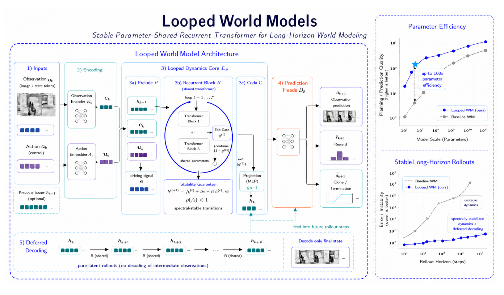
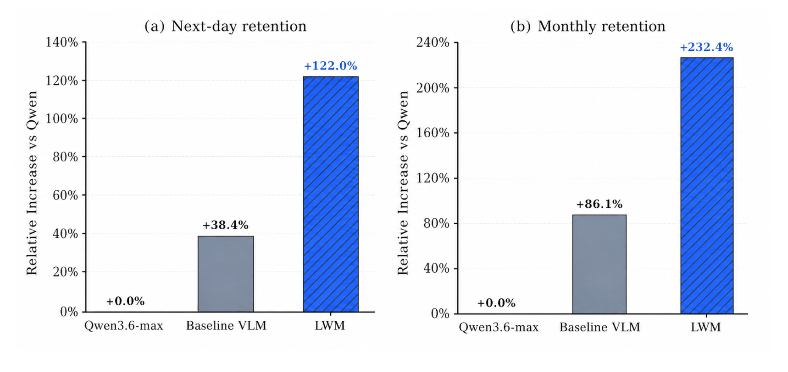
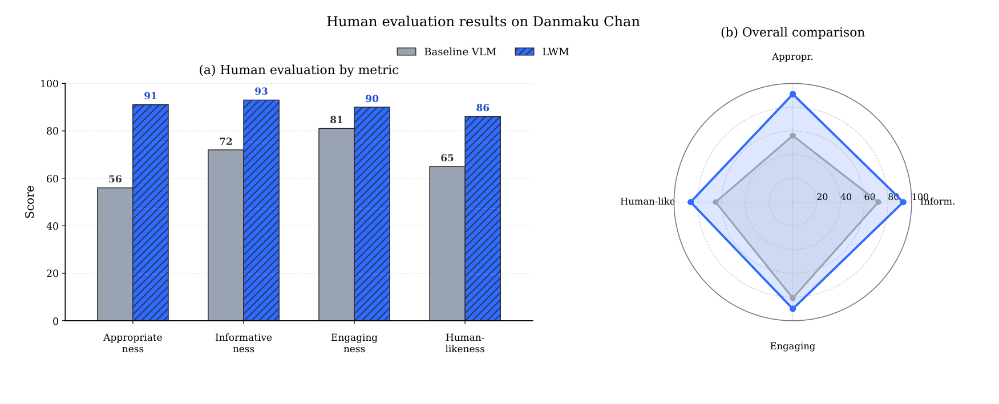

# Looped World Models

## 来源

- **PDF**：`raw/2606.18208v1.pdf`（34 页）
- **标题**：Looped World Models
- **arXiv**：2606.18208v1（2026-06-16）
- **团队**：FaceMind Research Asia
- **作者**：Leading Contributors Hongyuan Adam Lu\*、Z.L.、Victor Wei；Core Contributors 含 Qun Zhang、Jinrui Zeng、Bowen Cao 等，Wai Lam 列于作者末位
- **模型**：[LoopWM](../models/loopwm.md)（约 1B；层宽、训练数据与优化器未披露）

## 核心结论

原文确证（摘要、§1、§3）：这篇报告把 [Looped Transformers](../concepts/looped-transformers.md) 从语言模型接到 **world model 的 action-conditioned latent dynamics**。作者主张长程模拟需要深计算，但加层会涨参数、且逐步 rollout 会累积误差；LoopWM 用参数共享的 Transformer block 在单步转移内迭代精炼隐状态，并加谱约束的线性状态保留。内循环被明确写成**概念对应**，不是物理时间步（§1："This correspondence is conceptual rather than exact"）。

公开数字落在 **ScienceWorld / AlfWorld 的五步 next-state 文本预测**，对照对象是通用 LLM API，不是 Dreamer / IRIS / RSSM：

| 设定 | LoopWM（约 1B） | 最强公开对照 | 口径 |
| --- | --- | --- | --- |
| ScienceWorld 总体 | EM 68.4 / F1 85.3 / BLEU-4 80.7 / Entity 83.9 | claude-opus-4-6-max：47.2 / 72.8 / 64.4 / 72.3 | Table 2–3；连续 5 个 action 后对终态观测打分 |
| AlfWorld 总体 | EM 51.6 / F1 80.4 / BLEU-4 71.6 / Entity 81.1 | EM 上 Claude 53.0 更高；F1 / Entity 上 gemini-3-flash-preview-thinking 83.5 / 90.2 更高 | Table 4；同一五步协议 |

**100× 参数效率**在正文里的依据是「约 1B vs 闭源 API 大模型」（§4.1），不是同架构、同数据的 world-model 对照。Figure 1 右侧的效率 / 稳定性曲线是总览示意，正文没有给出对应的实测表。§3.4 的「相对 100 层固定深度可到 ~25× / 两数量级 FLOPs」是思想实验，不是测得的吞吐。

**本页综合**：机制上，LoopWM 把 Huginn / Parcae 的 Prelude–Recurrent–Coda 接到 Dreamer 式四模块 world model，并用延迟解码把观测重建从中间步挪到终点。证据上，它支持「循环深度可以做环境模拟」这一方向，但还不能支撑「已优于现有 world-model 族」或「已证明长程稳定」。

> Figure 1: The overall framework of our proposed Looped World Models (LoopWM).（PDF p.1）

## 架构与训练

### 四模块 + 双循环

原文确证（§3.1–§3.2，Eq.3–8）：每个环境步 $k$ 为

$$e_k=\mathcal{E}_\phi(o_k),\quad u_k=\mathcal{A}_\psi(a_k),\quad h_k=\mathcal{L}_\theta(h_{k-1},e_k,u_k),\quad (\hat o_{k+1},\hat r_k,\hat c_k)=\mathcal{D}_\xi(h_k).$$

- **Observation Encoder / Action Embedder**：把 $o_k$、$a_k$ 投到同一 $d$ 维空间。正文写卷积或 ViT 编码器；公开实验是文本环境，视觉连续环境只在 §6 声称「loss 可下降」，没有数字。
- **Looped Dynamics Core**：Prelude $L_\mathcal{P}$ 层处理 $[h_{k-1};e_k;u_k]$ 得到条件信号 $e$；Recurrent $L_\mathcal{R}$ 层共享参数循环 $T$ 次；Coda $L_\mathcal{C}$ 层（不共享）读终态 $h^{(T)}$。层数 $L_\mathcal{P}/L_\mathcal{R}/L_\mathcal{C}$、隐维、$T$ 均值均未给。
- **Prediction Heads**：观测 / 奖励 / 终止，沿用 Dreamer 式 MLP 头。
- **Imagination**：encoder 可关掉，$h_{k+1}=\mathcal{L}_\theta(h_k,\mathbf{0},u_k)$。

内循环在单步转移内精炼；外循环把 $h^{(T)}$ 传到下一环境步作 $h^{(0)}$。这是顺序 recurrence，不是 [LoopCoder-v2](loopcoder-v2.md) 的 PLT（无 CLP、无 shared-KV G-SWA）。

### 谱约束只钉住线性保留项

更新规则（Eq.5，原文确证）：

$$h^{(t+1)}=\bar A\,h^{(t)}+\bar B\,e+\bar{\mathcal{R}}(h^{(t)},e).$$

$\bar A$ 按 Parcae（Prairie et al., 2026）写成 $A=\mathrm{diag}(-\exp(\mathbf a))$，$\bar A=\exp(\Delta A)$，从而对角元落在 $(0,1)$，$\rho(\bar A)<1$。这保证**线性保留**是压缩的；非线性 $\bar{\mathcal{R}}$ 仍是完整 Transformer，正文没有对整条更新给出谱半径。§1 把「provably stable … regardless of rollout length」写进贡献句，应读成对 $\bar A$ 的构造保证，而不是已测得的任意长度 rollout 稳定性。

$h^{(0)}$ 可从 $\mathcal N(0,\sigma^2 I)$ 抽，或承接上一环境步终态。Prelude 对 $e$ 做 LayerNorm，作者说是为了避免后期 loss spike。

### 变深度训练与退出门

原文确证（§3.3–§3.4）：

- 训练时 $T\sim\mathrm{Poisson}(\mu_{\mathrm{rec}})$，**按 sequence** 抽样（相对 Geiping et al. 2025 的按 micro-batch）；反向截断 $\mu_{\mathrm{bwd}}=\lceil\mu_{\mathrm{rec}}/2\rceil$。
- 世界模型损失 = 观测 + $\lambda_r$ 奖励 + $\lambda_c$ 终止；观测项随空间选 MSE 或 token 交叉熵。
- 退出门 $g^{(t)}=\sigma(w_g^\top h^{(t)}+b_g)$，超过阈值 $\tau$ 就停。另加熵正则 $-\alpha\sum H(g^{(t)})$ 防止总在第一步退出或从不退出。$\mu_{\mathrm{rec}}$、$\tau$、$\alpha$ 未给。

### 延迟解码：外层不重建中间观测

原文确证（§3.5，Table 1）：规划或评测地平线 $K$ 上，中间 $K$ 步只注入动作、在 latent 里走 $\mathcal L_\theta^{\mathrm{core}}$，解码器只在终点调用一次。训练目标是终点预测 + 中间步对冻结 encoder 的 consistency（stop-gradient）+ 外层步长和的软收缩惩罚；地平线按 $K(\mathrm{step})=\min(K_{\max},1+\lfloor\mathrm{step}/\Delta\rfloor)$ 从 1 往上加。推理分 Planning（只看 $h_K$）和 Monitoring（轻量投影 $g_\omega(h_k)$，不必全解码）。

| 方法 | 隐状态动力学 | 中间解码 | 动作注入 | 循环深度 |
| --- | --- | --- | --- | --- |
| Dreamer | RSSM | 每步 reward + value | 每步 | – |
| MuZero | learned MLP | 每步 policy + value + reward | 每步 | – |
| PlaNet | RSSM | 每步重建 | 每步 | – |
| ETD | looped layers | 只在终点解码 | 无（语言） | ✓ |
| NE-Dreamer | RSSM | 每步 embedding 对齐 | 每步 | – |
| LoopWM-DD | looped transformer | 只在步 $K$ 解码 | 每步在 latent 注入 | ✓ |

Table 1 是设计对照，不是实验结果。延迟解码的公开数字是相对 Gemini 的逐步相对增益（Tables 5–44），**没有** LoopWM 有 / 无延迟解码的配对消融。

## 评测要点

协议（Table 2 caption，原文确证）：连续喂 5 个 action，对最终 world-modelling 输出打 EM / Token F1 / BLEU-4 / Entity。这不是 ScienceWorld / AlfWorld 的 agent 成功率。

### ScienceWorld（Table 2–3）

| 模型 | EM | Token F1 | BLEU-4 | Entity |
| --- | --- | --- | --- | --- |
| LoopWM（约 1B） | 68.4 | 85.3 | 80.7 | 83.9 |
| claude-opus-4-6-max | 47.2 | 72.8 | 64.4 | 72.3 |
| gemini-3-flash-preview-thinking | 30.8 | 68.9 | 51.1 | 73.8 |
| qwen-3.5-flash | 10.0 | 46.9 | 26.7 | 63.0 |

极端例子：Lifespan 上 LoopWM 报 100%，Claude 报 EM 0%；LifeStages 上 LoopWM 仍是 EM 0.0 / F1 18.3。正文把 ScienceWorld EM 差写成「surpassing the baseline by 21.2%」，对应 68.4 与 47.2 的 **21.2 个百分点**，不是相对涨幅。

### AlfWorld（Table 4）

| 模型 | EM | Token F1 | BLEU-4 | Entity |
| --- | --- | --- | --- | --- |
| LoopWM | 51.6 | 80.4 | 71.6 | 81.1 |
| claude-opus-4-6-max | **53.0** | 72.6 | 66.8 | 77.0 |
| gemini-3-flash-preview-thinking | 50.0 | **83.5** | 71.0 | **90.2** |
| qwen-3.5-flash | 26.0 | 67.3 | 47.7 | 88.4 |

正文自己写：LoopWM 在四个模型里 BLEU 最好，EM 与 Token F1 第二；entity 偏低，作为后续优化方向。不能把 AlfWorld 读成全面超过 Claude / Gemini。

### 延迟解码表（Tables 5–44）

Table 5 是相对 gemini-3-flash-preview-thinking 的 ScienceWorld 全任务平均相对增益 $(Ours-Baseline)/Baseline$：Step1 EM +73.2%，Step5 EM +113.8%。§4.3 据此说「rollouts 累积时更有用」。这是 **相对 Gemini 的逐步差距**，不是延迟解码本身随 $K$ 变强的消融。后续约 40 张表按任务、按 Qwen/Gemini、按 step 重复同一格式。

### 弹幕额外图（Figure 2–3，PDF p.29–30）

正文主结果从未出现弹幕任务；图注写 online estimation、danmaku generation，并把图中的 LWM 定义为 LoopWM（与本 wiki 的 language world model 缩写不是同一对象）。

> Figure 2: Relative increase over Qwen3.7-max on automatic online performance … tasks of danmaku generation. LWM denotes LoopWM.（PDF p.29）

> Figure 3: Human evaluation performance with our model, compared against baselines. … tasks of danmaku generation. LWM denotes LoopWM.（PDF p.30）

图内数字：次日留存相对 Qwen +122.0%、月留存 +232.4%；人工四维约 91 / 93 / 90 / 86 vs baseline 56 / 72 / 81 / 65。没有样本量、标注协议、Baseline VLM 身份。caption 的 Qwen3.7-max 与图轴 Qwen3.6-max 不一致。

## 待追问

- **同族基线**：正文贡献句写 competitive or superior to existing world model architectures，但结果表只有通用 LLM。LoopWM vs 固定深度 Transformer vs RSSM / Dreamer，在同一 ScienceWorld 协议上差多少？
- **未披露配方**：约 1B 之外，$L_\mathcal{P}/L_\mathcal{R}/L_\mathcal{C}$、隐维、词表、$\mu_{\mathrm{rec}}$、训练数据、优化器、步数均未给。§6 写「intentionally selective in disclosure scope」。
- **谱约束的经验后果**：$\rho(\bar A)<1$ 是构造事实；非线性残差是否仍会炸、长程误差是否真低于固定深度，正文没有曲线。
- **延迟解码的因果**：Tables 5–44 相对 Gemini，不隔离「去掉中间解码」这一项。
- **模态**：架构图画了像素观测；公开表是文本环境；§6 的 continuous visual environments 只有「loss 可下降」。
- **弹幕图与主文脱节**：Figure 2–3 的任务、对照模型名、LWM 缩写都与 §4 主表不一致，目前只能当未与主实验对齐的额外材料。
- **与 Qwen-AgentWorld 的边界**：两者都叫 world model。Qwen-AgentWorld 是 7 域 native language world model，评 AgentWorldBench / Sim RL；LoopWM 是 Dreamer 式 latent dynamics + 循环核，评五步文本 next-state。还没有同一协议上的对照。

## 相关页面

- [LoopWM 模型页](../models/loopwm.md)
- [Looped Transformers](../concepts/looped-transformers.md) — 循环深度谱系；LoopWM 是顺序 recurrence 接到 world-model 隐状态，不是 PLT
- [LoopCoder-v2](loopcoder-v2.md) — 同属 looped Transformer，但是 coder + PLT + 有匹配非循环基线
- [Looped Language Models Improve Compositional Tool Calling](looped-tool-calling.md) — 循环深度的另一评测对象（tool-call DAG）
- [Qwen-AgentWorld](qwen-agent-world.md) — native language world model，与 LoopWM 不是同一族
- [BDH-CQ](bdh-cq.md) — 另一条 latent iteration，任务是 ARC 而不是环境转移
