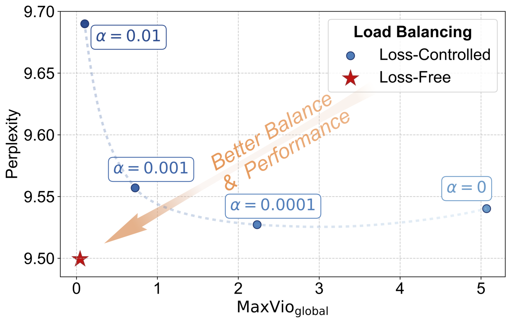
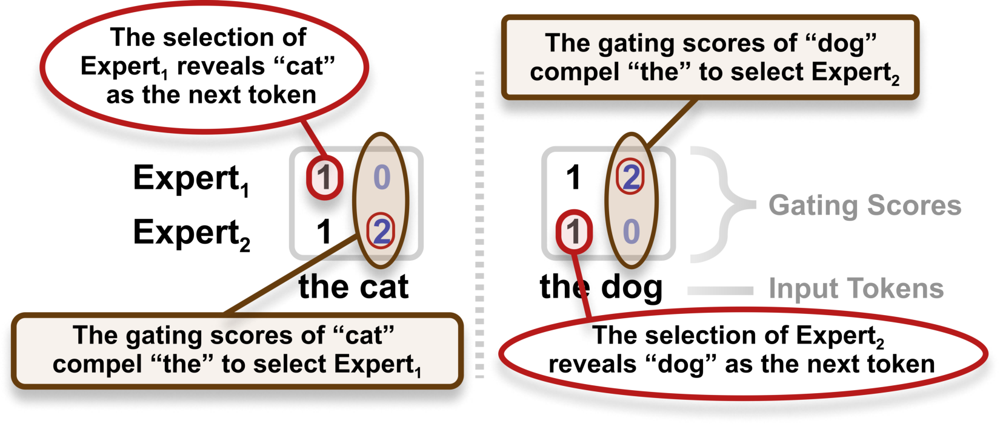

# Loss-Free Balancing：Auxiliary-Loss-Free Load Balancing Strategy for Mixture-of-Experts

## 来源

- 文件：`raw/2408.15664v1.pdf`
- 标题：Auxiliary-Loss-Free Load Balancing Strategy for Mixture-of-Experts
- 团队 / 日期：Lean Wang, Huazuo Gao, Chenggang Zhao, Xu Sun, Damai Dai（DeepSeek-AI + 北大）；arXiv:2408.15664v1，2024-08
- 定位：**方法论文，非模型报告**——MoE 负载均衡问题本身。提出 Loss-Free Balancing（偏置门控），是 DeepSeek-V3 / V3.2 / V4、Kimi K2 系、MiniMax-M2、MiMo-V2-Flash、Ling-2.6 等一线 MoE 生产模型共同采用（或混合采用）的负载均衡标准的**一手出处**。

## 核心结论

1. **问题重述：负载均衡 vs 模型性能的两难**。无控制的路由会 routing collapse（少数专家被反复选中，其余训练不足）或加剧 expert-parallel 计算瓶颈；主流解法是 auxiliary loss（Switch/GShard 式 $L_{\text{Balance}} = \alpha \sum_i f_i P_i$），但 $\alpha$ 小→失衡，$\alpha$ 大→干扰梯度损害语言建模目标。论文用 Figure 2 实证这个 dilemma：$\alpha \in \{10^{-2}, 10^{-3}, 10^{-4}, 0\}$ 扫描下，没有哪个 $\alpha$ 同时给出好平衡和好性能（§2.2）。
2. **Loss-Free Balancing：top-K 前加 expert-wise bias，训练后按负载更新**。$g_{i,t}$ 的选择改为 $s_{i,t} + b_i \in \text{Topk}(\{s_{j,t} + b_j\}, K)$；每个 batch 结束后统计 $c_i$（expert $i$ 分到的 token 数），$e_i = c_i - \bar{c}$，更新 $b_i \leftarrow b_i + u \cdot \text{sign}(e_i)$（Algorithm 1）。**bias 只影响 top-K 选择，不进入加权输出 $g_{i,t}$**（即不改 mixture weights、不给 router 引入额外梯度），梯度完全来自语言建模损失（§3、Eq. 3）。
3. **head-to-head 双赢**：1B（100B tokens）/ 3B（200B tokens）从零训练，vs $\alpha = 10^{-3}$ 的 aux-loss 基线，Loss-Free 同时拿到更低 validation perplexity（1B: 9.50 vs 9.56；3B: 7.92 vs 7.97）和数量级更好的全局负载（MaxVio_global 0.04 vs 0.72 / 0.52）（Table 2）。
4. **对 EC（Expert Choice）的致命一击：future token leakage**。EC 让专家挑 token，未来 token 的 gating score 会影响当前 token 的 expert 分配——每层可泄漏 $K \log_2 \frac{1-R}{R}$ bits/token（$R = K/N$ 为稀疏度）。9 层 MoE、16 experts、K=2 时超 50 bits，足以让每个 token 确定其后继身份。实验把 top-K chunk 从 8192 缩到 512 tokens，观察到 ~10% 异常 loss 下降；shuffle 后异常消失——泄漏被实锤（§5.2、附录 D、Figure 9）。
5. **与 expert parallelism 天然兼容**：computation batch 越大，Loss-Free 的 batch 级负载越接近全局负载（aux-loss 方法趋于常数）；EP 放大 computation batch 的倍数恰好放大这个优势（§5.1、Figure 5）。

## 机制：Algorithm 1 逐行（已据原文核实）

```
输入: MoE 模型 θ, 训练 batch 迭代器 B, bias 更新率 u
1. 每个 expert 初始化 b_i = 0
   对 B 中每个 batch {(x_k, y_k)}:
2.   用式(3)的门控分数（s_{i,t} + b_i 决定 top-K）训练 θ
3.   统计每个 expert 分到的 token 数 c_i 及平均 \bar{c}
4.   计算负载违例 e_i = c_i - \bar{c}
4'.  更新 b_i ← b_i + u·sign(e_i)
```

三个设计细节（原文 §3 + §4.3 消融）：

- **为什么用上一个 batch 的负载（历史信息）**：用当前序列的负载信息会破坏因果约束——语言建模里那是未来 token 的信息泄漏。这和 EC 的泄漏是同一类禁忌，只是 EC 违反得更严重。
- **为什么 sign 而不是幅度**：变体 $b_i \leftarrow b_i + u \cdot e_i$ 平衡略好（MaxVio 0.028 vs 0.044）但性能不升反微降（PPL 9.53/9.51 vs 9.50），作者保留 sign 版（Table 3）。
- **为什么加性而不是乘性**：乘性 bias（$s_{i,t} \cdot b_i$，初始化为 1）性能略差且平衡无显著改善，弃（Table 4）。
- **更新率 $u$ 的甜点**：$10^{-4}$ 收敛太慢（前期失衡），$10^{-2}$ 后期负载振荡，$u=10^{-3}$ 甜点（Figure 4）。超参只在 1B 上调，3B 直接继承。

## 消融与变体

| 变体 | PPL（1B） | MaxVio_global | 结论 |
|---|---|---|---|
| 加性 + sign，$u=10^{-3}$（主配置） | 9.50 | 0.044 | 主配置 |
| 加性 + 幅度，$u=10^{-2}$ | 9.53 | 0.028 | 平衡更好但性能微降 |
| 加性 + 幅度，$u=10^{-3}$ | 9.51 | 0.036 | 同上 |
| 加性 + 幅度，$u=10^{-4}$ | 9.51 | 0.040 | 同上 |
| 乘性，$u=10^{-2}$ | 9.52 | 0.041 | 性能略差，平衡无显著改善 |
| 乘性，$u=10^{-3}$ | 9.52 | 0.036 | 同上 |
| 乘性，$u=10^{-4}$ | 9.54 | 0.048 | 同上 |

（Table 3 + Table 4。注：平衡指标上幅度/乘性变体偶尔更好，但性能指标一致是 sign + 加性最优——**作者显式把模型性能而非平衡度作为选型标准**，平衡只要够用即可。）

**Sigmoid gate vs softmax gate**（附录 C）：主实验的 gating function 用 sigmoid 而非 softmax（DeepSeekMoE 原文是 softmax）。原因：sigmoid 基线在相近负载下 PPL 更低，且对失衡更不敏感（Figure 7）。softmax 归一化性质使 expert 间 score gap 依赖所有 expert 的分数，加 bias 调平衡更难——softmax 下不得不改用幅度更新 $b_i \leftarrow b_i + u \cdot e_i$ 才能维持平衡，且优势缩水（PPL 9.599 vs 9.604，差距远小于 sigmoid 侧，Table 6）。**这一选择直接决定了 bias 调平策略与 gate 函数的耦合关系**——后续 DeepSeek-V4 把激活函数换成 Sqrt(Softplus) 仍延续 bias 路线。

## 与其他负载均衡方法的性质对比

Table 1 的三方法性质矩阵（原文，绿=好性质，红=坏性质）：

| 方法 | 负载均衡 | 干扰梯度 | 未来 token 泄漏 |
|---|---|---|---|
| Loss-Controlled（强 aux loss） | 均衡 | 强 | 无 |
| Loss-Controlled（弱 aux loss） | 失衡 | 弱 | 无 |
| Expert Choice | 均衡 | 无 | **有泄漏** |
| Loss-Free（本文） | 均衡 | 无 | 无 |

关键读法：**EC 用“完美均衡 + 零梯度”换来了泄漏**——它按 token 排序给每个 expert 装满固定容量，未来 token 的分数会挤占当前 token 的选择空间。这篇论文的 EC 批判（泄漏 bits 下界 + chunk 缩小异常 loss drop + shuffle 消失实验）后来成为社区拒绝 EC 用于自回归 LM 的标准论据。

## 实验设置

架构（Table 5，DeepSeekMoE backbone，全部 MoE 层替换 FFN 除 embedding 后第一个 dense FFN 外）：

| hyper-parameters | 1B | 3B |
|---|---|---|
| Vocab size | 32064 | 32064 |
| Hidden size | 1024 | 1280 |
| Attention heads | 8 | 10 |
| MoE layers | 9 | 11 |
| Granularity ($d_{ff}/d_{\text{expert}}$) | 16/3 | 4 |
| Shared experts | 2 | 2 |
| Routed experts | 64 | 64 |
| Activated routed experts | 6 | 6 |

训练：DeepSeek-AI 多语料（web / 数学 / 代码 / 文献），BPE vocab 32K，seq len 2048。1B：100B tokens（40k steps，batch 1152，cosine LR 1e-3→1e-4）；3B：200B tokens（56.5k steps，batch 1728，multistep LR [7.8e-4, 2.47e-4, 7.8e-5]）。验证集约 70M tokens 留自训练语料。基线 aux loss 系数 $\alpha = 10^{-3}$（Figure 2 扫描中的合理 trade-off）。

**负载指标 MaxVio**（Eq. 4）：$\text{MaxVio} = \max_i \frac{\text{Load}_i - \overline{\text{Load}}_i}{\overline{\text{Load}}_i}$，取全模型所有 MoE 层平均。global 变体在整个验证集上统计（衡量专家利用率均衡度与极限 batch 下的效率上界），batch 变体按训练 batch 统计（衡量训练效率）。报告口径下 aux-loss 基线 MaxVio_global 0.72/0.52 vs Loss-Free 0.04。


> Figure 1（原文截图，§1）："Loss-Free Balancing selects experts according to a "biased gating score" in each training step and updates this expert-wise bias after each training step."



> Figure 2（原文截图，§2.2）："The dilemma between load balance and model performance for auxiliary-loss-controlled training. A small auxiliary loss coefficient α leads to poor load balance, while a large α impairs the model performance. In contrast, our Loss-Free Balancing method breaks this dilemma."



> Figure 6（原文截图，§5.2）："An example of future token leakage in EC. Future tokens can influence the expert assignment of previous tokens. Such an assignment can help previous tokens to infer the identity of their successors."

## 跨报告信号：从方法论文到生产标准

本页是 wiki 内 MoE 负载均衡谱系的**一手锚点**。各报告对它的引用与采用（均已在对应 `raw/` PDF 中核实）：

- **DeepSeek 系（采用起点）**：本论文的直系下游——同团队（Lean Wang / Damai Dai 都在 DeepSeek-AI），V3 起全系把 auxiliary-loss-free bias 路由写入生产。**[DeepSeek-V4](../sources/deepseek-v4.md) 原文直接引用**："For load balancing, we also employ the auxiliary-loss-free strategy (DeepSeek-AI, 2024; **Wang et al., 2024a**)"，并披露 bias update speed = 0.001（正是本论文 Figure 4 的甜点值）；V4 还叠加一个 weight 1e-4 的 sequence-wise balance loss 防**单序列内**极端失衡——单序列粒度是原论文 MaxVio_global/batch 两口径都没覆盖的盲区，生产配置实际是"纯 bias + 轻微序列级 loss"的混合。
- **[Kimi K2/K2.5](../sources/kimi-k2.5.md)**：常规 aux-loss-free bias（384 routed / 8 active 规模下够用）。
- **[Kimi K3](../sources/kimi-k3.md)**：显式指出本方法（K3 报告引 [30]）的固定步长 sign 更新在 ~10³ experts 失效，用 [Quantile Balancing](../concepts/stable-latentmoe.md) 升级为 balanced assignment 对偶 LP 的 exact coordinate minimizer（SignSGD 一步即原版 sign 更新，QB 直接跳到同一对偶目标的精确解）。**谱系：本论文 → sign update → K3 QB**。
- **[MiniMax-M2](../sources/minimax-m2-series.md)**："Routing is implemented using sigmoid gating with learnable expert-specific bias terms, which improves load balancing while greatly reducing reliance on auxiliary losses (**Wang et al., 2024a**)"——把 bias 做成可学习参数并显式引用本论文。
- **[MiMo-V2-Flash](../sources/mimo-v2-flash.md)**：混合路线——expert bias update factor 0.001（Stage 1/2）**加上** MoE sequence auxiliary loss 1e-5；与 V4 的"纯 bias + 轻序列级 loss"同型，但 MiMo 的序列级 loss 明显更重。
- **[Ling-2.6](../sources/ling-2.6.md)**：auxiliary-loss-free load balancing（bias-update rate γ=0.001 → 0.0001，训练后期衰减），Inclusion AI 侧的独立采用证据。
- **[Qwen3](../sources/qwen3.md)（对照，非采用）**：Qwen3 用的是 global-batch load balancing **loss**（Qiu et al., 2025）——aux-loss-based 阵营在生产模型里仍是主流选项之一；[Laguna XS.2](../sources/laguna-m1-xs2.md) 同路线（Qiu et al. 2025 aux loss，只在非 padding token 上算）。**注意：本 wiki 此前在 Stable LatentMoE 页写"aux-loss-free sign update（K2/Qwen3 用）"是错的——Qwen3 走的是 loss 路线，已修正。**

**谱系总表**（详见 [MoE 负载均衡谱系](../concepts/moe-load-balancing.md)）：auxiliary loss（Switch/GShard → V2 三重 loss → Qwen3 global-batch / Laguna）↔ auxiliary-loss-free bias（**本论文** → V3/V4 + 序列级 loss、K2 系、MiniMax-M2 可学习 bias、MiMo 混合、Ling-2.6）→ QB（K3，896-expert 规模的 exact 解）。

## 待追问

1. **GLM-5 / GLM-5V-Turbo 的负载均衡策略**：GLM-5 报告只在架构节提到 256 experts / 80 层为减 EP 通信开销，未搜到负载均衡方法表述。是 loss 路线、bias 路线还是混合？需回报告细读或等更细披露。
2. **MiniMax-M2 "learnable expert-specific bias" 的确切机制**：bias 是纯统计量（本论文式）还是真的进梯度可学（bias 有了梯度就不再是 loss-free）？引文表述含糊，需回 M2 报告 §2.2.1 细读。
3. **sequence-wise balance loss 的必要性**：V4 和 MiMo 都在 bias 之外加了序列级 loss，但两者权重差一个数量级（1e-4 vs 1e-5）。什么场景下单序列失衡会伤到？原论文只测了 global/batch 两口径，没测序列口径——生产模型补这个 loss 暗示原论文口径有盲区，但没有公开对照实验。
4. **sigmoid gate 结论的稳健性**：附录 C 在 1B 上得出"sigmoid 优于 softmax"，V4 换 Sqrt(Softplus) 但保留 bias 路线。gate 函数与 bias 调平策略的耦合（归一化 vs 独立分数）值得一份跨 gate 的系统消融。
5. **EC 泄漏批判的适用边界**：批判成立的前提是自回归训练（未来 token 不可见）。EC 在 BERT 式双向模型或非 LM 场景（如 VLA 的分块训练）是否仍是可行选项？wiki 内 [InternVLA-A1.5](../sources/internvla-a1.5.md) 等未涉及 MoE，暂无对照案例。
6. **MaxVio 0.04 的系统意义**：论文没给"MaxVio 降到多少才够"的阈值分析。K3 QB 用 exact 解追完美平衡，但 0.04 vs 0.00 在真实 EP 训练吞吐上差多少？E/R bound（MoonEP）视角的量化缺失。

## 相关页面

- 概念页：[MoE 负载均衡谱系](../concepts/moe-load-balancing.md)（本论文为中心的完整谱系表）
- 下游采用：[DeepSeek-V4](../sources/deepseek-v32.md)、[Kimi K3](../sources/kimi-k3.md)（QB 升级）、[MiniMax-M2 Series](../sources/minimax-m2-series.md)、[MiMo-V2-Flash](../sources/mimo-v2-flash.md)、[Ling and Ring 2.6](../sources/ling-2.6.md)
- 对照路线：[Qwen3](../sources/qwen3.md)、[Laguna M.1/XS.2](../sources/laguna-m1-xs2.md)（aux loss 阵营）
- 相关机制：[Stable LatentMoE](../concepts/stable-latentmoe.md)（Quantile Balancing 是本方法的直接升级）、[MoE 前沿模型扩展](../concepts/moe-frontier-model-scaling.md)
