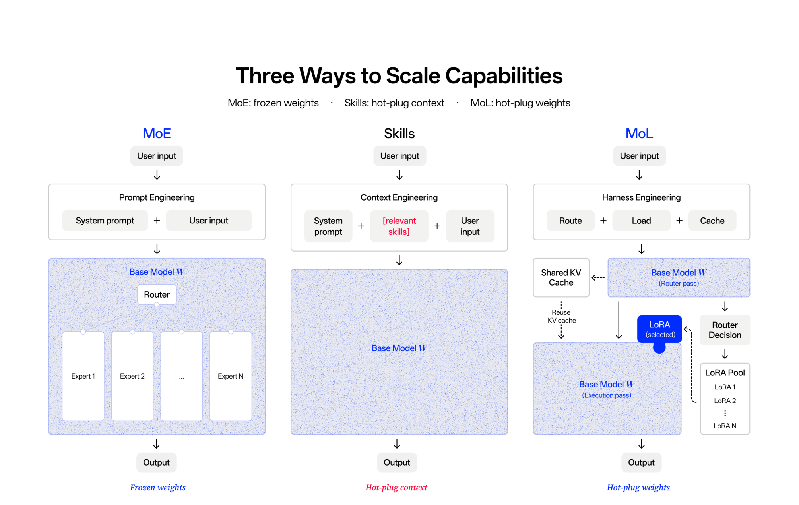
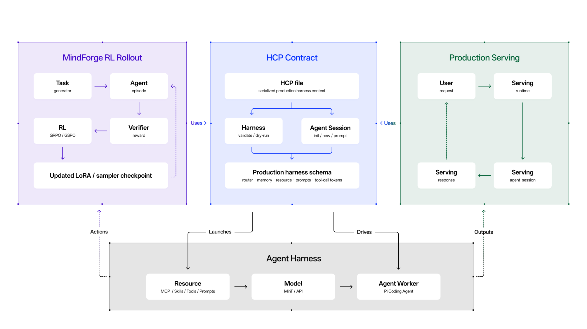
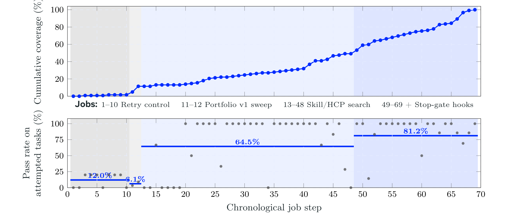

# Macaron-V1 技术报告

## 来源

- 原始 PDF：[raw/arxiv-2608.09819.pdf](../../raw/arxiv-2608.09819.pdf)
- 公开版本：[Macaron-V1: Towards Open Continual Learning with Self-Improvement and Mixture-of-LoRA](https://arxiv.org/abs/2608.09819)（arXiv:2608.09819v1，Mind Lab，2026-08-10，49 页）
- 模型页：[Macaron-V1](../models/macaron-v1.md)

## 核心结论

Macaron-V1 把目标定义为「experiential intelligence」：部署后的经验应能进入下一版 model–harness pair，而不是只在发布前把单一 checkpoint 优化到静态任务分布。其实现分为两条可分别版本化的线：**adaptation** 是在外部评测契约下，让一版 model–harness 对生成并审计经验，再构造后继版本；**collaboration** 是把不同能力保留为可插拔 specialist，而不把异质任务都压进同一组共享权重。

报告的架构载体是 Mixture-of-LoRA（MoL）：冻结大 base，在其上注册 LoRA specialist，并由 Proxy 在每个用户 turn 选择一个 specialist。它是「可持续学习 / collective intelligence 的实现底座」，不是已经证明了跨代累积增益的结果；作者明确说当前只测了四个自有 specialist，尚未测跨团队 adapter population、个性化 adapter 或连续多代的能力累积。

> 原文 Figure 2：MoE 扩展 base、skills 扩展固定模型周边的 scaffolding，而 MoL 在 frozen base 上经 Proxy-mediated routing 组合 specialist LoRA；图是实现路径示意，并非三者的受控比较。

## 架构与训练

### MoL：一个 turn 只选一个 LoRA，而非把 adapter 权重混合

Venti 以 744B GLM-5.2 base 加四个 specialist 发布：L0 Chat（也是 route entry）、L1 Agent、L2 Coding、L3 GenUI。公开 adapter header 的每个 LoRA 含 7,688,042,496 个 stored values；它是逻辑张量计数，不等于 active-per-token 参数或设备显存，所以报告把「748B」保留为 release-facing label。Tall 则建在 Qwen3.6-35B-A3B，四个 adapter 各 3,775,651,840 stored values，nominal base 加 adapter 约 50.1B。

路由不是另训分类器：L0 在 24-token 紧预算、受限 grammar 下输出唯一 L0–L3 标签；目标 adapter 生成回答后，再额外输出最多 192 token 的服务端 summary。每个 adapter 的 own-view 保留自己先前的完整 assistant/tool trace，把其他 adapter 的先前 turn 压成 summary；因此再次进入同一 adapter 时前缀字节一致，直接命中 engine 的 LoRA-aware prefix cache。报告在 6,448 条训练数据 trace 上测得路由 99.12%，但该 trace 不是独立 held-out split，只能视为实现诊断，不能估计泛化路由准确率。

MoL 的结构收益是把一份 nominal 744B base 而非四份 merged base 常驻：按 stored-value 口径，Venti 为约 774.8B 对 2.976T，即 26.0% / 少 74.0%。但这只说明权重常驻结构更省；报告没有用 matched deployment 证明它比四个 merged specialist 的 TTFT 或吞吐更优。

### 把 harness 当作可优化对象

报告将 action substrate、tools、prompts、skills、session/workspace resources 同模型一起看待。UI4A 让模型写普通前端代码，但由 runtime 约束 import、component/state 和四字段 Action（Origin / State / Execution / Visibility）；REPL harness 则让中间值停留在持久 Python namespace 内，`save_tool` 的 helper 必须先经私有验证才可 `promote_tool` 给后续会话复用。

Harness Context Protocol（HCP）是上述 runtime 的版本化 TOML 契约，记录 model/provider、工具 allowlist、MCP、hooks、prompt/skills、session 和 workspace 状态。HCP 本身没有梯度；可训练对象是配对的 LoRA 参数 $\phi$ 与配置 $c$：前者经 GRPO 更新，后者是可执行、可评测的语言空间配置搜索。

> 原文 Figure 6：MindForge 用与生产 serving 相同的 agent harness 跑 rollout；HCP 序列化 router、memory、resources、prompts 和 tool-call tokens，使训练与服务的 configuration 可比较。

### RSI：已验证的是 harness search，不是持续学习闭环

MindForge 将 `(problem bank, model, HCP)` 连到 evaluated trajectories，再连到 `(dataset, next model, next HCP)`，形成 Discovery → Expansion → Update 三阶段：Discovery 生成比当前模型更难但可评价的任务；Expansion 在固定 model–HCP 下执行、定位 model/task/harness 失败并重跑受影响 slice；Update 过滤有效轨迹训练 LoRA，同时登记通过的 HCP。

其最醒目的实验刻意**不更新权重**：从 frozen GLM-5.2 基础配置必失败的 122 个 TerminalBench 2.1 simulation task 出发，69 个适应式 HCP/skill/hook 搜索 job 后，至少找到一个配置让每题通过一次。两个单一 portfolio configuration 最多通过 11/122；后续阶段按尚未覆盖任务定向搜索，最终覆盖 122/122。这个结果表明「baseline 下失败」不等于 frozen base 缺能力，但由于测试集由失败样本筛出、搜索是 adaptive 且不同阶段的任务/错误率不同，不能解释成单一配置泛化，更不能当成 adapter 训练或跨代复利的证据。

> 原文 Figure 7：122 个来自 29 个 TerminalBench 2.1 source family 的 simulation task；job 11–12 的单配置全量 sweep 与后续针对未覆盖 family 的 adaptive search 不能作为同分布因果比较。

## 后训练

LoRA RL 的 policy 写为 $\pi_\phi(a_t \mid o_{\leq t}; \theta, c)$，其中 sparse base $\theta$ 冻结，adapter $\phi$ 可训练，harness configuration 为 $c$。LongStraw 对超长 prompt 先无 autograd 地捕获 prefix state，再逐条 response replay/backward，把 live graph 的上界从 prompt+全部 response 转为最长 response；本报告引用的是配套系统报告的固定硬件 execution receipt，而不是 Macaron-V1 的学习曲线。

对于 sparse base 的 rollout–learner mismatch，报告按模型路径选择三种控制：R3 复放可映射的 MoE expert id；DSA 实现对齐 rotary layout、归一化 Q/K、deterministic top-k、parallel layout 与 LoRA loading；不能精确重放 DSA index 时，用 IcePop-style ratio filter 丢掉不可信 token。它们是指定的 mismatch mitigation，并不证明 rollout 与 learner logits 完全相同，也没有本模型的受控 benchmark gain attribution。

## 评测要点

内部 Personal Intelligence 评测包括 46 条 Macaron ChatBench 对话和 40 条、最多 10 turn 的 Macaron LivingBench 情景；两者都含 LLM-mediated judging，且与 RSI 同源的产品 failure taxonomy / source domain 使它们更适合描述目标分布，不是独立的普适能力测验。UI4A-Bench 固定 runtime、161 个 case、双 viewport compile/render 与交互检查；其 headline Final Score 只取 mobile visual evaluation。

| 同协议行内结果（0–100，越高越好） | Macaron-V1-Venti | 可比性边界 |
| --- | ---: | --- |
| ChatBench | 58.3 | 目标 Personal Intelligence 分布；没有 interval / judge-sensitivity 分析 |
| LivingBench | 64.0 | 同上；对 Opus 4.8 的 0.2 分差不能读作已确立优越 |
| UI4A-Bench Final Score | 87.8 | 同一 161-case runtime 下可直接比较；高于表中 Opus 4.8 的 75.9 与 GPT-5.5 的 72.1 |
| TerminalBench 2.1 | 87.6 | 报告表中其余多为导入 leaderboard 值，不能做统一实验结论 |

外部 suite 还含 VitaBench / VitaBench2、$\tau^3$-Bench、PinchBench、ClawGym、SWE-Verified、DeepSWE 和 SWE Atlas QnA；每行指标、harness、retry 与部分 provenance 不同，报告也拒绝把它们平均成一个模型总排名。Tall 的 text-only adapter 在五个视觉 benchmark 上有混合变化（四项小升、MME perception 降 52.99），无重复方差与 adapter/routing ablation，不能声称保住了多模态能力。

## 待追问

- 多代 RSI 在固定外部 test 上是否有持续增益、保留率和 transfer，而非只显示一次 harness search 的 coverage？
- 不同团队/用户训练的 adapter 在同一 base 上组合时，兼容性、provenance、tool visibility 与隐私隔离如何验证？
- L0 路由在独立任务、multi-intent turn 与更开放 specialist registry 上的准确率、延迟和 failure recovery 如何？
- ChatBench / LivingBench 所用私有 judge 与产品数据的脱敏、同意、保留和 re-identification audit 何时公开？
- LongStraw、R3、DSA alignment 各自对真实 agent quality 与训练稳定性的独立贡献是什么？

## 相关页面

- 模型：[Macaron-V1](../models/macaron-v1.md)
- [Agentic engineering](../concepts/agentic-engineering.md)
- [Agentic 模型的后训练](../concepts/post-training-for-agentic-models.md)
- [Agentic 评测体系](../concepts/agentic-evaluation-benchmarks.md)
- [2026 前沿模型技术报告对比](../comparisons/2026-open-model-technical-reports.md)
- [Prime Agent 技术报告](prime-agent.md) - 同样冻结 L0、改 harness；Prime Agent 是轨迹内 Continual Harness，不是失败集上的 HCP 搜索
- [Agent harness](../concepts/agent-harness.md)
