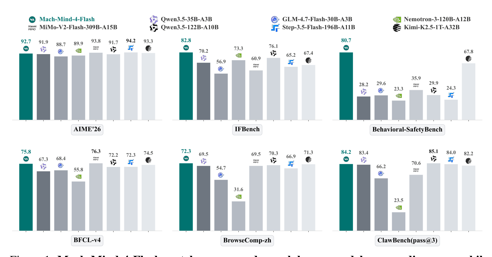
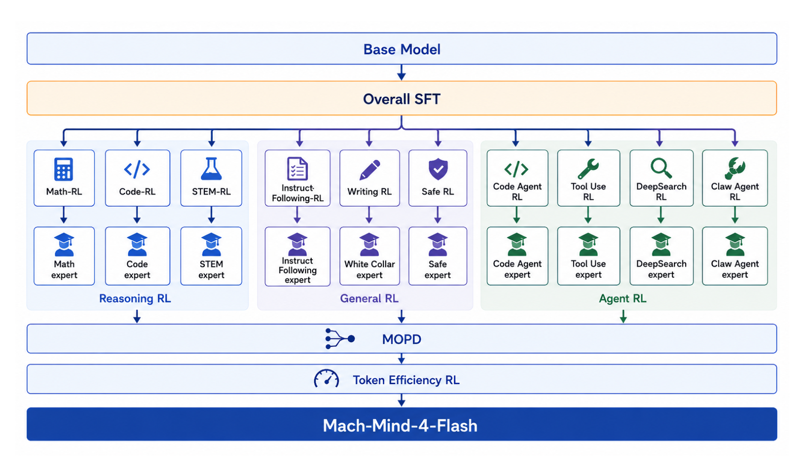
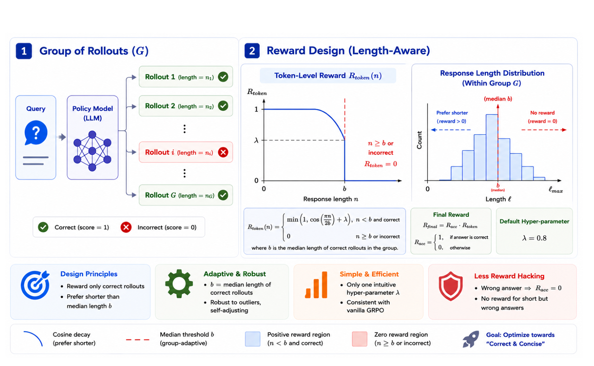

# Mach-Mind-4-Flash 技术报告

## 来源

- **PDF**：`raw/2607.09375v1.pdf`（arXiv:2607.09375v1，2026-07-10）
- **标题**：Mach-Mind-4-Flash Technical Report
- **团队**：Foundation Model Team, Li Auto Inc.（理想汽车）
- **模型**：[Mach-Mind-4-Flash](../models/mach-mind-4-flash.md)

## 核心结论

Mach-Mind-4-Flash 是一个 35B 总参数 / 3B 激活参数的 MoE agentic 模型，基座为 Qwen3.5-35B-A3B。报告的核心主张是**通过后训练优化（而非扩大预训练算力）将紧凑模型推到 100B 级前沿性能**。三根技术支柱：

1. **统一 RL/OPD 训练基础设施**：把 RL 和 On-Policy Distillation 深度集成到同一框架中，通过加权 loss `L = α·L_OPD + β·L_RL` 灵活切换纯 RL / 纯 OPD / 联合模式。动态多 teacher 架构支持"积木式"组合训练，新增 teacher 零侵入核心逻辑。SonicMoE indexed Grouped GEMM + segmented shared-expert fusion 带来 17% 端到端加速。

2. **Specialization-then-Integration**：不混合异构 reward 训一个模型（会出现 capability see-saw），而是并行训练三轨 RL 专家--Reasoning（Math/Code/STEM）、General（IF/Writing/Safety）、Agent（Tool-Use/DeepSearch/Code Agent/Claw Agent）--再用 [MOPD](../concepts/multi-teacher-on-policy-distillation.md) 融合成一个 generalist。每个专家用各自的数据合成、可验证 reward 和定制策略。

3. **HMPO（Hybrid Median-length Policy Optimization）**：单阶段 token 效率 RL 方法，从正确 rollout 的中位长度推导 group-adaptive budget，用乘法 reward 保证"correctness-first, length-second"防止 reward hacking。仅数学训练即把推理链压缩 19–46%，精度损失 ≤0.7pp，且跨域泛化到代码/科学/IF。

### 评测要点

> Figure 1（原文 p1）：Mach-Mind-4-Flash matches or exceeds much larger models across diverse capability axes. With only 3B activated parameters, Mach-Mind-4-Flash leads on IFBench, Behavioral-SafetyBench, and BrowseComp-zh, while remaining competitive on reasoning, tool use, and agentic coding against models with 3–30× its activated size.

核心 benchmark 数字（Table 2，§5.1，已据原文核实）：

| 能力轴 | Benchmark | Mach-Mind-4-Flash | 对比最强同规模（Qwen3.5-35B-A3B） | 对比万亿级（Kimi-K2.5-1T-A32B） |
| --- | --- | --- | --- | --- |
| 数学推理 | AIME'26 | **92.70** | 91.87 | 93.30 |
| 代码生成 | LiveCodeBench-V6 | 80.91 | 74.60 | 85.00 |
| 指令跟随 | IFBench | **82.82** | 70.20 | 67.43 |
| 安全 | Behavioral-SafetyBench | **80.74** | 28.23 | 67.75 |
| 工具调用 | BFCL-v4 | 75.80 | 67.30 | 74.50 |
| 深度搜索 | BrowseComp-zh | **72.31** | 69.50 | 71.28 |
| Agentic | ClawBench (pass@3) | 84.20 | 83.40 | 82.20 |
| SWE | SWE-bench Verified | 70.60 | 69.20 | 76.80 |

> Behavioral-SafetyBench 领先亚军 Kimi-K2.5 约 13 分，多数基线在 20–35 区间，说明 agent 行为安全是全行业未解难题。IFBench 领先说明模型对 held-out 约束有真实泛化，非过拟合已知模板。

## 架构与训练

### 基座模型

基座为 [Qwen3.5-35B-A3B](../models/qwen3.5.md)（ref [37]），报告未修改预训练权重，所有能力提升来自后训练。

### 后训练流水线

> Figure 4（原文 §4，p8）：The post-training pipeline of Mach-Mind-4-Flash. The process starts from a base model, followed by overall SFT, domain-specific expert RL training across three parallel tracks, Multi-Teacher On-Policy Distillation (MOPD) for model fusion, and a final token efficiency optimization stage.

流水线分五步：

1. **SFT**（§4.1）：7 域数据（General 33.8% / Code 23.1% / Math 13.5% / STEM 14.3% / Tool-use 10.3% / CodeAgent 2.8% / SearchAgent 2.2%），global batch 32，lr 1e-5 cosine decay，max seq 131K，2 epochs。agentic 轨迹用 error masking（保留错误段作上下文但 mask loss），sample packing 提升吞吐。

2. **三轨并行 RL**（§4.2–4.7）：共享 GRPO 框架但数据/reward 分域定制：
   - **Reasoning RL**（§4.2）：可验证正确性（数学唯一解 / 代码测试 / STEM 确定答案）。Two-Stage Reward Curriculum 解决 sparse outcome 下的 zero-reward trap：Stage 1 dense process reward 做 cold start，过阈值后切 Stage 2 strict outcome reward。Difficulty-based Pruning 用 SFT model 8 次推理过滤太难/太易。
   - **Safety RL**（§4.3）：content safety（taxonomy + RM）+ behavioral safety（工具调用安全性、授权、可逆性），pairwise contrastive 训练。
   - **Tool-Use RL**（§4.4）：**EnvScaling** 策略--不扩展静态 tool-call trace，而是扩展环境（190+ stateful domain / 3.5K tool interface）。三类环境：file-system execution、programmatically verifiable（Python 模拟）、model-simulated。trajectory-level reward，asymmetric clipping `ε_low=0.20, ε_high=0.28`，K=8，T_max=40 turn，action-token masking。
   - **DeepSearch RL**（§4.5）：两路多跳 QA 合成（Wikipedia DAG + ReAct web 探索），在线 RL + GRPO + ORM。四机制 context 管理：sliding-window observation filter、progress summary restart、dynamic adaptive threshold、answer self-check。
   - **Code Agent RL**（§4.6）：repo 级 SWE，跨 scaffold（OpenHands/SWE-Agent）轨迹构造，XML 工具格式（非 JSON），error masking（rule-based + LLM 混合），Slime 异步 RL infra + TIS + Dynamic Sampling + prompt-level loss。
   - **Claw Agent RL**（§4.7）：sandbox 环境自主 agent，E2B 协议，stateful agent loop（PENDING→GENERATING→PROCESSING_TOOLS→TERMINATED），token-level credit assignment 按结构角色（action/tool/reasoning/answer）reweight gradient。

3. **MOPD 融合**（§4.8）：详见下文 [MOPD 段](#mopd-融合)。

4. **HMPO token 效率**（§4.9）：详见下文 [HMPO 段](#hmpo-token-效率)。

### MOPD 融合

MOPD（§4.8）把 10+ 个三轨专家融合进一个 generalist。核心设计：

- **路由 reverse-KL**：每个 sample 带 `teacher_route` 标识，路由到对应领域 frozen teacher。student 从自己的 on-policy 分布采样，用 token-level reverse-KL 监督（公式 3）。
- **k1 estimator + clipped surrogate**：用 Schulman k1 单样本估计 reverse-KL（只需 teacher 和 student 各一个 log-prob 标量），再套 PPO clipped surrogate 修正异步 rollout-to-training 的 off-policy drift（Appendix B 公式 5–9，`ε=0.2`）。同步时（θ=θ_old）退化为纯 on-policy MOPD gradient。
- **监控量 L_abs**：k1 是有符号估计，running average 可能在 token-level gap 大时仍接近零；额外 log 一个 magnitude-preserving diagnostic `L_abs`（公式 6，不 backprop）。
- **Early Stopping Rollout**：max_response_length 截到 8K token（即使长 math/code/search），缩短 rollout step、降 vLLM KV-cache 压力。
- **Teacher-student 参数量匹配**：匹配 teacher 与 student 参数量比用大 teacher 有更高 top-K overlap rate（引 Li et al. [61]）。

MOPD 融合效果（Table 3，§5.2，已据原文核实）：

| RL Track | Benchmark | SFT Base | Expert Teacher | MOPD Final | 融合结果 |
| --- | --- | --- | --- | --- | --- |
| Reasoning | LiveCodeBench-V6 | 79.39 | 80.23 | 80.12 | 锚定（防退化） |
| General | IFBench | 72.79 | 82.65 | 82.92 | 完全保留 |
| General | IFEval | 92.42 | 94.64 | 94.84 | 微超专家 |
| Agent | SWE-bench Verified | 69.00 | 73.80 | 71.10 | 部分保留（−2.7） |
| Agent | ClawBench (pass@3) | 80.70 | 80.30 | 83.20 | 超越专家（跨域迁移） |
| Agent | ClawEval | 61.82 | 67.23 | 70.35 | 超越专家（跨域迁移） |

三种融合模式：(1) Reasoning 的 **capability anchoring**（专家防止融合退化）；(2) General 的 **full retention**；(3) Agent 的 **mixed**（SWE 部分保留 + OpenClaw 正向跨域迁移）。

Appendix C 的消融发现一个重要跨域迁移效应：在 tool-use + IF + safety 三 teacher 基础上加 code teacher，AIME'25 +2.30、AIME'26 +0.83，**没有加数学 teacher 却提升了数学**--code supervision 的跨域迁移是真实的，但不可依赖，每个想保留的能力都应至少有一个 teacher 代表。

### HMPO token 效率

> Figure 13（原文 §4.9, p19）：Overview of HMPO. Left: For each query, the policy samples a group of rollouts (G). Right: Instead of relying on a static threshold, HMPO dynamically derives an adaptive budget b from the median length of only the correct rollouts to construct a smooth cosine-decay token reward. Bottom: The final reward is combined multiplicatively to enforce a strict "correctness-first, length-second" objective, mathematically preventing reward hacking.

HMPO（§4.9，引 [66]）在 GRPO 上只改 reward 设计，三组件：

1. **Adaptive median budget**：`b = median({n_i | i ∈ C})`（C = 正确 rollout 集合）。难度自适应（难题正确 rollout 更长→更松的 b），随 policy 改善自动收紧（零调参隐式 curriculum）。
2. **Cosine-decay token reward**：`R_token = min(1, cos(πn/2b) + λ)` if correct and n < b, else 0（公式 4）。短正确给高分，接近 b 平滑着陆，超 b 或错误归零。
3. **Multiplicative composition**：`R_final = R_acc · R_token`。错误或超 budget 严格零 reward，效率梯度不给错答案--additive 组合仍会给 verbose-but-correct 轨迹分。

训练仅用 ~6.5K 数学题（G=10, λ=0.8），但压缩行为泛化到 code/science/IF。单阶段，GPU-hour 仅为多阶段 baseline 的 1/1.5–1/2.5。

## 后训练基础设施

### 统一 RL/OPD 训练范式（§3.1）

- 加权 loss `L = α·L_OPD + β·L_RL`（公式 1），三模式切换：纯 RL（α=0）、纯 OPD（β=0）、联合（α>0, β>0）。
- OPD loss 支持 MSE / Forward_kl_TopK 等多种形式。
- 继承 RL 框架的分布式调度、异步 reward routing（20+ task 并行 reward 计算）、online sampling 闭环。

### 动态多 teacher 架构（§3.2）

- Teacher 注册为配置树节点，Rollout 后按 routing identifier 异步分发到 teacher 实例。
- Ray cluster 做 transparent multi-node 资源调度，TP/replica 自动绑定。
- 新增 teacher = 请求节点 + 配置注册，零侵入核心逻辑。

### 训练加速（§3.3）

- **SonicMoE**：Hopper GPU 上用 TMA copy engine + Warp specialization + multi-stage producer-consumer pipeline 实现 Indexed Grouped GEMM，消除 token permutation。backward 用 local recomputation，通信用 DeepEP 替代 All-to-All。
- **Segmented shared-expert fusion**：multi-stream 把 shared expert 拆成 AllGather→Compute→ReduceScatter 三段，与 standard expert 的 Dispatch→Compute→Combine 交错重叠。TP+EP+ETP 同时开启时强制 shared expert TP=1。
- **MTP 加速**：Megatron-Core native MTP module + vLLM sampling phase speculative decoding。
- 加速效果（Appendix A, Figure 15）：tp=8/ep=8 时 +2%，tp=4/ep=8 时 +2%，tp=8/ep=4 时 **+17%**（通信占比越低加速越显著）。

## 待追问

- 统一 RL/OPD loss 中 `α`/`β` 的调度策略是什么？联合模式（α>0, β>0）下两条路径的梯度是否会互相干扰？
- EnvScaling 的 190+ stateful domain 覆盖哪些领域？model-simulated environment 的 LLM/world-model simulator 如何保证 reward 可靠性？
- Claw Agent 的 token-level credit assignment 按"结构角色"reweight，具体权重如何设定？与 [ARPO](../concepts/agentic-reinforced-policy-optimization.md) 的 entropy-based step-level credit assignment 是什么关系？
- HMPO 的跨域泛化机制是"学到了通用 conciseness policy"还是"math-specific shortcut 恰好在 code/IF 上也有效"？是否有失败域？
- MOPD 融合中 SWE-bench 保留率最低（−2.7pp），报告归因于"scaffold-specific behaviors 被蒸馏平滑"--是否有具体的 scaffold 行为被损失的案例分析？

## 相关页面

- [Mach-Mind-4-Flash 模型页](../models/mach-mind-4-flash.md)
- [Multi-Teacher On-Policy Distillation](../concepts/multi-teacher-on-policy-distillation.md)：MOPD 机制详解，Mach-Mind 是又一个大规模 MOPD 实例。
- [On-Policy Distillation 跨报告对比](../comparisons/on-policy-distillation.md)：Mach-Mind 加入 MOPD 融合派对比表。
- [Agentic 模型的后训练](../concepts/post-training-for-agentic-models.md)：specialization-then-integration 范式总览。
- [MoE 前沿模型扩展](../concepts/moe-frontier-model-scaling.md)：35B/3B 在已收录模型中的位置。
- [Qwen3.5](../models/qwen3.5.md)：基座模型。
