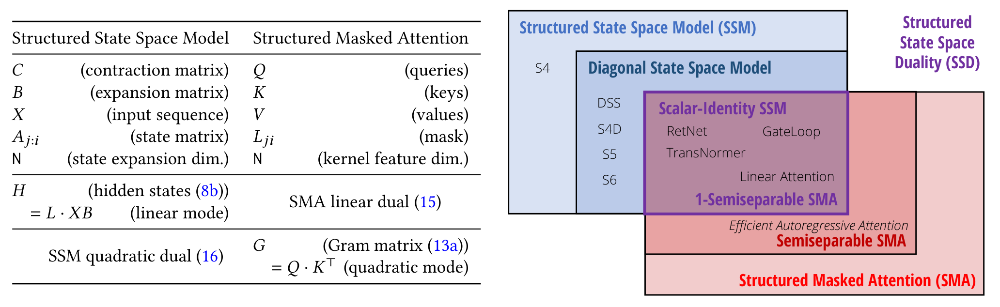
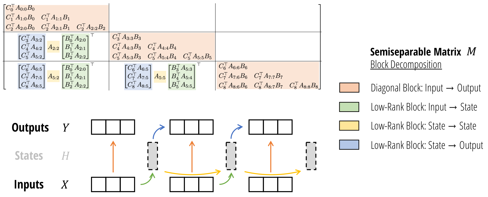
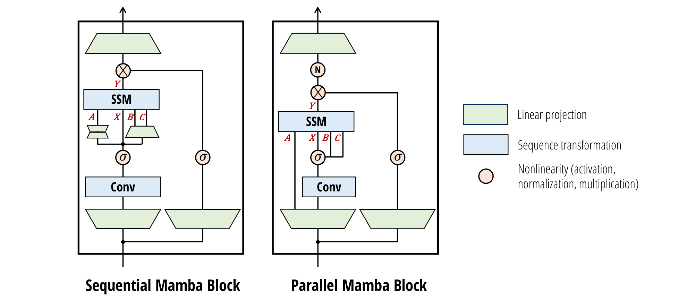
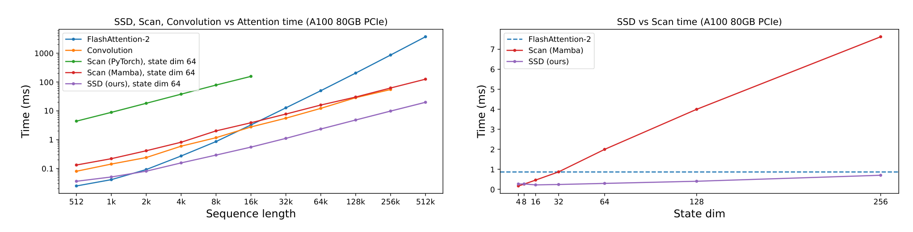

# Mamba-2

## 来源

- 文件：`raw/2405.21060v1.pdf`
- 标题：Transformers are SSMs: Generalized Models and Efficient Algorithms Through Structured State Space Duality
- 团队 / 日期：Tri Dao（Princeton）、Albert Gu（CMU）；arXiv:2405.21060v1，2024-05-31；ICML 2024
- 代码与检查点：[state-spaces/mamba](https://github.com/state-spaces/mamba)（摘要）
- 定位：**方法论文**。提出 Structured State Space Duality（SSD）框架，并把 Mamba 的 selective SSM 收成 SSD 层，得到 Mamba-2 架构。不发布命名产品基座。机制归属 [线性注意力与 delta rule](../concepts/linear-attention-and-delta-rule.md)：它是**结构化状态空间 / 标量恒等选择性 SSM**，对偶于带数据相关衰减掩码的线性注意力，**不是** GDN/KDA 的 delta rule。

**不建模型页。** 实验载体是 Pile 上 130M–2.7B 的研究检查点；生产采用见 [Nemotron 3 Ultra](nemotron-3-ultra.md) 的 hybrid Mamba-2 + GQA。

## 核心结论

1. **SSM 就是半可分矩阵。** 把递推展开成 $Y=MX$，下三角块的秩至多是状态维 $N$（§3，Definition 3.1）。算 SSM 等于在这种结构化矩阵上做乘法。
2. **SSD = 标量恒等 SSM 与 1-semiseparable SMA 的对偶**（§5）。$A_t=a_t I$ 时，二次形式就是 $(L\circ QK^\top)V$，掩码 $L$ 是数据相关的 1-半可分矩阵。这是 Katharopoulos 线性注意力把 cumsum 换成标量 SSM scan 的推广，仍**没有** $(I-\beta kk^\top)$。
3. **SSD 算法用半可分矩阵的块分解**（§6、Theorem 6.1）：对角块走二次注意力（吃满 matmul），非对角块按低秩因式走短扫描。相对 Mamba 的 fused scan **2–8×**，序列 2K 起快于 FlashAttention-2；状态维加大几乎不掉速（Figure 10）。
4. **Mamba-2 = 并行 Mamba block + SSD 层**（§7）。$A,X,B,C$ 在块头一次投影；多输入 SSM / multi-value attention 头结构（$B,C$ 跨 $X$ 头共享）。Pile 上 Chinchilla 缩放 Pareto 压过 Mamba 与 Transformer++；2.7B / 300B 平均分 60.2，高于同数据的 Pythia-6.9B（Table 1 / Table 10）。

> Figure 4（原文截图，§5.3）："State space duality describes the close relationship between state space models and masked attention. (Left) General SSMs and SMA both possess linear and quadratic forms, with direct analogs in notation. (Right) SSMs and SMA intersect at a large class of state space dual models (SSD) which capture many sequence models as special cases."

## 机制（已据原文核实）

离散选择性 SSM（Eq. 2）：

$$
h_t = A_t h_{t-1} + B_t x_t,\qquad y_t = C_t^\top h_t.
$$

展开成矩阵（Eq. 3）$M_{ji}=C_j^\top A_j\cdots A_{i+1}B_i$。Mamba-1 的 S6 让 $A_t$ 保持对角；**Mamba-2 再收成标量×单位阵** $A_t=a_t I$，$a_t\in[0,1]$ 由输入决定（§2.4、§5.1）。于是

$$
M = L\circ(CB^\top),\qquad L_{ij}=\begin{cases}a_i\times\cdots\times a_{j+1}&i\ge j\\0&i<j\end{cases}.
$$

二次对偶就是带这个 $L$ 的 masked kernel attention（Eq. 16）。用 GDN 后来的矩阵状态记号，同一规则是 $S_t=\alpha_t S_{t-1}+v_t k_t^\top$——**整块按 $\alpha_t$ 衰减再外积写入**，没有按 key 定向擦旧。

相对 Mamba-1 的另外一处收缩：头维 $P$ 从 1 提到 64/128，和 Transformer 头宽同一量级（§2.4）。作者写明这是用一点表达力换硬件效率（matmul 单元）。

> Figure 5（原文截图，§6）："By using the matrix transformation viewpoint of state space models to write them as semiseparable matrices (Section 3), we develop a more hardware-efficient computation of the SSD model through a block-decomposition matrix multiplication algorithm. … Diagonal blocks represent intra-chunk computations and the off-diagonal blocks represent inter-chunk computations, factored through the SSM's hidden state."

当 $N=P=Q$ 时，训练 FLOPs $O(TN^2)$、推理 $O(N^2)$ 状态、$O(TN)$ 显存，工作量以 $(N,N)$ matmul 为主（Theorem 6.1）。块间只剩长度 $T/Q$ 的标量 scan，相对 Mamba 全长 scan 便宜 $Q$ 倍。

Listing 1 给出原生 PyTorch 实现（`segsum` 造 1-SS 掩码 + 四步 einsum）。这是算法，不是另一条状态方程。

## 架构与训练

> Figure 6（原文截图，§7）："The Mamba-2 block simplifies the Mamba block by removing sequential linear projections; the SSM parameters $A$, $B$, $C$ are produced at the beginning of the block instead of as a function of the SSM input $X$. An additional normalization layer is added as in NormFormer … The $B$ and $C$ projections only have a single head shared across the $X$ heads, analogous to multi-value attention (MVA)."

块级改动（§7.1，Table 4 消融）：

| 项 | Mamba-1 | Mamba-2 |
| --- | --- | --- |
| $A,B,C$ 投影 | 从 SSM 输入 $X$ 再投影（串行） | 与 $X$ 在块头并行投影 |
| 输出前 Norm | 无 | 门之后、输出投影之前（NormFormer；作者说大模型稳定性） |
| 头结构 | $P=1$ 的 multi-input SSM | 同为 MIS/MVA，但 $P\in\{64,128\}$ |
| 内层 | S6（对角 $A$） | SSD（标量恒等 $A$） |

Proposition 7.2：Mamba 的 S6 就是 $P=1$ 的 multi-value attention——$B,C$（对偶里的 $K,Q$）跨所有 $X$ 通道共享。Table 5 在参数与总状态 $HPN$ 对齐时，MVA 明显好于 MQA/MKA（125M：ppl 11.66 vs 12.62 / 12.59）。默认核映射 $\psi$ 是 Swish；softmax 核近似（Performer / cosFormer / Based）没有稳定增益（Table 6–7）。

系统（§8）：并行投影把每块 all-reduce 从两次减到一次，才能做 Megatron 式 TP；序列并行只需把 chunk 末状态传给下一卡；变长则把 $A_t=0$ 打在序列边界，不必 padding。

训练（附录 D）：Pile、Chinchilla token、AdamW；下游 300B、GPT-NeoX tokenizer，学习率 5× GPT-3。无后训练。

## 评测要点

**MQAR**（Figure 8，更难设定：随机填充、更多 KV 对、更小模型）：Mamba-1（$N=16$）几乎做不成；Mamba-2 同 $N=16$ 已明显更好，$N=64/256$ 在 256/512/1024 长度上达到或超过 softmax attention。作者把增益同时归到更大状态和架构，未拆开。

**缩放**（Figure 9，~125M–1.3B @ 8192）：Mamba-2 在 perplexity / FLOPs / 墙钟上 Pareto 压过 Mamba 与 Transformer++。

**零样本**（Table 1 节选，Pile 300B）：

| 模型 | Pile ppl ↓ | LAMBADA acc | HellaSwag | 平均 acc |
| --- | --- | --- | --- | --- |
| Pythia-2.8B | 6.73 | 64.7 | 59.3 | 55.7 |
| Mamba-2.8B | 6.22 | 69.2 | 66.1 | 59.9 |
| **Mamba-2-2.7B** | **6.09** | **69.7** | **66.6** | **60.2** |
| Pythia-6.9B | 6.51 | 67.1 | 64.0 | 58.3 |

同尺寸 Mamba-2 略高于 Mamba；2.7B 平均分高于同数据的 Pythia-6.9B。这是 Pile / 零样本常识榜，不是 2026 的 agentic 榜。

**混合**（§9.2.3）：纯 SSD 与 Transformer++ 的 ppl 几乎打平；插约 **10%** attention 最好。350M / 48 层：0 层 attention 8.60，6 层 8.26，24 层 8.50，纯 Transformer++ 8.68（Table 2）。2.7B / 300B：Mamba-2-Attention（58 SSD + 6 attention）Pile 5.95、平均 61.0，高于纯 Mamba-2 的 6.09 / 60.2 和 Transformer++ 的 6.13 / 60.2（Table 3）。作者猜想 SSM 做通用地图、attention 做检索，免得把上下文全压进有限状态。

> Figure 10（原文截图，§9.3）："(Left) Our SSD is 2−8× faster than a Mamba fused scan for large state expansion ($N=64$) and faster than FlashAttention-2 for sequence length 2k and above. (Right) Sequence length 4K: Increasing state expansion slows down the Mamba optimized scan implementation linearly. SSD can handle much larger state expansion factors without much slowdown."

作者也写：短序列上**整网**未必快过 Transformer——同参数 Transformer 有一半 MLP，Mamba-2 默认是 $L$ 层 SSD；可改成 SSD+MLP 交错换短序列吞吐（§9.3）。

## 待追问

- 对角 $A_t$（Mamba-1 S6）的 SSD 算法作者只给了猜想（§10.1），本页未核后续是否做成。
- MQAR 的增益有多少来自 $N$、多少来自并行 block / MVA，原文未拆。
- 与 [Gated DeltaNet](gated-delta-net.md) 的同协议对照在 GDN 原文，不在本 PDF。
- Nemotron 3 Ultra 的 Mamba-2 层是否逐项等同本页默认（$P$、分组、$A$ 参数化、Norm 位置），见该报告，不能从本页外推。

## 相关页面

- 概念：[线性注意力与 delta rule](../concepts/linear-attention-and-delta-rule.md)、[高效长上下文注意力](../concepts/efficient-long-context-attention.md)
- 同属「固定状态、非 delta rule」：[Lightning Attention-2](lightning-attention-2.md)（标量衰减线性注意力 tiling）、[Gated Linear Attention](gated-linear-attention.md)（channel-wise 门，无 delta）、[RWKV](rwkv.md)（channel-wise 1D WKV）
- 后作（在本页的门上加 delta rule）：[Gated DeltaNet](gated-delta-net.md)
- 生产 hybrid 采用：[Nemotron 3 Ultra](nemotron-3-ultra.md)（Mamba-2 + GQA + LatentMoE）；[Qwen3-Next 官方博客](qwen3-next-blog.md)（选 GDN 而非 Mamba-2）
