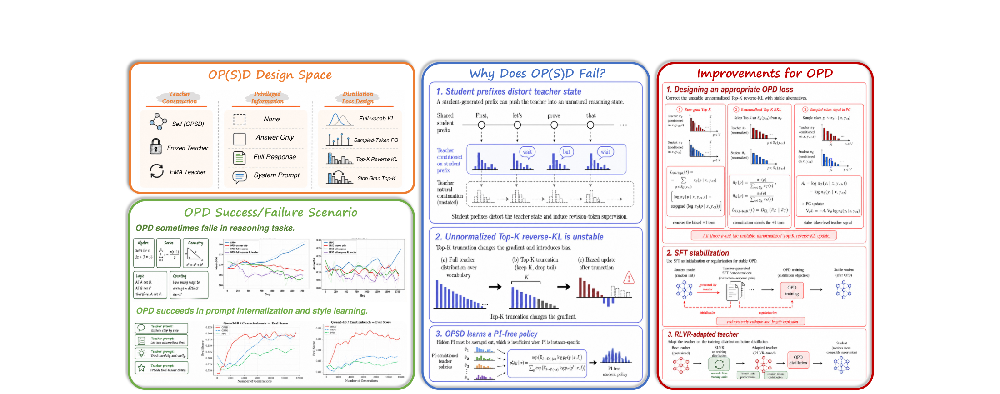
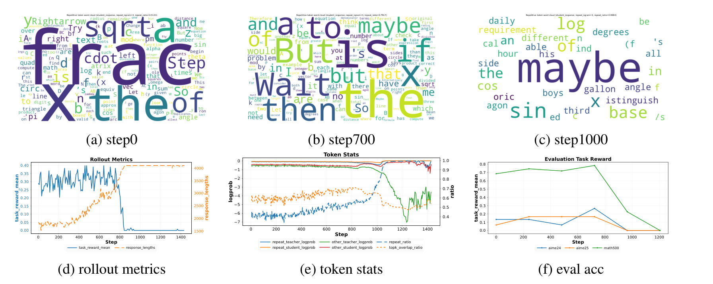
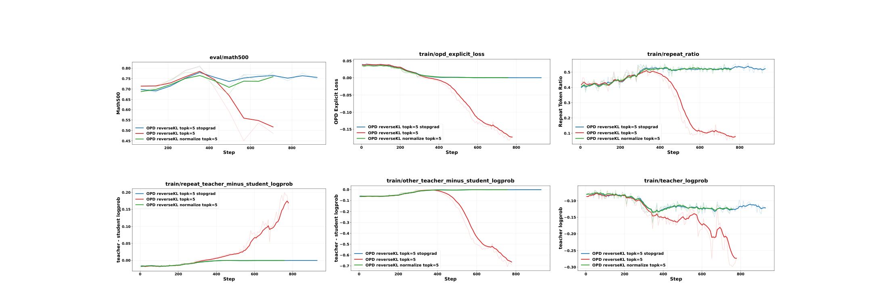
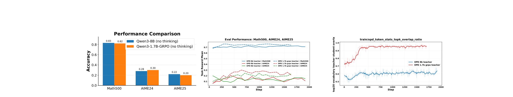
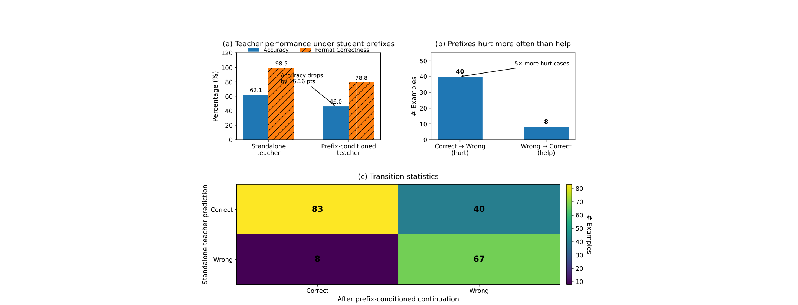

# The Many Faces of On-Policy Distillation

## 来源

- 原始 PDF：[`raw/2605.11182v2.pdf`](../../raw/2605.11182v2.pdf)
- 标题：The Many Faces of On-Policy Distillation: Pitfalls, Mechanisms, and Fixes
- 版本 / 日期：arXiv:2605.11182v2，2026-05-24（v1 2026-05-11）。页眉为 Preprint
- 作者：Siqi Zhu、Ge Liu（UIUC）；Xuyan Ye、Hongyu Lu（人大，实习于 UIUC）；Weiye Shi（北大，实习于 UIUC）。Ye、Lu、Shi 为共同第二作者
- 代码：PDF 未给仓库
- 模型链接：**未建模型页**——不发布新模型。实验是 Qwen3-1.7B / 4B / 8B / 14B 的后训练

## 为什么这篇在 wiki 里独占一席

它把 OPD 和 OPSD 放进同一张设计图，并给出三条失败机制，而不是再报一个新模型。和刚收的 [Revisiting OPD](revisiting-opd.md) 直接相关：那篇把 teacher top-K **重归一化** reverse KL 当成稳定配方；这篇先证明**不重归一化**的 Top-K reverse KL 梯度里有一项消不掉的 \(+1\)，重归一化能消掉它，但也不再逼近全词表 reverse KL。两篇不是同一套实验。

对 [OPSD](opsd.md) 的校准是：Zhao 等人的主实验是 full-vocab forward KL，数学上能涨。本文用 stop-gradient Top-20 reverse KL，在数学上没稳住。作者把差别归到特权信息是不是「每题一份」，而不是宣布 OPSD 普遍失败。

## 核心结论

1. **未归一化的 Top-K reverse KL 改了更新规则**（`§5.1`，公式 6–9）。全词表上 \(\sum_v p_\theta(v)\nabla\log p_\theta(v)=0\)，梯度里的 \(+1\) 消失。截到集合 \(S_K\) 之后这个和等于 \(\nabla\sum_{v\in S_K}\pi_S(v)\)，一般不是 0。梯度下降只在 \(\pi_T(v)>e\,\pi_S(v)\) 时抬升该 token。Teacher 只是略偏好的 token 仍被压下去，学生被推向不稳定的低概率续写。
2. **Stop-gradient 和重归一化都能拿掉这个 \(+1\)，但不是同一个目标**（`§6.1`）。Stop-gradient（公式 12）把 \(\log\pi_S\) 当 advantage，不再是 reverse KL 的精确梯度。重归一化（公式 15）在 \(S_K\) 内做成真正的分布，\( +1 \) 消掉，但只匹配集合内部的相对概率，丢掉集合上的概率质量，因此不再忠实逼近全词表 reverse KL。把采样 token 的 log-ratio 放进 policy gradient（公式 4）同样避开这个问题，代价是只看见一个 token。
3. **OPSD 的最优学生是各 PI 条件下 teacher 的归一化几何平均**（公式 10–11），一个看不到 \(I\) 的共识策略。PI 若是每题不同的答案或完整解答，这些 teacher 互不相容，共识比任何一个都弱。PI 若是所有题共享的系统提示或对齐偏好，共识可以变成可复用的行为。这是 reverse KL 目标的闭式，不要套到 OPSD 原文的 forward KL 上。
4. **学生前缀会把 teacher 带离它自己的解题状态。** GPQA-Diamond 198 题、temperature 0：Qwen3-14B 单独做对 123 题（62.12%），从 Qwen3-1.7B 的随机截断前缀续写只对 91 题（45.96%）。原本做对再做错 40 题，做错改对只有 8 题。格式正确率 98.48% → 78.79%（附录 A.22）。

> Figure 1. Overview. We map the OP(S)D design space … identify three failure mechanisms—prefix-distorted teacher state, biased Top-K reverse-KL, and PI-marginalized OPSD policy … and propose practical fixes.（`§1`）

## 方法

公式 1 在学生自己的轨迹上，对每个前缀算 \(\ell_t(\pi_\theta,\mathrm{stopgrad}(\pi_T))\)，再按长度平均。OPD 的 \(\pi_T\) 是外部更强模型，PI 可选。OPSD 的 \(\pi_T\) 是同一模型加上特权信息 \(I\)。默认训练（Table 1，除非另作说明）是 **stop-gradient 且重归一化** 的 Top-K reverse KL，\(K=20\)，每题 1 条 rollout，最长回复 4096，temperature 1.0，top-p 0.95，学习率 \(2\times 10^{-6}\)，cosine，warmup 0.1。评测最长 16384。OPSD 默认关掉 thinking，teacher 冻在 step-0。GRPO 的 KL 系数是 0，每题 8 条，最长 8192。机器是 10 张 RTX PRO 6000 Blackwell。

作者把 forward KL 写成 mode-covering、会把学生推向自己本来概率很低的 teacher token，所以 OPD 里不想用。这是他们的动机，不是对离散词表的新定理。全词表 reverse KL 的梯度在公式 3，常数 \(+1\) 在全词表上贡献为 0。

支撑集的工程约束：理想情况是每个位置用学生自己的 Top-K 去问 teacher。SGLang 做不到逐位置查询，只能把一条回复所有位置的 Top-K 并成一个全局集合 \(U\)，查询从 \(T\times K\) 胀成 \(T\times|U|\)（附录 A.6）。他们的简化是只对 teacher Top-K 与 student Top-K 的交集反传（公式 17）。这和 [Keye-VL-2.0](keye-vl-2.md) 的 top-k overlap 是同一个集合，但 Keye 用它决定采样 token 的 advantage 算不算；这里用它当 KL 求和的支撑，原因是推理引擎。他们引 Li et al.（*Rethinking OPD*）说交集和 student Top-K 效果接近。

## 评测要点

### 数学上 OPSD 没稳住，未归一化 OPD 会崩

Qwen3-1.7B、OpenThoughts、只留有 `\boxed{}` 的英文题，目标是 stop-gradient Top-20 reverse KL。答案 PI 和完整解答 PI 都没有在 Math500、AIME24、AIME25 上稳住；完整解答更差。再把看了完整解答的 1.7B 用 GRPO 训成 teacher，曲线更差（Figure 3）。作者的读法是：PI 本身不能让数学 OPSD 生效。

同一数据上，Qwen3-1.7B 学生、Qwen3-8B teacher、两边都关 thinking，**未归一化** Top-20 reverse KL 先涨后崩（Figure 4）。约 700 step 回复变长，`wait` / `maybe` 变多；1000 step 退化成重复的 “maybe”，三项准确率接近 0。图上的 3-gram 重复率从 step 0 的 0.5133 到 step 700 的 0.7917，再到 step 1000 的 0.9984。

> Figure 4. Collapse under unnormalized Top-20 reverse KL. The model first becomes verbose, then degenerates into repetitive “maybe” outputs …（`§4.1`）

\(K=5\)、teacher 换成同尺寸的 Qwen3-1.7B-GRPO、数据换成 DAPO 时（Figure 11）：未归一化 reverse KL 崩掉；stop-gradient 和重归一化都稳住，作者称两者表现接近。\(K=1\) 时，把 log-ratio 写成普通 loss 仍会崩，放进 policy gradient 则和 stop-gradient Top-1 一样稳（Figure 12）。把 \(K\) 从 5 加到 20 消不掉未归一化版本的崩溃（Figure 15）。

> Figure 11. Teacher: Qwen3-1.7B-GRPO (nothink), Student: Qwen3-1.7B (nothink), DAPO, TopK=5.（`§6.1`）

### 特权信息的结构

外部 8B teacher 蒸 1.7B 时，给 teacher 答案或完整解答都不如不加 PI 的 vanilla OPD；完整解答的起始 KL 最大（Figure 10）。作者把它读成 PI 加大了错配，不是更强的信号。

共享规则的两处则能工作，但都没有打成表格里的最终分，曲线是定性的。CharacterBench 和 EmotionBench 上，Qwen3-4B 的 OPSD 在同样采样预算下比 GRPO 和 PPO 升得快（Figure 5）。推理压缩用固定系统提示：Qwen3-8B、thinking 开、DAPO-Math-17k，OPSD 不伤 MATH-500 pass@1，同时把回复压短，比带长度惩罚的 GRPO 更省样本；作者写这需要大约 8B 的容量（Figure 6）。安全对齐用 WildGuardMix、Qwen3-1.7B、关 thinking：OPSD 早期快，随后被 teacher 卡住；GRPO 更慢，但在 OPSD 饱和后还在涨（Figure 7）。

### 同尺寸 RL teacher 比更大的通用 teacher 好用

先把 Qwen3-1.7B 在 DAPO 上训 200 step，得到 Qwen3-1.7B-GRPO。Figure 13 左图里它和关 thinking 的 Qwen3-8B 分数接近：Math500 / AIME24 / AIME25 为 0.82 / 0.30 / 0.20，对 8B 的 0.83 / 0.28 / 0.22。再把两者分别蒸回 Qwen3-1.7B、数据是 OpenThoughts。论文写：尽管 benchmark 接近，1.7B-GRPO 是更有效的 teacher，Top-20 词表和学生对齐更高。Teacher 的榜单分数预测不了 OPD 好不好。

> Figure 13. … Qwen3-8B and Qwen3-1.7B-GRPO have similar math reasoning performance. … Qwen3-1.7B-GRPO is a more effective teacher. … Top20 vocabulary distribution is more aligned with the Qwen3-1.7B student.（`§6.2`）

### 学生前缀与 SFT 热身

> Appendix A.22. … The standalone teacher solves 123 out of 198 examples, achieving 62.12% accuracy, whereas the prefix-conditioned teacher solves only 91 examples, dropping to 45.96%. … 40 originally correct teacher predictions become wrong … only 8 originally wrong predictions become correct.

Figure 8 把局部冲突画成：学生前缀已经走上一条分支时，teacher 把高概率给 `wait`、`but` 这种改道 token，而不是把这条分支写完。

Qwen3-4B 蒸 Qwen3-1.7B-Base 时，base 会吐出不成句的非英文串，teacher 信号没有着落。先在 teacher 轨迹上 SFT，再 OPD，长度稳住、准确率才上去（Figure 14）。Table 3：这些轨迹在学生下的平均 NLL 从 0.640 降到 0.335，PPL 从 1.896 降到 1.397。SFT 用前 3 万条 OpenThoughts 出演示，后面的题才进 OPD，两边不重叠。

科学子集上的 OPD（Mixture of Thoughts → GPQA-Diamond / MMLU-Pro）没有稳定超过学生（Figure 19）。作者把它和「监督在错误轨迹上更强、在正确轨迹上更弱」（Figure 17）放在一起，当作评测 OPD 时容易看错的两种偏差，不是主结论的数值表。

## 与现有 wiki 页的关系

- **[Revisiting OPD](revisiting-opd.md)**：主方法就是 teacher top-K 重归一化 reverse KL，并在 Qwen2.5-7B 上相对 sampled-token 抬了数学均分。本文公式 16 说明重归一化为什么能消掉 \(+1\)，公式 15 后面的句子说明它丢掉了集合质量、不再逼近全词表。本文崩掉的是 **未归一化** Top-K，学生是 Qwen3，不是那篇的配方复现。
- **[OPSD](opsd.md)**：原文主实验是 full-vocab forward KL，Qwen3-1.7B/4B/8B 的数学均分涨了。本文的失败发生在 stop-gradient Top-K reverse KL，而且把 PI 分成实例级和共享规则。两边都对，估计器和 PI 结构不同。
- **[ExOPD](exopd.md)**：同基座 RL 专家比更大的 teacher 更好用，和本文 Figure 13 同方向。ExOPD 多一个 \(\lambda>1\)。本文没有做 reward extrapolation。
- **[Keye-VL-2.0](keye-vl-2.md)**：top-k overlap 是采样 token 上的 advantage 门。本文公式 17 的交集是 KL 的支撑，动机是 SGLang 不能逐位置查询。
- **[Prune-OPD](prune-opd.md)**：也处理学生前缀上 teacher 失准，信号是重叠比，动作是衰减后续 reward 并缩短以后的 rollout。不改 Top-K KL 估计器。实验只在数学。
- **[Thinking Machines Lab 博客](thinking-machines-on-policy-distillation.md)**、GKD、MiniLLM：被引为 OPD 的算法出处。本文的 sampled-token policy gradient（公式 4–5）就是博客那条 advantage。

## 待追问

- **需实验或作者披露**：重归一化 Top-K 在 Qwen2.5-7B 数学上的增益（Revisiting）和未归一化 Top-K 在 Qwen3 上的崩溃，没有同一协议的对照。Stop-gradient 与重归一化谁更接近全词表 reverse KL，本文只给了梯度形式。
- **需实验或作者披露**：数学 OPSD 的失败是否换回 full-vocab forward KL 就消失。Zhao 等人的设定本文没有重跑。
- **需实验或作者披露**：Figure 13 中间面板没有读出最终分。论文只写 1.7B-GRPO teacher「显著更好」，没有表。对齐和长度压缩也是曲线，不是最终表。
- **现有材料待核**：作者写结论限于他们测过的模型族和规模。10 张 Blackwell、最长训练回复 4096，和 V4 的全词表多 teacher 不是同一档。

## 相关页面

- [OPSD](opsd.md)
- [Revisiting On-Policy Distillation](revisiting-opd.md)
- [ExOPD](exopd.md)
- [On-Policy Distillation 跨报告对比](../comparisons/on-policy-distillation.md)
- [Multi-Teacher On-Policy Distillation](../concepts/multi-teacher-on-policy-distillation.md)
- [Keye-VL-2.0 技术报告](keye-vl-2.md)
- [Thinking Machines Lab On-Policy Distillation 博客](thinking-machines-on-policy-distillation.md)
- [GKD](generalized-knowledge-distillation.md)
- [MiniLLM](minillm.md)
