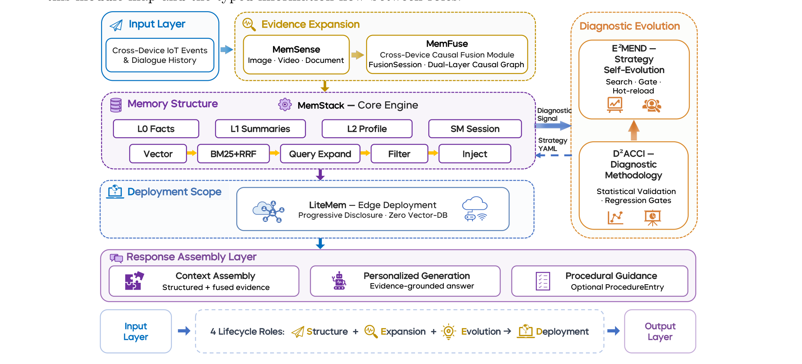
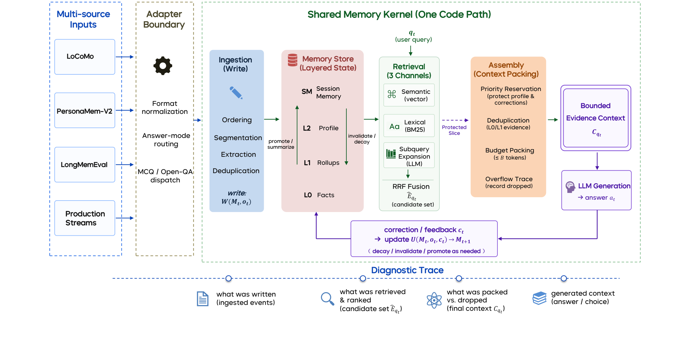
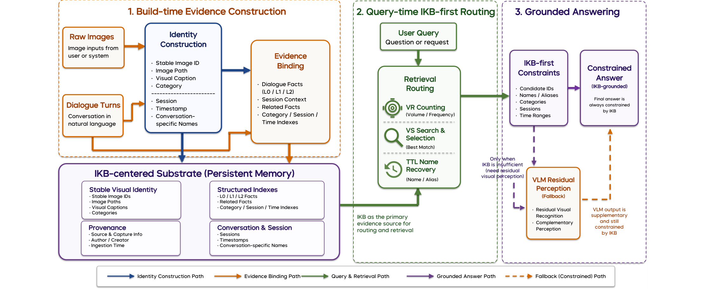
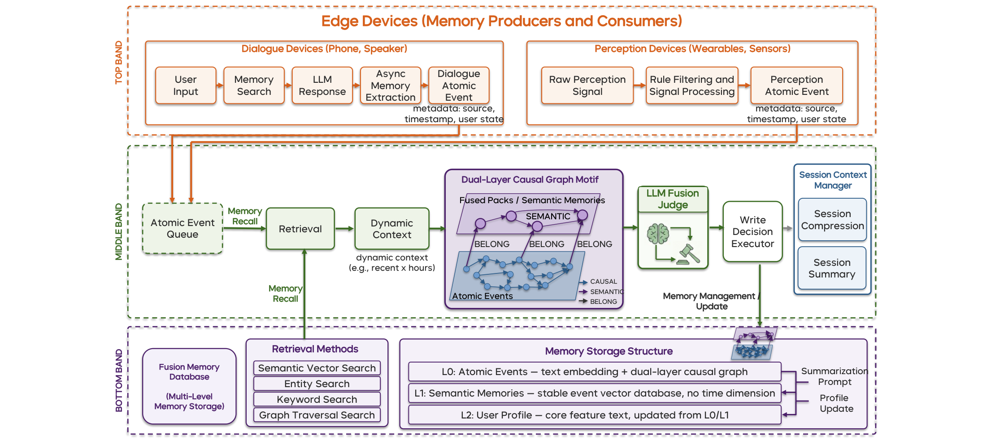
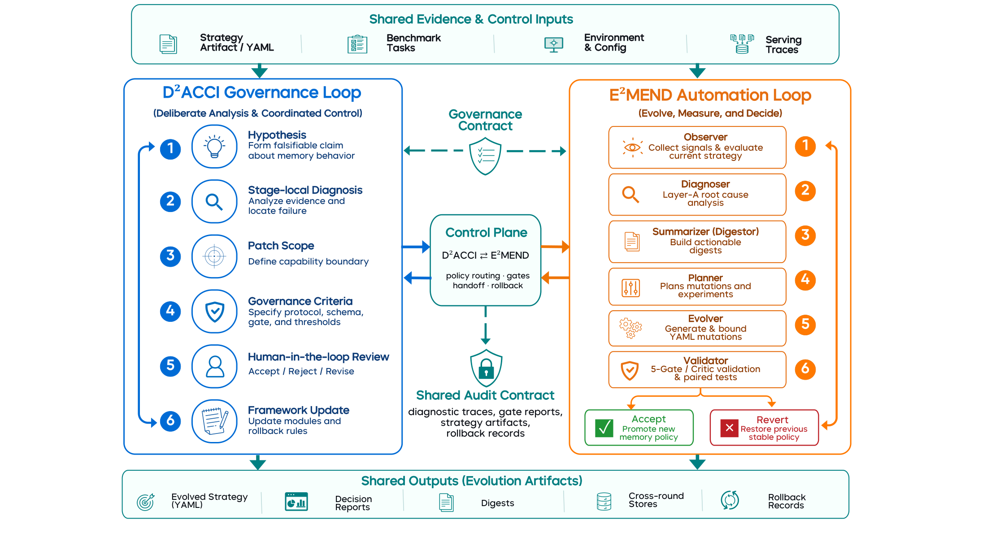
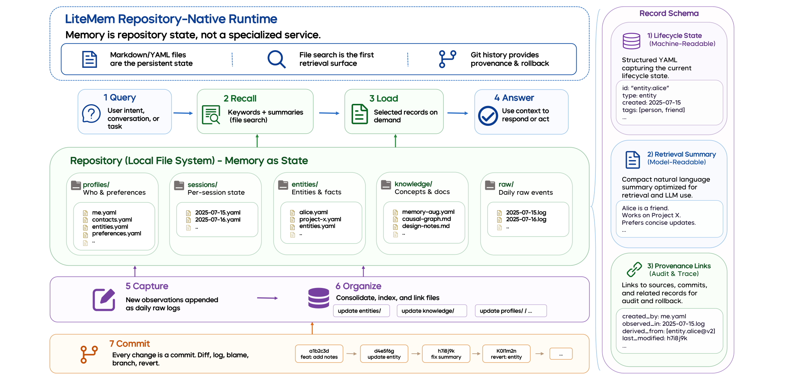
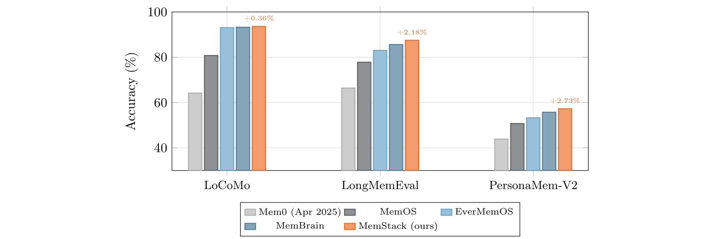
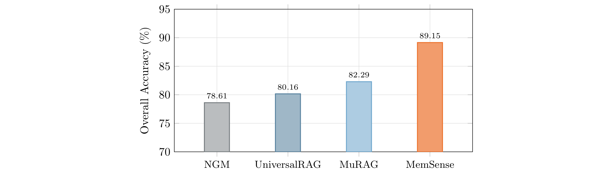

## 来源

- **PDF**：`raw/2607.18975v1.pdf`（52 页）
- **标题**：Mi-Memory: A Lifecycle Memory Framework for Personal AI
- **团队**：Darwin Agent Team（小米），核心贡献者 Xule Liu\*、Hanlin Teng\*、Chao Li\*，通讯作者 Kun Shao†、Jian Luan†
- **日期**：2026-07-21
- **项目主页**：https://darwin-agent.github.io/Mi-Memory/

## 核心结论

Mi-Memory 将 Personal AI 的记忆从「对话缓存」重新定义为**全生命周期可审计基础设施**。核心论点：记忆不应只是一个静态存储，而应是一个覆盖 observation → structuring → fusion → retrieval → assembly → response → correction → deployment 的生命周期流程，每个阶段转换都可能丢失、扭曲或静默退化信息。

框架围绕**四个生命周期角色**和一条**共享审计契约**组织：

| 角色 | 模块 | 核心义务 | 证据级别 |
|------|------|---------|---------|
| **Structure** | MemStack | 分层记忆记录 + 检索/组装/失效 traces | Controlled reference |
| **Expansion** | MemSense / MemFuse | 多模态 + 跨设备证据纳入，保留 provenance | Module-level / Preliminary-internal |
| **Evolution** | D2ACCI / E2MEND | 记忆策略的有界可审计演化 | Controlled offline / Descriptive |
| **Deployment** | LiteMem | 向 Markdown/Git 本地仓库的契约迁移可行性 | Transfer-feasibility |

**四类共享审计工件**贯穿所有角色：(1) typed evidence payloads（保留 source identity 和 provenance）、(2) diagnostic traces（定位证据在 serving pipeline 中的丢失位置）、(3) strategy artifacts（使记忆策略变更显式化）、(4) gate/rollback records（约束可接受的演化）。

### Running Example：Human-Car-Home Training Handoff

论文用一条贯穿全文的场景说明生命周期：周二下午，家长开车送 Ethan 去篮球训练。手机日历记录了 18:00 训练；车载导航估计是否来得及回家一趟；家庭摄像头画面提示 Ethan 的训练包可能还在门口。家长问车载助手「去训练前有什么要检查的吗？」

对话式记忆只能返回通用清单；生命周期感知记忆应保留完整证据链：摄像头帧 → 日历事件 → 路线状态各自作为 typed evidence 捕获 → 按适当粒度结构化（atomic event / session summary / profile entry）→ 跨设备融合为连贯 episode → 检索组装进 bounded answer context → 回答可引用证据 → 失败可定位（missed observation / broken fusion / retrieval filtering / generation error）→ 用户纠正进入 gated policy change 而非静默编辑 → 同一 episode 可存为 Markdown/Git 本地仓库工件。

## 架构与训练

### 整体框架（Figure 2）

> Figure 2 Mi-Memory flow. 左侧 Input Layer（跨设备 IoT 事件 + 对话历史）进入 Expansion（MemSense 图像/视频/文档 + MemFuse 跨设备因果融合），中间 MemStack Core Engine 维护 L0/L1/L2/SM 分层状态 + Vector/BM25+RRF/Query Expand/Filter/Inject，上方 D2ACCI 诊断方法论 + E2MEND 策略自演化 + Regression Gates，下方 LiteMem 边缘部署，右侧 Response Assembly Layer 输出 evidence-grounded answer。§ 3.2 Framework: Lifecycle Architecture and Interfaces。

**设计原则：single-concern ownership**。MemFuse 管设备流因果性、MemSense 管视觉 grounding、MemStack 管存储/检索正确性、E2MEND 管有界策略搜索、D2ACCI 管演化治理。模块边界穿越必须通过 typed payload。这带来两个属性：(1) 独立演化——E2MEND 可在 10^6 策略组合空间搜索而不破坏检索框架；(2) 增量集成——MemFuse/MemSense 通过 typed payload 接入 MemStack，不改变核心存储/检索抽象。

### Structure：MemStack 分层记忆运行时（Section 4）

> Figure 3 MemStack runtime. 左侧多源输入经 adapter boundary 格式归一化和 answer-mode routing 后进入 shared memory kernel；kernel 维护 L0 Facts / L1 Rollups / L2 Profile / SM Session 四层状态；检索走 semantic (vector) + lexical (BM25) + subquery expansion (LLM) 三通道 RRF 融合；context assembly 做 priority reservation（保护 profile & corrections）→ deduplication → budget packing (≤B tokens) → overflow trace 记录被丢弃项；最终 LLM generation 产出 answer，correction/feedback 触发 update operator（decay / invalidate / promote）。底部 diagnostic trace 记录全链路：written / retrieved&ranked / packed-vs-dropped / generated。§ 4.2 Method: Trace-Producing Memory Runtime。

**四层操作层级**（非认知模型，而是可观测性分解）：

| 层 | 写入触发 | 主要角色 | 可观测 trace |
|----|---------|---------|-------------|
| L0 | 每事件捕获 | 原子事实 + 时间 grounding | event/source ids + provenance pointers |
| L1 | session/topic 边界 | 保覆盖的局部摘要 | summary lineage + supersession links |
| L2 | 稳定 profile 更新 | 长期偏好与约束 | profile diffs + correction history |
| SM | 当前 turn / open loop | 短暂上下文 + 未解决状态 | session-window trace + overflow record |

**三通道检索**（Eq. 2, 10）：语义向量（R_sem）、词法 BM25（R_lex）、LLM 子查询扩展（R_exp），通过 weighted Reciprocal Rank Fusion 融合。κ 默认 60，通道权重均匀起步。

**Context assembly**：reserved slice 保护 L2 profile 和 forget/update 约束 → L0/L1 evidence 按 fused rank 填充 → 超出 budget B 的项记录 overflow trace 而非静默丢弃。

**可选 procedural hooks**（design-only）：`ProcedureEntry = (trig, p, c, v)`——trigger condition、ordered procedure、constraint set、validation rule。与 preference memory 不同：preference 记录用户想要什么，procedural entry 记录助手在用户重复场景中应如何可靠响应。仅在事实检索通过 provenance + confidence gates 后注入为操作指导，不作为事实证据。本报告不单独 benchmark。

### Expansion：MemSense + MemFuse 证据纳入（Section 5）

#### MemSense：IKB-centered 多模态证据 grounding

> Figure 5 IKB path. 左侧 build-time：image inputs + conversation → identity construction（stable image ID / path / visual caption / category / session / timestamp / conversation-specific names）→ evidence binding（L0/L1/L2 dialogue facts + session context + related facts + category/session/time indexes）。中间 IKB-centered substrate 作为持久记忆。右侧 query-time：intent router → VR counting（volume/frequency）/ VS search & selection（best match）/ TTL name recovery → IKB-first constraints → constrained answer（IKB-grounded）。VLM residual perception 仅在 IKB 不足时触发作为 fallback，输出仍受 IKB 约束。§ 5.2.1 Grounding Multimodal Evidence as Atomic Memory。

**IKB（Image Knowledge Base）entry**：`K(x_j) = (id_j, path_j, s_j, date_j, n_j, cat_j, c_j, Rel_j)`——image ID、路径、session、日期、conversation-specific name、category、visual caption、related L0 facts。IKB 是结构化 side table（按 image id / session-date / category / name 索引），与 L0/L1/L2 通用记忆存储通过 stable ID 链接，不合并为单一向量索引。

**核心路由规则**：当结构化 IKB 记录能解决视觉身份问题时，应约束概率性视觉识别，而非仅补充它。VR counting 用 IKB 计数 + image IDs；VS 枚举用 category/session/time-filtered 候选列表；TTL 命名用 conversation-specific names。

#### MemFuse：跨设备因果融合

> Figure 6 MemFuse pack path. 顶部三 band：TOP（dialogue devices: phone/speaker）→ user input / memory search / LLM response / async memory extraction → atomic event；MIDDLE（perception devices: wearables/sensors）→ raw perception / rule filtering / signal processing → perception atomic event；BOTTOM：atomic event queue → retrieval → dynamic context → memory recall。中间 dual-layer causal graph motif：AtomicEvents BELONG 到 FusedNodes，CAUSAL/SEMANTIC/BELONG 三种边。LLM fusion judge 做 CreatePack/UpdatePack/Standalone 三路决策。右侧 multi-level memory storage：L0 atomic events（text embedding + dual-layer causal graph）/ L1 semantic memories / L2 user profile。§ 5.2.2 Fusing Cross-Device Evidence into MemoryPacks。

**三路融合决策**（Eq. 7）：`Fuse(e_t, N_t) ∈ {CreatePack, UpdatePack(pk), Standalone}`。CreatePack 从 incoming event + retrieved neighborhood 形成新 activity-level node；UpdatePack 附加到已有 pack；Standalone 保持孤立原子事件。保守设计：模糊事件保持原子证据可恢复，不强制融合。

**Dual-layer graph**：AtomicEvent 节点保留细粒度 provenance；FusedNode 节点存储 activity-level MemoryPack 供 MemStack 消费。CAUSAL / SEMANTIC / BELONG 三种边分别捕获因果链、检索邻居、event-to-pack 成员关系。

**FusionSession 三区**：recent daily summaries（fixed zone）、same-day accumulated events（accumulation zone）、current event + retrieved candidates（temporary zone）。区满时低置信度/旧候选项被摘要或淘汰，accepted graph edges 持久化。

### Evolution：D2ACCI + E2MEND 双环治理（Section 6）

> Figure 8 Dual-loop framework for governed memory evolution. 左侧 E²MEND automation loop（Evolve, Measure, and Decide）：1 Observer → 2 Diagnoser（Layer-A root cause）→ 3 Summarizer/Digestor → 4 Planner → 5 Evolver（YAML mutations）→ 6 Validator（5-Gate/Critic + paired tests）→ Accept/Revert。右侧 D²ACCI governance loop（Deliberate Analysis & Coordinated Control）：1 Hypothesis → 2 Stage-local Diagnosis → 3 Patch Scope → 4 Governance Criteria → 5 Framework Update → 6 Human-in-the-loop Review。中间 Control Plane（D²ACCI ⇄ E²MEND policy routing / gates / handoff / rollback）+ Shared Audit Contract（diagnostic traces / gate reports / strategy artifacts / rollback records）。§ 6.2 Method: Dual-Loop Framework for Bounded Evolution。

**双环分工**：

| 范围 | D2ACCI 治理环 | E2MEND 自动化环 |
|------|-------------|----------------|
| 声明式策略空间 | 定义 admissible fields / value ranges / invariants / evolvable dimensions | 变更 extraction limits / retrieval weights / top_k / rerank size / source windows / prompts / feature toggles |
| 框架 | 批准 locked components（extraction code / retrieval pipeline / storage logic / context assembler） | 复用 locked framework，不改变 code 或 storage schema |
| 协议 | 定义 benchmark data / judge policy / scoring rubric / gate criteria / non-regression rules | 运行 fixed slice，apply gate checks，report paired deltas |
| 工件 | 要求 versioned artifacts / traces / gate reports / rollback records | 持久化每个 candidate mutation / decision record / revert / restore event |

**交接规则**：如果 candidate 需要修改 framework code / benchmark protocol / storage schema / acceptance criteria，从 E2MEND 交给 D2ACCI。自主接受仅限声明策略空间内通过 bounded regression checks 的 candidate。

**D2ACCI 四步迭代**：(1) Hypothesis——工程师提出可证伪声明（如「single-hop temporal 问题失败是因为 BM25 无法解析日期表达式」）；(2) Diagnosis——AI agents 运行 harness，产生 per-question diagnostic traces，Layer-A 分类器路由到最早 responsible stage；(3) Patch——实现 bounded fix scoped to hypothesized stage；(4) Verification——align by question key，partition into improved/regressed/both-wrong/both-correct，apply gate。如果假设预测与观测到的 category movement 匹配且无 category 回退超阈值，接受。

**E2MEND Observe-Improve-Verify 三阶段**：Observe 评估当前策略 + Layer-A root cause 归因；Improve 只 mutate 声明策略维度；Verify 做 scope checks / 5-Gate / Critic / targeted screen / paired comparison / rollback safeguard。Rollback 触发条件：当前 accuracy 低于 all-time best 超过 3pp。

**5-Gate fail-fast pipeline**：Structure gate（schema 合法性）→ Novelty gate（路径是否已 exhausted）→ Range gate（值是否在合法范围）→ Prompt-integrity gate（required markers 是否保留）→ Replay gate（stable-correct probe 是否回退）。Critic 做声誉驱动软审查，不能覆盖 hard gates。

### Deployment：LiteMem 仓库原生基底（Section 7）

> Figure 9 LiteMem recall path. LiteMem repository-native runtime：Markdown/YAML files 是持久状态，file search 是第一检索面，Git history 提供 provenance & rollback。四步流：1 Query（keywords + summaries via file search）→ 2 Recall（selected records on demand）→ 3 Load（use context to respond or act）→ 4 Answer。Capture after interaction（5）：新观察 append 为 daily raw logs。Organization during idle（6）：consolidate / index / link files。Commit（7）：every change is a commit，diff / log / blame / branch / revert。每个 record 暴露三视图：Lifecycle State（machine-readable YAML）、Retrieval Summary（model-readable）、Provenance Links（audit & trace）。§ 7.2 Method: Repository-Native Audit Substrate。

**四类审计面**：(1) summary files（title/summary/keywords/frontmatter，第一轮检索）；(2) raw daily logs（append-only Markdown event records，missed-write 修复路径）；(3) profile/entity/knowledge files（consolidated long-term state）；(4) Git history（diffs/commits/rollback traces）。

**检索评分**（Eq. 8）：`Score(m, q_t, t) = λ1·Lex(m, q_t) + λ2·Impt(m) + λ3·exp(-Δt/τ) + λ4·Access(m)`。Lex 是词法匹配，Impt 是当前重要性，exp(-Δt/τ) 是 recency decay（Δt = 上次访问以来间隔），Access 是 access-feedback 特征。

**重要性衰减**（Eq. 9）：`Impt(m) = Imp0(m)·exp(-Δt_m/τ_m) + η·access_count(m) - ρ·skip_count(m)`。两个 decay 项用不同时间基：Eq. 8 的 Δt 是检索 recency（短时间尺度 τ），Eq. 9 的 Δt_m 是组织时 salience decay（长时间尺度 τ_m）。

**Progressive disclosure**：检索 compact summaries → rank → top-k → lazy-load full text。三流：recall before answering、raw capture after interaction、idle/session-boundary organization。

## 评测要点

论文明确区分 **evidence level**（harness 成熟度）和 **statistical qualifier**（重复运行/置信区间/paired test），未显式报告 p-value/CI/variance 的数值差异仅作 descriptive evidence。

### Structure：MemStack controlled reference（Figure 4）

> Figure 4 Controlled-reference comparison on three benchmarks (GPT-4.1-mini backbone). MemStack 与 reproduced MemBrain baseline 共享 harness、model roles、data splits、diagnostic vocabulary。橙色标签报告 MemStack 相对 MemBrain 的提升。§ 4.3 Validation: Controlled Reference for Continuity。

| Benchmark | MemStack | vs MemBrain (相对提升) | 证据级别 |
|-----------|----------|----------------------|---------|
| LoCoMo | 93.59% | +0.36% | Controlled reference（parity-level） |
| PersonaMem-V2 | 57.24% | +2.73% | Controlled reference |
| LongMemEval | 87.47% | +2.18% | Controlled reference |

LoCoMo 窄幅反映 parity-level 竞争力；LongMemEval 和 PersonaMem-V2 报告更大相对增益。外部系统（Mem0、AMA、MemMachine、DCPM、HMO）的公开数字使用不同 model/judge/prompt/sampling，不做直接数值比较。

### Expansion：MemSense + MemFuse

**MemSense（Mem-Gallery benchmark，module-level）**：

| 指标 | 值 | 范围 |
|------|-----|------|
| Average judge accuracy | 89.15% | 1,711 Qs |
| Strict binary accuracy | 88.19% | 1,711 Qs |
| Image-related error share | 58% | VR + VS + TTL |
| Average latency | 35.3s（median 32.4s, P99 91.8s） | Offline module pipeline |

> Figure 7 Mem-Gallery overall accuracy comparison. Baselines 使用统一 Qwen-2.5-VL-7B backbone（Mem-Gallery 论文报告），MemSense 使用 GPT-4.1-mini + GPT-4o-mini judge。backbone 差异排除直接数值排名；图仅提供 contextual positioning。§ 5.3 Validation: Evidence Coverage in Realistic Daily Scenarios。

**MemFuse（MemFuseBench，preliminary/internal）**：

| System | Causal Reasoning | Information Fusion | Conflict Arbitration | Multi-User Synthesis | Cross-User Query | Perspective Difference | Overall |
|--------|-----------------|-------------------|---------------------|---------------------|-----------------|----------------------|---------|
| Direct LLM | 34.7% | 31.6% | 37.3% | 32.3% | 25.6% | 21.2% | 30.2% |
| Mem0 k=20 | 37.4% | 31.8% | 45.3% | 26.9% | 34.6% | 15.0% | 30.5% |
| RAG k=20 | 33.3% | 24.4% | 41.3% | 31.4% | 28.8% | 16.3% | 27.9% |
| **MemFuse k=20** | **41.4%** | **42.2%** | 33.3% | 25.5% | 34.4% | **30.6%** | **35.2%** |

MemFuse 在 causal reasoning / information fusion / perspective difference / overall 得分最高（+4.7pp over mem0）。但 conflict arbitration 低于 mem0（33.3% vs 45.3%）、multi-user synthesis 低于 Direct LLM（25.5% vs 32.3%），表明当前 graph-fusion 目标过度优先 causal/link coverage，对矛盾证据的 ownership/recency/user attribution 建模不足。MemFuseBench 是内部 benchmark，结果为 preliminary descriptive evidence。

### Evolution：E2MEND staged strategy search（LoCoMo）

| Stage | 策略族 | Accuracy | Gain |
|-------|-------|----------|------|
| S0 | Initial memory strategy | 75.58% | – |
| S1 | Evidence-grounded context enrichment | 81.82% | +6.23 |
| S2 | Structured state abstraction | 87.08% | +11.49 |
| S3 | Verified candidate adoption | 91.49% | +15.91 |
| S4 | Deterministic support-cluster decision | 93.70% | +17.86 |
| S5 | Evidence-supported consolidation | 94.74% | +19.16 |

+19.16pp gain / +295 net correct answers，descriptive full-benchmark evidence（非 repeated-run statistical claim）。最大绝对增益来自 single-hop (+139 correct)、temporal (+69)、multi-hop (+70)。Self-correction 和 broad raw-dialogue fallback 被拒绝（regressive or unstable）。

**D2ACCI 迭代案例**（Table 24 代表性轮次）：
- t3：dedup threshold 0.75 导致 over-merge（cosine 0.81 合并了「prefers Italian food」和「prefers Italian restaurants for dates」），−2.45pp → revert
- t4：threshold 提至 0.92 + topic segmentation，+4.48pp → accept，7 个回退问题全部恢复
- t5：option-aware KF 被 reject，因为 distractor amplification（|I|=3, |R|=4），archived as negative prior

**D2ACCI 成本**（Table 34，human-driven phase）：~100h engineer time / ~$260 LLM eval / ~200h wall-clock。

### Deployment：LiteMem transfer feasibility

| System | Accuracy | Infra cost | Substrate | Latency |
|--------|---------|-----------|-----------|---------|
| MemStack (full) | 93.59% | High | Cloud service | Moderate |
| **LiteMem** | **90.81%** | **None** | **Local Markdown/Git** | **Low** |
| No-memory baseline | 65.83% | None | Full-history prompt | High |
| Raw chunk-retrieval | 55.28% | None | Naive file-split | Low |

LiteMem 保留 90.0% 的服务端改善（(90.81−65.83)/(93.59−65.83) = 90.0%），97.0% absolute score ratio vs full MemStack。Direct recall 和 temporal localization 较强，multi-hop relation traversal 是主要限制。

## 待追问

- **MemFuseBench 外部验证**：当前为内部 benchmark，无 human upper bound / inter-annotator agreement / oracle-fusion ceiling，外部验证 pending。conflict arbitration 弱于 mem0 的机制需要进一步分析。
- **IKB ablation 缺失**：MemSense 的 IKB-first routing vs 标准 VLM/RAG 的 controlled ablation（共享 backbone）未在主文中报告，89.15% vs 82.29% 的差距不能直接归因于 IKB。
- **端到端闭环评测**：各模块分轨评测，尚无 memory guides downstream actions 的 closed-loop personal AI benchmark（MemoryArena / WorldMemArena 等被引为方向）。
- **在线增量演化**：E2MEND 目前仅 offline bounded automation，production 环境无 ground-truth labels 的在线演化未评测。
- **规模扩展**：LiteMem 的 file-count scaling / latency 未在当前 transfer-feasibility setting 之外验证。
- **procedural hooks**：design-only，无独立 benchmark。ProcedureEntry 与 agent skill memory / tool-skill library 的边界需进一步明确。
- **与 Hermes 的结构对比**：Mi-Memory 的 lifecycle audit contract（typed evidence / diagnostic traces / strategy artifacts / gate-rollback）与 Hermes 的 memory/fact_store/cronjob 体系有可类比之处，值得做机制层而非仅概念层的对比。D2ACCI 的「hypothesis → diagnose → patch → verify」与 systematic-debugging skill 的四阶段方法论高度同构。

## 相关页面

- [Agent 记忆生命周期](../concepts/agent-memory-lifecycle.md)——本报告提炼的概念页
- [Agentic engineering](../concepts/agentic-engineering.md)——procedural hooks 与 tool-skill memory 的关系
- [Agentic 评测体系](../concepts/agentic-evaluation-benchmarks.md)——memory benchmark 的可比性风险
