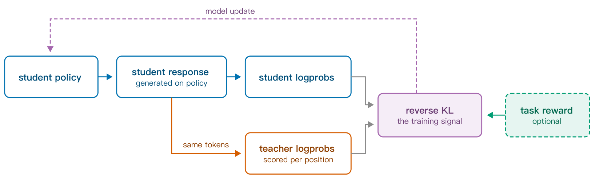
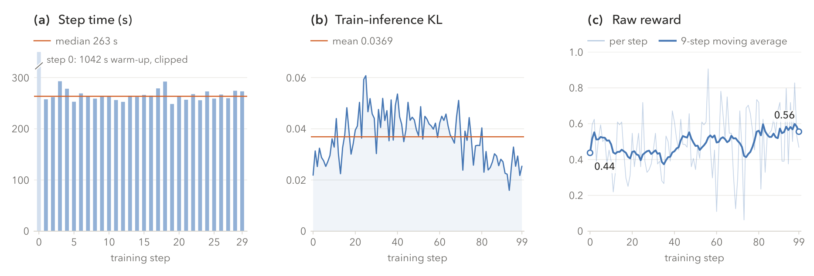

# Miles v0.1：生产级后训练系统

## 来源

- 文件：`raw/2609.08368v1.pdf`
- 标题：Miles v0.1: Production-Level Post-Training
- 团队 / 日期：RadixArk；核心贡献者为 Tom Chen、Mao Cheng、Shi Dong、Kangrui Du、Yanbin Jiang、Jiajun Li、Yiming Li、Tao Lin、Yusheng Su、Andy Ye、Yueming Yuan、Zhichen Zeng。arXiv:2609.08368v1 [cs.LG]，2026-09-08 提交，正文署日期 September 9, 2026；34 页 / 65 条引用
- arXiv：<https://arxiv.org/abs/2609.08368>
- 代码：<https://github.com/radixark/miles>（Miles-Diffusion 在单独的 <https://github.com/radixark/miles_diffusion>）；文档站 <https://miles.radixark.com>
- 定位：**后训练训练系统**报告，不发布模型权重。系统建立在 THUDM `slime` 的干净设计上（摘要、§1），rollout 侧深度绑定 SGLang，配套博客挂在 LMSYS Org。同一份报告既是 Miles 的能力清单，也是它的限制清单（§1 末段、§2.3、§4.3、§5.3、§7）。
- 未建模型页：论文不发布新的模型实体。案例研究对象是 GLM-5 家族的 GLM-5.2 744B-A40B（[GLM-5](../models/glm-5.md)）。

## 核心结论

1. **三段循环 + 一条原则**：rollout（SGLang 引擎）→ training（Megatron-LM 或 PyTorch FSDP）→ weight update（三种传输）。全文唯一原则是「组件应该可验证、干净、可定制」（摘要、§1）。
2. **异步是主要的优化方向**：三阶段不必 lockstep。Miles 提供 fully asynchronous 模式，要求 trainer 与 rollout 使用**分离的 GPU 池**；两者共卡（colocated）时 Miles 拒绝启动 fully-async 运行（§2.2）。
3. **吞吐（throughput）与保真（fidelity）是两个独立问题**：§2.1–2.2 处理吞吐（affinity 路由 + 异步调度），§2.3–2.5 处理保真（环境接入、token 精确、专家路由一致）。这个二分是本报告最有解释力的结构，也解释了为什么第 3 章之后还要单独讨论数值。
4. **一套组件服务多种后训练范式**：全参 RL 之外还有 LoRA RL、on-policy distillation、SFT、true-on-policy alignment，以及扩散模型（Miles-Diffusion）。共享的是 rollout engine / trainer / weight-update 路径，不是 RL 专属机制（§5、§6）。
5. **端到端案例**：GLM-5.2 744B-A40B 在 terminal-bench-2 coding 任务上做 fully async agentic RL，64 张 NVIDIA GB300（32 rollout / 32 training），前 30 个实测 step 的中位 step 时间 263 s（§9、Figure 5）。
6. **报告的自我限定值得单独记下**：低精度只覆盖已测配置、connectors 是 experimental、P2P 只有部分模型族、true-on-policy 只在 dense Qwen3 0.6B/4B 上有 profile、9 个模型族的「supported」不等于同一等级、「released」的 recipe 有的还在 open PR（§3.1、§2.3、§4.2、§5.3、§7.1）。

## Rollout：路由与异步调度

> 论文 Figure 1 原文标题："The Miles RL loop."（§1.1）

### Affinity：把 session 钉在持有其前缀的引擎上（§2.1）

- **Affinity** 把一个 serving 层 session（一个 episode 的有序请求集）绑定到持有其 KV cache 的引擎，此后每轮只 prefill 新生成的 suffix。两个粒度：**session-aware routing**（绑到引擎）与 **DP-rank-aware routing**（开了 DP attention 时进一步绑到具体 data-parallel rank）。实现走 SGLang 的 key-based routing mode；单轮负载仍可用 load-based routing。
- **没带 key 的轨迹直接报错**：Miles 不走 load 兜底——静默回退会牺牲 cache 命中率，而且日志里什么都不会留下（§2.1）。
- affinity 会把长轨迹堆到同一个引擎上造成失衡，所以 session server 用 **least-loaded placement** 给新 session 选引擎，选定后终生不变。affinity + least-loaded 在 §9 参考运行里把 prefix-cache 命中率保持在 **96%**。

### Fully asynchronous RL（§2.2）

- 前提是 **disaggregated placement**（两个独立 GPU 池）；colocated 下 Miles 拒绝启动。rollout 引擎连续生成，trainer 按需从 buffer 取已完成的轨迹组，唯一必须暂停生成的点是安装新权重。
- **补位粒度（§2.2.1）**：**Group granularity** 等整组结束后才补位，一条慢轨迹就占住整组配额；**Sample granularity**（fully-async 默认）每条轨迹一完成就释放自己的位置，因此即使轨迹长度差一个数量级，在跑的轨迹数仍接近上限。
- **数据缓冲（§2.2.2）**：完成的 group 先进有界 buffer。buffer 只暴露三个操作（放入、取批、报指标），用户可以用 import path 换成自己的 selector，循环里其它部分不用改。
- **丢组的三个条件**（Table 1）：生成放弃（**到达时**检查；重试或丢弃）／用户 filter 拒绝（**到达时**检查；**总是丢弃**，典型情形是同一 prompt 的每次尝试拿到相同 reward，组内没有 advantage 信号）／权重太旧（**取出时**检查；重试或丢弃）。
- **Staleness 的定义**：当前 trainer 权重版本 − 该 group 内**任何一个 turn** 用过的最老权重版本。定义刻意保守：绝不会把 group 当成比它最老的 token 更新。也正因为它的 turns 可能跨多个权重版本，只有被 trainer 取走时才能最终判定（§2.2.2）。
- **可观测指标**（Table 2，每 step 上报，前缀 `rollout/fully_async/`）：`queue_size`、`avg_staleness`、`max_staleness`、`buffer_avg_staleness`、`buffer_max_staleness`、`aborted_groups_filtered`、`stale_groups_filtered`。作者给的读法：queue_size 钉在 0 = rollout 跟不上，要扩 rollout 容量；钉在容量上限 = trainer 是瓶颈，等待组的老化同步上升（§2.2.3）。

### 异步评测（§2.2.4、Table 3）

- 三种模式：**共享引擎**（默认；测的是 fleet 最近收到的权重，测期间停止新生成，in-flight 请求跑完）／**专用 fleet**（占评测 GPU；从 checkpoint 快照测，export 可能阻塞 trainer，评测异步）／**外部 backend**（只给一个 checkpoint 目录，可以是任何服务，不一定要 SGLang）。
- 分数必须归属到产生它的策略版本：Miles 把分数记在**它实际测量的那个 step** 上，并把迟到量单独上报。专用 fleet 在高负载前先验证权重投递，确认两个条件——样本的平均权重版本等于记录的 step、由混合版本服务的请求比例为 0。
- 评测失败不停止训练，记为 skipped 并记录原因（export 失败、快照缺失、在途评测过多、用户 backend 内部错误）。

### 环境接入：三层嵌套插件（§2.3、Table 4）

- **agent fn**（最内）／**generate fn**／**rollout fn**（最外）；每个 connector 只替换一层：Harbor、NeMo Gym、OpenEnv 挂 agent function（session server 负责记 token）；HUD、Strands Agents、τ-bench 挂 generate function（自己接管 token 记录）；Prime Intellect Verifiers **直接替换 rollout function**（自带 taskset、分组、per-rollout 与 group reward）。
- 沙箱后端与层解耦：AgentENV、Daytona、E2B、Modal。沙箱生命周期是 recipe 选择——terminal-bench recipe 一个 episode 建一个沙箱并在结束后删除，也可以让所有 episode 打同一个长驻环境服务器。
- 两个限制：connectors 是 experimental；**session server 目前记录不了截图**，所以 computer-use connector 只能挂在 generate function 层。

### TITO：token-in, token-out（§2.4）

> 论文 Figure 3 原文标题："Token-in, token-out. The session server preserves the exact token IDs produced by the engines, so the trainer sees the model-generated tokens even when the harness is a black box."（§2.4）

- 由 **session server 而不是 harness** 控制 tokenization：agent 只交换普通 message 并在每轮送全量历史，server 决定这些 message 如何变成 token。首轮把模板渲染成 token IDs；每次成功完成后 checkpoint prompt IDs、output token IDs、log-probabilities 与 SGLang 返回的 routed experts；后续轮复用**最深的可用 checkpoint**，只 tokenize 追加的 suffix；**agent 自己提供的 token 字段一律被覆盖**（§2.4）。
- 两个扩展规则（§2.4.1）：**Linear**（每个请求只能延长历史尾部，可回滚一个 assistant checkpoint 后重试最近一轮；一个 session 恰好产出一条训练序列）／**Branching**（历史存成 append-only tree，请求挂到「message path 是其前缀」的最深 checkpoint 上，未匹配的余部开新分支且永不删除；每个 leaf 一条训练序列，因此一个 session 可产出多条轨迹）。末次 generation 卡在长度上限的分支不能再扩展。Branching 是支持 Claude Code 这类会 fork / compact 自己上下文的 harness 的前提——这类 harness 事前不知道一个 session 会产出几条轨迹，因此无法用 Linear 容纳。
- **重放比较（§2.4.2）**：三档内置 matcher，从最严到最松。最严档（安全默认）只比较 chat template 真正读的字段（role、content、reasoning content、tool calls），忽略模板不消费的字段；次松档还接受「JSON 内容相同但序列化不同」的 tool-call arguments，但仍要求 call identifier、函数名与顺序一致；**最松档只比 role 与可见文本**——而 tool-calling turn 的可见文本常常是空的，于是「存储的前缀胜出」，训练历史里会留下一个 agent 从没发起过的 call，且 Miles 不会对账 tool-call identifier，**这种错配是静默的**。
- **注册与验证（§2.4.3）**：一个 registered model family = 共享同一 chat template 与同一对 reasoning / tool-call parser 的一组 checkpoint。Miles **从不从 checkpoint 自动检测 family**，必须用户显式命名；覆盖 Qwen3、GLM、Nemotron、Kimi、MiniMax、DeepSeek、Inkling，线外落到 generic handler 并警告增量 tokenization 可能偏离模板。注册要过两道检查：CPU 上验证「渲染后的 token 序列逐轮 append-only」这一设计所依赖的不变量，GPU 上对着活模型验证该不变量在真实推理（stop token、tool-call parsing）下仍然成立——**CPU 检查单独不构成正确性证明**。
- 当前限制：session server 不携带图像或视频输入，所以 VLM 走不了它，只能直接驱动 SGLang 的低层 token-in / token-out 接口。

### R3：重放专家路由（§2.5）

- MoE 里 rollout 与 training 可能把同一个 token 送给不同专家（两边 kernel 与精度不同，router 的极小数值差就能翻转每层每 token 的 top-k）。R3 把每个 token 的专家分配**当作 rollout 数据的一部分**，训练时重放而不是重算：`--use-rollout-routing-replay` 让 SGLang 随 token 返回 routed experts。因为 session server 已经记录了 routed experts，重放覆盖整个多轮 episode 而非单次 completion。原文引 Ma et al. 说明这类错配会剧烈破坏 MoE RL 稳定性、甚至导致训练崩塌。
- 成本：每个 routing tensor 是 (tokens − 1) × layers × k 个 32 位整数；32K token、60 层、k = 8 时约 **60 MB / 轨迹**，且必须常驻内存并随轨迹移动。
- **不是全局开启**：dense 模型没有专家可重放；异步 RL 下其它 mismatch 因素已经很多，作者判断 R3 的效果可能有限。若干已发布的 MoE recipe 开了 R3，而 **§9 的 GLM-5.2 参考运行没开**。

## 训练侧

### 低精度：一条共享的量化契约（§3.1、Table 5）

- 核心约束是**rollout 与 training 必须共享同一份量化协议**：只量化 rollout、或两边量化方式不同，会让两边从同一权重算出不同结果，误差逐层累积。Miles 用单一低精度路径，前向跑同一套量化逻辑。
- 三种格式端到端可用：**FP8 blockwise**（128×128、FP32 scale；测过 Qwen3-4B / Qwen3-30B-A3B / DeepSeek-V4；generally available；Hopper + Blackwell + AMD MI350X/MI355X）、**MXFP8**（1×32、UE8M0 scale；测过 Qwen3-30B-A3B / DeepSeek-V3.2；Beta；仅 Blackwell）、**NVFP4 E2M1**（1×16、E4M3 块内 scale 套 FP32 张量 scale；测过 Qwen3-30B-A3B；Beta；仅 Blackwell）。另有 INT4 QAT 与「BF16 train, FP8 serve」两种并行选项。A100 没有 FP8 算术，只能 BF16。
- 允许的组合只有两种：两边同格式，或 trainer 留 BF16 而 rollout 量化。**NVFP4 是特例**——它要求每个接触权重的阶段都量化，因此 NVFP4 rollout + BF16 trainer 不受支持。
- MXFP8 / NVFP4 被实现成端到端精度契约，检查四个阶段：checkpoint 转换、trainer 前向、SGLang rollout、每次权重更新时的 live weight export。NVFP4 的细节：activation 按 token 量化（量化伪影不依赖 batch 组成），gate 与 up projection 一起量化（融合 rollout GEMM 只用外层权重 scale），rollout 保留 BF16 KV cache。两个 recipe 共用同一个 bit-exact quantizer。
- 少量张量留在 BF16：末层 transformer、shared expert、MLA 的投影——它们的收缩轴与一维 scaling block 对不齐。契约允许按 layer range 与 tensor name 在四个阶段分别覆盖，但**覆盖必须四个阶段同时生效**。
- 两个可选 NVFP4 细化，都通过环境变量选择：**dequantized backward**（只动训练侧，反向前向用从 NVFP4 值反量化出的 BF16 操作数）与 **four-over-six**（改的是量化值本身，因此属于契约而不属于 backward pass，须在 trainer 的 Transformer Engine kernel 与 SGLang 的 FlashInfer kernel 同时启用）。
- 验证方式是比较 SGLang 与 Megatron-LM 对同一批采样 token 的 log-probabilities；已测配置上 reward 曲线紧跟 BF16 基线、rollout 时间显著下降。**证据只覆盖 Miles 内已测的配置**，作者提醒同一套量化在不同模型上可能表现不同。

### 显存与 offload（§3.2、Table 6）

- 两个机制，作用时机不同：**驱逐暂停的 actor**（`--offload-train`）在训练 step 之间把整个训练进程（权重、梯度缓冲、优化器状态）搬出 GPU，让别的进程用同一块显存；**流式优化器状态**（`--stream-optimizer-state-to-disk`）把优化器状态分桶存盘，更新某桶参数时才载入并在更新后立刻驱逐。前向与反向从不读优化器状态，所以它的显存可以在算梯度期间空出来。两者可以叠加。
- Megatron 后端在 **allocator 层**整体搬运，不必知道哪个 tensor 占哪些字节；pinned host memory 是默认且更快的目的地，主机装不下时落到 node-local disk，用固定大小的 pinned staging buffer 流式写 per-rank 文件，主机内存因此有界。FSDP 后端把模型与优化器搬到 host memory 达到同样效果，但**不能落盘**（Table 6 的 `×`）。
- 默认行为取决于「actor 空闲时是否有别的进程要用这批 GPU」：colocated 默认驱逐，disaggregated 默认不驱逐。**PPO 是特例**——它需要 actor 与 critic，而 Miles 永远把两者放在同一组 GPU 上，所以只要 critic 在用 GPU 就默认驱逐 actor。
- 优化器状态的量级：FP32 master weights + 两个 Adam moment = **12 bytes/参数**。可以只把流式的 Adam moment 降到 BF16 换速度，**master weights 必须留 FP32**。数据并行已经切分优化器状态，但 §9 的参考运行在 DP = 4 下仍需流式，因为每 DP rank 的分片本身就装不下。
- 组合收益（Qwen3-30B-A3B）：加流式后 actor offload 从 24 s 降到 5.2 s，reload 从 8.9 s 降到 1.3 s。三个 caveat：流式运行只能在**同一并行布局**上恢复（文件跟着写它的 rank 的 DP 分片走，改并行度会触发断言）；不能恢复一个非流式写的 checkpoint（Miles 直接拒绝，而不是悄悄从 step 0 重开 Adam）；checkpoint 保存明显变慢，因为流式状态是同步拷进 checkpoint 目录的，可能阻塞训练。

### 两个训练后端（§3.3、Table 6）

- Megatron-LM 是默认后端，出现在大多数已发布 recipe 里，因为它提供更完整的并行轴（TP × PP × CP × EP × ETP，外加 DP），是大 MoE 与跨机架任务的现实选择。
- FSDP 的适用场景是「直接加载 Hugging Face 目录比模型并行更重要」：无转换步骤、不用写架构 flag，适合新架构 bring-up、对着 HF 参考核对 trainer 数值，以及只靠数据并行就能装下的模型；需要小修正的架构注册成 adaptation spec，而不是 fork HF 模型代码。
- 下表差异中 `×` 表示该后端尚未实现，而不是 FSDP 本身的限制（Table 6 原文）：

| | Megatron-LM | FSDP |
| --- | --- | --- |
| 模型切分 | TP × PP × CP × EP × ETP，外加 DP | Replicate × shard |
| 模型输入 | Megatron 分布式 checkpoint，或经 Bridge 读 Hugging Face | Hugging Face 目录原样 |
| 写出的 checkpoint | Megatron 分布式 checkpoint | PyTorch Distributed Checkpoint |
| 优化器在 CPU | ✓ | ✓ |
| 超出 host RAM 的 offload | ✓（§3.2） | × |
| Attention backend | 由 Megatron Core 选择 | 可选 |
| LoRA（§5.1） | ✓ | × |

- Megatron-LM 不要求离线转换（可经 Megatron Bridge 直接读 HF 目录），而且写出的 Megatron checkpoint 与并行度无关，之后改布局不必重转。

### 目标函数与 mismatch 修正（§3.4）

- 五类 advantage estimator：GRPO、GSPO、REINFORCE++（plain 与 baseline-relative 两种）、PPO（带学习到的 value function）。loss 侧是一个 typed interface，含 policy / value / supervised 三种变体与一个用户 hook——SFT 因此复用同一 trainer 而不挂 rollout engine。
- **即使完全同步的运行也有 train-rollout mismatch**：SGLang 与 Megatron 用不同 kernel、不同精度、不同 batching，对当前权重采出的轨迹也会分歧。§2.4 与 §2.5 去掉两个结构性成因，§5.3 对覆盖到的配置去掉数值残差。
- 剩余差异体现为重要性比 $r=\exp(\log\pi_{\text{train}}-\log\pi_{\text{rollout}})$ 偏离 1，Miles 提供两种修正：**TIS**（把 $r$ 夹到配置区间，默认 $[0,2]$，把夹后的值当作该 token policy-gradient loss 的 per-token 权重——极端 ratio 被阻尼而非丢弃；默认区间只作用在上尾，因为 ratio 不会低于 0）与 **clip-or-pop**（区间外直接置 0，等价于 loss mask，**丢弃**而非阻尼）。两种修正都上报三个指标：夹前 ratio、被裁比例、$|r-1|$ 的平均绝对偏差。

## 权重更新：三条传输（§4）

- 契约很简单：trainer 准备好新权重 → 传给每个 rollout engine → 引擎用新策略开始生成。默认每个训练 step 后同步一次，cadence 可配。
- 量级让传输成为一等公民：一次完整 NCCL broadcast 广播 Kimi K2 1T-A32B **接近一分钟**。三种传输（Table 7）：

| 传输 | 路径 | 适用条件 | 代价 / 限制 |
| --- | --- | --- | --- |
| Broadcast（默认） | NCCL 广播到每个 rollout rank | rank 共享 NCCL fabric | 一份数据发给所有 rank，即使某些 rank 不需要那些分片；每次 bucket flush 取一把共享锁 |
| Peer-to-peer（§4.2） | RDMA 直接写进 rollout-rank 内存 | rank 间可直达 | 实际发送的源数 = min(源, 目标)；需要 CPU 常驻模型副本做 re-shard；单节点比 broadcast 慢最多约 70% |
| Disk-delta（§4.3） | 变化的字节发布到共享存储，rollout host 自行 patch | 没有共享 fabric，或传输本身成为瓶颈 | 只支持 Megatron；拒绝与 colocation / LoRA / PD 分离组合；XOR 编码非幂等 |

- colocated 时是本地 handoff（Megatron/FSDP 与引擎在同卡），不涉及传输；但 fully-async 模式要求 disaggregated，所以本地 handoff 与异步调度互斥。详细对比见 [RL 权重同步与部署拓扑](../concepts/rl-weight-synchronization.md)。
- **P2P 的收益随 fleet 宽度增长，而不随模型规模增长**（Table 8，H100 集群、1 GB bucket、稳态 step 平均，计时从生成暂停结束到 update 调用返回）：

| 模型 | 每侧节点数 | Broadcast | P2P | 变化 |
| --- | ---: | ---: | ---: | ---: |
| Qwen3-30B-A3B | 2 | 2.67 s | 2.16 s | −19.1% |
| GLM-5 744B-A40B | 16 | 58.30 s | 8.48 s | −85.5% |
| Kimi K2 1T-A32B | 32 | 53.28 s | 7.23 s | −86.4% |

> Kimi K2 的时间含约 884 ms 的 on-GPU 重新量化（它的 checkpoint 每次传输后都需要）。作者强调优势在每侧两个节点时就已经出现。
- **单节点是 P2P 的反例**：单节点给不出额外的聚合带宽，仍要付 host 侧 re-sharding 与 pinned-memory staging 的固定成本，所以默认保持 broadcast，P2P 只在两侧都跨多节点时有用。P2P 的模型覆盖也受限——发送方只有在架构具备 Megatron↔SGLang 统一 weight-name 映射时才能 re-shard，当前覆盖 Qwen2 / Qwen3 dense、Qwen3-MoE、GLM4-MoE 与 DeepSeek-V3 / V3.2 派生。
- **Disk-delta 的前提是稀疏性**（连续 RL step 只改动模型很小一部分字节）：每个 rollout host 从共享 base checkpoint 出发，trainer 只写变化字节加一条指向 base 的引用。五步流程里**只有第 5 步暂停生成**（重新加载 patched checkpoint、推进引擎权重版本、恢复生成），前 4 步只是读写文件，可以与完全异步的 rollout 并行。XOR（默认；更紧凑更快，但是对合运算，必须严格应用一次且只对自己的 base）与 Overwrite（幂等，重试无害，字节更多）两种编码都在原始字节上工作，因此 base 与导出的策略必须在 tensor 名、dtype、shape、字节布局上完全一致；Miles 校验的是**结果状态的每个 tensor** 而不是 delta，base 不匹配或校验失败就整次更新停止，不让任何引擎用部分应用的权重生成。
- **in-flight 请求三选一**（§4.4）：abort / 原位保留并围着它更新 / 撤回后按新权重重跑。**Retraction 是默认**。session server 不能容忍 token 历史在轨迹中途被拆掉，所以开了 session server 就拒绝 abort 模式；FSDP 后端永远 retract。
- **权重校验是 opt-in 的**：先把引擎 tensor 填成随机值，再跑首次权重更新，任何没被写到的 tensor 到达检查时仍持有噪声，因此静默漏写无法蒙混过关。默认要求 bit-exact，也可以接受量化往返的舍入误差（容差由量化格式推出，不由用户给数字）；rollout 侧独有的 tensor（如 inference-only cache scale）跳过。Miles 只在**自己的 CI** 里自动打开这个检查。

## 其它后训练范式

### LoRA RL（§5.1）

adapter 成为循环的工作单元：trainer 更新它、权重路径同步它、SGLang 在 rollout 时应用最新副本而 base checkpoint 常驻每张引擎。收益落在两处——训练 step（优化器状态从整模型收缩到 adapter）与权重更新（移动的是 adapter 而不是整个模型）。colocated 走 IPC（trainer 序列化 adapter tensor，把 handle 交给引擎进程，不过网络），disaggregated 走 NCCL 广播；**P2P 与 disk-delta 都不携带 adapter**。支持性是 Megatron adapter 实现 / Miles 名字映射 / SGLang 侧分配与应用三方契约，名字对上不构成支持，所以 Miles 只发**验证过的 recipe** 而非 allowlist：Qwen2.5、Qwen3、gpt-oss、Kimi K2.5、GLM-5/5.1/5.2、Qwen3.5/3.6、Inkling；目前只在 Megatron 后端。可与「BF16 train, FP8 serve」组合——验证过的 GLM-5.2 recipe 训 BF16 adapter 而 SGLang 服务 FP8 base，adapter tensor 本身不量化。实验性的 multi-LoRA 支持一份 base 配多个 adapter（各带自己的数据集、reward、优化器状态与 step 计数），只支持 disaggregated rollout；operation-driven backend 与 Tinker 兼容前端目前仍是 open PR。

### On-policy distillation（§5.2）

> 论文 Figure 4 原文标题："On-policy distillation. The student generates a response, the teacher scores the same tokens position by position, and the difference between the two log-probabilities, a per-token reverse-KL estimate, drives the update, optionally alongside a task reward."（§5.2）

- student 自己生成，teacher 给**同一批 token** 逐位置打分；per-token 信号 $\log\pi_{\text{student}}(x_t)-\log\pi_{\text{teacher}}(x_t)$ 是该位置 reverse KL 的单样本估计。Miles **把它折进 advantage 而不是 loss**：advantage estimator 算完之后，从每个 token 的 advantage 里减去按系数缩放的 divergence 估计，然后 policy-gradient 更新照旧。所以蒸馏是与 GRPO / PPO 等**并列可组合**，而不是替换它们；任务 reward 可以保留，也可以设 0 只做蒸馏。两个 log-prob 都是固定输入（rollout 时记录，或由单独的 teacher pass 产生），因此惩罚表现为 dense per-token reward，而不是额外 loss 项。
- **top-K 变体**（跟随 Li et al.）站在这条一样本估计与全词表 divergence 之间：teacher 对每个位置的候选集打分（student 的 top-K，或两边 top-K 的交集），估计变成该集合上的加权和。**只在 served teacher 下可用。**
- teacher 放哪决定何时拿到 log-prob：**served teacher**（外部 SGLang 服务器在 rollout 期间给每条完成的轨迹打分，log-prob 随轨迹进 trainer；teacher 可以架构不同、也可以大到装不下，但**必须共享 student 的 tokenizer**，因为打分是在 student 的 token IDs 上做的）；**in-process teacher**（Megatron 在 student 旁边加载第二个同架构模型，训练 step 里做一次专门前向）。可以注册多个 served teacher，按 prompt metadata 里的 tag 路由——例如数学专家给数学 prompt 打分、代码专家给代码 prompt 打分。
- **文档里的 Qwen3.5-35B-A3B 运行**：teacher 是同一模型加五步可验证 reward 的 RL，student 从 base checkpoint 起，任务 reward 设为 0，reverse-KL 惩罚提供全部训练信号。五步内 held-out DAPO prompt 上的 response 长度从 14,070 降到 6,132 token，accuracy 从 84.0% 到 85.2%。**作者自己把结论限定为 response 长度降 56%、accuracy 无可信变化**——1.2 个点落在该评测约 1.6 点的标准误内，不是 benchmark 提升。

### True-on-policy alignment（§5.3）

- 目标是把两边概率的数值差压到**恰好为 0**：两边跑同一个 attention kernel（FlashAttention-3，其 prefill 与 decode 路径 bitwise 一致）；两边都用**batch invariance** 的 matmul kernel（输出不随「多少请求共享一个 batch」变化），因为 rollout 的 batch 无法与 trainer 对齐；Megatron 侧把 Transformer Engine 的 fused 实现换成 Megatron 本地实现、关掉 fused rotary-embedding 与 bias-SwiGLU kernel、按 per-model kernel contract 钉住其余算子；FSDP 侧选匹配的 attention 实现；SGLang 跑 deterministic-inference mode，trainer 侧 cuBLAS / Transformer Engine / NCCL 都配成确定性执行；用 TP 时把 row-parallel linear 及其后的 all-reduce 做成与并行度无关；最后 rollout engine **用一次 prefill pass 重新给完成的序列打分**，而不是报 decode kernel 产出的 log-prob，让两边用同形状的计算。在受支持配置下两边对每个采样 token 给出完全相同的 log-probability，Miles 报告的绝对差恰为 0。
- 代价是吞吐（确定性与 batch-invariant kernel 放弃了一些默认优化）。保证有两条边界：覆盖范围只有 dense Qwen3 0.6B 与 4B（Megatron 或 FSDP，配 data / tensor / pipeline / context 并行），线外模型 Miles 拒绝启动而不是给部分保证；保证只覆盖**一个指标**（每个采样 token 的 log-probability），不主张两边在输出分布上处处一致，也不处理另一个 off-policy 来源（权重更旧时生成的轨迹），后者由数据缓冲单独限制。

### Miles-Diffusion（§6）

- 单独仓库（<https://github.com/radixark/miles_diffusion>）。trajectory 变成「把噪声变成一张图或一段视频的去噪步序列」：`sglang-diffusion` 引擎整条返回，并记录每一步的中间状态与 log-probability；FSDP2 trainer 重新给选定的一个子集打分并在其上优化 RL 目标。FSDP2 + sequence parallelism 能把长视频序列切到多个 rank，Wan2.2 recipe 走的就是这条路径。
- loss、训练 batch 准备、rollout function 与 reward 都是可替换组件，所以同一个 trainer 跑 Flow-GRPO、DiffusionNFT 与 SFT（Flow-GRPO 对每个受支持模型都有 shipped recipe，另两者只在 SD3.5 / Wan2.2 上有 recipe）。生成、解码、reward 打分重叠进行：引擎把每批请求切成 shared-encoder-results 的 microgroup，Miles-Diffusion 收到就反序列化并打分；一段视频 microgroup 的轨迹可以是 GB 级 tensor，所以以**原始字节**而不是 base64 文本传输，并在 worker 进程池里解包（LTX-2.3 recipe：rollout 从 157.4 降到 87.6 s/step，总 step 时间从 321.9 降到 252.1 s）。
- 扩散 RL 对精度异常敏感（ratio 比较的是引擎与 trainer 各自前向产出的 log-prob，任何舍入差都变成纯噪声的更新信号），因此加了两个控制：**deterministic mode**（让训练 actor 的前向反向在同硬件上跨运行可复现——patch FlashAttention kernel，拒绝没有确定性开关的 attention backend，使端到端测试能逐 bit 对比每个注册指标）与 **per-parameter dtype control**（对 FSDP2 混合精度策略的补丁，把 timestep embedder、modulation table 之类精度敏感参数留 FP32）。
- 每个 recipe 带明确的 evidence level：fully gated / proxy gated / verified / not verified，而且 level 只适用于模型指南里点名的那份脚本与拓扑，不适用于整个模型族。当前 main 上 SD3.5 与 LTX-2.3 是 fully gated，多节点 Wan2.2 是 proxy gated，Qwen-Image 与 Cosmos 3 是 verified，两个 Wan2.2 LoRA recipe 是 not verified；MiniMax H3 只在 open PR 里。

## 覆盖范围：模型与硬件（§7）

- **Day-0**（权重公开当天就能训）对六个前沿模型成立：Kimi K3、DeepSeek-V4、GLM-5.2、Qwen3.8、Inkling、NVIDIA Nemotron 3 Ultra。其中两个——Kimi K3 与 2.4T 参数的 Qwen3.8 MoE——发布当天训的是 LoRA adapter 而不是全参，因为只有 frozen base + adapter 才装得进集群；**这两个 recipe 仍在 open PR 而不是 current main**。
- 除发布日集合外，另文档化九类模型族的 recipe（DeepSeek-V3.2、Kimi K2.6、Gemma 4、gpt-oss 以及更早的 Qwen / GLM / Nemotron 世代）。报告明确**不把这份清单当成同一等级的声明**：对某些 checkpoint 指全规模验证过的运行，对另一些指维护中的 launcher 加在削减层数切片上的端到端 CI，对其余的只有单元测试；具体等级记录在各 checkpoint 的模型页而不是本报告。
- **硬件**：NVIDIA 覆盖 A100 到 GB300；Hopper（H100 / H200）与 Blackwell（B200 / B300 / GB200 / GB300）是生产硬件，Hopper 承担 CI 里大多数 GPU 测试；A100 关闭全部 FP8 特性跑循环。AMD 是 **native ROCm**（不是翻译层），覆盖 MI300X / MI325 / MI350X / MI355X，跑同一套 SGLang 引擎但用单独的容器镜像；AMD launcher 覆盖 Qwen3-4B、Qwen3-30B-A3B、GLM-5.2、DeepSeek-V4、Inkling；MI350 runner 在每个 PR 上跑端到端训练测试，另有 nightly 跑更大的 MI350 配置。
- 一次可行的运行要**同时**满足兼容的 checkpoint、GPU 与数值格式三个约束，这是本报告给出的最实用的部署判据。

## 代码质量原则（§8）

Miles 把「系统应该易读、易扩展」当成一条被强制执行的工程约束，而不是口号。训练 driver 刻意写成伪代码的形状：同步循环的一次迭代就是若干个按序调用（生成一批轨迹组 → 训练 → 到点存 checkpoint → 按 placement 释放或 offload 显存 → 更新引擎权重 → 到点评测），其余全部藏在模块后面。扩展性来自用户在四处最常需要自己逻辑的地方提供**小型 typed 接口**（rollout function、data source、reward、loss、importance-ratio 修正），每处都用 flag 里的 import path 选择，用户代码只在运行用到时被加载。rollout 栈被拆成 agent / generation / rollout 三层，环境或 agent 框架可以只替换需要替换的那一层。

强制执行方式值得单独记：格式与 import 顺序是 pre-commit hook，CI 在每个 PR 上重跑；另有三条 hook 直接禁用 Miles 特有写法（例如直接读 Megatron 的 parallel state 会被拒，因为两个训练后端共享一个 parallel-state 对象）。更有意思的是 **CI 保留每个测试的历史训练指标，并用它 gate 新数字**——这样「单次运行看不出来的 reward 或 divergence 缓慢漂移」会被抓住。

## 案例研究：GLM-5.2 × 64 × GB300（§9）

配置（Table 9）：GLM-5.2 744B / A40B；terminal-bench-2 terminal-use coding 任务；OpenEnv connector + 一 episode 一个 Daytona 沙箱；64 张 GB300（32 rollout / 32 training）；训练并行 TP 2 / PP 4 / CP 4 / EP 8；推理八个 DP-attention 引擎（DP 4）并开 MTP；BF16 训练 + FP8 权重与 FP8 KV cache 做 rollout；每 session 最大 65,536 token；batch 64 条轨迹（8 任务 × 8 次尝试）；fully asynchronous。

几个由约束反推出来的决定：

- 32 张训练卡被 TP × PP × CP × EP 用满，只留下**一个**数据并行副本，所以每 rank 持有的优化器状态分片不切分，约 **279 GB / rank**，单卡装不下——流式到 node-local disk 是**必需而非优化**。
- TP 停在度 2：度为 1 时单 rank 的非专家权重在加载阶段就溢出。
- CP 把每条训练序列切到 4 个 rank，每 rank 约持四分之一 activation。
- PP 把 78 层分 4 段，第一段 18 层、其余各 20 层，因为该模型的 sparse attention 跨层共享索引，**每一段都必须从一个自己算索引的层开始**。
- 每个 episode 30 轮或 1 小时 wall-clock，先到为准；每条回复最多 8,192 token；GRPO 把每条轨迹与同一任务的另外七次尝试比较算 advantage，TIS 修正剩余 mismatch；最多 128 条轨迹在途，与 batch 64 解耦；每十步暂停生成，在不相交的 held-out 任务集上评测。**R3 没开。**

结果（单次 100 step 运行）：

> 论文 Figure 5 原文标题："Metrics from the GLM-5.2 agentic RL reference run. (a) wall-clock seconds per training step for the first 30 measured steps; the step-0 warm-up value is clipped, and the median is marked. (b) the divergence between the rollout engine's and the trainer's log-probabilities at the sampled tokens, with the mean marked. (c) raw task reward, with a faint line for each step and a bold line for its nine-step moving average."（§9.2）

- 744B 模型在 32 张卡上训练；Table 9 的并行布局加 §3.2 的显存机制把 trainer 装进半张 fleet。
- 中位训练 step **263 s**（前 30 个实测 step；step 0 的 1,042 s warm-up 被裁出图）。
- 生成与训练在权重更新之间重叠：sample granularity 让一条轨迹一完成就补位，全 fleet 大约 **90–100** 个请求同时生成，低于 128 的上限——因为等工具调用的轨迹占着位置但不生成。affinity 把后续每轮送回已经持有其前缀的 DP rank，prefix-cache 命中率保持 **96%**。
- train–inference KL 在 100 步上均值 **0.0369**，收尾接近起点；TIS 在更新里修正它。
- raw task reward 的 9 步移动平均从 **0.438 升到 0.556**。Miles 把这条标成**观察而非测得的改进**：单次运行、单一任务分布，分不清上升与 run-to-run 波动。
- 复现脚本在仓库的 `examples/experimental/openenv/glm52_tbench2`。

## 与现有 wiki 页的关系

- [异步 Agent RL](../concepts/asynchronous-agent-rl.md) 收集的是各家模型报告里的异步 rollout 治理（GLM-5 的轨迹数阈值、Ring-2.6 的 token budget、K3 的 λ partial rollout）。Miles 提供的是**同一问题的系统层实现**：staleness 的形式化定义、buffer 的丢组条件、group vs sample 两种补位粒度、异步评测的三种模式与可观测指标。GLM-5 报告里抽象的 stale sample dropping，在 Miles 里被写成「到达时查两条、取出时查一条」。
- [训练—rollout 一致性](../concepts/train-rollout-consistency.md) 是本报告 §2.4 / §2.5 / §3.1 / §3.4 / §5.3 的提炼：TITO、R3、低精度契约、TIS / clip-or-pop 与 true-on-policy alignment 是同一根轴上的五层手段。注意 [GLM-5.3 官方发布博客](glm-5-3-blog.md) 声称 `slime` 把「平均 log-prob 差异」控制到 $10^{-7}$ 量级，而 Miles（建立在 slime 上）在 §9 报的是 train–inference KL 均值 0.0369——**两者口径不同**（一个是绝对 log-prob 差、一个是 per-token divergence 的均值，且 Miles 那条跑的是 BF16 训练 + FP8 服务），不能直接比较或相减，见该页待追问。
- [RL 权重同步与部署拓扑](../concepts/rl-weight-synchronization.md) 是 §4 的提炼：三种传输、P2P 的「宽度而非规模」收益规律、disk-delta 的 XOR / Overwrite 取舍与「只有一步暂停生成」的设计。
- [Multi-Teacher On-Policy Distillation](../concepts/multi-teacher-on-policy-distillation.md) 与 [OPD 跨报告对比](../comparisons/on-policy-distillation.md)：Miles 的 OPD 差异是**框架侧**而非模型侧——它不改算法形式（仍是一样本 reverse KL，仍引 Thinking Machines Lab 博客），而是把信号折进 advantage 从而与任意 advantage estimator 组合，并给出 top-K 变体与 served / in-process 两种 teacher 部署。它的 Qwen3.5-35B-A3B 实验是已收录报告里少见的「蒸馏只缩长度、不涨分」的诚实结论。
- [LLM RL policy optimization 对比](../comparisons/llm-rl-policy-optimization.md)：Miles 不提出新算法，但它把 mismatch 修正做成一层可替换组件（TIS 的阻尼 vs clip-or-pop 的丢弃），坐标与 IcePop / KPop 的 mask 形状同轴。
- [Agentic 模型的后训练](../concepts/post-training-for-agentic-models.md)：本报告把后训练的**系统**当成一等对象——同一套 rollout + trainer + 权重路径同时服务 RL / LoRA RL / OPD / SFT / diffusion，且把每条路径的证据等级显式标出。
- [多 token 预测](../concepts/multi-token-prediction.md)：§9 里 MTP 以「每个引擎挂一个小 draft model，一次前向提多个 token」的常规形态出现，用于 FP8 服务侧的推理加速。

## 待追问

- GLM-5.3 博客说的「$10^{-7}$ 量级 log-prob 差异」与 Miles §9 的 train–inference KL 均值 0.0369 是不是同一个量？口径（绝对差 vs KL 均值）与精度配置（全对齐 vs BF16 训练 + FP8 服务）都可能不同，仓库里没有能对齐两者的第三方来源。
- R3 在异步 RL 下「效果可能有限」是作者的定性判断，没有开 / 关 R3 的异步对照表；60 MB/轨迹的 routing tensor 在更长上下文下的成本曲线也没有给。
- §9 是单次 100 step、单一任务分布，reward 曲线上升与「系统能不能稳定训下去」是两件事；Miles 自己也没把 0.438 → 0.556 读成能力提升。
- true-on-policy alignment 只在 dense Qwen3 0.6B/4B 上有 profile，MoE、长上下文、异步场景下「恰好为 0」是否成立未知；报告也没说这套确定性 kernel 相对默认 kernel 慢多少。
- 低精度契约的验证是比较两边的 log-prob；没有给出「量化后相对 BF16 基线的 reward 曲线差多少」的量化数字，也没有 NVFP4 / MXFP8 的加速倍数。
- P2P 的模型覆盖靠手写 weight-name 映射；day-0 支持一个新架构时这份映射的成本、有没有自动化路径，报告未说。
- session server 不支持图像 / 视频输入，所以多模态 RL 目前拿不到 TITO 级的 token 精确性——这是已收录的多模态与 GUI agent 报告（[Kimi K3](kimi-k3.md)、[Xiaomi-GUI-0](xiaomi-gui-0.md) 等）都绕不开的问题。
- 报告没有与其它后训练系统（`slime` 之外的 verl / NeMo-RL 等）的横向对照，所有数字都是自报单一配置；「production-ready」是设计目标而非第三方验证的结论。

## 相关页面

- 概念：[训练—rollout 一致性](../concepts/train-rollout-consistency.md)、[RL 权重同步与部署拓扑](../concepts/rl-weight-synchronization.md)、[异步 Agent RL](../concepts/asynchronous-agent-rl.md)、[Agentic 模型的后训练](../concepts/post-training-for-agentic-models.md)、[Multi-Teacher On-Policy Distillation](../concepts/multi-teacher-on-policy-distillation.md)、[多 token 预测](../concepts/multi-token-prediction.md)
- 比较：[OPD 跨报告对比](../comparisons/on-policy-distillation.md)、[LLM RL policy optimization 对比](../comparisons/llm-rl-policy-optimization.md)
- 相邻来源：[Single-Rollout Asynchronous Optimization](single-rollout-asynchronous-optimization.md)（异步问题的算法侧回答）、[GLM-5 技术报告](glm-5.md)、[GLM-5.3 官方发布博客](glm-5-3-blog.md)（`slime` 的数值对齐声明）、[Kimi K3](kimi-k3.md)（partial rollout + AgentENV microVM 沙箱）、[Laguna](laguna-m1-xs2.md)（另一条在线 agentic RL 基建路线）、[Thinking Machines Lab On-Policy Distillation 博客](thinking-machines-on-policy-distillation.md)（Miles OPD 引用的算法源头）
- 模型：[GLM-5](../models/glm-5.md)（案例研究对象）、[Kimi K2.5](../models/kimi-k2.5.md) 与 [Qwen3.5](../models/qwen3.5.md)（LoRA recipe 覆盖）
