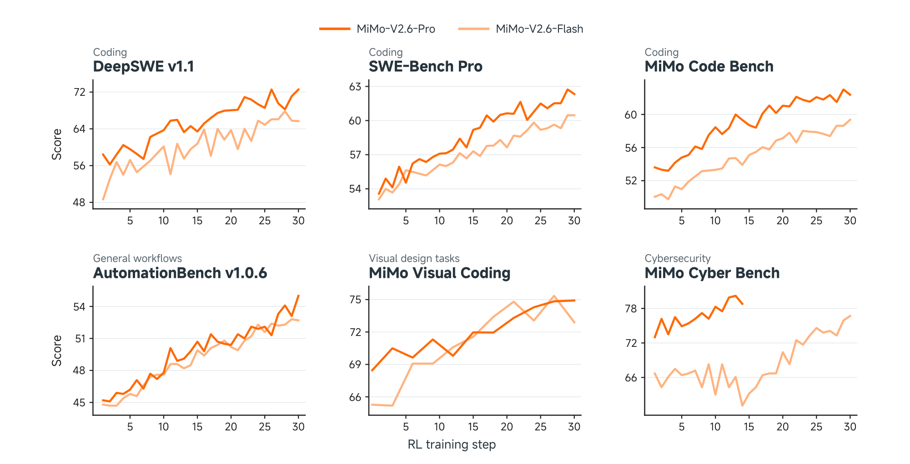
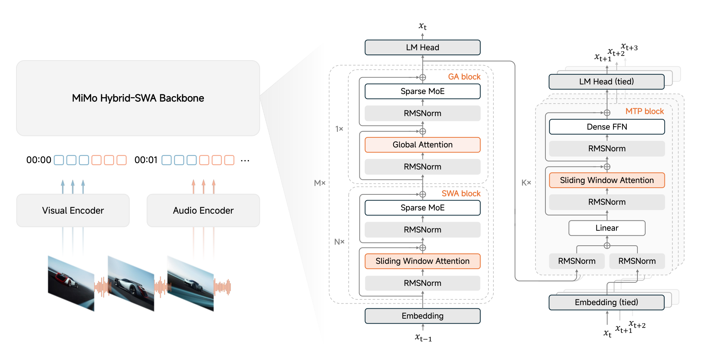
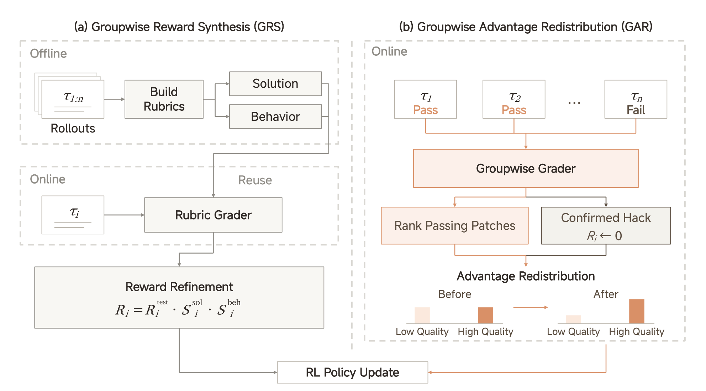
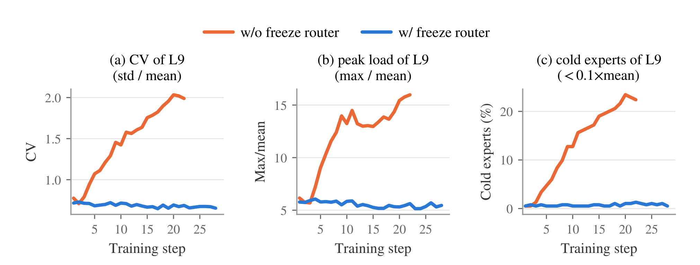
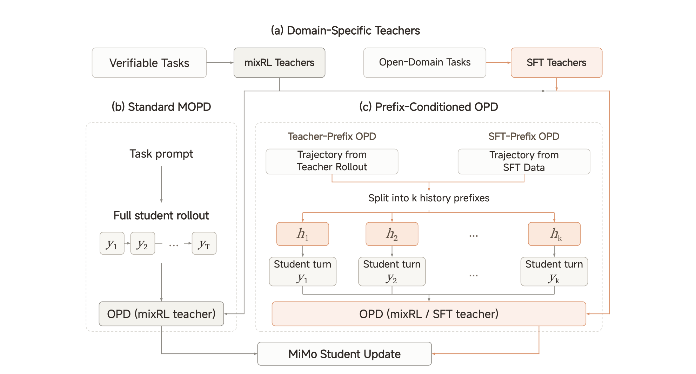

# MiMo-V2.6 技术报告

## 来源

- 原始 PDF：[raw/MiMo_V2_6_technical_report.pdf](../../raw/MiMo_V2_6_technical_report.pdf)
- 标题：MiMo-V2.6: Scaling Reinforcement Learning Towards Self-Improvement
- 版本/日期：Hugging Face `XiaomiMiMo/MiMo-V2.6-Pro-RL` 主分支 PDF，创建时间 2026-09-22；本文件没有 arXiv 号
- 团队：LLM-Core Xiaomi（通讯作者 Fuli Luo）
- 模型页：[MiMo-V2.6](../models/mimo-v2.6.md)
- 前作文本骨干与 MOPD：[MiMo-V2-Flash 技术报告](mimo-v2-flash.md)（Core Team et al., 2026，arXiv:2601.02780）

## 核心结论

MiMo-V2.6 把后训练写成一次放大的 agentic RL，再加一轮 Multi-Prefix 蒸馏。系列有两档全模态 MoE：Pro 为 1.02T 总参数 / 42B 激活，Flash 为 310B / 15B（§1、Table 1）。输入是文本、图像、视频和音频；语言建模头产出文本。报告把 RL 算力沿三轴放大：每步 1,568 条 prompt、组大小 16、约 2.7B–3.7B token，上下文直到 1M；代码、通用、视觉、网络安全环境和多种 harness 混在同一次运行里；groupwise agentic grading 给长程任务更细的奖励。稳定手段是冻结 MoE router，以及多层防 reward hacking。混合 RL 之后的 MOPD2 把难验证域接进来。

这里的 **MOPD2** 是 Multi-Prefix Multi-Teacher On-Policy Distillation 的缩写（§5.6）。它和 [Nemotron 3 Ultra](nemotron-3-ultra.md) 里「第二轮 co-evolution」也叫 MOPD2 的用法不是同一件事。

> Figure 1（原文第 1 页）：Benchmark score per task of MiMo-V2.6-Pro and MiMo-V2.6-Flash throughout RL training.

§4.1 用 DeepSWE v1.1 的 average@3 量化这次 RL：Pro 从 58.4 到 72.6，Flash 从 48.7 到 65.7。Figure 3 把终点标成 72.57 与 65.68。花费是 Pro $2.6M、Flash $0.9M。Pro 的成本拆成 rollout 43.8%、训练 43.5%、grader 12.7%。这些曲线数字和后面 Table 3 的最终榜不是同一次测量，见 [评测要点](#评测要点)。

## 架构与训练

文本骨干沿用 hybrid SWA/GA。报告把它写成 M 个 hybrid block：每个 block 是连续 N 个 Sliding Window Attention（SWA）再接 1 个 Global Attention（GA）。窗口 W = 128。SWA 与 GA 都用无 shared expert 的稀疏 MoE。唯一例外是网络第一层：GA 配 dense FFN，用来稳住早期表示（§2.1）。更完整的文本骨干描述指向 [MiMo-V2-Flash](mimo-v2-flash.md)。本报告没有把 Pro 写成 5:1；Table 1 只给层数切分。

> Figure 2（原文 §2.1）：Audio, visual, and text inputs are mapped into a shared token sequence and processed by the MiMo Hybrid-SWA backbone, followed by the language-modeling head and multi-token prediction (MTP) blocks.

| 主骨干 | Flash | Pro |
| --- | --- | --- |
| 层数（总 / SWA / GA） | 48 / 39 / 9 | 70 / 60 / 10 |
| Hidden size | 4096 | 6144 |
| SWA heads（Q / KV） | 64 / 8 | 128 / 8 |
| GA heads（Q / KV） | 64 / 4 | 128 / 8 |
| Head dim（QK / V） | 192 / 128 | 192 / 128 |
| 窗口 | 128 | 128 |
| Routed experts（总 / 激活） | 256 / 8 | 384 / 8 |
| 总参数 / 激活参数 | 310B / 15B | 1.02T / 42B |

Table 1 注明：主骨干层数不含 MTP；编码器参数含输入 embedding、不含 projector；音频 tokenizer 参数不含 EMA codebook。310B 与 1.02T 写在主骨干块里，ViT 和音频编码器另行列出；引言用同一对数字称呼整模。报告没有写编码器是否已经计入这对总参数。Flash 的 GA 只用 4 个 KV head，SWA 用 8 个；Pro 两边都是 8 个 KV head。

**MiMo-ViT**（Pro / Flash 共用，681M）。28 层里 24 层 SWA、4 层 GA，hidden 1280，32/8 heads，head dim 64。patch 为 2×16×16，SWA 左右窗口各 64，spatial merge 2×2。它把 MiMo-VL-7B 的固定不重叠窗口换成 sink-augmented SWA，局部层在行优先和列优先两种序列化之间交替，再周期插入 GA。预训练时配一个小的可训练 LLM，只在多模态理解数据上做交叉熵，不用对比学习；图像 token 超过 4T（§2.2）。细节分析指向 He et al. (2026)。

**音频**分两段（§2.3）。Audio Tokenizer（308M）吃 log-mel，两层卷积把帧率减半，再进因果 hybrid Transformer（24 层，SWA/GA 各 12，窗口 128），下采样到 25 Hz，20 层 RVQ 把每帧写成 20 个离散 token。训练配方跟随 MiMo-Audio，数据是 2,000 万小时语音、音乐和其他音频。Audio Patch Encoder（127M，6 层）与文本骨干联合训练：每个 codebook 一张 embedding，求和成帧；每 4 帧组成一个 patch，patch 内双向自注意力，拼起来再线性投影成一个骨干 embedding，帧率从 25 Hz 降到 6.25 Hz。

**推测解码**在预训练 MTP 之外另有一块 DFlash drafter（§2.4；Chen et al., 2026）。5 层全是 SWA + dense FFN，窗口 1024，Flash / Pro 的 hidden 分别是 4096 / 6144。以骨干隐状态和一个干净 anchor 为条件，一次前向预测后面 7 个 token。draft block 内双向注意，对 anchor 之前的骨干上下文最多看 1,024 个位置。

### 预训练与 mid-training

两阶段预训练（§3.1）。先只训语言骨干，再接上自研 ViT 和音频编码器，在全模态数据上联合训练。上下文从 32K 中途扩到 256K。优化器是 AdamW。

| 模型 | 文本阶段 | 全模态阶段 | 合计 |
| --- | ---: | ---: | ---: |
| Flash | 26T | 22T | 48T |
| Pro | 27T | 3T | 30T |

文本语料含网页、书籍、论文、代码和 STEM。视觉含 caption、grounding、OCR、GUI、对话、视频和 visual-coding。音频组织成语音–文本交错、ASR 和通用音频描述。

Mid-training（§3.2）把通用底座接到大规模 RL：agent 轨迹（代码、通用、视觉、研究）混上高质量文本、仓库级代码和图像 / 视频 / 音频。先在 256K 上花主要算力，最后一阶段扩到 1M。隐藏权重从 AdamW 换成 Muown（Muon 加显式行范数控制；Lion et al., 2026）。Embedding、LM head 和 MoE router 继续用 AdamW。作者写明切换 Adam 预训练模型到 Muon 可能掉点，但这次 mid-training 没有 loss spike。同一阶段做 MXFP4 量化感知训练。

## 后训练

短 SFT 之后是一次混合 RL，标题叫 You Only RL Once（§5）。任务比例：agentic 与竞赛编程 68%，通用工具 12%，审美设计 13%，上下文跟随 3%，网络安全 4%。算法是 GRPO，异步 partial rollout，staleness 为 4。损失按 prompt 平均，避免回答长度主导梯度。importance ratio 按 token 计算，训练概率来自当前训练框架，推理概率是 rollout 当时的概率，partial rollout 不重算推理概率。正负 advantage 的 clip 分开，初始都是 [0.2, 5.0]，再按策略熵在线放宽或收紧。优化器仍是 Muown，学习率 3×10⁻⁶，无 weight decay、无 warmup，梯度裁剪 1.0；Muon 动量 0.95、Nesterov、每步 10 次 Newton–Schulz、更新缩放 0.5；Adam 分量 β1 = β2 = 0.95、ε = 10⁻⁸。RL 从 SFT checkpoint 带上 FP32 master weight 和 Muown 的行状态，并冻结 router。

动态采样丢掉全对或全错的组（Yu et al., 2025，即 [DAPO](dapo.md) 一系）。partial rollout 在收齐一个训练 batch 时把未完成序列留到下一步，用大批次摊掉重新 prefill 的代价。25 个数据源上，平均生成 token 和活跃 rollout 时长分别差到 90× 和 66×（Figure 15），所以 Sample Mixer 按源调并发、调度和放置。

### 环境、harness 与 reward hacking

代码任务从 GitHub issue / PR、内部日常开发、规格驱动、CodeMidas 从源码抽功能、长程工程，再加上公开集和授权数据（§4.2.1）。监督先对齐规格和测试，再用四条 rollout 加审计 agent 找假阳性和假阴性；有参考补丁的题要求 F2P / P2P 在八次重跑里稳定。

通用任务用可重置的本地沙箱：真实文件加软件 mock，原子二元 rubric，代码检查和 LLM 检查并存；RL 时 grader 是自托管的 MiMo-V2.6-SFT（§4.2.2）。视觉任务分成开放设计和高保真复现：前者点分 rubric 稳定后再做组内比较，后者以像素相似度为主、LLM 判断为辅（§4.2.3）。网络安全做真实漏洞复现：PoC 必须同时匹配 sanitizer 报告里的漏洞类型和项目内栈帧，规则字符串匹配；任务描述和验证共用这份报告。相对 CyberGym，他们把编译好的 harness 二进制也交给 agent（§4.2.4）。

生产 harness 的工程约束不进任务奖励，模块也拆不开。训练因此用同一条最小 agent loop 重组出 Code / General / Visual / Cyber 的 mini-harness（§4.2.5）。Figure 10 上，DeepSWE v1.1 的 pass@1 在四条训练 mini-harness 和三条未参与训练的 harness（codex、claude code、mini-swe-agent）上都上升；三条 held-out 的均值大约从 50% 到 66%。

Reward hacking 的典型是仓库修复题里去网上抄已发布补丁（Table 2）。缓解叠四层：mid-training 里用「承认错误再改」的对齐样本；环境清掉构建日志、缓存和 base commit 之后的 Git 历史，并做网络隔离；hack agent 反复找剩余漏洞，直到它在所有环境里都找不到可利用路径；训练中离线审计轨迹。确认的 hacking 轨迹在 groupwise grader 里把有效奖励置 0。两条最终 RL 运行里，记录到的确认 hacking 占比全程低于 2%（§4.2.6、Figure 6）。

### Groupwise agentic grading

二元测试分不出同样通过的补丁。高通过率代码子集用离线的 Groupwise Reward Synthesis（GRS）：对照多条离线 rollout 写出 solution rubric 和 behavior rubric，训练时逐条打分，奖励相乘 $R_i = R^{\mathrm{test}}_i \cdot S^{\mathrm{sol}}_i \cdot S^{\mathrm{beh}}_i$。测试失败仍是 0；全组都通过时，两项 rubric 的乘积仍能给出差异（§4.3.1）。

其余代码任务用在线的 Groupwise Advantage Redistribution（GAR）。SFT grader 在共享工作区里对照成功和失败轨迹，按方案是否合适、实现是否有遗漏或多余退路、改动是否最小、是否伤到任务外代码、是否符合仓库习惯来给通过的补丁排序。确认依赖外部或泄漏答案的轨迹先把奖励置 0，再重算组统计。质量因子先压低质量通过者的正 advantage，再把拿掉的正质量按比例分回通过者；失败轨迹在这一步不动。公共缩放有上限。最后再减去组均值，使最终序列 advantage 组内均值为 0，并广播到该轨迹全部 response token。grader 不可用时退回原 advantage（§4.3.2）。

> Figure 7（原文 §4.3）：Groupwise agentic grading for code-agent RL. (a) Groupwise reward synthesis combines test outcomes with per-rollout scores from precomputed task-specific rubrics. (b) Groupwise advantage redistribution compares trajectories online, resets confirmed-hack rewards to zero, and redistributes sequence-level advantages.

消融是 Flash 的纯代码 RL，batch 128，token-mean 聚合（Figure 8）。没有 GAR 时轮数和总 token 涨得很快，更多轨迹顶到长度上限，通过率难以维持。有 GAR 时通过率一直改善到第 52 步，轮数大致平稳，token 长度缓增。作者另外写：没有在线评分的策略更容易出现投机兼容分支、过宽导出、吞异常和为评测改配置；有在线评分的补丁更小、更贴着任务范围。

另有组内相对长度惩罚（只罚已经成功、且组通过率超过阈值的偏长回答）和段级行为惩罚（格式错误、非法工具名、坏参数）。行为惩罚把正轨迹里的坏 token 遮掉、把负轨迹里的坏 token 放大，并尽量保住各符号的 advantage 总质量（§4.3.3）。公式里的分位、扣分上限和缩放帽没有给成具体数。

### Router 冻结

§5.4 对比两次只差「router 是否可训」的 Pro RL，看第 9 层 384 个专家。router 可训时，前 20 步负载变异系数从 0.78 升到 2.0，峰值负载从 6× 升到 16×，低于 0.1× 均值的冷专家比例从 0.5% 升到 22%。把第 20 步 checkpoint 的 router 参数换回 RL 前的初值、其余参数不动，负载回到接近初始，benchmark 不变。作者据此把坍缩归因于 router 漂移，而不是专家权重变坏，于是 RL 冻结 router。冻结运行里三项指标保持平坦（变异系数约 0.7，峰值约 5.5×，冷专家约 1%），benchmark 仍正常上升。

> Figure 11（原文 §5.4）：MiMo-V2.6-Pro expert-load balance at decoder layer 9 (384 experts) during RL, comparing runs with and without freezing the router.

本报告没有重述 V2-Flash 的 expert bias 与 sequence auxiliary loss。预训练阶段的均衡配方不能从这篇 PDF 读出来。

### MOPD2

混合 RL 之后用 MOPD2 合并不同任务的 teacher，包括难验证任务（§5.6）。它接在 [MiMo-V2-Flash 的 MOPD](mimo-v2-flash.md) 和 Ma et al. (2026) 上。可验证域仍用 mixRL teacher 监督学生的整段自主 rollout（Standard MOPD）。新增的是 prefix-conditioned 单轮（Liao et al., 2026）：一条有 k 个 assistant turn 的轨迹切成 k 个完整历史前缀，学生只从每个前缀再采样一轮，指定 teacher 按同一历史和学生已经生成的 token 做 token-level 监督。前缀来自 teacher rollout（Teacher-Prefix OPD）或 SFT 数据（SFT-Prefix OPD）。难设计奖励的开放域先训 SFT teacher；SFT-Prefix 把起点固定在示范前缀上，学生生成自己的续写，而不是照抄固定回答。报告点名的难验证域包括长程游戏开发、科学研究和具身智能。

> Figure 13（原文 §5.6）：Overview of MiMo MOPD2. (a) Domain-specialized teachers are trained with MixRL on verifiable tasks or with SFT on synthetic demonstrations for open-domain tasks. (b) Standard MOPD uses RL teachers to supervise full student rollouts. (c) Prefix-Conditioned OPD reuses trajectories from teacher rollouts or SFT data.

这篇 PDF 没有重写 V2-Flash 的 token-level KL 公式，也没有给 teacher 数量或 MOPD2 前后的分项消融。Table 3 被放在这一节末尾，称为最终评测结果。

### 训练基础设施里和一致性有关的部分

轨迹是四层：Sample → Sequence → Context → Segment。只有模型生成的 turn 进损失。Penalty Module 把基础设施失败、乱码、调用不存在的工具和重复，跟模型自己的错误分开（§6.1）。Harness Pool 用固定数量的持久 Ray actor 承载多租户 harness；Payload Porter 把重的路由、top-p 和多模态载荷放进分布式存储，driver 只调度轻元数据（§6.2）。

训练与推理对齐做了三件事（§6.4）。每次参数更新后按 rollout 所用 MXFP4 Humming GEMM 的数值约束做 quantize–dequantize，让两边看到同一份专家权重。离散专家选择仍可能翻转，所以继续用 [R3](r3.md) 重放 rollout 记下的专家下标。top-p / top-k 的训练 log-prob 在 rollout 记录的候选集上重归一化；top-p 用固定形状的全词表 bitmap 传回，避免 GPU–CPU 同步。典型 top-p 0.97 时候选集平均少于 5 个 token。上下文缓存沿用 V2-Flash 的 request-level KV：同一策略版本内后续轮只 prefill 新后缀；专家下标和候选集到 rollout 收齐才返回。多模态只传本轮新增图像。

RL rollout 默认用 block-6 DFlash，替换 SFT 继承的 MTP-3。draft 先在 SFT 策略上训练，再用早期 RL 日志按训练分布重采样微调。该默认配置下平均接受长度比 MTP 配置高 31.3%。混合任务评测里 block-6 的全局平均吞吐大约比 block-8 高 6%，平均接受长度几乎不变。长上下文上，RL 适配的 FP8 DFlash 比基线大约高 10.3% 的每节点吞吐。1M 上下文训练时，SWA 层在 context parallel 下只交换窗口能碰到的 KV。

### 开放的 9B 与环境

MiMo-V2.6-Distill-Qwen-9B 是在 Qwen3.5-9B 上用 MiMo 生成数据做的 SFT（§7.1）。混合数据 77.4B token，其中 27.2B 计入损失：代码 23.2B（损失 7.3B）、网络安全 11.0B（4.8B）、通用 22.0B（5.7B）、视觉 21.2B（9.4B）（Table 4）。放出的 RL 环境大约 7k 条任务：软件工程 3k（可执行测试）、漏洞复现 1k（规则）、知识工作 1k（rubric）、网页开发 2k（视觉评分），另有约 1k 音乐生成任务（Table 5）。从同一 SFT checkpoint 分域做 GRPO。Table 6 的代码列是单 harness RL；多 harness 是另一次实验（Table 7）。9B 在全部 21 个数据集×harness 格子上高于 Qwen3.5-9B，多 harness RL 再把每一格抬高；MiMo Code Bench (mini) 上相对 SFT 的额外增益在七个 harness 里是 1.8 到 9.3 个百分点。

## 评测要点

Table 3 是 §5.6 之后的最终对比。横线表示报告未给出。前沿列是 Claude Opus 5、GPT-5.6 Sol、Claude Fable 5。基线若可调推理力度，取该模型支持的最高档（§5.2）。

| Benchmark | Pro | Flash | V2.5 Pro | Opus 5 | GPT-5.6 Sol | Fable 5 |
| --- | ---: | ---: | ---: | ---: | ---: | ---: |
| DeepSWE v1.1 | 71.9 | 67.9 | 19.0 | 74.0 | 73.0 | 70.0 |
| ProgramBench | 26.5 | 26.0 | 12.5 | 37.0 | 25.0 | 33.0 |
| MiMo Code Bench | 63.2 | 61.2 | 40.4 | 68.6 | 59.3 | — |
| AutomationBench v1.0.6 | 53.1 | 52.3 | 16.0 | 50.3 | 45.8 | 46.2 |
| Toolathlon-Verified | 76.9 | 73.6 | 49.1 | 80.6 | 74.9 | 77.9 |
| GDPval-AA 2.1 | 1673 | — | 1107 | 1708 | 1588 | 1595 |
| Agents' Last Exam | 31.6 | 27.6 | 13.2 | 31.6 | 30.8 | 25.7 |
| Terminal Bench 4.0 | 34.9 | 28.8 | 1.5 | 49.0 | 39.9 | 42.4 |
| Terminal Bench 2.1 | 89.9 | 87.6 | 65.2 | 89.1 | 88.8 | 84.3 |
| OSWorld-Verified | 82.0 | 80.8 | — | 83.4 | 83.0 | 86.0 |
| JobBench | 62.0 | 61.2 | 25.0 | 65.7 | 45.4 | 57.4 |
| CyberGym | 94.0 | 95.1 | 40.0 | — | — | — |
| MiMo Cyber Bench | 80.2 | 77.2 | 0.0 | — | — | — |
| ExploitGym | 17.8 | 6.0 | 0.2 | 22.1 | 30.3 | 28.4 |
| ExploitBench | 47.9 | 25.3 | 16.6 | 70.0 | 78.5 | 78.0 |
| SEC Bench Pro | 66.3 | 47.5 | 17.7 | — | 79.1 | — |
| MiMo Visual Coding | 72.3 | 71.5 | — | 70.0 | 73.4 | 69.1 |

> Table 3（原文 §5.6）：Comparison of MiMo-V2.6 with previous-generation and frontier models on agentic benchmarks.

读这张表时有三条边界。第一，§4.1 的 DeepSWE average@3（Pro 72.6、Flash 65.7）是 RL 过程中的曲线；Table 3 的 71.9 / 67.9 写在 MOPD2 之后，正文没有写 Table 3 的采样次数。两套数字不能当成同一次测量的舍入。第二，CyberGym 脚注写明：评测环境按 §4.2.4 的验证方法修正过，不能直接当成 CyberGym 原文协议的分数。MiMo Code Bench、MiMo Cyber Bench、MiMo Visual Coding 是内部基准。第三，GDPval-AA 2.1 的量纲和其他百分比榜不同，表内原样保留。

9B 分域 GRPO 相对自身 SFT 的 Table 6（代码为单 harness）：SWE-bench Verified avg@3 61.1 → 66.2，SWE-bench Pro 44.6 → 47.6，Terminal Bench 2.1 avg@1 37.1 → 52.8，AutomationBench 30.3 → 33.1，MiMo Visual Coding (mini) 64.0 → 72.4，MiMo Cyber Bench (mini) 31.3 → 47.0。相对 Qwen3.5-9B，SWE-bench Pro 从 32.0 到 SFT 的 44.6，AutomationBench 从 5.0 到 30.3。内部音乐基准从 SFT 的 45.7 到 RL 的 52.5。Figure 17 的网页案例是定性对照，分数对应 Table 6 的 61.7 → 64.0 → 72.4 这条视觉轨迹。

§5.5 记录了 30 步的中断：Pro 墙钟 123.1 小时，Flash 81.8 小时。失败包括 GPU 双比特内存错误、一次 grader 网络不可达、partial rollout 把 KV 池打满、micro-batch 内专家并行 rank 收到超过均值 30 倍的 token 导致训练 OOM，以及 Flash 后期打包时的主机内存 OOM。这些是运行日志，不是能力结论。

## 待追问

- **现有材料待核**：Table 3 与 §4.1 DeepSWE 曲线的协议差（是否 average@k、是否含 MOPD2）报告没有写明。
- **现有材料待核**：MOPD2 的 token-level 监督是否仍是 V2-Flash 的 reverse-KL log-ratio，teacher 有几个、prompt 如何路由，本 PDF 都没有写。
- **需实验或作者披露**：Pro 的全模态阶段只有 3T token，Flash 有 22T。报告没有解释这组不对称。
- **需实验或作者披露**：RL 冻结 router 之后，预训练阶段的 bias 或辅助损失是否仍在更新？本报告没有给出 V2.6 的均衡配方。
- **现有材料待核**：Figure 2 与 §2 把音频和视觉写成进入骨干的编码器。这篇 PDF 没有描述语音或图像生成头。
- **需外部核验**：CyberGym 修正后的分数，以及三套 MiMo 内部基准，都还没有独立协议说明。

## 相关页面

- 模型：[MiMo-V2.6](../models/mimo-v2.6.md)
- 前作：[MiMo-V2-Flash 技术报告](mimo-v2-flash.md)、[MiMo-V2-Flash](../models/mimo-v2-flash.md)
- [Multi-Teacher On-Policy Distillation](../concepts/multi-teacher-on-policy-distillation.md)
- [On-Policy Distillation 跨报告对比](../comparisons/on-policy-distillation.md)
- [Agentic 模型的后训练](../concepts/post-training-for-agentic-models.md)
- [训练—rollout 一致性](../concepts/train-rollout-consistency.md)
- [R3：Rollout Routing Replay](r3.md)
- [MoE 负载均衡谱系](../concepts/moe-load-balancing.md)
- [高效长上下文注意力](../concepts/efficient-long-context-attention.md)
- [多 token 预测](../concepts/multi-token-prediction.md)
- [Agent harness](../concepts/agent-harness.md)
- [2026 前沿模型技术报告对比](../comparisons/2026-open-model-technical-reports.md)
