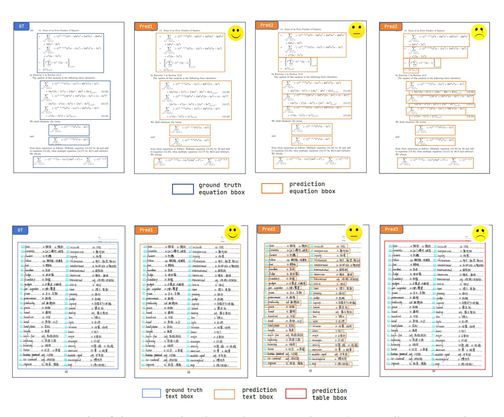

# MinerU2.5-Pro

## 来源

- PDF：`raw/2604.04771v2.pdf`（43 页）
- arXiv：[2604.04771](https://arxiv.org/abs/2604.04771)（v2，2026-04-09）
- 团队：上海人工智能实验室 + 北京大学 + 上海交通大学 + 商汤科技
- 模型：[MinerU2.5-Pro](../models/mineru-2-5-pro.md)
- 代码 / 模型：[GitHub](https://github.com/opendatalab/MinerU) / [HuggingFace](https://huggingface.co/opendatalab/MinerU2.5-Pro-2604-1.2B)

## 核心结论

MinerU2.5-Pro 的核心论点是：**当文档解析的模型架构趋于成熟，系统化数据工程（而非架构创新）成为推动性能的主要杠杆**。作者跨分析多个 SOTA 模型（跨架构、跨参数规模）在大规模真实 PDF 上的解析结果，发现它们在同一批 hard sample 上呈现高度一致的失败模式——这种超越具体架构的系统性失败指向共同根因：**训练数据的共享缺陷**，而非模型架构本身。

为验证这一假设，MinerU2.5-Pro **完全保留 MinerU2.5 的 1.2B 参数解耦 coarse-to-fine 架构**（NaViT-675M 视觉编码器 + Qwen2-0.5B 语言模型），把所有优化集中在 Data Engine 和训练策略上，确保所有性能增益可归因于数据层面。

数据瓶颈表现为两个相互交织的维度：

1. **覆盖不足**：MinerU2.5 训练数据不足 10M 页且分布集中在高频类别，复杂嵌套表格、密集公式布局等长尾场景严重欠表示。
2. **标注质量悖论**：对模型提升贡献最大的 hard sample 恰恰是自动标注最不可靠的样本——没有任何主流模型能稳定正确解析它们，结构标注高度易错，标注噪声在 SFT 中直接传播进模型行为。

> Figure 1: Performance comparison on OmniDocBench v1.6（§ 1 Introduction）。Base/Hard/Full 三层 + 单任务性能，MinerU2.5-Pro 全维度领先。

结果：在 OmniDocBench v1.6 上，MinerU2.5-Pro 取得 95.69（baseline 92.98，+2.71），超过所有现有方法，包括参数量超 200× 的模型。

## 架构与训练

### 模型架构（不变）

MinerU2.5-Pro 继承 MinerU2.5 的 1.2B 参数解耦 coarse-to-fine 架构（NaViT-675M 视觉编码器 + Qwen2-0.5B 语言模型），**无任何结构性修改**。模型从 MinerU2.5 的 Stage 0 checkpoint 初始化（提供基础视觉-语言对齐和 OCR 能力）。这是「数据中心」论点的关键控制变量：架构固定，所有增益来自数据与训练策略。

### Data Engine（核心贡献）

Data Engine 围绕三个维度协同设计——**覆盖（coverage）、信息量（informativeness）、标注准确性（accuracy）**，通过三个阶段形成 coarse-to-fine 的质量递进。

![Data Engine 总览：三个协同阶段。(1) Diversity-and-Difficulty-Aware Sampling——PDF Pool 经 ViT-Base embedding + K-Means 聚类，输出 SOTA 模型推理后做 CMCV 一致性判定；(2) Cross-Model Consistency Verification——三个异构模型（MinerU2.5 / PaddleOCR-VL-1.5 / Qwen3-VL-30B）独立推理，按 text EDIT / table TEDS / formula CDM 配对一致性分 Easy ~60% / Medium ~25% / Hard ~15%；(3) Annotation Pipeline for Hard Case——Judge-and-Refine（原图 + 渲染图配对输入 Judger/Refiner，N 轮 re-render re-compare）+ Targeted Expert Annotation（Gemini 3 Pro 预标注 + 人工专家）。最终产出 ~65.5M 自动标注样本 + ~192K 专家标注 Hard 样本。](../assets/mineru-2-5-pro/fig2-data-engine-pipeline.png)

> Figure 2: Overview of the Data Engine pipeline（§ 3 Data Engine）。三个组件分别对应覆盖、信息量、准确性三个维度。

#### (1) DDAS — Diversity-and-Difficulty-Aware Sampling

DDAS 在页级和元素级两个粒度联合优化多样性和难度。核心是 CMCV 提供的难度标签指导采样权重分配。

> Figure 3: The DDAS pipeline operates at two granularity levels（§ 3.1）。

- **页级采样**：页用 ViT-base 特征（512 维）+ K-Means 聚类。每簇先均匀采样做页级 CMCV 得难度标签，再按难度分布调权——Easy 主导簇降权、难度多样簇升权、无效内容簇（非目标语言/空白页）滤除。
- **元素级采样**：从页级候选集用 MinerU2.5 + PaddleOCR-VL layout detection 抽出 text/formula/table 块，每类元素独立聚类 + 元素级 CMCV 标难度。
- **最终采样**：在联合 cluster-difficulty 空间平衡采样——多样性维度大簇降采样/小簇上采样纠正长尾偏移，难度维度 Medium/Hard 上加权提升训练信号信息量。

DDAS 与 MinerU2.5 的 IMIC、PaddleOCR-VL-1.5 的 UACS 的关键区别：**两者都用单模型推理一致性做难度代理**（只能捕获单模型的认知不确定性），无法区分「模型特定盲点」与「普遍难题」。CMCV 把难度评估从单模型内省扩展到多模型交叉验证。

#### (2) CMCV — Cross-Model Consistency Verification

CMCV 的前提：多个异构模型对同一样本输出一致时结果大概率正确；全部显著分歧时样本确实困难、无模型可可靠解析。

运行三个异构文档解析模型（MinerU2.5、PaddleOCR-VL、Qwen3-VL-30B）独立推理候选数据，计算任务特定配对一致性指标（text: edit distance；table: TEDS；formula: CDM），按一致性模式分三档。**因 MinerU2.5 是待改进目标，难度分类锚定在其相对外部模型的表现**：

| 难度 | 一致性模式 | 标注策略 | 训练价值 |
| --- | --- | --- | --- |
| Easy | MinerU2.5 与 ≥1 外部模型高度一致 | 任一模型输出可直接作标注 | 主干基础能力，但模型已掌握，边际价值有限 |
| Medium | 两外部模型互相一致、MinerU2.5 显著不同 | 外部共识作可靠 pseudo-label | **最高训练价值**——精确定位 MinerU2.5 相对同行的能力缺口，且外部成功证明可学，共识直接给可靠标注 |
| Hard | 三模型两两显著分歧、无共识 | 须经 Judge-and-Refine 或专家标注 | 能力突破关键，但标注不可靠 |

三档在训练中角色不同：Easy 量大可靠但边际价值低；Medium 最宝贵（稀少）所以在 DDAS 采样中优先提其占比；Hard 关键但标注不可靠。各子任务最优比例不同——公式和表格对 Hard 更敏感，文字识别更受益于 Medium。

#### (3) Annotation Pipeline for Hard Case

CMCV 为 Easy/Medium 提供可靠自动标注。Hard 样本若直接用于训练会引入噪声反而降性能。核心挑战是把 Data Engine 从「过滤」推进到「精修」。

**Judge-and-Refine 标注流水线**。自然的思路是引入 test-time compute 让模型迭代自检自纠。但朴素 self-reflection 有系统性偏差：**模型倾向于肯定自己的输出**（被问检查时倾向认为正确、忽略错误）。根因在跨模态映射的不对称——模型擅长从文档图像生成结构化序列，却不擅长从结构化序列推断视觉外观。对 LaTeX 公式、HTML 表格这类复杂结构映射，模型无法准确判断输出序列在隐式空间会如何渲染，难以发现结构错误。

为打破此瓶颈，引入 **render-then-verify** 到迭代纠正回路：把 LaTeX 公式编译 / HTML 表格渲染成图像，把**原图 + 渲染图作为配对输入**连同 judge-and-refine prompt 喂给模型。两个好处：(1) 闭合「结构化文本 → 视觉布局」的缺失映射，降低跨模态推理负担；(2) 渲染的误差放大效应把文本域细微结构缺陷（缺失对齐符、未闭合标签）放大为显著视觉异常或布局崩塌，便于视觉比对发现。

流水线用 **Qwen3-VL-235B 作 Judge-Refine 模型**——选它因强多模态推理能力且独立于 CMCV 模型池，避免误差检测的系统性偏差。多轮误差定位 + 定向纠正通过原图与渲染图直接视觉比对进行。仍无法自动纠正的极复杂样本转入专家标注。

**Targeted Expert Annotation**。对 Judge-and-Refine 之后的残余 Hard 样本引入专家人工标注。标注预算沿两优先轴分配：(1) **纠正效率**——Judge 阶段已高置信定位错误但 Refine 阶段纠正失败的样本优先（标注员只需在定位处做局部纠正，最大化吞吐）；(2) **边际影响**——在上述池中优先选当前模型最弱的子任务类别（由 CMCV 分歧模式判定），最大化有限标注预算对整体性能的边际贡献。人工标注走 AI 预标注 + 专家复核流程，预标注用 **Gemini 3 Pro**（独立于 CMCV 池，避免数据泄漏），自动化 QA 工具保证一致性。

**Data Engine 产出**：分层数据集——约 65.5M Easy+Medium 样本（CMCV 自动标注）用于 Stage 1 预训练；192K 专家标注 Hard 样本用于 Stage 2 微调和 Stage 3 GRPO 对齐。

### 三阶段渐进训练

三阶段对应 Data Engine 产出的不同质量层级，从数据规模到数据质量递进。配置见 Table 1（关键差异在数据源、数据规模、学习率）。

| 参数 | Stage 1 预训练 | Stage 2 Hard-SFT | Stage 3 GRPO |
| --- | --- | --- | --- |
| 数据类型 | Layout & OCR + 图像分析 | 同左 | Layout/Text/Formula/Table |
| 样本数 | 65.5M | 3.9M（含 192K 人工标注） | 192K |
| 可训练 | 全部 | 全部 | 全部 |
| 序列长度 | 8192 | 8192 | 8192 |
| Batch Size | 256 | 128 | 512 |
| ViT 学习率 | 1e-4 | 5e-6 | 1e-7 |
| MLP/LLM 学习率 | 1e-3 | 5e-5 | 1e-5 |
| Epoch | 1 | 1 | 1 |

> 视觉配置三阶段一致：Max Resolution 2048×28×28，64–2048 tokens/image。Stage 3 采样 G=16 rollouts/sample。

**Stage 1：大规模预训练**。训练集为 Data Engine 产出的 Easy+Medium 样本，CMCV 多模型共识作标注。覆盖四核心子任务共约 65.5M：文字识别 21M、布局分析 14M、公式识别 13M、表格识别 11.5M，另加 6M 图像分析（图表、文内图等）。子任务比例按 OmniDocBench 总分权重和 baseline 每任务性能差距调整。对比 MinerU2.5 Stage 1（6.9M samples/epoch × 2 epochs），本阶段数据规模扩近一个数量级（6.9M → 65.5M），质量也经 DDAS 分布纠正 + CMCV 标注过滤系统提升。

**Stage 2：高质量 Hard-SFT**。Stage 1 建综合基础能力后，Hard 样本仍有性能缺口。本阶段用高质量专家标注数据定向微调，同时按子任务混入 Stage 1 replay 数据防灾难性遗忘。Hard:Replay 混比按子任务区分：布局 6:1、文字 1:50、公式 1:25、表格 1:10、图像分析 1:4。非均匀混比反映各子任务 hard 样本量和 baseline 性能差异——布局 hard 样本多且 Stage 1 基础强需较少 replay；文字 hard 样本稀缺需更多 replay 保泛化。在 Stage 1 基础上降学习率到 5e-5 保护已获能力。

**Stage 3：GRPO 对齐**。前两阶段用监督学习优化内容识别准确率。但交叉熵损失独立优化每个 token 预测、等权对待所有 token，不直接反映 sequence-level / structure-level 评测指标（edit distance、CDM、TEDS、IoU）。本阶段用 RL 直接优化任务级指标弥合训练目标与评测指标的鸿沟。

采用 [GRPO](../comparisons/llm-rl-policy-optimization.md)（Group Relative Policy Optimization）：每输入采 G 组候选输出，用任务特定自动评测指标直接算 reward，按组内相对 advantage 指导策略更新，无需单独 reward model。**Reward 设计**：四子任务分别设计，直接采用与评测相同的指标作 reward 信号——文字识别 edit distance、公式 CDM、表格 TEDS、布局 category IoU。训练数据由 Stage 2 模型 rollout 生成，按 reward 分布过滤：过高 reward（模型已饱和无有效学习信号）和过低 reward（样本过难或标注错误）剔除，保留中段 reward 区最大化有效 policy gradient 信号；全部来自高质量专家标注集保证 reward 信号可靠。沿用 [DAPO](../sources/dapo.md) 的 clip-higher 稳定 advantage 估计 + dynamic sampling 丢弃零方差 rollout 组。

## 评测要点

### OmniDocBench v1.6（评测协议贡献）

除数据外，跨分析也暴露了现有评测框架的盲区。MinerU2.5-Pro 因此升级 OmniDocBench 到 v1.6，从两个方面修正：

**修正匹配策略偏差——MGAM（Multi-Granularity Adaptive Matching）**。v1.5 用固定粒度一对一元素匹配，会默默惩罚输出分割与 ground truth 不同的系统——即便解析内容完全正确。典型场景：一个跨 k 行的多行公式被标注为单个块，若模型产出相同 LaTeX 但分成 k−1 或 k 个块，分数从满分骤降到接近零；密集文字区域类似（被标为一个块的可能被逐行预测甚至识别成表格，后者因无文字元素可匹配 v1.5 直接给零分）。

> Figure 4: Examples of element-matching bias in OmniDocBench v1.5（§ 5.1 Motivation）。

MGAM 在**预测端**搜索最优分割粒度（ground truth 不变）三阶段选全局最优：(1) 直接二部图匹配；(2) 预测元素按 LaTeX 换行符（`\`、`\newline` 等）分裂后重匹配；(3) 枚举所有有效连续子序列有序划分（n′ 元素有 n′−1 间隙，每个可「分」或「合」，共 2^(n′−1) 种方案），每种做二部图匹配取最优。密集文字同样复用 MGAM（edit distance 作相似度），若模型把文字区识别成表格则转回纯文本纳入同一匹配流程。MGAM 使评测对输出粒度和格式偏好中立。

**补充 Hard 子集——三层评测协议**。从 Data Engine 难度分层标注的 Hard 池中选 296 页构造 Hard 子集，覆盖最具挑战性的场景（复杂嵌套表格、密集数学公式布局、非常规布局结构）。Hard 子集排除出 MinerU2.5-Pro 所有训练阶段（含 Judge-and-Refine 训练数据），由专业团队标注 + 标注者交叉验证。建立 Base/Hard/Full 三层：Base 1,355 页（原 v1.5 评测集保可比性）、Hard 296 页、Full 1,651 页（全集）。

### 主结果

Table 2（OmniDocBench v1.6 Full，统一环境重测所有模型）：

| 模型 | 类型 | 参数 | Overall↑ | TextEdit↓ | FormulaCDM↑ | TableTEDS↑ | TableTEDS-S↑ | ReadOrderEdit↓ |
| --- | --- | --- | --- | --- | --- | --- | --- | --- |
| **MinerU2.5-Pro** | 专用 VLM | 1.2B | **95.69** | 0.036 | 97.29 | 93.42 | 95.92 | 0.120 |
| GLM-OCR | 专用 VLM | 0.9B | 95.15 | 0.044 | 96.99 | 92.83 | 95.39 | 0.133 |
| PaddleOCR-VL-1.5 | 专用 VLM | 0.9B | 94.87 | 0.038 | 96.69 | 91.67 | 94.37 | 0.130 |
| Youtu-Parsing | 专用 VLM | 2.5B | 93.68 | 0.044 | 93.45 | 92.02 | 95.00 | 0.116 |
| MinerU2.5 | 专用 VLM | 1.2B | 92.98 | 0.045 | 95.59 | 87.88 | 91.47 | 0.130 |
| HunyuanOCR [32] | 专用 VLM | 1B | 89.87 | 0.089 | 87.44 | 91.01 | 93.23 | 0.171 |
| Ovis2.6-30B-A3B | 通用 VLM | 30B | 93.62 | 0.035 | 94.93 | 89.44 | 92.40 | 0.135 |
| Gemini 3 Pro | 通用 VLM | – | 92.85 | 0.064 | 95.83 | 89.15 | 92.96 | 0.165 |
| Qwen3-VL-235B | 通用 VLM | 235B | 89.78 | 0.063 | 92.53 | 83.07 | 86.75 | 0.166 |
| GPT-5.2 | 通用 VLM | – | 86.52 | 0.114 | 88.00 | 82.95 | 87.93 | 0.193 |

> 注：MinerU2.5-Pro 引用 [32] = HunyuanOCR **1.0**（arXiv:2511.19575），不是 [HunyuanOCR-1.5](hunyuan-ocr-1.5.md)（arXiv:2607.04884，2026-07）。本表 89.87 是 HunyuanOCR 1.0 在统一环境下的重测分。

MinerU2.5-Pro Full 95.69 居首，比同架构 baseline（92.98）+2.71，确认增益全来自数据。Base 子集前三（GLM-OCR 96.19、MinerU2.5-Pro 96.12、PaddleOCR-VL-1.5 95.72）在 0.5 分内，标准场景近饱和。**Hard 子集 MinerU2.5-Pro 94.08 领先 GLM-OCR 和 PaddleOCR-VL-1.5（均 92.01）+2.07**，证明 Data Engine 在 hard 场景鲁棒性上的优势，也验证 Hard 子集的区分力。子指标上 MinerU2.5-Pro 在公式（CDM 97.29）、表格（TEDS 93.42 / TEDS-S 95.92）、阅读顺序（0.120）均最优。

### 训练阶段消融（Table 3）

| 阶段 | Base | Hard | Full | ΔFull | Text↓ | CDM↑ | TEDS↑ |
| --- | --- | --- | --- | --- | --- | --- | --- |
| MinerU2.5 baseline | 93.23 | 91.65 | 92.98 | — | 0.045 | 95.59 | 87.88 |
| Stage 1：大规模 SFT | 94.54 | 93.10 | 94.29 | +1.31 | 0.039 | 96.40 | 90.37 |
| + Stage 2：Hard-SFT | 95.60 | 93.84 | 95.25 | +0.96 | 0.036 | 96.48 | 92.87 |
| + Stage 3：GRPO | 96.12 | 94.08 | 95.69 | +0.45 | 0.036 | 97.29 | 93.42 |

Stage 1（大规模 SFT）单阶段贡献最大（+1.31），说明 Data Engine 对数据覆盖和标注质量的优化是性能提升主驱动。Stage 2（Hard-SFT）+0.96，表格识别贡献最显著（TEDS 90.37→92.87，+2.50）。Stage 3（GRPO）+0.45，主要体现在公式 CDM（96.48→97.29，+0.81），由 RL 直接优化任务级指标驱动。Hard 子集累计提升（91.65→94.08，+2.43）与 Base（93.23→96.12，+2.89）相当，渐进训练在 hard 和标准场景均平衡提升。

### 元素级解析

为排除布局检测误差的级联混淆，按 ground truth 布局框裁剪文档图像，单独测 text/formula/table 三个模块（注意端到端模型在此设置下无元素类别先验，可能部分解释其较大差距）。

- **文字识别**（Table 4）：MinerU2.5-Pro Full edit distance 0.019 居首，比 baseline（0.028）降 30.5%。
- **公式识别**（Table 5，9 个 benchmark）：MinerU2.5-Pro 5 维最优、4 维次优。HWE（手写公式）弱于 Qwen3.5-397B（95.38 vs 97.59），SCE 弱于 GLM-OCR（97.04 vs 97.77）。OmniDoc Base CDM 99.20 接近天花板。Qwen3.5-397B 手写公式强但中文公式弱（Chinese 78.24）。
- **表格识别**（Table 6，多 benchmark）：MinerU2.5-Pro Overall TEDS 91.10 / TEDS-S 94.48 居首，比 baseline +3.16/+2.31。Hard 子集优势最显著（TEDS 92.46 vs 88.28，+4.18），说明 Data Engine 的 hard sample 挖掘和专家标注对表格识别贡献最大。

## 跨源评测分歧

**同一模型（HunyuanOCR 1.0）在两个来源的 OmniDocBench v1.6 分数不一致**：

- [HunyuanOCR-1.5 报告](hunyuan-ocr-1.5.md)自报表中：HunyuanOCR-1.0 = 92.03（OmniDocBench v1.6）。
- 本报告 Table 2 统一环境重测：HunyuanOCR [32，即 1.0] = 89.87（Full）。

差约 2.16 分。本报告明确「所有竞争模型在统一环境用相同评测代码重测」，并指出 v1.5 存在匹配偏差、v1.6 用 MGAM 修正。分歧根因未在两篇报告中直接说明（可能与匹配逻辑、评测代码、test 子集版本有关），此处仅记录事实，不归因。这恰好是 MinerU2.5-Pro 论证「评测匹配偏差使跨系统比较不可靠」的活案例——**读 OmniDocBench v1.6 分数时，须区分自报分与统一重测分**。

## 待追问

- **HunyuanOCR 1.0 的 92.03 vs 89.87 分歧根因**：是 MGAM 修正、统一评测代码、还是 test 子集差异导致？需要用同一份 HunyuanOCR 1.0 checkpoint 在两套评测流程下复现。注意 MGAM 一般会提分（消除粒度惩罚），而此处统一重测反而更低，暗示差异主要来自评测环境而非单纯 MGAM。
- **CMCV 三模型池的选择偏差**：MinerU2.5、PaddleOCR-VL、Qwen3-VL-30B 三者能力接近时，Medium（外部一致、MinerU 不同）的判定是否稳定？若换外部模型池，Easy/Medium/Hard 划分会否显著变？
- **Judge-and-Refine 的 Qwen3-VL-235B 与 CMCV 池中 Qwen3-VL-30B 同源**：虽论文称 235B「独立于 CMCV 模型池」，但同族模型可能有共享盲点，render-then-verify 是否对同族盲点有效？
- **192K 专家标注 Hard 样本的子任务分布**：Table 1 给 Stage 2 总 3.9M（含 192K 人工），但 192K 在 layout/text/formula/table/image 间如何分配未明确，Hard:Replay 混比差异（文字 1:50 vs 布局 6:1）暗示分布极不均。
- **GRPO Stage 3 的 mid-reward 过滤阈值**：论文称剔除过高/过低 reward 保留中段，但阈值区间未给，是否因子任务而异未说明。
- **「200× 参数」对比口径**：Figure 1 / 摘要称超过 200× 参数模型，主表最大通用 VLM 是 Qwen3-VL-235B（~196×），口径基本成立但 GPT-5.2 / Gemini 3 Pro 参数未公开，「200×」是约数。

## 相关页面

- [MinerU2.5-Pro](../models/mineru-2-5-pro.md) - 模型身份页
- [MinerU2.5](mineru-2-5.md) - 基座模型，本报告完全继承其架构不变；本报告 CMCV 改进其 IMIC（单模型内省 → 多模型交叉验证），Data Engine 三组件协同改进其独立三阶段
- [GLM-OCR](glm-ocr.md) - 头号竞争者，v1.6 上 95.15 < MinerU2.5-Pro 95.69；MTP 加速路线 vs 数据中心方法论路线对照（GLM-OCR 自报 v1.5 = 94.62，本报告 v1.6 统一重测 = 95.15，符合 MGAM 提分预期）
- [HunyuanOCR-1.5](hunyuan-ocr-1.5.md) - 同属轻量文档解析 VLM，自报 HunyuanOCR-1.0 分数与本报告统一重测分存在分歧（见「跨源评测分歧」）
- [Agentic 评测体系](../concepts/agentic-evaluation-benchmarks.md) - OmniDocBench v1.6 的 MGAM 修正 + Hard 子集是「评测方法论」跨域信号
- [LLM RL policy optimization 对比](../comparisons/llm-rl-policy-optimization.md) - Stage 3 GRPO + DAPO recipe 的非 agentic（文档解析格式对齐）应用
- [DAPO](dapo.md) - Stage 3 沿用 clip-higher + dynamic sampling
- [数据混合优化](../concepts/data-mixture-optimization.md) - Data Engine 是 data-centric AI 的另一分支（难度感知采样 + 标注精修），区别于 domain reweighting
