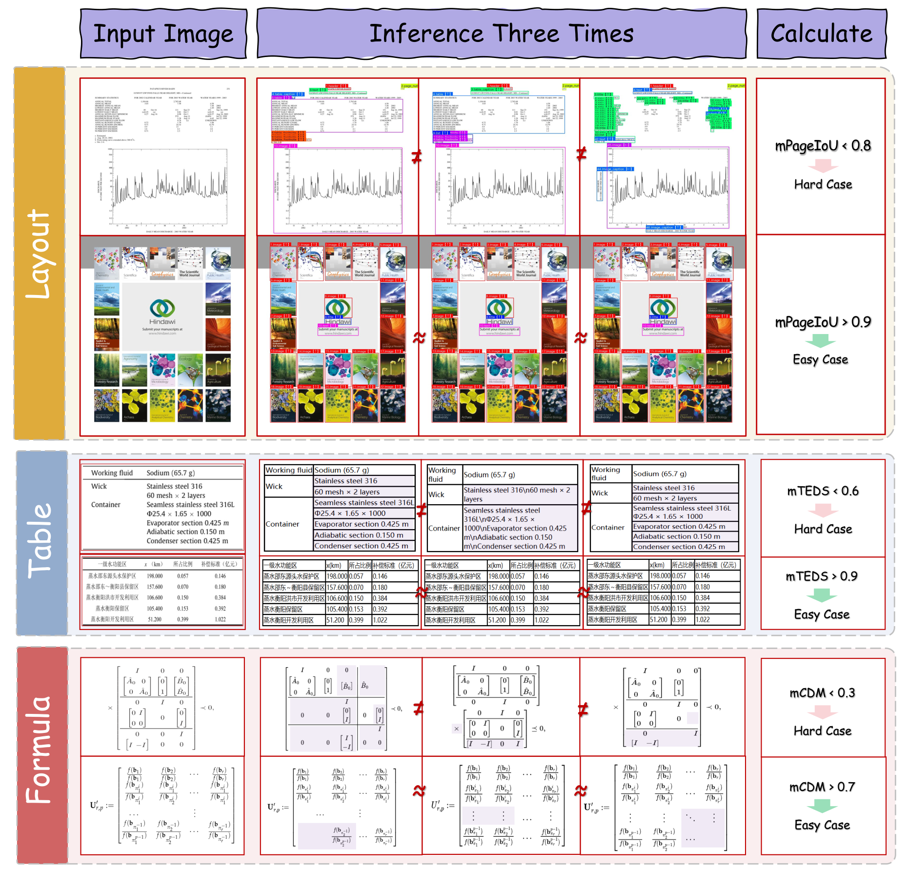

# MinerU2.5

## 来源

- PDF：`raw/2509.22186v2.pdf`（57 页）
- arXiv：[2509.22186](https://arxiv.org/abs/2509.22186)（v2，2025-09-29）
- 团队：上海人工智能实验室 + 北京大学 + 上海交通大学
- 模型：[MinerU2.5](../models/mineru-2-5.md)
- 代码 / 模型：[GitHub](https://github.com/opendatalab/MinerU) / [HuggingFace](https://huggingface.co/opendatalab/MinerU2.5-2509-1.2B)
- **定位**：[MinerU2.5-Pro](mineru-2-5-pro.md) 的基座模型，本报告的 IMIC 是 MinerU2.5-Pro CMCV 的直接改进对象。

## 核心结论

MinerU2.5 是 1.2B 参数文档解析 VLM，核心是 **coarse-to-fine 解耦两阶段解析策略**：Stage I 在下采样图上做高效布局分析识别结构元素（避开高分辨率输入的计算开销），Stage II 在全局布局指导下对原生分辨率裁剪做定向内容识别（保密集文本、复杂公式、表格的细节）。配合一套 Data Engine 生成大规模多样训练语料。

架构：NativeRes-ViT（675M）视觉编码器 + LM Decoder（0.5B，Qwen2）。这一架构被 [MinerU2.5-Pro](mineru-2-5-pro.md) **完全继承不变**，作为「数据中心」论点的控制变量。

## 架构与训练

### 两阶段解析策略

- **Stage I 布局分析**：输入图均匀下采样到 1036px，模型快速识别结构元素（标题、段落、表格、公式、图等）+ 旋转方向，输出按阅读顺序的区域描述。
- **Stage II 内容识别**：按 Stage I 布局裁剪原生分辨率区域，并行识别（文字 / 公式 / 表格），按序合并输出 Markdown。裁剪保留细节，并行解码提效。

### 训练配方

| Stage | 阶段 | 数据 / 规模 |
| --- | --- | --- |
| Stage 0 | 模态对齐 | 建立基础视觉-语言对齐和 OCR 能力（[MinerU2.5-Pro](mineru-2-5-pro.md) 从此 checkpoint 初始化） |
| Stage 1 | 文档解析预训练 | 6.9M samples/epoch × 2 epochs（[MinerU2.5-Pro](mineru-2-5-pro.md) 扩到 65.5M） |
| Stage 2 | 文档解析微调 | 630K samples × 3 epochs：43K layout + 300K text + 147K formula + 140K table |

数据增强（Table 2）：空间变换（缩放/网格畸变/旋转）+ 背景变换（纹理/天气/水印/扫描线/阴影）+ 颜色变换 + 退化变换（多种模糊/腐蚀膨胀）。空间变换不用于布局分析样本。

### 任务重构

- **公式 ADR 框架**（Figure 5）：复合公式先原子分解（布局分析拆成原子行）→ 各行单独识别为 LaTeX → 结构重组为完整块。把难题拆成简单题。
- **表格 OTSL**（Figure 6）：用 OTSL（Optimized Table-Structure Language）替代 HTML 作生成目标——5 个结构 token vs HTML 28+，序列长度缩短约 50%。四阶段：表格检测 + 旋转检测 → 裁剪旋转校正 → OTSL 识别 → OTSL 转 HTML。

## Data Engine

> Figure 3: Overview of the Data Engine（§ 4.1）。三阶段：Data Curation → Pre-training Preparation → Fine-tuning Construction。

Data Engine 三阶段（**注意：三阶段独立运作，未联合优化**——这正是 [MinerU2.5-Pro](mineru-2-5-pro.md) 改进的痛点）：

### (1) Data Curation

从大规模多源 PDF 语料（网络可访问 / 内部采购 / 公开数据集）按四维过滤建中英平衡集：
- **布局多样性**：页级图像聚类选多种视觉布局
- **文档类型多样性**：按元数据（学科、标签）分层采样（论文 / 教材 / 报告 / 演示）
- **元素平衡**：预检测模型保证标题/段落/表格/公式/图等关键元素类别均衡
- **语言平衡**：中英可比体量

### (2) Pre-training Dataset Preparation

自动标注 + 用强模型精修：文字用 QwenVL、公式用 UniMERNet、表格用 Self-TabR，结合模型输出与 ground truth（Table TEDS / Formula CDM / Layout PageIoU）做质量改进。

### (3) Fine-tuning Dataset Construction — IMIC

**IMIC（Iterative Mining via Inference Consistency）** 是 MinerU2.5 的 hard case 挖掘策略，也是 [MinerU2.5-Pro](mineru-2-5-pro.md) CMCV 的直接改进对象。

> Figure 7: IMIC strategy（§ 4.3）。三任务（Layout/Table/Formula）各自的一致性阈值。

**核心原理**：利用模型推理的随机性。对一样本多次随机推理，若模型已学会该样本则输出一致（easy），若未学会则输出分歧大（hard）。低一致性样本 = hard case = 送人工标注。

| 任务 | 一致性指标 | Hard 阈值 | Easy 阈值 |
| --- | --- | --- | --- |
| Layout | mPageIoU | < 0.8 | > 0.9 |
| Formula | mCDM | < 0.3 | > 0.7 |
| Table | mTEDS | < 0.6 | > 0.9 |

**IMIC 的局限（MinerU2.5-Pro 的改进动机）**：IMIC 用**单模型多次推理**一致性做难度代理，只能捕获单模型的认知不确定性，**无法区分「模型特定盲点」与「普遍难题」**——前者可通过跨模型共识直接修正，后者需额外质量精修或人工干预。[MinerU2.5-Pro](mineru-2-5-pro.md) 的 CMCV 把难度评估从单模型内省扩展到多模型交叉验证（MinerU2.5 + PaddleOCR-VL + Qwen3-VL-30B 三异构模型），按「待改进模型相对外部的表现」分 Easy/Medium/Hard，Medium（外部一致、待改进模型不同）训练价值最高。详见 [数据混合优化](../concepts/data-mixture-optimization.md)。

## 评测要点

OmniDocBench（1,355 页，平均 >1100 token/页）上 SOTA，超通用和专用模型。推理效率（Table 3）：

| 硬件 | tokens/s | pages/s |
| --- | --- | --- |
| RTX 4090 48G | 1875.82 | 1.70 |
| A100 80G | 2337.25 | 2.12 |
| H200 141G | 4938.31 | 4.47 |

对比（A100）：MonkeyOCR-pro-3B 0.47 pages/s、dots.ocr 0.28 pages/s。MinerU2.5 吞吐约为 MonkeyOCR-pro-3B 的 4×、dots.ocr 的 7×。

部署优化：vLLM 异步后端批处理页级请求；按 Stage I 检测的布局类型动态调 frequency/presence penalty 抑制退化重复（文本段高惩罚、表格低惩罚）；调 max_num_batched_tokens / max_num_seqs / cuda graph sizes 提批利用率和 kernel 效率。

## 待追问

- **IMIC 的随机性来源**：多次推理的随机性来自采样温度还是 dropout？论文未明确。不同随机源对 hard case 识别稳定性影响几何？
- **IMIC 阈值的依据**：PageIoU 0.8/0.9、CDM 0.3/0.7、TEDS 0.6/0.9 的阈值如何确定？是否按任务难度校准？MinerU2.5-Pro 的 CMCV 沿用任务特定指标但改三档划分，未沿用这些阈值。
- **Stage 0 模态对齐的数据规模**：Stage 0 是 MinerU2.5-Pro 的初始化点，但本报告对 Stage 0 数据描述较少，是否就是 MinerU2-VLM 的对齐数据？
- **OTSL 与 GLM-OCR 的 MTP 是否兼容**：OTSL 把表格结构 token 从 28+ 压到 5，序列缩短 50%——这与 [GLM-OCR](glm-ocr.md) MTP 多 token 预测是否可叠加？OTSL 的极简 token 集可能让 MTP 接受率更高。
- **Data Engine 三阶段独立运作的具体表现**：MinerU2.5-Pro 批评「采样不被难度告知、标注精修不分难度、IMIC 挖的 hard case 标注仍不可靠」——本报告是否承认这些局限？§4 描述偏工程流水线，缺对三阶段协同不足的自评。

## 相关页面

- [MinerU2.5](../models/mineru-2-5.md) - 模型身份页
- [MinerU2.5-Pro](mineru-2-5-pro.md) - 直接继承本架构不变，Data Engine 三组件协同改进本报告独立三阶段，CMCV 改进 IMIC
- [GLM-OCR](glm-ocr.md) - 同属轻量文档解析 VLM，GLM-OCR v1.5 上 94.6 vs MinerU2.5 90.7；OTSL vs MTP 路线对照
- [HunyuanOCR-1.5](hunyuan-ocr-1.5.md) - 同属轻量文档解析 VLM
- [数据混合优化](../concepts/data-mixture-optimization.md) - IMIC（单模型内省）vs CMCV（多模型交叉验证）对照
