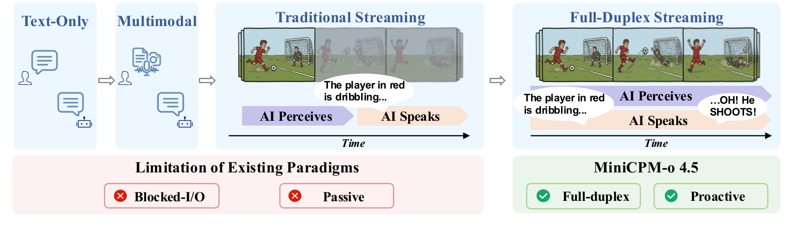
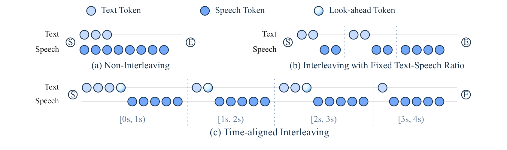

# MiniCPM-o 4.5: Towards Real-Time Full-Duplex Omni-Modal Interaction

## 来源

- **PDF**：`raw/2604.27393v1.pdf`（22 页）
- **标题**：MiniCPM-o 4.5: Towards Real-Time Full-Duplex Omni-Modal Interaction
- **arXiv**：2604.27393v1，2026-04-30
- **团队**：MiniCPM-o Team, OpenBMB（清华自然语言处理实验室，通讯作者 Maosong Sun / Zhiyuan Liu / Yuan Yao）
- **模型**：[MiniCPM-o 4.5](../models/minicpm-o-4-5.md)

## 核心结论

MiniCPM-o 4.5 是**首个全双工全模态 LLM**（9B 总参数），能同时看、听、说，并基于对实时场景的持续理解发出主动行为（提醒、评论）。其核心技术是 **Omni-Flow** 框架：将多模态输入输出流沿共享时间轴对齐，把传统回合制交互转化为时间细粒度窗口内的局部更新，从而自然逼近全双工行为。

关键定位：
- 9B 参数，VL 能力接近 Gemini 2.5 Flash，在同等规模开源模型中达到 SOTA
- 全模态理解超过 Qwen3-Omni-30B-A3B（9B vs 30B-A3B），语音生成质量更优
- 端侧可运行：INT4 量化下 < 12GB RAM，llama.cpp-omni 框架 RTX 4090 RTF 0.21
- 同时支持全双工流式模式和传统回合制模式（兼容 MiniCPM-o 2.6 / MiniCPM-V 4.5 的用法）

> Figure 3（原文截图，§ 1 Introduction）："From turn-based interaction to full-duplex streaming."

## 架构与训练

### 端到端全模态架构

架构由三部分组成，通过 token-level hidden state 端到端可微连接（约 9B 可学习参数）：

1. **多模态编码器**：视觉编码器（继承 MiniCPM-V 4.5 的 LLaVA-UHD 图像分区 + SigLIP）+ 音频编码器（Whisper Medium 0.3B，chunk-based 流式，50 token/s → 5× 压缩 → 10 audio token/s）
2. **LLM backbone**：Qwen3-8B，生成文本 token + hidden state。关键设计决策：LLM 只生成文本域 token（3-4 step/s，人类语速），不直接生成语音 token（通常 ~25 token/s），避免效率瓶颈和语言能力退化
3. **语音解码器**：interleaved speech token decoder（~0.3B Llama 架构）将 LLM hidden state + speech decoder hidden 相加生成 S3 语音 token；streaming flow-matching decoder 将语音 token 转为音频波形（基于参考音频支持 voice cloning）

> Figure 4（原文截图，§ 2 End-to-End Omni-Modal Architecture）："End-to-end omni-modal architecture of MiniCPM-o 4.5."

### Omni-Flow 框架

核心思想来自**时分复用**：把连续交互切分为细粒度时间窗口（duration t），每个窗口内模型同时接收新输入并生成输出。三条时间对齐流：

- **env-visual**：环境视觉观测
- **env-audio**：声学场景（含用户语音——用户请求不再有特殊对话角色，而是作为世界状态的一部分进入 env-audio）
- **out-stream**：助手文本 + 语音输出

第 k 个时间块编码为 g_k = [v_k; a_k; o_k]，串联成标准因果语言模型序列。无输出时 o_k 仅含 `[listen]` token。模型自主决定是否/何时输出，减少对外部 VAD 的依赖，支持主动行为。

**设计权衡消融**（Table 1，三个维度）：

| 维度 | 选项 | 结论 |
|------|------|------|
| 时间粒度 | 1.0s / 0.2s / 0.1s | **1.0s 最优**；过短则每窗口信息不足，决策和输出质量严重退化 |
| 边界显式性 | Explicit / Implicit | **显式边界一致更优**；区分新输入和新输出对模型是重要负担 |
| 控制形式 | Listen-Speak (LS) / Listen-Text (LT) | **LS > LT**；"是否说"应与"说什么"解耦，混在单步预测中让全双工更难学 |

### TAIL：时间对齐交错语音生成

**问题**：文本生成时间与语音播放时间不匹配——如果 m 秒内生成的文本需要远超 m 秒来播放，语音流会逐渐滞后于模型状态，导致播放的内容对应较早的文本，对当前交互来说已过时。

> Figure 5（原文截图，§ 3.4 Time-Aligned Interleaving）："Comparison of streaming speech generation strategies."

**TAIL** 的核心：不是独立匹配每块到固定语音时长，而是考虑整个交互的**累积播放进度**。第 k 块调整文本生成量，使新内容播放后语音流接近当前时间边界 kt。若前序块已引入延迟，当前块自适应减少文本量让语音追上。用 bounded look-ahead 机制（最后几个 text token 的语音 token 延迟到下一块）提供局部上下文，不让文本流大幅超前于播放。

### 训练流水线

基于 MiniCPM-V 4.5 预训练 checkpoint，分四阶段渐进引入语音：

1. **Speech Pretraining**：冻结预训练组件（Whisper encoder + MiniCPM-V 4.5 backbone），仅训练新增模块（audio projector / LLM-to-speech projector / speech decoder）。对齐 Whisper 特征到 LLM hidden space，训练 speech decoder 将 hidden state 转为语音 token。
2. **Joint Pretraining**：解冻全部参数，在 VL + 语音 + 全模态数据混合上联合预训练。不同模态组合分配到不同 data-parallel rank，保证每步固定数据比例。统一 next-token prediction 目标，混合数据含全双工交互数据（文本 token 与语音/视觉信号在共享时间轴上对齐）。
3. **Joint SFT**：两阶段——大规模 instruction tuning + 高质量人工标注微调。随机设置最大帧分辨率 0.2–0.4 MP、帧率 1–5 FPS，实现质量-效率灵活折衷。
4. **RL**：GRPO 增强推理和指令遵循 + smooth length reward（改自 Kimi-K1.5）控制 token 效率 + RLAIF-V 减少视觉幻觉。发现图文数据上学到的幻觉抑制可迁移到全模态全双工场景。

**Smooth length reward**（Eq. 1）：对正确回答（r_i=1）给 s_i 奖励，对错误回答（r_i=0）给 min(0, s_i)（避免奖励短错误回答），τ 在长度差异小时缩小奖励。前 480 步不施加长度奖励以保证收敛效率。消融（Table 9）显示该设计比 K1.5-style 在 thinking mode 下 benchmark avg 更高（74.3 vs 73.0）且长度降幅适中（35.3% vs 50.7%）。

### 数据

- **语音**：百万小时级无标注语音（zero-shot TTS / ASR / 多轮对话）+ 专业配音员录制口语化对话（指令遵循 TTS / QA / 多轮自然对话）
- **视觉-语言**：基于 MiniCPM-V 4.5 数据系统扩展，改进 CapsFusion 生成更丰富描述；relevance-aware masking 优先遮蔽与图表相关的文本区域；reward-model 过滤
- **全模态全双工**：大规模 web 音视频数据（过滤单说话人主导、弱音视相关性段；OCR 去字幕、talking-head 检测、ASR transcript 过滤）+ 手工构造全双工任务数据（连续场景描述、主动提醒）

## 评测要点

### 视觉-语言

Table 2（instruct mode）/ Table 3（thinking mode）对比 Gemini 2.5 Flash / GPT-5 / InternVL3.5-8B / Qwen3-VL-8B / Qwen3-Omni-30B-A3B。OpenCompass 77.6（instruct）/ 78.2（thinking），9B 规模内一致优于 InternVL3.5-8B 和 Qwen3-VL-8B，在多数 benchmark 上超过更大的 Qwen3-Omni-30B-A3B。OCR/文档解析尤其强（OmniDocBench EN 0.109 / CN 0.162，大幅领先所有对手）。多图理解（Mantis-Eval 79.7、MMSI-Bench 16.6）也取得最佳。

### 语音

Table 4（理解）/ Table 5（生成）。ASR 接近领先系统（GigaSpeech / VoxPopuli 最佳）；语义语音任务优势明显（CoVoST 2 en→zh 49.9、Speech TriviaQA 75.5 领先）。语音生成在 SeedTTS Test-ZH CER 0.86 / Test-EN WER 2.38 均为最低，LongTTS EN WER 3.37 远优于 CosyVoice2（14.80）和 Qwen3-Omni（17.33）；情感/风格控制（Expresso / ESD）最强。

### 文本

Table 6。对比 backbone Qwen3-8B-Instruct，MiniCPM-o 4.5 在多数文本任务上不降反升（BBH 81.1 vs 69.4，GSM8K 94.5 vs 93.4），说明多模态训练的战略平衡不仅不损害文本能力，反而有所增强。

### 全模态与流式

Table 7（omni-modal 理解）：Daily-Omni / WorldSense / Video-Holmes / JointAVBench / AVUT-Human 五项最佳。Table 8（全双工）：LiveSports-3K-CC win rate 54.4，超 LiveCC（41.5）和 StreamingVLM（45.6）。

### 推理效率

Table 11：vLLM on RTX 4090，BF16 下 Qwen3-Omni-30B-A3B OOM，MiniCPM-o 4.5 154.3 tokens/s / 19GB；INT4 下 212.3 tokens/s / 11GB。Table 12：自研 llama.cpp-omni 框架，INT4 RTX 4090 RTF 0.21 / 11GB，DGX Spark RTF 0.20 / 11GB，跨 macOS / Windows / Linux 兼容。

## 待追问

- Omni-Flow 的 chunk size 1.0s 对延迟敏感场景是否足够？论文承认长时动态流式交互的鲁棒性仍需提升（Limitations）。
- 全双工语音生成在 TAIL 模式下英文 WER（3.93）反而高于固定交错（2.38），流式对齐与语音质量的 trade-off 如何进一步优化？
- 主动行为（提醒/评论）目前"相对简单"（Limitations 自述），更丰富的 context-aware planning 留给未来工作——主动行为的训练数据和奖励设计具体如何构造？
- 语音生成在流式模式下偶尔不稳定（误发音、中英无意混用），与 LLM backbone 只生成 text token 的设计选择是否有关？
- MiniCPM-V 4.5 是 VL 基座，其视觉编码器细节（SigLIP 参数量、LLaVA-UHD 分区策略参数）在本报告中未完整给出——需追溯 MiniCPM-V 4.5 报告。

## 相关页面

- 模型：[MiniCPM-o 4.5](../models/minicpm-o-4-5.md)
- [Any-to-any 多模态 serving](../concepts/any-to-any-multimodal-serving.md) - MiniCPM-o 4.5 的端到端架构是 any-to-any serving 的模型侧对应物；llama.cpp-omni 是轻量端侧 serving 实例
- [多模态 Agentic 训练](../concepts/multimodal-agentic-training.md) - MiniCPM-o 4.5 的渐进式多模态训练与 Kimi K2.5 的 early vision fusion 代表两种不同的融合策略
- [Qwen3](../models/qwen3.md) - MiniCPM-o 4.5 的 LLM backbone
