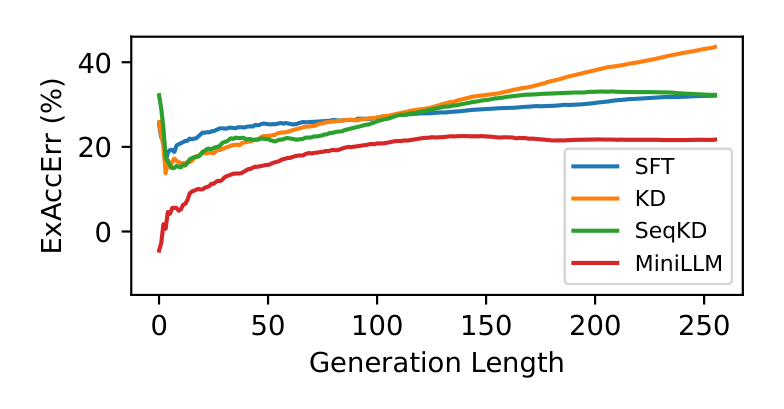

# MiniLLM：On-Policy Distillation of Large Language Models

## 来源

- 原始文件：[`raw/2306.08543v6.pdf`](../../raw/2306.08543v6.pdf)
- 标题（v6）：MiniLLM: On-Policy Distillation of Large Language Models；ICLR 2024 版本标题为 MiniLLM: **Knowledge Distillation** of Large Language Models（外部佐证：arXiv 页面 comments 写 `Published as a conference paper in ICLR 2024`，OpenReview `5h0qf7IBZZ`）
- 版本：v6，页脚标注 `arXiv:2306.08543v6 [cs.CL] 31 Jan 2026`（v1 为 2023-06）。正文未印会议页眉，会议信息按外部佐证处理
- 作者：Yuxian Gu、Li Dong、Furu Wei、Minlie Huang（Gu 的工作在 MSR 实习期间完成）
- 单位：The CoAI Group, Tsinghua University / Microsoft Research
- 代码与 checkpoint：<https://github.com/microsoft/LMOps/tree/main/minillm>
- 模型实体：论文把训练出的 student 命名为 **MiniLLM**，覆盖 GPT-2（120M / 340M / 760M）、OPT（1.3B / 2.7B / 6.7B）、LLaMA（7B）三族；除来源页外另建 [MiniLLM 模型页](../models/minillm.md)

## 为什么这篇在 wiki 里独占一席

它和 [GKD](generalized-knowledge-distillation.md) 是 OPD 的两支源头，但切口不同：GKD 把「用什么数据」和「用什么发散度」都当可调维度、且不对采样过程反传；MiniLLM **直接换目标函数**——把 forward KLD 换成 reverse KLD，并为它推导了一套 policy-gradient 优化流程，因此必须自己处理高方差、reward hacking 和长度偏置。本 wiki 的 [OPD 数学依据](../concepts/multi-teacher-on-policy-distillation.md#数学依据opd-为什么-work) 第二层（reverse KL 的 mode-seeking）与第三层（on-policy 消除 exposure bias）此前都以「Gu et al., 2023」的裸链接出现，本页补上一手出处。

## 核心结论

1. **换目标函数，而不只是换数据来源**：标准 KD 近似最小化 forward KLD $\mathrm{KL}[p\|q_\theta]$，它逼 student 覆盖 teacher 的全部 mode；开放生成任务里 teacher 分布的 mode 数往往远超 student 容量，结果是把概率质量堆到 $\mathrm{KL}[p\|q_\theta]$ 的 void region 上，产生 teacher 视角下极不可能的样本（`§1`、`§2`）。MiniLLM 改成 $\min_\theta \mathrm{KL}[q_\theta\|p]$（`Eq 1`），让 student seek 主要 mode、忽略长尾变体，论文认为这对需要真实性与可靠性的场景更关键。
2. **用 Policy Gradient Theorem 求该目标的梯度**（`Eq 2`、`§A.2`）：

   $$\nabla \mathcal{L}(\theta) = -\mathbb{E}_{x\sim p_x,\;y\sim q_\theta(\cdot|x)}\left[\sum_{t=1}^{T}\left(R_t - 1\right)\nabla \log q_\theta(y_t|y_{<t},x)\right],\quad R_t=\sum_{t'=t}^{T}\log\frac{p(y_{t'}|y_{<t'},x)}{q_\theta(y_{t'}|y_{<t'},x)}$$

   即把 token 级 log-ratio 的累积 $R_t$ 当作 reward、减 1 作 baseline。这与 wiki 第一层记的 `advantage = sg(log π_T/π_θ)` 是同一族形式，但 MiniLLM 用的是**累积量**而非单 token 比值（`§待追问` 记口径差异）。
3. **三个技巧治 PG 的三个病**（`§2.2`，消融见 `Table 4`）：single-step decomposition（把 $r_t$ 从 $R_t$ 拆出、直接对词表求和，降方差）、teacher-mixed sampling（采样分布 $\tilde p = \alpha p + (1-\alpha)q_\theta$，α=0.2，治 reward hacking）、length normalization（治长度偏置）。消融显示去掉 length normalization 与 teacher-mixed sampling 后验证集 R-L 从 27.4 掉到 17.4 / 22.3。
4. **训练是两阶段、整体像 RLHF**（`Algorithm 1`、`§B.1`）：先在指令数据上 SFT 并取验证 loss 最低的 checkpoint 作起点，再跑 on-policy 优化；同时加一项预训练语料的语言建模损失 $\mathcal{L}_{PT}$ 以保住 canonical NLP 任务能力（`Table 7`）。
5. **主结论**：在 5 个指令跟随评测集上全面优于 SFT w/o KD、KD（word-level）、SeqKD（`Table 1`）；student 覆盖 120M–7B、teacher 到 13B；多处 student 的 R-L 反超 teacher（作者归因于 teacher 自身训练时的 exposure bias）；ExAccErr 随生成长度不累积（`Figure 6`）、ECE 更接近 teacher（`Table 2`）、长回答子集优势更大（`Figure 7`），且 4-gram 多样性与语言建模 loss 基本不掉（`Table 3`）。

> Figure 1: The comparison of MINILLM with the sequence-level KD (SeqKD; ...) in terms of the average GPT-4 feedback score on our evaluation sets.（`§1`）

## 方法：reverse KLD + on-policy 优化

> Figure 3: Comparison between sequence-level KD (left) and MINILLM (right). Sequence-level KD forces the student to memorize all samples generated by the teacher model, while MINILLM improves its generated texts with the teacher model's feedback.（`§2`）

三个稳定化技巧的机制（`§2.2`）：

| 技巧 | 解决的问题 | 做法 |
| --- | --- | --- |
| **Single-step decomposition** | PG 高方差（前部 token 的误差沿句累积） | 把 $r_t$ 从 $R_t$ 中拆出，$(∇\mathcal{L})_{\text{Single}}$ 里的 $\mathbb{E}_{y_t\sim q_\theta}[r_t]$ **直接对词表求和**、可导，比 Monte-Carlo 估计更准（`Eq 3`） |
| **Teacher-mixed sampling** | reward hacking：student 会生成重复短语、短句或空串，这些在 teacher 下概率很高 | 采样分布改为 $\tilde p = \alpha p + (1-\alpha)q_\theta$（α=0.2），并用 importance weight $w_t$ 修正为无偏估计；实践中把累积权重近似成单步比值 $w_t \approx q_\theta/\tilde p$ 以压方差（`Eq 4`、`Eq 5`） |
| **Length normalization** | $R_t$ 偏向短句，导致空回答 | 对 $R_{t+1}$ 做剩余长度归一（`Eq 6`），最终梯度再套 PPO 式 clipping（`Algorithm 1`） |

论文另给了一个 **inverse reinforcement learning 视角**（`§A.1`）：把 token 生成当 MDP，标准 KD 相当于 behavior cloning；MiniLLM 相当于最大熵 IRL——由 teacher logits 诱导出 reward $r(y_t,(y_{<t},x)) = f(y_t,\cdot) - \log\sum_{y'\in V}\exp f(y',\cdot)$，再用最大熵 RL 目标优化，论文证明该目标与 $\min \mathrm{KL}[q_\theta\|p]$ 近似等价（`Eq 8`–`Eq 20`）。

## 实验设置与主结果

- 任务：instruction following；训练数据取自 databricks-dolly-15K（过滤超长后约 12.5K 训练 / 1K 验证 / 0.5K 测试）；预训练语料 $\mathcal{D}_{PT}$ 对 GPT-2 族用 OpenWebText、其余用 RoBERTa 语料（`§3.1`）
- 评测集：DollyEval、SelfInst（252）、VicunaEval（80）、S-NI、UnNI；指标为 Rouge-L、GPT-4 feedback（1–10 分比值）与人工评测（SelfInst，50 条）`§3.1`
- 基线：SFT w/o KD、word-level KD、SeqKD；所有模型按验证集 Rouge-L 选 checkpoint

`Table 1` 原文复刻（GPT4 = 平均 GPT-4 打分，R-L = Rouge-L，均为 5 个随机种子的平均；粗体为该尺寸最优，`*` 表示 student 超过 teacher）：

| 模型族 | 参数量 | 方法 | DollyEval GPT4 | DollyEval R-L | SelfInst GPT4 | SelfInst R-L | VicunaEval GPT4 | VicunaEval R-L | S-NI R-L | UnNI R-L |
| --- | --- | --- | --- | --- | --- | --- | --- | --- | --- | --- |
| **GPT-2** | 1.5B | Teacher | 58.4 | 27.6 | 42.9 | 14.3 | 48.6 | 16.3 | 27.6 | 31.8 |
| | 120M | SFT w/o KD | 38.6 | 23.3 | 26.3 | 10.0 | 32.8 | 14.7 | 16.3 | 18.5 |
| | 120M | KD | 40.3 | 22.8 | 27.8 | 10.8 | 31.9 | 13.4 | 19.7 | 22.0 |
| | 120M | SeqKD | 41.2 | 22.7 | 26.2 | 10.1 | 31.0 | 14.3 | 16.4 | 18.8 |
| | 120M | **MiniLLM** | **44.7** | **24.6** | **29.2** | **13.2** | **34.1** | **16.9\*** | **25.3** | **26.6** |
| | 340M | SFT w/o KD | 51.9 | 25.5 | 39.6 | 13.0 | 42.3 | 16.0 | 25.1 | 32.0 |
| | 340M | KD | 51.6 | 25.0 | 39.2 | 12.0 | 42.8 | 15.4 | 23.7 | 31.0 |
| | 340M | SeqKD | 50.5 | 25.3 | 39.0 | 12.6 | 43.0 | 16.9\* | 22.9 | 30.2 |
| | 340M | **MiniLLM** | **52.2** | **25.4** | **40.5** | **15.6** | 42.6 | **17.7\*** | **27.4** | **34.5** |
| | 760M | SFT w/o KD | 50.7 | 25.4 | 38.3 | 12.4 | 43.1 | 16.1 | 21.5 | 27.1 |
| | 760M | KD | 53.4 | 25.9 | 40.4 | 13.4 | 43.4 | 16.9\* | 25.3 | 31.7 |
| | 760M | SeqKD | 52.0 | 25.6 | 38.9 | 14.0 | 42.4 | 15.9 | 26.1 | 32.9 |
| | 760M | **MiniLLM** | **54.7** | **26.4** | **44.6\*** | **15.9** | **45.7** | **18.3\*** | **29.3\*** | **37.7\*** |
| **OPT** | 13B | Teacher | 70.3 | 29.2 | 56.1 | 18.4 | 58.0 | 17.8 | 30.4 | 36.1 |
| | 1.3B | SFT w/o KD | 52.6 | 26.0 | 37.7 | 11.4 | 40.5 | 15.6 | 23.1 | 28.4 |
| | 1.3B | KD | 52.7 | 25.4 | 36.0 | 12.2 | 40.8 | 14.9 | 21.9 | 27.0 |
| | 1.3B | SeqKD | 51.0 | 26.1 | 36.6 | 12.7 | 42.6 | 16.6 | 21.4 | 28.2 |
| | 1.3B | **MiniLLM** | **60.7** | **26.7** | **47.0** | **14.8** | **50.6** | **17.9\*** | **28.6** | **33.4** |
| | 2.7B | SFT w/o KD | 55.4 | 27.1 | 38.9 | 13.9 | 44.8 | 16.6 | 24.9 | 32.3 |
| | 2.7B | KD | 60.5 | 25.9 | 48.6 | 13.8 | 51.3 | 16.7 | 26.3 | 30.2 |
| | 2.7B | SeqKD | 57.6 | 27.5 | 40.5 | 13.3 | 44.5 | 16.5 | 25.3 | 32.3 |
| | 2.7B | **MiniLLM** | **63.2** | **27.4** | **52.7** | **17.2** | **55.9** | **19.1\*** | **30.7\*** | **35.1** |
| | 6.7B | SFT w/o KD | 67.9 | 27.6 | 56.4 | 16.4 | 57.3 | 17.8 | 30.3 | 28.6 |
| | 6.7B | KD | 68.6 | 28.3 | 58.0 | 17.0 | 57.0 | 17.5 | 30.7\* | 26.7 |
| | 6.7B | SeqKD | 69.6 | 28.5 | 54.0 | 17.0 | 57.6 | 17.9\* | 30.4 | 28.2 |
| | 6.7B | **MiniLLM** | **70.8\*** | **29.0** | **58.5\*** | **17.5** | **60.1\*** | **18.7\*** | **32.5\*** | **36.7\*** |
| **LLaMA** | 13B | Teacher | 79.0 | 29.7 | 75.5 | 23.4 | 65.1 | 19.4 | 35.8 | 38.5 |
| | 7B | SFT w/o KD | 73.0 | 26.3 | 69.2 | 20.8 | 61.6 | 17.5 | 32.4 | 35.8 |
| | 7B | KD | 73.7 | 27.4 | 70.5 | 20.2 | 62.7 | 18.4 | 33.7 | 37.9 |
| | 7B | SeqKD | 73.6 | 27.5 | 71.5 | 20.8 | 62.6 | 18.1 | 33.7 | 37.6 |
| | 7B | **MiniLLM** | **76.4** | **29.0** | **73.1** | **23.2** | **64.1** | **20.7\*** | **35.5** | **40.2\*** |

`§C.1` 另有 GPT-J-6B 作 teacher 的一组结果（Table 6），结论一致。人工评测（`Figure 4`）基于 LLaMA 族：MiniLLM 在 SelfInst 上的偏好优于全部基线，与 teacher 相当。

## 机制分析

> Figure 6: The excess error caused by the training-decoding discrepancy (ExAccErr) accumulated with the generation length. Lower ExAccErr means the method introduces less exposure bias.（`§3.3`）

- **Exposure bias（`Figure 6`、`§B.5`）**：用 ExAccErr(l)（Arora et al. 2022 的口径）度量「仅由 exposure bias 造成的相对误差」——把累积 regret 拆成「oracle 上下文下的估计误差 $l\epsilon(l)$」与「低质量自生成前缀带来的误差」。三条基线随长度持续累积，MiniLLM 明显更低且在 >150 token 后停止累积。
- **Calibration（`Table 2`）**：在 SST2 / BoolQ 零样本分类上测 ECE。KD（0.191 / 0.682）与 SeqKD（0.243 / 0.681）都比 teacher（0.025 / 0.356）差得多，MiniLLM（0.099 / 0.502）最接近 teacher。论文的解释是 forward KLD 把概率推向目标分布的 void region，造成 student 与 teacher 的分布差异。
- **长回答子集（`Figure 7`）**：按 ground-truth 响应长度把 S-NI 分成 [0,5] / [6,10] / [11,+∞) 三个子集。短回答上各方法差别不大（论文解释：输出空间小、student 能覆盖 teacher 多数 mode，此时 reverse 与 forward KLD 表现相近）；≥6 token 的子集上 MiniLLM 优势显现。UnNI 上同结论（`Figure 15`）。
- **多样性（`Table 3`）**：LLaMA 族上 MiniLLM 的 distinct 4-gram 比例（DollyEval 99.0、SelfInst 98.6）与语言建模 loss 与 SFT / teacher 基本持平，论文据此认为「mode-seeking 并没有换来决定性的输出」。
- **Teacher 规模的 scaling（`Figure 5`、`Figure 14`）**：固定 student、放大 teacher（GPT-2 族与 OPT 族各一组），MiniLLM 恒优于 SeqKD，且 student 表现与 teacher 规模正相关。

消融（`Table 4`、`Figure 8`，GPT-2-125M 从 GPT-2-1.5B 蒸馏）：去掉 length normalization 后验证集 R-L 从 27.4 掉到 17.4、测试集 Dolly 从 24.6 掉到 14.7；去掉 teacher-mixed sampling 掉到 22.3 / 20.4；去掉 single-step decomposition 只掉到 27.0 / 23.7。论文的读法是前两者负责**稳定化**（否则出现重复、短、无意义但 teacher 高概率的字符串，即 reward hacking），single-step 主要**降方差**。

## 与 GKD、近代 OPD 的关系

- **两篇是 concurrent work，且互相点名**：MiniLLM 的 `§4` 把 GKD 列为 concurrent（`[AVS+23]`，即 arXiv:2306.13649）；[GKD](generalized-knowledge-distillation.md) 的 `§Related Work` 也把 MiniLLM 列为 concurrent work，并主张自己更简单稳定（不对采样过程反传）、更通用（发散度可换）。分工可以这样记：**GKD 把「on-policy 数据比例」和「发散度」都做成超参、优化方式接近监督学习；MiniLLM 直接选定 reverse KLD 作为目标，因此必须自己解决 PG 的高方差、reward hacking 与长度偏置。**
- **两篇的 mode-seeking 论据落在同一个连续 toy 上**：MiniLLM `Figure 2`（`§2.1`）用单个高斯拟合高斯混合分布来展示 forward KLD 与 reverse KLD 的差别；[GKD](generalized-knowledge-distillation.md) `Figure A.16`（`§A.7`）是同类设置。[AKL](akl.md) 已收原文，把这条刻画降级到连续单峰 \(q\)；离散 softmax 上两边同驻点。AKL 实验刻意不和本篇比数字（本篇用了额外预训练语料）。
- **与现代 token-level OPD 的形式关系**：MiniLLM 的 advantage 是**累积到序列尾**的 $R_t - 1$；[MiMo MOPD](../models/mimo-v2-flash.md) / [GLM-5](../models/glm-5.md) 与现代 token-level OPD 用的是**单 token** 的 $\mathrm{sg}[\log \pi_T - \log \pi_\theta]$。两者同族但并非同一估计器，本页不做等价换算（见待追问）。
- **训练栈差异**：MiniLLM 保留了预训练语言建模损失 $\mathcal{L}_{PT}$ 以保住 canonical 任务能力（`Table 7`），并沿用 PPO clipping；近代 OPD 走 GRPO/PPO 的 advantage 折入路线，不再单独保留 $\mathcal{L}_{PT}$。

## 证据边界与阅读提示

- **摘要的「120M 到 13B」是口径混装**：student 最大是 LLaMA-7B（teacher 才是 13B），论文摘要把两侧规模合起来说了。引用时必须分开写。
- **没有多 teacher 与大规模 student 的实验**：MiniLLM 全是单 teacher、student ≤ 7B，无法直接回答 MOPD 场景下的问题。

## 待追问

- **现有材料待核**：**$R_t$ 累积 vs 单 token 比值是否等价**：MiniLLM 的 $R_t$ 累加 $t$ 之后所有 token 的 log-ratio，现代 OPD 只用当前 token 的 $\log(\pi_T/\pi_\theta)$。两者在数学上是否只差一个 telescoping / baseline 处理，本页未在原文层面核对，引用时不要当作同一形式。
- **需实验或作者披露**：**teacher-mixed sampling 与「on-policy 纯度」的张力**：α=0.2 意味着采样分布不是纯 student 分布，论文用 importance weight 修正后**近似**成单步比值 $w_t \approx q_\theta/\tilde p$（`Eq 5`），这个近似带来的偏差在大规模设置下没有被评估；而 2026 各家 OPD 都是纯 student 采样，没有对应项。是这一项在规模上不重要，还是被 α 的鲁棒性掩盖了？
- **需实验或作者披露**：**短回答子集上 forward 与 reverse KLD 表现相近**（`§3.3`、`Figure 7`）与「reverse KLD 普遍更优」的流行表述存在张力，论文自己给的情境化解释（输出空间小 → student 能覆盖 teacher 多数 mode）没有被单独消融验证。
- **需实验或作者披露**：**「student 反超 teacher 是 exposure bias 所致」是作者解释而非实验结论**：论文以 teacher 也是 teacher-forcing 微调为由推断，没有做 teacher 的 on-policy 重训对照。
- **现有材料待核**：**wiki 概念页把「OPD 的 entropy collapse 比 RL 更剧烈」记在 Gu et al. 2023 名下**，但 MiniLLM 原文没有做 OPD vs RL 的熵曲线对照——它做的是 mode-seeking 论证与 `Table 3` 的多样性持平检验。这条归属需要降级或另找出处。

## 相关页面

- [MiniLLM（模型页）](../models/minillm.md)：论文发布的学生模型族（GPT-2 120M/340M/760M、OPT 1.3B/2.7B/6.7B、LLaMA 7B）。
- [GKD：On-Policy Distillation of Language Models](generalized-knowledge-distillation.md)：同期的另一支源头，把发散度与 on-policy 比例都当超参。
- [Multi-Teacher On-Policy Distillation](../concepts/multi-teacher-on-policy-distillation.md)：承载跨家共用的 OPD 数学依据，本页为其第二、三、四层提供一手出处。
- [Thinking Machines Lab On-Policy Distillation 博客](thinking-machines-on-policy-distillation.md) / [nrehiew 博客](nrehiew-sft-rl-opd.md)：把 MiniLLM 的 mode-seeking 论断接到 2025–2026 后训练叙事的两页。
- [On-Policy Distillation 跨报告对比](../comparisons/on-policy-distillation.md)：各技术报告里的 OPD 用法对比。
- [OPSD](opsd.md)：自蒸馏；主实验选了本页相反的 forward KL，reverse KL 在其 AIME25 消融上无效。
- [AKL](akl.md)：把本页 Figure 2 的连续 toy 降级；离散词表上 FKL/RKL 同驻点。AKL 实验沿用 Dolly 设定但不比本篇数字。
