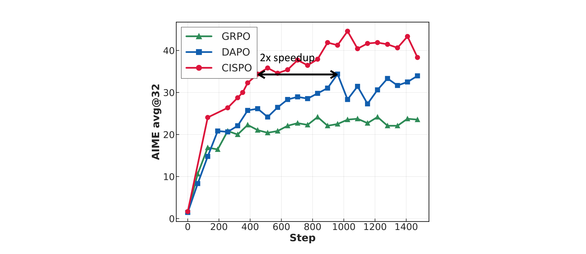
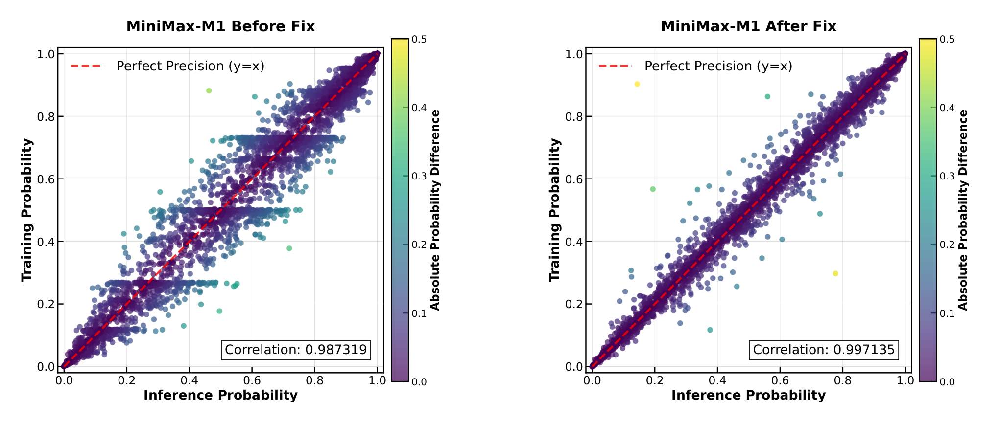
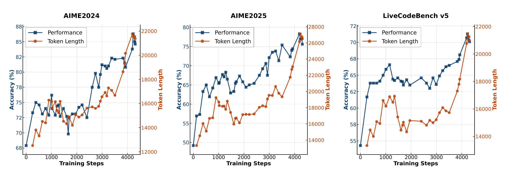
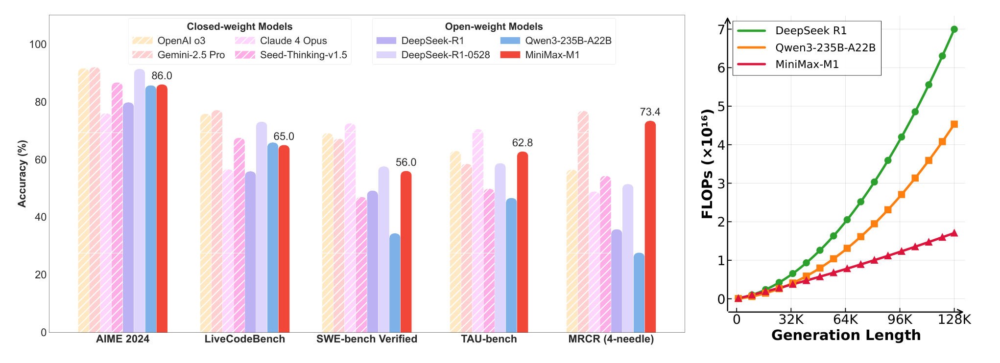

# MiniMax-M1

## 来源

- **PDF**：`raw/2506.13585v1.pdf`（22 页）
- **标题**：MiniMax-M1: Scaling Test-Time Compute Efficiently with Lightning Attention
- **arXiv**：2506.13585v1，2025-06-16
- **团队**：MiniMax（通讯 model@minimax.io）
- **开源**：[GitHub MiniMax-M1](https://github.com/MiniMax-AI/MiniMax-M1)
- **模型页**：[MiniMax-M1](../models/minimax-m1.md)

本页是 **CISPO 的一手出处**。后续 [Laguna](laguna-m1-xs2.md) 采用 CISPO 并公开 vs GRPO/GSPO 消融；[MiniMax-M2 Series](minimax-m2-series.md) **不是** CISPO 源头。不要把 Laguna 的 clip 数字回写成原文事实。统一谱系见 [LLM RL policy optimization 对比](../comparisons/llm-rl-policy-optimization.md)。

## 核心结论

1. **开源混合注意力 reasoning 模型**：从 MiniMax-Text-01 继续训出 MiniMax-M1，456B 总参 / 45.9B 激活 / 32 experts；每 7 个 lightning-attention transnormer block 后接 1 个 softmax Transformer block。原生 1M 上下文（DeepSeek R1 的 8 倍）。作者写成当时首个开源大规模 hybrid-attention reasoning 模型（摘要、§1）。
2. **test-time compute 更便宜**：相对 DeepSeek R1，生成 64K 时 FLOPs 不到一半，100K 时约 25%（Figure 1 Right、§1）。
3. **CISPO 夹的是 IS 权重，不是 token 更新**：PPO/GRPO 把高 $r_{i,t}$ 的反思 token clip 掉，后续 off-policy 步拿不到梯度。CISPO 对 $r=\pi_\theta/\pi_{\theta_{\mathrm{old}}}$ 做 stop-grad 夹紧，再乘 advantage 与 $\log\pi_\theta$，**所有 token 都进梯度**（Eq. 3–5、§3.1）。
4. **原文没有 $(c_{low},c_{high})=(1,4)$**：实验「不下 IS 下界」（$\varepsilon_{\mathrm{IS}}^{\mathrm{low}}$ 取很大），只调 $\varepsilon_{\mathrm{IS}}^{\mathrm{high}}$（§3.1）。Laguna 后来写的 asymmetric $(1,4)$ 是采用方超参。
5. **Qwen2.5-32B 对照**：同一 DAPO 数学数据、zero-RL，CISPO 同 step 优于 GRPO/DAPO，约一半 step 追上 DAPO（Figure 2）。
6. **完整 RL 三周**：512×H800，租金约 $534{,}700（摘要、§3）。发布 40K / 80K thinking budget 两版；40K 是 80K 训练的中间相。

## 架构与训练

模型身份是 MiniMax-Text-01 上的继续预训练 + SFT + RL，不是新骨干。Lightning Attention 是 Qin et al. (2024b) 的 I/O-aware 线性注意力实现；**机制细节不在本页展开**（B 路维护的线性注意力页）。这里只记 M1 用到的混合比与效率数字：7 lightning : 1 softmax，1M 上下文，长生成 FLOPs 显著低于同代 softmax LRM（§1、Table 1）。

继续预训练 7.5T：2.5T 恒定 LR $8\times 10^{-5}$，再 5T 衰到 $8\times 10^{-6}$。STEM / code / book / reasoning 提到 70%；网页 QA 对优先抽自然问答、**不用合成数据**；降低 MoE auxiliary loss 系数并加大 micro-batch（§2.1）。

长上下文：hybrid-lightning 过猛拉长会梯度爆炸——作者归因于各层衰减率不同，前层更偏局部、跟不上后层。分四阶段从 32K 扩到 1M（§2.1）。

SFT：注入长 CoT / 反思模式，覆盖数学、代码、STEM、写作、QA、多轮；数学+代码约 60%（§2.2）。

## 后训练

### CISPO：夹 IS 权重，不丢 token

PPO（Eq. 1）对 $r_{i,t}=\pi_\theta/\pi_{\theta_{\mathrm{old}}}$ 做 trust-region clip，越界 token 不再贡献后续 off-policy 更新。GRPO（[DeepSeekMath](deepseekmath.md)）只换 advantage 为组内相对奖励（Eq. 2），clip 对象没变。

作者在 hybrid 架构的 zero-RL 里看到：`However` / `Wait` / `Aha` 这类反思 token 基座概率低，一更新 $r$ 就很大，**第一次 on-policy 更新后就被 clip 掉**，后面 16 轮 off-policy 更新吃不到它们。DAPO 的 Clip-Higher 在这个 16-update 设定下不够用（§3.1）。

CISPO（Clipped IS-weight Policy Optimization）改 clip **对象**：

$$
J_{\mathrm{CISPO}}=\mathbb{E}\Bigg[\frac{1}{\sum_i|o_i|}\sum_i\sum_t \mathrm{sg}(\hat r_{i,t})\,\hat A_{i,t}\,\log\pi_\theta(o_{i,t}\mid q,o_{i,<t})\Bigg]
$$

$\hat r=\mathrm{clip}(r,\,1-\varepsilon_{\mathrm{IS}}^{\mathrm{low}},\,1+\varepsilon_{\mathrm{IS}}^{\mathrm{high}})$。不夹时退回标准 policy gradient。Advantage 仍用 GRPO 组内标准化；loss 是 **全局 token 池**平均（与 DAPO 同类，不是 DeepSeekMath 的 sample-then-token）。沿用 DAPO 的 dynamic sampling 与 length penalty；**没有 KL 项**（Eq. 4–5、§3.1）。

作者还写了一个带 mask 的统一式（Eq. 6–7），可以复现 PPO 式「正优势且 $r$ 过大 / 负优势且 $r$ 过小则丢梯度」。主实验用的是不丢 token 的 CISPO，不是这条 masked 变体。

> Figure 2（原文截图，§3.1）："Comparison of GRPO, DAPO, and our proposed CISPO on AIME 2024, based on Qwen2.5-32B-base. CISPO outperforms both GRPO and DAPO in terms of performance at the same number of training steps, and achieves comparable performance to DAPO using 50% of the training steps."

### Hybrid 架构上的 RL 工程

Lightning Attention 降低 rollout 成本，但大规模 RL 另有坑：

- **训练 / 推理概率对不齐**：hybrid + 大模型上，LM head 高幅激活让 train kernel 与 infer kernel 算出不同概率，reward 不涨。小 dense softmax 模型上没出现。LM output head 改 FP32 后 Pearson 相关从约 0.987 到 0.997，且训练中稳住（Figure 3、§3.2）。这是 [训练—rollout 一致性](../concepts/train-rollout-consistency.md) 第三层（精度契约）的一手案例。
- **AdamW**：梯度量级 $10^{-18}$–$10^{-5}$、多数 $<10^{-14}$，相邻 iter 相关弱。VeRL 默认 $\beta=(0.9,0.999)$、$\varepsilon=10^{-8}$ 不收敛；改为 $\beta_1=0.9$、$\beta_2=0.95$、$\varepsilon=10^{-15}$（§3.2）。
- **重复早停**：连续 3000 个 token 概率都 $>0.99$ 则截断，打断病理循环、去掉长尾（§3.2）。

> Figure 3（原文截图，§3.2）："Probability of tokens in training-mode code vs. probability of tokens in inference-mode code. ... Left: Correlation of the M1 model before our fix; Right: Correlation of the M1 model after applying our fix of using FP32 precision for the LM output head."

### 数据与课程

可验证任务用规则正确性 + 格式奖励（§4.1）：

| 域 | 规模 | 要点 |
| --- | --- | --- |
| 数学 | 近 50K | 竞赛题清洗；pass@10 严格在 $(0,0.9)$；与 SFT / 常用 benchmark 去重 |
| 逻辑 | 约 53K | SynLogic，41 类任务；强模型 pass@10 $>0$，Text-01 pass 在 $(0,0.5)$ |
| 竞赛编程 | 30K | 缺测试则用 Text-01 造；按 pass rate 滤难度 |
| 软件工程 | 数千 | GitHub issue/PR + 容器沙箱；测试通过给正奖励 |

不可验证：25K 通用题，GenRM 打分。有标准答案的用五档一致性；无标准答案的对参考答案做 $-1/0/1$ 两两比较。长 CoT 上 GenRM 偏爱更长输出；纯离线去偏不够，要在 RL 中在线盯长度并重校准，再配 reward shaping / value clipping / 归一化（§4.2）。

课程：先只跑规则可验证推理，再逐步混入通用域，避免遗忘（§4.3）。

### 40K → 80K

第一轮 RL 输出上限 40K，再按 48 / 56 / 64 / 72 / 80K 扩窗。切下一档看生成序列 PPL 是否收敛、长度 99 分位是否贴近当前窗（§5）。

后期易 pattern collapse：负样本比正样本更快顶满窗口，GRPO 标准化 + token-level loss 让后半段堆过大负梯度。对策：(1) 重复早停；(2) **sample-level loss 与 token-level 归一化并用**；(3) 降低梯度 clip 与 $\varepsilon_{\mathrm{IS}}^{\mathrm{high}}$。合成推理数据在长上下文 RL 里易重复，80K 阶段降采样（§5）。

> Figure 4（原文截图，§6.2）："Accuracy and generation length versus RL training steps for MiniMax-M1."

## 评测要点

采样 temperature 1.0、top-p 0.95。SWE-bench Verified 用 Agentless 脚手架，两阶段定位、不用 embedding 检索。TAU-bench 用 GPT-4.1 作用户、通用 system prompt、最多 40 步。HLE 不带工具，且是 text-only 子集（Table 2 注）。

> Figure 1（原文截图，摘要）："Left: Benchmark performance comparison ... We use the MiniMax-M1-80k model here for MiniMax-M1. Right: Theoretical inference FLOPs scaling with generation length (# tokens)."

Table 2 摘录（MiniMax-M1-80k）：

| 任务 | M1-40k | M1-80k | DeepSeek-R1-0528 | Qwen3-235B-A22B |
| --- | ---: | ---: | ---: | ---: |
| AIME 2024 | 83.3 | **86.0** | 91.4 | 85.7 |
| AIME 2025 | 74.6 | 76.9 | 87.5 | 81.5 |
| LiveCodeBench | 62.3 | 65.0 | 73.1 | 65.9 |
| SWE-bench Verified | 55.6 | **56.0** | 57.6 | 34.4 |
| TAU-bench airline | 60.0 | **62.0** | 53.5 | 34.7 |
| OpenAI-MRCR 128k | 76.1 | 73.4 | 51.5 | 27.7 |
| OpenAI-MRCR 1M | 58.6 | 56.2 | — | — |
| LongBench-v2 | 61.0 | **61.5** | 52.1 | 50.1 |
| GPQA Diamond | 69.2 | 70.0 | 81.0 | 71.1 |

作者读法：数学 / 竞赛编程落后最新 R1-0528，软件工程、工具使用、长上下文更强；80K 多数项高于 40K（§6.1）。

## 待追问

- 原文只说 $\varepsilon_{\mathrm{IS}}^{\mathrm{low}}$ 取很大、只调 $\varepsilon_{\mathrm{IS}}^{\mathrm{high}}$，**没写具体数字**。[Laguna](laguna-m1-xs2.md) 的 $(c_{low},c_{high})=(1,4)$ 不能回写成 M1 配方。
- 80K 阶段改成 sample-level + token-level 混用，等于部分收回 CISPO 主文的纯 token-level 设定。两套 loss 各用在哪一段、权重多少，原文没给。
- Figure 2 的 2× 是 Qwen2.5-32B dense softmax 上的对照，不是 456B hybrid 上相对 DAPO 的墙钟。生产 run 有没有再比 GRPO/DAPO，没写。
- 16 轮 off-policy / generation 是 CISPO 成立的关键工况；同步、少步更新时「不丢 token」还值多少，没有消融。
- 后续 [MiniMax-M2 Series](minimax-m2-series.md) 在前沿规模改回 full attention。那是后作判断，不是本页对 hybrid 的否定。

## 相关页面

- 模型：[MiniMax-M1](../models/minimax-m1.md)
- 比较：[LLM RL policy optimization 对比](../comparisons/llm-rl-policy-optimization.md)（CISPO 行）
- 概念：[Agentic 模型的后训练](../concepts/post-training-for-agentic-models.md)、[训练—rollout 一致性](../concepts/train-rollout-consistency.md)、[Forge Agent-Native RL](../concepts/forge-agent-native-rl.md)（M2 系统；算法源头在本页）
- 采用方：[Laguna M.1/XS.2](laguna-m1-xs2.md)
- GRPO 定义：[DeepSeekMath](deepseekmath.md)
- 后作模型报告：[MiniMax-M2 Series](minimax-m2-series.md)（不是 CISPO 源头）
- Lightning Attention 机制（B 路）：[Lightning Attention-2](lightning-attention-2.md)
