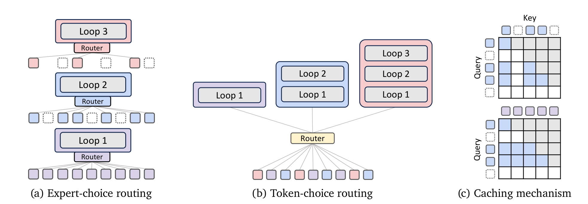
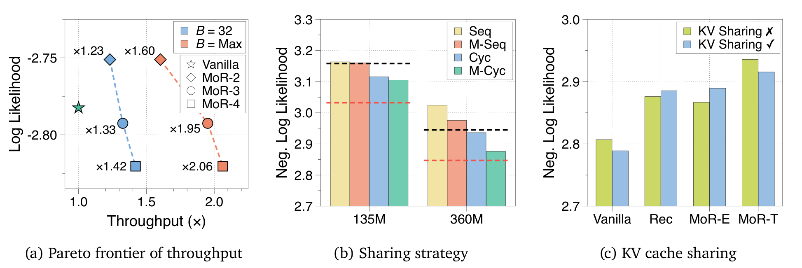

## 来源

- **标题**：Mixture-of-Recursions: Learning Dynamic Recursive Depths for Adaptive Token-Level Computation。
- **版本**：[arXiv:2507.10524v3](https://arxiv.org/abs/2507.10524v3)，2025-10-25；首版 2025-07-14。以下定位对应 38 页的 v3 [PDF](https://arxiv.org/pdf/2507.10524v3)。
- **团队**：KAIST AI、Mila／Université de Montréal，与 Google Cloud、Google DeepMind、Google Research 合作；共同一作 Sangmin Bae、Yujin Kim、Reza Bayat。首页注明 Google 作者仅承担顾问角色，不宜简称为 Google 独立提出。
- **代码**：[作者仓库](https://github.com/raymin0223/mixture_of_recursions)。本页依据论文，未运行代码复现实验。
- **归类**：递归语言模型的预训练架构框架，归入 [Looped Transformers](../concepts/looped-transformers.md)；本文不另立产品模型页。
- **证据说明**：已直接阅读官方 v3 PDF 的方法、主表及相关附录；`raw/` 尚无本地副本。下文“官方 PDF 直接核对”区别于已归档 `raw/` 的证据；比较与推断另作标注。

## 核心结论

MoR 联合设计三个部分：**重复使用同一层栈以减少独立参数、为不同 token 分配递归深度以减少计算、让 KV 缓存与活跃 token 集合配套以减少存储和访问**。这里的“expert”表示递归深度或计算路径，不是一组独立 FFN 专家。主配置是 Middle-Cycle 权重共享、expert-choice 路由和 recursion-wise KV caching（官方 PDF 直接核对，§2、§3、§4.1）。

最直接的正面证据来自 360M 基座配置：同 16.5×10^18 训练 FLOPs 下，MoR-2 的非 embedding 参数 167M、平均 few-shot 43.1%，普通模型分别为 315M、42.3%；MoR 在该预算内训练了 27B 而非 20B tokens。同为 20B tokens 时，MoR-2 仍以较少计算达到 42.9%。因此，同算力收益包含**单位算力能读更多数据**的作用，而同数据对照更适合隔离架构差异（官方 PDF 直接核对，Table 3、§3.1；比较口径为本页解释）。

## 架构与训练

> “Architectural components of Mixture-of-Recursions (MoR).”（原图注节选，Figure 2，p. 4）

### 共享的是多层 block

Cycle 把共享层组按顺序重复，例如 `(0,1,2) → (0,1,2) → (0,1,2)`；Sequence 则连续复用单层，例如 `(0,0,0) → (1,1,1) → (2,2,2)`。Middle 变体保留第一层与最后一层的独立参数，仅共享中间层。论文消融中 Middle-Cycle 最好，后续主实验采用这一方式（官方 PDF 直接核对，§2.1、Table 1、§4.1、Figure 4b）。

“135M–1.7B”是**原始非共享基座的总参数规模**，不是每个 MoR 实例的独立参数量；主表又只列非 embedding 参数。保留首尾层及 embedding 后，总参数不能机械地除以递归次数（官方 PDF 直接核对，p. 2 脚注 2、Tables 3、6）。

### 两种路由，两个不同难点

| 路由 | 决策方式 | 因果与计算预算 | 论文采用的处理 |
| --- | --- | --- | --- |
| Expert-choice | 每一轮为 token 打分，选 Top-K；只有上轮被选中的 token 能继续竞争 | 训练容量预设，预算可控；序列级排序依赖未来 token 分数，存在因果泄漏 | 比较辅助 router 与辅助 BCE loss；主 router 加辅助 loss、sigmoid、线性预测器表现较好 |
| Token-choice | 进入递归前做一次 top-1 选择，指定执行 1…R 次的完整路径 | 不依赖未来 token 的排序；各深度负载可能不均 | 比较 balancing loss 与 loss-free bias；前者的负载指标更稳定 |

定位：官方 PDF §2.2.1、Table 2、§4.2、§A.2。Expert-choice 的**层级筛选意味着退出后不再返回更深递归**。这与每一步对所有 token 重新选择的设计有实质区别。

为对齐两种路由的预期计算量，论文以 token-choice 各目标深度均匀分配为参照。最大递归数 R=3 时，三轮参与比例依次是 1、2/3、1/3，而不是每轮都独立选 1/3。Expert-choice 训练用 Top-K 标记作 BCE 目标，让因果 router 学会预测是否应继续；这缓解训练排序与单 token 推理之间的不一致，**不等于训练的序列级 Top-K 本身已经成为因果操作**（官方 PDF 直接核对，§2.2.1、§A.2；末句为本页限定）。

### 两种 KV 设计不能混为一谈

| 方案 | 深层 query 能看到什么 | 存储与计算的代价 |
| --- | --- | --- |
| Recursion-wise KV caching | 仅当前递归仍活跃的历史 token，且使用这一递归对应的 KV | 每轮独立缓存，活跃序列越深越短；同时缩短 Q 和 K/V |
| Recursive KV sharing | 第一轮所有历史 token 的 KV，后续递归复用 | KV 只存一套，但后续 query 仍读完整历史 K/V；还存在跨递归表征不匹配 |

定位：官方 PDF §2.2.2、Figure 2c、§A.3。前一种通过**改变可见上下文集合**解决缺失 KV；并非在保持完整深层 attention 的同时凭空补齐已退出 token 的状态。第二种保留全历史覆盖，但读到的是第一轮表征。

Table 2 的简化成本只比较递归 block，**排除不共享的首尾层**；以普通 Transformer 为 1，在预设递减容量下：

| 相对成本 | Recursion-wise caching | Recursive sharing |
| --- | ---: | ---: |
| KV 存储 | (R+1)/(2R) | 1/R |
| KV 访问量 | (R+1)/(2R) | 1 |
| 单层 attention FLOPs | (k/S)² | k/S |

其中 S 是上下文长度、k 是当前层参与的 token 数；attention 比例对应论文的序列计算口径，不应直接解释为单 token decode 加速比。递归共享可少算 KV projection，所以即使 attention 开销较高，总 FLOPs 仍可能下降（官方 PDF §2.2.2、p. 9 脚注 5）。

**仅首轮 prefill 的优化有结构条件**：正文限定与 Cycle 兼容，不能不加区分地套到默认 Middle-Cycle。共享权重、共享 KV、跳过深层 prefill 是三个不同命题（官方 PDF §2.2.2、§6；本页综合）。

### 预训练设置

使用参考 SmolLM 配置的 Llama 风格模型，从头训练于 SmolLM-Corpus 中去重后的 FineWeb-Edu 子集；语料池为 220B tokens，但各实验实际训练量由预算决定。词表约 49K、上下文 2K，使用 4 张 H100 或 A100；主实验和 isoFLOP 实验采用 warmup／stable／cooldown 的梯形学习率调度。评测是验证 NLL 与 LAMBADA、HellaSwag、PIQA、WinoGrande、ARC、MMLU 六组 few-shot 指标，不能把 NLL 数字直接写成 PPL（官方 PDF §3、§B）。

## 后训练

核心证据是语言模型预训练。§7.1 把在实际 reasoning 数据上后训练、学习与 CoT 复杂度对齐的路由列为未来工作；本篇不提供 RL 或长 CoT 后训练已验证的结论。视觉、语音与多模态同样属于展望，当前实验为纯文本。

## 评测要点

### 主表的同算力与同数据对照

| 360M 基座配置 | 非 embedding 参数 | 训练 FLOPs（×10^18） | tokens | 验证 NLL ↓ | 平均 few-shot ↑ |
| --- | ---: | ---: | ---: | ---: | ---: |
| 普通 Transformer | 315M | 16.5 | 20B | 2.7824 | 42.3 |
| 固定递归 R=2 | 167M | 16.5 | 20B | 2.8079 | 42.6 |
| MoR expert-choice + Cache，R=2 | 167M | 16.5 | 27B | 2.7511 | 43.1 |
| MoR expert-choice + Cache，R=2，同数据 | 167M | 12.3 | 20B | 2.7749 | 42.9 |
| MoR expert-choice + Cache，R=3 | 118M | 16.5 | 30B | 2.7925 | 42.6 |
| MoR token-choice + Cache，R=3 | 118M | 16.5 | 30B | 2.9163 | 40.0 |
| MoR expert-choice + Share，R=3 | 118M | 16.5 | 31B | 2.7983 | 41.9 |

定位：官方 PDF Table 3。§3.1 另报 R=2 同数据配置训练时间减少 19%、峰值显存减少 25%；这与同 FLOPs 下训练更多 tokens 的比较不是同一个问题。

### 吞吐收益与计时边界

> “Pareto frontier of inference throughput and log-likehood for MoR and Vanilla Transformer”（原图注节选，Figure 4a，p. 8）

连续深度批处理把处于不同递归进度、但使用同一共享 block 的 token 合批；已退出的请求腾出位置后立即补入其他请求。**这是跨请求调度收益，不是让同一 token 的依赖递归同时执行**（官方 PDF §3.3、§E；最后一句为本页解释）。

Figure 4a 报 R=2／3／4 在固定 batch=32 时为 1.23×／1.33×／1.42×，放大相对 batch 后为 1.60×／1.95×／2.06×。必须与 Appendix E 的条件一起引用：

- 无输入前缀，输出长度按均值 256 的正态分布采样；来自验证集的 1K 请求。
- 相对 batch 分别为 42／48／51，依据 H100 显存中的权重与 KV 容量估算，省略当前 hidden states 占用；不是完整服务系统的实测最大 batch。
- MoR-4 为整除中间层数使用 34 层有效深度，对照普通模型也增加到 34 层。
- 计时有 100 次 warmup，采用 FlashAttention 2、静态缓存与 torch.compile；**排除了 KV 缓存写入和更新耗时**。不能将 2.06× 写成完整端到端 serving 加速或单用户延迟减半。

### 大规模与深度外推边界

Appendix C.1 / Table 7 在 1.7B 基座、68.5×10^18 FLOPs 下：普通模型平均分 **48.9**，MoR expert-choice 的 R=2／3 为 **48.4／46.7**；虽优于固定递归的 46.5／46.2，却没有超过普通基线。作者明确保留扩展性疑问。Figure 3 的小预算 NLL 趋势不能升级为所有训练预算下都胜出。

Table 8 固定 118M 非 embedding 参数、10B tokens，R=1／2／3 平均分为 39.48／39.96／40.10；这是不同训练配置的对照。Figure 5c 则观察已训练模型内部递归深度增加时的 log-likelihood，不能据此声称超出训练最大深度仍可无限改善。

§7.1 还指出，辅助 loss 让 expert-choice 得分接近 0／1 后，训练结束再调 Top-K 容量反而困难。因此 **token 身份自适应、递归深度自适应、总计算预算自由调整**需要分别核实。

## 与 ITT 的关系

以下为本页综合，依据 MoR §2、§7.1 与 [ITT](inner-thinking-transformer.md) 官方 PDF §3、Figure 3、Algorithm 1：

| 比较轴 | ITT | MoR |
| --- | --- | --- |
| 复用单位 | 普通层间插入 ITT 层，层内重复变换 | 复用一组中间层，主配置保留独立首尾层 |
| 路由 | 每步选 token，结合 RTC 与步骤编码 | Expert-choice 逐轮层级筛选，或 token-choice 起始决定完整深度 |
| 跳过后能否返回 | 原文未明确永久退出约束 | Expert-choice 明确只能在上一轮活跃集合内继续筛选 |
| 因果性说明 | 目前来源页保留 Top-K 因果一致性待问 | 明确承认序列 Top-K 泄漏，比较辅助预测方案 |
| KV 设计 | 现有论文说明不足以确定具体缓存语义 | 明确比较递归局部缓存与首轮 KV 共享 |
| 预算弹性 | 报告推理时调整各步参与率 | 明确承认辅助 loss 后容量调整困难 |

MoR 可以给 ITT 的待追问提供比较框架，但不能替 ITT 证明其 KV 实现或因果性已解决；本文也没有给出与 ITT 的统一训练配方直接对照。

## 待追问

- 把 KV 缓存写入／更新计入，并加入长 prompt 的 prefill 后，吞吐和单请求延迟分别改善多少？
- Expert-choice 的训练 Top-K 与因果推理预测在分布外长序列上能否保持一致？2K 实验不能直接证明百万 token 收益。
- 在更大训练预算下，如何缓解共享参数容量瓶颈？1.7B 对照已经出现普通模型领先，不能仅凭小预算拟合线外推。
- 递归局部 attention 丢失深层历史 token，对检索、复制、长依赖及真实多步推理有什么影响？需要与首轮 KV 共享做任务级对照。
- 能否在保留因果推理与负载稳定性的同时，像 ITT 预算实验那样灵活改变参与比例？

## 相关页面

- [Looped Transformers](../concepts/looped-transformers.md) — 共享 block、动态深度与系统成本。
- [Inner Thinking Transformer（ITT）](inner-thinking-transformer.md) — 层内循环与 token 选择的相邻路线。
