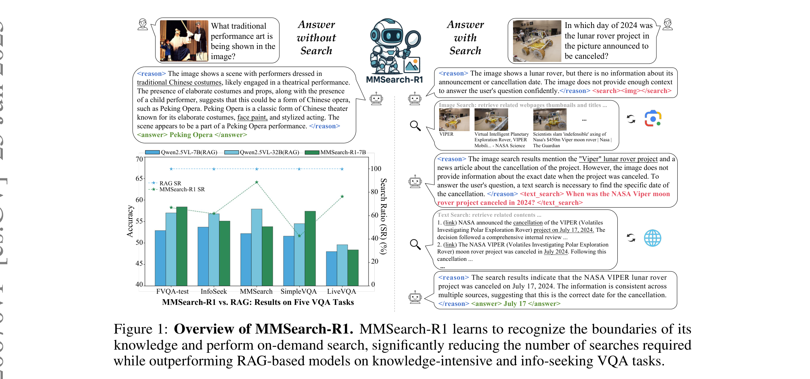
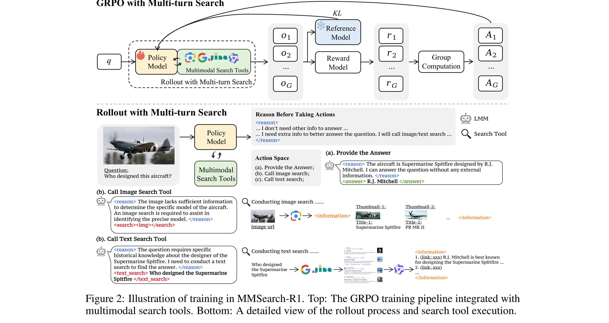
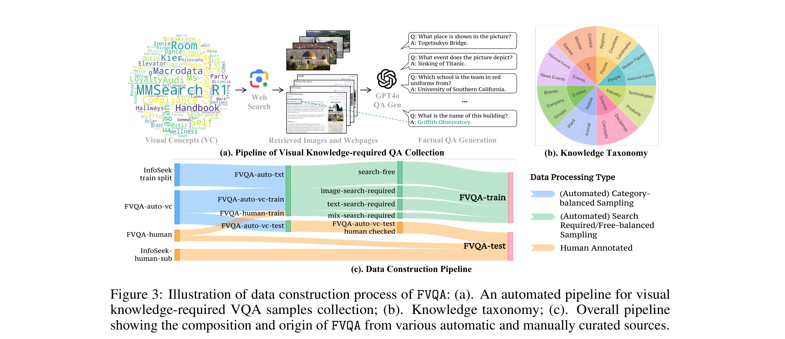
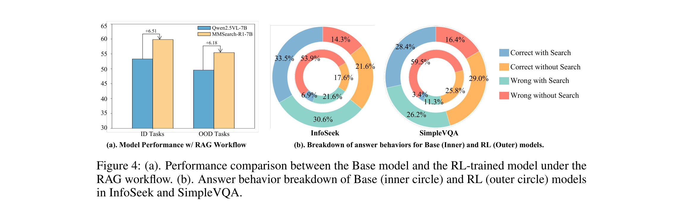
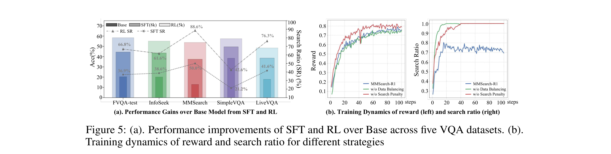

# MMSearch-R1 技术报告

## 来源

- PDF：[arXiv:2506.20670](https://arxiv.org/abs/2506.20670)
- 日期：2025-06-25
- 团队：ByteDance + NTU S-Lab
- 作者：Jinming Wu、Zihao Deng、Wei Li、Yiding Liu、Bo You、Bo Li、Zejun Ma、Ziwei Liu
- 代码：[github.com/EvolvingLMMs-Lab/multimodal-search-r1](https://github.com/EvolvingLMMs-Lab/multimodal-search-r1)
- 关联模型：[MMSearch-R1](../models/mmsearch-r1.md)（基于 Qwen2.5-VL-7B-Instruct）
- 后续改进：[DeepMMSearch-R1](deepmmsearch-r1.md)（裁剪图像搜索 + 多轮文本搜索 + self-reflection）

## 核心结论

首个能做**端到端 RL 训练的按需多模态搜索** 的 LMM，同时支持图像搜索和文本搜索，以 outcome-based reward + search penalty 塑造按需搜索行为。核心主张：

1. **按需搜索（on-demand search）**：模型自主判断何时搜索、搜索什么，而非 RAG 的固定检索流程。search penalty 惩罚不必要的搜索，鼓励先利用内部知识。
2. **两工具集成**：图像搜索（SerpApi 返回 top-5 缩略图+标题）和文本搜索（SerpApi + Jina Reader + Qwen3-32B 摘要）。
3. **GRPO 直接训练**：无需 SFT cold-start，outcome-based reward 即可驱动搜索行为涌现。
4. **搜索量减少 30%+**，同时准确率超过同尺寸 RAG 基线，匹配 32B RAG 模型性能。

> 后续工作 [DeepMMSearch-R1](deepmmsearch-r1.md) 在此基础上增加了裁剪图像搜索（Grounding DINO）和多轮文本搜索 + self-reflection，6 benchmark 平均 57.13 超 RAG +21pp。

## 架构与训练

### 搜索工具链

| 工具 | 输入 | 输出 | 实现 |
| --- | --- | --- | --- |
| Image Search | 原图 | Top-5 缩略图 + 标题（视觉匹配网页） | SerpApi |
| Text Search | 模型生成的文本 query | Top-5 网页摘要 | SerpApi → Jina Reader → Qwen3-32B 摘要 |

文本搜索流水线三步：SerpApi 返回 top-5 URL → Jina Reader 抓取全文 → Qwen3-32B 提取与问题相关的内容摘要。

### Action Tags（结构化工具调用协议）

- `<reason>...</reason>`：推理过程（每轮动作前必须）
- `<search></search>`：图像搜索
- `<text_search>query</text_search>`：文本搜索
- `<answer>...</answer>`：最终回答
- `<information>...</information>`：搜索返回结果（训练时 mask loss）

### Rollout 流程

- 最多 3 轮对话，每轮模型可执行一个动作
- 最多 2 次搜索（图像搜索仅限第 1 轮，文本搜索可多轮）
- 第 3 轮必须给出最终回答
- 搜索返回内容在 loss 计算时被 mask，不参与梯度更新

### GRPO 训练

- **算法**：GRPO（Group Relative Policy Optimization），DeepSeekMath 原版变体
- **基座**：Qwen2.5-VL-7B-Instruct
- **每步**：512 样本 × 8 rollouts
- **奖励**：`reward = (1-α) · Acc_Score · Search_Penalty + α · Format_Score`
  - Acc_Score：exact string match（正确=1，错误=0）
  - Search_Penalty：正确回答中，执行了搜索则乘以惩罚因子（0~1）
  - Format_Score：是否严格遵循 action tag 格式
  - α = 0.1，search penalty = 0.1
- **无需 SFT cold-start**：GRPO + outcome-based reward 直接训练即涌现搜索行为

### 数据集：FVQA（FactualVQA）

| 子集 | 规模 | 来源 | 用途 |
| --- | --- | --- | --- |
| FVQA-auto-vc | 6,000（5,400 train / 600 test） | MetaCLIP Metadata 概念 → web 搜索 → GPT-4o 生成 QA | 视觉知识类 |
| FVQA-auto-txt | 7,000 | InfoSeek 训练集分类采样 | 文本知识类 |
| FVQA-manual-train | 800 | 人工标注 | 多样化 |
| FVQA-train | 5,000（~3,400 search-required + ~1,600 search-free） | 上述子集经 search balancing | 训练集 |
| FVQA-test | 1,800 | 600 auto-vc + 600 InfoSeek + 600 人工 | 测试集 |

**Search Balancing**：先用 base 模型跑 8 rollouts 分类每道题为 search-required / search-free，按类型均衡采样。这一步对塑造按需搜索行为至关重要。

知识分类学覆盖 8 大类（Arts / Place / People / Industry / Science / Nature / Entities / Events），训练集按类别均匀分布。

## 评测要点

### 主结果（Table 1）

| 方法 | 平均 | FVQA-test | InfoSeek | MMSearch | SimpleVQA | LiveVQA |
| --- | --- | --- | --- | --- | --- | --- |
| Direct: Qwen2.5-VL-7B | 21.9 | 20.3 | 20.1 | 12.8 | 38.4 | 17.8 |
| Direct: GPT-4o | 36.0 | 41.7 | 42.7 | 22.2 | 46.6 | 26.9 |
| RAG: Qwen2.5-VL-7B | 51.6 | 52.9 | 53.7 | 52.2 | 51.6 | 48.0 |
| RAG: Qwen2.5-VL-32B | 55.1 | 57.0 | 56.8 | 57.9 | 54.5 | 49.6 |
| **MMSearch-R1-7B** | **54.6** | **58.4** | **55.1** | **53.8** | **57.4** | **48.4** |

搜索比率：MMSearch-R1 平均 67.1%（vs RAG 的 100%）。在 InfoSeek 上仅 61.6%，在 LiveVQA 上 76.2%。

### 关键发现

**Finding 1：RL 训练让模型识别知识边界并按需搜索。** MMSearch-R1-7B 比同尺寸 RAG 准确率高 3%，搜索率低 32.9%，匹配 32B RAG 模型性能。

**Finding 2：RL 提升了生成有效 query 和总结检索信息的能力。** 在固定 RAG 流程下（强制搜索），RL 训练后的模型仍比 base 模型表现更好。

**Finding 3：RL 提升了内部知识利用率。** 行为分析显示"Correct without Search"比例从 base 到 RL 明显上升。

**Finding 4：RL 比 SFT 更高效。** RL 用 5K 样本超过 SFT 用 8K 样本（GPT-4o 蒸馏）的效果。

### 消融实验

- **Search penalty**：去掉后搜索率飙升到 ~90%，准确率反而下降（过度搜索引入噪声）
- **Data balancing**：去掉 search-free 样本后模型总是搜索，准确率下降
- **GPT-4o reward vs EM reward**：GPT-4o 语义判断比 exact match 高 3.8pp（59.5% vs 55.7%），但成本更高
- **通用 VQA 无退化**（Table 8）：AI2D / ChartQA / MathVista / MMBench 等基本不受影响

## 图表

> 论文 Figure 1 原文标题：\"Overview of MMSearch-R1. MMSearch-R1 learns to recognize the boundaries of its knowledge and perform on-demand search, significantly reducing the number of searches required while outperforming RAG-based models on knowledge-intensive and info-seeking VQA tasks.\"（§1）

> 论文 Figure 2 原文标题：\"Illustration of training in MMSearch-R1. Top: The GRPO training pipeline integrated with multimodal search tools. Bottom: A detailed view of the rollout process and search tool execution.\"（§2）

> 论文 Figure 3 原文标题：\"Illustration of data construction process of FVQA: (a). An automated pipeline for visual knowledge-required QA samples collection; (b). Knowledge taxonomy; (c). Overall pipeline showing the composition and origin of FVQA from various automatic and manually curated sources.\"（§3）

> 论文 Figure 4 原文标题：\"(a). Performance comparison between the Base model and the RL-trained model under the RAG workflow. (b). Answer behavior breakdown of Base (inner circle) and RL (outer circle) models in InfoSeek and SimpleVQA.\"（§4.2）

> 论文 Figure 5 原文标题：\"(a). Performance Gains over Base Model from SFT and RL across five VQA datasets. (b). Training dynamics of reward and search ratio for different strategies.\"（§4.2）

## 待追问

- 图像搜索只允许在第 1 轮使用，且只能搜原图——后续 DeepMMSearch-R1 解决了裁剪搜索问题，但 MMSearch-R1 本身的局限是什么？
- search penalty 因子 0.1 是如何选定的？是否有 sensitivity analysis？
- 论文声称"首个端到端 RL 多模态搜索"，但 DeepResearcher / Search-R1 等纯文本工作早于此——"首个"的限定是"多模态"维度。
- FVQA 数据集的 MetaCLIP Metadata 采样策略是否引入了偏差（偏向常见视觉概念）？
- 搜索工具的稳定性问题（image search 0.2% 失败率，text search 1% 失败率）对训练的影响有多大？
- 通用 VQA 的"无退化"结论是否在更大模型上也成立？

## 相关页面

- [MMSearch-R1](../models/mmsearch-r1.md)
- [DeepMMSearch-R1](deepmmsearch-r1.md)（后续改进版）
- [Agentic 模型的后训练](../concepts/post-training-for-agentic-models.md)
- [Agentic engineering](../concepts/agentic-engineering.md)
