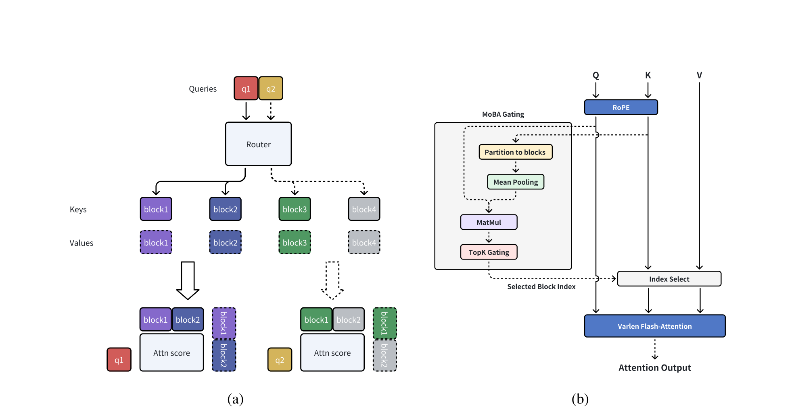
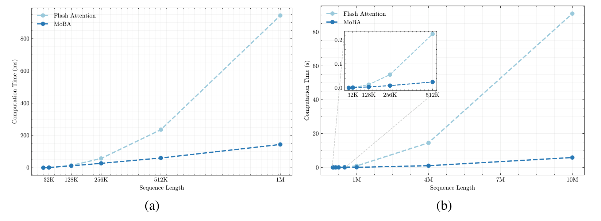

# MoBA：Mixture of Block Attention

## 来源

- 文件：`raw/2502.13189v1.pdf`
- 标题：MoBA: Mixture of Block Attention for Long-Context LLMs
- 团队 / 日期：Enzhe Lu 等；Moonshot AI + 清华 + 之江实验室 / 浙大；通讯 Xinyu Zhou、Mingxing Zhang、Jiezhong Qiu；arXiv:2502.13189v1，2025-02-18
- 代码：[MoonshotAI/MoBA](https://github.com/MoonshotAI/MoBA)（摘要）
- 定位：**方法论文**。把 MoE 的 top-k 门用到 softmax 注意力的 KV 块选择。对照表见 [稀疏注意力机制对比](../comparisons/sparse-attention-mechanisms.md)。作者写已部署到 Kimi 的长上下文请求（摘要）；本 PDF 没有生产层配置。

**不建模型页。** Llama-8B-1M-MoBA 是从 Llama 3.1 8B 续训的研究检查点。

## 核心结论

1. **少结构、让模型自己选看哪。** 作者把 sink / 滑窗写成任务相关的预置偏置，把线性注意力写成换核、难接已有 Transformer（§1）。MoBA 仍是 softmax，只是每个 query 只看一部分 KV 块。
2. **块均值 gating，没有另训 indexer。** 把长度 $N$ 切成 $n$ 块、块长 $B=N/n$。分数 $s_i=\langle q,\mathrm{meanpool}(K[I_i])\rangle$，再 top-$k$（Eq. 5–6）。参数量与 full attention 相同（§2.2）。
3. **当前块强制选中 + 不能看未来块**，保住因果；当前块注意力加因果 mask，因为块均值会漏进未来 token。作者把它类比 MoE 的 shared expert（§2.2）。
4. **和 full attention 能切换。** 层初始化可选 full 或 MoBA，训练中途也能改。1.5B / 32K 上 90% token 走 MoBA、后 10% 切 full，position-wise loss 几乎贴 full（Figure 5a）。SFT 时后几层改回 full，缓解 prompt mask 的稀疏梯度（Figure 5b–c）。
5. **效率**：1M prefill 相对 FlashAttention 报最高 **6.5×**；固定 95.31% 稀疏把长度推到 10M 报 **16×**（Figure 2）。下游评测 **prefill 用 MoBA、生成切回 full**（§3.3）。

> Figure 1（原文截图，§2）："Illustration of mixture of block attention (MoBA). (a) A running example of MoBA; (b) Integration of MoBA into Flash Attention."

## 机制（已据原文核实）

$$
\mathrm{MoBA}(q,K,V)=\mathrm{Softmax}\!\left(\frac{qK[I]^\top}{\sqrt{d}}\right)V[I],\qquad I=\bigcup_{g_i>0}I_i.
$$

PDF Eq. 2 的 Softmax 分母写法被排版挤掉，实现按标准 scaled-dot-product。$I_i=[(i-1)B+1,iB]$。

**门不是独立网络。** Algorithm 1：$K$ 按块均值得到 $\bar K\in\mathbb{R}^{n\times h\times d}$，$S=Q\bar K^\top\in\mathbb{R}^{N\times h\times n}$，再加因果 mask 做 top-$k$。分数带 **head 维**，所以是 **每 head 独立选块**，不是 DSA 那种全头共享一份 top-k。wiki 比较表此前写「共享」，是二手推断，以本页为准。

因果两条（§2.2）：

- 未来块：$s_i=-\infty$。
- 当前块：强制 $g_i=1$，块内因果 mask。脚注 3：top-$k=3$ 时，每个 query 最多看 **2 个历史块 + 当前块**。

SWA / attention sink 被写成 MoBA 的特殊门（永远选最近块 / 最近+开头）。Quest 被写成更小块 + min/max 池化的 MoBA；Longheads 是 top-1 的 MoBA（§4）。这些是作者归类，不是那些论文的自称。

实现（Algorithm 1）：当前块走因果 FlashAttention，选中历史块走非因果变长 FlashAttention，再用 online softmax 拼。query 按块重排，类似 MoE token 分组。

细粒度：32K / 1.5B 上保持 75% 稀疏，从 2/8 块收到 32/128，validation loss 差约 $10^{-2}$，更细更好（Figure 4）。

## 架构与训练

缩放（Table 1）：568M–2.1B，Chinchilla token，seq 8K，$B=512$，top-$k=3$，稀疏 $\le 81.25\%$。与 full attention **只换注意力模块**，超参相同。8K validation loss 差在 $10^{-3}$ 内（Figure 3a）。32K trailing loss（最后 2K、且序列打满）MoBA 略高，差距随算力收（Figure 3b）。

1M 续训（§3.3）：从 **Llama 3.1 8B Base** 起，128K→256K→512K→1M，256K 起用 position interpolation。1M 阶段激活 MoBA **100B token**，$B=4096$，top-$k=12$，稀疏 $\le 95.31\%$。**最后 3 层保持 full，其余 29 层改 MoBA**。SFT 同样从 32K 爬到 1M。对照 Llama-8B-1M-Full 走同一配方、全程 full。Llama 3.1 8B 基座是 GQA，这是续训起点，不是 MoBA 论文自己发明的头结构。

## 评测要点

Table 2（MoBA vs Full，同 1M 续训）：多数项打平。RULER @128K **0.7818 vs 0.7849**（该长度稀疏 $\le 62.5\%$）。LongBench @32K 0.4828 vs 0.4821。GSM8K 0.7278 vs 0.7142；HumanEval 0.6951 vs 0.7012。NIAH 到 1M「satisfactory」（Figure 7），原文没给格子分数表。

评测口径：**prefill 稀疏、decode 切回 full**。不要把 Table 2 读成 decode 也稀疏。

> Figure 2（原文截图，§2.3 / §3.4）："(a) Computation time scaling of MoBA versus Flash Attention on 1M model with increasing sequence lengths (8K-1M). (b) … maintaining a constant sparsity ratio of 95.31% (fixed 64 MoBA blocks with variance block size and fixed top-k=3)."

正文写 1M prefill 最高 6.5×、10M 注意力时间 16×。短序列（32K–512K）两者接近，长了才拉开。

## 证据边界与阅读提示

- Decode 切回 full 之后，KV 仍随长度涨；稀疏收益主要在 prefill。

## 待追问

- **需实验或作者披露**：生产 Kimi 用的 $B$ / top-$k$ / 哪些层 full，本 PDF 没有。
- **需实验或作者披露**：每 head 独立 top-k 在 GQA 上会不会变成「组内并集」、把访存又打满，原文没讨论。[NSA](nsa.md) 专门为这个做了组内加总。
- **需实验或作者披露**：没有 RL。比较页把 MoBA 的 RL 稳定性列为 open problem，本页不能闭合。
- **需实验或作者披露**：与 [MSA](msa.md)（独立 idx 投影 + 每 GQA group）和 [NSA](nsa.md)（压缩注意力当选块分）没有同协议对照。

## 相关页面

- 比较：[稀疏注意力机制对比](../comparisons/sparse-attention-mechanisms.md)
- 概念：[高效长上下文注意力](../concepts/efficient-long-context-attention.md)
- 同属可训稀疏、选择器不同：[NSA](nsa.md)（压缩注意力分数）、[MSA](msa.md)（独立 Index Branch）、[DSA](../concepts/deepseek-sparse-attention.md)
- 作者归类的近邻（那些论文未必自称 MoBA）：Quest、Longheads
