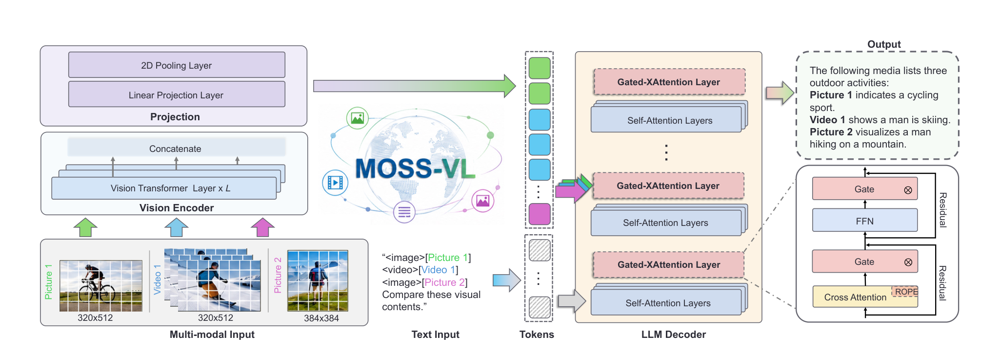
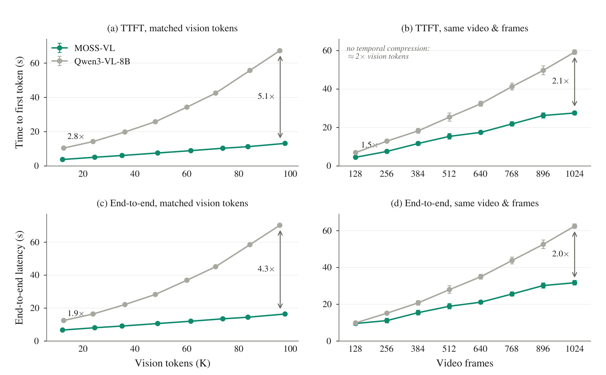

# MOSS-VL 技术报告

## 来源

- 原始 PDF：[`raw/2608.15045v1.pdf`](../../raw/2608.15045v1.pdf)（arXiv:2608.15045v1，2026-08-15，22 页）
- 标题：*MOSS-VL Technical Report*
- 团队：OpenMOSS Team（复旦大学、上海创新研究院、MOSI Intelligence）
- 代码与权重：论文给出 [GitHub](https://github.com/OpenMOSS/MOSS-VL)、[项目页](https://openmoss.ai/MOSS-VL/) 与 OpenMOSS-Team Hugging Face 组织。
- 模型实体：[MOSS-VL](../models/moss-vl.md)

## 核心结论

**原文确证（§1、Table 1）**：MOSS-VL 将实时视觉交互分成 L1--L5。L2--L4 已覆盖持续输入、等待合适时机再答、以及同一问题随画面演化而多次回答；L5 的额外要求是**模型生成回复时仍持续感知新帧**，因而能在证据变化时修订或截断自己。

论文的核心不是在既有 VLM 上外接轮询器，而是三处协同：

1. **架构**：视觉 patch token 不进入语言模型正在解码的 token 序列；语言状态只通过 gated cross-attention 读取视觉 KV。因此新帧到达时只需编码该帧并追加 cross-attention cache。
2. **时间表示**：XRoPE 在 cross-attention 内把文本 query 与视觉 key 放进同一 `(t,h,w)` 坐标系；每帧另带可读的绝对时间戳 token，避免把采样位置误当真实秒数。
3. **行为训练**：末阶段 Realtime-SFT 用 `<|silence|>` / `<|response|>` 两个状态 token，把“何时说、何时等、何时自我修正”化为下一个 token 预测。

论文将 L5 行为作为其实现与 live demo 的定性展示；公开基准只能覆盖 L2--L4，**不能把后面的主动响应分数解读为 L5 的定量验证**（§1、§6.2、§7）。

## 架构与训练

### Gated cross-attention：把视觉留在解码序列外

> Figure 2（原文截图，§2 Architecture）：视觉 token 只作为 cross-attention 的 key/value；12 个 gated cross-attention 层与 36 个纯文本 self-attention 层交错，门控标量从零初始化。

**原文确证（§2.1--§2.5、Table 2）**：MOSS-VL 以 [Qwen3-8B](../models/qwen3.md) 初始化语言部分、以 [Qwen3-VL](../models/qwen3-vl.md) 的视觉编码器初始化视觉部分。解码器包含 36 个 self-attention 层与每四层一个的 12 个 gated cross-attention 层；cross-attention 用 32 query / 8 KV heads 的 GQA 和 QK-RMSNorm。视觉编码器为 27 层，抽取第 8/16/24 层和最终层特征，经 2×2 merge 与 MLP 投影到 4096 维。

两条 engineering 结果由此直接产生：

- **追加式流输入**：新增帧不重编码旧帧、不重算旧视觉 KV；文本侧只增加时间戳和一个 placeholder，而每帧的 patch 都留在 cross-attention cache。
- **零扰动冷启动**：cross-attention 与其 FFN 路径由零初始化 tanh scalar gate 包裹，先保留完整语言 backbone，再逐步学会用视觉信息。

### XRoPE 与绝对时间

> Figure 3（原文截图，§2.3 XRoPE）：文本 token 三轴同增；同一帧的 patch 共用时间锚点、在 height/width 方向展开；视觉 key 与文本 query 在 cross-attention 前应用 XRoPE。

XRoPE 的 64 个 RoPE frequency pairs 按 `(t,h,w)=(24,20,20)` 分配。这里的 `t` 是相对序列坐标；真实时间另由每帧前置的 `<|time_start|>X.X seconds<|time_end|>` token 给出（§2.3--§2.4）。这使 1--16 fps 的动态、motion-adaptive 采样仍能保留可读 wall-clock timing。

### 分阶段基础训练与轻量 Realtime-SFT

| 阶段 | token | 最大序列 | 可训练模块 | 作用 |
| --- | ---: | ---: | --- | --- |
| 对齐 | 150.3B | 8K | projection + cross-attention | 用 image caption / OCR 接通两套预训练部件 |
| 大规模多模态预训练 | 203.0B | 64K | 全模型 | 扩展 image/video、OCR、grounding、文档与文本覆盖 |
| 高质量多模态预训练 | 459.0B | 128K | 全模型 | 提高多模态理解、推理、数学、知识与 temporal grounding 比例 |
| annealing + long context | 450.1B | 256K | 全模型 | 长视频、长文档与高质量退火 |
| SFT | 102.8B | 128K | 全模型 | 得到离线的 MOSS-VL-Instruct |
| Realtime-SFT | 34.8B | 256K | 全模型 | 在 Instruct 上安装流式交互行为 |

表中数据来自原文 Table 4。Realtime-SFT 仅占整套训练 token 的不足 3%（§4），却是所有实时特有设计的落点：每帧后插一个 decision slot，目标可为静默、立即回复，或跨多个 slot 延续的回复；回复结束以静默 token 收束，而非用专门 interrupt token。

**原文确证（§4.2--§4.3）**：这一步使用 0.56M 个样本、约 34.8B token；包含 220 万个 emission decisions，58.7% 为没有新用户提问时的自主时机决策，5.1% 样本的正确答案是全程沉默。合成数据从密集、带时间锚点的 caption 中找目标状态转移，并逐帧核验“证据何时可见”与“答案何时失效”。

为避免 silence slot 压倒 loss，论文只对两种状态 token 加 inverse-frequency class weight 与 focal factor（`γ=2`）；回复 token 保持单位权重（§4.3）。它还屏蔽 assistant turn-final end token，避免流中用户插话被模型学成“本轮该收尾”；该单变量对照中 emission frequency 增加 39%、平均回复长度增加 68%。

### Kernel 与 serving

每个文本 query 只能看见自己之前帧的视觉 KV，形成随时间增长的 prefix visibility。论文为 FlashAttention-3 增加 `cross_kv_boundary`：以每个 query 一枚 32-bit 整数编码可见 KV 前缀，让越界 tile 在 kernel 内直接裁掉，而不是构造稠密 mask（§5）。离线 serving 采用已合入 SGLang 的实现；实时参考实现单独基于 Transformers 发布。

## 评测要点

### 离线与流式结果的边界

**原文确证（§6.1、Table 5）**：MOSS-VL-Instruct 在 39 个离线 benchmark 上与 Qwen3-VL-8B、Qwen2.5-VL-7B、LLaVA-OneVision-2-8B、Gemma-4-12B-IT 比较；它在 Minerva（40.5）、TOMATO（39.5）、VideoMME-Logical（17.1）等 temporal-reasoning video sets 领先，但在 MMMU、常规文档理解与部分 grounding 上落后。基线多取各报告的官方数字、推理设置可能不同；Gemma-4 列与 Qwen3-VL 的 OmniDocBench-v1.6 列是作者按自身协议重测，不能把整张表当严格统一复现。

**原文确证（§6.2、Table 6）**：MOSS-VL-Realtime 在四个 streaming benchmark 的三项平均分第一：OVO-Bench 70.2（runner-up 65.3）、OmniMMI 32.7（25.4）、ProactiveVideoQA 47.2（42.7）；StreamingBench visual average 69.7，次于 AURA 的 71.1。直接测“恰当时机主动开口”的三项子集也均领先：OmniMMI Proactive Alerting 66.0 vs 37.5、StreamingBench Proactive Output 60.0 vs 53.2、OVO-Bench FAR 62.1 vs 55.8。

### 视觉 token 越多，延迟优势越大

> Figure 4（原文截图，§6.3）：两模型以五次 cold start 均值测量；相同视频/帧数时，MOSS-VL 不做 temporal compression、约携带两倍视觉 token，仍不落后且随流变长扩大领先。

该比较使用同一 Qwen3-8B language backbone、单张 H200、BF16、SGLang、相同生成长度上限，每点为五次独立 cold start 均值（§6.3）。匹配 ViT output 时，TTFT 优势从 2.8× 扩至 5.1×，端到端优势从 1.9× 扩至 4.3×；相同视频与帧数时，MOSS-VL 为逐帧即时编码而不做 temporal compression，视觉 token 约为对手两倍，仍保持领先。

## 待追问

- **L5 的可复现定量评测怎样设计？** 论文明确说现有公开基准只到 L2--L4；“生成中被新证据推翻后正确修订/截断”的 counterfactual 轨迹、延迟阈值和判分协议仍缺失。
- **门控 cross-attention 的视觉遗忘如何受控？** 报告说明持续追加 KV，但未披露在接近 262K context 或超长 live stream 下的视觉 cache 管理、淘汰与精度曲线。
- **Realtime-SFT 与 RL 是否互补？** 作者公开路线图提到后续 RL；但如何在避免 false alarm 的同时维持主动发言频率、以及会否破坏离线能力，尚无消融。
- **离线强项和实时机制之间的因果关系？** temporal-reasoning 离线优势发生在不含实时语料的 Instruct checkpoint，但报告没有隔离视觉 cross-attention、时间数据与训练规模各自的贡献。

## 相关页面

- 模型：[MOSS-VL](../models/moss-vl.md)
- 视觉交互对照：[JoyAI-VL-Interaction](joyai-vl-interaction.md)、[MiniCPM-o 4.5](minicpm-o-4-5.md)
- 基座部件：[Qwen3](../models/qwen3.md)、[Qwen3-VL](../models/qwen3-vl.md)
- 概念：[多模态 Agentic 训练](../concepts/multimodal-agentic-training.md)、[Agentic 评测体系](../concepts/agentic-evaluation-benchmarks.md)
