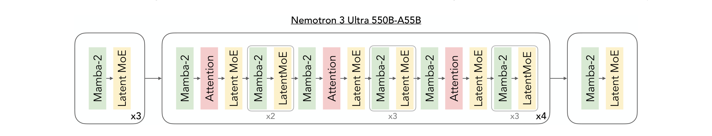
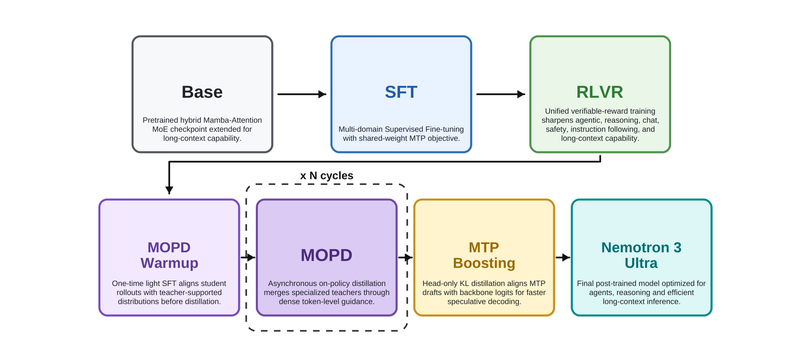

# Nemotron 3 Ultra 技术报告

## 来源

- 原始 PDF：[`raw/2606.15007v1.pdf`](../../raw/2606.15007v1.pdf)
- 标题：Nemotron 3 Ultra: Open, Efficient Mixture-of-Experts Hybrid Mamba-Transformer Model for Agentic Reasoning
- 版本 / 日期：arXiv:2606.15007v1，2026-06-12（PDF 页眉 2026-6-16）
- 团队：NVIDIA
- 模型页：[Nemotron 3 Ultra](../models/nemotron-3-ultra.md)
- 权重与配方：Base / Post-trained BF16 / NVFP4 / GenRM 开源；训练配方见 [NVIDIA-NeMo/Nemotron](https://github.com/NVIDIA-NeMo/Nemotron)

## 核心结论

Nemotron 3 Ultra 是 Nemotron 3 家族最大的开放权重模型：**550B 总参 / 55B 激活**，hybrid Mamba-2 + GQA Attention + [LatentMoE](../concepts/stable-latentmoe.md)，NVFP4 预训练 20T 文本 token，长上下文扩到 **1M**。后训练把统一 [RLVR](../concepts/post-training-for-agentic-models.md) 和 [Multi-Teacher On-Policy Distillation](../concepts/multi-teacher-on-policy-distillation.md) 叠在一起，而不是用 OPD 替换 mixed RL。

Headline 是吞吐而不是全面登顶：8K 输入 / 64K 输出、GB200、max-throughput NVFP4 下，相对 GLM-5.1-754B-A40B / Kimi-K2.6-1T-A32B / Qwen-3.5-397B-17B 报 **5.9× / 4.8× / 1.6×** 推理吞吐，准确率大体持平（`§1`、Figure 1）。口径注意：Ultra 用 TRT-LLM，对照用 vLLM；各家取「有/无 speculative decoding」里更好的那个。

对本库最有增量的不是规模，而是 **MOPD 第一次公开跑通两轮 teacher–student co-evolution**，并按域给出恢复率：agentic / 工具使用可把 teacher–student 缺口关上大半甚至超过 teacher（Terminal Bench 2.0 **172.7%**），自包含推理几乎不动（HLE no tools **16.9%**）（`§3.3.4` Table 5）。作者把后者归因于 teacher 额外吃了 student 从未见过的 DeepSeek-V4-Pro 推理数据——student rollout 落在 teacher 支撑集外，token-level 监督失效。这直接回答了对比页「MOPD 循环有没有人真的跑通多轮」。

> Figure 1 | Accuracy and throughput comparisons for Nemotron 3 Ultra. Our model achieves on-par accuracy with other open LLMs while achieving significantly higher inference throughput on the 8K input / 64K output token setting.（`§1`）

## 架构与训练

### 总体架构（已据 Table 1 + `§2.1` 核实）

沿用 Nemotron 3 Super 的 hybrid Mamba-Attention MoE，放大到 550B/55B。大多数层是 [Mamba-2](mamba-2.md) + LatentMoE，周期插入 GQA Attention + LatentMoE；MTP 两个 head **共享参数**，每个 head 是一层 Attention + 一层 MoE。Mamba-2 层的状态方程与 SSD 算法见该来源页；本报告只给生产配置（state 128 / groups 8 / heads 256 / head dim 64），不重推机制。

| 维度 | 值 |
| --- | --- |
| 总层数 | 108 |
| Model dimension | 8192 |
| Q / KV heads | 64 / 2（GQA） |
| Head dimension | 128 |
| Mamba state / groups / heads / head dim | 128 / 8 / 256 / 64 |
| Expert hidden / shared expert intermediate | 5120 / 10240 |
| Total experts / Top-k | 512 / 22 |
| MoE latent size | 2048 |
| MTP layers | 2（共享权重） |

> Figure 2 | Nemotron 3 Ultra layer pattern. Similar to Nemotron 3 Super, we use a hybrid Mamba-Attention architecture scaled sparsely using LatentMoE layers.（`§2.1`）

LatentMoE 引用 Elango et al. 2026，和 [Kimi K3 的 Stable LatentMoE](../concepts/stable-latentmoe.md) 同属「routed 在 latent 空间」这一支，但配方不同：Ultra 是 512 expert / top-22、latent 2048，没有公开 SiTU-GLU 或 Quantile Balancing。注意力层是 **GQA 而非 MLA**，长上下文收益主要来自多数层的 [Mamba-2](mamba-2.md) 固定状态，而不是稀疏 softmax，也不是 KDA / Lightning Attention。

### 预训练

- **20T 文本 token**，Warmup-Stable-Decay：warmup 200B 到峰值 LR \(2.5\times 10^{-4}\)，最后 5T minus-sqrt 衰减到 \(2.5\times 10^{-6}\)（`§2.4`）。
- 两阶段混合：约 15T 偏多样性，后 5T 偏质量（Figure 4）。新增并开源 code refresh 173B（GitHub 截止 2025-09-30）、legal、fact-seeking / moral / MCQ-generative 合成数据。Legal 在 Nemotron 3 Nano 100B 续训消融上把 LegalBench 均分从 64.6 提到 74.7（`§2.3.5`）。
- **NVFP4** 预训练（E2M1 + 二维块量化）；最后 15% 网络（16 层）、Mamba 输出投影、latent / QKV / attention 投影、MTP、embedding 保持更高精度。作者称这是当时最大规模稳定 NVFP4 训练。从 5T/10T/16T 切到 BF16 续训 74B，相对 train loss 差平均低于 0.4%（`§2.2` Figure 3）。
- **长上下文 CPT**：1,048,576 长度占 92% 迭代、4,096 占 8%（同 iteration 不混长度），共 33B token；混合是 46% 长上下文数据 + 54% Phase 2；**不用 RULER 风格数据**（`§2.5`）。
- MTP loss 缩放 0.1。终检用 500B token 滑动窗口 checkpoint merge。

### 训练稳定性（`§2.7`）

两次 loss 发散：

1. **~8T**：输出层局部梯度累加从 FP32 改 BF16，两个 MTP 对共享输出层的 wgrad 在 7-bit mantissa 下几乎丢失；MTP-2 loss 先炸。回滚并恢复 FP32 reduction 后稳住。
2. **~16T**：原因未确定。从 15T 提前退火并把总 token 从原计划缩短到 20T 才避开。伴随现象：第一层 MoE 的 MaxVio 从约 4.8 升到 12T 时约 12；早期层 residual norm 在 7.5T 开始升、11T 附近剧增。作者明确 **MaxVio 相关但不因果**，切到全 BF16 也消不掉第二次发散。

Base 评测 Table 2：MMLU-Pro 79.07、MATH 82.00、HumanEval 83.84，相对 DeepSeek-V3.2-Exp-Base / Kimi-K2-Base / GLM-4.5-Base 在知识和代码上领先；RULER 1M **76.83**（后训练后到 94.7）。GSM8K 88.10 低于 Mistral-Large-3 的 91.21。

## 后训练

相对 Super 的连续 RL 流水线，Ultra 改成：SFT → 统一 RLVR → **MOPD warmup** → **两轮 MOPD** → MTP Boosting。

> Figure 9 | Overview of the post-training pipeline for Nemotron 3 Ultra.（`§3`）

**SFT** 两阶段 packed sequence：294,912 token × 204,800 samples，再扩到 515,000（含至 512K 长上下文）× 19,200 samples；保留共享权重 MTP，辅助 loss 0.1（`§3.1`）。数据覆盖长上下文、medium-effort 推理、多语 safety、search / terminal / SWE / 对话工具、数学证明、科学、CUDA kernel、RTL、多语翻译等。截断 reasoning 样本时 **mask `</think>`**，不让模型学「提前结束思考」。

**RLVR** 覆盖 terminal、办公、SWE、search、通用工具、math/code/STEM、safety、chat、IF、长上下文 QA 等；harness 多样以防过拟合单一格式。异步 GRPO（沿 Super 的稳定性补丁），global batch 8192、每样本 16 rollout，生成长度 48K 再升 64K（`§3.2`）。

**推理档位**：reasoning-off / regular / medium-effort。medium-effort 在 SFT 引入、RLVR 用约 2.5% prompt 加长度惩罚优化。AA Index V4 上 medium-effort 相对 regular **约 2.5× 少 token、准确率大约掉 7%**（`§3.5` Figure 11）。

### MOPD：两轮 co-evolution

动机（`§3.3`）：混合环境 RLVR 里每个域在 batch 里样本太少，信号被稀释。于是并行训 **超过 10 个** 域专家 teacher，再在 student 自己的 rollout 上做 dense token-level 监督。引用 Thinking Machines Lab 博客、Nemotron-Cascade 与 Xiao et al. 2026。

> Figure 10 | Two-iteration MOPD training pipeline for Nemotron 3 Ultra. Iteration 1 distills signals from general and agentic teachers into Ultra MOPD1. Iteration 2 initializes additional teachers from Ultra MOPD1, reuses first-round teachers, and distills all resulting signals into Ultra Final.（`§3.3`）

**目标**是 student-first reverse KL，写成 sampled-token 的负 reverse-KL 当 advantage（公式 1–2）：

$$\hat A_t = \mathrm{sg}\big[\log \pi_{T_i}(y_t|s_t) - \log \pi_{\mathrm{prox}}(y_t|s_t)\big]$$

异步实现把 **behavior policy** 和作为 trust-region 中心的 **proximal policy** 拆开，behavior-to-prox 重要性比 \(c_t\) + PPO clip 的 \(r_t(\theta)\)，token mask 用 [IcePop](ring-1t.md)（`§3.3.1` 公式 3；一手出处 Ring-1T）。生成长度 **192K**（对齐最长的 teacher 训练）；batch **1024 prompt × 1 rollout**——消融里多样本 rollout 没有额外收益。

**Warmup**（`§3.3.3`）：teacher 与 student 若走不同 SFT，student 轨迹对 teacher 是 OOD，监督不可靠。对策是 MOPD 前做一次很轻的、取自 teacher 训练分布的 SFT。Table 4：

| Benchmark | Student | Warmup 后 MOPD | 无 Warmup | Teacher |
| --- | ---: | ---: | ---: | ---: |
| GDPVal | 28.9 | **46.7** | 35.3 | 49.5 |
| BrowseComp | 31.0 | **44.4** | 33.0 | 51.0 |
| HLE (no tools) | 25.6 | 26.7 | 26.3 | 32.1 |

Agentic 域 warmup 几乎是必要的；HLE 几乎无增益。这与 [KAT-Coder-V2.5](kat-coder-v2.5.md) 的 off-policy cold start 是同一类「先把 student 拉进 teacher 支撑集」的补丁，但 Ultra 用的是短 SFT 而不是 truncation。

**按域恢复率**（Table 5，Recovery = \((\mathrm{MOPD2}-\mathrm{RLVR})/(\mathrm{Teacher}-\mathrm{RLVR})\)）：

| Benchmark | SFT | RLVR | MOPD1 | MOPD2 | Teacher | Recovery |
| --- | ---: | ---: | ---: | ---: | ---: | ---: |
| Terminal Bench 2.0 | 34.5 | 44.5 | 50.8 | 54.0 | 50.0 | **172.7%** |
| GDPVal | 23.2 | 28.9 | 46.7 | 46.7 | 49.5 | 86.4% |
| SWE-Bench Verified | 63.5 | 65.8 | 70.1 | 71.7 | 72.5 | 88.1% |
| TauBench Telecom | 55.7 | 82.7 | 91.2 | 92.9 | 94.0 | 90.3% |
| BrowseComp | 14.3 | 31.0 | 41.0 | 44.4 | 51.0 | 67.0% |
| LiveCodeBench v6 | 85.5 | 87.4 | 90.0 | 89.0 | 92.4 | 32.0% |
| IMOAnswerBench (no tools) | 85.1 | 84.5 | 88.1 | 88.6 | 92.5 | 51.3% |
| HLE (no tools) | 19.7 | 25.6 | 25.9 | 26.7 | 32.1 | **16.9%** |
| OmniScience Non-Hallucination | 4.8 | 46.3 | 77.9 | 78.7 | 87.0 | 79.6% |
| IFBench (prompt loose) | 62.3 | 78.4 | 80.0 | 81.7 | 83.0 | 71.7% |
| Multi-Challenge | 53.3 | 60.3 | 62.8 | 63.8 | 63.3 | 116.7% |

作者读法（`§3.3.4`，原文确证）：MOPD 在「teacher 优势能写成 student **已经能采样到的**轨迹上的 token 偏好」时最有效——工具选择、环境交互、abstention、多步执行。HLE 的 teacher 优势来自额外大规模 SFT+RL（DeepSeek-V4-Pro 生成的推理混合），student 没见过这些路径，on-policy 分数打在 OOD 前缀上，信号变差。Terminal Bench 上 MOPD2 超过 teacher，作者举例是办公/生产力 teacher 向 data science 任务的正迁移。

**作者自己试过、当前设定下没有变好的变体**（`§3.3.5`，不要读成「这些方向无效」）：

- **Logit matching / top-k 或 full-vocab 分布匹配**在 Terminal Bench 等 agentic 基准上**不如 sampled-token**。假设是 student 前缀对 teacher 支撑不足时，全分布匹配会放大校准很差的 logits。这与 [DeepSeek-V4](deepseek-v4.md)「full-vocab 更稳」的工程选择直接对照，两边都没有在同一模型上做公平消融。
- 多数 agentic 任务实际用 **PivotRL 式单轮 rollout**，不是端到端多轮；端到端与推理环境混训时 rollout 时长差太大。

STEM teacher 在 Table 3 上逼近 DeepSeek V4 Pro (High)：GPQA 88.5 vs 89.1，LiveCodeBench v6 90.0 vs 89.8，HLE 32.1 vs 34.5。Competitive Coding teacher 再在 3.5K 过滤题上 RL，LCB v6 +2.4。

### MTP Boosting（`§3.4`）

backbone 冻结，只训 MTP head。动机是 teacher-forced 训练与自回归草稿推理的隐状态噪声不匹配。训练时第 \(k\) 步的输入从先前各步隐状态中采样。损失是对 backbone logits 的 **temperature-scaled forward KL**（\(T=2\)，带 \(T^2\) 因子，引 Hinton 2015），关掉 gold-token CE。SPEED-Bench 上平均 acceptance length 从 4.387 到 4.584（draft length 7，greedy）。RLVR 里 MTP \(k=5\) 把 rollout 生成做快 **1.46×**，收益集中在长尾慢轨迹（Figure 12）。

## 评测要点

Table 10 与六家开源对照（MiniMax-2.7、GLM-5.1、Kimi-K2.6、Qwen-3.5、DS-v4-Pro、DS-v4-Flash）。作者定位是 **agentic-first、整体均衡**，不是全面 SOTA：

- Terminal Bench 2.1 **56.4**（Kimi 67.2 更高）
- SWE-Bench Verified **70.7** / Multilingual **67.7**（落后 GLM/Kimi 约 5–9 点）
- PinchBench **90.0**、ProfBench Search **56.0**——这两项是 **held-out generalization gate**：不进训练监控和选 checkpoint，只评最终模型一次（`§3.7.2`）
- TauBench V3 均分 **70.9**；BrowseComp **44.4**（低于 GLM 59.4 / Kimi 61.3）
- IOI 2025 **570.0**（作者称落在 2025 官方人类第 2–3 名之间）
- RULER 1M **94.7**；OmniScience Non-Hallucination **78.7**（对照里最高；Qwen 7.4、V4-Pro 5.7）
- HLE no tools **26.7**（V4-Pro 37.7、Kimi 34.8）

量化：一份 NVFP4 checkpoint 可当 W4A16 或 W4A4 部署；Table 18 对照 BF16，多数项差距很小（Figure 1 里 NVFP4 柱几乎贴着 BF16）。Mamba SSM cache 相对 FP8 KV 在长 decode 下更占优（Figure 14）。

## 待追问

- **sampled-token vs full-vocab 的反转**：Ultra 在 agentic 上 sampled-token 更好，V4 主张 full-vocab 更稳。差在 teacher 是否 in-support、还是估计器本身？两边都没有交叉复现。
- **HLE 16.9% 恢复是否可解**：统一 SFT 再分域、或先用 teacher 造 SFT 再 MOPD，作者列为未做的 Foundations 实验（`§3.3.5`）。
- 第二轮 MOPD 在 GDPVal 上 **46.7 持平 MOPD1**，Terminal Bench 继续涨。哪些域需要第二轮、哪些一轮就饱和？
- 预训练第二次发散（16T residual / MaxVio）切到 20T 是权宜；NVFP4 不是原因，真正的优化病理仍不清楚。
- Figure 1 吞吐对照混用 TRT-LLM 与 vLLM，5.9× 不能直接读成架构因子。

## 相关页面

- [Nemotron 3 Ultra（模型页）](../models/nemotron-3-ultra.md)
- [Mamba-2](mamba-2.md)（hybrid 栈里 SSM 层的 SSD 机制原文，不是 delta rule）
- [Multi-Teacher On-Policy Distillation](../concepts/multi-teacher-on-policy-distillation.md)
- [On-Policy Distillation 跨报告对比](../comparisons/on-policy-distillation.md)
- [Agentic 模型的后训练](../concepts/post-training-for-agentic-models.md)
- [Thinking Machines Lab On-Policy Distillation 博客](thinking-machines-on-policy-distillation.md)
- [Stable LatentMoE](../concepts/stable-latentmoe.md) / [高效长上下文注意力](../concepts/efficient-long-context-attention.md) / [多 token 预测](../concepts/multi-token-prediction.md)
- [MoE 前沿模型扩展](../concepts/moe-frontier-model-scaling.md)
- [2026 前沿模型技术报告对比](../comparisons/2026-open-model-technical-reports.md)
- [Ring-1T](ring-1t.md) - IcePop 一手出处
