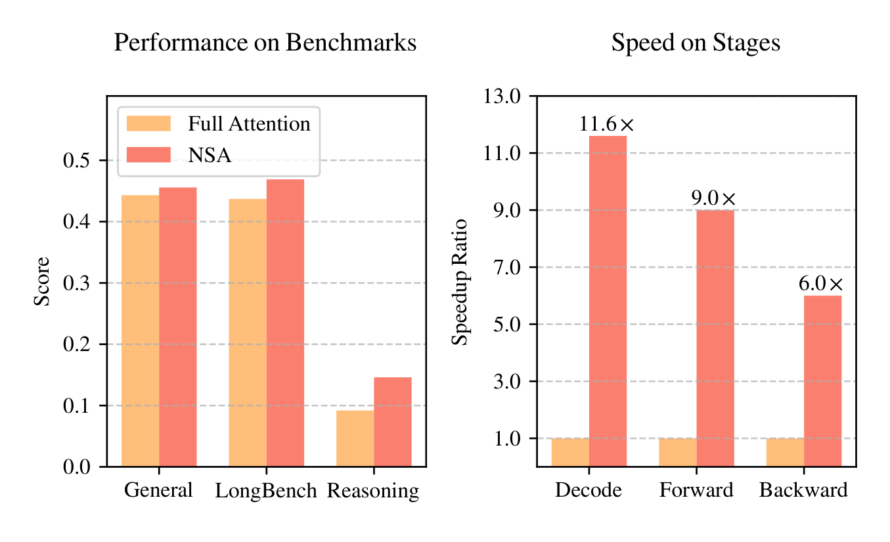
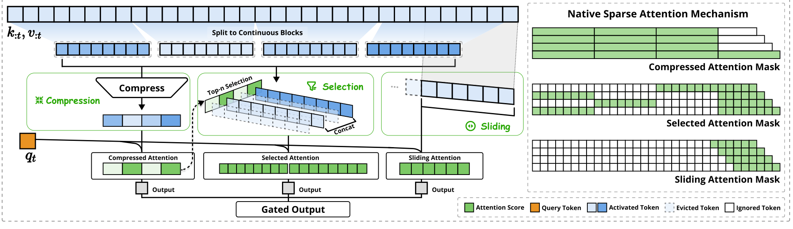
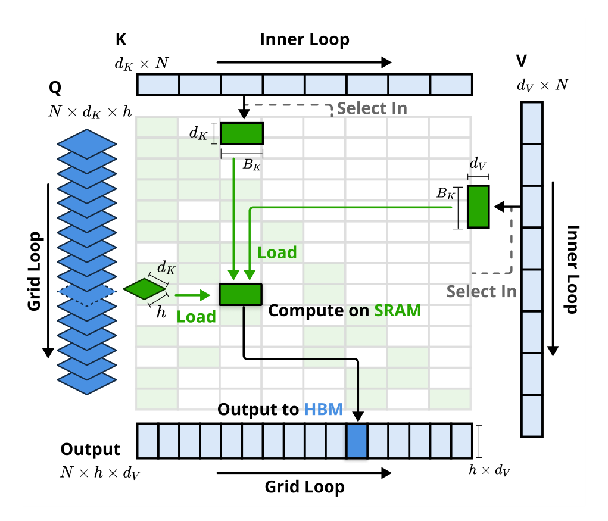

# NSA：Native Sparse Attention

## 来源

- 文件：`raw/2502.11089v2.pdf`
- 标题：Native Sparse Attention: Hardware-Aligned and Natively Trainable Sparse Attention
- 团队 / 日期：Jingyang Yuan（DeepSeek-AI 实习）等；DeepSeek-AI + 北大 + University of Washington；通讯 yuanjy / mzhang_cs（北大）、zengwangding / wenfeng.liang（DeepSeek）；arXiv:2502.11089v2，2025-02-27
- 定位：**方法论文**。在 27B 总参 / 3B 激活的 GQA+MoE 研究骨干上从头稀疏预训练，不发布命名产品模型。机制归属 [高效长上下文注意力](../concepts/efficient-long-context-attention.md) 的内容稀疏一支，是 [DSA](../concepts/deepseek-sparse-attention.md) 的直接前作。对照表见 [稀疏注意力机制对比](../comparisons/sparse-attention-mechanisms.md)。

## 核心结论

1. **现有推理期稀疏常是幻觉**（§2）。许多方法只加速 prefill 或只加速 decode；按头独立选 KV 在 GQA/MQA 上会变成「组内并集」，算力稀了、访存还在。推理期再剪枝还会偏离预训练轨迹（top 20% attention 只覆盖约 70% 分数）。训练侧则卡在不可微选择（k-means / SimHash）或 token 级散读，FlashAttention 用不上。
2. **NSA = 三路并行注意力，再门控相加**（§3.2–3.3）。对每个 query，把历史 KV 映射成更紧的 $\tilde K_t,\tilde V_t$，走压缩粗粒度、选块细粒度、滑窗局部三条路，输出

$$
o_t^\ast=\sum_{c\in\{\mathrm{cmp},\mathrm{slc},\mathrm{win}\}} g_t^c\cdot\mathrm{Attn}(q_t,\tilde K_t^c,\tilde V_t^c),
$$

$g_t^c$ 由输入经 MLP + sigmoid 得到。保持 $N_t=\sum_c\mathrm{size}[\tilde K_t^c]\ll t$。
3. **选择分数不是另训一个 indexer**。选块重要性直接从压缩注意力的 softmax 分数 $p_t^{\mathrm{cmp}}$ 按空间关系聚合而来（Eq. 8–9）。GQA/MQA 组内各 query head 的块分加总，保证同组共用一套选中块，decode 少载 KV（Eq. 10）。
4. **从头稀疏预训练能打平或超过 Full Attention**，并在 64K 上给出 decode / forward / backward 的实测加速（Figure 1：11.6× / 9.0× / 6.0×）。摘要写 260B token，§4.1 写 270B，未解释差额。

> Figure 1（原文截图，§1）："Comparison of performance and efficiency between Full Attention model and our NSA. Left: Despite being sparse, NSA surpasses Full Attention baseline on average across general benchmarks, long-context tasks, and reasoning evaluation. Right: For 64k-length sequence processing, NSA achieves substantial computational speedup compared to Full Attention in all stages: decoding, forward propagation, and backward propagation."

## 机制（已据原文核实）

> Figure 2（原文截图，§1–3）："Overview of NSA’s architecture. Left: The framework processes input sequences through three parallel attention branches: For a given query, preceding keys and values are processed into compressed attention for coarse-grained patterns, selected attention for important token blocks, and sliding attention for local context. Right: Visualization of different attention patterns produced by each branch."

### 压缩分支（§3.3.1）

连续块聚成一条压缩 key/value。压缩 key

$$
\tilde K_t^{\mathrm{cmp}}=\bigl\{\varphi(k_{id+1:id+l})\;\big|\;0\le i\le\lfloor(t-l)/d\rfloor\bigr\},
$$

$\varphi$ 是带块内位置编码的可学习 MLP；$l$ 是块长，$d$ 是相邻块步长。实验取 **$l=32$、$d=16$**（$d<l$ 减轻信息断裂）。压缩表示吃粗粒度语义，并给下一支提供打分。

### 选块分支（§3.3.2）

只靠压缩 token 会丢细粒度，所以再保留若干连续块里的原始 token。选块而不是选单个 token，理由是 GPU 连续读 + Tensor Core，以及 Full Attention 的注意力分数本身呈块状聚集（Figure 8）。

重要性：$p_t^{\mathrm{cmp}}=\mathrm{Softmax}(q_t^\top\tilde K_t^{\mathrm{cmp}})$。若选择块与压缩块对齐（$l'=l=d$），直接 $p^{\mathrm{slc}}=p^{\mathrm{cmp}}$；实验里 **$l'=64\neq l$**，用 Eq. 9 按空间重叠把压缩块分加到选择块上。GQA 组内再对 head 求和。Top-$n$ 块拼接成 $\tilde K_t^{\mathrm{slc}}$。实验 **$n=16$**，其中固定激活 1 个初始块 + 2 个局部块。

### 滑窗分支（§3.3.3）

局部模式学得快，容易短路压缩和选择。因此单独开 $w$ 的最近 token 支路（实验 **$w=512$**），三支注意力隔离计算，再用门聚合。三支还用**各自独立的 K/V**，进一步挡住捷径，额外开销被写成很小。

### Kernel（§3.4、Figure 3）

压缩和滑窗可套 FlashAttention-2。选块支不能按时间连续的 query 块装 SRAM——同一块里的 query 要的 KV 块可能不相交。改成：**每个位置把一个 GQA 组内全部 query head 装进 SRAM**（它们共享同一套稀疏 KV 块），内循环按 $I_t$ 连续取 KV 块。外循环放 Triton grid。

> Figure 3（原文截图，§3.4）："Kernel design for NSA. The kernel loads queries by GQA groups (Grid Loop), fetches corresponding sparse KV blocks (Inner Loop), and performs attention computation on SRAM. Green blocks indicate data on SRAM, while blue indicates data on HBM."

## 训练

骨干：GQA + DeepSeekMoE，27B 总参 / 3B 激活，30 层，hidden 2560。GQA **4 group、64 head**，$d_q=d_k=192$，$d_v=128$。MoE：72 routed + 2 shared，top-6；第一层换成 SwiGLU MLP。NSA 与 Full Attention 都在 **8K 文本上预训练到收敛**（§4.1 写 270B token），再在 32K 上 continued training + SFT，位置扩展用 [YaRN](yarn.md)。没有 KL 对齐 full attention，没有 dense warmup → sparse adaptation。Figure 4 上 NSA 的预训练 loss 低于 Full Attention。

§6.1 在 3B 上试过另两套选块：辅助损失学 importance（类似 SeerAttention）和 Quest 式无参 min-max。二者 loss 都不如 NSA（Figure 7）。聚类选 token（ClusterKV）则卡在动态聚类、簇间不均衡和强制重聚类。

## 评测要点

Table 1（预训练通用榜，NSA avg **0.456** vs Full **0.443**；9 项里 7 项更高）：

| | MMLU | MMLU-PRO | CMMLU | BBH | GSM8K | MATH | DROP | MBPP | HumanEval | Avg |
| --- | --- | --- | --- | --- | --- | --- | --- | --- | --- | --- |
| Full Attn | 0.567 | 0.279 | 0.576 | 0.497 | 0.486 | 0.263 | 0.503 | 0.482 | 0.335 | 0.443 |
| NSA | 0.565 | 0.286 | 0.587 | 0.521 | 0.520 | 0.264 | 0.545 | 0.466 | 0.348 | **0.456** |

LongBench（Table 2）：各推理期稀疏基线把每 query 激活 token 对齐到 2560（含前 128 + 局部 512，按 StreamLLM 口径），对应 NSA 处理 32K 时的平均激活数。NSA 平均 **0.469**，Full 0.437，Exact-Top 0.423，Quest 0.392，InfLLM 0.383，H2O 0.303。64K NIAH 全位置正确（Figure 5）。

推理期对照里的 InfLLM 是 Xiao et al., 2024a（*training-free* context memory），**不是** [InfLLM-V2](infllm-v2.md)。

CoT：从 DeepSeek-R1 蒸馏，10B token、32K 数学轨迹 SFT。AIME 24，温度 0.7、top-p 0.95、16 次平均（Table 3）：

| 生成上限 | Full Attention-R | NSA-R |
| --- | --- | --- |
| 8K | 0.046 | **0.121** |
| 16K | 0.092 | **0.146** |

这是 SFT 蒸馏，不是 RL。作者写小模型上 RL 效果有限才改走蒸馏。

效率（8×A100；与训练相同的 GQA/NSA 超参）。Figure 6：Triton NSA vs Triton FA2，64K forward **9.0×**、backward **6.0×**。Table 4：decode 每步最多载 $\lfloor(s-l)/d\rfloor$ 条压缩 token + $n l'$ 条选中 token + $w$ 条邻居；64K 等价访存 5632 vs Full 的 65536，期望 **11.6×**。作者把 decode 写成 memory-bound，加速近似随访存线性。

## DSA 相对 NSA 改了什么

下面是对照已 ingest 的 [DSA](../concepts/deepseek-sparse-attention.md) / [DeepSeek-V3.2](deepseek-v32.md) 的**本页综合**，不是 NSA 原文自己写的演进表。

| | NSA（本页） | DSA（V3.2 / GLM-5） |
| --- | --- | --- |
| 输出结构 | 三支 Attn 门控相加；三支独立 K/V | 单路：indexer 选完再进 MLA-MQA core |
| 「谁打分」 | 压缩注意力 softmax，无独立 indexer | 单独的 Lightning Indexer（少量 head） |
| 选择粒度 | 块（$l'=64$，$n=16$） | token（$k=2048$） |
| 跨头 | GQA 组内共享选中块 | 所有 query head 共享一份 top-k（MLA-MQA） |
| 局部 / 粗粒度 | 显式滑窗支 + 压缩支 | 不做成并列输出支 |
| 训练 | 从头稀疏，只靠 LM loss | dense warmup → sparse，KL 对齐 full attention |
| 底座 | GQA + MoE 研究骨干 | MLA |

可以看成：DSA 把「可训练的选择器」收成轻量 indexer，把粒度从块收到 token，把三路门控收成一路，并加上相对 dense teacher 的蒸馏；代价是 indexer 自己变成每层 $O(L^2)$，后面才有 [IndexCache](indexcache.md) 去摊。NSA 的选择分数绑在压缩支路上，IndexCache 那种「复用 lightning indexer 的 top-k 张量」不能原样套上——若要跨层复用，复用的是选中块下标。IndexCache §5.2 写过 NSA 也可能受益，但没有实验。

## 待追问

- 摘要 260B vs §4.1 270B。
- 三支独立 K/V 的参数量和 decode 访存增量没有单独拆开；Table 4 的 5632 是上界合计。
- 门 $g_t^c$ 学到了什么（是否常把质量压在选块支上）没有消融。
- [InfLLM-V2](infllm-v2.md) 已入库：可训练块稀疏、5B 短→长，不是本页 related work 的 InfLLM（Xiao 2024a）。它在同一 8B dense 检查点上复现 NSA 适应，loss 先炸；那是 short-to-long 协议，不能用来否定本页 27B 从头稀疏。
- 没有 RL 稳定性数字。AIME 是 R1 蒸馏 SFT。后续 DSA 在 GLM-5 RL 上踩的 top-k 非确定性，本页尚未遇到。
- 没有 128K / 1M 质量；64K kernel 数字是 Triton vs Triton FA2，不是生产 kernel。

## 相关页面

- 概念：[DeepSeek Sparse Attention](../concepts/deepseek-sparse-attention.md)、[高效长上下文注意力](../concepts/efficient-long-context-attention.md)、[跨层索引复用](../concepts/cross-layer-index-reuse.md)
- 对比：[稀疏注意力机制对比](../comparisons/sparse-attention-mechanisms.md)
- 后作与叠加：[DeepSeek-V3.2](deepseek-v32.md)、[IndexCache](indexcache.md)、[MSA](msa.md)
- 同时期块稀疏、门是块均值不是压缩注意力：[MoBA](moba.md)
- 短→长、共享 KV、压缩只打分：[InfLLM-V2](infllm-v2.md)（不要和本页从头稀疏横比）
- 32K 续训用的位置扩展：[YaRN](yarn.md)
