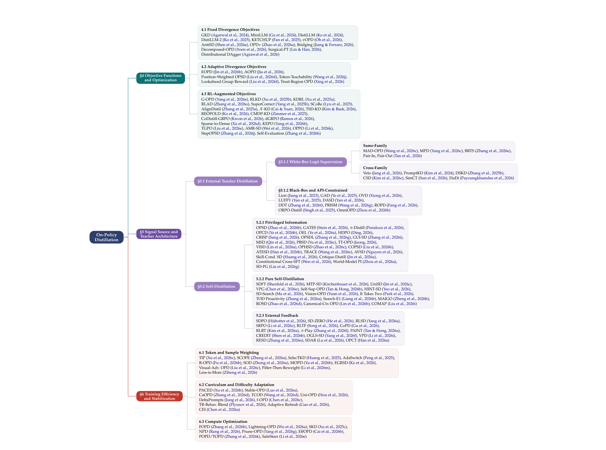

# OPD 综述：On-Policy Distillation for Large Language Models

## 来源

- 原始 PDF：[`raw/2604.00626v4.pdf`](../../raw/2604.00626v4.pdf)
- 标题：A Survey of On-Policy Distillation for Large Language Models
- 版本 / 日期：arXiv:2604.00626v4，2026-06-18（v1 2026-04-01）。页眉为 Preprint。arXiv 记录把这篇标成 Ongoing Work
- 作者：Mingyang Song、Mao Zheng（腾讯 LLM 部）
- 清单：<https://github.com/nick7nlp/Awesome-LLM-On-Policy-Distillation>
- 模型链接：**未建模型页**。这是综述，不发布模型，也没有新的训练曲线

## 为什么这篇在 wiki 里独占一席

库里已经有 GKD、MiniLLM、OPSD、ExOPD、Revisiting、Many Faces 和 Lightning 的一手页，以及各家技术报告的用法对比。这篇的增量是一张**作者自己的地图**：什么算 on-policy、三条设计轴、以及他们从文献里归出来的失败类型。具体数字以一手页为准。v4 的日期是 2026-06-18，晚于 Many Faces（5 月）和 Lightning OPD（4 月的预印、9 月的 v3 他们引的是 Wu et al. 2026a），早于 [Lightning OPD 2.0](lightning-opd-2.md)（7 月 30 日）。2.0 的跨 teacher 残差不在这版综述里。

## 他们怎么定义 OPD

On-policy 的判据只看数据从哪来（`§2`，Defining “on-policy”）：训练期望是当前学生 \(p_\theta\) 自己的生成，不是固定语料，也不是 teacher 事先生成的分布。形式是

\[\min_\theta \mathbb{E}_{x\sim\mathcal{D}}\mathbb{E}_{y\sim p_\theta(\cdot|x)}[L(y,x;\theta,T)].\]

\(\theta\) 一变，\(p_\theta\) 就变，所以每步要新的 rollout。范围写明包含学生自己生成、且有 teacher 或 verifier 监督的模仿学习、在线 RL 和偏好优化。排除通用 off-policy KD、剪枝量化，以及不改权重的推理时方法。

统一目标把采样分布和局部匹配拆开（`§2.3`）：

\[\mathcal{L}_{\mathrm{OPD}}(\theta)=\mathbb{E}_{y\sim\pi_{\mathrm{mix}}}\sum_t D_f\big(p_T(\cdot|x,y_{<t}),\, p_\theta(\cdot|x,y_{<t})\big).\]

\(D_f(P\|Q)=\mathbb{E}_{y\sim Q}[f(P(y)/Q(y))]\)。他们把 \(f(u)=u\log u\) 叫 forward KL（mode-covering），\(f(u)=-\log u\) 叫 reverse KL（mode-seeking），并给了 JSD 和 \(\alpha\)-divergence。这是连续分布上的经典说法。离散词表上 forward / reverse 同驻点、有限步差在 head 与 tail，见 [AKL](akl.md)，不要用这段覆盖那一页。

三条轴对应目标里的三个选择（`§3.1`，Figure 1）：

1. **目标**：\(f\) 选 mode-seeking、mode-covering，还是逐 token 自适应，或再加外部 reward。
2. **信号**：谁提供 \(p_T\)。先分外部 teacher 和自蒸馏，外部再分 white-box logits 和 black-box 文本或标量。Black-box 拿不到 token 分布，散度只能退化成序列级替代。
3. **动态**：\(\pi_{\mathrm{mix}}\) 的插值、难度课程、token 加权、以及少算 teacher 的系统做法。

一篇方法只归一个主类，按「最特别的贡献」而不是所有贡献。他们写，到 2026 年初自蒸馏是最大、增长最快的一类。

> Figure 1. Taxonomy of On-Policy Distillation methods organized along three design axes: (1) Objective function design (§4), (2) Signal source and teacher architecture (§5), and (3) Training efficiency and stabilization (§6).（`§3.1`）

## 他们自己的机制判断

这些判断是综述的综合。被点名的论文若本库已有一手页，以一手页为准。

**DAgger 的 \(O(\epsilon T)\) 不会自动转移到 LLM**（`§2.2` Remark）。Ross et al. 2011 的交互专家要在任何状态给出合宜动作。White-box OPD 的 teacher 是在学生前缀上的下一 token 分布。前缀如果离 teacher 的训练分布太远，teacher 条件分布本身会失准，再逼学生去配它，就不满足交互模仿的假设。他们引 Jeong (2026)：无条件 token 匹配加上周期性把 teacher 硬重置，一次重置就能把 KL 从 2.637 打到 0.343，输出崩掉。本库里同一现象的测量是 [Revisiting OPD](revisiting-opd.md) 的不可靠 teacher，以及 [Many Faces](many-faces-opd.md) 的 GPQA 前缀实验（62.12%→45.96%）。综述把这三篇收进 `§7.2` 的 flawed prefix trap，没有重做实验。

**GKD、MiniLLM、DistiLLM 被放成早期三角**（`§2.3`）。GKD 的 \(\pi_{\mathrm{mix}}=\lambda p_\theta+(1-\lambda)p_{\mathrm{data}}\)，散度不固定。MiniLLM 把 reverse KL 做成 REINFORCE，reward 是 \(\log(p_T/p_\theta)\)。DistiLLM 用混合分布避免零概率。综述写「GKD 的实验里 \(\lambda=1\) 在他们测过的散度上都优于 off-policy，JSD 在翻译上最好」。[GKD 一手页](generalized-knowledge-distillation.md) 的口径更细：最优散度是 task-dependent，GSM8K 上 on-policy 比例低于 25% 时增益不稳。引用实验排序时用那一页，不用这段转述。

**G-OPD / ExOPD**（`§4.3`）。综述把标准 OPD 写成 \(\alpha=1\) 的 dense KL-constrained RL，\(\alpha>1\) 叫 reward extrapolation，并说多 teacher、同基座时学生能超过各位 domain teacher。目标里的系数他们写成 \(\alpha\)，[ExOPD 原文](exopd.md) 用的是 \(\lambda\)。综述还写「teacher 概率低但 outcome reward 仍然高」；原文的外推项是 \(\log\pi^\star-\log\pi_{\mathrm{ref}}\)，主实验没有另加可验证的 outcome reward。超过 teacher 的范围、1200-step teacher 上不再项项超过，以原文 Table 2 和附录 C 为准。

**Full-vocab 与 Lightning**（`§4.1`）。综述转述 Thinking Machines 的 sampled-token advantage 方差高、丢掉未采样 token，并转述 DeepSeek-V4 用全词表 KL 更稳。工程细节和「10+ trillion」这类规模句不要从综述抄，以 [V4 来源页](deepseek-v4.md) 为准。Lightning OPD 被记成：在 teacher consistency 下预计算 SFT rollout 的 teacher log-prob，相对标准 OPD 有 4.0×。这与 [Lightning OPD](lightning-opd.md) 的 Table 2 一致（8B，120→30 GPU 时）。综述没有 2.0。

**失败目录**（`§7.2`）按原因而不是按症状。除了 flawed prefix trap，还有：ListOPD 在结构化输出上给 \(\lambda>1\) 一个 clip-safe 阈值，超过就从保格式变成塌格式；Rock Tokens 称饱和后仍有至多 18% 的 token 损失下不来，因果干预说它们对推理贡献可忽略；Zhu et al. 就是 Many Faces 的三条（前缀错配、未归一化 Top-K 的有偏梯度、实例级 PI 上 OPSD 学到无 PI 的共识）；梯度 SNR 在通过率接近 0 时消失；自蒸馏缩短轨迹时会去掉 hedging（epistemic suppression）；strong-to-weak 上 teacher 仍校准、但 top-K 边际变平，叫 local teachability collapse。这些条目是文献归类。本库没有 ListOPD、Rock Tokens 和 local teachability 的一手页，引用时要带综述定位符，不要写成已经重读过那些 PDF。

## 开放问题里他们明确标成猜想的部分

`§2.4` 和 `§9` 讨论蒸馏缩放。Busbridge et al. (2025) 是 **off-policy** 的容量缺口：teacher 强到一定程度后，学生吸收饱和。综述写了一个 on-policy 损失的猜想形式

\[L(N_S,N_T,D_{\mathrm{on}})=E+\frac{A}{N_S^\alpha}+\frac{B}{N_T^\beta}+\frac{C}{D_{\mathrm{on}}^\gamma}+f(N_S,N_T),\]

并写明 **speculative，没有在 on-policy 上验证过**。不要把它当成定律。文中 DeepSeek-R1 的 AIME 2024 随学生规模 28.9%→55.5%→69.7%→72.6%（1.5B→7B→14B→32B）被标成 off-policy 证据，不是 OPD 曲线。

其余开放问题：teacher 的不确定性没有进梯度；多轮 agent 的信用分配和环境非平稳；teacher 自己还在变时怎么蒸馏；on-policy 的信息下界未知；跨词表和跨模态的散度；以及失败模式缺少训练中的诊断，而不是事后看榜。

## 与现有 wiki 页的关系

- **[OPD 比较页](../comparisons/on-policy-distillation.md)**：比较页按各家报告的目的、估计器和流水线位置分行。这篇按方法论文的设计轴分行。两边都不是实验。比较页上的数字不要改成综述的转述。
- **[MOPD 概念页](../concepts/multi-teacher-on-policy-distillation.md)**：七层论证讲的是逼近一个固定 teacher。综述的 ExOPD 小节和失败目录是旁边的两支：外推可以越过 teacher，前缀失准可以让 teacher 信号本身坏掉。
- **[GKD](generalized-knowledge-distillation.md)**：综述的 \(\lambda\) 是数据混合，和 ExOPD 的 reward scale 不是同一个符号。综述自己在 ExOPD 小节改用了 \(\alpha\)。
- **[f-OPD](f-opd.md)**：v4 放在训练动态轴（Figure 1 的 6.2，方法表写成 Freshness-aware control / Trajectory / Async-OPD lag bounding）。正文一段把它收成用 freshness budget 限制 rollout 与更新之间的 lag。原文还有 rollout / supervision 两项 KL、ReLU 样本权重和 rollout 锚定。Coding 数字以原文 Table 1–2 为准。
- **v4 没收的后续**：Lightning OPD 2.0、以及 2026 年 6 月 18 日之后的预印本。清单仓库可能比 PDF 更新，不能用网页补进「综述已核实」。

## 待追问

- **现有材料待核**：引言把 Gemma 2 和 Qwen3、V4、MiMo 并列为采用 OPD 的系统。Table 2 的工业行如何描述 Gemma 2，本页没有逐格核对。Gemma 2 是否是学生 rollout 上的 OPD，要以 Gemma 技术报告为准。
- **现有材料待核**：Jeong (2026) 的 KL 2.637→0.343 只出现在综述的转述里。本库没有那篇 PDF。
- **需补外部来源**：ListOPD、Rock Tokens、local teachability collapse 只有综述级转述。
- **需实验或作者披露**：猜想缩放式的指数，以及 \(C/D_{\mathrm{on}}^\gamma\) 与 teacher 规模是互相替代还是互相卡住。作者自己标成未验证。

## 相关页面

- [On-Policy Distillation 跨报告对比](../comparisons/on-policy-distillation.md)
- [Multi-Teacher On-Policy Distillation](../concepts/multi-teacher-on-policy-distillation.md)
- [GKD](generalized-knowledge-distillation.md)
- [MiniLLM](minillm.md)
- [AKL](akl.md)
- [OPSD](opsd.md)
- [ExOPD](exopd.md)
- [Revisiting On-Policy Distillation](revisiting-opd.md)
- [The Many Faces of OPD](many-faces-opd.md)
- [Lightning OPD](lightning-opd.md)
- [Lightning OPD 2.0](lightning-opd-2.md)
- [f-OPD](f-opd.md)
- [Thinking Machines Lab On-Policy Distillation 博客](thinking-machines-on-policy-distillation.md)
