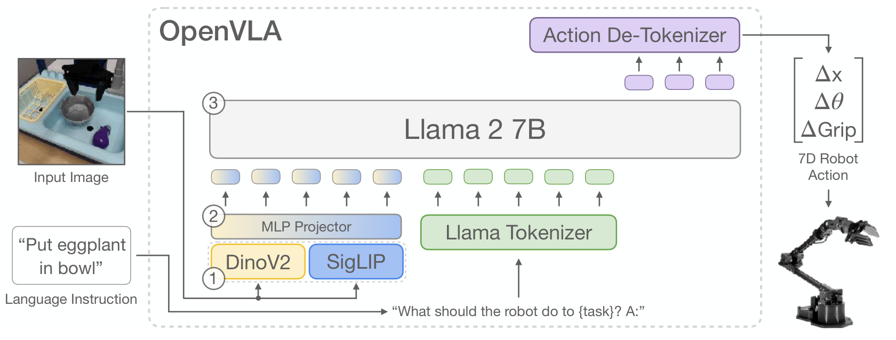
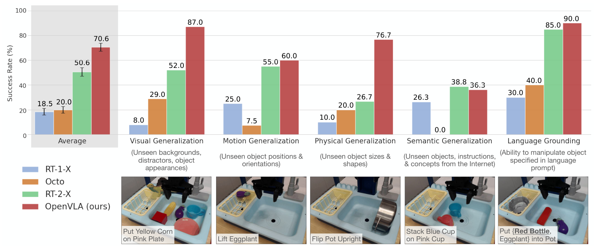

# OpenVLA

## 来源

- **PDF**：`raw/2406.09246v3.pdf`（arXiv:2406.09246v3，2024-09-05）
- **标题**：OpenVLA: An Open-Source Vision-Language-Action Model
- **团队**：Stanford / UC Berkeley / Toyota Research Institute / Google DeepMind / Physical Intelligence / MIT（通讯：Moo Jin Kim、Karl Pertsch、Siddharth Karamcheti）
- **会议**：CoRL 2024（PDF 正文未写会议名；外部佐证见 [项目页](https://openvla.github.io/)）
- **代码**：[github.com/openvla/openvla](https://github.com/openvla/openvla)（外部；不得把 README 意图升级成原文确证）
- **模型页**：[OpenVLA](../models/openvla.md)

## 核心结论

OpenVLA 把已有视觉语言模型（VLM）直接 fine-tune 成机器人控制策略：输入一张第三人称图像和一句自然语言指令，自回归预测离散动作 token，再反量化成连续 7 维控制。论文称这是当时首个开源、可跨本体 out-of-the-box 控制、并系统研究下游高效微调的 generalist VLA（§1、§2）。

相对封闭的 RT-2-X（55B），OpenVLA 用 7B 参数、约 7× 更少参数，在 29 个任务、两个本体上绝对成功率高 16.5 个百分点（摘要；Bridge Table 4 + Google robot Table 6 合计 17+12 任务）。相对从零训练的 Diffusion Policy，下游微调绝对成功率高 20.4 个百分点（摘要；明细 Table 7）。语义泛化一项 RT-2-X 仍更强，论文归因于对方用互联网视觉语言数据做 co-fine-tune，而 OpenVLA 只在机器人数据上 fine-tune（§5.1）。

## 架构与训练

### 标准 VLA 配方

论文把 VLA 写成：在互联网规模视觉语言数据上预训练的 VLM，再接到机器人动作预测（§2 “Vision-Language-Action Models”）。OpenVLA 的动作头不是另接连续回归网络，而是把连续动作写进语言模型词表，按语言 token 一样做 next-token 预测（§3.2，沿用 RT-2 / Brohan et al. 的离散化）。

> Figure 2（原文截图，§3）："Given an image observation and a language instruction, the model predicts 7-dimensional robot control actions. The architecture consists of three key components: (1) a vision encoder that concatenates Dino V2 and SigLIP features, (2) a projector that maps visual features to the language embedding space, and (3) the LLM backbone, a Llama 2 7B-parameter large language model."

### Backbone：Prismatic-7B

OpenVLA 的 VLM 不是凭空搭的，而是 fine-tune 已有的 Prismatic-7B（§3.1，Karamcheti et al.）：

| 组件 | 原文配置（§3.1） |
| --- | --- |
| 视觉编码器 | 约 600M；SigLIP 与 DINOv2 **分别**编码同一组 image patch，特征 **通道维拼接**（fused / DinoSigLIP） |
| Projector | 小型 2 层 MLP，把视觉特征映到 LLM 输入空间 |
| LLM | Llama 2 7B |
| VLM 视觉语言数据 | LLaVA 1.5 mixture，约 1M 图文/纯文本样本 |

论文在 BridgeData V2 上比较过 IDEFICS-1、LLaVA 与 Prismatic：多物体语言接地任务上 LLaVA 比 IDEFICS-1 高 35 个百分点，Prismatic 再比 LLaVA 大约高 10 个百分点，归因于融合视觉编码器的空间推理（§3.4）。不要把 backbone 写成 PaLI、LLaVA 或「某个 7B VLM」——最终模型是 Prismatic-7B。

### 动作：7 维 × 256-bin token

训练时把动作预测写成视觉语言任务：图像 + 指令 → 一串动作 token（§3.2）。

- 每维动作单独量化成 **256 个 bin**；bin 宽均匀划分该维训练数据的 **1%–99% 分位数**（不用 min-max，以免离群点撑开区间、降低有效分辨率）。
- \(N\) 维动作得到 \(N\) 个 \(\in\{0,\ldots,255\}\) 的整数。OpenVLA 的控制是 **7 维**（Figure 2：\(\Delta x, \Delta\theta, \Delta\mathrm{Grip}\)）。
- Llama tokenizer 只预留约 100 个 special token，不够 256 个动作 token；做法是 **覆盖词表中最少使用的最后 256 个 token**（同样沿用 RT-2）。
- 训练目标是标准 next-token 交叉熵，**只在动作 token 上计 loss**，不计输入图像/指令 token。
- 推理：模型吐出动作 token → Action De-Tokenizer 反量化成连续控制，闭环执行（Figure 2、§3.5）。

这是后续 flow-matching / 扩散动作头论文要对照的**开源离散动作 token 基线**。OpenVLA 原文没有比较那些连续动作配方；差异见 [待追问](#待追问)。

### 数据：Open X-Embodiment 约 970k

目标是覆盖多样本体、场景和任务，使模型能开箱控制多种机器人，并允许下游高效微调（§3.3）。

- 底座是 Open X-Embodiment（OpenX）。当时全集 **>70 个数据集、>2M 条轨迹**；OpenVLA 实际训练集约 **970k 条真实机器人演示**（摘要、§3 开篇）。
- 为对齐输入输出空间：只保留至少有一路第三人称相机、且使用 **单臂末端执行器控制** 的操作数据（§3.3）。异构传感器/动作空间留给未来工作（脚注 2）。
- 混合权重基本沿用 Octo：少样、低多样性数据集下调或剔除，任务/场景更丰富的上调（Table 3 / Appendix A）。
- 额外试过 DROID，混合权重 10%；训练中 DROID 的动作 token 准确率一直偏低，**最后三分之一训练去掉 DROID**，权重摊回其余数据集（§3.3、Table 3 脚注 6）。

### 训练设计选择（§3.4–3.5）

| 项 | 选择 | 依据 |
| --- | --- | --- |
| 图像分辨率 | 224×224，不用 384×384 | 评测无差别，后者训练约 3× 更慢 |
| 视觉编码器 | **训练时解冻** | 与常见「VLM 冻结视觉塔」相反；作者假设预训练视觉特征对精细空间控制不够 |
| epoch | **27** 个 epoch | 真实机器人表现随动作 token 准确率上升，直到 >95%；远多于 LLM/VLM 的 1–2 epoch |
| 学习率 | 固定 2e-5，无 warmup | 与 Prismatic VLM 预训练相同 |
| 算力 | 64×A100，14 天，约 21,500 A100-hours；batch 2048 | §3.5 |
| 推理 | bfloat16 约 15GB；RTX 4090 约 6 Hz（无编译/投机解码） | §3.5 |

## 后训练

原文没有 LLM 意义上的 SFT→RL 后训练。所谓「后训练」是把已经在 OpenX 上训好的 VLA **适配到新机器人/新任务**（§5.2–5.4），这是相对 RT-2-X 的明确增量：RT-2-X 的推理 API 不支持微调（§5.2）。

- **全量微调**：10–150 条目标任务演示，更新全部参数；单任务约 8×A100、5–15 小时（§5.2–5.3）。
- **LoRA**（Table 1）：rank=32 时成功率 68.2% vs 全量 69.7%，只训 1.4% 参数（97.6M / 7.19B），单卡 A100 10–15 小时，算力约降 8×。只训最后一层或冻结视觉编码器明显变差（30.3% / 47.0%），说明目标场景仍需改视觉特征。
- **量化推理**（Table 2）：int4 在 8 个代表性 Bridge 任务上 71.9%，与 bfloat16 的 71.3% 持平，显存 16.8GB→7.0GB。int8 因过慢（评测 GPU 上约 1.2 Hz vs 数据采集 5 Hz）掉到 58.1%；离线 token 准确率并不差（Appendix D.4）。

§5.3–5.4 的 LoRA/量化实验用的是较小数据混合、且视觉塔只有 SigLIP、没有融合 DINOv2 的变体（脚注 4）。不要把 Table 1/2 的数字直接当成最终 DinoSigLIP 7B 的唯一配置。

## 评测要点

评测是 A/B：同一任务、同一组初始机器人与物体状态（§5.1）。对照是 RT-1-X（35M，从零）、Octo（93M，从零、当时最强开源 generalist）、RT-2-X（55B，封闭 VLA）。

### BridgeData V2 WidowX（Figure 3 / Table 4）

17 任务 × 10 trials = 170 rollouts。OpenVLA 总成功率 70.6±3.2%，高于 RT-2-X 50.6±3.5%、Octo 20.0%、RT-1-X 18.5%。

> Figure 3（原文截图，§5.1）："We evaluate OpenVLA and prior state-of-the-art generalist robot policies on a comprehensive suite of tasks covering several axes of generalization, as well as tasks that specifically assess language conditioning ability. OpenVLA achieves highest overall performance and even outperforms closed-source model RT-2-X in all categories except for semantic generalization. Average success rates ± StdErr are computed across 170 total rollouts per approach."

| 类别 | RT-1-X | Octo | RT-2-X | OpenVLA |
| --- | ---: | ---: | ---: | ---: |
| Average | 18.5 | 20.0 | 50.6 | **70.6** |
| Visual generalization | 8.0 | 29.0 | 52.0 | **87.0** |
| Motion generalization | 25.0 | 7.5 | 55.0 | **60.0** |
| Physical generalization | 10.0 | 20.0 | 26.7 | **76.7** |
| Semantic generalization | 26.3 | 0.0 | **38.8** | 36.3 |
| Language grounding | 30.0 | 40.0 | 85.0 | **90.0** |

论文把对 RT-2-X 的优势归于三点（§5.1）：训练数据 970k vs 350k；更仔细的清洗（例如滤掉 Bridge 里的全零动作，Appendix C）；融合视觉编码器同时提供语义与空间特征。

### Google robot（Table 6）

12 任务 × 5 trials = 60 rollouts。OpenVLA 85.0±4.6%，RT-2-X 78.3±5.4%（误差条重叠，论文两者都加粗），RT-1-X 33.3%，Octo 26.7%。摘要里「29 任务 +16.5 个百分点」= Bridge 17 任务与 Google 12 任务合在一起。

### 下游微调：Franka 真机（Table 7）与 LIBERO 仿真（Table 12）

Franka-Tabletop（5 Hz）与 Franka-DROID（15 Hz），每任务 10–150 条演示。Diffusion Policy 在窄的单指令任务（如倒玉米、放胡萝卜）上更平滑、更准；OpenVLA / Octo 在多物体、需要语言接地的多样任务上更好。**OpenVLA 是唯一在所有测试任务上都至少 50% 成功的方法**（§5.2）。Franka-Tabletop 平均：OpenVLA 67.2% vs Diffusion Policy 48.5%；Franka-DROID：58.3% vs 35.0%（Table 7）。从零 fine-tune Prismatic（OpenVLA scratch）明显弱于先在 OpenX 上预训练再微调，说明 970k 机器人预训练有用。

LIBERO 是附录 E 的**目标套件监督微调**（不是 zero-shot），每套 10 任务 × 50 条演示，评测 3 seed × 500 trials。OpenVLA 用 LoRA r=32。相对 Diffusion Policy / Octo 的平均优势比真机微调更窄，论文归因于预训练纯真实数据、没有仿真（Appendix E.2）。

| 套件 | Diffusion Policy | Octo FT | OpenVLA FT |
| --- | ---: | ---: | ---: |
| LIBERO-Spatial | 78.3 | 78.9 | **84.7** |
| LIBERO-Object | **92.5** | 85.7 | 88.4 |
| LIBERO-Goal | 68.3 | **84.6** | 79.2 |
| LIBERO-Long | 50.5 | 51.1 | **53.7** |
| Average SR / Rank | 72.4 / 2.5 | 75.1 / 2 | **76.5 / 1.5** |

### 原文自报局限（§6）

- 只吃**单张第三人称图**，没有本体感觉、多相机、观察历史。
- 推理频率撑不住 ALOHA 这类 50 Hz 双臂灵巧控制；作者点名 action chunking 与投机解码作为可能出路。
- 相对 Diffusion Policy，窄任务上轨迹不够平滑精确（§5.2）。
- 测试任务成功率通常 **<90%**，可靠性仍不够。
- 未回答：更大 VLM 是否更好、机器人数据与互联网图文 co-training 是否必要、何种视觉特征最适合 VLA。

256-bin 离散化本身会限制动作分辨率；原文把分位数离散化写成「避免离群点降低有效粒度」（§3.2），但**没有**把它与后来的 flow-matching 连续动作头做对比——那是后文推断，见待追问。

## 待追问

- 离散 256-bin 自回归动作头，相对后续 flow-matching 连续动作到底损失了多少精度与高频控制能力？OpenVLA 原文没有这场比较。[π0](pi0.md) §VI-A 把 OpenVLA 重训到 π 混合物，归因于「不支持 action chunking / 高频」——那是 π 协议，不是本页 Bridge/Google robot 表。
- §6 自己问的 action chunking：加上之后能否补齐相对 Diffusion Policy 的灵巧度，而不放弃语言接地优势？
- RT-2-X 在 semantic generalization 上仍领先，是不是必须做互联网图文 co-training 才能保住 VLM 先验？OpenVLA 只在机器人数据上 fine-tune（§5.1）。
- 单臂 7D 末端 + 单第三人称图这条数据约束，后续 skill / 双臂 / 长周期组合论文要改哪一层（观察、动作空间，还是只改后训练）？

## 相关页面

- 模型：[OpenVLA](../models/openvla.md)
- 概念：[Vision-Language-Action](../concepts/vision-language-action.md)
- 连续 flow + action expert：[π0](pi0.md) / [模型](../models/pi0.md)（原文 §VI-A 在 π 混合物上对照过本模型）
- 开世界 co-training：[π0.5](pi0.5.md)
- 本库后续 VLA 实例（MoT + 连续动作，不是 256-bin）：[InternVLA-A1.5 技术报告](internvla-a1.5.md) / [InternVLA-A1.5](../models/internvla-a1.5.md)
