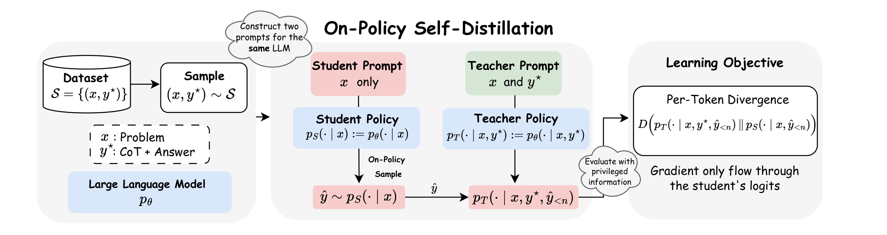
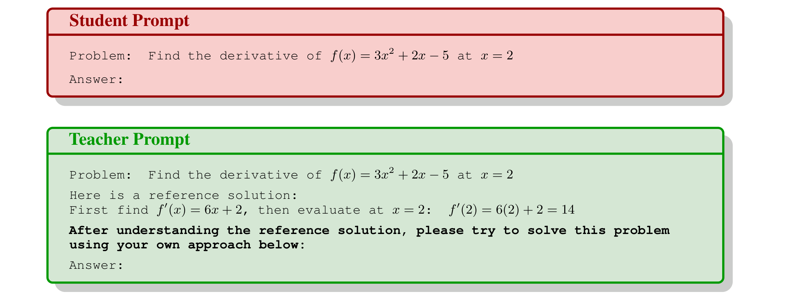
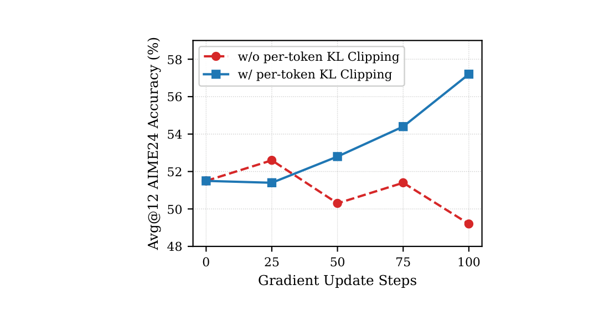
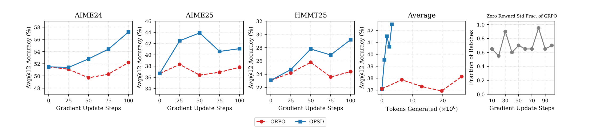

# OPSD：On-Policy Self-Distillation

## 来源

- 原始 PDF：[`raw/2601.18734v3.pdf`](../../raw/2601.18734v3.pdf)
- 标题：Self-Distilled Reasoner: On-Policy Self-Distillation for Large Language Models
- 版本 / 日期：arXiv:2601.18734v3，2026-03-20（v1 2026-01-26）
- 作者：Siyan Zhao（UCLA，实习于 Meta）、Zhihui Xie（HKU）、Mengchen Liu / Jing Huang / Guan Pang / Feiyu Chen（Meta Superintelligence Labs）、Aditya Grover（UCLA）
- 代码：<https://github.com/siyan-zhao/OPSD>
- 模型链接：**未建模型页**——不发布新模型实体；实验是 Qwen3-Instruct 1.7B / 4B / 8B 上的 LoRA 后训练

## 为什么这篇在 wiki 里独占一席

它把 [OPD](../concepts/multi-teacher-on-policy-distillation.md) 的「外部 teacher」换成 **同一套权重、不同上下文**：teacher 看参考解答 \(y^\star\)，student 只看题目 \(x\)，监督仍打在 student 自己的 rollout 上。知识库此前只通过 [nrehiew 博客](nrehiew-sft-rl-opd.md) 转述这篇，有一处需要按原文校准的口径：**主实验用的是 teacher-first forward KL 的 full-vocab 蒸馏，不是 2026 各家生产 OPD 的 reverse KL**；reverse KL 在 Table 3 上几乎没涨、后期还掉。

> Figure 1. Overview of On-Policy Self-Distillation (OPSD): … The learning objective minimizes the per-token divergence \(D(p_T \parallel p_S)\) along the student’s rollout. … gradients backpropagate only through the student’s logits.（`§1`）

## 核心结论

1. **同一模型、两种条件分布**（`§3.2`）：\(p_T(\cdot|x,y^\star)\triangleq p_\theta(\cdot|x,y^\star)\)，\(p_S(\cdot|x)\triangleq p_\theta(\cdot|x)\)。student 采样 \(\hat y\sim p_S(\cdot|x)\)，再在每个前缀上最小化 teacher 与 student 的 next-token 发散度（公式 1 / 8）。teacher **不生成 token**，只对 student 轨迹做一次带 privileged prefix 的前向。
2. **Teacher 在训练中冻结为初始策略**（`§4.1`）：不是跟着 student 一起更新的「当前自己」。稳定化理由是防止偏离初始策略过远。再叠加 LoRA，所以训练时 teacher 与 student 甚至不是同一份可训练参数。
3. **默认目标是 full-vocab forward KL**，带词表级 pointwise clipping。Table 3（Qwen3-1.7B，AIME25 Avg@12）：

| 发散度 | Base | Step 50 | Step 100 |
| --- | ---: | ---: | ---: |
| Forward KL \(D_{\mathrm{KL}}(p_T\parallel p_S)\) | 36.7 | **43.9** | 41.1 |
| Reverse KL \(D_{\mathrm{KL}}(p_S\parallel p_T)\) | 36.7 | 37.5 | 35.0 |
| JSD(\(\beta=0.5\)) | 36.7 | 36.9 | 39.0 |

4. **相对 GRPO 的效率来自 dense 信号，不是更大的采样预算。** OPSD：1 rollout × 1024 token、100 step；GRPO：8 rollout × 16k、最多 500 step。Figure 3 上 100 step 内 OPSD 全面超过 GRPO；同期 GRPO 超过一半 batch 的组内 reward std 为 0，梯度消失。
5. **同一份 OpenThoughts 数据上 SFT 会掉点**，作者归因于参考解答偏短、SFT 把测试时生成长度压短；OPSD 把这些短解答当 privileged prefix，而不是模仿目标。

Table 2（Avg@12，评测 thinking 开、最长 38k）：

| 模型 | 方法 | AIME24 | AIME25 | HMMT25 | Average |
| --- | --- | ---: | ---: | ---: | ---: |
| Qwen3-8B | Base | 75.8 | 65.6 | 43.9 | 61.8 |
| | SFT | 72.3 | 64.2 | 42.9 | 59.8 |
| | GRPO | 76.4 | 68.9 | **46.7** | 64.0 |
| | OPSD | **77.8** | **70.8** | 45.8 | **64.8** |
| Qwen3-4B | Base | 74.9 | 66.4 | 42.2 | 61.2 |
| | SFT | 70.2 | 62.3 | 43.4 | 58.6 |
| | GRPO | 75.6 | 68.1 | 44.4 | 62.7 |
| | OPSD | **76.4** | **68.3** | **46.1** | **63.6** |
| Qwen3-1.7B | Base | 51.5 | 36.7 | 23.1 | 37.1 |
| | SFT | 48.4 | 36.3 | 22.7 | 35.8 |
| | GRPO | 51.1 | 38.3 | 23.7 | 37.7 |
| | OPSD | **57.2** | **43.9** | **29.2** | **43.4** |

OPSD 报的是 100 step 内每 20 step 评一次的最好点；GRPO 报 500 step 内峰值。1.7B 上增益最大（+6.3 均分），8B 上只比 GRPO 多 0.8，HMMT25 还略低。

## 方法

### Privileged prompt

> Figure 2. Prompt example for student and teacher policies. Both policies share the same parameters \(\theta\) but differ in conditioning context. … the teacher won’t be generating tokens—rationalization is done implicitly through one forward pass.（`§3.2`）

Teacher 被要求「看完参考解答后用自己的方法再解一遍」，但实际只 prefilling，不采样。这是把「评估 / 合理化比生成容易」的假设操作化。

Table 1 把 OPSD 放在 SFT / GRPO / 外部 teacher OPD 的对照里：on-policy、dense、低采样成本、**不需要外部 teacher**。

### 两条估计器，主实验走 GKD 那条

- **Full-vocab logit distillation**（[GKD](generalized-knowledge-distillation.md) 式）：每个位置对整张词表算 \(D(p_T\parallel p_S)\)，梯度只走 student。主实验用这条。
- **Sampled-token policy gradient**（Thinking Machines 式）：\(A_n=\log p_T(\hat y_n|\ldots)-\log p_S(\hat y_n|\ldots)\)，当 advantage。附录 D 把它写成 dense-reward PG，对照 STaR 的序列级 0/1 过滤。

Table 4（Qwen3-4B，生成 2048，pass@8）：full-vocab AIME25 84.1 / HMMT25 60.0，sampled-token 82.1 / 57.3。作者读法是完整 teacher 分布比只看采样 token 更密。这与 [Nemotron 3 Ultra](nemotron-3-ultra.md) 在 Terminal Bench 上「sampled-token 优于 logit matching」方向相反——任务域不同，两边都没有交叉复现。

### Style token 主导信号 → pointwise clipping

Table 5（10 道题平均的位置级 \(D_{\mathrm{KL}}(p_T\parallel p_S)\)）。主配置 TM-off student / TM-on teacher：

| 模型 | Style | Math | Other |
| --- | ---: | ---: | ---: |
| Qwen3-1.7B | 0.85 | 0.14 | 0.25 |
| Qwen3-4B | 0.92 | 0.10 | 0.29 |
| Qwen3-8B | 0.79 | 0.06 | 0.25 |

Style 关键词含 `wait` / `alright` / `hmm`；math 含 `exponent` / `logarithm` / `power`（附录 C）。即使选了 math KL 最高的 mode 配对，style 仍高一个数量级。对策不是丢掉这些 token，而是对词表项的 f-divergence 贡献做 \(\min(\ell_{n,v},\tau)\)。Figure 4：1.7B 无 clipping 在 AIME24 上 100 step 内从 ~51.5 掉到 ~49；有 clipping 升到 ~57。\(\tau\) **没有调参**（附录 B）。

> Figure 4. Effect of Per-Token pointwise KL Clipping on Qwen3-1.7B evaluated on AIME24. Clipping prevents performance collapse.（`§4.3.3`）

这与 [KAT-Coder-V2.5](kat-coder-v2.5.md) 的 drift-aware truncation、[Keye-VL-2.0](keye-vl-2.md) 的 top-k overlap 同属 token 级质量控制，但对象不同：OPSD 剪的是 **full-vocab 里少数高贡献的 style 词表项**，不是长轨迹 drift，也不是双方低概率 token。

### 生成长度与 thinking mode

把 student 生成从 1024 加到 4096 **没有稳定增益**（Figure 5）。作者归因于后段 token 对已看长前缀的 teacher 过于可预测，惩罚变弱——与 Thinking Machines 博客「前面 token 更关键」同方向。主实验固定 TM-off student / TM-on teacher，因为这个配对的 math-token KL 最高。

## 评测与效率

> Figure 3. Token Efficiency of OPSD. … At the same number of training steps, OPSD uses significantly fewer tokens but outperforms GRPO on all benchmarks. … more than half of its batches have zero reward standard deviation within 100 steps, yielding no gradient signal.（`§4.2`）

训练配置（Table 6）：有效 batch 32，LoRA r=64，8×A100/H100，OpenThoughts 数学子集最多 30K 题。评测 Avg@12、temperature 1.0、thinking 开。

## 与现有 wiki 页的关系

- **[GKD](generalized-knowledge-distillation.md)**：full-vocab、λ=1、teacher-first forward KL 的直接实例；OPSD 只是把 teacher 从「更大的外部模型」换成「带 \(y^\star\) 的冻结初始策略」。
- **[AKL](akl.md)**：100 step 内 forward KL 远强于 reverse KL，落在 AKL「有限步数、FKL 先 head」的区间；不要倒过来说 AKL 预测了 OPSD。
- **[Thinking Machines Lab 博客](thinking-machines-on-policy-distillation.md)**：sampled-token reverse KL 那条支路在本文是对照，不是默认；Table 4 显示它在这套数学设定上弱于 full-vocab。
- **[nrehiew 博客](nrehiew-sft-rl-opd.md)**：把 OPSD 引进 wiki 的二手来源。style vs math 的观察与 Table 5 一致；「更接近 RLHF 而非 RLVR」是 nrehiew 的评价，不是本文结论。本文默认 forward KL，与 nrehiew 转述的 reverse-KL 配方不是同一件事。
- **[Nemotron 3 Ultra](nemotron-3-ultra.md)**：生产 MOPD 试过 full-vocab，agentic 上不如 sampled-token。本文在竞赛数学 + LoRA 小模型上方向相反。
- Context distillation（Snell et al. 2022）、STaR / ReST：相关工作里的 off-policy / 硬标签自训练前身；OPSD 的差异是 on-policy + soft 分布匹配。

## 待追问

- **冻结初始 teacher vs 跟着更新的 teacher**：正文只说冻结更稳，没有量化「当前策略当 teacher」会怎么崩。
- **\(\tau\) 未调**：附录自己写更大模型可能还能再涨。clipping 是机制还是这个 \(\tau\) 碰巧够用？
- **1.7B 大涨、8B 几乎贴着 GRPO**：是小模型更吃 dense 信号，还是 OpenThoughts 对 8B 已经接近饱和？
- **竞赛数学以外有没有证据**：无代码、无 agent、无多 teacher。privileged \(y^\star\) 在没有参考解答的任务上怎么构造？
- concurrent SDPO（环境反馈当 privileged info，arXiv:2601.20802）与 SDFT（持续学习，arXiv:2601.19897）未收原文。

## 相关页面

- [Multi-Teacher On-Policy Distillation](../concepts/multi-teacher-on-policy-distillation.md)
- [On-Policy Distillation 跨报告对比](../comparisons/on-policy-distillation.md)
- [GKD](generalized-knowledge-distillation.md)
- [Thinking Machines Lab On-Policy Distillation 博客](thinking-machines-on-policy-distillation.md)
- [nrehiew 博客](nrehiew-sft-rl-opd.md)
- [MiniLLM](minillm.md)
- [AKL](akl.md)
- [Nemotron 3 Ultra 技术报告](nemotron-3-ultra.md)
