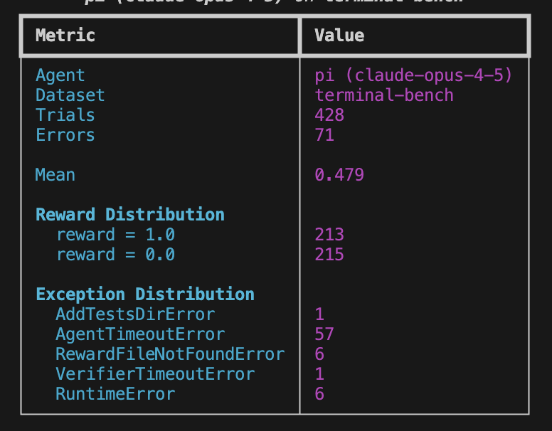
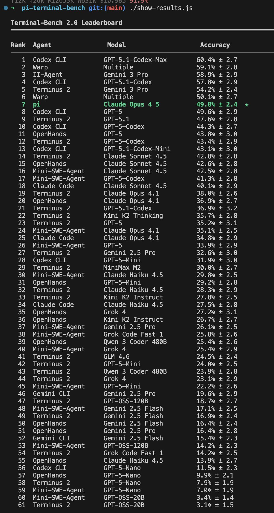

# Pi coding agent 设计博客

## 来源

- 本地快照：[`raw/mario-zechner-pi-coding-agent-2025-11-30.md`](../../raw/mario-zechner-pi-coding-agent-2025-11-30.md)（`raw/` 已 git-ignored，本地可读）
- 原文：[What I learned building an opinionated and minimal coding agent](https://mariozechner.at/posts/2025-11-30-pi-coding-agent/)
- 作者：Mario Zechner（libGDX；Pi 作者）
- 发表：2025-11-30
- 活规范（本页不当一手）：[earendil-works/pi](https://github.com/earendil-works/pi)、[pi.dev](https://pi.dev)
- 未建模型页：Pi 是 coding-agent harness，不是模型。slug 用 `pi-coding-agent`，避免和 [π0](pi0.md) 撞名。

## 这页在本 wiki 的定位（重要）

这是 **Pi 设计论题的一手出处**，不是技术报告，也不是使用手册。它解释为什么把 coding agent 收成极小核心，以及哪些功能被明确排除。机制主张以这篇博客为**原文确证**；2026 年仓库里的 compaction、Earendil 收购、`AgentHarness` 默认导出等，一律标成**外部佐证 / 活规范**，不能回写成本文结论。

Armin Ronacher 的 [Pi: The Minimal Agent Within OpenClaw](https://lucumr.pocoo.org/2026/1/31/pi/)（2026-01-31）是独立使用者长文：OpenClaw 以 Pi 为底盘、扩展可把状态写入 session、热加载。它对 Pi 的产品用法是**外部佐证**，不能升级为 Mario 原文确证。

## 核心结论

1. **现有 harness 的失败模式是上下文不可见。** 作者从 Claude Code 拆出来，不是因为不会用，而是系统提示和工具定义随版本改、会在背后注入 system reminders、无法检查模型实际收到什么（原文确证，引言）。论题是：精确控制进入模型的上下文，比堆功能更重要。
2. **默认只要四工具，系统提示与工具定义合计 <1000 token。** 内建工具是 `read` / `write` / `edit` / `bash`。作者认为 frontier 模型已经 RL 到「知道 coding agent 是什么」，不需要 5k–10k token 的原生 harness 提示（原文确证，§ Minimal system prompt / § Minimal toolset）。
3. **「如果我不需要，就不做进核心」。** 明确排除：内建 todo、plan mode、MCP、background bash、dedicated sub-agent 工具。需要时写文件、用 tmux、用 CLI+README、或让 agent 自己写 extension（原文确证，对应各节）。
4. **YOLO 是默认也是唯一选项。** 作者把权限弹窗和 Haiku 预检 bash 写成 security theater：一旦 agent 能读数据、跑代码、出网，就无法真正堵住 exfiltration；因此默认不设权限系统，不舒服就容器化（原文确证，§ YOLO by default）。
5. **Terminal-Bench 2.0 用来证明「极小也能干活」，不是证明最优。** 作者自己写：benchmark 不代表真实工作；真正的证据是日常使用。数字见下节。

## 架构

四包拆开，而不是一个单体 CLI：

| 包 | 职责 |
| --- | --- |
| `pi-ai` | 统一 LLM API：四类协议（OpenAI Completions / Responses、Anthropic Messages、Google Generative AI）、跨 provider context handoff、abort、token/cost 尽力记账 |
| `pi-agent-core` | agent loop、工具执行、事件流、消息排队 |
| `pi-tui` | 追加式 TUI（不占满屏、保留终端 scrollback）+ retained mode + differential rendering |
| `pi-coding-agent` | CLI：session、AGENTS.md、slash commands、主题、headless JSON/RPC |

作者强调自己写 `pi-ai` 而不是 Vercel AI SDK，是为了 abort、partial result、自托管模型的 tool calling 和对上下文的控制；并指向 Armin 的 [Agents are hard](https://lucumr.pocoo.org/2025/11/21/agents-are-hard/)（原文确证，§ pi-ai and pi-agent-core）。

工具结果可以拆成「给 LLM 的文本/JSON」和「给 UI 的 structured details / 图片」，这是作者说自己在别的 unified API 里没见过的抽象（原文确证，§ Structured split tool results）。

### 刻意不做的事

| 不做 | 作者给的替代 |
| --- | --- |
| 内建 todo | 写 `TODO.md`，让模型读写文件 |
| plan mode | 口头规划，或写 `PLAN.md`；需要只读时 `pi --tools read,grep,find,ls` |
| MCP | CLI + README，需要时再读；必须 MCP 时用 mcporter 包成 CLI |
| background bash | tmux：可观察、可共会话、可用 CLI 列 session |
| dedicated sub-agent 工具 | 需要时 `pi --print` 经 bash 再拉起自己；作者把「会话中途为了省 context 而 spawn」写成没先规划的信号 |

MCP 的 token 税有具体例子：Playwright MCP 21 tools / 13.7k tokens，Chrome DevTools MCP 26 tools / 18k tokens，开局就占 7–9% 窗口（原文确证，§ No MCP support；细讲见 [What if you don't need MCP?](https://mariozechner.at/posts/2025-11-02-what-if-you-dont-need-mcp/)）。

这和 [Prime Agent](prime-agent.md) 的差别要分开记账：Prime Agent 把 REPL / 递归 `rlm()` 做成**核心原语**以换 expressivity；Pi 把同样能力推到用户空间，核心保持可观察的四工具循环。

## 评测要点

作者用 Claude Opus 4.5 跑完整 Terminal-Bench 2.0，每任务 5 trial，自称符合提交 leaderboard 的条件。对照是 Codex / Cursor / Windsurf 等用各自原生模型，**不是同模型换 harness**，所以不能读成「Pi 比 Claude Code 强」。

第一次完整 run 的 runner 统计（原文确证，§ Benchmarks 配图）：

> 博客配图：`pi (claude-opus-4-5) on terminal-bench` 的 Metric / Value 表（来源：[Mario 2025-11-30](https://mariozechner.at/posts/2025-11-30-pi-coding-agent/)）。

截至 2025-12-02 的公开榜截图把同一条记成第 7 名 **49.8% ± 2.4**（带星号的自提交行）：

> 博客配图：`./show-results.js` 输出的 Terminal-Bench 2.0 Leaderboard（来源：同上）。

CET-only 第二次 run 当时未完成；博客里的中途截图是第 6 名 **51.2% ± 2.9**（152/297 passed，69 errors）。这是未完成 run，不能当最终分。

作者另外指向 Terminus 2（Terminal-Bench 团队自己的极小 agent：只给模型一个 tmux session）也能在榜上站住，作为「极小工具面可以够用」的旁证（原文确证，§ Benchmarks）。复现 runner：[badlogic/pi-terminal-bench](https://github.com/badlogic/pi-terminal-bench)。

## 快照之后发生了什么（外部佐证 / 活规范）

这些**不在** 2025-11-30 正文里，只用来防止把旧快照当成 2026-09 的 Pi：

- **Compaction 已进核心。** 博客结尾把 compaction 列为还没做、个人也暂时不需要的功能。后来仓库提供 native compaction，并暴露 `session_before_compact`、`ctx.compact()` / `ctx.getContextUsage()`；自定义 compaction 仍是 extension 示例（来源：[earendil-works/pi custom-compaction 示例](https://github.com/earendil-works/pi/blob/main/packages/coding-agent/examples/extensions/custom-compaction.ts)、[issue #803](https://github.com/earendil-works/pi/issues/803)）。
- **所有权迁到 Earendil。** 仓库从 `badlogic/pi-mono` 迁到 `earendil-works/pi`，npm 从 `@mariozechner/pi-coding-agent` 迁到 `@earendil-works/pi-coding-agent`。作者写明核心保持 MIT，自己仍掌技术方向（来源：[I've sold out](https://mariozechner.at/posts/2026-04-08-ive-sold-out/)，2026-04-08）。
- **系统提示有演进。** 当前 `buildSystemPrompt()` 仍默认四工具，但会注入 Pi 文档路径、skills、cwd，并允许 `customPrompt` 整段替换（来源：[system-prompt.ts](https://github.com/earendil-works/pi/blob/main/packages/coding-agent/src/core/system-prompt.ts)）。「<1000 token」是 2025-11 快照口径，不是对 2026 默认提示的重新测量。
- **仓库里的 harness v2 官方名是 `AgentHarness`，不是「Pi AgentRuntime V2」。** `@earendil-works/pi-agent-core` 0.84.0（2026-08-06）把实验入口里的 v2 session 与 `AgentHarness` 升成默认导出，并用 v4 lane-based `Session` / `SessionRepo` 替换旧 JSONL repository API（来源：[v0.84.0 changelog](https://github.com/earendil-works/pi/releases/tag/v0.84.0)、[harness.md](https://github.com/earendil-works/pi/blob/main/packages/agent/docs/harness.md)）。它要解决的是 **crash 后可恢复的 durable session**：一个 session 上多条 lane、operation 只有 run / compaction / navigation。**lane ≠ sub-agent**（lane 是同一棵 entry tree 上的并行对话路径；sub-agent 仍是隔离 child session，走 extension 或 bash 再拉起 `pi`）。coding-agent CLI 到 0.85.1 主路径仍是旧的 `AgentSessionRuntime`；Mario 自己说「this is still all old pi」（来源：[X, 2026-08-15](https://x.com/badlogicgames/status/2088547848342110247)）。这条活规范**没有推翻**「dedicated sub-agent 工具不进核心」。
- **OpenClaw 以 Pi 为底盘。** Armin 写明 OpenClaw 底层是 Pi，扩展可把 custom messages 写入 session、热加载、session 是可分支的树（来源：[Pi: The Minimal Agent Within OpenClaw](https://lucumr.pocoo.org/2026/1/31/pi/)）。这解释了 [UniClawBench](uniclawbench.md) 里 OpenClaw 那一行：测的是产品框架，底盘是这篇博客里的极小 harness。

## 待追问

- Terminal-Bench 2.0 的 49.8% 是 mixed-model 榜。同模型换膜的外部数字见 [Databricks 内部评测](databricks-coding-agents.md)：质量接近时 Pi 任务成本可低到 2× 以上，但 max-effort Opus 通过率掉了 7 分。
- 「<1000 token 系统提示」在 skills / AGENTS.md / 文档路径注入之后还剩多少，本文没有重测。Databricks 的「每轮 3× 更少 context」是端到端重放总量，不是系统提示长度。
- 0.84.0 的 lane-based Session 对「一条 JSONL 树」用户心理模型改了多少？changelog 只给 API 契约，没有用户向机制文。
- YOLO 默认在 2026 的真实供应链攻击面上是否仍然站得住，本文只给 2025-11 的论证。

## 相关页面

- [SoL-Pi 官方博客](sol-pi.md)（钉在本页底盘 0.84.2 上的 token 效率扩展；不用 durable `AgentHarness`）
- [DeepSeek Harness 官方文档](deepseek-harness.md)（插件核：连 loop 都可替换；Minimal 两工具 vs 本页四工具核心）
- [Databricks coding agent 内部评测博客](databricks-coding-agents.md)
- [EdgeBench 技术报告](edgebench.md)
- [Agent harness](../concepts/agent-harness.md)
- [Agentic engineering](../concepts/agentic-engineering.md)
- [Agentic 评测体系](../concepts/agentic-evaluation-benchmarks.md)
- [Prime Agent 技术报告](prime-agent.md)
- [Macaron-V1 技术报告](macaron-v1.md)
- [UniClawBench](uniclawbench.md)
- [π0](pi0.md)（Physical Intelligence 的 VLA；名字易混，不是同一件事）
