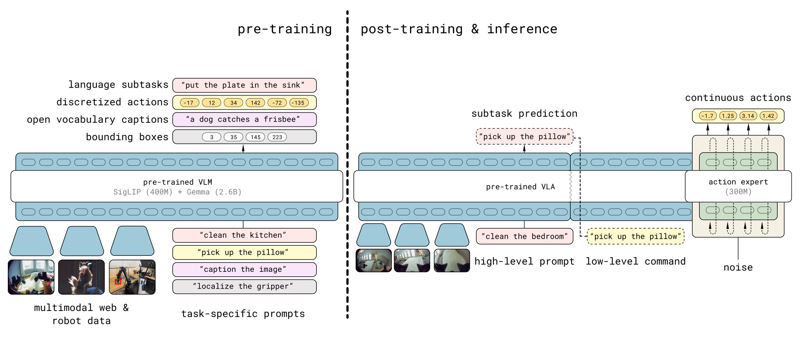
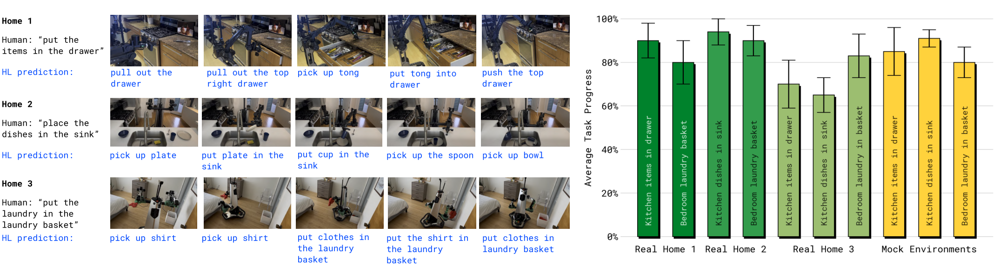
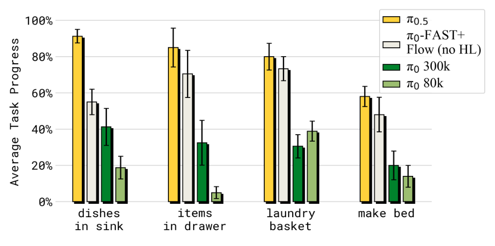

# π0.5: a Vision-Language-Action Model with Open-World Generalization

## 来源

- **PDF**：`raw/2504.16054v1.pdf`（arXiv:2504.16054v1，2025-04-22）
- **标题**：π₀.₅: a Vision-Language-Action Model with Open-World Generalization
- **团队**：Physical Intelligence
- **会议**：CoRL 2025（任务给定；PDF 正文未写会议名）
- **项目页**：[pi.website/blog/pi05](https://pi.website/blog/pi05)（外部佐证；不能升级为原文确证）
- **模型页**：[π0.5](../models/pi0.5.md)
- **前作**：[π0](pi0.md)

## 核心结论

π0.5（读作 “pi oh five”）基于 [π0](pi0.md)，核心不是换骨干，而是 **heterogeneous co-training**：同一套 VLA 同时学多机器人动作、高层语义 subtask、web 图文（caption / VQA / 检测）和人类口头逐步指令。作者主张：只靠目标移动操作平台的第一手数据不够覆盖「没见过的厨房」；必须从其他本体、实验室任务和互联网语义里搬知识。

第一阶段预训练里，**97.6% 的样本不是移动操作平台做家务**（§I）。尽管如此，模型能在训练从未见过的真实住宅里，按一句高层指令做 10–15 分钟的厨房/卧室清理（洗碗入水槽、东西入抽屉、衣服入篮、铺床）。推理时**同一个模型**先预测 semantic subtask（如 “pick up the plate”），再由 action expert 出底层连续动作——高低层不再像 π0 那样拆成两个网络。

[InternVLA-A1.5](internvla-a1.5.md) 已把 π0.5 当真机与 LIBERO-Plus 对照；本页是那条对照的正式来源。

## 架构与训练

### 两阶段：离散 FAST 预训练 → flow expert 后训练

> Figure 3（原文截图，§II / §IV）："Model overview. π0.5 is trained in two stages. First, a pre-training stage combines all of the different data sources to produce an initial VLA with discrete tokens. This stage uses data from diverse robotic platforms, high-level semantic action prediction, and data from the web. Robotic data uses the FAST action tokenizer to represent actions as discrete tokens [64]. Second, a post-training stage specializes the model for low-level and high-level inferences for mobile manipulation, leveraging the most task-relevant data, including verbal instructions from human supervisors. This stage uses flow matching to represent the action distribution, enabling efficient real-time inference and the ability to represent fine-grained continuous action sequences. At inference time, the model first infers a high-level subtask, and then predicts the actions based on this subtask."

相对 π0 改了什么（§III、§IV、Appendix A-E，原文确证）：

| 项 | π0 | π0.5 |
| --- | --- | --- |
| 骨干 | PaliGemma + 300M action expert | **同一套**（Appendix A-E：VLM width=2048 / depth=18；expert width=1024，300M） |
| 预训练动作 | 一开始就 flow matching | **先 FAST 离散 token** 280k 步（\(\alpha=0\)），可当标准 VLM 训 |
| 后训练动作 | 任务数据上继续 flow | 随机初始化 action expert，flow + 文本 CE 联合，\(\alpha=10\)，再 80k 步 |
| 高层 | 外挂另一个 VLM | **同一模型** \(\pi_\theta(\hat\ell \mid o_t,\ell)\) 再 \(\pi_\theta(a_{t:t+H} \mid o_t,\hat\ell)\) |
| 本体状态 | 线性投影进 expert | **离散化成文本 token** 喂 VLM |
| 时间步 \(\tau\) | 与噪声动作 concat 进 MLP | 单独 MLP + **adaptive RMSNorm** 注入 expert 每层 |
| 数据 | 机器人动作（+ OXE 等） | 再加 HL / WD / VI；预训练 CE 含 OXE，是 π0 数据的扩展 |

分布写成 \(\pi_\theta(a_{t:t+H},\hat\ell \mid o_t,\ell)=\pi_\theta(a_{t:t+H}\mid o_t,\hat\ell)\,\pi_\theta(\hat\ell\mid o_t,\ell)\)，底层动作**不直接**依赖总任务 \(\ell\)，只依赖预测出的 subtask \(\hat\ell\)（§IV-A）。注意力上，图像/prompt/连续动作块内双向；FAST token 对前缀自回归；action expert **不看** FAST token，以免两种动作表示互漏；信息只从 VLM 流向 expert（Figure 18）。

Flow 本身仍是 π0 那套：chunk 长度 50（正文 \(H=50\)，附录写 “horizon of 50, i.e. \(H=49\)”），推理 10 步去噪，\(\tau\) 仍用强调低时间步的 Beta（\(s=0.999\)）。

### 异构数据（Figure 4 / §IV-C）

- **MM**（diverse mobile manipulator）：约 **400 小时**、约 **100** 个家庭，目标平台家务。
- **ME**（multi-environment 非移动）：单臂或双臂固定在家里，更轻、更好运，场景更杂，但本体不同。
- **CE**（cross-embodiment 实验室）：擦桌子、叠衣服等桌面任务，多种静态/移动本体，并含开源 OXE；是 π0 数据的扩展版。后训练会拿掉 CE，把模型收束到移动操作。
- **HL**（high-level subtask）：给多阶段轨迹人工标 subtask 文本，并先预测相关 bounding box 再预测 subtask。
- **WD**（web）：CapsFusion / COCO caption，Cambrian-7M / PixMo / VQAv2，外加室内场景与家用物品检测。
- 动作同时预测关节与末端位姿，prompt 里用 `<<control_mode>> joint/end effector <<control_mode>>` 区分；各维按该数据集 1%–99% 分位数归一化到 \([-1,1]\)，维数 pad 到最大动作空间。

## 后训练

预训练 280k 步之后的第二阶段（§IV-D）：

- 目的：专精家庭移动操作，并**加上** flow matching action expert（后训练开始时 expert 随机初始化）。
- 损失：文本 CE（含 FAST 动作 token，保住语言）+ \(\alpha=10\) 的 flow MSE，共 80k 步。
- 动作数据：MM + ME，滤成功、长度低于阈值的 episode；保留 WD 和对应的 HL；**去掉实验室 CE**。
- 新增 **VI**（verbal instruction）：专家用户用语言「遥操作」已会底层技能的机器人，逐步给出该做的 subtask，当作高层示范。

机器人（§IV-E、Figure 5）：两款移动双臂，各 4 相机（前/后/双腕），平行爪，全向底盘，升降躯干；状态/动作 **18 或 19 DoF**。高层用四路相机，底层用腕部+前视。模型直接以 50 Hz 出目标位姿和底盘速度，PD 跟踪，没有额外规划或碰撞检测。

## 评测要点

全部评测都在**训练未见**的厨房/卧室：mock home 做可复现对照，三套真实住宅做最终检验（Figure 6）。任务时长大约 2–5 分钟（定量任务）到 10–15 分钟（§I 的整房清理）。分数是步骤完成比例，不是二元成功。

### 真实住宅

> Figure 7（原文截图，§V-A）："Evaluation in real homes. We evaluated π0.5 in three kitchens and three bedrooms in real homes that were not seen during training. We evaluate the tasks ‘items in drawer’, ‘laundry basket’, and ‘dishes in sink,’ and find π0.5 to be successful at these tasks in these completely new, real homes."

每任务 10 trial。作者称 mock 上的进度能代表真家。不要把柱高读成精确表内数字——原文没有把这些百分比写成 Table。

### 场景数 scaling 与配方消融

- 移动操作数据从 3 → 104 个地点，四项家务（洗碗、装抽屉、洗衣篮、铺床）单调变好；104 地点的模型接近「训练里见过测试房」的对照（Figure 8）。**去掉其他 co-training、只训 MM** 即使见过测试房也明显差。
- 语言跟随（指定物体放入抽屉/水槽）：地点越多越好；未见物体类别慢于见过类别（Figure 9）。
- 消融（Figure 10–11）：去掉 ME 或 CE（跨本体）在 mock 家务上大幅下降；去掉两者更差。去掉 WD 在这些家务上统计不显著，但 **OOD 物体语言跟随**和高层 subtask 明显变差。

### 相对 π0

> Figure 12（原文截图，§V-D）："Comparing π0.5 with other models. Our full model significantly outperforms both π0 and π0-FAST+Flow in the mock home test environments."

对照公平点：同一套跨本体机器人数据、可比步数。差在 (1) π0.5 额外用 HL 与 WD；(2) π0.5 预训练走离散 token、只在后训练加 flow expert，π0 从头就用 expert。π0-FAST+Flow 用了混合训练但仍只有动作数据，不能做高层推理。π0 加训到 300k 仍落后，作者引用 FAST 论文称离散 token 预训练比纯 diffusion 更省算力。

高层消融（Figure 13）：不要高层（no HL）在装抽屉/洗碗上掉得最狠；web 数据对抽屉这类要认杂物的任务重要；GPT-4 当高层不如 in-domain 的 π0.5；人类 oracle 高层给上界。洗衣篮对高层选择不那么敏感。

## 待追问

- 附录写 action horizon「50，即 \(H=49\)」，与 π0 的 \(H=50\) 是否差一步，原文没有解释。
- Figure 3 / 附录对 Gemma 写成 2B 或 2.6B，与 π0 正文「PaliGemma 3B」并列时，视觉塔是否算进「3B」需以权重卡核实。
- VI 数据规模、HL 标注质量、100 个家庭如何抽样，都没有表。
- [InternVLA-A1.5](internvla-a1.5.md) 真机表里的 π0.5 数字是 A1.5 论文的重测，不是本页 Figure 7 的家庭家务，不能直接当同一协议。
- 后续 π0.7 是否还用 PaliGemma + FAST→flow 两阶段，本库未 ingest。

## 相关页面

- 模型：[π0.5](../models/pi0.5.md)
- 前作：[π0](pi0.md) · [模型](../models/pi0.md)
- 离散 token 基线：[OpenVLA](openvla.md)
- 概念：[Vision-Language-Action](../concepts/vision-language-action.md)
- 把它当真机/仿真对照的后续模型：[InternVLA-A1.5](internvla-a1.5.md) · [模型](../models/internvla-a1.5.md)
