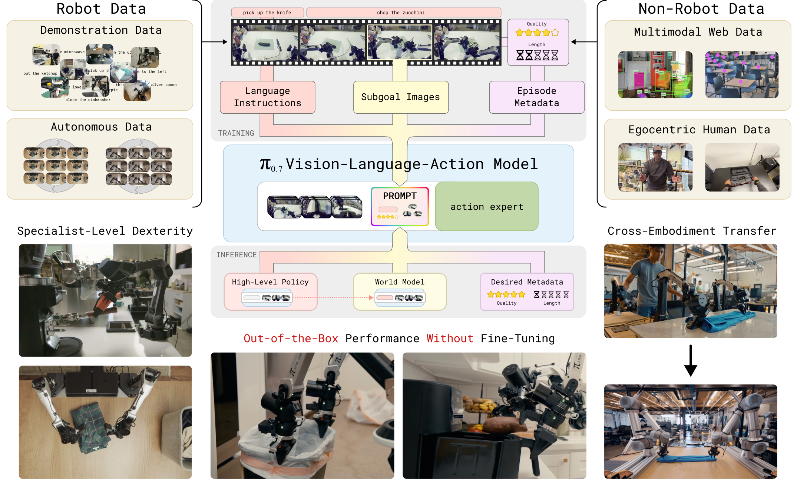
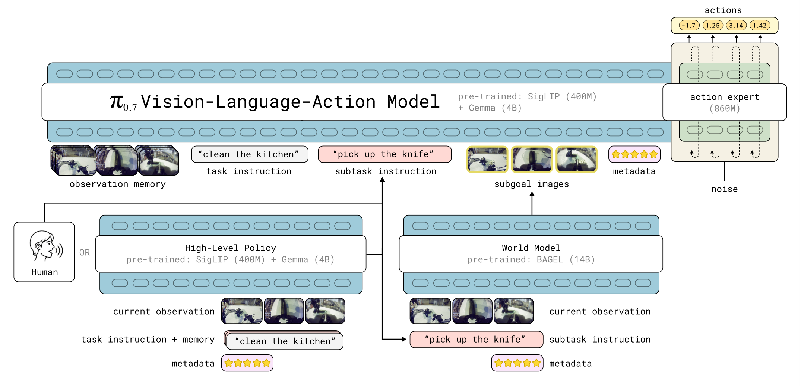
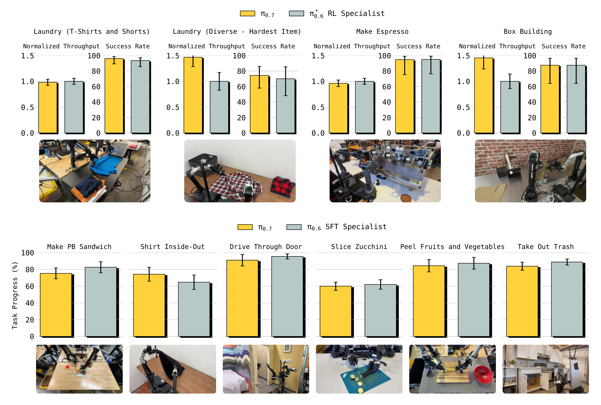

# π0.7: a Steerable Generalist Robotic Foundation Model with Emergent Capabilities

## 来源

- **PDF**：`raw/2604.15483v2.pdf`（arXiv:2604.15483v2，2026-04-24）
- **标题**：π0.7: a Steerable Generalist Robotic Foundation Model with Emergent Capabilities
- **团队**：Physical Intelligence
- **项目页**：[pi.website/pi07](https://pi.website/pi07)（外部；视频不能升级为原文确证）
- **模型页**：[π0.7](../models/pi0.7.md)
- **体量**：25 页（含附录），22 图。
- **定位**：π 系列下一代 **VLA**，与 [π0](pi0.md) / [π0.5](pi0.5.md) 并列。骨干换成 **Gemma 3 4B + MEM**，动作专家放大到 **860M flow matching**。**不再是 PaliGemma + [FAST](fast.md)→flow 两阶段。**
- **已闭合：不建 π0.6 页。** 原文把 π0.6 / π0.6-MEM / π\*0.6 写成前作与对照（§II、§IV、§IX-A）。那些 PDF 不在 `raw/`，只作外链；不能用本页柱图反推它们的技术报告。

## 核心结论

先前 VLA 很难在不 fine-tune 的情况下，把训练里见过的技能重新组合、跟开放指令、或迁到没见过该任务的本体（§I）。π0.7 的主张是：**把上下文写细**，而不是再换一套动作头。prompt 里不只是「做什么」，还有「怎么做」：更细的语言、episode metadata（质量 / 速度 / 是否犯错）、多视角 subgoal 图（摘要、§V）。这样就能吃进失败演示、自主 rollout（含 π\*0.6 的 RL 数据）和人类/网页非机器人数据，而不把不同策略平均成一团。

**已据原文核实的架构边界**（§IV、Fig. 2）：

- VLM 骨干：**Gemma 3 4B**（含约 400M 视觉编码器；Figure 2 标成 SigLIP 400M + Gemma 4B）
- 历史：**MEM-style** 视频历史编码器（时序+空间压缩，任意历史帧数吐固定 token）
- 动作专家：**860M** flow matching（π0 是约 300M）
- 总参约 **5B**
- 训练时 VLM 仍用 **[FAST](fast.md) token** 做离散交叉熵，但走 Knowledge Insulation：动作专家看 VLM 激活，梯度不回灌 VLM（§III）。这不是 π0.5 那种「先 FAST 预训练再拉长 expert」的两阶段配方，也不是 FAST 论文里推理仍吐 FAST token 的 π0-FAST。

不要把 BAGEL 14B 世界模型写成 π0.7 本体：它只生成 subgoal 图（§V-B、附录 C）。

## 架构与训练

> Fig. 1（原文截图）："We introduce π0.7, a steerable generalist robot foundation model that can perform dexterous tasks across many tasks, environments, and robots. π0.7 is trained with diverse prompts that contain not only the task description, but detailed language, generated subgoal images, and episode metadata."

> Fig. 2（原文截图，§IV）："Architecture overview. The π0.7 model is a 5B-parameter VLA consisting of a 4B VLM backbone, a MEM-style video history encoder and a 860M parameter action expert. The model’s context includes multiple distinct modalities, including language commands, episode metadata that describes the data quality and strategy, and multimodal inputs such as subgoal images. At runtime, the language commands are produced by a high-level semantic policy based on the same architecture, and the subgoal images are produced by a lightweight world model based on the BAGEL image generation model."

### 和 π0 / π0.5 差在哪

| | [π0](pi0.md) | [π0.5](pi0.5.md) | **π0.7** |
| --- | --- | --- | --- |
| VLM | PaliGemma ~3B | 仍是 PaliGemma + [FAST](fast.md) 预训练再拉长 expert | **Gemma 3 4B** |
| 记忆 | 基本不看长历史 | 无 MEM | **MEM 历史视觉** + 本体线性投影（不再像 π0.6 把 \(q_t\) 写成离散文本） |
| 动作专家 | ~300M flow | 同一套 flow | **860M flow**，50 token chunk，adaptive RMSNorm 注入时间 |
| 上下文 | 短任务文本 | 短文本 + 自己预测 subtask | 任务 + subtask + **subgoal 图** + **metadata** + 控制模式 |
| [FAST](fast.md) | 无 | 预训练阶段的离散动作 | **只作 VLM 训练信号**（KI），推理不吐 FAST |

§IV 原话：相对 π0.5 / π0.6，主要改动是 MEM 历史编码器和把视觉 subgoal 放进上下文。不要把「仍出现 [FAST](fast.md)」读回成两阶段配方。KI 用法：FAST 只提供 VLM 的离散 CE，动作仍由 860M flow expert 出。

### 可 steer 的上下文（§V）

训练时对各段随机 dropout，测试可任选子集：

- **Subtask 文本** \(\hat{\ell}_t\)：沿用 π0.5 的语义子任务；也可现场口头教练，再用这些轨迹训高层策略（§V-A、Fig. 14）。
- **多视角 subgoal 图**：世界模型 \(g_\psi\) 从 BAGEL 14B 初始化，flow matching 预测段末帧（§V-B）。训练时只有 25% 样本带图；带图时 30% 丢掉 subtask 文本。
- **Episode metadata** \(m\)：速度（按 500 步分箱）、质量 1–5、该段是否犯错。整段丢掉 15%，各字段再各丢 5%。测试默认 Quality=5、Mistake=false，速度取该任务时长的 15 分位（§VII）。
- **控制模式** \(c\in\{\mathrm{joint},\mathrm{ee}\}\)，不 dropout。

观察：最多四路相机（前视、两腕、可选后视），每路最多 6 帧历史、1 秒 stride；最多三张 subgoal（不含后视）。图先缩到 448×448。历史整段丢掉概率 0.3。本体用线性投影，跟 MEM，不再用 π0.6 的离散文本 \(q_t\)（§VI-B）。

动作专家固定 50 个 token，块内双向，并可看 VLM 激活。训练时模拟 0–12 步延迟（50 Hz 上最多 240 ms），用 training-time RTC（§VI-B）。推理 5 步 denoising，执行 \(\hat{H}\in\{15,25\}\) 步。可对 metadata 做 CFG，\(\beta\in\{1.3,1.7,2.2\}\)（§VII）。

最小配置（3 相机、5 步、training-time RTC）单卡 H100 报 38 ms；打开 MEM + subgoal 最坏 127 ms。世界模型 4×H100、8-bit、25 步，1.25 s 出图，异步跑（附录 D）。

### 数据

演示（固定/移动、单臂/双臂、实验室和家里）、自主评估与人工介入、开源机器人、第一人称人类视频、网页定位/VQA/纯文本、视频描述（§VI-A）。**故意大量用次优数据**，包括失败和 π\*0.6 RL 训练时的 rollout，当作蒸馏。泛化评测任务上的自主数据被排除（脚注 1）。原文没有给总小时数表。

## 后训练

主模型是这一套上下文模仿学习，**不是**再对每个任务 RL。对照里的 π\*0.6 是别人已经 RL 过的 specialist；π0.7 用那些 rollout 当带 metadata 的训练例子（§VI-A、§IX-A）。新长周期任务可以先口头教练，再用教练轨迹只训**高层语言策略**，低层动作不再采集（§IX-D、Fig. 16）。附录不把这写成已经对 π0.7 做了 on-policy RL。

## 评测要点

数字多在柱状图里，正文很少给精确表。下面只写原文写明的数；其余用图，不要目测填百分比。

### 开箱灵巧：对齐 specialist，不是另报一套仿真榜

> Fig. 6（原文截图，§IX-A）："Out-of-the-box dexterity: π0.7 can perform a wide range of highly dexterous tasks directly out of the box. … the same π0.7 model can match the performance of the task-specific post-trained specialist policy from π\*0.6 or π0.6 for each of these tasks, and even achieve higher throughput than the RL specialists in diverse laundry folding and box building."

吞吐相对 specialist 归一化。Fig. 7：去掉 metadata 或去掉评估 rollout，吞吐掉得最明显。Fig. 8：需要记忆的任务上，开箱 π0.7 对齐或超过 MEM 论文里按任务 fine-tune 的 π0.6-MEM specialist。

### 指令、跨本体、组合

- **未见过的 4 厨 + 2 卧**，7 条 3–6 步指令串：正文写明显好于 π0.5 / π0.6（Fig. 9），没有总表。
- **复杂指称**（「用来喝汤的东西」「最大盘子上的水果」）和 **反数据偏见**（Reverse Bussing、微波炉→冰箱）：π0.7 明显好于前作；后一项加世界模型 subgoal（π0.7 (GC)）才过得去（Fig. 10–11）。
- **跨本体**：桌面摆盘等多源数据上前作也行；UR5e↔更小双臂时 π0.5 塌、π0.6 仍强；单臂 UR5e 装衬衫袋时 π0.7 拉开。洗衣折衬衫：**源本体是轻量双臂，UR5e 上零样本**，π0.7 (GC) 任务进度 **85.6%** / 成功 **80%**，10 名资深遥操（从未在 UR5e 折过衬衫）90.9% / 80.6%（§IX-C、附录 F）。
- **组合**：短任务（法压、舀米、擦桌子、转风扇）可开箱；空气炸锅烤红薯、吐司圈等长任务靠口头教练（Fig. 15），再用教练轨迹训高层策略，自主接近现场教练（Fig. 16）。
- **可扩展性**（Fig. 18）：有 metadata 时，洗衣数据从「质量最高的 30%」扩到全量，性能继续升；没有 metadata 会随低质量数据变差。去掉任务多样性最高的 20% 数据，比随机丢掉 20% 伤得更重。

局限（§X）：分布内成功常 >90%，未见任务或未见任务–本体组合大约 60–80%。作者自己写，数据太大时很难断言什么是真正「没见过」。

## 待追问

- Gemma 3 的视觉塔到底算「Gemma3 自带 400M」还是 Figure 2 的 SigLIP 400M 初始化？原文两处并列，没有权重卡。
- [FAST](fast.md) 在 KI 里具体词表、chunk 长度、与 π0.5 预训练 FAST 是否同一份 BPE 权重，§III 只给了引用 [104]。FAST 原文把方法钉成 1 秒 chunk 上 DCT+BPE，并区分数据集特化 FAST 与发布的 FAST+；本页没有对照表。三种用法不要互填：π0.5 是 FAST→flow 两阶段，InternVLA Stage 1 是离散预训练，本页是 KI-only。
- 总训练步数、混合物比例、自有数据小时数，正文没有表。
- **已闭合**：π0.6 / π0.6-MEM / π\*0.6 不建独立页；架构以那些原文为准，不能用本页柱状图反推。
- 世界模型 14B 与 5B VLA 的系统账（延迟、失败时是否回退）只有附录 D 的 1.25 s / 异步，没有失败率。
- 不要和 [AtomicVLA](atomicvla.md) 的 LIBERO 表、[EmbodiedSkills](embodied-skills.md) 的 97.40 横比。

## 相关页面

- 模型：[π0.7](../models/pi0.7.md)
- 前作：[π0](pi0.md) · [π0.5](pi0.5.md)
- KI 训练信号的分词器，不是本页动作头：[FAST](fast.md)
- 概念：[Vision-Language-Action](../concepts/vision-language-action.md)
- 同系列连续专家上的技能路由，不是本页：[AtomicVLA](atomicvla.md)
- 离散 token 基线，逐步 256-bin ≠ FAST：[OpenVLA](openvla.md) · [RT-2](rt-2.md)
