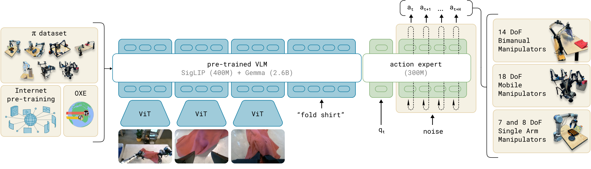
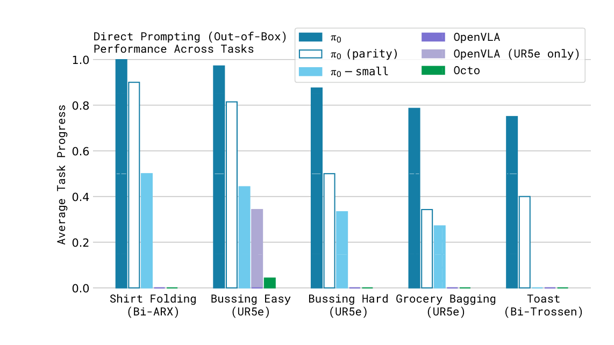

# π0: A Vision-Language-Action Flow Model

## 来源

- **PDF**：`raw/2410.24164v4.pdf`（arXiv:2410.24164v4，2026-01-08）
- **标题**：π₀: A Vision-Language-Action Flow Model for General Robot Control
- **团队**：Physical Intelligence（San Francisco）
- **会议**：RSS 2025（arXiv comments；PDF 正文未写会议名）
- **项目页**：[physicalintelligence.company/blog/pi0](https://physicalintelligence.company/blog/pi0)（外部佐证；视频与宣传不能升级为原文确证）
- **模型页**：[π0](../models/pi0.md)

## 核心结论

π0 把预训练视觉语言模型接到机器人控制上，但**不用** OpenVLA 那种把连续动作量化进词表的离散 token。做法是：PaliGemma VLM 骨干 + 单独的 **action expert**，用 **flow matching** 生成连续动作块，从而同时吃互联网语义和高频灵巧控制（最高 50 Hz）。

数据是跨本体的：单臂、双臂、移动操作，7 种机器人配置、68 个任务，外加 OXE / DROID / Bridge。预训练混合物自称约 **10,000 小时** 自有灵巧操作数据（§VII）。预训练后的 base model 可以用语言直接 prompt 做叠衣服、收拾桌子、装袋子等；更长、更难的任务再靠高质量数据 fine-tune。对照里把 [OpenVLA](openvla.md) 和 Octo 训在同一混合物上：即使只训 160k 步的 compute-parity π0 也全面超过它们（Figure 7）。

## 架构与训练

### Flow matching VLA + action expert

> Figure 3（原文截图，§II / §III）："Overview of our framework. We start with a pre-training mixture, which consists of both our own dexterous manipulation datasets and open-source data. We use this mixture to train our flow matching VLA model, which consists of a larger VLM backbone and a smaller action expert for processing robot states and actions. The VLM backbone weights are initialized from PaliGemma [5], providing representations learned from large-scale Internet pre-training. The resulting π0 model can be used to control multiple robot embodiments with differing action spaces to accomplish a wide variety of tasks."

机制（§IV、Appendix B，原文确证）：

- **骨干是 PaliGemma**。正文称「open-source 3 billion parameter VLM」；Figure 3 写成 SigLIP（400M）+ Gemma（2.6B）；Appendix B 给出 Gemma 2B 配置 `{width=2048, depth=18, mlp dim=16,384, num heads=18, num kv heads=1, head dim=256}`（multi-query attention）。Action expert 缩小到 `{width=1024, mlp dim=4096}`，约 **300M**，总参数约 **3.3B**。
- 观察 \(o_t = [I^1_t,\ldots,I^n_t,\ell_t,q_t]\)：2–3 路 RGB、语言指令、关节角。图像和语言走 VLM；本体状态 \(q_t\) 与噪声动作走 action expert。两套权重只在 self-attention 里交互，类似两个 expert 的 MoE。
- 动作是 chunk \(\mathbf{A}_t = [a_t,\ldots,a_{t+H-1}]\)，**\(H=50\)**。条件 flow matching：噪声动作 \(\mathbf{A}_t^\tau = \tau\mathbf{A}_t + (1-\tau)\epsilon\)，网络预测向量场 \(\mathbf{u}=\mathbf{A}_t-\epsilon\)。推理从高斯噪声用 Euler 积 10 步（\(\delta=0.1\)）。前缀 \(o_t\) 的 KV 可缓存，每步只重算动作 token。
- 注意力分三块双向：图像+语言、\(q_t\)、噪声动作；块之间因果，避免 VLM 前缀看见新输入。
- \(\tau\) 不从均匀分布采，而用强调高噪声的 \(p(\tau)=\mathrm{Beta}((s-\tau)/s; 1.5, 1)\)，\(s=0.999\)（Appendix B）。

这与 [OpenVLA](openvla.md) 的差异是原文直接做的对照，不是后文推断：OpenVLA 把 7 维动作写成 256-bin 自回归 token、不支持 action chunking 与高频控制；π0 用连续 flow + chunk，同一混合物上 out-of-box 全面高于把 OpenVLA 重训到该混合物的结果（§VI-A、Figure 7）。

### 跨本体数据

| 项 | 原文数字 |
| --- | --- |
| 自有数据 | 903M timesteps（单臂 106M / 双臂 797M） |
| 开源占比 | 混合物的 9.1%（OXE Magic Soup、Bridge v2、DROID） |
| 任务 / 本体 | 7 种配置、68 个任务；OXE 另含 22 种机器人 |
| 动作维 | 按最大本体 pad 到 18 维（双 6-DoF 臂 + 2 gripper + 移动底盘 + 升降躯干）；少相机的槽位 mask |
| 权重 | 每个 task-robot 组合按 \(n^{0.43}\) 降权过表示数据 |
| 预训练步数 | 主模型 700k；compute-parity 对照 160k |

平台包括 UR5e、双臂 UR5e、Franka、双臂 Trossen / ARX / AgileX、Mobile Trossen & ARX、Mobile Fibocom（§V-C、Figure 5）。控制频率：UR5e / Franka 20 Hz，其余 50 Hz。

## 后训练

预训练得到「会一点、能恢复」的 base；复杂任务再在更窄、更高质量的数据上 fine-tune（§V-A）。论文把这写成 LLM 式的 pre-training / post-training：只训高质量数据不会恢复错误，只跑预训练又不够流畅。

- 最简单下游大约 **5 小时** 数据，最复杂 **100 小时以上**（§V-A）。
- 语言跟随实验把 base fine-tune 到收拾桌子 / 摆桌子 / 装袋；可吃人类逐步指令，或另接一个高层 VLM 产出中间语言命令（§V-B，类似 SayCan）。**高层策略不是 π0 自己**，与 [π0.5](pi0.5.md) 的统一 subtask 头不同。
- 新技能实验（叠碗、叠毛巾、保鲜盒进微波炉、换纸巾、Franka 往抽屉装东西）比较从预训练 fine-tune vs 从零，以及 OpenVLA / Octo 公开 checkpoint、ACT、Diffusion Policy（§VI-C）。
- 没有 LLM 意义上的 RLHF / RLVR。

## 评测要点

### Out-of-box（预训练后直接 prompt）

任务都在预训练分布里：叠衬衫、简单/困难收拾桌子、装杂货、烤面包出炉。分数按部分完成归一化，每任务 10 条。

> Figure 7（原文截图，§VI-A）："Out-of-box evaluation results: We evaluate π0 trained for the full 700k steps, a version trained for 160k steps that matches the number of updates for baseline models, π0-small, and three baselines: OpenVLA and Octo trained on all of our data, and OpenVLA trained only on the UR5e tasks (which we found to work better on UR5e tasks). Across all tasks and all comparisons, even the “parity” version of our model outperforms all baselines, and the full version of our model achieves the best results by a large margin."

原文解释：OpenVLA 的自回归离散化撑不住 action chunk；Octo 有扩散动作但容量小；π0-small（470M、无 VLM 初始化）也低于完整 π0，说明 VLM 预训练有用（§VI-A）。不要把 out-of-box 写成对**未见任务**的零样本——衬衫折叠等在预训练里。

### 语言跟随与复杂多阶段

有逐步语言时 π0 明显好于 π0-small；高层 VLM 指令也能涨，但不如人类专家（Figure 9）。复杂任务（叠衣服、移动叠衣服、卸烘干机、真餐桌收拾、组装纸箱、装鸡蛋、打包外带盒）fine-tune 后满分比例过半，预训练+fine-tune 通常好于只 fine-tune 或只出盒（Figure 13）；作者称未能用其他方法做完这些任务。

### 推理（Appendix D / Table I）

RTX 4090、3 相机：图像编码 14 ms + 观察前向 32 ms + 10 步 flow 27 ms = 板载 73 ms；Wi-Fi 卸载再加 13 ms。不做成 temporal ensemble，开环执行 chunk：20 Hz 机器人每 0.8 s（16 步）重推理，50 Hz 每 0.5 s（25 步）。

## 待追问

- 预训练混合物该怎么配、跨任务/跨本体正迁移有多大，原文 §VII 自己列为未解。
- 高层 VLM 在 π0 里是外挂；[π0.5](pi0.5.md) 改成同一模型先预测 semantic subtask。这条统一是否必须，π0 原文没有消融。
- 后续 π0.7 / 更晚的 Physical Intelligence VLA 是否仍用同一套 PaliGemma + 300M flow expert，本库未 ingest。
- 与 OpenVLA 的对照是「把 OpenVLA 重训到 π 混合物」，不是 OpenVLA 论文自己的 Bridge/Google robot 协议，不能直接和 [OpenVLA](openvla.md) Table 4/6 横比。

## 相关页面

- 模型：[π0](../models/pi0.md)
- 开世界后作：[π0.5](pi0.5.md) · [模型](../models/pi0.5.md)
- 离散动作 token 基线：[OpenVLA](openvla.md) · [模型](../models/openvla.md)
- 概念：[Vision-Language-Action](../concepts/vision-language-action.md)
- 把 π0.5 当真机对照的后续实例：[InternVLA-A1.5](internvla-a1.5.md)
