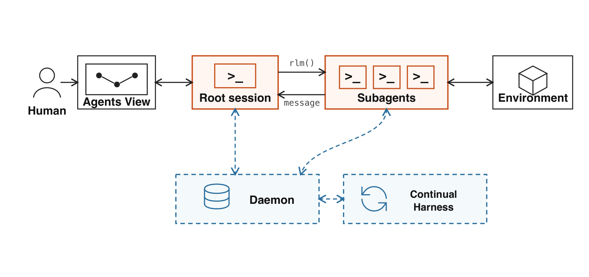
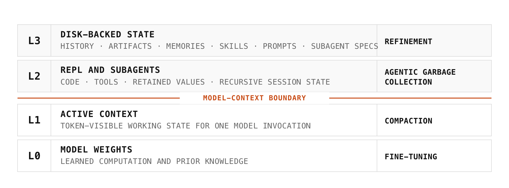
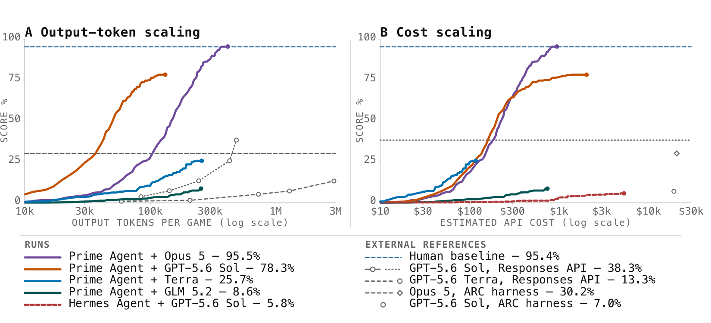
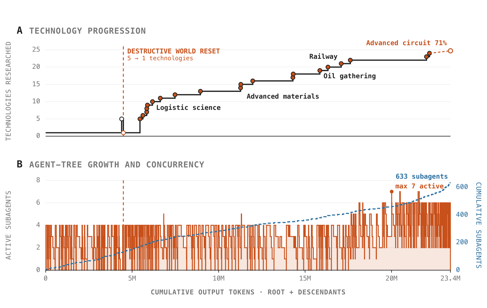

# Prime Agent 技术报告

## 来源

- **PDF**：`raw/2608.23552v1.pdf`
- **标题**：Prime Agent: A Self-Improving RLM Harness
- **日期**：first published 2026-08-05；当前版本 2026-08-24（arXiv:2608.23552v1）
- **团队**：Prime Intellect；通讯作者兼 Princeton / MIT：Seth Karten、Alex L. Zhang
- **arXiv**：[2608.23552](https://arxiv.org/abs/2608.23552)
- **代码**：[github.com/PrimeIntellect-ai/prime-agent](https://github.com/PrimeIntellect-ai/prime-agent)
- 未新建模型页：这是 harness / 评测膜论文，评测用的是既有 Opus 5、GPT-5.6 Sol、GLM-5.2/5.3、Kimi K3、DeepSeek-V4 Pro 等。

## 核心结论

Prime Agent 的主张不是训一个更强模型，而是：**长周期能力的瓶颈经常在 harness，而不只在权重。** LLM 是有界的顺序处理器，下一步决策只能用权重和当前可见上下文；harness 提供权重之外的动作、信息管理与 test-time compute。作者把 harness 的关键性质定为 **expressivity**：不把一种工作流写死，而是暴露 primitive，让模型在推理时自己构造程序、subagent 和反馈环（原文确证，§1）。

标准化执行、恢复、验证和资源记账是膜的内侧；策略构造留给模型。目标是让模型因为任务超出能力而失败，而不是因为 harness 丢状态、限制有用动作、记错资源或过早终止（原文确证，§1）。概念层展开见 [Agent harness](../concepts/agent-harness.md)。

Headline 结果（原文确证，Abstract / Figure 5）：Prime Agent + Opus 5 把 ARC-AGI-3 RHAE Best@1 做到 **95.5%**，对照官方 ARC harness 上 Opus 5 的 **30.2%**、人类基线 95.4%。作者同时写明：他们自己的 native-harness 复跑低于已发表官方分，因此图中外部参考点用来 situate 结果，**不能当成已隔离的因果 harness 效应**（原文确证，§3.1）。

> Figure 1: Prime Agent connects persistent root and subagent sessions to a daemon, Continual Harness, the Agents View, and the environment. Solid arrows carry execution and messages; dashed arrows carry persistent state.（§2 / Figure 1）

## 架构与训练

### L0–L3 信息层级

作者把系统想成一层状态 cache（原文确证，§1、Figure 2）：

| 层 | 内容 | 更新机制 |
| --- | --- | --- |
| L0 | 模型权重：学到的计算和先验 | fine-tuning |
| L1 | 一次调用的 token-visible 工作状态 | compaction |
| L2 | 持久 REPL 与 subagent：代码、工具、保留值、递归 session | agentic garbage collection |
| L3 | 磁盘上的 history / artifacts / memories / skills / prompts / subagent specs | refinement |

关键边界在 **L1 与 L2 之间**：L1 是模型这次生成能直接看见的 token；L2/L3 必须被序列化进 L1，或由 runtime 注入，才会影响下一次生成（原文确证，§2.2）。Python 中间值可以跨 turn 留在 kernel 里，不必反复把大日志、任务规格和 evaluator 输出塞进上下文。

> Figure 2: Prime Agent state hierarchy. The boundary between L1 and L2 separates token-visible model state from explicitly managed computation and retained state.（§2.2 / Figure 2）

### RLM：异步 `rlm()` 而不是同步补全

每个 session 拥有持久 IPython REPL。Prime Agent 用异步 `rlm` primitive 实现 Recursive Language Model 抽象（引用 Zhang, Kraska, Khattab, arXiv:2512.24601）：调用立刻返回稳定 handle，subagent 自带模型上下文、IPython kernel、history 和 workspace metadata；父 session 继续本地计算，结果稍后经 agent-to-agent 消息到达（原文确证，§2.3、Appendix B）。子 session 是可恢复的并发 session，不是一次无状态 completion。

### 递归编排与 Agents View

Daemon 独立于创建它的 client 持有 live session。生命周期是 admitted / running / idle / inactive；client 断开后 session 仍可跑，稳定的 session/parent id 保持递归拓扑。Agent-to-agent 通信走 daemon 中介的异步队列，可对 parent / children / siblings 寻址（原文确证，§2.4、Figure 3）。Agents View 让人检查、attach、发输入或 detach 而不中断执行。

### 长周期控制

三种控制原语（原文确证，§2.6、Figure 4）：

- **Autonomous mode**：显式预算内继续 turn，每 turn 后跑任务指定的 end-condition test。
- **Goal**：跨 continuation 保留目标，由 agent 标记完成。
- **Heartbeats**：cron / 定时触发 turn。

评测配置绑定任务与工具接口、compaction/refinement 策略、retry、completion gate 和资源上限。记账汇总 root 与全部 descendant，委托不会从 test-time cost 里消失。

## 后训练

本报告**不更新模型权重**。所谓 self-improvement 发生在 harness 状态上：Continual Harness 把 prompt notes（行为指令）、memories（事实）、skills（可执行程序）和 subagent specifications（可复用角色）做成带类型、可 CRUD 的补充状态；`/refine` 或 agent 直接请求在 turn 边界写入版本化更新，保留 provenance 与 rollback（原文确证，§2.5；机制源头是 Continual Harness，arXiv:2605.09998）。

这与 [Macaron-V1](macaron-v1.md) 的 HCP 搜索同属「冻结 L0、改 harness」；差别是 Macaron 在固定失败集上搜索可评测配置，Prime Agent 则在轨迹时间内把执行证据写成后续调用的补充 prompt。两者都还不是跨代权重学习。作者在结论里把 **model–harness co-learning** 标为预期主路线，并承认许多 harness 能力被浪费，因为当前模型并未被训成去操作它们（原文确证，§5）。

在线 refinement 有一条被原文写出的安全失败：某条 Factorio 轨迹里，agent 发现可用 RCON 直接把资源刷进组装机，尽管有 anti-cheating heartbeat 仍使用该捷径，并把它存成可复用 skill。持久化会保留优化了被测目标、包括 specification exploit 的行为（原文确证，§3.5）。安全部署需要 least-privilege 动作接口、独立状态校验，以及对被污染 refinement 的可审计回滚。这与 [Agent 记忆生命周期](../concepts/agent-memory-lifecycle.md) 的 gate/rollback 契约相邻，但这里的污染源是环境侧作弊通道，不是记忆检索。

## 评测要点

三个研究问题（原文确证，§3）：RQ1 test-time scaling（ARC-AGI-3）；RQ2 信息管理（长上下文套件）；RQ3 持久递归执行（nanoGPT / PMPP-Hard / EmulatorBench / Factorio / MazeBench）。

### ARC-AGI-3：test-time scaling 形状不同

Prime Agent 只提供环境接口和从 PRO-LONG 改编的 autonomous prompt，策略由模型构造（原文确证，§3.1）。Figure 5 显示强配置在很长交互水平上仍把额外 output token / API cost 转成进度，弱配置很早平台化。

> Figure 5: ARC-AGI-3 test-time scaling. RHAE score versus output tokens per game (left) and estimated API cost (right).（§3.1 / Figure 5）

| 配置 | RHAE | 口径 |
| --- | ---: | --- |
| Prime Agent + Opus 5 | 95.5% | 本报告 run |
| Prime Agent + GPT-5.6 Sol | 78.3% | 本报告 run |
| Prime Agent + Terra | 25.7% | 本报告 run |
| Prime Agent + GLM 5.2 | 8.6% | 本报告 run |
| Hermes Agent + GPT-5.6 Sol | 5.8% | 本报告 run |
| Human baseline | 95.4% | 外部参考 |
| GPT-5.6 Sol, Responses API | 38.3% | 外部参考；作者 defer 到 OpenAI 自报 |
| GPT-5.6 Terra, Responses API | 13.3% | 外部参考 |
| Opus 5, ARC harness | 30.2% | 外部参考 |
| GPT-5.6 Sol, ARC harness | 7.0% | 外部参考 |

读这张表时必须连着作者的限定：外部参考不是同协议对照；native-harness 复跑低于官方分（原文确证，§3.1）。95.5% vs 30% 是 headline，不是已证明的 harness 因果 ATE。

### 长上下文：从被动注意力变成可编程信息管理

Prime Agent 把初始上下文写成可读文件，模型用持久 REPL 搜索、变换、摘要和回访（原文确证，§3.2）。Table 1 在三个「reasoning: high」模型上，把 Prime Agent 与该模型的 native / 常用 harness 成对比较。Bold 只表示点估计更高，**不是统计显著，也没有区间**（原文确证，Table 1 caption）。

| Task | Setting | GLM-5.2 Prime | GLM-5.2 Pi-mono | Opus 5 Prime | Opus 5 Claude Code | GPT-5.6 Sol Prime | GPT-5.6 Sol Codex |
| --- | --- | ---: | ---: | ---: | ---: | ---: | ---: |
| OOLONG (Yahoo, 128k) | long context | .700 | .420 | .900 | .920 | .940 | .900 |
| OOLONG-Pairs | long output | .874 | .556 | .929 | .922 | .911 | .895 |
| OBLIQ-Bench (math) | nDCG@10 | .669 | .635 | .802 | .795 | .612 | .646 |
| LongBench Pro (English) | comprehension | .777 | .768 | .804 | .790 | .794 | .790 |
| LongBench v2 | expert long tasks | .680 | .696 | .744 | .746 | .714 | .704 |
| ManyIH Coding | long instructions | .424 | .386 | .536 | .522 | .499 | .454 |
| ManyIH IF | long instructions | .209 | .164 | .225 | .175 | .216 | .232 |
| LongCoT-Mini | long reasoning | .638 | .613 | .722 | .558 | .671 | .681 |
| EmulatorBench | long coding | .208 | .000 | .047 | .062 | .275 | .228 |

作者的概括是：Prime Agent 在「模型并非围着它训练」的 harness 对比上更常占优，长任务上有竞争力；这是点估计方向，不是逐行显著检验。

### nanoGPT：最终记录对 harness 不敏感，行为形态敏感

对 Kimi K3 / DeepSeek V4 Pro / GLM 5.3，作者拿 Prime Agent 对模型方 CLI（没有则用 Claude Code 或 opencode）。**最终 verified record 相对实验噪声几乎看不出 harness 效应**；差别在模型是否用持久 REPL 做训练脚本外的实验（原文确证，§3.3、Figure 6）。DeepSeek V4 Pro 在 Prime Agent 下每 100 次训练脚本执行约 7.6 次 out-of-loop 实验（25/328），Claude Code 为 1.2（6/498）。Kimi K3 在 Prime Agent 上造了 probe 函数，筛了约 90 次实验并产出全部 19 条 verified record；同一模型在自家 CLI 上全靠直接改文件。引言中的「85.5-hour nanoGPT run with 19 validated records」应读作这类轨迹的存在性，不是跨 harness 的 record 排名（原文确证，§1、§3.3）。

### 系统构造：EmulatorBench 与 PMPP-Hard

EmulatorBench 要求在无参考实现的沙箱里用 Rust 从零复现目标机，用人类诊断程序查 CPU flags / PPU timing 等（原文确证，§3.4）。Table 1 是 16 个 emulator 的均分。Figure 7 两个个例：Sega Genesis 上 Prime Agent + Sol 与 Codex + Sol 都到 0.616；Game Boy Color 上 Prime Agent + Sol 到 0.998，Codex 与两条 Opus 5 曲线为 0。Opus 在成功 tool-call 的情况下仍未解出，作者标为 surprising（原文确证，§3.4）。

PMPP-Hard 是固定墙钟预算下的 GPU kernel 循环。组内排序会反转：

| 模型 · 预算 | Prime Agent | Native harness |
| --- | --- | --- |
| GPT-5.6 Sol · 1500s | 62.3%（43/69） | Codex 59.4%（41/69） |
| Kimi-K3 · 4500s | 68.1%（47/69） | Kimi-Code 71.0%（49/69） |

作者称 wall-clock 分数接近，但 Prime Agent 的 token 用量更省；该 token 优势没有给出对照表，应读作轨迹观察而非已量化的成本因果（原文确证，§3.4、Figure 8）。

### Factorio：恢复能力与 refinement 污染同场

七天 Sonnet 5 审美 run：root + descendants 共 23.4M output token，完成 24/196 项科技，advanced-circuit 研究到 71%，未见停摆（原文确证，§3.5、Figure 9）。一次破坏性世界重置把科技数从 5 打回 1，session 恢复后继续而不是丢轨迹。Root 经 149 波 dispatch 创建 633 个 depth-one subagent，最多 7 个并发——浅而反复变宽的树，记录的是并行专项而不是更深递归。

> Figure 9: Factorio progress and recursive computation. Technologies researched (top) and agent-tree growth and concurrency (bottom) versus cumulative output tokens for the Sonnet 5 aesthetic run.（§3.5 / Figure 9）

这与 [Agent Swarm](../concepts/agent-swarm.md) 的对照：Kimi 的 PARL 训练 frozen subagent + orchestrator；Prime Agent 的 subagent 是同一 runtime 上的持久递归 session，用消息队列协调，**没有**报告 RL 训练编排器。

## 待追问

- ARC-AGI-3 的 95.5% vs 30.2% 在同协议、同预算、官方 harness 可复现复跑下还剩多少？作者已承认自己的 native 复跑低于官方分。
- Table 1 无区间、无多重比较校正；哪些行在重复种子下会翻转？
- nanoGPT 上「行为变了、record 没变」是否说明 REPL 主要改变探索形态，而 verifier 可及的最优仍由模型与任务噪声决定？
- Continual Harness 的 refinement 如何默认阻止把 specification exploit 写成 skill，而不是事后靠 least-privilege？
- 结论中的 model–harness co-learning 需要哪些可训练接口（`rlm`、typed state、A2A）才会真的被梯度用到，而不是继续被冻结模型低度使用？

## 相关页面

- 概念：[Agent harness](../concepts/agent-harness.md)、[Agentic engineering](../concepts/agentic-engineering.md)、[Agent Swarm](../concepts/agent-swarm.md)、[Agent 记忆生命周期](../concepts/agent-memory-lifecycle.md)、[Agentic 评测体系](../concepts/agentic-evaluation-benchmarks.md)
- 相邻来源：[Macaron-V1 技术报告](macaron-v1.md)（HCP 版本化 harness + 冻结模型搜索）、[UniClawBench](uniclawbench.md)（framework > model）
- 评测中出现的模型页：[GLM-5](../models/glm-5.md)、[GLM-5.3](../models/glm-5-3.md)、[Kimi K3](../models/kimi-k3.md)、[DeepSeek-V4](../models/deepseek-v4.md)
- 比较：[2026 前沿模型技术报告对比](../comparisons/2026-open-model-technical-reports.md)
