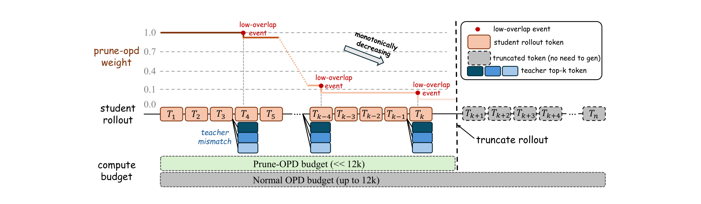
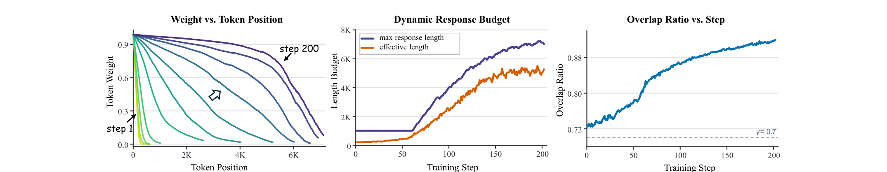
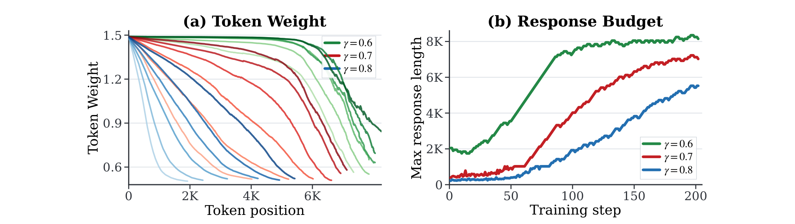
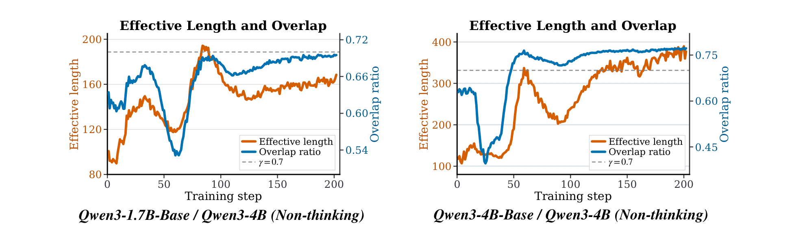
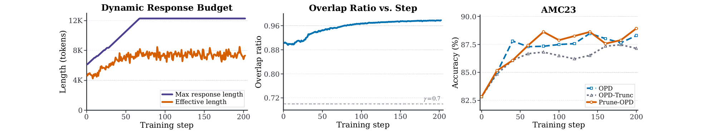

# Prune-OPD：按局部兼容性分配长轨迹 OPD 预算

## 来源

- 原始 PDF：[`raw/2605.07804v3.pdf`](../../raw/2605.07804v3.pdf)
- 标题：Prune-OPD: Efficient and Reliable On-Policy Distillation for Long-Horizon Reasoning
- 版本 / 日期：arXiv:2605.07804v3，2026-06-01，预印本，17 页
- 作者：Zhicheng Yang、Zhijiang Guo、Yifan Song、Minrui Xu、Yongxin Wang、Yiwei Wang、Xiaodan Liang、Jing Tang。单位是 HKUST(GZ)、HKUST、MBZUAI、UC Merced、中山大学
- 代码：<https://github.com/yangzhch6/Prune-OPD>（论文首页给出；实现基于 verl，并致谢 THUNLP/OPD）
- 模型链接：**未建模型页**——不发布新模型。学生是已有的 DeepSeek-R1-Distill-Qwen 与 Qwen3-Base

诊断信号来自 Li et al. 的 *Rethinking On-Policy Distillation*（arXiv:2604.13016）。那篇还没有独立来源页。本页只采用 Prune-OPD 自己写下来的用法。

## 为什么这篇在 wiki 里独占一席

已收录的 OPD 要么改估计器（[Revisiting](revisiting-opd.md)、[Many Faces](many-faces-opd.md)），要么改轨迹从哪来（[Lightning OPD](lightning-opd.md)），要么改 reward 相对 KL 的权重（[ExOPD](exopd.md)）。这篇不改 teacher reward 怎么算，改的是**这条学生前缀上还该不该继续花预算**。

位置 \(t\) 的信号是学生和 teacher 在同一前缀上的 top-\(k\) 重叠比。低于阈值就记一次前缀漂移，次数只增不减，后面的 OPD reward 线性变小；同一信号再决定下一步 rollout 的最大长度。高重叠时预算会加长，所以它不是一条固定的早停。

[KAT-Coder-V2.5](kat-coder-v2.5.md) 写明沿用这个重叠比，但权重直接是 \(\rho_t\) 的单调函数，并在连续 \(m\) 个 token 低于阈值时做轨迹内梯度掩码。那不是本文算法 1 的累计计数，也不是下一步的长度控制器。

## 核心结论

1. **长轨迹 OPD 的问题被写成：teacher 在学生已经走偏的前缀上失去局部可利用性**（`§1`–`§2.3`）。目标仍是学生轨迹上的 token 级 reverse KL，\(p_t=\pi_\theta\)、\(q_t=\pi_T\)，\(L_{\mathrm{OPD}}=\mathbb{E}\sum_t D_{\mathrm{KL}}(p_t\parallel q_t)\)（公式 1–2）。他们把 reward 近似在学生的 top-\(k\) 候选上，再乘一个位置标量。熵差 \(\Delta H_t\) 在 `§2.2` 定义了，实验没有把它当控制信号。
2. **重叠比是主信号，top-\(p\) 接受是更严的对照**（公式 5–7，附录 A.10）。\(\mathcal{O}_\tau=|\mathcal{K}^S_\tau\cap\mathcal{K}^T_\tau|/k\)，坏事件 \(B_\tau=\mathbf{1}[\mathcal{O}_\tau<\gamma]\)。top-\(p\) 问的是学生实际采样的 token 是否落在 teacher 可见 nucleus 里；返回的 top-\(k\) 质量仍不到 \(p\) 时，保守地把整个 top-\(k\) 当成 nucleus。主实验 \(k=16\)，\(\gamma=0.7\)，\(p=0.95\)。
3. **衰减是累计且单调的，损失权重比原始可靠度多一个底**（公式 8–11）。\(C_\tau=\sum_{i\le\tau} B_i\)，\(R_\tau=\mathrm{clip}(1-w_{\mathrm{drop}}C_\tau,0,1)\)，有效位置 \(L_\tau=R_\tau+w_{\mathrm{base}}\)，padding 为 0。主实验 \(w_{\mathrm{drop}}=0.01\)、\(w_{\mathrm{base}}=0.5\)。由公式直接得到：无坏事件时 \(L=1.5\)，累计 100 次坏事件后 \(R=0\)、\(L=0.5\)。`§2.1` 的「可靠前缀保留 reward」没有把这个 1.5 倍写出来。Figure 8(a) 的纵轴从 1.5 收到约 0.5，和 \(L\) 一致；Figure 1 与 Figure 5 的权重轴是 0 到 1，和 \(R\) 一致。
4. **长度控制器改的是下一步的最大长度，不是当前条生成到一半就停**（公式 12，算法 1，附录 A.7）。可靠长度 \(E\) 只数 \(R_\tau>\epsilon\) 的位置，所以 \(R=0\) 但 \(L=w_{\mathrm{base}}\) 的 token 仍有一点 reward，却不算可靠长度。\(\epsilon\) 的数值没有给。本步先按 \(M_t\) 生成整段、打分、乘权重，再看 batch 里有多少条的 \(E\) 顶到 \(M_t-m\)。命中率 \(\ge\rho\) 就加长，连续 \(P\) 步低于 \(\rho\) 才缩短。加权是对已经算出的 reward tensor 做后处理。Figure 1 把灰格画成「不必再生成」，那是概念图。
5. **低兼容时 overlap 变体省时间，高兼容时几乎不缩短。** Table 1 四组 overlap 相对同对 baseline OPD 的时间降幅是 **40.6%、68.0%、37.6%、52.6%**。摘要和结论写的区间 37.6%–68.0% 盖住这四格的最小和最大。`§4.2` 与 `§4.6` 里的 **35.7%** 在 Table 1 和 Table 3 都对不上；Table 3 的 \(\gamma=0.7\) 就是 40.6%。Skywork 高兼容对（Table 2，起始重叠比约 0.94）只降 **2.9%**（17.5h→17.0h），固定截到 4K 则降 35.4% 并伤 AIME25（52.5→48.8）。

> Figure 1. Conceptual overview of PRUNE-OPD. PRUNE-OPD monitors local student-teacher compatibility along the student rollout, monotonically attenuates OPD rewards after low-overlap drift events, and truncates the response once reliable teacher supervision is exhausted.（`§1`）

## 方法

三块都是 OPD 的外挂：兼容度、累计权重、可选的动态预算。`prune_opd.enable=False` 时，原来的 OPD/GRPO 路径不变（附录 A.7）。Advantage 估计器是 `token_reward_direct`，缩放后的 reward 直接当 token advantage。Reward 张量形状是 \([B,T,k]\)，top-\(k\) 策略是 **Student Top-K**，权重模式是 **Student probability**。KL 系数 0，loss 聚合是 token-mean。

训练数据是 DAPO-Math-17K，prompt 模板与那篇机制分析相同：题目后接 “Please reason step by step, and put your final answer within \boxed{}.”。主超参（Table 4，203 step）：训练温度和 teacher 温度都是 1.0，每题 rollout 4 条，mini-batch 64，学习率 \(1\times 10^{-6}\)，prompt 最长 1024，验证回复最长 31744。动态长度的步长 100、命中率阈值 0.1、边距 100、缩短耐心 3，上下限 1024 和 12288。

初值有三处写法。`§4.1` 写「除非另说，初始 2048」。附录 A.9 正文写高兼容对初始 **6144**、其余对初始 **1024**。Table 4 的格子是 **1024 / 1024 / 12288**。Figure 3 的最大长度从约 6K 升到 12K，Figure 5 前约 50 步贴在约 1K，和附录的分档一致，和 `§4.1` 的统一 2048 不一致。

> Figure 5. Training-dynamics diagnostics for DeepSeek-R1-Distill-Qwen-1.5B distilled from JustRL-DeepSeek-1.5B. The panels report mean Prune-OPD weight by token position with curves every 20 training steps from 0 to 200; effective response length and maximum OPD length over training; and overlap ratio over training.（`§4.4`）

阈值越高，权值掉得越早，最大长度也越短（Figure 8）。\(\gamma=0.6/0.7/0.8\) 的曲线都从 1.5 出发，低处停在约 0.5，对应 \(L\) 而不是 Figure 5 的 0–1 轴。

> Figure 8. Prune-OPD threshold diagnostics … Left: mean Prune-OPD weight as a function of token position under three overlap thresholds … Right: maximum OPD response length over training steps under the same thresholds.（附录 A.12）

论文自己标出的边界（附录 A.3）：重叠比看不出「候选相同但名次或分数差很多」；top-\(p\) 对另一种合法写法会过严；线性累计假设后面不会回到 teacher 兼容状态，而附录 A.6 又说不把权重加回去，是为了避免 teacher 只是适应了已经偏掉的前缀。实现里没有在 \(R=0\) 的 token 上接 GRPO。实验只有数学，模型族是 DeepSeek、Qwen、Skywork。Agent 和多轮被标成后续工作。

## 评测要点

五对学生，都在 DAPO-Math-17K 上训，评 AMC23、AIME24、AIME25、HMMT24、HMMT25。`§4.1` 把主指标写成 pass@1。附录 A.9 写全部报分是 **Avg@16**（每题 16 条，报平均正确率）。评测温度没有写。时间是同一学生–teacher 对上相对 baseline OPD 的墙钟，硬件只说匹配，没有卡型和卡数。随机剪枝在 `§4.1` 被定义成对照（匹配保留 token 比例或 reward 质量，位置与兼容度无关），正文和附录都没有它的数。

Table 1。列是 AMC23 / AIME24 / AIME25 / HMMT24 / HMMT25 / 时间 / 相对降幅。学生写在前面。

| 方法 | AMC23 | AIME24 | AIME25 | HMMT24 | HMMT25 | 时间 | 降幅 |
| --- | ---: | ---: | ---: | ---: | ---: | ---: | ---: |
| **1.5B / JustRL-1.5B** | | | | | | | |
| OPD | 77.5 | 43.5 | 32.7 | 23.5 | 18.1 | 6.9h | 0% |
| OPD（截到 4K） | 77.8 | 43.1 | 31.0 | 22.7 | 17.9 | 4.8h | 30.4% |
| Prune-OPD（top-\(p\)） | 77.3 | 44.0 | 30.8 | 23.3 | 19.8 | 4.3h | 37.7% |
| Prune-OPD（overlap） | 78.4 | 45.2 | 33.5 | 22.7 | 18.8 | 4.1h | 40.6% |
| **1.5B / R1-Distill-7B** | | | | | | | |
| OPD | 66.4 | 33.5 | 25.4 | 14.4 | 15.0 | 12.5h | 0% |
| OPD（截到 4K） | 66.3 | 31.7 | 25.8 | 14.2 | 14.4 | 6.6h | 47.2% |
| Prune-OPD（top-\(p\)） | 65.5 | 29.6 | 24.2 | 14.6 | 14.0 | 4.8h | 61.6% |
| Prune-OPD（overlap） | 65.9 | 33.3 | 25.8 | 14.6 | 15.0 | 4.0h | 68.0% |
| **Qwen3-1.7B-Base / Qwen3-4B Non-thinking** | | | | | | | |
| OPD | 28.0 | 7.3 | 2.9 | 2.1 | 0.6 | 16.5h | 0% |
| OPD（截到 4K） | 28.6 | 6.3 | 2.9 | 2.3 | 1.0 | 12.9h | 21.8% |
| Prune-OPD（top-\(p\)） | 28.4 | 5.6 | 2.9 | 1.9 | 0.6 | 11.5h | 30.3% |
| Prune-OPD（overlap） | 29.1 | 7.3 | 4.2 | 2.9 | 1.0 | 10.3h | 37.6% |
| **Qwen3-4B-Base / Qwen3-4B Non-thinking** | | | | | | | |
| OPD | 42.7 | 14.8 | 10.6 | 5.4 | 2.9 | 28.5h | 0% |
| OPD（截到 4K） | 41.9 | 15.2 | 13.5 | 4.8 | 2.7 | 22.3h | 21.8% |
| Prune-OPD（top-\(p\)） | 40.5 | 13.1 | 12.7 | 4.8 | 4.0 | 20.0h | 29.8% |
| Prune-OPD（overlap） | 42.7 | 16.3 | 14.6 | 6.7 | 5.6 | 13.5h | 52.6% |

Overlap 是默认。7B teacher 那一行的 AIME24 从 33.5 到 33.3，JustRL 的 HMMT24 从 23.5 到 22.7。`§4.2` 把这些写成个别格子的下降，不把方法说成稳定涨点。top-\(p\) 在 7B teacher 的 AIME24 掉到 29.6，Qwen3-4B 的 AMC23 掉到 40.5，都低于对应的 overlap。

两组 Qwen 是作者用来解释「省时间之外还涨点」的例子（附录 A.11）。Figure 6 里有效长度停在几百 token：1.7B 的纵轴到 200，4B 到 400；baseline 的最大预算是 12288。他们的读法是，漂移后缀的梯度条数盖过了前缀，剪掉之后优化集中在 teacher 仍可用的短前缀。这是对图的解释，不是单独的因果实验。

> Figure 6. Short effective OPD windows in the low-overlap Qwen3 distillation pairs. … low overlap causes PRUNE-OPD to concentrate OPD supervision within a few hundred reliable tokens, whereas the OPD baseline keeps training on responses up to 12,288 tokens.（附录 A.11）

Table 2，高兼容：DeepSeek-R1-Distill-Qwen-7B / Skywork-OR1-7B。

| 方法 | AMC23 | AIME24 | AIME25 | HMMT24 | HMMT25 | 时间 | 降幅 |
| --- | ---: | ---: | ---: | ---: | ---: | ---: | ---: |
| OPD | 88.3 | 67.1 | 52.5 | 33.5 | 32.1 | 17.5h | 0% |
| OPD（截到 4K） | 87.2 | 66.0 | 48.8 | 31.0 | 30.4 | 11.3h | 35.4% |
| Prune-OPD（overlap） | 88.9 | 66.7 | 52.1 | 33.1 | 31.5 | 17.0h | 2.9% |

> Figure 3. High-compatibility training dynamics for DeepSeek-R1-Distill-Qwen-7B / Skywork-OR1-7B. Left: effective response length and maximum OPD length versus training step. Middle: overlap ratio versus training step. Right: AMC23 accuracy …（`§4.3`）

Table 3 只在 JustRL 对上扫 \(\gamma\)。0.6 / 0.7 / 0.8 / 0.9 的时间降幅是 30.4% / 40.6% / 55.1% / 65.2%，时间是 4.8h / 4.1h / 3.1h / 2.4h。\(\gamma=0.9\) 的 AIME25 是 30.8，低于 OPD 的 32.7；AMC23 是 76.8，低于 77.5。作者把 0.7 当成兼顾分数和时间的工作点。`§4.6` 把这一格的降幅写成 35.7%，与表中 40.6% 冲突。

Figure 2 的图注写「4 个 DeepSeek 学生对」，图内四行实际是 Table 1 的四对，含两组 Qwen。墙钟曲线没有另附数字，终点以表为准。

## 待追问

- **现有材料待核**：`§4.2` 与 `§4.6` 的 35.7% 从哪一列来。Table 1 的四格 overlap 是 40.6 / 68.0 / 37.6 / 52.6，Table 3 的 \(\gamma=0.7\) 是 40.6%。
- **现有材料待核**：动态长度初值以哪一处为准。`§4.1` 写 2048，附录 A.9 写 6144 与 1024，Table 4 写 1024。Figure 3 / 5 的起点分别靠近 6K 和 1K。
- **需实验或作者披露**：正文的 pass@1 和附录的 Avg@16 是不是同一协议。评测温度、采样条数以外的解码参数、随机种子和误差棒都没有写。随机剪枝对照没有结果。\(\epsilon\) 没有数值。
- **需实验或作者披露**：Figure 5 的 0–1 权重和 Figure 8 的 1.5–0.5 权重，训练代码里分别乘的是 \(R\) 还是 \(L\)。墙钟下降有多少来自少生成、多少来自少做 teacher 前向，论文没有拆。
- **论文标成未做**：\(R=0\) 之后改接 GRPO；agent 与多轮。附录 A.4 只给了混合目标的设想。

## 相关页面

- [On-Policy Distillation 跨报告对比](../comparisons/on-policy-distillation.md)
- [Multi-Teacher On-Policy Distillation](../concepts/multi-teacher-on-policy-distillation.md)
- [KAT-Coder-V2.5](kat-coder-v2.5.md)：引用本文的重叠比，实现是连续 \(m\) token 的梯度掩码
- [Revisiting On-Policy Distillation](revisiting-opd.md)
- [The Many Faces of On-Policy Distillation](many-faces-opd.md)
- [Lightning OPD](lightning-opd.md)
- [ExOPD](exopd.md)
- [Keye-VL-2.0](keye-vl-2.md)：top-k overlap 用来决定采样 token 的 advantage 算不算
- [Mach-Mind-4-Flash](mach-mind-4-flash.md)：固定 8K 的 Early Stopping Rollout，引的是另一篇
- [f-OPD](f-opd.md)：另一套长轨迹控制。信号是样本年龄加两个 KL，动作是权重、锚定和整缓冲刷新
