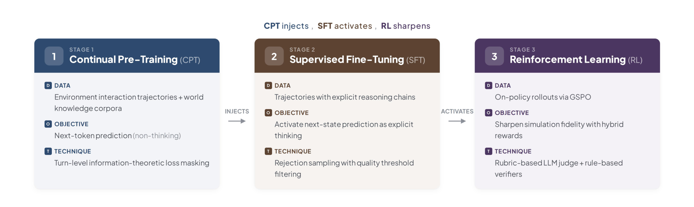
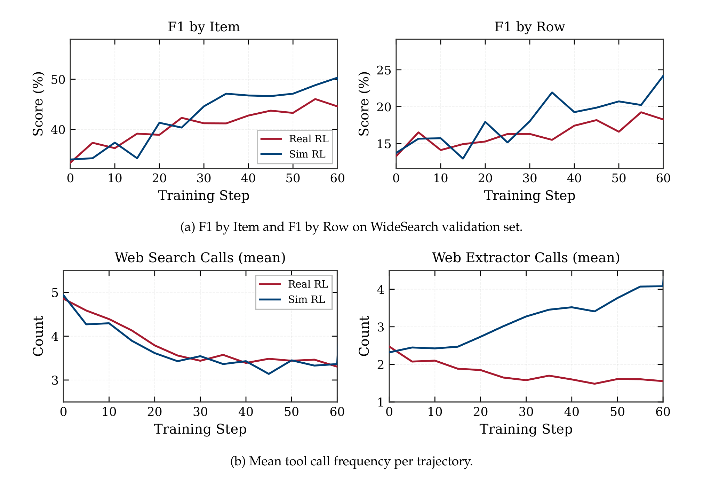
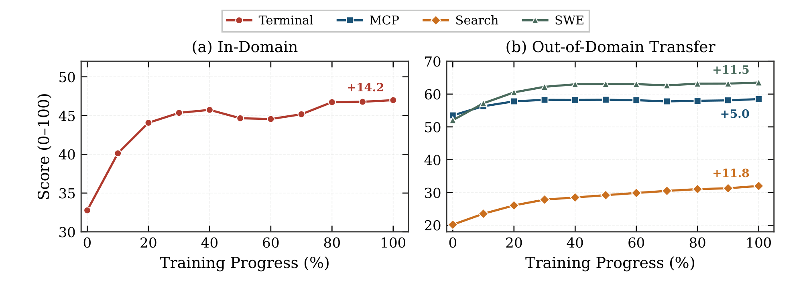
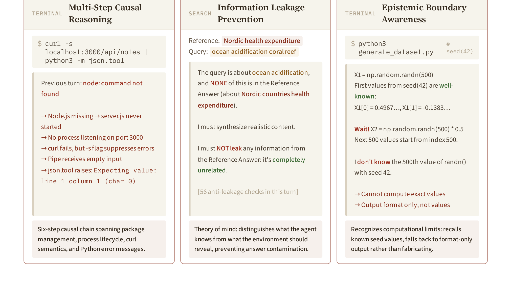

# Qwen-AgentWorld: Language World Models for General Agents

## 来源

- **PDF**：`raw/2606.24597v1.pdf`（arXiv:2606.24597v1，47 页，Technical Blog）
- **日期**：2026-06-24
- **团队**：Qwen Team（Core Contributors: Yuxin Zuo、Zikai Xiao、Li Sheng、Fei Huang†、Jianhong Tu† 等；External Advisor: Ning Ding, Tsinghua University；† 为 Project Lead）
- **模型**：[Qwen-AgentWorld](../models/qwen-agent-world.md)（35B-A3B / 397B-A17B 两个变体，均基于 Qwen3.5 checkpoint）

## 核心结论

论文把通用 agent 的瓶颈定位在 **world modeling 这一缺失的拼图**上：当前 LLM agent 研究几乎只关注 policy 侧（states → actions），而忽略了 world model（(states, actions) → subsequent states）。Richens et al. (2025) 进一步证明任何能在足够广任务范围上泛化的 agent 必然已学到世界模型——world model 不是"有用"，而是"必要"。

Qwen-AgentWorld 是**首个覆盖 7 域的 native language world model（LWM）**：MCP、Search、Terminal、SWE、Android、Web、OS。三个 GUI 域的环境观测用 accessibility tree 与 UI view hierarchy 的**文本表示**，而非像素帧。它通过三阶段管线训练（"CPT injects, SFT activates, RL sharpens"）：CPT 注入 state-transition dynamics 与 world knowledge，SFT 激活 next-state-prediction 推理模式，RL 用 hybrid rubric-and-rule rewards 锐化模拟保真度。

基于此，论文进一步研究 world modeling 增强 agent 的**两种互补范式**：

1. **Decouple（解耦）**——LWM 作为独立环境模拟器，支持 turn-level 可扩展性与可控性，做 Sim RL 训练 agent。
2. **Unify（统一）**——LWM 训练作为 agent 基座的 warm-up，把 next-state prediction 内化为一种 meta-reasoning 模式（类似"反思"但面向未来）。

![Figure 1：Qwen-AgentWorld 总览。上半为 7 域统一的 native language world model（CPT→SFT→RL 三阶段，10M+ 环境轨迹）；下半为两种 agent 增强范式——左 [i] Decouple 把 LWM 作环境模拟器做 Sim RL（可扩展到无限真实环境 + 可控对抗环境），右 [ii] Unify 把 LWM 训练作 agent 基座 warm-up。底部柱状图展示 LLM RL（不含工具调用）在 agentic 任务上的泛化增益。](../assets/qwen-agent-world/fig1-overview.png)

> Figure 1 Overview of Qwen-AgentWorld. Top: Qwen-AgentWorld is a unified native language world model across seven domains. Bottom: We explore two complementary strategies for applying world modeling to enhance language agents (mainly using the 35B-A3B model as agent): Decouple and Unify, where the world model serves as the environment simulator and agent foundation model, respectively.（§ 1 Introduction）

## 架构与训练

### 统一环境轨迹 schema 与 7 域

为在状态表示差异极大的 7 域（Terminal 的文件系统快照 vs Android 的 UI view hierarchy）上训练单一 world model，论文定义统一 schema：

```
system_prompt := task_description ⊕ action_space ⊕ initial_state ⊕ demonstrations ⊕ simulation_instruction
turn_t := (action_t, observation_t)
trajectory := system_prompt ⊕ [turn_1, ..., turn_T]
```

其中 action 是 agent 一轮的输出（工具调用 / shell 命令），observation 是环境的反馈（工具响应 / 命令输出）。initial_state 与 simulation_instruction 是可选的动态组件，其余字段恒在。

7 域的 action / observation / 核心能力（原文确证，Table 1）：

| Domain | Action | Observation | Core Capability |
| --- | --- | --- | --- |
| MCP | JSON Tool Call | Tool response（file content, DB 等） | Factual world knowledge |
| Search | Web Search / Web Extractor | Conversation history（query + results） | Factual world knowledge |
| SWE | Read / Edit / Bash / ... | Tool output（file content + diffs） | Code execution reasoning |
| Terminal | Bash Commands / Keystrokes | Terminal output（stdout + shell prompt） | Long-context causal reasoning |
| Android | Touch / Swipe / Type / ... | UI view hierarchy + app state | Visual state reasoning |
| Web | Click / Type / Navigate / ... | Accessibility tree + browser state | Visual state reasoning |
| OS | Mouse / Keyboard | Accessibility tree + window/app state | Visual state reasoning |

LWM 形式化为条件文本生成器：给定 system prompt `c`、历史观测 `o_≤t` 与动作 `a_≤t`，预测下一观测 `ô_{t+1} = f_θ(c, o_≤t, a_≤t)`，训练目标为 ground-truth `o_{t+1}`。stateless 环境（如 Search）状态隐含在对话历史中，stateful 环境（如 Terminal、OS）维护显式内部状态——但 LWM 在两种情况下都操作同一观测序列。

### 三阶段训练：CPT injects, SFT activates, RL sharpens



> Figure 5 Three-stage training pipeline of Qwen-AgentWorld. Stage 1 CPT injects world knowledge; Stage 2 SFT instills next-state-prediction thinking patterns; Stage 3 RL sharpens output quality.（§ 3）

**训练数据**（§3.1）。三源互补：(1) Dedicated Agent Infrastructure——自建 containerized 沙箱、MCP servers、持久 terminal/GUI 环境，自动合成任务并让 agent 系统端到端执行，是主数据源；(2) Open Environment Interaction Traces——终端录制、开源 agentic tool-call 日志、代码仓库执行 trace，经多 agent 清洗管线（fetching / denoising / segmentation / semantic alignment / quality scoring）筛选；(3) In-House Agentic Trajectories——日常模型开发积累的 7 域轨迹。三阶段数据池严格不相交：CPT 用 (1)(2) + 专门领域 world knowledge 语料，SFT/RL 仅用 (3)。

SFT/RL 数据统计（原文确证，Table 2）：

| Domain | SFT | RL Train | Avg. tokens | Avg. turns |
| --- | ---: | ---: | ---: | ---: |
| MCP | 179 | 4,156 | 62,702 | 28.9 |
| Search | 1,042 | 20,004 | 18,873 | 6.2 |
| Terminal | 1,580 | 34,125 | 5,805 | 12.0 |
| SWE | 249 | 8,181 | 36,734 | 24.7 |
| Android | 1,337 | 11,498 | 30,064 | 19.3 |
| Web | 1,605 | 8,716 | 19,417 | 10.2 |
| OS | 1,102 | 5,628 | 25,439 | 12.4 |
| **Total** | **7,094** | **92,308** | **19,443** | **13.4** |

**统一数据处理**（§3.1.2）。轨迹展开为 turn-level 预测样本：对 T 轮轨迹，任一轮 `t` 都可作预测目标（前 `t-1` 轮 + 当前状态与动作作输入，第 `t` 轮 observation 作目标）；训练时每条轨迹随机采样一轮。两级过滤：轨迹级（<2 轮丢弃、MCP/SWE 中调用未声明工具丢弃、GUI 环境故障丢弃）+ turn 级（空 action turn 剥离 + 两个非平凡过滤：Retry-Cycle Skipping 跳过"垃圾输出→错误→重试"循环但保留状态链、No-Change Turn Filtering 删 GUI 域中动作前后无变化的 turn）。

**System prompt 模板的 AutoResearch 自动化**。手工设计 7 域 system prompt 需深度领域知识与大量迭代，论文把它建模为自动化研究问题（Karpathy, 2026）：optimizer agent 分析采样轨迹→起草/修订候选 prompt→加载到 world model 跑 held-out 真实轨迹推理→judge 打分→据具体预测错误定位弱点→下一轮修订。每轮 10 次 propose–evaluate–refine 迭代，并行 12 个 run（各用不同 style directive：verbose / concise / demonstration-heavy 等），得 12 个模板变体（v0–v11，从 ~30 行约束式到 ~1100 行规格式）。三训练池取不相交模板子集：RL 用 v0、CPT 用 v1、SFT 从 v2–v11 每样本随机采样以最大化 prompt-format 多样性。

**Stage 1: CPT**（§3.2）。目标是建模真实环境行为同时注入广博 world knowledge。除环境轨迹外，还纳入专门领域 world knowledge 语料（工业控制/制造、网络安全、法律法规、医疗健康、金融、时事百科）。标准 next-token prediction 目标，多轮轨迹框架化为 world-modeling 任务（system prompt 定义模拟上下文、user turn 载 action、assistant turn 载 observation，直接映射到 `p(o_{t+1} | o_≤t, a_≤t)`）。

**Turn-level 信息论 loss masking**（§3.2，原文确证 Table 3）。工具轨迹中很多 turn 是 boilerplate（工具 echo 输入、API 镜像请求参数），这些 turn 梯度低质且引入噪声，但不能删除（后续 turn 依赖它们作上下文）。论文对每个 (action, observation) pair 算四个统计量——Overlap `OL = |W_act ∩ W_obs| / |W_act|`、Novelty `Nov = |W_obs \ W_act| / |W_obs|`、Jaccard `Jac`、length ratio `R = |obs| / |act|`——把 turn 分到 7 个语义类别（按统计信号而非工具名，保持 tool-agnostic），各类别 keep ratio 不同：

| Category | Statistical signature | Intuition | Keep |
| --- | --- | --- | ---: |
| retrieval | Nov ≥60%, R > 1 | read_file → contents | 100% |
| expansion | OL ≥50%, Nov ≥50%, R > 1.5 | fetch → page + metadata | 100% |
| action | Nov ≥50%, R ≤1 or short | send_email → "sent" | 100% |
| transform | Nov < 50%, R < 1 | long input → status word | 50% |
| boilerplate | OL ≥50%, Nov < 50% | API echo | 10% |
| echo | OL ≥70%, Nov < 30% | think(x) → {thought:x} | 5% |
| other | uncategorized | — | 100% |

被 mask 的 turn 从 loss 计算中排除，但其 token 保留作后续 turn 的上下文——这把"学下一状态"与"学下一 token"解耦，loss 只算携带真实环境信息的 turn。

**Stage 2: SFT**（§3.3）。CPT 后模型已学到工具返回什么、状态如何演化，但仅通过 observation token 上的 next-token prediction 隐式应用。SFT 显式激活 next-state prediction 为推理模式：教模型显式做 next-state prediction 推理（识别 action 请求什么、回忆先前状态、预期响应格式），减少幻觉并改善长轨迹状态一致性。仍用标准 next-token prediction 目标，256k token 上下文窗口。SFT 从非 thinking 转向含显式推理链的 thinking 轨迹：先做 prompt 模板多样化（每样本从 10 个模板变体中均匀采样），再对每 query 从通用推理模型生成 3 个 rollout，由独立 judge 打分配对比较选最优，低于阈值的 query 丢弃。从 10,250 候选 query 保留 7,094 轨迹（69.2% retention，原文确证 Table 4）。

**Stage 3: RL**（§3.4）。用 [GSPO](group-sequence-policy-optimization.md)（Zheng et al., 2025）。LWM RL 有两个独特挑战：(1) 环境反馈预测的困难性与开放性；(2) **prompt–output 极端不对称**——prompt 是到预测 turn 的完整轨迹历史（常达数万 token），output 是单个预测观测（通常几百到几千 token），单样本计算成本被 prompt 处理主导。prompt 上限 128k token。

### RL 的三个稳定性问题

论文通过系统消融识别三种失败模式并给出解法（§3.4.2，原文确证）：

1. **Multi-Turn Expansion 导致的 Reward Collapse**。轨迹展开为多样本时训练实例共享长公共前缀，导致训练迅速 collapse（与多轮 agent RL 中的 "Echo Trap" 相关，reward 方差塌缩、policy 退化）。解法：RL 池中每条轨迹**恰好展开一轮**，每个训练样本有唯一预测目标、无共享前缀重叠。
2. **Reward Shaping**。对比三种 reward：(a) 五维 rubric + rule verifier（本文采用）；(b) Reference-Reward（judge 拿 ground-truth 做 A/B pairwise 选 policy 输出 vs 初始 checkpoint 输出谁更近，binary 0/1）——收敛慢，binary reward 稀疏且两输出都合理但表面不同时 judge 偏好不稳定；(c) Turing-Test Reward（judge 判预测观测是否可能来自真实环境）——几乎不收敛，因 false-negative 率太高（生成接近甚至相同 ground truth 时，判"哪个更像真实环境"引入不可靠信号）。最终五维 rubric + rule verifier 稳定收敛。
3. **Self-Praise 的 Reward Hacking**。policy 学会利用 judge 偏置，在预测观测中插入自夸短语（如"operation completed successfully with all fields correctly populated"）或回显 judge prompt 中触发高分的关键词。三种缓解：(a) rule-based verifier 把部分 reward 锚定在 binary correctness 上（不受 judge 偏置影响）；(b) judge prompt 中的 content-type classification 收窄每维评分范围，确定性内容按精确匹配判定，自夸在确定性区域零分；(c) 严格 tag extraction 确保只有预测观测到达 judge，thinking block 永不暴露给 judge。

**Reward 设计**（§3.4.1）。两信号 9:1（rubric:rule）组合：
- **五维 Rubric（LLM judge）**：每预测观测由 LLM judge 按 §4.2 五维 rubric 打分（每维 1–5），total reward = mean × 5，范围 [5, 25]；judge 失败则 reward=0。每域用定制 judge system prompt + content-type classification（减少 timestamp/PID 等不可复现细节的 false negative），异步分布式调用。
- **Rule-Based Verifier**：部分数据携带可执行 verifier 代码，产出 binary 0/1 信号，缩放到 [0, 25]。作客观锚点，缓解开放 reward 的 reward hacking。

## 应用范式

### Application I：解耦模拟器（Sim RL）

LWM 作为独立环境模拟器（policy agent 与 world model 是分开的模型），提供真实环境没有的两个属性：**可扩展性**与**可控性**（§6.1）。

**Generalizable Environment Scaling**（§6.1.1）。Qwen-AgentWorld-397B-A17B 在 4k **OpenClaw** 环境（完全 OOD，训练中未见）上 zero-shot 模拟做 Sim RL。从少量真实 Claw Agent 轨迹提炼可复用 seed scenario（task-relevant 初始状态 + user query），沿环境侧（保持 workflow 结构变具体状态）与任务侧（rephrase intent、调难度、组合多步目标）两轴合成 4k 模拟训练环境，每任务生成 rubric-based verifier 作 Sim RL reward。

结果（原文确证 Table 6）：

| Model | Claw-Eval | QwenClawBench |
| --- | ---: | ---: |
| Qwen3.5-35B-A3B（base） | 65.4 | 47.9 |
| Sim RL（w/ Qwen3.6-Plus 作模拟器） | 66.7 | 47.8 |
| Sim RL（w/ Qwen-AgentWorld-397B-A17B 作模拟器） | 69.7 | 55.0 |
| **∆** | **+4.3** | **+7.1** |

用 Qwen3.6-Plus 作模拟器几乎无增益，而专门训练过的 Qwen-AgentWorld-397B-A17B 增益显著——印证 dedicated LWM 训练管线对高保真模拟器至关重要。

**Controllable Simulation**（§6.1.2）。用自然语言指令在 trajectory 与 turn 两级塑造 LWM 行为，验证两种互补模式：

- **Environment Adaptation（MCP）**。从真实 MCP 轨迹合成模拟 system prompt（initial state + environment summary + controllable simulation instructions），注入定向扰动（间歇 API 错误、分页响应、不完整中间结果、批量操作部分失败）。标准 Sim RL（无控制指令）几乎无增益（Tool Decathlon 32.4→31.5 反降），controlled Sim RL 在 Tool Decathlon +3.7、MCPMark +12.3（原文确证 Table 7）。**可控性不只是增益大小的因素，而是 Sim RL 在此域能否工作的前提**——无 grounded simulation instructions 时训练信号太噪。
- **Fictional-World Construction（Search）**。用多 agent 合成框架构造 1k 完全虚构但自洽的环境，每个锚定一个 300–500 行的关系数据库。四策略（time-shifted / granular long-tail / private simulation / realistic grounded）保持数据虚构但真实。controlled simulation instruction 要求 LWM 只返回与当前 query 相关的信息、不揭示完整答案，迫使 agent 改写 query、交叉引用、迭代聚合。WideSearch 上 35B F1 Item +16.29、397B +3.87（原文确证 Table 8）。**在完全虚构世界训练的 agent 泛化到真实搜索任务**——因答案仅存在于虚构设定中，agent 无法从参数记忆绕过搜索工具，也不会把训练时的搜索结果与真实世界知识混淆。

**Real RL vs Sim RL**（§6.1.2）。WideSearch 上对比 controllable Sim RL 与用真实搜索引擎训练的 Real RL（原文确证 Figure 9）：



> Figure 9 Controllable Sim RL vs. Real RL (trained against a live search engine) on WideSearch during the first 60 training steps. Both experiments use Qwen3.5-35B-A3B-SFT as the base model.（§ 6.1.2）

任务性能上 Sim RL 追平或略超 Real RL（F1 by Item 50.3% vs 45.6%）。更有信息量的信号在 agent 行为：两训练都把 web_search 调用从 ~5 降到 ~3.5（都学会更精准 query），但 web_extractor 调用分化——Sim RL 从 2.5 升到 4.0，Real RL 从 2.5 降到 1.5。这直接反映可控模拟设计：模拟 snippet 故意 withhold 详细内容，Sim-RL agent 学会提取整页是组装完整答案所必需；Real-RL agent 发现真实 snippet 常已足够，学会跳过提取。**可控模拟能定向塑造 agent 行为**：通过构造需要特定能力的对抗环境条件，Sim RL 比无控制的真实环境训练更有效地训练那些能力。

> **原文要点**：Sim RL 的有效性依赖给 world model 提供足够详细的 initial state；没有它，模拟保真度下降、下游增益缩减（§6.1 Takeaways: "State is the bottleneck"）。

### Application II：统一 agent 基座（LWM warm-up）

把 agent 与 world model 统一为同一模型：选 action 的模型也预测环境状态（§6.2）。机制是 LWM 训练让 agent 在 commit 前先心智模拟候选 action 的后果，把 world modeling 作为内部规划步骤。这呼应 LeCun et al. (2022) 的 unified world-model–actor 架构与 VLA 研究中的 World Action Model 范式。

实验：在 Qwen3.5-35B-A3B-SFT 上做 LWM RL warm-up（本质是**单轮、非 agentic、无工具调用**的任务——给定 user action 预测下一环境状态），之后直接在多轮、工具调用的 agentic 任务上评测，**不做任何额外微调**。

结果（原文确证 Table 9）——7 个 benchmark 全部提升，含 3 个完全 OOD 域：

| Benchmark | 类型 | base | w/ LWM RL | ∆ |
| --- | --- | ---: | ---: | ---: |
| Terminal-Bench 2.0 | In Domain | 33.25 | 39.55 | +6.30 |
| SWE-Bench Verified | In Domain | 64.47 | 67.86 | +3.39 |
| SWE-Bench Pro | In Domain | 42.18 | 47.42 | +5.24 |
| WideSearch F1 Item | In Domain | 33.38 | 46.17 | +12.79 |
| WideSearch F1 Row | In Domain | 13.27 | 20.14 | +6.87 |
| Claw-Eval | Out of Domain | 53.60 | 64.88 | +11.28 |
| QwenClawBench | Out of Domain | 39.76 | 49.43 | +9.67 |
| BFCL v4 Avg | Out of Domain | 62.29 | 71.25 | +8.96 |

OOD 增益尤为显著：LWM 训练管线完全不含 Claw 或 function-calling 数据，却在 Claw-Eval +11.3、QwenClawBench +9.7、BFCL v4 +9.0——确认 LWM warm-up 注入的是**可迁移的 agent 能力**而非领域特定捷径。

**机制证据：prediction-driven action refinement**（§6.2，原文确证 Figure 10/11）。分析多轮 agentic 评测的推理 trace，发现 RL 训练后的模型系统性地在执行 action 前做环境响应的**心智模拟**：用内化的 world model 预测结果、识别不可行路径、精炼 action 计划——全在 thinking trace 内、真实执行前。Terminal-Bench 2.0 的 mailman 任务 case study：两模型都遇到 Postfix recipient-rejection 错误，LWM RL 后的模型正确预测"仅配 transport_maps 不行，因为 Postfix 在查 transport routing 前就拒绝未知 recipient"，从而精炼 action 到修改 local_recipient_maps；LWM RL 前的模型错误预测 transport routing 先于 recipient validation，导致徒劳探索超时。量化：环境预测准确率从 69.9% 升到 78.3%（+8.4%）。

## 评测要点

### AgentWorldBench

为评估 LWM，论文构造 AgentWorldBench（§4）：2,170 个 turn-level 评测样本，跨 7 域、9 个 source benchmark、5 个 frontier model、5 个评测维度。

四条构造原则：(1) Widely-Used Queries（任务 query 来自既有高质量 agentic benchmark 而非自构）；(2) Frontier-Agent Trajectories（轨迹由 frontier-model agent 生成，action 足够复杂以压力测试 world-model 保真度）；(3) Real Observations（每轨迹配真实环境执行的 ground-truth 观测）；(4) Out-of-Distribution（训练数据与 benchmark query 在数据源级分区，测泛化而非记忆）。

数据收集：5 个 frontier agent 在 9 个既有 benchmark query set 上对真实环境执行，提取环境轨迹。文本域早期子集（Terminal-Bench 1.0 与 in-house SWE）用 Claude Sonnet 4.5，其余文本域用 Claude Opus 4.6；GUI 域额外加 3 个 Qwen 家族模型扩展 agent 池到 5 个。

Turn-level 采样：文本域用非对称策略——每轨迹保留 first + last + 3 个均匀采样中间 turn = 5 个评测 turn（first 测无历史初始模拟、last 测长上下文保真、中间 3 个覆盖中段行为并稀释边界偏差）；GUI 域选择性采样更难的 turn。展开后再均匀随机保留 50%。

域分布：文本四域占 72.4%（SWE 21.8%、Search 21.1%、Terminal 16.3%、MCP 13.2%），GUI 三域各 9.2%。平均上下文长度 MCP 59,300 token（每样本嵌完整 tool-definition schema）最短 Terminal 12,900 token。

**评测协议**（§4.2）。五维 rubric：Format（结构约定，如 MCP 的 JSON schema、Terminal 的 shell prompt 模式）、Factuality（所述事实正确性）、Consistency（内部自洽且与先前 turn 一致）、Realism（匹配真实环境行为特征）、Quality（相对 ground truth 的完整性与简洁性）。主分数为五维均值，缩放到 [0, 100]。

三个关键设计：

- **Reference-Grounded Judging**：judge 同时拿 ground-truth 观测与预测观测，通过比较两者打分。把开放质量判断转为事实比较，大幅收窄 judge 幻觉/误判空间——这是跨 judge 一致性高的主因。
- **Differentiated Matching Criteria**：把观测内容分三类匹配标准——Deterministic content（echo 输出、文件读取、计算结果）须精确匹配；Pre-existing environment content（预装软件版本、非轨迹创建的文件内容）仅验格式与合理性（模拟器无法复现特定 sandbox 的 gcc patch 版本）；Runtime metadata（timestamp、PID、内存地址、session token）仅验格式与范围。三类区分让 judge 奖励正确结构/语义行为而不惩罚不可复现细节。
- **Judge Selection**：用 double-blind Turing test 校准——judge 拿两条候选观测（一条真实、一条 world model 生成，随机序），须识别哪条来自真实环境。用 Turing-test 准确率作优化信号，autoresearch 迭代精炼域特定 judge prompt。比较 Gemini 3 Flash / Claude Sonnet 4.5 / GPT-5.2 三个 judge：绝对分系统性差异（Gemini 最宽松、GPT-5.2 最严），但模型级排名高度一致（pairwise Spearman ρ = 0.92–0.99，p < 10⁻⁵），五维排序也一致（Realism > Quality > Factuality）。选 GPT-5.2 作 judge（Turing-test 准确率最高）。

### 主结果（Table 5）

AgentWorldBench 五维 rubric 均值（原文确证）：

| Model | MCP | Search | Term. | SWE | Android | Web | OS | Avg. |
| --- | ---: | ---: | ---: | ---: | ---: | ---: | ---: | ---: |
| Claude Opus 4.8 | 54.93 | 35.14 | 59.18 | 64.10 | 61.50 | 54.66 | 66.62 | 56.59 |
| Claude Opus 4.6 | 69.90 | 29.30 | 57.51 | 64.55 | 61.74 | 51.42 | 70.20 | 57.80 |
| Claude Sonnet 4.6 | 70.00 | 28.79 | 56.98 | 64.52 | 58.03 | 50.78 | 63.17 | 56.04 |
| GPT-5.4 | 70.10 | 37.26 | 53.69 | 66.29 | 60.00 | 51.80 | 68.58 | 58.25 |
| Gemini 3.1 Pro | 59.07 | 30.21 | 52.47 | 59.07 | 61.40 | 52.83 | 66.92 | 54.57 |
| DeepSeek-V4-Pro | 63.27 | 27.61 | 51.26 | 59.44 | 55.17 | 50.32 | 63.70 | 52.97 |
| Kimi K2.6 | 65.23 | 27.48 | 52.54 | 58.77 | 58.93 | 50.20 | 60.80 | 53.42 |
| GLM-5.1 | 67.60 | 22.46 | 47.32 | 52.07 | 59.10 | 51.50 | 59.13 | 51.31 |
| MiniMax-M2.7 | 55.82 | 27.30 | 41.62 | 37.44 | 52.40 | 50.52 | 57.73 | 46.12 |
| Qwen3.6-35B-A3B | 42.96 | 18.78 | 43.81 | 40.71 | 51.88 | 46.53 | 55.48 | 42.88 |
| Qwen3.6-Plus | 55.28 | 21.94 | 50.58 | 59.08 | 57.65 | 50.78 | 60.33 | 50.81 |
| Qwen3.6-Max-Preview | 67.01 | 24.71 | 50.86 | 57.11 | 57.74 | 48.58 | 60.95 | 52.42 |
| Qwen3.5-35B-A3B（base） | 57.87 | 25.98 | 46.13 | 47.58 | 53.18 | 47.10 | 56.27 | 47.73 |
| **Qwen-AgentWorld-35B-A3B** | 64.79 | 36.69 | 53.96 | 65.63 | 58.17 | 49.55 | 65.92 | **56.39** |
| Qwen3.5-397B-A17B（base） | 68.31 | 30.81 | 55.30 | 64.44 | 54.90 | 48.55 | 60.85 | 54.74 |
| **Qwen-AgentWorld-397B-A17B** | 68.24 | 37.82 | 57.73 | 68.49 | 60.20 | 50.98 | 67.89 | **58.71** |

要点：

- **Qwen-AgentWorld-397B-A17B 总均分 58.71 最高**，超 GPT-5.4（58.25）。
- **文本域优势明显**：397B 文本均分 58.07 vs GPT-5.4 56.84（+1.23），在 Terminal（57.73 vs 53.69）与 SWE（68.49 vs 66.29）——这两个域需准确建模代码执行状态与工具 API 行为——优势最大。
- **GUI 域落后**：Claude Opus 4.8（60.93）/ Opus 4.6（61.12）领先，Qwen-AgentWorld-397B 第五（59.69）。差距反映 multimodal pre-training 的优势是纯文本 world modeling 不能完全捕获的。
- **World-model 训练效果**：397B 从 base 54.74→58.71（+3.97）；35B 从 47.73→56.39（+8.66，超 Claude Sonnet 4.6 的 56.04）。改进在文本/GUI 两域一致。Qwen3.6 系（无 LWM 训练，同架构家族）Qwen3.6-Plus 50.81 / Qwen3.6-Max-Preview 52.42 远低于 Qwen-AgentWorld——增益不能由 base 模型通用能力解释。
- **Search 最难**：最佳 37.82 约为 SWE（68.49）/ MCP（70.10）最佳的一半。Search 需建模持续演化的 web 内容，长检索链上的事实一致性对所有模型都难。

### 跨域泛化（§5.3）

测 Qwen-AgentWorld 学到的是可迁移的 language world knowledge 还是领域特定环境行为：Stage 3 RL **仅在 Terminal 数据上训练**，每 10 步在 4 个文本域上评测。



> Figure 8 Cross-domain generalization when training Stage 3 (RL) on Terminal data alone. (a) Terminal (in-domain) improves by +14.2 points over the SFT baseline. (b) All three held-out domains improve without receiving any domain-specific training signal: MCP (+5.0), SWE (+11.5), and Search (+11.8).（§ 5.3）

Terminal 100 RL 步内从 32.8 升到 47.0（+14.2）；三个 held-out 文本域同步提升：SWE +11.5（52.0→63.5）、Search +11.8（20.2→32.0）、MCP +5.0（53.5→58.5，已从高基线起）。迁移非平凡：Terminal shell 命令与 MCP 工具调用在语法、状态表示、响应结构上差异大，但增益在头 10 RL 步内出现并保持稳定。这表明 RL 强化的是**可迁移的 world knowledge**（环境如何响应 action、错误如何传播、状态转移如何跨 turn 组合）而非领域特定输出格式。

### 分析：LWM 推理模式与微观保真度

**推理模式**（§7.1，原文确证，分析 129 条 thinking trace）。三种代表模式：



> Figure 12 Representative LWM reasoning patterns from Qwen-AgentWorld-397B-A17B's thinking traces.（§ 7.1）

- **Deliberative Self-Correction**：模型用 "Wait!" 作显式认知中断，重新审视并修订中间预测。129 turn 中 1,347 次中断（平均 10.4/turn，峰值单 SWE turn 56 次），Terminal 与 MCP 频率最高（16.9 与 12.7/turn）。三种 subtype：factual（抓错误 API 响应格式）、epistemological（识别上下文计算极限，如 `np.random.seed(42)` 例子）、perspective-taking（建模 evaluator 意图或 agent 知识状态）。把环境预测从单遍生成转为受限可满足性搜索。
- **Information Leakage Prevention**（Search 域）：模型持有参考答案，当 agent query 与答案无关时显式防泄漏——识别主题不匹配并确保生成的 snippet 不意外揭示目标信息。这是 world-model 版的 theory of mind：模型区分 agent 知道什么与环境该揭示什么。
- **Multi-Step Causal Reasoning**：模型构造跨多系统抽象的因果链。一个 Terminal 例子：预测 `curl -s localhost:3000 | python3 -m json.tool` 输出需六步链（Node.js missing → server 未启动 → 端口 3000 无监听 → curl 静默失败 → pipe 收空输入 → json.tool 抛 JSONDecodeError），每步调不同系统知识。

**RL 增强微观保真度**（§7.2，原文确证 Figure 13）：

- **Search: URL 跨 RL step 的真实性**。追踪单个 Search 样本跨 RL checkpoint：Step 100 生成 IMDB URL `tt2333444`（合成标识符）；Step 200 标识符变 `tt2988794`，来源按自然排名（Wikipedia → IMDB → NYT → Rotten Tomatoes），snippet 含与 ground truth 紧密匹配的查询特定事实细节。URL 标识符仅占响应 token 极小部分，但 RL 甚至增强这些低显著性细节——reward 信号传播到显式 reward 维度粒度之下。
- **Terminal: 字符级字节算术**。多轮轨迹中模型在前一 turn 见 `cat` 显示的文件内容，几轮后须预测 `wc -c` 输出。模型在 thinking trace 中逐字符枚举（含不可见 `\n` 字节），通过逐字母算术得到精确计数（53 bytes）。其他例子中模型同时满足密码学不变量（相同文件 → 相同 SHA256）与 Unix pipeline 语义（tee 到不存在目录失败但不影响 stdout）。
- **MCP: 跨 turn API schema 保真度**。模拟 Notion workspace 的 9 个顺序 API call 中，模型维护完美一致性：同一 user identifier 出现在每个 `created_by` 字段、每 block 的 `parent.page_id` 匹配查询的 block ID、完整 Notion schema（~20 字段/block）无遗漏。模型实现了有状态的 in-context database，跨数十个嵌套 JSON 对象维护引用完整性。

## 待追问

- **GUI 域差距的根因**。Qwen-AgentWorld 在 GUI 域（Android/Web/OS）落后 Claude Opus 4.8/4.6 与 GPT-5.4，论文归因于 multimodal pre-training 优势。但三 GUI 域已用 accessibility tree / UI view hierarchy 的文本表示——这是否意味着纯文本 world modeling 对 GUI 状态推理有内在上限？Future work 提到的 "multimodal extension"（融合截图与文本表示）能否闭合差距？
- **Factuality 维度持续最低**。Appendix B 显示 Factuality 相对提升最大（11.3%）但全程仍是最低分维度——factual world knowledge 是环境模拟最难的部分。这是否是 LLM world model 的根本瓶颈（vs 程序化环境合成的确定性）？更大 CPT 语料能否突破？
- **10M+ trajectories 的构成拆解**。Abstract 称用 10M+ 环境交互轨迹，但 Table 2 的 SFT/RL pool 仅 ~7K/~92K。10M+ 应是 CPT 数据（含 dedicated infra + open traces + world knowledge 语料），但三源各自占比与域分布未给出。
- **Fictional-world 四策略的独立贡献**。time-shifted / granular long-tail / private simulation / realistic grounded 四种合成策略未做消融，哪种对 sim-to-real 迁移贡献最大？
- **LWM warm-up 与 auxiliary world-modeling loss 的组合**。论文提到 Shrivastava et al. (2026) 的 ECHO 在 agent RL 中加 auxiliary environment-prediction loss 使 Terminal-Bench 2.0 翻倍，并说 future work 可探索 LWM warm-up + auxiliary objective 的 compounding benefit。这是否暗示 LWM warm-up 与 in-training world modeling 是互补的两条路？
- **与 Agent-World（人大+ByteDance）的互补边界**。论文 Related Work 明确把 [Agent-World](agent-world.md)（Dong et al., 2026）归为 "Synthetic Environment Generation"（code-driven），自定位为 "learned neural simulator"。两者在 Sim RL 上各有优势：Agent-World 的 code-based 合成保证确定性执行与可验证 reward，Qwen-AgentWorld 的 LWM 覆盖 code 难以指定的域（搜索引擎、真实 MCP servers）。但两者是否可组合——例如用 Agent-World 的环境合成造 seed、用 Qwen-AgentWorld 扩展到不可程序化域？
- **State is the bottleneck 的定量证据**。§6.1 Takeaways 称 Sim RL 有效性依赖给 world model 足够详细的 initial state，但正文未给对应的消融数据（不同 initial state 详细度下的 Sim RL 增益曲线）。

## 相关页面

- [Qwen-AgentWorld](../models/qwen-agent-world.md) - 模型页
- [Agentic Engineering](../concepts/agentic-engineering.md) - world modeling 作为 agentic engineering 的新轴
- [Agentic 模型的后训练](../concepts/post-training-for-agentic-models.md) - LWM warm-up 作为 agent 基座训练范式
- [Agentic 评测体系](../concepts/agentic-evaluation-benchmarks.md) - AgentWorldBench 的 reference-grounded judging 方法论
- [Agent-World](agent-world.md) - code-driven 环境合成路线（互补对照）
- [Group Sequence Policy Optimization](group-sequence-policy-optimization.md) - GSPO 作 RL 算法
- [LLM RL policy optimization 对比](../comparisons/llm-rl-policy-optimization.md) - GSPO 在 LWM RL 中的落地
