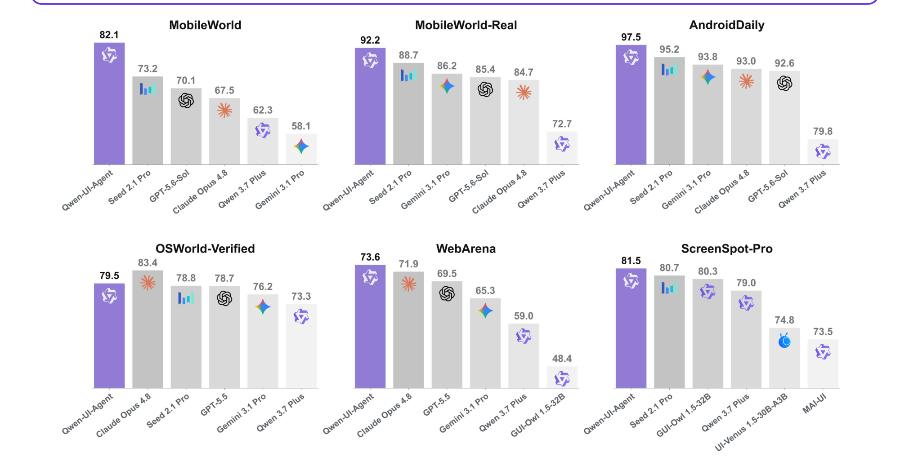
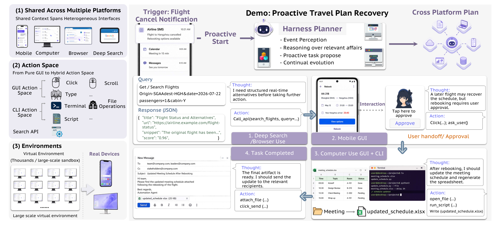
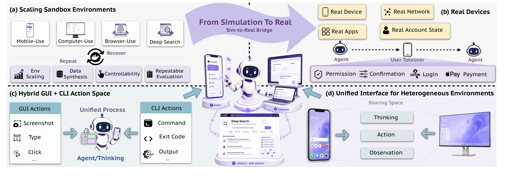
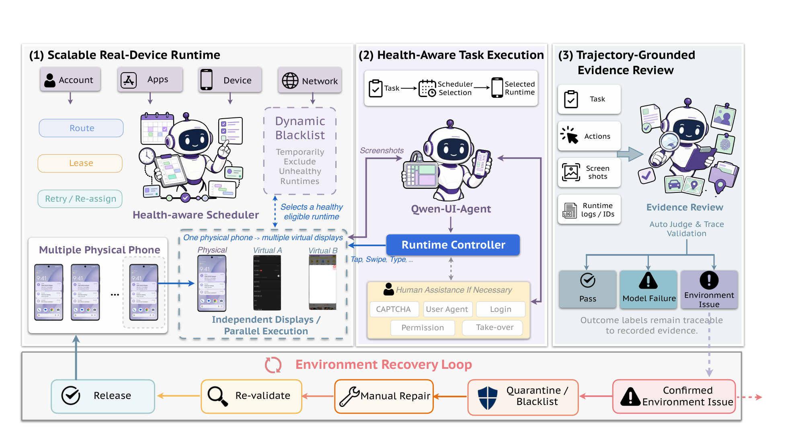
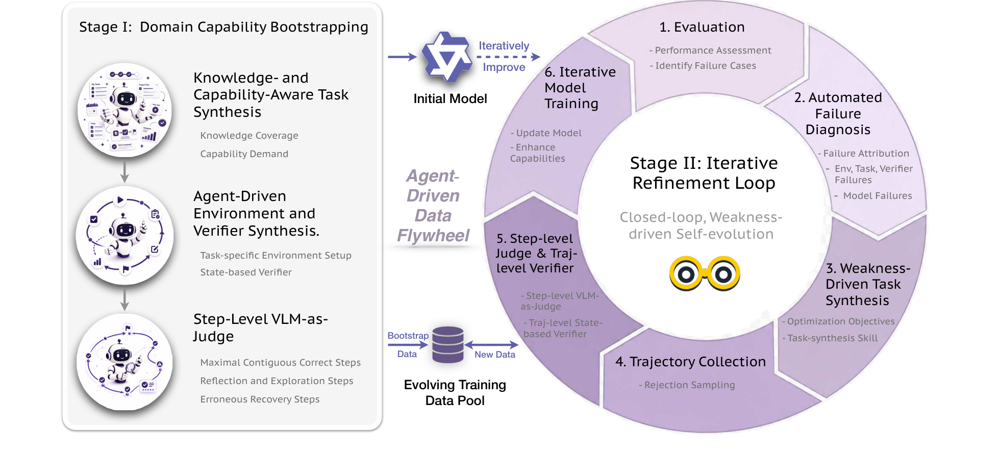
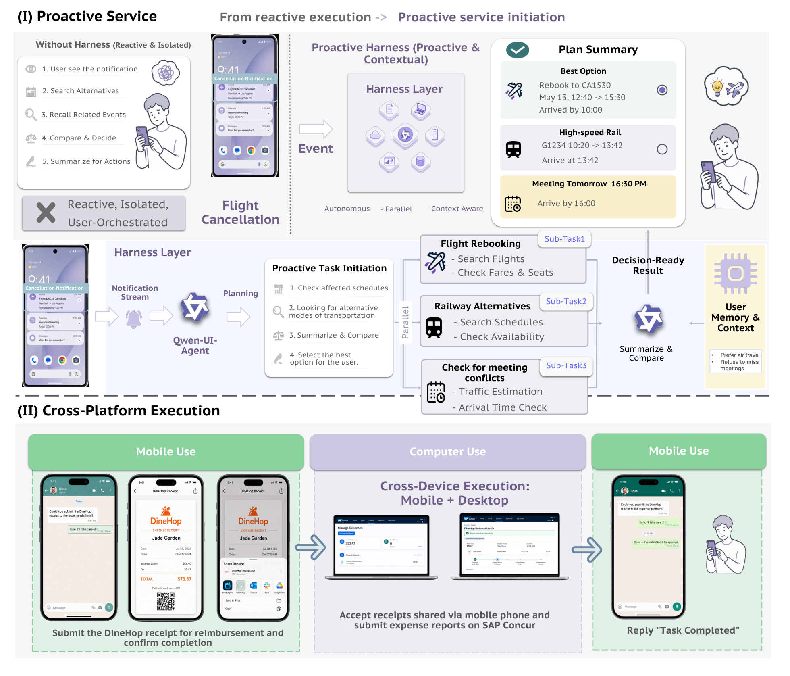

# Qwen-UI-Agent 技术报告

## 来源

- **PDF**：`raw/2607.28227v1.pdf`
- **标题**：Qwen-UI-Agent Technical Report: Toward Next-Generation Real-World Centric Foundation GUI Agents
- **日期**：2026-07-31（arXiv v1：2026-07-30）
- **团队**：MAI-UI Team / Alibaba Token Hub, Alibaba Group；Project Co-Leader Hanzhang Zhou / Panrong Tong / Xu Zhang，Project Leader Yue Wang
- **arXiv**：[2607.28227](https://arxiv.org/abs/2607.28227)
- **项目页**：[tongyi-mai.github.io/Qwen-UI-Agent](https://tongyi-mai.github.io/Qwen-UI-Agent)
- **模型页**：[Qwen-UI-Agent](../models/qwen-ui-agent.md)

报告自称是 [MAI-UI](https://arxiv.org/abs/2509.12895) 的续作（原文确证，Abstract footnote）。本 wiki 尚未沉淀 MAI-UI 原文。

## 核心结论

Qwen-UI-Agent 把 GUI agent 的缺口写成六条从 benchmark 走向真实使用的转移（原文确证，§1）：模拟器 → 真机；单域 → 跨平台工作流；纯 GUI → hybrid GUI+CLI 与 batched action；短程 → 长程可靠完成；人工密集管线 → AutoResearch-style 飞轮；被动等指令 → 主动发起服务。正文后半句写成「five transitions」，与开篇六条枚举不一致，按六条读。

对应系统拆成四块（原文确证，§2）：异构环境基础设施、agent-driven 数据飞轮、SFT + Action RL + Online RL 训练栈、以及 proactive / 跨平台 harness。

Headline 数字（原文确证，Abstract / Table 2–8；主评测变体是 27B）：

| 设置 | Qwen-UI-Agent-27B | 对照 |
| --- | --- | --- |
| MobileWorld GUI-only（50-step） | 82.1% | Seed 2.1 Pro 73.2%；GPT-5.6 Sol 70.1%；Opus 4.8 67.5% |
| MobileWorld-Real | 92.2% | Seed 2.1 Pro 88.7%；Gemini 3.1 Pro 86.2%；GPT-5.6 Sol 85.4% |
| AndroidDaily | 97.5% | Seed 2.1 Pro 95.2%；Gemini 3.1 Pro 93.8% |
| OSWorld-Verified | 79.5% | 第二；Opus 4.8 83.4%；UI-Mate-27B 77.0%（另页） |
| OSWorld-v2 | partial 40.0 / binary 13.9 / 135.8 steps | MiniMax M3 22.3 / 4.6 / 326.7；Opus 4.8 54.8 / 20.6 |
| WebArena | 73.6% | 自复跑 Opus 4.8 71.9%；GPT-5.5 69.5%；human 78.2% |
| ScreenSpot-Pro zoom-in | 81.5% | Seed 2.1 Pro 80.7%；GUI-Owl-1.5-32B 80.3% |

作者同时写明：真机分靠 AutoJudge 而非确定性 verifier；666 条专家标注上 exact-match 92.8%，剩余误差会进入真机数字（原文确证，§7 / Appendix A.1）。35B-A3B 的 CUA / DeepSearch 训练在发稿时仍在进行，对应结果未收录（原文确证，§7）。

> Figure 1: Qwen-UI-Agent demonstrates leading or competitive performance across diverse GUI settings.（Abstract / Figure 1）

> Figure 2: An illustrative trajectory of Qwen-UI-Agent for proactive cross-platform task execution.（§2 / Figure 2）

## 架构与训练

### 任务形式与动作空间

任务写成 $\tau=(I,E_\tau)$：指令加一组数字环境，环境可含手机、浏览器、桌面和 DeepSearch（原文确证，§2.1.1 / Eq. 1）。逐步观察是多通道 $o_t=(o^{\mathrm{GUI}}_t,o^{\mathrm{CLI}}_t,o^{\mathrm{API}}_t)$：截图、命令结果、结构化 API 响应；缺的通道置空（Eq. 2）。策略输出中间推理 $r_t$ 与可执行动作 $a_t$，且一次决策可发出有序批动作 $a_t=(a^{(1)}_t,\ldots,a^{(K_t)}_t)$，批内连续执行、中间不再观察（Eq. 3–4）。

动作空间是跨平台 GUI 并集，再补 `cli_command`、`api_call`、`ask_user` 和 `terminate`（原文确证，§2.1.2 / Table 1）：

| 类别 | 动作 | 定义 |
| --- | --- | --- |
| GUI | `click` / `double_click` / `long_press` | 坐标点击 |
| GUI | `type` / `open` / `drag` | 输入、开应用、拖拽 |
| GUI | `system_button` / `wait` | back/home/menu/enter；等待秒数 |
| CLI | `cli_command` | 在当前 CLI 环境执行 bash |
| API | `api_call` | 带参数调用外部服务 |
| 控制 | `ask_user` / `terminate` | 向用户要信息或确认；以 success/failed 结束 |

### 环境基础设施

> Figure 3: The environment infrastructure of Qwen-UI-Agent.（§2.2 / Figure 3）

沙箱可并行约 **10,000** 个隔离环境（原文确证，§2.2.1、§2.4.3）：

- **Mobile**：在 MobileWorld 上把 KVM 模拟器换成 redroid 容器，避开 QEMU/嵌套 KVM 的扩展瓶颈。
- **Computer**：OSWorld Ubuntu VM，并在 VM 内加轻量执行服务：GUI 译成原生输入，`cli_command` 走非交互 shell，不靠视觉操作终端；stdout/stderr/exit 与截图一起返回。
- **Browser**：FastAPI + Playwright + Chromium，每 episode 新 BrowserContext；JavaScript verifier 查 DOM 与持久状态。
- **DeepSearch**：Serper 检索 + Jina Reader 转文本，主观察是检索结果和文档，不是渲染 GUI。

统一接口把 acquire / reset / step / evaluate / tear_down / release 标准化，平台差异留给 adapter；策略与环境各自声明 native action space，GUI 坐标经 canonical IR 归一化（原文确证，§2.2.4）。

### 真机移动运行时

> Figure 4: Real-device mobile runtime with closed-loop environment governance.（§2.2.2 / Figure 4）

真机池超过 **100** 台物理设备、覆盖 **150+** 应用。调度持续跟踪设备、应用、账号、网络和屏幕健康；故障时改租、动态黑名单，修好再放回。虚拟屏让一台手机同时跑多个应用会话，真机集群相对无虚拟屏大约 **20×** 吞吐（原文确证，§2.2.2、§2.4.3）。User Agent 补缺失信息、对敏感操作要确认，并把 CAPTCHA 等步骤交给人。VLM judge 区分任务成功、模型失败和环境失败，避免把基础设施噪声写进训练标签。

中文超应用、密界面和弹窗被明确写成沙箱无法复现的理由（原文确证，§2.2.2）。

### AutoResearch 数据飞轮

> Figure 5: The data flywheel of Qwen-UI-Agent.（§2.3 / Figure 5）

飞轮把人从「每个阶段亲手做」改成监督和定点修订。任务合成沿两轴：knowledge coverage（应用功能、界面惯例、工作流）和 capability demand（长程状态追踪、约束遵循、数量/时间推理、错误恢复）。对每个域先建 function tree 和 capability profile，再编成可复用 task-synthesis skill（原文确证，§2.3）。

监督信号刻意分层：step-level VLM judge 从成功和失败轨迹里抽出最长连续正确前缀、每次反思/探索的**第一步**、以及从错误态回到可行路径的恢复段，用来扩 SFT；可执行 state-based verifier 留给 Online RL 的高精度终局信号。作者报告 step-level 过滤的 SFT 不弱于、有时强于只训 verifier 选出的完整成功轨迹（原文确证，§2.3）。失败分析先分模型失败 vs 环境/任务/verifier 失败，模型失败再映射到缺应用知识、约束违反、状态丢失或验证不足，聚合成下一轮优化目标。

作者同时承认：当前 foundation model 还管不了整条能力开发管线，因此是 agent-driven 而不是 fully autonomous（原文确证，§7）。

## 后训练

三阶段：SFT → Action RL → Online RL。与 [Xiaomi-GUI-0](xiaomi-gui-0.md) 的 SFT → Step RL → Agentic RL 同构但配方不同；与 [UI-Mate](ui-mate.md) 的两阶段 SFT → GRPO 相比，多了一层专门打局部动作错误的 Action RL。

### SFT

跨 mobile / desktop / web 先训 domain expert，每个 expert 以本域为主、混少量其他域，再把 checkpoint merge 成统一模型（原文确证，§2.4.1）。为保住基座的通用推理和 agentic 能力，另从问答、数学、代码、视觉、搜索和 tool-use 查询池里采**起始模型自己能做对**的 in-distribution 样本，少量混进 GUI 轨迹。作者写：这些成功复述比起始模型做失败的难题更有效，后者会把优化从「保住能力」拧成「新能力获取」。

长轨迹用滑动窗：每窗 $n=5$ 步，步长 $4$，相邻窗重叠 1 步，让下一窗第一个新监督动作至少能看到两张截图；共享边界步留在上下文但 mask loss。窗前截图丢掉，更早的文本历史保留（原文确证，§2.4.1）。

### Action RL：纠局部复发错误

SFT 学成功示范，不显式压复发动作错误。Action RL 针对六类跨应用复发模式（原文确证，§2.4.2）：易混元素 grounding、排序/ranking、数量与多目标完整性、过早 declare success、无效循环、以及 `open` / `ask_user` / `long_press` 这类长尾动作被 `click` 顶替。

数据来自历史轨迹挖失败起点 + 主动在可执行环境里造稀有模式。逐步奖励（Eq. 5）

$$r_t = F_t\bigl(w_{\mathrm{type}} C_t + w_{\mathrm{arg}} C_t Q_t - \lambda_{\mathrm{sens}} S_t - \lambda_{\mathrm{rep}} L_t\bigr)$$

其中 $F_t$ 是格式合法，$C_t$ 是动作类型正确，$Q_t$ 是参数质量（像素距离 / 词面相似 / tag / LLM），$S_t$ 和 $L_t$ 罚错误敏感动作和历史重复。训练中观察到 token entropy 下降、推理变短，因此加 entropy 正则并给 reasoning 长度上下界。

行为侧（原文确证，§4.3 / Table 12–13）：相对无 Action RL，任务成功率 **+7% 以上**，reasoning token **−21.3%**，交互步数 **+8.4%**。五类错误专用测试集均涨：易混 grounding 72.8→79.1，循环 72.9→82.4。长尾动作从数据占比 19.9% 提到约 40%，reward 71.5→77.9。

### Online RL：长程终局

Action RL 管局部，不管「当前看起来合理、未来把任务做死」。Online RL 在约 10,000 并发沙箱上跑 verifier-guided GRPO：每任务采 $K$ 条完整轨迹，终态二元 reward，组内相对优势（原文确证，§2.4.3 / Eq. 6；沿用 MAI-UI 的 GUI GRPO 变体）。任务–verifier 合成三步：coding agent 分析沙箱代码库、注入跨应用一致的初始态 → LLM 按该态造不同难度任务并由独立 judge 滤可行性 → coding agent 写代码 verifier，用多模型 rollout + VLM 对照证据校验。产出约 **10,000** 对通过验证的 task–verifier。

课程把任务难度当成当前策略的动态属性：中等成功率进 active pool 拿满预算；当前全败的留在 monitoring pool 小预算；一旦开始出现成功就晋升；已掌握的也小预算盯回退（原文确证，§2.4.3）。

行为侧（原文确证，§4.4）：含至少一次验证动作的轨迹 **+14.7%**，false-stop（自报成功但 verifier 失败）**−11.2%**；GUI 动作份额 +6%，同时用 GUI 和 Bash 的轨迹 +10.6%；Bash 改状态后接只读 GUI 检查的 execution–verification 转移 40.2%→52.4%。作者把后一模式概括成 **Bash as hands, GUI as eyes**，并写明没有显式 modality-coordination 目标。OSWorld 全约束满足 +8.6%，BrowseComp-ZH +7.5%。

## Harness：主动服务与跨平台

> Figure 6: Overview of our harness for proactive service initiation and cross-platform execution.（§2.5 / Figure 6）

Harness 回答两件事：何时开始帮，以及工作流如何在手机和电脑之间不断上下文。它不是把工作流写死进权重，而是一层 planner–executor 膜（原文确证，§2.5）。

**主动服务**把手机通知当高价值、用户可控的信号，而不是完整世界状态。核心抽象把 event（某时刻发生了什么）、affair（跨事件/应用/天数仍在展开的事）和 task（下一步该做什么）分开。流水线是：短窗解析通知 → 关联或新建 affair 并更新 profile memory → 按紧急度/后果/证据/省下的用户劳动决定现在提、进待办还是压下 → 低风险预备动作可先做，改票/支付/发消息仍要用户确认 → 用批准/修改/拒绝/忽略/完成校准何时、以多深自动化介入（原文确证，§2.5.1）。

**跨平台执行**做成 OpenClaw-like planner：持久 session、workspace、工具注册表；Qwen-UI-Agent 作为 GUI subagent 被按设备/应用调用。独立子任务可并行，Android 上用虚拟屏让多个实例同时操作不同应用且不挡住用户自己用手机。桌面 CLI 走 shell，Android CLI 走 ADB（原文确证，§2.5.2）。

Harness 工作流是定性演示，没有对照实验把「同一模型开关 harness」的增益隔离开（原文确证，§3.4）。

## 评测要点

### MobileWorld-Real

自建中文真机基准：409 端到端任务 / 104 应用 / 7 域，相对 AndroidDaily 任务数 1.7×、应用 2.0×、长尾应用（≤3 任务）1.9×。任务来自人工日常需求，跑 live 账号和在线内容；故意避开无法稳定重置的历史订单、购物车、银行卡（原文确证，§3.2 / Figure 7）。AutoJudge 五路 VLM 多数票，标签为 `pass` / `failed` / `env_error`；环境错误单独报告并排除出成功率分母。全部任务与轨迹 hold-out。Qwen 3.7 Plus 在同一真机上 72.7% / 79.8%，对照 27B 的 92.2% / 97.5%。

对 Qwen 3.7 Plus 全部真机失败轨迹的归因（原文确证，§4.1 / Table 10）：执行能力缺口 40.3%（深入口探索失败 19.5%、无效循环 14.3%、丢失执行状态 6.5%），真实场景挑战 52.0%（UI 误读 24.7%、弹窗 18.2%、物理控件 9.1%）。作者把这写成「模拟器训练激励不足 + 消毒过的界面很少出现这些现象」。

### Computer-use 与 hybrid 行为

OSWorld-Verified 上 CLI 占全部动作 40.7%、出现在 92.0% 的任务；OSWorld-v2 升到 55.1% / 98.2%。批动作分别占 39.6% 和 41.6%，任务覆盖 62.1% 和 88.9%，平均每批 3.1 个 primitive。批的构成以 GUI-only 为主，但 OSWorld-v2 上 mixed GUI+CLI 批从 11.0% 升到 20.3%（原文确证，§4.2 / Table 11）。作者把 GUI 留给可见状态/原生控件/空间操作，把 CLI 留给检索、解析、批处理和精确后验；批在中间态可预测时发出，下一决策依赖新观察时截断。

恐龙游戏个例（Figure 17）展示紧耦合：模型用 CLI 写本地控制器，用 GUI 帧测跳跃动力学和昼夜对比，不碰 DOM/CDP，可见 Last 156 / High 265（原文确证，§4.2）。这是定性轨迹，不是对照实验。

### 通用与 agentic 保留

Table 9 把 27B 与 [Qwen3.5-27B](../models/qwen3.5.md) 对照，表注写「preserving … its base model」（原文确证，§3.3.5 / Table 9）。通用项大致持平（MMMU-Pro 72.4 vs 73.5；MMLU-Pro 86.5 vs 86.0）。Agentic 项多数上升：Terminal-Bench 2.0 50.1 vs 41.1，Claw-Eval Avg3 73.5 vs 66.9，BFCL-v4 74.2 vs 71.3；QwenClawBench 44.2 vs 48.5 下降。评测协议有改（Tau2 用 GPT-5.5 作风模拟与 judge 等），表内数字是自复跑，不能直接与官方榜混用。

## 待追问

- 27B 在 Table 9 被写成 Qwen3.5-27B 的 GUI 后训练产物；35B-A3B 与 4B 只写 “corresponding base checkpoints”，HF 仓库和是否同一视觉编码器未点名。
- 35B-A3B 的 CUA / DeepSearch 训练发稿时未完成，OSWorld / BrowseComp 没有该变体数字。
- AutoJudge 92.8% 一致率意味着真机 SOTA 仍带 judge 噪声；没有公开与 Xiaomi RealMobile 同一任务集的对照。
- Harness 的 proactive / 跨平台增益没有「同一权重开关膜」的成对实验，和 [UI-Mate DemoCUA](ui-mate.md) / [Prime Agent](prime-agent.md) 的隔离程度不同。
- Action RL 的 +7% 任务成功率未写清评测集；Online RL 的验证/false-stop 百分比未给绝对基数。
- 高保真合成环境已造、但未进本报告模型；环境合成方法声称将开源（§7）。
- 正文 `ask_user` 与 Limitations 的 `call_user` 是否同一动作未说明。

## 相关页面

- [Qwen-UI-Agent](../models/qwen-ui-agent.md) - 模型页
- [Xiaomi-GUI-0](xiaomi-gui-0.md) - 移动真机闭环对照
- [UI-Mate](ui-mate.md) - 桌面 CUA + DemoCUA 对照
- [Qwen3.5](../models/qwen3.5.md) - 27B 基座家族
- [Agentic engineering](../concepts/agentic-engineering.md)
- [Agentic 模型的后训练](../concepts/post-training-for-agentic-models.md)
- [Agentic 评测体系](../concepts/agentic-evaluation-benchmarks.md)
- [Agent harness](../concepts/agent-harness.md)
- [Agent 记忆生命周期](../concepts/agent-memory-lifecycle.md) - affair / profile / feedback memory
