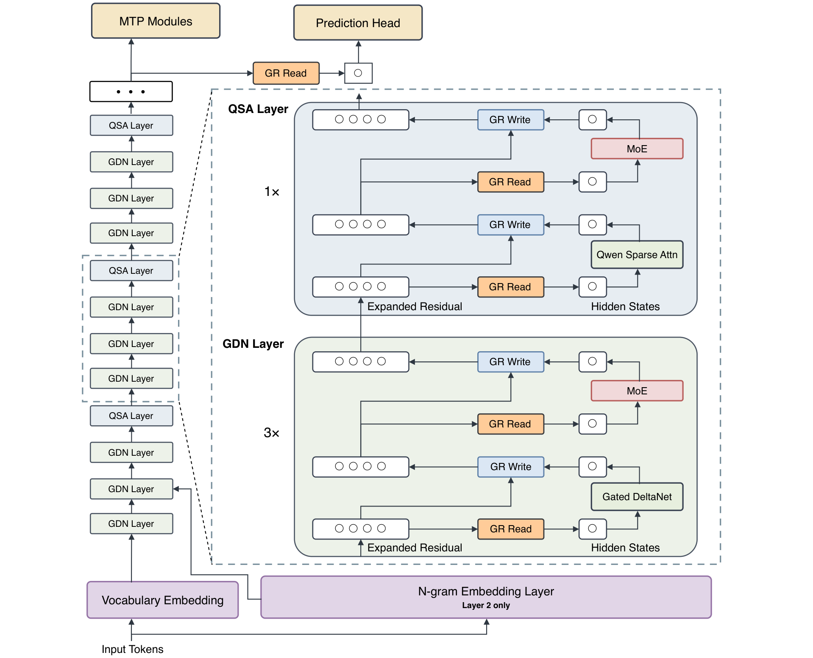
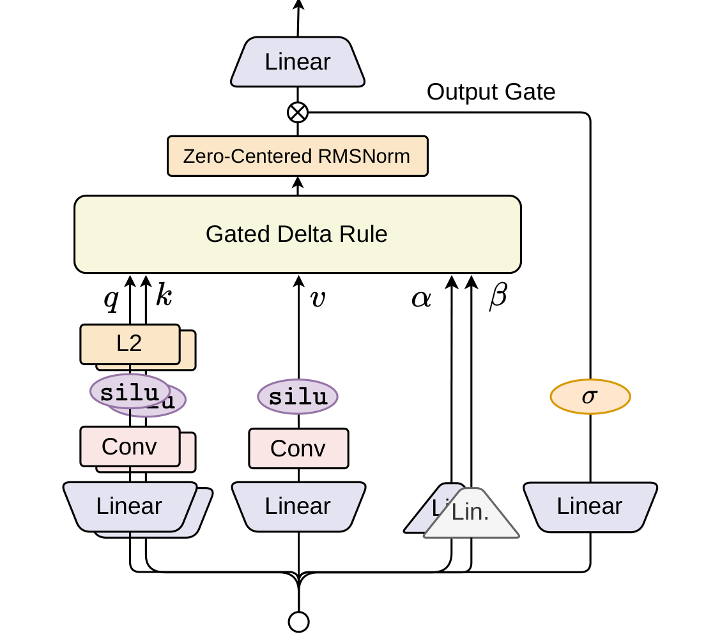
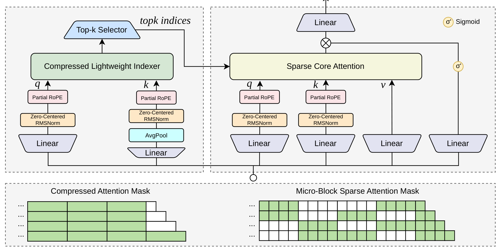
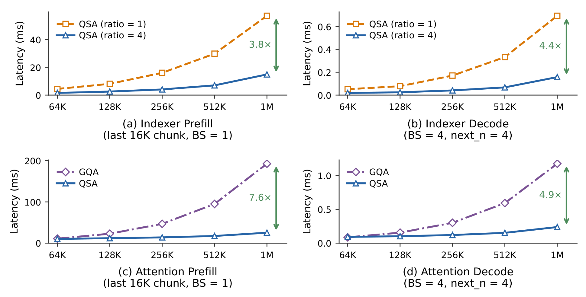
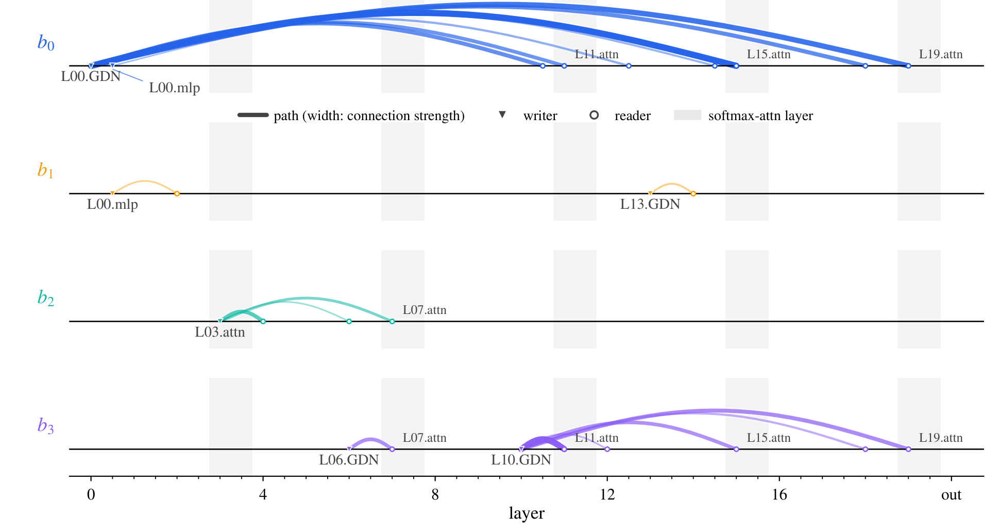

# Qwen3.8-Next 架构报告

## 来源

- **PDF**：`raw/2608.30320v1.pdf`
- **标题**：On the Design of Qwen3.8-Next Architecture: Evaluation, Efficiency, and Training Stability
- **日期**：first published 2026-08-31（arXiv:2608.30320v1）；PDF 页眉 2026-09-01
- **团队**：Qwen Team；通讯作者 Zihan Qiu、Zekun Wang、Xiao Li、Yanpeng Li、Yang Xu、Yixuan Wang、Huaqing Zhang、Rui Men、Bo Zheng、Dayiheng Liu
- **arXiv**：[2608.30320](https://arxiv.org/abs/2608.30320)
- **kernel**：[github.com/QwenLM/FlashQLA](https://github.com/QwenLM/FlashQLA)
- **模型**：[Qwen3.8-Flash-Next](../models/qwen3.8-flash-next.md)

这是 Qwen 混合栈第一次有独立架构报告。[Qwen3-Next](qwen3-next-blog.md) 只有官方博客，[Qwen3.5](../models/qwen3.5.md) 的 hybrid 细节主要靠 HF config。本篇把 3:1 GDN 混合、稀疏全局层、残差加宽和 Muon 配方写成可核消融。

## 核心结论

Qwen3.8-Flash-Next 是 125B 总参 / 6B 激活的稀疏 MoE，另有 51B n-gram embedding 表放在加速器外。设计目标是用更小预算保住上一代 397B-A17B 旗舰的预训练质量。Table 11 对 14 项 base benchmark：领先 Qwen3.7-Plus-Base 8 项，其余最多落后 2.6 分（MultiPL-E 79.09 vs 81.68）；激活参数约 1/3、训练 token 约 1/3、训练 FLOPs 约 1/9（原文确证，Abstract / §4 / Table 11）。

四件架构组件各堵一个瓶颈（原文确证，§1）：

1. **3:1 GDN / 全局注意力混合**：三个 GDN 层压前缀到固定状态，每四层一个全局层做 token 级检索。
2. **Qwen Sparse Attention（QSA）**：continued pretraining 时把全局层换成 micro-block 稀疏注意力，indexer 本身从 $O(n^2)$ 降到 $O(n^2/r)$。
3. **Gated Residual（GR）**：残差加宽到 4 支，elementwise 门读入；加宽给容量，门决定怎么花，并提供稳定训练所需的 rescaling。
4. **单层 n-gram embedding**：插在 Layer 2，表从主机预取，几乎不加每 token FLOPs。

作者把每项改动放在三条轴上一起看：loss + 下游、训练/prefill/decode 成本、超参最优与稳定性。三条轴会打架：n-gram 词表越大 loss 单调降、下游饱和；残差读/写做成数据相关只降一点 loss，但 benchmark 涨一截；稀疏写支路预训练几乎免费，后训练明显变差（原文确证，§1 Evaluation）。

> Figure 1: Qwen3.8-Flash-Next architecture. Token mixing alternates three GDN layers with one QSA layer per block of four. Every sublayer reads and writes through GR, which widens the residual stream and gates the read elementwise. An n-gram embedding layer at Layer 2 scales capacity off the accelerator via host-memory prefetching. The MTP module reuses QSA indices across speculative decoding steps.（§2 / Figure 1）

## 架构与训练

### GDN 混合（§2.1.1）

相对 full attention，GDN 把前缀压进固定矩阵状态；相对 SWA，它按内容更新这块记忆，而不只靠深度把窗口外信息传上去。消融是 28 层 25B-A3B、先 400B@4K 再 80B@32K，两种 hybrid 都是每四层一个全局层，SWA 窗口 128（原文确证，Table 1）：

| 架构 | MMLU | MATH | BBH | MultiPL-E | Avg. |
| --- | ---: | ---: | ---: | ---: | ---: |
| Full attention | 62.65 | 49.40 | 63.78 | 39.73 | 49.87 |
| SWA hybrid | **66.30** | 45.48 | 65.88 | 41.93 | 51.15 |
| GDN hybrid | 66.26 | **53.98** | **68.72** | **47.48** | **53.81** |

GDN hybrid 在 9 项里赢 Transformer 8 项、赢 SWA hybrid 7 项。这补上了 [Qwen3-Next 博客](qwen3-next-blog.md) 没给数字的「GDN > SWA」主张，但作者写明：表只motivate hybrid，**不能单独指出每一项增益来自哪一块**（原文确证，§2.1.1）。

实现相对 [GDN 原论文](gated-delta-net.md) 有两处生产改动（原文确证，§2.1.1、Eq. 11）：输出门从 SiLU 换成有界 sigmoid；全模型 RMSNorm 用 Zero-Centered RMSNorm（沿用 Qwen3-Next）。训练 kernel 是 FlashQLA（TileLang），相对 FLA Triton 前向 2–3×、反向约 2×。全局层保留 RoPE：预训练时 NoPE 几乎无差，后训练 endless generation 明显更高，所以不用 NoPE。

> Figure 2: The Gated DeltaNet token mixer. The projected query, key, and value streams pass through short causal convolutions; queries and keys are L2-normalized before the gated delta recurrence. The decay gate αt and write gate βt control the recurrent update, while a sigmoid output gate modulates the zero-centered RMS-normalized output.（§2.1.1 / Figure 2）

### Qwen Sparse Attention（§2.1.2）

QSA 走 [DSA](../concepts/deepseek-sparse-attention.md) 那条稀疏路线（引 Liu et al. 2025a），但 indexer 先把 key 压成 micro-block，再打分、选 top-k、展开回 token。目的是压 indexer 自己的 $O(n^2)$，而不是再叠一层跨层复用。作者认为 hybrid 栈里 GDN 层会打断层间相似度，**层内压缩比跨层共享更合适**（原文确证，§2.1.2）。

生产配置（原文确证，Implementation Details）：backbone 和 MTP 的全部 full-attention 层换成 QSA；indexer 是 4 query head / 1 shared key 的 MQA；token budget $K=2048$、压缩比 $r=4$（每 query 最多 512 个完整块，外加未填满的尾块）；partial RoPE 用 128 维里的 64 维，与 core attention 一致。Key 先 AvgPool 再编位置，避免不同旋转相位被平均掉。

> Figure 3: Overview of Qwen Sparse Attention (QSA). The QSA indexer (left) uses a compressed causal attention mask to score key blocks and select the top-k indices. These indices are expanded into a micro-block sparse attention mask for sparse core attention (right).（§2.1.2 / Figure 3）

训练在 256K continued pretraining 上分两段（原文确证，Training Details）：

| 阶段 | 训什么 | 步数 / 数据 | 学习率 |
| --- | --- | --- | --- |
| Dense distillation | **只训 indexer** | 1,000 步 × 8 条 × 256K ≈ 2B token | $1\times 10^{-3}$ |
| Sparse training | backbone + indexer 联合 | 8,000 步 × 96 条 × 256K ≈ 200B token | $2.5\times 10^{-5}$ |

Teacher 是各 head softmax 求和再 L1 归一；max-pool 到块级后对 indexer 做 KL。Stage 2 的 KL 只在选中的 top-$K_B$ 块上、先把 teacher 概率再归一。Fig. 4 上 QSA 与 full attention 的 LM loss 差大约 $10^{-4}$。

下游：短任务 8 项平均 75.9 → 76.8，7 项不低于 dense（Table 2）。长上下文更明显（Table 3）：

| 设定 | Full Attn | w/ QSA |
| --- | ---: | ---: |
| RULER 512K–1M | 90.08 | **93.00** |
| MRCR 512K | 30.66 | **40.53** |
| MRCR 1M | 20.71 | **26.44** |
| 两套宏平均 | 78.76 | **80.93** |

相对 [IndexCache](indexcache.md) 的 training-aware IndexShare：QSA 在相对 indexer 延迟 0.25 时追平 full attention；IndexShare 在 0.5（两个被三层 GDN 隔开的全局层共享一份 index）仍低于基线（Fig. 5a）。4 个 indexer query head 够用（Fig. 5b）。

1M 上下文 kernel 级：indexer $r=4$ 相对 $r=1$ 为 prefill 3.8× / decode 4.4×；含 indexer + sparse core 的 attention 模块相对 paged GQA（FlashInfer）为 prefill **7.6×** / decode **4.9×**（原文确证，Figure 6）。这是 kernel 级，不是端到端 serving。

> Figure 6: Kernel-level latency of QSA across context lengths during prefill and decode. Panels (a,b) compare indexer latency under different compression ratios, while panels (c,d) compare kernel-level attention latency between dense GQA and QSA, including both the indexer and sparse core attention.（§2.1.2 / Figure 6）

MTP 四步 speculative 的 mean accepted length 几乎不变（Table 4，4.06 → 4.07）；draft 复用 QSA top-k，做法引 [GLM-5](glm-5.md)。

### Gated Residual（§2.2）

GR 把残差加成 $n_r=4$ 支，再和 GatedNorm 合成一个读算子。加宽本身（静态 AltUp 式加权求和、round-robin 写回）在 25B-A3B、400B token 上就能把 loss 降约 0.01。在静态加宽之上，数据相关的读/写只再降 0.002 loss，但平均 benchmark 从静态 +1.58 再加 +1.98（Table 5）——又一次 loss 与下游不同步。

最终设计（原文确证，Eq. 29–34）：

- 每支独立 RMSNorm。
- 从全部支路预测 elementwise sigmoid 门（瓶颈秩 $d/8$），门控后平均成 block 输入。
- 写出是每支一个数据相关标量，写到**所有**支路。
- **丢掉 $H_{res}$**（支路混合矩阵）：消融显示几乎无增益，还少一次残差整读。
- 注意力子层和 MLP 子层各有一份 GR；它替换 pre-norm，不再叠一层 Norm。

25B-A3B、560B token 上 GR 平均 54.66，对 mHC dynamic 的 54.47、pre-norm 的 50.91（Table 5）。相对 [Attention Residuals](../concepts/attention-residuals.md)：28 层上 Full AttnRes 与 GR 都到 loss 1.762，Block AttnRes $S=4$ 差 0.011；48 层上 GR 1.707 vs Block AttnRes $S=4$ 的 1.711（Table 6）。

没有 $H_{res}$ 时，每支就是过去输出的累加器，可以精确拆读者输入。20 层 MoE 上，780 条有序路径里 $\Delta_{uv}\ge 0.05$ 且跨至少一层的只有 21 条：五份 GR checkpoint 都是**一支走长程、三支走局部**；长程支典型跳 10.9 层，其余 3.4–3.9 层。Layer 0 GDN → Layer 15 attention 的份额从无 GR 的 0.020 升到 0.138，并且从第 10 层到第 19 层的读者都停在 0.072–0.138。长程读主要落在 softmax 全局层——作者把全局层写成 GDN 压缩掉的历史的汇合点（原文确证，§2.2 / Figure 7）。总跨层信息量几乎不变（加权平均跳数 3.97 vs 3.91）；GR 放大相邻和超长程，中程（skip 2–12）集体让出 3.21 的份额。

> Figure 7: Cross-layer paths added by GR. Each row corresponds to one residual branch; a connection runs from the sublayer that wrote into that branch to a later sublayer that reads it back.（§2.2 / Figure 7）

推理侧：残差状态用 FP8（门把写入幅度限制在窄范围）；读、写各融成一个 kernel。试过每层只写门值最高的两支：预训练几乎无伤，**后训练明显变差**，所以没采用（原文确证，Inference Efficiency）。

### N-gram embedding（§2.3）

容量加在 backbone 外：多头哈希查表，经 contextual gating 注入残差；实验固定 300 tokens per active parameter。单层就够，多层分摊同一参数预算没有稳定好处。放 Layer 2，好让主机预取和第一层计算重叠（Table 7）。

固定总参、拿 expert 数换 n-gram 词表时，loss 在 10× 词表（约 25% 参数）最低，下游没有清楚超过纯 MoE 的收益（Table 8）——作者据此认为 n-gram 与 MoE **不是同一类容量**，后面改为 **MoE 预算固定、只加 embedding 参数**。词表从 20V 扩到 200V（$V=250$K，Qwen3.5 tokenizer）：loss 单调降，下游先涨后饱和或抖动；中文 C-Eval / CMMLU 随词表继续涨（Table 9）。生产模型是额外 51B 表，不进加速器常驻。

与 [Engram](engram.md) 的对照（推断 / 本页综合，Qwen 报告未引用该文）：两边都是 Layer 2 哈希 $N$-gram + 主机预取 + contextual gating，都认为这不是「更小的 MoE」。分歧是 iso-param 重分配——Engram 报 U 形最优在把 20–25% 稀疏预算从 experts 改给表，且下游胜过纯 MoE；本报告 Table 8 则说同样替换没有清楚的下游收益，所以生产选择外加表而不是抠 expert。模块件、backbone 和评测都不同，见 [条件记忆](../concepts/conditional-memory.md)。

### 优化与稳定性（§3）

**Muon** 用在真正当线性映射的二维权重（attention / GDN 投影、routed 与 shared expert 的 fc1/fc2、n-gram 的 key/value 投影）。AdamW 留给输入/输出 embedding、MoE router、GR 低秩投影；n-gram 表用 Adam 且关 weight decay。Router 上 Muon 会放大早期波动；GR 低秩矩阵太瘦，正交化帮不上忙（原文确证，§3.1）。

融合存储的 qkv / GDN 输入 / SwiGLU fc1 在正交化前要拆开，否则奇异方向在无关子块间混合，且 $\gamma(A,B)$ 会按拼接形状算。qkv 与 GDN 输入按 head 拆。Newton–Schulz 8 步，系数用 Polar Express；分布式用 Canzona 按估计正交化 FLOPs 重切 DP，并用 CUDA graph 吃掉拆开后的一串小 kernel。

新架构 + Muon 让最优 batch 和学习率上移，学习率随模型变大衰减更慢。20 层 10.8B-A0.89B、4T token：新拟合 $B=25.2$M 相对旧配方 $B=12.6$M 终局 loss 低 $7.2\times 10^{-3}$；从 6.3M ramp 到 25.2M 不更好，还多 18.8% optimizer step，生产不用 batch-size warmup（§3.2 / Figure 8）。48 层 156B-A7B、419B token：新拟合平均 60.55 vs 旧配方 56.41（Table 10）；最优点附近 $\sqrt{2}$ 倍学习率、+25% batch 都在噪声里。

压力测试把学习率固定在最优的 2×/4×（Wortsman et al. 2023）。4× 时 Qwen3.5+AdamW 每 10k step 183 次 loss spike，clip 阈值过了 213/19932 步；Muon+GR **零 spike、从未过 clip**（§3.3 / Figure 10）。单独打开 GatedNorm（AdamW、结构不变）把 3× 最优 LR 的 spike 从 32.0 降到 3.2 / 10k step。作者的机制解释：高学习率需要 rescaling；没有显式门时网络靠激活 outlier 凑，有门则直接做（原文确证，§3.3）。

生产学习率下前 276B token：相对 Qwen3.5+Muon，加 GR 降 loss 0.026，完整 Flash-Next 再降 0.032，合计 0.058；带门的 run 梯度 p99.9 约为无门 Muon 的 1/4.2，且是唯一没过 clip 的一方。全尺寸训练「没有一次 loss spike 或梯度范数异常波动」，也没用 qk-clip / SwiGLU-clip（原文确证，§1 / §3.3）。

## 后训练

这是预训练架构报告，没有 SFT / RL 配方或 instruct 分数。组织段写了 “base and post-trained models”，§4 实际只给 base。后训练只作为否决信号出现：NoPE 预训练看不出差别、后训练容易 endless generation；GR 稀疏写预训练几乎免费、后训练变差。QSA 的 RL 稳定性未测。

## 评测要点

Table 11 是 base 模型、14 项预训练基准，对照 Qwen3.8-27B-Base（27B dense）和 Qwen3.7-Plus-Base（397B / 17B 激活）。Flash-Next 14 项全胜 27B；对 397B 旗舰 8 胜 6 负，最大分差 2.59（MultiPL-E）。

| 项 | Flash-Next 125B/6B | 27B dense | 397B/17B |
| --- | ---: | ---: | ---: |
| MMLU | 90.36 | 87.51 | **90.43** |
| MMLU-Pro | **73.23** | 68.60 | 70.90 |
| SuperGPQA | **51.36** | 44.86 | 48.42 |
| MATH | 72.78 | 60.54 | **74.38** |
| MultiPL-E | 79.09 | 74.50 | **81.68** |
| SWEBench-Pretrain | **50.99** | 41.66 | 49.24 |
| MGSM | **89.33** | 86.37 | 85.42 |

SWEBench-Pretrain 是作者自建的预训练变体：给 base 题面和相关文件，生成 diff，用与 golden patch 的序列相似度打分，**不是**标准 SWE-bench Verified（原文确证，§4 脚注 1）。

QSA 的 1M 数字是 RULER / 8-needle MRCR，不是 agent 长轨迹。效率数字是 attention kernel，不是完整 decode 系统。

## 待追问

- **生产模型的层数、hidden、expert 数、路由与负载均衡未披露。** 125B/6B 只有总量；消融用过 25B-A3B 与 156B-A7B，不能外推专家配置。
- 摘要里的「397B-A17B predecessor」在 Table 11 写作 Qwen3.7-Plus-Base，引言又引 2026-02 的 Qwen3.5 博客。两者是否同一权重、只是发布名不同，原文没写清。
- QSA 只在 CPT 从 dense 全局层改过来，没有 from-scratch sparse；RL 下 top-k 是否要像 GLM-5 那样冻 indexer、用 deterministic topk，完全没测。
- GR vs Full AttnRes 在 28 层 loss 打平，生产为什么选 GR：报告给的是去掉 $H_{res}$ 的访存和门的稳定性，没有同预算的下游 head-to-head。
- n-gram 51B 的实际命中率、主机预取延迟和多机分片，只有「可 prefetch」的设计陈述。
- 组织段承诺的 post-trained 评测没有出现。

## 相关页面

- 模型：[Qwen3.8-Flash-Next](../models/qwen3.8-flash-next.md)
- 前作：[Qwen3-Next 官方博客](qwen3-next-blog.md)、[Qwen3.5](../models/qwen3.5.md)、[Qwen3](qwen3.md)
- 机制前身：[Gated DeltaNet](gated-delta-net.md)、[Gated Attention](gated-attention.md)、[IndexCache](indexcache.md)
- 概念：[线性注意力与 delta rule](../concepts/linear-attention-and-delta-rule.md)、[注意力门控](../concepts/attention-gating.md)、[Attention Residuals](../concepts/attention-residuals.md)、[DeepSeek Sparse Attention](../concepts/deepseek-sparse-attention.md)、[跨层索引复用](../concepts/cross-layer-index-reuse.md)、[高效长上下文注意力](../concepts/efficient-long-context-attention.md)、[多 token 预测](../concepts/multi-token-prediction.md)、[MoE 前沿模型扩展](../concepts/moe-frontier-model-scaling.md)、[条件记忆](../concepts/conditional-memory.md)
- 并行的 $N$-gram 模块：[Engram](engram.md)
- 比较：[稀疏注意力机制对比](../comparisons/sparse-attention-mechanisms.md)、[2026 前沿模型技术报告对比](../comparisons/2026-open-model-technical-reports.md)
